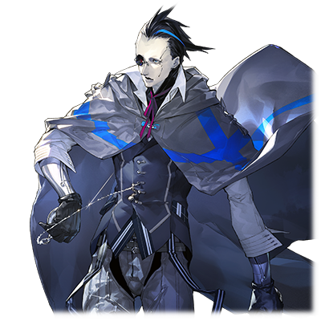

# 布鲁·斯坦因

| 角色信息   |          |
| ----------- | ----------- |
|  名称 |

布鲁·斯坦因
远古之蓝

|年龄 |不明
|职业|被放逐的机械种
|对应乐曲|X7124 
|初出|Chunithm Paradise Lost|

## Episode 1 地上之光

>现实的世界到底是多么的广大啊……。我从这片大地，感受到了整个星球的气息。

——与我有着相同名字的你。正因为这个世界有你，这个世界才会持续下去——

嘎、嘎。

全身由机械所组成的男人，正眺望着立于遥远的地平线之处的细长高塔。

他的嘴角露出一丝笑容。

那些沉睡在那个构造体——那个电子的乐园之中，沉睡了成百上千年，几乎等同于永久的人类们，简直就像是被囚禁在炼狱之中的囚犯一样。

而面前这片广阔的大地，对于眼前的男人来说，在无尽的宏伟之余，却还有着点寂寥。

当男人来到这个世界的时候，这个世界，仍旧还在再生的途中。

男人，在这个未经开化的世界中徘徊着。

不管是在皲裂的大地缝隙中萌芽的绿叶。

还是在晦暗厚重的云层之中漏出的点点光明。

亦或是直冲天际，高耸入云的山脉。

或者是一望无际，看不见边界的黄沙戈壁。

男人瞪大了眼睛，为的是将这一切的景象都刻在脑海里。

这一切，都不是人为的景观，而是大自然的鬼斧神工。而男人，不知何时，已经被这些东西深深地吸引住了。

伴随着无上的喜悦。

他从怀中掏出了一颗蓝色的矿石仔细打量着，露出了怀念的眼神。

他的深情十分平和，似乎神游到了某个遥远的世界之中。

“‘远古之蓝’（OLD BLUE）吗。凭着自己的意志离开乐园，失去了力量的我，已经没有足以用名字定义的价值了——”

就在这时，他的脑中闪过了一个念头。

就像是在反复确认一般，他点了好几次头，之后自言自语道。

“对了。我就叫做布鲁·斯坦因吧。”

也许这个名字，正是男人的真实想法。相比较这个广大的世界，自己不过只是沧海一粟罢了。

然后，男人畅想着未来。

畅想着这片一望无际的大地的未来。

还有电子的乐园最终的命运。

这两个世界到底会以什么样的形式碰撞，变化呢？

这个问题，就算是神，也未必能参透。

## Episode 2 不过是如梦似幻

>框架主脑和涅墨西斯的战争。在这未来所等待的，只有灭亡。

曾经，我所存在的电子的乐园——Metaverse，从某天起，步入了混沌的时代。

——那就是秩序之王死去的那一天。

将乐园握入手中，肆意支配着整个世界的王，被几名由人类和程序融合而成的少女们打倒了。

从此，力量的均衡被打破，Metaverse陷入了和涅墨西斯的长久战争之中。

这场由框架主脑和涅墨西斯的战争，甚至连人类都被卷入其中，最终变成了足以决定整个乐园的命运的大战。

不用说，我所生存的环境也受到了影响。

在理解了这件事的瞬间，我的心中仿佛激起了惊涛骇浪。

再这样下去的话……我的实验就要停滞不前了！

那个制造出“究极生命体”的梦想！

愈发激烈的战火燃烧到了各地，一片片的领域被破坏，最后，就连我的工房都被一个个破坏掉。然后，不知何时，我流落到了Metaverse的最外周领域。

即便是在世界的尽头，框架主脑和涅墨西斯的战斗仍旧在进行。

就在我对这一事实习以为常甚至有些头晕目眩的时候——我看到了那名“苍之少女”。

明明是人类之身却能跟“混沌之器”打的不相上下，这样的她绝对不是寻常之辈。

她是跟曾经的三姐妹一样，经过相应的处理，被植入了战斗的力量的——“代理构成体”。

“真是的……根本感觉不到那个家伙有些许的讲究啊。”

那种只追求合理性，没有任何意思的做法，毫无疑问是迪安的手笔。

这就是那个家伙对于“究极生命体”这一命题的解答吗。

那么，在这激烈的斗争的前方，想必结果也不会好到哪里去吧。

我可不会接受这样暗淡无光的未来啊。

那么，我现在该干的事情就是——

“是时候，和乐园作别了吗。”

## Episode 3 循环往复的历史

>离开乐园的我，留存于心中的，只有空虚。曾经所拥有的愿望，探求心，都已经逝去。

刚刚从电子的乐园离开不久。

曾经令我废寝忘食，如痴如醉的，对究极生命体的渴望，立刻就消失的无影无踪。

现在的我，就像是个空壳一般。

当来到现实世界之时，作为容纳我的全新容器的机械身体，还是寄宿于其中的我，面对这个世界毫无用武之地。

我就这样，漫无目的地，在这个世界之中徘徊。
  
从灰暗的云朵中偶尔漏出来的蔚蓝天空。

波涛汹涌，掀起百尺巨浪的昏暗大海。

不管哪个，都不是些美丽至极，需要瞪大眼睛尽收眼底的绝顶美景。

然而。

不管哪个，却都充满了无比的生命力。而这，才是令我目不转睛的理由。

从这些景色中，我看到了大自然的怒吼，感受到了它正猛烈祈求着从一片荒芜之中再生的愿望。

而这充满生命的气息，吹进了我的内心中，填满了我心中的那份空虚，令我的灵魂不禁鼓动起来。

“太棒了……这实在是太棒了啊啊啊啊啊！！”

——从此之后，我就开始四处旅行，游历着这个正在缓慢复兴着的世界。

在旅途之中，我见到了正在修复着大地的“真人”们。他们曾经就像机械一样，只为了恢复大地而进行着工作，却从某一天开始，开始像拥有自我的人类一样开始了行动。

我很快就察觉到，这一切都是从Metaverse中发生的异变为起因开始的。

“真人吗……”

他们虽然在能力方面比人类要强大更多，但是既然以人为原型制作出来，当他们拥有自我意识的时候，其结果不言而喻。

从一开始，这些真人就没有未来。终有一天，也会踏上跟旧的人类一样的道路吧。

就像那颗沉入地平线的夕阳一般。

“真是令人心潮澎湃啊。真想让WISEMAN也看看。”

从那之后，不知道又劲过了多久。

我意料之中的事情终于还是发生了。

——一场足以将世界一分为二的大战打响了。

美丽的大地，被真人们再一次污染。

## Episode 4 蕾娜

>我还以为再也不会有可能有交集的……难道说身为机械身体的我，也会意识到“神”的存在吗？

再次再在大地上卷起战乱的真人们，最终将魔爪伸向了我的隐居之地，安特路亚。

我遇见了一名少女和少年。少女名为约拿，少年名为基德翁。

他们是为了躲避与他们敌对的势力，才来到这里的。

虽说我不想介入争端之中……不过，作为同样曾被同胞所追杀的“异端”人士来说，能找到个说话的对象实属难得。

不禁感到兴奋的我，竹筒倒豆子一般地讲了一大堆事情。

在我终于说完之后，我便将那些真人们送到了他们着陆的飞船那里。

然而——我就在那里见到了“她”。

本来绝不可能相遇的存在。

我就这么遇到了那个命运中的少女。

  

——真的很像啊。

  

自称为“蕾娜”的她，令我想起了曾经协助过我的实验的“阿尔特弥斯”，两人，有股十分相似的气息。

既然她从电子的乐园来到这里，并且被人称作“归还种”的话，那座乐园想必是已经完成了一个阶段，进入了回归现实世界的下一个阶段吧。

而我居然能在这极其关键的转换期见到她……这岂不是命中注定！？

当她身影映入我的眼帘的时候，我的内心涌现了一股冲动。

那是我正不断涌现出的好奇心。

——还有足以让我疯狂的“渴望”。那是我自从来到这个世界以来，从未燃起的一股烈火。

我想要亲眼，亲身，亲自见证这个少女所带来的结果。我想尽可能近地观测她，她的行动、她的选择，到底会对这个世界造成什么样的影响！

“——我叫布鲁·斯坦因。是曾经管理着电子的乐园的神明之中的，最末尾的一席。”

将激动的心情收起，我冷静地报上了自己的名号。

## Episode 5 沉睡于此地之物

>如果要赢过“革新者”的全面战争的话，就需要解放那股被封印的力量。

“皮阔特”号的船内，被沉重的空气所支配。

因为跨越了强硬派“革新者”们所设下的重重伏击的他们，却在先前的战斗中，失去了一名生死与共的战友。

“……啊呜……啊——啊啊啊……”

约拿抱着哭成泪人的蕾娜，蜷缩着坐在地上。

米莉安姆也难掩失去基德翁的悲伤，只能任由着这股不知该去向何方的愤怒在心中沸腾着，颤抖着。

唯一值得庆幸的是，我们的船船体损伤不大，要是顺利的话，一个星期左右就能到佩尔修斯殖民地了。

然而，还留着些悬而未决的事情。

那些在安特路亚遭遇的“革新者”的追兵们，还没有放弃。

要是他们再叫上更多的援军的话，我们是绝无逃出生天的可能的。

（不管怎样，都要尽可能避免跟那些真人们正面冲突。那么，不如反过来，我们创造一个迎击他们的机会，如何？）

只是把身为归还种的蕾娜送到佩尔修斯殖民地之后，是绝不可能就这样万事大吉的。而且，那些“革新者”们绝对不会善罢甘休。所以，跟他们始终是要决一死战的。

虽然我并未见过那个指挥着“革新者”们的首谋，但是，被痴妄和执念所占据的人，其结果从最初就已经命中注定了。

等待他们的，只有毁灭一途。

在这前方，没有任何东西。

所以，我们需要能够跟他们对抗的力量。

我望向了屏幕。出现在屏幕上的，是一大片陡峭而秀丽的山脉正在我们的脚下连绵不绝地延伸着的光景。

我记得……确实是在这里的。

“米莉安姆，能不能现在前往那个坐标呢？”

“……到这种层峦叠嶂的地方，是要做什么？”

“因为那里沉眠着能跟那些‘革新者’们对抗的‘力量’。”

“力量？”

“是的。只要有那个的话，就算是千军万马，也可一战。”

那里——正是塞雷基亚。

沉睡于那里的东西，将成为我们反击的关键。

必须趁他们组织正式的攻击之前，赶紧收入囊中才行。

## Episode 6 微小的意志

>虽然仍旧只是微小的光点。但，她想必总有一天会为这个世界带来变革吧。

当我们改变目的地前往塞雷基亚之后，又过了几天。

虽然没有“革新者”来袭，不过现在仍旧不能松懈。

当我正在甲板上吹风的时候，我突然听到了舱门打开的声音。

“哈啊……布鲁斯坦因先生？早上好……”

“早上好，蕾娜君。今天似乎比平时还要晚起床的样子……看起来，似乎你已经看开了，对吧？”

听到这句，蕾娜露出了稍显困惑的表情之后，用那双银色的双眼看向我。

“倒也不是就这么过去了。只是，要是我一直这么消沉下去的话，那不但对不起约拿和米莉安姆，还对不起基德翁啊。”

“嗯，原来如此。”

“所以，我无论如何都必须向前进。”

在那不安的语气之中，我感觉到了一股明确的意志。

虽然现在仍旧微弱，但我似乎能够理解为何Metaverse会选择了她作为前往大地的人选了。

  

“那个，为什么布鲁斯坦因先生会对我那么好呢？”

面对这个质问，我眯了眯眼睛，抬起了嘴角。

“没什么，只不过是‘好奇心’使然罢了。”

“……咦？”

蕾娜露出了困惑的表情。就在这时，船内响起了警报声。

“是追兵！立即准备战斗！”

“……看来他们比想象的还要快啊。我们也赶紧去舰桥吧。”

“……啊，好的！”

——米莉安姆确认到全员来到舰桥之后，就开始解说起现在的情况。

“敌机只有一艘。从样子上看应该是之前在废弃都市和我们交战的‘革新者’的那艘。想必他们别说支援了，连像样的补给都没做，就急急忙忙地向我们追了过来吧。”

“那么，追兵应该会比想象的还少吧？”

米莉安姆回答了约拿的问题。

“在之前的交战中，我已经干掉了他们一大半的人。现在他们残存的战力应该跟我们差不多吧。”

“那么，只靠我们应该也能够对付吧。”

“虽然想在塞雷基亚再跟他们交战，但是现在看来是不得不战了啊。”

现在我们距离塞雷基亚，已经只有不到两个小时的飞行距离了。但是，如果以敌人的飞船的飞行速度换算的话，他们肯定会在我们到达塞雷基亚号之前就追上我们的。

于是，米莉安姆干脆将计就计，先行在我方有利的地方截击他们。

## Episode 7 敢死队

>绝境会刺激人的进化。这就是这些模仿人类而制造出来的真人们的可能性吗！

最终，蕾娜一行人决定在塞雷基亚殖民地附近的废墟中迎击敌人。

当布鲁斯坦因和约拿设置完陷阱不久，敌人就来到了这里。

乘坐着飞艇来到这里的，有四个人。

数名士兵由驾驶着武装二轮车的彪形大汉——萨乌尔带领着，降落在了此处。

“——就是现在！”

布鲁斯坦因毫不犹豫地启动了设置好的地雷。约拿也趁着陷阱启动的瞬间，从高高的山崖上发起了狙击。

坐镇于后方的，是架着反器材步枪“和平缔造者”的米莉安姆。

虽然在三人的精妙合作之下，成功阻止了敌人的前进，但是仅仅四人的小队却爆发出了前所未有的气势。

他们不顾自身的伤势，向着敌阵发动了决死的突击。

“——这究竟是怎么回事？”

“这些家伙难道是抱着同归于尽的想法来的吗……”

似乎对他们来说，就算要葬身于此也在所不辞的样子。

甚至有人利用已经死去的士兵身体，提前引爆了陷阱的行为。

这副鬼神一般的模样，仿佛小队中的几人都变成了只为一个目的而行动的群体一般——

“不会让你们再前进了！”

敌人剩下三人。

面对即便被米莉安姆射击破坏武装二轮车却仍旧气势汹汹的萨乌尔，布鲁斯坦因发动了作为最终底牌的防御障壁，试图阻止他们。

然而，就在这个瞬间——

周围突然出现一道阴影。

注意到这点往上一抬头的布鲁斯坦因看到的，是仿佛瞄准了这个时机一般，直直的向着障壁飞去的飞行船。

“什么……！？”

倾注了飞行船全体质量的撞击，轻松撞开了防御障壁。

爆炎和烟雾席卷周围，能见度变得极低。就算是神枪手的约拿和米莉安姆，也很难在这样的浓烟之中狙击敌人。

萨乌尔并未放过这个机会，趁着场面一片混乱的时候，冲破了防卫网。

然后——

“终于……找到了啊啊啊！！”

终于冲到皮阔特号面前的萨乌尔，随着怒吼声举起了武器。

## Episode 8 困兽之斗

>神明，偶尔也会给人类带来试炼。对于蕾娜君来说，这应该也是其中之一吧。

由于“革新者”的飞船撞上了防御障壁，约拿他们前往皮阔特号的去路被挡住了。

如果要前往蕾娜所在的地方的话，要么将还在燃烧着的飞船的火灭掉，要么就只能绕远路了。

就在布鲁斯坦因正在犹豫的时候，从燃烧的飞船中冲出了一个人。

那是和萨乌尔一起行动的，“革新者”的一名士兵，阿比纳达夫。

“你们的对手是我！！别想往前再走一步了！！”

“看来……现在不是绕路的时候了啊！”

即便身上受伤，阿比纳达夫还是举起两把全自动手枪向着附近扫射了一通。

那副战斗的样子可谓是困兽之斗，即便面对两人的围攻也不落下风。

但是，当两人躲在掩体背后看到他仍旧在扫射的样子，约拿才注意到，敌人的目的只是拖延自己的时间而已。

约拿打开通讯机向布鲁斯坦因下达了指示。

“布鲁斯坦因，等敌人停止攻击之后，你能拖住对方吗？我会趁这个瞬间开火的。”

“明白。”

下一刻——敌人停止了攻击。

“就是现在！”

布鲁斯坦因从掩体中飞奔出来，向着对方发动了威吓射击。

“机械种！！你就死在这里吧！！”

布鲁斯坦因成功吸引住了敌人的注意。约拿趁机将步枪“砍刀斧”转为了狙击模式，瞄准了敌人。

当阿比纳达夫注意到的时候，已经太迟了。

子弹贯穿了他的胸口正中央。

“革新者……荣光……永……”

两人确认了阿比那达夫已经死去之后，赶忙将船体的火焰灭掉，奔向了蕾娜她们所在的地方。

当两人到达那里的时候，战斗已经结束了。

“革新者”全部都被打倒，在地上躺着，一动不动。

而约拿他们看到的，是正跪倒在地上，拖着一条血痕，正拉着蕾娜向着皮阔特号的船体缓缓移动过去的米莉安姆。

## Episode 9 染红的战场

>不能就这样放着她不管。光是这点，就足够驱使我行动了。

“——安姆！米莉安姆！”

蕾娜抱着米莉安姆，拼命地叫喊着她的名字。

“为什么……为什么根本无法止血……我该怎么办……！？”

“蕾娜！！”

飞奔而来的约拿和布鲁斯坦因看到面前的惨状，都不禁倒吸一口凉气。

蕾娜虽然已经做了应急处理，但是伤口完全无法堵住，血液正渗过绷带，止不住的滴了下来。

再这样下去的话，米莉安姆就会因失血过多而死的。

“我、我才刚恢复意识没多久，米莉安姆就！……明……明明直到刚才还有意识的！我、我该做什么才能够救米莉安姆！？”

“必须赶紧将伤口堵住……不过这样的话……”

约拿脸上挂满悔恨的表情，紧咬着嘴唇。

米莉安姆以腹部为中心，被射中了好几处。光是在缝合伤口的时候，米莉安姆估计就撑不住了。

就在这时，布鲁斯坦因走了上来。

“这里就交给我吧。”

然后，布鲁斯坦因仔细地扫描了一下米莉安姆的身体，确认没有弹片留在体内。

“约拿，为了不让米莉安姆急忙之中把舌头咬断，拿块布堵住她的嘴。然后，蕾娜君，能拜托你一起压住米莉安姆的身体吗？”

“这到底是要做什么……”

“只能用点野路子了。”

等到两人准备好之后，布鲁斯坦因伸出了食指，伸入了伤口之中。

然后，下个瞬间。

布鲁斯坦因的手指变得炽热通红，直接从内侧灼烤着米莉安姆的伤口。

“————————！？！？”

由于剧痛，米莉安姆的身体自然做出了反应。灼烧着肉体的气味和声音，也让按着米莉安姆的蕾娜和约拿心如刀绞。

然后，在经历了仿佛是永久一般的短暂时间之后——米莉安姆终于从鬼门关上活了下来。

“我……原来，我还活着的啊……”

“米莉安姆！！！”

“你们俩悠着点……伤口还在疼着呢……”

飞扑上来的两人慌忙跳开。米莉安姆向周围的人表示了感谢。然后望着刚刚救助了自己的那个男人。

“那、那个……多谢你了，布鲁斯坦因。没想到居然会被你救了一命啊。”

“此等小事不足挂齿。不过这种伤势，就算对真人来说也还是很重了。”

“是啊。感觉好像流了太多血的样子……”

“现在这个状态应该是很难驾驶飞船的吧。不如让我来驾驶，你就趁这个机会好好休息一下吧。”

面对布鲁斯坦因突然的提案，约拿她们难掩惊讶之情。不过米莉安姆却觉得有些道理。

“能直接操作一整座城的机能的家伙……只是一艘飞艇的话……对他来说也是易如反掌吧。”

“嘛，就是这样。”

在这之后，米莉安姆一行人就启动了皮阔特号，向着塞雷基亚殖民地飞了过去。

* * *

* * *

回到刚刚发生战斗的废墟之中。

本来，经历过一场恶战，留在那里的，应该只有交战过的痕迹，还有那些葬身于此的人们的残骸而已。

这一切，本该随着时间的流逝，逐渐地风化，消失，回归大地才是。

然而——

“绝对，要——杀了他们！要杀了他们！！！”

在被夕阳染红的废墟之中，一个仿佛拖着某样东西的脚步声正回响着。

那脚步声，虽然缓慢，但从中感觉得到一股强烈的意志。

模糊的轮廓变得渐渐清晰，才发现全身已被鲜血染的一片通红。

而在那双眼中，看到的是复仇的烈火。

被执念所占据的男人——萨乌尔，拖着半死不活的身体，沿着废墟的道路，向着高耸入云的构造体慢慢走去。

古代都市，塞雷基亚。

萨乌尔直观地觉得，那里，才是自己最后的葬身之地。

## Episode 10 赛雷基亚

>是吗，找出答案了吗。那么，我也要完成我的使命才行。

古代都市塞雷基亚。

变成废墟的构造体集群，就像是险峻的山脉一般，杂乱地矗立在那里，展现出一股异样的气息。

在那片都市的脚下，似乎能够看到些不知道究竟是什么用途的，有着人类大小的机械残骸。

当蕾娜在甲板上看到这幅光景的时候，蕾娜立刻哑口无言。

扑面而来的，是一股名为“死亡”的气息。

这里和黄沙漫天的安特路亚完全不同，是一股阴森，怪异，令人背脊发凉的死寂感觉。

蕾娜还无法明白自己感觉到了什么。

但是，就像是被这股气息刺激到一般，各种想法在蕾娜的脑中交织着。

（虽然已经发誓了，不管遇到什么困难，都不会放弃的。可是，大家都因为我的存在失去了自己的生命，或者让他们陷入了困境。可是，却只有我还这样平安无事地活着……）

自己的存在意义，以及强硬派的目的。

蕾娜思索着两者之间的联系，顿时沮丧了下来。

“蕾娜，怎么了？”

顺着风，蕾娜听到了一股温柔的声音。

蕾娜顺着声音的方向抬起了头，站在那里的是正歪着头看着她的约拿。

“约拿……”

约拿慢慢走近了神色不安的蕾娜。

然后走到蕾娜身边，低下头来缓缓地询问着。

“蕾娜，在烦恼对吧？”

“……能看得出来吗？”

“当然。毕竟我们都已经一起旅行这么久了。”

约拿稍微将身体倾向蕾娜那边。

“如果可以的话，就跟我说吧？”

温暖的声音，还有约拿在身旁这一充满安心感的状况，令差点就要被不安压倒的蕾娜，重新点亮了心田。

“我说，我真的有那样宝贵的价值，值得大家这样拼命保护吗？”

“有。肯定有。”

“可是，自从我来到这里，基德翁……甚至连米莉安姆，也变成那个样子……”

蕾娜的身体止不住地颤抖着。约拿则是从背后抱紧了她。

“约拿……？”

“至少，我是不会后悔这个决定的。基德翁和米莉安姆想必也是这么想的。蕾娜只要向着前方一直线地冲过去就行了。”

“我真的……能够做到吗？”

“你已经做到了哦。正因为有蕾娜的努力，我才能够站在这里。”

看着蕾娜无助的样子，约拿说出了自己心中的真实想法。

“蕾娜肯定做得到的。不过，就算是这样，迷惘也没关系。要是停下脚步的话，就由我来帮你。要是遇上困难的话，我肯定会帮你推一把的。所以——”

约拿站了起来，站到蕾娜面前。

“我们一起前进吧。”

脸上带着微笑，约拿伸出了自己的手。

这真诚的话语，就像一剂强心针，打入了蕾娜的心中，直到刚才为止还在沮丧之中的蕾娜，重新振作了起来。

“……嗯！”

答案已经不言而喻。

“谢谢你，约拿。我感觉，我终于找到我的答案了！”

“呵呵，能够帮上蕾娜的忙就好。”

“——看你们的样子，是没问题了啊。”

听到这个声音，两人回过头来，原来是米莉安姆正靠在船体边说话。

“米莉安姆？什么时候在这里的……等等，你身体没事了吗？！”

“啊啊，止痛剂还是很管用的，现在暂时没事了。”

“就算这么说，是不是继续静养会比较好一点……”

“自己的身体，只有自己才最明白啊。哦，说着说着我们就快到目的地了呢。”

米莉安姆注意到船体正在缓缓降落，扶在栏杆上向下望着塞雷基亚殖民地的样子。

在那视线的前方，正矗立着一座带着一个大到足以将整艘船都吞没的坑洞的巨大遗迹。

## Episode 11 焦土兵器“米吉多·科古”

>这是曾经被旧人类所唾弃的存在。就利用这具被忘却的兵器，迎击他们吧！

众人来到了塞雷基亚殖民地遗留着的遗迹群。

其中，有一片遗迹，留着一个巨大的坑洞。

那个坑洞深不见底，从坑洞的深处传出阵阵声音，仿佛像是亡者徘徊于地狱之中的呼声一般。

“看来……这个坑洞比我想象的还要深啊。”

皮阔特号降落在遗迹附近的地上，米莉安姆望着坑洞中深不见底的样子面露难色。

“我就留在这里吧。”

“明白了。要是出了什么状况一定要立刻联系我们哦？”

“好嘞。这么深的大洞，会通向哪里都不稀奇啊……”

目送着米莉安姆回到船上，蕾娜，约拿，布鲁斯坦因三人缓缓地向着遗迹深处进发。

一行人静静地沿着螺旋状的阶梯缓缓下行，渐渐地接近了遗迹的最深处。随着下行，蕾娜的不安也愈发强烈。

“蕾娜，没事吧？难道是感觉到了什么？”

“有种难以言表的感觉。在这前方有种不详的预感。仿佛像是心脏被人握住一般……很可怕……真的很可怕啊，约拿……”

面对这不知名的感觉，蕾娜颤抖着。

过了片刻，布鲁斯坦因回答了蕾娜的问题。

“你会有这种感觉也难免。这里，是很久以前，机械种作为前哨基地而建造的都市。”

“然后，这和蕾娜感觉到恐惧的东西有什么联系吗？”

“这里，沉眠着一架曾经为了抹杀旧人类种而制造出来的兵器。”

“那个……就是布鲁斯坦因先生一直在寻找的东西吗？”

“是的。那个东西作为‘东西’来说，实在是太大了呢。其名为——焦土兵器 米吉多·科古。”

“……那个叫米吉多的，真的能够启动，并且控制住吗？”

“当然可以。你以为‘我’是谁啊？如果想要从革新者手中保护蕾娜的话，米吉多的力量对我们来说是不可或缺的。”

虽然身为机械之躯体，但是曾经身为管理者这一事实仍不会改变。

从这副自信满满的态度来看，蕾娜也不需要多问了。

“能不能跟我约好一件事呢？……那就是，不要用这股力量去做坏事。求你了。”

布鲁斯坦因看见的，是正用真挚的眼神望着自己的蕾娜。

看着那双清澈，透明，仿佛能看透一切的双眼，布鲁斯坦因露出一副败下阵来的表情，回答到。

“那就这么约好了。米吉多的力量，只为了跟革新者的战斗而用。”

“好！”

“那么，就让我见证一下吧。从Metaverse之中送到这里的你，会将未来带向何方……让我站在最近的位置，仔细地见证着……”

正是为了这个目的，布鲁斯坦因才不会置蕾娜她们于革新者的魔爪之中放任不管。

即便，在这前方将要发生的事情，对于自己来说已经算是足够过度的干涉行为。

看着认真地点了点头的蕾娜，布鲁斯坦因露出满足的笑容，转过头去。

“那么，差不多也快到终点了。就让我重新唤起那扇门对面，沉睡着的古代的力量吧！”

在沉重的大门的对面等待着他们的——究竟是希望，还是绝望呢。

