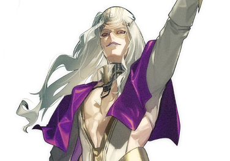
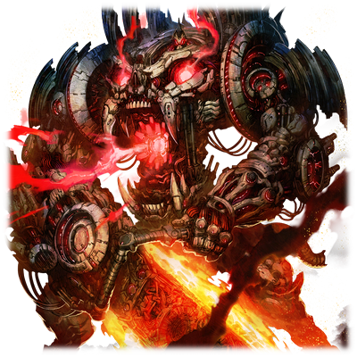
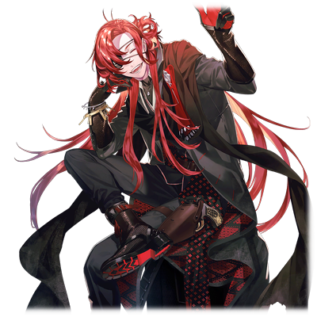
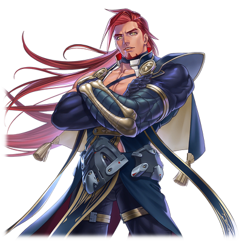
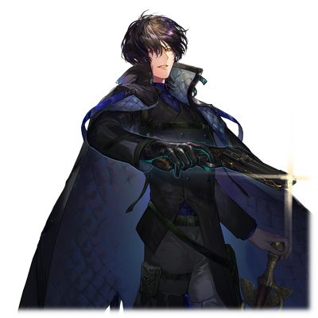
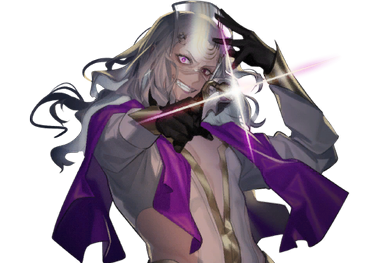
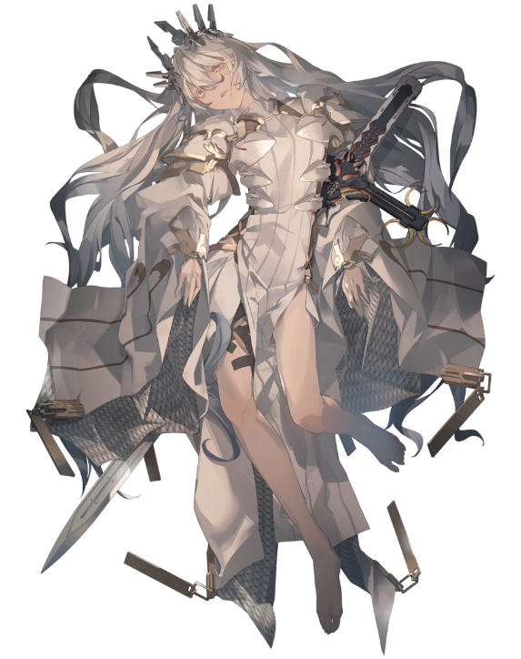

# 沃特

| 角色信息   |          |
| ----------- | ----------- |
|  名称 |沃特
|年龄 |容貌年龄24岁左右（制造后10年）
|职业|强硬派指导层
|对应乐曲|Superbia
|初出|Chunithm SUN PLUS

## Episode 1 世界的中心

>混账！为什么不管是谁都要来妨碍我！母亲大人，是只属于我的啊！

炮弹宛如雨点一般落下，将飞船，都市统统炸成了碎片。

就在这被机械种遗弃的青之都市·萨马拉坎达上空，为了争夺制空权，两军之间的正展开着激烈的火拼。

 

“防壁，已经撑不住了！在这样下去的话……！”

“沃特大人！请允许撤离这片空域——哇啊！”

 

船体猛烈地摇晃着，打断了男人的通讯。屏幕上出现的是大大小小的受损情况的警告窗口。

能够对沃特这固若金汤的旗舰造成重创的，也就只有那些矗立于都市之中的大型炮塔“巴尔迪艾尔”了。

只是一座炮塔就已经能够造成足够的威胁了。然而像这样的炮塔，城市中还有好几座。

 

“可恶！真是令人不爽！”

 

大部分的炮塔，都被从旗舰中出击的机动兵器德威格破坏掉了。

但是，德威格却在战斗中突然暴走。

而德威格也为了追击突然出现在战场上的归还种，离开了战场。

从未预想到这意料之外的事态，才导致了现在的状况。

如果是平常的沃特，应该是能够冷静地看待战况，就像下棋一样，准确地掌控局势的吧。

但是，他却没有这么做。

因为这场战争有一件让他实在无法冷静下来的因素。

 

“那座城里，肯定有跟母亲大人相关的东西！至于那个偷偷地在背后搞小动作的凯南，怎能轻易放过他啊！”

 

坐在舰长席上，沃特狠狠地拍着座位把手，大喊着。

 

“能够获得母亲大人的宠爱的，只有我！！而能够知晓一切的，就只有身为母亲大人的正统的后继者——也就是我！！”

 

在他眼中所看到的，已经不是眼前的战场，而是圣女拔示巴的幻影了。

在沃特眼里的世界，都是以拔示巴为中心而转动的。

所以对他来说，一切阻碍他通往母亲那里的东西，不管是一草一木，都要亲手将其消灭。

 

“全军听令！攻下那座城堡——”

“沃特大人！对方的飞船又发来了通讯！”

“啊啊！？……给我接通！”

 

当沃特接通了通讯，他立马就摆出一副趾高气扬的样子，向对方挑衅到。

 

“这种时候还想来求饶也是没用的，洛特！！”

“咦咦咦？我怎么觉得是我这边占上风来着？该投降的应该是沃特你这边吧？”

 

即便是这种时候，洛特仍旧是那副嬉皮笑脸的样子。

当然这也有沃特摆出这副高傲的架子的缘故。

 

“你这叛徒给我闭嘴！要玩也已经玩够了！”

“咦~这算什么啊？”

“你一直就是这副德行，不管什么时候在背后捣乱，试图算计我！”

“哎呀，看来是被记恨了呢。我可不知道你到底在说什么事情哦。”

 

洛特就像是炫耀一般，敲了敲自己手上的腕轮。

不知是不是积怨已久了呢，刚刚勉强冷静下来的沃特，又一次被点燃了怒火，并且没有平息的迹象。

 

“在把你干掉之后！这腕轮就给我物归原主了！”

 

沃特只是向着屏幕对面的洛特发泄着怒火，丝毫没有注意到自己正一步一步地被拉入敌人的圈套。

## Episode 2 似是而非的二人

>我是为了成为指导者才诞生在这世上的。那种家伙所背负的东西和责任怎能跟我相提并论。

沃特第一次和洛特见面，还是为了嘉奖洛特的功绩，而将他邀请到“荷莱亚”的时候。

那个时候，沃特调查了洛特的经历，才发现他竟然也是赛罗的研究所制造出来的副产物。

强硬派前指导者——赛罗·达文斯。

作为拔示巴的忠诚下属的他，带领着许多抱有同样志向的心腹们，进行了各种各样的研究。

这其中就包括了利用拔示巴和索罗的细胞制造真人的研究。而这个研究项目，正是赛罗花费了最多心血的部分。

就连现在的强硬派指导层的沃特和蕾亚，也是他的研究下的产物。由于他也在奥林匹亚斯殖民地之外的地方进行了研究，所以即便眼前的这个男人——洛特·十二并非生于这里，也说不定是跟自己有着一定血缘的人。

 

“嗯嗯……”

 

沃特看着洛特的体检报告和战斗报告。

在这些报告书里，虽然混杂着一些战斗中随便乱拍的图片，但是在其他的那些照片中，洛特不管是什么时候，都是对着镜头露出笑容的。

带着几分未知，沃特向着站在办公室的中央的洛特命令到。

 

“我在看到报告的时候我还有些疑惑……不过，确实干得不错。你就当我的手下，为我工作吧。”

 

沃特想要的，是一支独立于正式部队的，只听从于自己的指挥的私人武装。

对于以强权手段统治强硬派的沃特来说，那些与自己意见相左的人只会成为他的障碍。

作为能够暗中行动并且将他们封口的特殊部队来说，洛特简直就是当这个的料。

安排自己的亲信担任像这样的秘密部队的工作，也就相当于拥有了与暗部的联系。

虽然从某个方面来看，这也代表着自己的统治随时都有可能被这些人推翻，但是沃特相信，洛特有着绝对不会背叛自己的理由。

 

那就是两人同样共有的，对他们的母亲——拔示巴的，宛如狂信徒般的忠诚。

只要有这点，那洛特就将会是自己永远的伙伴。

然而，与沃特的预想不同，洛特的反应却是比想象的还要平淡。

 

“嗯——束手束脚的是不是太麻烦了？”

“——哈？”

 

洛特的脸上没有一丝敬畏的表情，只是咧嘴笑了出来。

自从沃特当上宰相以来，还从来没有人敢这样轻佻地面对他。

 

“啊哈，开玩笑而已啦！”

“你，你这家伙——！”

 

沃特立刻气的从椅子上站了起来，结果沃特笑的更欢了。

 

“呐呐，下一句是不是‘你这是大不敬啊！’什么的啊？”

“别！！开！！玩笑了！！赶紧把你那轻蔑的笑容给你收起来！我可是你的上司，可是强硬派的顶点人物啊！你就不怕脑袋搬家吗！？”

“啊？那倒是无所谓哦？要我死掉什么的……”

“你说什么？”

“不过啊，可以的话还是想要比较不痛苦的方法呢~”

 

眼前的男人只是歪着头笑着，就连沃特也被气的哑口无言了。

洛特的态度，简直就像是那种在头上飞舞着的苍蝇一样。

 

——这家伙，估计已经疯了。

而且是从出生以来就是这样的。

 

只要自己能够乐在其中，就算是上刀山下火海都毫不在乎。

只是稍微交谈了几句，沃特就明白了这个名为洛特·十二的男人是何等的异常。

 

就在沃特想着刚才所说的那番话其实对方根本就没听进去的时候，洛特突然用手指轻轻地敲了敲被眼罩盖着的右眼，心不在焉地说到。

 

“要我去那个部队，倒也可以哦♪不过，队长得由我来当！”

“……你这又是吹的什么风？”

 

由于话题一直被洛特带偏，沃特已经感觉到了疲惫。

 

“因为我觉得母亲应该会为我而高兴呢♪”

“你在说什么？母亲大人早就已经——”

“咦？沃特你听不到吗？你应该能够听得到母亲的声音的吧？难道说在沃特的世界里没有母亲的身影吗？”

 

并未注意到自己已经被他人直呼其名，沃特只是激动地回到。

 

“母亲大人就是我的全部！为了完成母亲大人未能完成的愿望——毁灭所有的机械种和归还种，我才会站在这里的！”

“啊，OKOK。既然这样的话我就来帮忙吧。”

 

洛特的眼睛眯成了一条弯弧。

在那眯起来的眼中，虽然面向着沃特，但他的眼神，就像是望向某个不存在这里的地方一样。

 

“呐，虽然说好了会帮沃特你完成你的愿望来着……能不能也听听我的愿望？”

“有什么尽管说吧。就算是最新锐的武器装备，你要多少就拿多少吧。”

“嗯~虽然那个也很不错。不过我想要的，还是这个啊♪”

 

洛特所指的，是沃特十分重视的，一直放在这里装饰着的，母亲的遗物。

 

“你，你这家伙！这可是我的——”

“是**母亲的**，对吧？”

 

顿时，洛特的语气变得极为冰冷。

简直就像是被尖刀夹在脖子上一样。

 

“……也好。”

“啊哈，还好沃特挺好说话啊♪”

 

吹着轻快的口哨，洛特从沃特那里拿到了拔示巴的遗物，并且装在了右手上。

 

“那么，有事情的话随时都可以叫我哦♪”

 

就像是拿到了宝物的小孩一样，洛特踩着轻快的步伐离开了办公室。

 

“哼……”

 

为了让母亲露出笑容。

为了完成母亲的愿望。

洛特和沃特，虽然同样是为了母亲，但他们的动机，却似是而非。

此时的沃特还不知道，两人的关系，终有一天也会因为母亲的事情，从而走向分道扬镳的地步。

## Episode 3 改变战局的一手

>给我让开，洛特！现在不是跟你玩的时候！

“明明把那个东西交给你才让你好好干的，难道说这些都是骗人的吗！”

“咦——我是这么说的吗？”

“你这……到底要把我耍到什么时候……！”

 

在这炮火纷飞的战场上，这场争吵仍在继续。

然而就在这期间，战况也在持续变化着。雷达上标示友军的图标正在逐渐减少，而旗舰虽然仍是轻微损伤，但再这样下去的话，旗舰的坠毁不过是时间的问题。

必须尽快作出决定才行。

 

“沃特！到底要跟这个家伙在那边扯多久啊。那家伙只是在拖延时间而已！”

“啊哈？被发现啦？”

“洛特，你这家伙——”

 

萨尔贡直接切断了跟洛特的通讯。

 

“给我认真点，沃特。要是指挥官在战场上尽显无能的话，只会让更多的士兵死于非命。”

“这、这种事我当然知道。”

“那就不必多说了。你要是不想指挥的话，就把指挥权交给我，自己去跟那个家伙吵架吵到天亮吧。”

 

赶紧下决定吧。萨尔贡的那双眼中，仿佛这么说着。

 

“各位，请做好突击艇的出发准备。我们要用这艘船直接冲进去！”

 

沃特继续发号施令。

不管哪个，看着都像是破罐破摔般的行为。

为了突破萨马拉坎达的坚固防壁，就需要利用同行的另一台机动兵器，米吉多·科古进行撞击。

然后，在旗舰和米吉多的双重特攻下，就趁此间隙利用突击艇冲入萨马拉坎达的内部。

与其被打的灰头土脸仓皇撤退，还不如趁现在利用最强的战力作为诱饵，长驱直入。

确实，从理论上来说这是最合适的选择，但怎么看都太荒唐了。

 

就在萨尔贡刚想问是否有人会选择留下来进行舍身攻击的时候，眼前的状况很快就让他打消了疑虑。

因为沃特所组成的正规军，都是由那些对拔示巴有着虔诚信仰的信徒们组成的。

很快，船上的人就组成了敢死队，而针对萨马拉坎达的突击行动也开始准备了起来。

## Episode 4 绀青之都，染成赤红

>前进吧！碾碎那些萨马拉坎达的防卫军！

被炮台和舰队的炮火重创的米吉多·科古，直接撞上了萨马拉坎达的防壁。

足以撼动大地的冲击波，直接席卷了整片防壁，吞没了城池和其余的炮塔。

伴随着大面积的塌方，整座绀青的都市变成了一片倒塌的废墟和整洁的街区共同存在的奇异模样。

以米吉多·科古的冲击为信号，沃特的旗舰也开动全部的炮塔，向着洛特的舰队冲了过去。

驾驶着旗舰的，是那些自愿作为敢死队突击的，拔示巴的信徒们。

他们正是沃特万一碰上山穷水尽的时候特意准备的，能够在关键时刻提振士气的“精锐”。

 

“拔示巴大人，万岁！！！！！”

 

舍弃防御，火力全开的旗舰，顶着漫天的炮火将萨马拉坎达的防卫军一个又一个地卷入自己的火力范围中。

 

与此同时，在后方的甲板，数艘突击艇已经做好了起飞准备。

虽然船体较小，只能承载几人，但这也是为了分散敌人的炮火而做的措施。

 

就在数艘飞船被流弹和碎片命中坠落的混乱局面之中，沃特和萨尔贡各自乘坐着不同的飞船，降落在了萨马拉坎达的都市区域中。

沃特确认完周围平安之后，立刻向士兵们发出了指示。

 

“趁被敌人打成蜂窝之前，赶紧侵入都市内部！”

“不跟萨尔贡大人汇合吗？”

“没必要！现在这种情况还有时间汇合吗！”

 

船外，已经是弥漫着硝烟的战场。

坠落的飞船，还有大大小小的弹坑，都呈现着这场战争的残酷。

但是，这一带还保持着都市的模样，损伤还是偏少的。

沃特和士兵们一边警戒着周围的情况，一边向着都市深处进发。

 

在那之后又过了几分钟。

在逃生舱的周围，突然发出了巨响声。

那声音的来源，正是坠毁的萨马拉坎达防卫军的船。似乎是船体的动力部分着火了，火势瞬间就变得无比凶猛。

就在整艘船眼看就要被烧成灰烬的时候，船体的舱门被什么东西破坏，某样东西掉了下来。

这个人形的机械物体，虽然已经被火焰烧成了一个火人，却仍旧在地上爬行着，试图追上沃特等人，但是随着上空更多的碎片掉了下来，这个物体也被残骸压了个粉碎。

## Episode 5 一切都是为了母亲

>如此周密的计划，绝对不可能只靠凯南和洛特就想得出来。在这座都市里，一定有着答案。

牺牲了诸多东西，沃特终于冲入了萨马拉坎达的都市区域。

这座与拔示巴十分有缘分的都市，对于把拔示巴当作精神支柱，影响了他的无数行动的沃特来说，这座城市也可以的圣地。

然而，与高大宽敞，一片碧蓝的建筑物外侧不同，里面则是另一幅景象。

 

颜色暗淡的金属墙体一眼望不到头，而且还带着些战斗的痕迹。

这些应该都是拔示巴战役所留下来的伤痕吧。

虽然都市的外围由凯南进行了巩固，但是内部并没有怎么打理的样子。

再看看里面的样子，四处都是长得一模一样的钢铁走廊，就像一座巨大的迷宫般。

在左右分叉的道路尽头，又有更多的分支录。

只要选择其中的一条道走的话，应该就能到达凯南的所在吧。

沃特如此判断着，不禁哼地一笑。

 

“哼，是想要分割战力吗。尽是这些雕虫小技。”

 

将计就计，沃特决定继续保持队伍，向着深处进发。

一边破坏着设置于路上的防卫系统一边前进，沃特等人来到了一片宽广的空间。

与之前狭窄的通道不同，这里的地形开阔不少。

如果是这样的话，这里的戒备肯定会更加严重——

 

“展开！”

 

突然，前方的士兵大喊起来。

注意到的其他士兵们，很快就架起了盾牌在沃特面前形成了人墙。

下一刻，无数的子弹就像雨点一般向他们袭来。

 

“噫……！”

 

就连沃特这突然的惨叫，也被无数的枪声吞没了。

躲在人墙之中，沃特透过缝隙观察着周围的情况，他看到的，是正站在高处的走廊，居高临下地向他们发动攻击的士兵们。

 

“那到底是什么……？”

 

在这突然的袭击中，沃特突然发现了敌人的异样。

他们明明没有带着护目镜或者头盔什么的防护装备，却有着同样的外貌——

 

沃特手下的士兵们也开始渐渐发觉敌人的异常。

这也难怪，那些敌人的脸上并没有普通人类最起码应该有的五官。

眼睛，鼻子，嘴巴，这些足以辨识一个人特征的东西都无法在他们身上找到。

在那张惨白的脸上的，只有略微凹陷下去的，类似于眼窝一样的东西。

沃特他们所遭遇的，是由机械装置组装而成的白色士兵们。

 

“开火！给我开火！！”

 

沃特手下的士兵们虽然在拼命战斗，但是在这低洼的地势上实在是举步维艰。

更不用说他们还要支出精力保护重要人物，跟那些就算受损也不会停止射击的机械兵相比，差距实在是太大了。

 

“把他们的头部彻底破坏掉！”

“后退，快后退——喂！下面也冒上来了！”

 

那些机械士兵们跨过栏杆，从后方向着沃特他们缓缓逼近。

沃特的护卫们已经拼尽全力一边射击，一边掩护着沃特，但是还是没能阻止那些护着头部向着这里冲来的机械士兵们。

一只机械士兵突破了护卫部队的火力网，冲入了人墙中，其他的敌人也趁着阵型出现破绽的时候追加攻击。

渐渐地，一个又一个的士兵们倒下了。

 

“赶紧重整队形！沃特大人，请退下——”

 

然而回过头去，沃特已经消失了踪影。

原来，沃特在仍未陷入劣势之前，就因为贪生怕死而逃之夭夭了。

* * * 

“为、为什么？为什么机械种会在这里……？”

 

喘着大气，沃特拼命地寻找着能够藏身的地方。

在这慌乱的情况之中，沃特也在脑海中努力思索着那些碎片一般的线索。

 

——那些士兵是类似于机械种一样的机械步兵。

这些东西肯定为了防卫萨马拉坎达而偷偷制作出来的。

如果在占领这里的时候有人搞到了制造据点的话……

但是，仅靠凯南和洛特是做不到那么多事情的。

那么，能做到这件事情的人——

 

在猜测和假说之间不停思索着的沃特，脑海里闪过了一个很有可能的人。

 

“不，不可能……这种事情！怎么可能发生——”

 

――♪

 

突然，轻快的口哨声在这寂静的通道中回响着。

然后传来的，是整齐而响亮的，“哒哒哒”的皮鞋声音。

敌人正在靠近这里。周围没有任何可以躲藏的地方。只靠这把护身用的手枪是无法应付那些钢铁的机械士兵的。

 

“怎么能够死在这种地方……！不、不要啊！！我还要，还要……”

 

不想死。

然而对于这个不把士兵们的生死放在眼中的人来说，直到这时还祈祷着自己能够得救，也未免太过自私了。

 

“找——到——你——啦――♪”

“哇啊啊啊啊啊啊啊啊啊啊啊啊！！”

 

连眼前的景象都没有确认，沃特就举起了手枪。然而，枪立刻就被打飞了。

宛如惊弓之鸟的沃特吓得瘫倒在地，只敢拼命地向着后方挪着身子。来者看到沃特的这幅丑态，也发出了揶揄的笑声。

 

“不是吧！这么绝情的吗？竟然拿着枪指着自己的亲生哥哥什么的~”

“哈啊…………洛、洛特！？？？”

正俯视着瘫坐在地上的沃特的人，正是沃特的哥哥，洛特·十二。

## Episode 6 只是想要被认同

>我比任何人都要优秀，这是无论谁都能看出来的事实！可是，为什么最后被选择的却不是我……

遭遇敌兵，仓皇逃窜的沃特见到的，正是前不久才和自己各自驾驶着战舰交战过的洛特。

沃特似乎还没理解现在的情况，眼神四处游离。

看到自己亲弟弟的奇怪表现，洛特嗤嗤地笑了出来。

 

“噗，呵呵……能看到你这副样子也算值了。”

“你、你这家伙啊啊啊！！”

 

当沃特明白眼前的人正是洛特的时候，那副恐慌的表情立刻就消失的无影无踪。沃特气势汹汹地靠近洛特，质问到。

 

“你、你到底是什么时候背叛我的！”

“我可从来都没有背叛过哦？从最初开始，我就是一直为了母亲而努力的。”

 

放着正在那边自得其乐的洛特，沃特想起了自己第一次见到洛特的事情。

那天在办公室见到他的时候。

在他说着拔示巴会为他而高兴的时候，那幅天真无邪的表情。

仿佛就像是活在自己的世界里一样，为了她而努力。

虽然在沃特的眼里他就是个狂人，但这份为了母亲而努力的心说不定就是他的本质。

 

“那么，你和凯南合作，也是为了母亲吗？”

“正是。我们的目的是一样的。哼哼，竟然连这种事情都得跟你说，我还真是宽宏大量啊～♪”

“可恶！我，我可是一直都为了母亲大人才活到现在的……可是，为什么我要遭受这样的对待啊！！“

 

看着歇斯底里的沃特，洛特淡淡地说到。

 

“因为你并没有被母亲认可对吧？”

“咕……呜哇啊啊啊啊啊啊啊！！不可能！！绝对不可能！！不管是你，还是凯南，不都是比我更差吗！！就算是血统的纯正程度……除、除、除、除了那个臭小鬼以外，只有我才是第一的……！”

 

沃特的心已经被逼到了极限。

就算不是被本人这么说，但是，只是听到“自己被母亲否定”这句，对于沃特来说就已经是晴天霹雳了。

再加上从自己的亲生兄弟洛特的手中说出口，更是给了他的精神致命一击。

他终于意识到了一件事。

意识到了自己不过是个毫无价值的人，只是个“<ruby>虚无<rp>（</rp><rt>VOID</rt><rp>）</rp></ruby>”的存在。

 

“我是不会承认的……不管别人说什么闲话……”

 

似乎是为了努力维持自己的精神不崩溃，沃特拼命地念叨着，试图鼓励自己。

 

“既然都到这个地步了，要不自己去问问看？”

“……啊？”

 

沃特缓缓抬起头来看着洛特。

他的表情，简直就像是在沙漠中找到一丁点水源的旅人一般。

 

“今天也跟沃特玩了很久了，虽然感觉就算把你杀死也可以了。不过既然都这么想了，那就由我带你去吧……去我们的母亲所在的地方。”

## Episode 7 隐藏起来的圣骸

>没想到一次都没能见到的母亲的遗体，竟然就藏在这样的地方……

在洛特的带领下，沃特来到了萨马拉坎达的深处。

不知是不是洛特的影响呢，那些机械士兵们并没有发动攻击。

 

“继续往前走的话，就能到达最深处了。那里就有沃特你梦寐以求的东西。”

 

矗立在沃特面前的，是一面看起来建成不久的高大的隔墙。

 

“那，我就带路带到这里。啊对了，那些机械士兵们是不会进入深处的，所以你就放心去吧。”

“……你要去哪里？”

 

在路上一直沉默不语的沃特，用有气无力的声音问到。

 

“就是去上层看看而已。毕竟我可是这里的看门人啊！”

“哼，哪里有这样四处游荡的看门人啊？”

“啊哈，谢谢夸奖。”

 

这么说着，洛特就头也不回地离开了这里。

看着正用口哨吹着轻快的小曲的兄长的背影，沃特举起了手枪。

 

“哼……”

 

然而，他并没有扣下扳机。

转过身，他把手伸向了隔墙中闪烁着红色灯光的地方。

然后，隔墙响起了微弱的声音，大门缓缓地敞开了。

这前面就是中枢区。

在那中枢区的最深处就是——

 

“母亲大人……”

 

沃特自己其实一次都没有亲眼见过母亲的尸体。

被赛罗植入的虚拟记忆，就是他所知道的，关于母亲的一切。

想要亲眼见到，想要亲自相见。

正是如此简单的愿望，支撑着他不至于就此崩溃。

 

随着他走入中枢区，他就听到了一阵机械的震动音，让整个中枢区更加阴森。

似乎所有的能源都集中到了这个区域的装置运转上，周围的环境十分昏暗，能见度很低。

从墙体之中暴露出来的机械元件的灯光，是这片黑暗的空间中不可多得的光源。

随着沃特在黑暗中前进，他的听觉也开始渐渐灵敏起来。

 

“简直……就像是活物一样。”

 

宛如生物一般会跳动的管道，还有带着些许温暖的墙体。

自己简直就像是不知不觉闯进了巨人腹中的小人一样。

 

“……不，我现在很冷静……”

 

沃特无数次地念叨着，试图暗示自己。

一段时间过后，一扇闪烁着红色光芒的大门出现在他的眼前。

这里就是洛特所说的最深处吗。

 

“就是这了……”

 

下定决心之后，沃特终于打开了大门。在门对面等待着他的，正是被装在巨大的容器中，被某种溶液浸泡着，漂浮着的那位少女——拔示巴。

 

“啊……啊啊啊啊……啊啊啊啊啊啊……！”

 

明明已经死去了十多年，但是那容貌，那身体，就像是被魔法冻结了时间一般，仍旧没变。

那沉睡着的样子，就和当时一模一样，仿佛随时都会苏醒过来。

目睹着这幻想般的光景，沃特终于再也坐不住——

 

“母亲大人！！”

 

就在他打算冲上去触碰容器的时候。

 

“到此为止了。不要再接近拔示巴大人了！”

 

突然，一个声音响起，叫住了沃特。

 

“谁！？”

 

见到拔示巴的样子，沃特也恢复了些许生气。他掏出手枪，紧张地巡视着周围。

刚才自己的声音传到了很远的地方才传来回音，那么这片空间应该比自己想象的要宽敞的多。

就在这时，他才注意到周围的环境。

到处都是争斗过的痕迹，四处都横躺着真人的尸体。

而在房间的中心部分，两个大概到腰间高度的台座正并列摆放在那里。

两个物体正各放在一个台座上。上面躺着的，正是佩尔修斯殖民地的监督官——艾娃，以及一名归还种的少女。

 

“这到底，是什么——”

“这是，仪式。”

 

从艾娃躺着的台座脚下传来了声音。

从远处只能看到个黑色的人影。随着黑影的慢慢接近，他也露出了真面目。

 

“凯、凯南！你这叛徒……！”

沃特条件反射一般地举起手枪，对准了凯南的头。

就在他想按下扳机的瞬间，凯南露出了狡黠的微笑。

 

“呵呵，要是在这里开枪的话，拔示巴大人就真的要永远沉睡在那副躯体里面了哦？”

“母亲大人早就已经驾崩了。你要是胆敢玩弄母亲大人那神圣不可侵犯的尸骸，那就由我亲手杀了你！！”

“非也。实际上，她还活着。活在‘那里面’。”

 

这么说着，凯南把目光转向了正躺在另一个台座上的归还种的少女——尼亚。

 

“你，你说什么……”

“‘容器’很快就要完成了。圣女·拔示巴，将在这里重获新生。”

## Episode 8 虚假的名字

>我是……空无一物的。那么，我究竟是为了什么，才来到这里的……

凯南说到。圣女·拔示巴，将以归还种的身体重获新生。

 

“真，真的吗？母亲大人会……？”

沃特仍旧用枪顶着凯南，恳求着。

 

“快点，快点让我见见母亲大人啊啊啊！！”

 

两边的立场，不知何时发生了对调。

 

“呵，呵呵……你这人……真的是，太滑稽了啊……”

 

凯南似乎连站起来都很困难的样子。他靠在台座上，断断续续地说着。

 

“甚好。没想到啊……你的执念竟然已经如此深厚。老实说，你已经远远超出了我的想象。”

“想象？你这家伙究竟明白我的什么！”

“我能明白。因为我和你，说到底也不过是别人手中的小丑而已。你就算不理解也很正常。”

“我为了完成母亲大人的愿望，筹划了战争！攻下了佩尔修斯殖民地！为真人带来繁荣的，是我啊！有资格能够获得母亲大人的宠爱和荣誉的，只有我！只有为此而生的我啊！”

“那么，这又是谁的愿望呢？”

“……什么？”

“人在出生的时候，是不会有那样的愿望的。我再问你一次。那究竟是谁的愿望？”

 

那宛如狂信徒一般的，对母亲的信仰心。

她所期望的，是毁灭了机械种和归还种，由真人支配了整个地上的世界。

而这些东西，都是自己的创造主赛罗提供给他的，虚拟记忆下的产物。

正是因为有这些记忆的引导，沃特才如此确信，确信这一切的理由都不是由别人所给予，而是自己发自内心的想法。

然后，他向那些与自己意见相左的人们伸出了魔爪——

 

“不可能……这种事情，怎么可能！我的愿望，肯定是母亲大人的——！！”

 

自己的所作所为是正确的。

就像是为了肯定自己的想法一样，他不停地，不停地念叨着。

 

“如果你觉得你想得起来的话，那就尽管试试看吧。因为这些东西，从一开始就不存在。”

“我……我是……和母亲大人……”

“你根本就不知道母亲的事情。因为她从最初就沉睡在这里。”

“那么，我究竟……是什么……”

 

——你只是个<ruby>空无一物<rp>（</rp><rt>VOID</rt><rp>）</rp></ruby>的存在而已。

 

这只是突然闪过沃特脑海的一句话。那句话，是身为沃特的创造主，同时也是母亲的心腹的那个男人经常挂在嘴边的那句话。

 

——你根本不配拥有“阿西德菲尔”的名号。

 

“你什么都不是。你只是个连‘阿西德菲尔’的名号都得不到的，无名无姓的真人而已。”

“为、为什么你会知道……知道这些的那个男人已经死了！早就已经死了啊！那个叫做赛罗·达文斯的男人……！”

“但是，他现在就在**这里**。”

 

凯南的嘴角上扬。

自称自己是赛罗的男人的话语，在沃特的心中激起了阵阵波澜。

 

“准确来说，应该算作是我的**一部分**吧。”

“————！”

“就让我亲自告诉你吧。告诉你，你的愿望究竟是来自何方……”

 

沃特无力地跪了下来。

就像是要回避眼前这个否定着自己的存在价值的男人一样，那双空虚的眼睛望向正在容器中漂浮着的母亲，就像在祈求着救赎一般。

就在这时，躺着归还种的少女的台座出现了反应。

放置在旁边的电子面板，就像是宣示着什么东西一般，发出了响亮的提示音。

 

“那么，苏醒吧！”

“啊……母……母亲大人啊啊啊……！”

 

已经哭成泪人的沃特，只是念叨着母亲的名字。

那副模样，简直就像是亲眼目睹神明降临的狂信者一般。

连接着台座的线缆轻轻一震，闪过淡淡的光芒。

 

“那，就是你一直在寻找着的母亲。”

“呜——”

 

无尽的欢喜令沃特如五雷轰顶，顿时，一阵不成样子的呐喊声传了出来。

然后，宛如悲鸣一般的哭声，响彻了整个空间。

已经成为拔示巴的凭依体的归还种——尼亚·尤蒂特从沉睡中苏醒，缓缓地坐起身来。

 

“这——就是我的身体吗……再也没有病痛，再也没有痛苦……啊啊，这样的话，就能够带着大家前往那里了……”

破灭的圣女——尼亚·拔示巴。

再临于世间的她，将要带来属于她的祝福。