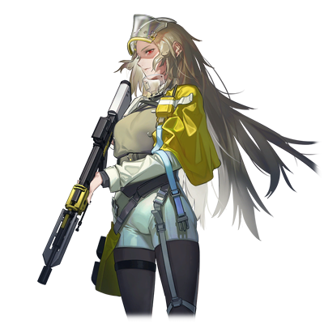

# 泽法·尼亚德

| 角色信息   |          |
| ----------- | ----------- |
|  名称 |泽法·尼亚德
|年龄 |素体年龄22岁
|职业|地上夺取派（INNOVATOR）的卫士
身份|铜骑士
|对应乐曲|Qliphothgear
|初出|Chunithm NEW

## Episode 1 圣女死后的世界

>没有争端也没有仇恨，能够自由生活下去的一片净土。不管发生什么事，我们两人一定要到达那里！

自从人类灭亡之后，地上出现了被称作“真人”和“归还种”的两种存在。由管理者地上的机械种所产生的两者，为着各自的生存打得不可开交。

而就在战局大步倾向于真人的方向，占领大陆的中央部也不过只是时间问题的时候……这场战争，以一种预想之外的形式，中止了。

以率领着真人的圣女·拔示巴的死亡为契机。

自从蕾娜·伊修梅尔从电子的乐园归还至大地上爆发的这场战争，已经过去了15年。现在，这围绕着真人和归还种之间为了大地的支配权的斗争，即将迎来全新的局面。

我——泽法·尼亚德的一天，常常是从噩梦中惊醒开始的。

而噩梦的内容都是固定的，那就是看着一位苍白色皮肤的少女在梦中不停哭喊着的景象。

既看不到具体的样貌，也听不清楚究竟在说什么。

究竟是何时开始的呢？

那个梦发生了变化。

明明迄今为止都只是在远远眺望着的少女，现在却渐渐地向我接近，不知何时，我也能够听懂她究竟在哭喊着什么了。

而她也用那双眼睛死死地盯着我——

“哈……哈……”

我从气垫船上的硬床上惊醒。用手抹掉额头上的冷汗，坐起身来，眺望着窗外的风景。

“太好了……今天也平安无事地来了呢……”

明明几天前才从奥林匹亚斯殖民地脱身，却没有一队追兵跟在我们后面。

“……嗯……”

从后面感觉到了些微的气息。

索罗似乎还在睡觉的样子。

“明明只要睡着，感觉就和普通的男孩子没什么差别呢……”

要是能够平安地带着索罗到北方的大地就好了。

“……就由我……绝对要由我……来保护……”

“呵呵，说得对呢。我一定会保护好你的。”

我轻轻地抚摸着仍在梦中呢喃的索罗的白发。

是啊。现在还不能气馁。

因为，我们已经约好了，“两人一起活下去”的啊。

## Episode 2 王子与侍从

>仔细一想，说不定从跟他邂逅的那个瞬间，我就被他迷住了也说不定。

据说，我是经由真人的强硬派武官，凯南大人之手，才降生到这个世界上的。之所以要用“据说”二字，那是因为似乎只有那个时候的记忆，像是被连根拔起一样，消失的无影无踪。

真人，从诞生之初，他们的形体和容貌就是被完全定死的。

但是，我跟其他的真人不一样，现在，我的身体，**仍然在缓慢地成长着**。

这变得越来越沉重的身体，就是那毋庸置疑的证据。

我是“真人”……应当是这样的才对。

我到底是什么人？

现在的我无从知晓。

即便再怎么向凯南大人询问，他也只是以一句“你是特别的”向我敷衍了事。

只靠这句话，是无法消除我心中的不安的。

……我想弄明白这一切。我想知晓自己诞生于世上的意义。

然而，就在这懵懂度过的日常之中，凯南大人向我告知了一件事。

“泽法，有个任务要交给你。跟我来。”

“任务……吗？我能做的事情，任谁都知道没有多少……”

“不是都叫你跟过来了吗。”

“我明白了。”

生于凯南大人的庇护之下的我，本就没有拒绝的权利。

说着说着，我们来到了边境都市·戈里齐亚——一座由我等的先人拼死血战最终光复的城市，来到了管理着此地的领主，艾斯特尔·亚戈鲁修大人的宅邸。

“等你们很久了。进来吧。”

在两名卫士的带领下，我们来到了一间内饰极度奢华的房间。

站在那里的，是领主艾斯特尔大人，以及一个低着头的白发男子。

“你们二位终于来到这里了，辛苦了。”

“艾斯特尔，这个少年就是所说的……？”

“是的。”

艾斯特尔大人露出安稳的表情，向我们说到。

“这位就是索罗·莫尼亚。正是曾经率领着我们真人的圣女，拔示巴大人，留存于这个世上的，奇迹之子。”

“拔、拔示巴大人的孩子……？”

“是的。那么，凯南，你有没有向泽法说明其中的缘由呢？”

“还没有。”

“那么，就由我来传达吧。凯南的侍从，泽法·尼亚德。从今日起，你就是索罗大人的私人教师了。”

“是、是的……咦！？”

要我……当这位大人的私人教师？

由我这个甚至连外面的世界都知之甚少的人来担任私人教师……？

“后面就全部交给你了。可不要怠慢了这位大人啊。”

“交给你了，泽法。”

“等、等等！凯南大人，艾斯特尔大人！为什么要让我来……除我以外，不是还有更多优秀的人选吗？”

“不，没有比你更加**合适**的人了。那么，之后要是发生什么事，可别忘了联系我们哦？”

留下这样的话，二人扬长而去。

“没有比我更加‘合适’的人……这到底是什么意思呢……？”

“——呐。”

“呀！？”

突然从我身后传来了声音。

不知何时，索罗大人正抓着我的衣角。

“啊、不好意思，索罗大人！我是泽法·尼亚——”

“已经知道了。呐，你是我的敌人，还是我的朋友？”

索罗直直地瞪着我，令我不禁倒吸了一口凉气。因为从他那赤红色的双眼中我看到了一股深沉的执念。

那是由痛苦、悲伤、绝望，以及愤怒所混合而成的漩涡。

那些感情混杂在一起，透过那双赤红色的双眼向我袭来。

到底在那年幼的身上，寄宿着何等强烈的意志呢，只靠我的知识是无法推断出来的。

“呐，你的回答是什么？”

“我……”

我强打精神，努力不被这眼神所压制。如果在这里转过头去的话，肯定再也没有可能获得他的信任了吧。

“我不是索罗大人的敌人。”

“……是吗。那么，请多关照，泽法。”

到底是经历了多长的时间呢。

索罗的表情仍旧没有变化，只是默默地坐回了椅子上。

说不定……我更适合帮索罗大人鉴别事物的好坏也说不定。

不过，我真的能胜任私人教师这样的工作吗？

## Episode 3 萌芽

>我终于找到了……我生存的意义。我已经与那个妄自菲薄，觉得自己没有任何价值的自己，说再见了！

自从我成为了索罗大人的教师以来，我的日常生活发生了巨大的变化。首先，跟沉默寡言的索罗大人互相沟通就花费了我不少时间。

平常衣服也不好好穿，就算指正他，他也会说这些是仆人该帮忙做的事情。

总而言之，甚至连最基本的自理能力都没有。

虽然我没什么资格说别人，但索罗大人比想象中的还要不知世事。

“唉……没想到竟然会麻烦到这个地步……”

不过，老实说，我并不讨厌这样的生活。

相比较在凯南大人的庇护下只是无谓地活着，还是现在的生活显得更加充实。

而且，我也相信着。

只要以真心实意相对的话，总有一天，索罗大人也会敞开心扉的吧。

就在这繁忙而充实的日常之中，以一件事为契机，事情发生了变化。

那是一个风雨交加的晚上。

因为雷鸣声而醒来的我，由于担心索罗大人的安全来到了他的房间。然后，我轻轻地敲了敲门。然而，没有任何回应。

“索罗大人！？……请恕我打扰了……！”

我打开了房间的灯，环视四周，我发现索罗大人并未在床上，而是蜷缩在房间的角落，轻声地哭泣着。

“索罗大人！？您没事吧。索罗大人！？”

“啊……呜呜……泽法……”

索罗抬起头来，他已经哭的泪眼汪汪。

在我眼前的，已经不是平时那个冷淡粗鲁，一直恶狠狠地瞪着我的人。

只是一个会露出与年龄相称的表情的，会为雷雨而害怕的男孩子罢了。

“索罗大人，已经没事了。有我在身旁，您就不必担心。”

我就像对待一件易碎品一样，温柔地抱住了他。然后，我从我的背上感觉到了一双小手的触感。看着索罗大人拼命地抱着我的样子——我的心中萌生了某种强烈的东西。

我想要——保护这个孩子。

虽然还不知道未来还会发生什么，但是，即便如此，我还是想，我还是觉得，我必须成为这个孩子的后盾才行。

——从此之后的时间，过得实在飞快。

我拜访了艾斯特尔大人的所在地，并请求自己成为索罗大人的卫士。

然后，从那个晚上之后，索罗开始厌恶起我称其为“索罗大人”的做法，稍微展现出了点表情。

从此之后，我们的关系，正如艾斯特尔大人所说——既像是姐弟，又像是母子一般。

而这句话，就像是说中了我的内心，预示着我终于找到了我生存下去的意义一般。

