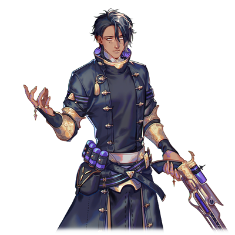

# 泽法·尼亚德

| 角色信息   |          |
| ----------- | ----------- |
|  名称 |泽法·尼亚德
|年龄 |素体年龄22岁
|职业|地上夺取派（INNOVATOR）的卫士
身份|铜骑士
|对应乐曲|Qliphothgear
|初出|Chunithm NEW

## Episode 1 圣女死后的世界

>没有争端也没有仇恨，能够自由生活下去的一片净土。不管发生什么事，我们两人一定要到达那里！

自从人类灭亡之后，地上出现了被称作“真人”和“归还种”的两种存在。由管理者地上的机械种所产生的两者，为着各自的生存打得不可开交。

而就在战局大步倾向于真人的方向，占领大陆的中央部也不过只是时间问题的时候……这场战争，以一种预想之外的形式，中止了。

以率领着真人的圣女·拔示巴的死亡为契机。

自从蕾娜·伊修梅尔从电子的乐园归还至大地上爆发的这场战争，已经过去了15年。现在，这围绕着真人和归还种之间为了大地的支配权的斗争，即将迎来全新的局面。

我——泽法·尼亚德的一天，常常是从噩梦中惊醒开始的。

而噩梦的内容都是固定的，那就是看着一位苍白色皮肤的少女在梦中不停哭喊着的景象。

既看不到具体的样貌，也听不清楚究竟在说什么。

究竟是何时开始的呢？

那个梦发生了变化。

明明迄今为止都只是在远远眺望着的少女，现在却渐渐地向我接近，不知何时，我也能够听懂她究竟在哭喊着什么了。

而她也用那双眼睛死死地盯着我——

“哈……哈……”

我从气垫船上的硬床上惊醒。用手抹掉额头上的冷汗，坐起身来，眺望着窗外的风景。

“太好了……今天也平安无事地来了呢……”

明明几天前才从奥林匹亚斯殖民地脱身，却没有一队追兵跟在我们后面。

“……嗯……”

从后面感觉到了些微的气息。

索罗似乎还在睡觉的样子。

“明明只要睡着，感觉就和普通的男孩子没什么差别呢……”

要是能够平安地带着索罗到北方的大地就好了。

“……就由我……绝对要由我……来保护……”

“呵呵，说得对呢。我一定会保护好你的。”

我轻轻地抚摸着仍在梦中呢喃的索罗的白发。

是啊。现在还不能气馁。

因为，我们已经约好了，“两人一起活下去”的啊。

## Episode 2 王子与侍从

>仔细一想，说不定从跟他邂逅的那个瞬间，我就被他迷住了也说不定。

据说，我是经由真人的强硬派武官，凯南大人之手，才降生到这个世界上的。之所以要用“据说”二字，那是因为似乎只有那个时候的记忆，像是被连根拔起一样，消失的无影无踪。

真人，从诞生之初，他们的形体和容貌就是被完全定死的。

但是，我跟其他的真人不一样，现在，我的身体，**仍然在缓慢地成长着**。

这变得越来越沉重的身体，就是那毋庸置疑的证据。

我是“真人”……应当是这样的才对。

我到底是什么人？

现在的我无从知晓。

即便再怎么向凯南大人询问，他也只是以一句“你是特别的”向我敷衍了事。

只靠这句话，是无法消除我心中的不安的。

……我想弄明白这一切。我想知晓自己诞生于世上的意义。

然而，就在这懵懂度过的日常之中，凯南大人向我告知了一件事。

“泽法，有个任务要交给你。跟我来。”

“任务……吗？我能做的事情，任谁都知道没有多少……”

“不是都叫你跟过来了吗。”

“我明白了。”

生于凯南大人的庇护之下的我，本就没有拒绝的权利。

说着说着，我们来到了边境都市·戈里齐亚——一座由我等的先人拼死血战最终光复的城市，来到了管理着此地的领主，艾斯特尔·亚戈鲁修大人的宅邸。

“等你们很久了。进来吧。”

在两名卫士的带领下，我们来到了一间内饰极度奢华的房间。

站在那里的，是领主艾斯特尔大人，以及一个低着头的白发男子。

“你们二位终于来到这里了，辛苦了。”

“艾斯特尔，这个少年就是所说的……？”

“是的。”

艾斯特尔大人露出安稳的表情，向我们说到。

“这位就是索罗·莫尼亚。正是曾经率领着我们真人的圣女，拔示巴大人，留存于这个世上的，奇迹之子。”

“拔、拔示巴大人的孩子……？”

“是的。那么，凯南，你有没有向泽法说明其中的缘由呢？”

“还没有。”

“那么，就由我来传达吧。凯南的侍从，泽法·尼亚德。从今日起，你就是索罗大人的私人教师了。”

“是、是的……咦！？”

要我……当这位大人的私人教师？

由我这个甚至连外面的世界都知之甚少的人来担任私人教师……？

“后面就全部交给你了。可不要怠慢了这位大人啊。”

“交给你了，泽法。”

“等、等等！凯南大人，艾斯特尔大人！为什么要让我来……除我以外，不是还有更多优秀的人选吗？”

“不，没有比你更加**合适**的人了。那么，之后要是发生什么事，可别忘了联系我们哦？”

留下这样的话，二人扬长而去。

“没有比我更加‘合适’的人……这到底是什么意思呢……？”

“——呐。”

“呀！？”

突然从我身后传来了声音。

不知何时，索罗大人正抓着我的衣角。

“啊、不好意思，索罗大人！我是泽法·尼亚——”

“已经知道了。呐，你是我的敌人，还是我的朋友？”

索罗直直地瞪着我，令我不禁倒吸了一口凉气。因为从他那赤红色的双眼中我看到了一股深沉的执念。

那是由痛苦、悲伤、绝望，以及愤怒所混合而成的漩涡。

那些感情混杂在一起，透过那双赤红色的双眼向我袭来。

到底在那年幼的身上，寄宿着何等强烈的意志呢，只靠我的知识是无法推断出来的。

“呐，你的回答是什么？”

“我……”

我强打精神，努力不被这眼神所压制。如果在这里转过头去的话，肯定再也没有可能获得他的信任了吧。

“我不是索罗大人的敌人。”

“……是吗。那么，请多关照，泽法。”

到底是经历了多长的时间呢。

索罗的表情仍旧没有变化，只是默默地坐回了椅子上。

说不定……我更适合帮索罗大人鉴别事物的好坏也说不定。

不过，我真的能胜任私人教师这样的工作吗？

## Episode 3 萌芽

>我终于找到了……我生存的意义。我已经与那个妄自菲薄，觉得自己没有任何价值的自己，说再见了！

自从我成为了索罗大人的教师以来，我的日常生活发生了巨大的变化。首先，跟沉默寡言的索罗大人互相沟通就花费了我不少时间。

平常衣服也不好好穿，就算指正他，他也会说这些是仆人该帮忙做的事情。

总而言之，甚至连最基本的自理能力都没有。

虽然我没什么资格说别人，但索罗大人比想象中的还要不知世事。

“唉……没想到竟然会麻烦到这个地步……”

不过，老实说，我并不讨厌这样的生活。

相比较在凯南大人的庇护下只是无谓地活着，还是现在的生活显得更加充实。

而且，我也相信着。

只要以真心实意相对的话，总有一天，索罗大人也会敞开心扉的吧。

就在这繁忙而充实的日常之中，以一件事为契机，事情发生了变化。

那是一个风雨交加的晚上。

因为雷鸣声而醒来的我，由于担心索罗大人的安全来到了他的房间。然后，我轻轻地敲了敲门。然而，没有任何回应。

“索罗大人！？……请恕我打扰了……！”

我打开了房间的灯，环视四周，我发现索罗大人并未在床上，而是蜷缩在房间的角落，轻声地哭泣着。

“索罗大人！？您没事吧。索罗大人！？”

“啊……呜呜……泽法……”

索罗抬起头来，他已经哭的泪眼汪汪。

在我眼前的，已经不是平时那个冷淡粗鲁，一直恶狠狠地瞪着我的人。

只是一个会露出与年龄相称的表情的，会为雷雨而害怕的男孩子罢了。

“索罗大人，已经没事了。有我在身旁，您就不必担心。”

我就像对待一件易碎品一样，温柔地抱住了他。然后，我从我的背上感觉到了一双小手的触感。看着索罗大人拼命地抱着我的样子——我的心中萌生了某种强烈的东西。

我想要——保护这个孩子。

虽然还不知道未来还会发生什么，但是，即便如此，我还是想，我还是觉得，我必须成为这个孩子的后盾才行。

——从此之后的时间，过得实在飞快。

我拜访了艾斯特尔大人的所在地，并请求自己成为索罗大人的卫士。

然后，从那个晚上之后，索罗开始厌恶起我称其为“索罗大人”的做法，稍微展现出了点表情。

从此之后，我们的关系，正如艾斯特尔大人所说——看起来既像是姐弟，又像是一对母子一般。

简直就像是在说我找到了属于自己的生存的意义一样。
## Episode 4 宰相沃特

>我等安息的土地已经消失了。难道说，这个世界，就连让我们安稳度日的自由都没有吗？

当索罗长到13岁的时候，戈里齐亚不知被什么人袭击了。虽然我们在艾斯特尔大人的保护下侥幸活命，但宅邸已经付之一炬，我们也不得不离开了戈里齐亚这片土地。

“就连这里……也不是我应当存在的地方吗……”

“索罗……”

看着露出悲痛表情的索罗，我也只能紧紧地抱住他，为他带来些许的安慰。

在袭击事件之后，我们被凯南大人带去了机械都市·奥林匹亚斯。从索罗的人身安全考虑，只有那里是最安全的了……然而，不知为何，心中却还有些许不安。

“——欢迎来到奥林匹亚斯。不能前来迎接，非常抱歉。”

前来迎接我们的，是圣女·拔示巴的后继者，圣女·蕾娅。她也是拔示巴大人遗留下来的子嗣之一。

“从今天起，奥林匹亚斯就是你们的家——”

蕾娅望向索罗的方向。

明明到刚才位置还没什么事的样子，现在却是一副憔悴的模样。

“索罗！？”

“哎呀，索罗看起来好像很累的样子呢？今天就在这里好好休息吧。”

“啊……谢谢圣女大人的关心。”

“那么，让我带二位前去房间吧。跟我来——”

“喂，那边那个女人，对，就是你。”

那个打断了凯南大人的发言，并且伸出手指着我的，正是坐在蕾娅隔壁，一直恶狠狠地盯着索罗的男人——宰相·沃特。

他顶着一头和索罗一样的白发，还有一双紫红色的眼睛。

“沃特大人，有何吩咐呢？”

“之后到我房间来。”

“我……吗？”

“快走，泽法。你难道想让索罗一个人呆在那里吗？”

“啊……蕾娅大人，沃特大人，我就先告退了。”

离开了会议室，将索罗送到寝室之后，我来到了沃特大人的房间门前。

“沃特大人，泽法前来参见。”

“进来。”

“打扰了。”

当我合上大门，回过头来，刚才还在房间中央的沃特大人却——直接走到了我的面前。

“咦？”

我不禁警惕起来。

然而，就在我即将做出反应之前，我的双手就已经被他按在门上了。

他狠狠地贴着我，距离近到几乎能够感觉到呼吸的地步，令我无力反抗。

“快、快住手，沃特大人——噫！”

在散乱的头发之下，我看到的是一双让人不寒而栗的，充满愤恨的双眼。

“为什么……为什么偏偏是那个家伙……”

“等等，你在说什么……”

“明明！明明我也有被母亲大人所宠爱的权利啊！可是为何！为何选中的不是我！而是那种一无是处的小鬼头啊啊啊啊啊！！！”

“痛……好痛……快停手……”

“那家伙是怎么把你拉拢过来的？不，难道是你‘拉拢’了他的吗？你这混账！不管是你这张脸，还是你的声音！现在，全部都归我所有了！！不是其他任何人，而是只属于我的东西啊！！！”

“——啊！”

我感觉到了一丝热量。

仔细一看，他正大口喘气着，温暖的吐息吹过我的皮肤，而他的舌头已经攀上了我的脖颈。

明明必须大声呼救才行，可是由于恐惧和厌恶无法发出声音。

不要……不要啊……索罗……救救我——

就在这时，房间里响起了响声。

当我望向旁边的时候，我看到了撞开大门，正气喘吁吁地站在沃特旁边盯着他的索罗。

“索、索罗……”

“你这家伙！给我立刻从泽法身边滚开！”

“你这小子……！”

索罗冲到了我和沃特的中间，狠狠地将他撞飞。

“咕……！”

“不要用你的脏手碰泽法！”

“啊……”

索罗用力拉着我的手，带着我离开了房间。

“啊啊啊啊啊啊啊啊！！母亲大人啊啊啊啊！！！”

从我身后，传来了沃特的惨叫声。那声音，简直就像是坏掉的机械声一般，诉说着对索罗的怨恨。

## Episode 5 圣女的肉体

>艾斯特尔大人对我说过的那句话的意义。确实，这是只有我能做的事情……

从沃特的房间中逃出来后，我终于平安到达了索罗的房间。

“谢谢你，索罗。”

“泽法，没受伤吧？”

“嗯嗯，我没事，我没事……”

不知是不是看到了索罗的脸，我终于松了一口气，昏昏沉沉的睡了过去。

“泽法！？果然是哪里出了什么问题吗？”

“不，我想只是因为太累了……”

“可是，那种脸色怎么能让我安心啊！”

“索罗……”

“看，她的手还在抖。虽然我能做的事情不多……但是，至少我要陪在泽法身边，一直到她不再害怕为止！”

索罗这独有的关心，对于现在的我来说再好不过了。

第二天，我来到了凯南大人的面前。

“——凯南大人，请告诉我吧。关于我，还有索罗，以及那个叫沃特的男人的事情。”

“嗯……没想到我居然会看走眼，沃特竟然会是个如此肆意妄为之人。”

“那么……能告诉我这一切的真相吗？”

凯南沉默许久，才终于开口。

“没办法。只要在这里的话，终有一天也会被那个男人知晓的。”

“非、非常感谢！“

“但是，这个真相对你来说，可不是什么愉快的话题啊。就算这样，你也想知晓真相吗？”

凯南大人质问着。而我，则是缓缓地点了点头。

“既然已经知道了这里并非我能安顿下来的地方的话，那我就必须知道真相才行。为的，从各种危险中保护那个孩子！”

“是吗，那就没办法了……就让我回答你的问题吧。”

凯南大人接受了我的想法，向我娓娓道来。

原来，为了拯救病死的拔示巴大人，人们尝试了各种各样的手段——而我，正是这些尝试之中的产物。

本来，我应该只是一个让拔示巴复活的容器而已。

从拔示巴大人身上提取出生体情报以及记忆，接着再覆盖到我的身上，就能让拔示巴复活了……。

“也就是说……我只是拔示巴大人的……一个复制品，对吗？”

没想到这真实的背后竟如此沉重，甚至撼动了我身为“我”自己的这一存在的意义。

“不必担心。从结果上来看，这个方法是失败的。虽然拔示巴的生体情报确实在你身上显现了出来，但是意识却是完全不同的存在。而且，我们实验了无数的素体，但不论是哪个，最终都未能百分之百地再现拔示巴大人的一切。”

“无数个……？也就是说，除了我以外，还有别人？”

“虽然许多的素体都被我们遗弃，就我所知的情报，目前还幸存着的就只有你和蕾娅了。而之所以我们将蕾娅奉为圣女所崇拜，也只不过是因为她有着作为指导者的素养而已。”

“那么……万一蕾娅大人有所不测的话，那么接着就要轮到我了吗……”

“这个问题，谁都无法知晓啊。而且那个男人也肯定不会坐视不管的。好了，就说到这里。你回去休息吧。”

“啊……我明白了。”

我努力地抑制着身体的颤抖，才勉强回到了自己的房间。

“原来，我只是作为某个人的预备品，而诞生下来的吗……”

我躺在床上喃喃自语。

身为真人，我却没有向他人那样的，应有的使命以及虚拟的记忆。而且，反而像那些归还种一样，肉体还能持续成长，是极为异质的存在……

而这个时候，我才终于明白了那句话的意义。

曾经艾斯特尔大人跟我说的那句话的真实意义。

“是吗……所以才说我是最‘适合’的人……吗……”

## Episode 6 只有两人的家庭

>一起支撑着活下去。这肯定……就是我们应该有的模样吧。

自从沃特那件事以来，索罗的样子就很奇怪。

索罗偶尔会敏锐地感知到他人的感情的样子。

说不定，当时正是感觉到了沃特身上的那股恶意，才能把我救下来呢。

“要是在这个时候，我是他真正的母亲的话，说不定就能够更好地保护他了呢。”

就在我黯然神伤的时候，突然门被打开了。

“泽法，你还醒着吗？”

“索罗？这么晚了，你怎么在这里？”

“因为我一直在想一件事情，想跟泽法说一下。”

索罗坐在床上，向我开门见山地说到。

“我要离开这里。”

“咦！？”

他用着就像是出去散步一样一样的口吻说着。但是，从他的眼中可以看到，他并非是在说笑。

“为什么要和我说呢？难道，你就不怕我跟别人告发吗？”

“泽法是不会这么做的。我很清楚。”

听着索罗自信慢慢的回答，我不禁将话说了出来。

“……为什么，索罗你能明白这些？现在，就连我自己，甚至都不知道自己是什么人了……呜”

“泽法？”

我只不过是一个容器罢了。我甚至都无法说服自己，现在的自己能存在于此，是出于自己的意志所致。脑中已经一片乱麻。乱到不能再乱了，以至于哭了出来。

“告诉我……从今以后……我到底应该怎样活着……才好呢？”

啊啊，这要是让人知道我是他的私人教师，那可要笑掉大牙了。

这样悲惨而难堪的模样竟然就这样展现在索罗面前……想必他应该会对我无比失望的吧。

然而，回应我的，却是完全不同的反应。

“泽法，我们一起逃走吧！让泽法露出如此悲伤模样的奥林匹亚斯之地，我们不留也罢！”

“可……可是……可是我……”

“没什么可是的了！因为已经决定好了，<ruby>我<rp>（</rp><rt>僕</rt><rp>）</rp></ruby>……不对，<ruby>我<rp>（</rp><rt>俺</rt><rp>）</rp></ruby>啊，已经决定好了，我一定要将泽法带出这片伤心地才行！因为，泽法是我在这世上，唯一的，永远都无法丢下不管的，家人啊！”

索罗向我伸出了手。

明明初次见面的时候，还是那么小的一只手。

在我没有注意到的时候，就已经长得这么大了……。

我紧紧地握住索罗的手，笑着说到。

“谢谢你，愿意把我称作家人看待。”

“那当然了！”

从这天起，我们就立下了誓言。

无论如何都要逃离奥林匹亚斯殖民地，在这个世界上两人一同生存下去！

## Episode 7 私奔

>不管前方有着多少的苦难……只要我和索罗两人在一起的话——肯定能够渡过难关！

索罗所想到的逃脱计划。

那就是混入那些前往战场的登录艇的士兵之中，瞒天过海。

奥林匹亚斯现在正在进行着针对机械种的防卫线的攻略作战，所以飞空艇常常日以继夜地进出于此地。

只要能够潜入士兵之中就万无一失了。

等逃了出去之后，再想办法找别的飞船就行。

而我们要前往的场所也已经决定好了。那里，是仍未结束自然环境的修复工作，仍未有人驻足占领的北方领域。

只要能够到那个地方的话，就再也没有人能够束缚住我们了。

——终于，来到了实行计划的那天。

我们扮成士兵的样子，乘上了前往阿尔维尔殖民地的登陆艇。登陆艇顺利地起飞，然后为了补给物资停靠到了艾菲斯殖民地。我们也趁此离开了登陆艇。

到这里为止还很顺利。

接着只要登上别的飞船的话——

“你们，在那里鬼鬼祟祟的干什么！”

“！”

从背后传来了声音。回过头看，一名看起来像是巡逻队的卫士正站在那里。

对方只有一人。

但是不能在这里引起骚动。

“报上你的所属和军衔。要是不好好回答的话——”

“……！”

卫士举起了枪。

我赶忙制止了即将掏出枪的索罗。

既然这样的话，那就只能壮着胆子来了——！

“……我们是圣女蕾娅直属的武官，现在正接受着凯南大人的命令执行秘密行动。现在，我们正在追寻那些袭击了戈里齐亚殖民地，向北方逃去的恐怖分子们。”

“恐怖分子？我可没听说过这些。果然你们这些家伙是……”

“……！”

不。不行啊，泽法，这里应该鼓起勇气反驳的才对！

“……等等，这么一想也不是没可能啊。毕竟还没有确定犯人的模样啊。更不用说是发生在边境都市的事情了呢……”

“哦……那么，请让我确认一下吧。”

“真的没问题吗？要是在这里继续浪费时间的话，恐怖分子说不定就会逃到更远的地方了哦？这对凯南大人来说可不是件好事啊。请容许我再重申一遍，我们，现在正急着赶路呢。”

“嗯……”

卫士露出严峻的表情瞪着我们。

要是在这里露怯就完了。必须让他彻底相信这套说辞才行。

“那么，至少让我这边确认一下吧……”

“——关于这个，他们没问题的哦。”

就在卫士开口的时候，从附近传来了一个男人的声音。

“你是什么人？”

“抱歉，忘了自我介绍。我是南方方面军指挥官·扎尔刚殿下的部下，纳丁。”

出现在卫士面前的，是一个长着褐色皮肤，顶着一头黑发的，名叫纳丁的男人。

男人用沉稳的语气向卫士继续说明。

“那两人是跟随我一起行动的人。这里有殿下正式签发的文书，你要确认下吗？”

卫士看了看纳丁递上去的文书之后，沉默了片刻，才终于将枪放了下来。

“是吗。抱歉错怪你们了啊。”

“哈哈，不要在意。不如说，谨慎多疑才是当卫士应当做的事情啊。”

就这样随便说了几句话，那名卫士离开了这里。

……我们，是逃过了一劫，对吧……

“那究竟是怎么回事呢……”

“泽法，我们现在还是先动身吧。”

“啊啊，好的……”

我们赶紧离开了现场，在附近的机场找到了一艘小型的气垫船，才终于离开了艾菲斯殖民地。

雷达上也并未发现前来寻找我们的追兵。

“……这样，应该就暂时安全了……咦？”

“泽法，快来这边看看！”

直到刚才还躺在座位上的索罗，不知何时已经起身眺望起气垫船外的景色了。

被索罗催促着，我将船身调为自动驾驶之后，也望向了窗外。

“啊……好漂亮……”

那是我初次见到的，都市景观。

被阳光照耀着的鳞次栉比的构造体集群，包围整个都市的巨大防壁，以及一望无际的绿色大地。

因为实在是一望无际，我甚至惊讶到说不出一句话，只是呆呆地望着广阔的景色。

眼前的景色是如此广阔，与之相比，我们的存在和心中的不安，简直显得那么的渺小……

还不知道在这前方会有什么等待着我们。

而北方的大地究竟能否安稳度日，也仍是个未知数。

就算如此……我相信，只要有我和索罗两人的话，不管遇上什么困难，都能够勇敢面对。

“走吧……前方北方大地！”

索罗脸上挂着充满希望的，无比耀眼的笑容。

看着那与他年纪相符的笑容，我在心中默默地起誓。

我绝对，不会让这道耀眼的光芒，不会让这自由的意志，被再度夺走。

## Episode 8 从晦暗的梦中

>你是谁？为什么会在我的梦里……不要！不要过来！我是泽法·尼亚德！才不是你！

我们的逃亡计划出奇的顺利，就这样轻松离开了奥林匹亚斯。虽然内心还是有些不安，但是现在却只想为这场胜利的逃亡而庆贺一下。

就在飞船开始行进后不久，夕阳西下，外面的景色也开始变得单调起来。

不知道是不是索罗直到刚才为止还在紧绷着神经，在这之后他就立刻睡着了。看来是努力过头了呢……

不知道是不是这个缘故，当自已一个人坐在驾驶室里，明明是可供四人乘坐的船，却感觉有些空荡荡的。

“说不定我也累了呢……稍微休息一下吧。”

走近狭窄到难以被称作卧室的舱房中。

索罗，就躺在那个怎么看都十分不合适的，简直就像是加装上去的小床上睡着。

“索罗，你醒着吗？”

索罗并未回答。

虽然舱房里昏暗无比，但还是能感觉得到，索罗的身体正在颤抖着。

“没事吧？”

“啊……泽法……”

感觉到一股像是求助般的视线。

没办法呢，经历了这么多，会感到不安也是很正常的吧。

“来，我就坐你旁边了。”

“等等……泽法，你在干什么……”

“你能感觉得到吗？我的身体，现在也在颤抖着呢……其实，我也很害怕。可是，我和索罗，都不是独自一人哦。我们，是两个人一同活下去的哦。如果一个人没法面对困难的话，那两个人的话，总会有办法应对的吧？难道不是这样的吗？”

“……啊啊，谢谢。”

“不用谢。”

我温柔地摸了摸索罗的头。我们就这样靠在一起，进入了梦乡。

* * *

* * * 

不知为何，我在一片看起来就十分不安定的，遍布浓雾的虚无之中醒来。看不清前后上下，只有浓浓的迷雾围绕在身边，难以分辨四周环境。

“这……难道是梦吗？”

可是，作为梦境来说，感觉又实在是太过清晰了。

我仔细一听，从不知道什么角落，仿佛传来了像是啜泣一般的声音。

“难道说！？”

我向着发出声音的地方跑了过去。

声音变得越来越大。

然后，声音渐渐变得不再像是索罗的声音，而像是女孩子一样的声音了。

不知何时，一个女孩子出现在我的面前。

虽然因为迷雾只能看到一个模糊的轮廓，但是还是认得出，眼前的女孩子，正一个人蜷缩在地上痛苦着。

“啊……呜呜，啊啊啊啊……”

明明声音并没有出现异常，但是声音的调子却越来越高，越来越响。回过神来，女孩子已经停止了哭泣，只是在念叨着什么。

“……什、么……只有我……”

无法将视线从她的身上移开。

不如说，身体根本无法动弹。

女孩子没有发出一点声音，静静地，缓缓地，站了起来。

脸被白色的长发挡住，看不清楚。但是即便隔着浓雾，也能够看清楚她那病态般白皙的肌肤和那瘦削的肢体。

“为什么……只有……我……不要……”

“啊、唔……！！”

……没办法发出声音！？

女孩子，正在缓缓地向我接近。纯白色的女孩子，正在缓缓地向我接近。

明明还有一定的距离，但是女孩子的声音却在我的脑子里清晰地回响着。

就像是寄生一般，就像是附身一般。

持续不停地，持续不停地……！

“……为什么……只剩下、我……不要……不要啊……只有我死掉什么的……不要……！！”

啪！的一声，女孩抬起了头。我和她双目相对。

不，准确来说，和我相对的，是一双“眼珠形状的，仿佛陷没下去一般的红色空洞”。

从那仿佛被挖空了眼珠子一般的空洞中，流下了大量的红色泪水。

无法从她眼前移开视线！甚至连眨眼都做不到！

“…………呵呵、呵呵呵、……大家……大家……大家、……一起死吧……死……死吧！！”

啪嗒啪嗒地，女孩子仍在向我靠近。没有脸庞的女孩子！不要！不要靠近！啊啊啊啊啊！！叽叽喳喳的吵死了！不要啊！不要潜入我的体内！不要！不要！不要啊啊啊啊啊！！

和女孩子，再度四目相对。

**“你也……赶紧来到‘这里’……吧？”**

“——啊啊啊啊啊啊啊啊啊啊啊啊啊啊啊啊啊！！！！！！”

“泽法！？！？怎、怎么回事啊！！”

“来了！那个女的来了！！那个白色的女的！！”

“快冷静下来！这里只有我们！求你了！听得见我的声音吗！泽法——！！”

“…………啊……索、索罗……？”

“没错，是我。已经没事了。所以不用再怕了。”

“啊……啊啊……”

索罗紧紧地抱住了我。

力道仿佛穿透脊背一般，紧紧地，紧紧地抱着。

简直就像是在默默地说着，绝对不会让任何人夺走我一般。

那个在梦中见过的女孩的脸，又一次浮现在我的脑海中。