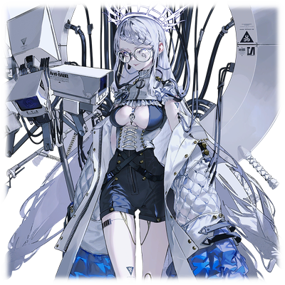
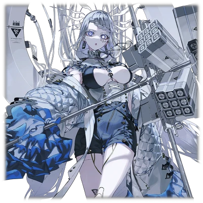
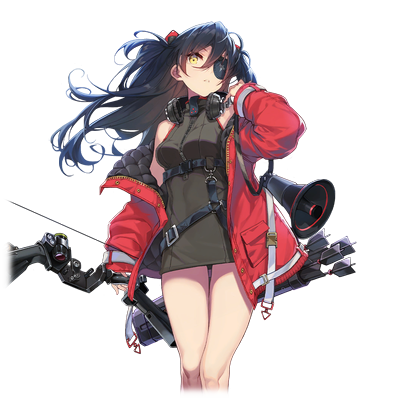
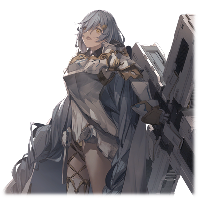

# 赛罗·达文斯

| 角色信息   |          |
| ----------- | ----------- |
|  名称 |赛罗·达文斯
|年龄 |容貌年龄30岁（制造后19年）
|职业|强硬派指导层
|对应乐曲|空間創造理論
|初出|Chunithm SUN PLUS

## Episode 1 如此美妙的世界

>亚哈所埋下的种子终将发芽，那些祈求着毁灭的人们，聚集到了那位大人的旗下。

强硬派指导者·亚哈自从在某座都市发现了一块芯片，他对真人的研究就开始突飞猛进。

耐用年限的延长，感情机能的解放。

这些东西都记载在这块芯片之中。

被机械装置的神明所设下的道道防线，在亚哈的手中被一一破解。

然后，同时也在研究着的，如何恢复真人的生殖机能的议题，也终于出现了起色。

然而，除了拔示巴这名有着生殖机能的真人外，亚哈在这方面就再无成果。

 

“——这样下去的话，我们就连旧人类都不如了。”

 

亚哈对此深感痛心。

对于他这样的研究者来说，这种既非成功，又算不上失败的，“半途而废”一般的结果，是毫无意义的。

要是没有再现这一奇迹的可能的话——

不必要的东西就必须全部处理掉。这就是研究所的规则。

作为一名沉睡于培养槽中的真人，赛罗本该像他的那些同胞一样被处分掉，但是，亚哈却迟迟没有对他下手。

亚哈那带着噪音的合成声线，在一片死寂的研究室回响着。

 

“就连我的肉体，也逃离不了毁灭的命运吗……”

 

亚哈大部分的身体部件都已经替换成了机械装置，现在的他早已超过了正常的使用年限，强行靠着机械元件活着。

然而就是这样聪明绝顶的他，也开始发觉自己终究是逃不过死亡的命运。

那么，他要做的，就是找到能够继承自己的所有智慧的优秀个体。

这个名为赛罗的个体，正是在智能方面出类拔萃，足以满足亚哈的需求的人。

 

“这样，我就有了全新的容器了……”

 

即便已经年老体衰，他的野心也未曾消退。

身为真人的希望，将会成为所有真人的母亲的少女，拔示巴——只要像她那样的真人能够诞生的话，那总有一天，地上将会被真人彻底占据。

 

“这片大地，是属于我们真人的东西。就让我亲手证明，不管是全新的人类，还是机械种，都是不该存在于这个世界上的东西吧！”

 

这执念的野火，烧遍了整个大地，带来了漫长的争斗和无数的悲剧。

* * *

* * *

率领着<ruby>强硬派<rp>（</rp><rt>INNOVATOR</rt><rp>）</rp></ruby>的亚哈，在与归还种的战斗中死去了。

很快，这一噩耗就传遍了奥林匹亚斯殖民地。

但是，由于指挥权很快就被转移出去，所以并没有产生多少混乱。

他早就在战争开始之前，预见到了自己死后可能发生的一切情况。

 

虽然外界的局势在一天天地变化，但是对于呆在研究室度日的赛罗来说，这都是无足轻重的东西。

本该对自己进行人格和记忆覆写实验的亚哈已经不在了。

结果就是，即将投入实用阶段的，将**虚拟人格和记忆移植至真人脑中**的实验项目被冻结了。

身为实验体的赛罗，也因为其副作用使得刚刚产生的人格消失，变成了跟废人无异的状态。

 

就在这空虚的日子里，赛罗迎来了那个人。

手持着祭祀用剑，有随从侍女护于身旁的少女——拔示巴·阿西德菲尔。

已经成为强硬派的领导人的她，是唯一经由自然分娩诞生下来的真人，而她，也拥有生殖能力。

她正是那些以亚哈为首的研究人员们的希望的象征。

对他们来说，拔示巴就是孕育真人的未来的圣母。

那些留在研究所里的研究人员们，见到拔示巴的时候都难掩心中的兴奋。

 

“哦哦！拔示巴大人！没想到‘命运之子’竟然会大驾光临——”

 

下一秒，这个研究员的脑袋就被祭祀用的剑砍飞了。

 

“说到底也不过是满足你们的欲望的道具吧？不要说这种大话……”

 

即便刚才才将这个男人的头颅砍下来，拔示巴却没有任何的反应，只有那澄澈的笑容始终挂在脸上。

 

“我感觉到了。这里也有必须尽快消灭的东西……”

 

她会来到这里，是为了将曾经对自己身体实施了无数实验的亚哈所遗留下来的实验室，一一摧毁。

对于想要**将真人从这片大地上抹除**的拔示巴来说，一切能够让真人生存下去的可能性，她都要抹除。

 

握着染血的长剑，拔示巴在实验室中徘徊着，质问着那些研究人员们是选择死，还是选择服从。

毫无疑问，这些忠心于亚哈的研究者们的选择只有一个。

这里没有一个人会为拔示巴而尽忠。

在这里的所有人，都是亚哈最忠实最虔诚的信者。

 

“这就是全部了吗？”

“所有研究人员都被消灭了。剩下的只有作为实验材料被培养的真人。”

 

接过侍从递来的资料，拔示巴的脸稍微歪了一下。

然后，她缓缓地向着实验室的隔离区前进。

即便房间昏暗，充满恶臭，拔示巴的面色仍旧不改，只是继续前进。

 

“——是谁？”

“你是……你就是赛罗对吧？”

“这里就只有我而已。如果那边那个东西不是你们要找的人，那就只有我了。没有什么事情的话，能否请你们离开呢？”

 

赛罗瞥向拔示巴脚下正滴着的血迹，也只是淡淡的说出一句“还真可怕啊”，然后就要求拔示巴等人离开这里。

但是，被要求的本人却没有离开这里的意思。

 

“还有什么事吗？”

“我只是想问一件事……因为，你是以自己的意志获得自由的，对吧？”

“……然后呢？”

“就只是这些。”

“……只不过是获得自由而已。对于只能无意义地苟活着的我来说，这有什么分别吗？”

 

这些话，让拔示巴想到了自己。

想到了自己曾经被亚哈等人肆意摆弄的时候的事情。

那时候，自己无数次地乞求着死亡，但他们所设下的诅咒，却无数次地阻挠着，侵蚀着自己。

眼前这个男人，简直就像是那时候的自己一样。

“你也……跟我一样呢。”

“谁知道呢。”

“那么，就让我们一起确认吧……确认这个世界是否还能允许我们的存在。”

 

这么说着，拔示巴向赛罗伸出了手。

 

“要将世界破坏成什么样呢？”

## Episode 2 只是存在于那里

>自从与她邂逅以来我确信了一件事。那些让真人诞生于世的元凶——“系统”，才是我们应该打倒的敌人。

对拔示巴的思想表示理解的赛罗，成为了她的心腹，为她鞠躬尽瘁。

然后，那些与他一样经历了拔示巴的研究的人们聚集了起来——最终变成了拥有共同思想的，充满忠诚和狂信的组织。

以施行恐怖政策的拔示巴作为靠山，在真人之中，没有人敢公然反对他们。

就这样，强硬派变得愈发稳固，意志愈发统一，而他们在各个领域也是突飞猛进。

其中就包括了战斗技术和生产能力的提升，以及武器的技术开发。

真人们的潜能也在这飞速发展中得到了解放，最终获得了足以与机械种分庭抗礼的力量。

但是对于这些狂信徒们来说，真人的繁荣发展并非他们的本愿。

他们终究还是为了她的愿望而行动的。

 

就在这些心腹们为了完成拔示巴的愿望而行动的时候，在进攻佩尔修斯殖民地的途中，赛罗想到了一件事。

 

“就算把地上所有的生命都灭绝，如果没有将他们的根源，也就是‘系统’毁灭的话，那就毫无意义。”

 

会让赛罗这么想的原因，源自于拔示巴在塞雷基亚殖民地初次遭遇某名归还种少女的经历。

她不知用什么方法进入了拔示巴所在的中枢塔，并且破坏了突然启动的机动兵器。

只用了一击。仅仅一击。

面对这超常的力量，赛罗被其深深地折服了。

另一方面，拔示巴也从那个归还种的行动中明白了一件事——那就是归还种们拥有可以接触并且利用殖民地的装置的权限。换句话说，他们拥有和“系统”连接的力量。

而就像是证实着他们的猜想那样，殖民地的能量供应出现了大混乱。

 

而这一猜想，最终变成了确信。

在赛罗的主导下，真人们开始分析起归还种的身体。那些在伊欧尼亚殖民地回收的归还种尸体上，确实拥有真人所没有的机能。

 

从此之后，拔示巴的行动方针开始大幅变更。

必须获得系统的访问权。这样的话，这个错误的世界就会在拔示巴大人的手下被修正。

真人们也像是呼应着她的意志一般，强硬派的势头更加势不可挡。

 

就在即将对佩尔修斯殖民地发动进攻前夕的某天夜里。

赛罗一个人正构思着导向灭亡的计划。

 

“看来规模要远远超出我的想象啊。”

 

在思索之中，赛罗自然而然地想到了拔示巴。

不知何时，她曾经这么向赛罗他们说到。

 

“所有人的罪业，都在我的心中。”

 

赛罗在无数的人格和记忆的覆写实验中，被破坏到跟废人无异的状态。

也正因此，赛罗没有任何类似于愤怒或者怨恨的感情。

那么，拔示巴又如何呢？

只是冷眼观察这个世界的她，既不会愤怒，也不会崩溃，更不会绝望。

从她身上看不到任何感情的波动，就像是以单一的某种意识组成的“生命体”一样。

她就是理所应当地存在于此。

 

“……”

 

——我和拔示巴大人是不一样的。

即便我比任何人都要接近她，但我却感觉自己和她有着一层厚厚的隔阂。

现在，所有的真人们都集结于她的意志之下。

但是，不管再怎么共享一种意志，随着集团的日益壮大，越是外围的人，其质量就愈发低下。

那么，我能做的事情，就只有在拔示巴完成她的大愿之前，当唯一能够理解她的人了。

即便在我身死之后，我也——

 

“不论发生什么事情，我定会将其达成。”

 

为此，赛罗准备了好几手的计划。

但是，他准备的计划，却在意料之外的地方出现了问题。

那就是——圣女拔示巴的生命，已经危在旦夕了。

## Episode 3 两个赛罗

>计划所必需的一切要素都已就绪。就让这个世界，蜕变成为她所期望的模样吧。

绀青之都·萨马拉坎达。

在拔示巴的突然驾崩导致计划不得不紧急变更之后，赛罗选择了这座废弃都市。现在，在这座废弃都市的中枢，机械种正与真人展开着激烈的战斗。

真人凯南·梅尔维亚斯所面对的，是正露出冷酷的笑容的女性型机械种——艾娃·多米南斯XII。

被凯南搬运到萨马拉坎达的她，在计划即将执行的前一刻苏醒，阻挡在凯南的面前。

 

艾娃径直冲向了位于房间正中央的容器。

在那容器中漂浮着的，是圣女拔示巴的尸骸。

艾娃判断，那容器中的东西，才是凯南他们的计划中最不可或缺的要素。

 

“结束了！”

 

就在艾娃向着容器发动全力一击的时候，本该命中容器的攻击，被凯南舍身的飞扑挡住了。

 

“咕……！”

“真是不可理喻。这种行为有何意义？”

 

对于只会做出最合理的判断的艾娃来说，凯南的行动没有任何意义。

在他的脚下，已经形成了一片血泊。就算不用她动手，他也撑不了多久的吧。

但是，明明自己已经奄奄一息，凯南却露出了自信的笑容。

 

“也罢。”

“计划已经成功了。由我……由我完成了！！”

“是吗——啊，怎么——啊——？！”

 

就在凯南即将被艾娃连着容器一起被打个对穿的瞬间。

突然，艾娃发出了远远超出人类可以承受范围的尖锐声音，接着，停止了动作。

接着，那钢铁制的身体倒在了血泊之中。

她的身上，正插着一条不知道从哪里伸过来的线缆——

 

“……到底是什么，才让你变得这么天真的？”

 

一个机械般的合成音响起。

原来，一名机械装置的士兵，正站在艾娃的身旁。

头部部分只有类似眼眶的凹陷，剩余部分就没有任何显眼的特征。眼前的机械士兵，怎么看都是那种用完即弃的型号。

俯视着僵直着倒在地上的艾娃，凯南轻蔑地笑到。

 

“哼……真是可悲的模样啊，**赛罗·达文斯**。”

“……”

 

被叫做赛罗的机械兵只是沉默着。

 

“已经结束了吗？”

“……艾娃·多米南斯正做着梦呢。”

 

再次向着艾娃望去，她的眼睛正轻微痉挛着，翻着白眼。

从艾娃倒下之后就一直维持着这副样子来看，她的脑核之中的意识应该正受着侵蚀吧。

 

“打开乐园之门的钥匙，已经集齐。”

 

接着，机械兵托起艾娃的身体，将她放到了旁边的台座上。

在这台座的旁边还放了另一个与之相对的台座。上面正横躺着一名身穿着白色铠甲的女人。

她正是为了这一刻准备的，由洛特所回收的归还种——尼亚·尤蒂特。

这名少女，将成为拔示巴的意识所凭附的容器。

机械兵平静地将数条线缆装在了她的头上。

 

“站起来，凯南。你还有必须完成的事情。”

“哼，明明这具身体也只是你的一部分而已……”

 

凯南正是赛罗在继承了亚哈的研究之后，在其研究的发展线之上所制造出来的，**拥有赛罗的虚拟记忆的真人**。

虽然赛罗不知道凯南到底是因为什么契机才会反抗着赛罗的支配直到现在，但是，现在的凯南已经彻底服从于赛罗的控制，记忆已经融合并且完成了同调。

 

“准备进入下个阶段。”

“这不用你说。”

 

凯南稍事包扎了一下血流不止的腹部之后，就缓缓走向了艾娃的方向。

他走到了头部面前，从台座侧面的收纳空间取出了工具。

 

“——现在，准备开始切除艾娃的脑核。”

 

凯南的身体，现在也正在发出悲鸣。

但是即便如此，他也必须继续做下去。

就算只是为了让自己不失去生存的理由也罢。

## Episode 4 脑核

>现在，大门将在我们面前敞开。就让我们为这傲慢地统治整个世界的“系统”，下达裁决吧。

在赛罗的监视下，凯南取出了装在台座侧面的收纳空间中的工具。

从细小的针线到锋利的手术刀，甚至还有能够将各种东西切断的圆锯，这里的工具一应俱全。

凯南伏下身来，来到了艾娃的头部附近，轻轻用手摸到了脖颈的位置。

在人工皮肤的表面，细小的线正横断皮肤组织，向着其他地方延伸着。

凯南瞄准了位置，将手术刀刺了进去。

接着，凯南手握着被揭起来的皮肤，向着后脑勺的顶端，缓缓地剥着。

就像撕开番茄表皮一般，凯南将后脑勺的皮肤取了下来。出现在他眼前的，是保护着脑核的暗色硬块。

 

“……！”

 

强忍着腹部的剧痛，凯南继续着手术。

利用圆锯，他轻轻地切割着硬块的表面。随着一个长方形的口子被切割出来，顿时，头壳处传来了漏气的声音，而那块切割出来的碎片也掉进了口子里面。

通过切割工具，凯南终于成功将机械种最为重要的零件——脑核给找了出来。

模仿人类制造出来的脑核，即便暴露在外部的空气下，也按着一定的规律持续闪着微光。

这就证明艾娃并未停止机能，仍旧在继续运行着。

 

凯南将口子的大小扩张到足以取出脑核的地步，接着，他取来几根像针一般细小的导线，轻轻地插进了被半透明的保护膜包覆着的脑核。

随着“噗呲”一声，保护膜被刺穿。接着，导线处也开始闪烁起淡淡的蓝光。

确认了蓝光正以同等频率闪烁着的凯南缓缓说到。

 

“远程连接已经完成。”

 

艾娃就这么在不知情的情况下被活生生的解剖，变成了用于连接Metaverse系统的工具。

 

“甚好。”

 

看着凯南完成了自己的工作，赛罗就像是赞赏一般，敲响了自己的金属手臂。

终于，赛罗获得了一切的钥匙。

前往Metaverse的道路——这不可侵犯，不可触及的领域的大门，即将在他面前敞开。

## Episode 5 万千思绪

>舍弃肉体，我将自己装进了机械的身体。即便是欠缺感情的我，也会为了那位大人的复活而赴汤蹈火！

赛罗指示着凯南，利用提取出来的脑核启动了管理都市的中枢机能的控制单元。

在支撑着中枢塔的圆柱体之中，有一个小空间用于收纳脑核。打开一看，原来里面已经存放了另外的脑核。

里面的脑核，正是为了试运行而装进去的，来自旧世代型号的监督官……**艾萨克·多米南斯VIII的脑核**。

赛罗随手将艾萨克的脑核取了出来，把艾娃的脑核装了进去。

 

停止工作的控制单元，在几分钟之后再次启动。

浮在空中的窗口画面，正高速闪现着无数的文字序列。

很快，萨马拉坎达就从离线的状态，重新进入了就绪状态。只要一声令下，这座都市就能够再度连上Metaverse了。

接下来，就只剩下复活圣女拔示巴了。

将拔示巴的意识从原来的肉体中解放，利用覆写真人的记忆的技术，将拔示巴的意识移植到那个归还种女性身上的话，拔示巴就能够重获新生。

 

“已经不知道为了这一刻等了多久了……”

 

自从拔示巴的肉体迎来死亡，已经过去了十几年。

赛罗也早已失去了本来的肉体，移植了无数次意识。随着他移植的次数越来越多，他的自我意识也在消耗着，消耗到几近消失的地步。

要是这次行动以失败收场的话，那这漫长的计划就将彻底化为泡影。

在这漫长的旅途的终点。

他所等待着的答案，现在就在他的面前。

 

“终于到时候了。”

 

连操作框上的意识移植的提问都不用看，赛罗按下了确认键。

瞬间，意识的覆写操作已经开始。

与正漂浮在容器中一动不动的拔示巴相对，躺在台座上的尼亚，正拼命挣扎着。

 

“嗯！啊————啊————————！！”

 

尼亚的意识开始和拔示巴互相融合，同化。

即便是这样，尼亚仍旧在抵抗着，偶尔发出不成样子的悲鸣，身体不由自主地痉挛着。

但是，这些抵抗也是徒劳的……很快，尼亚就平静了下来。

终端终于弹出了完成的提示窗口。

接着，只要确认拔示巴的意识是否已经定型就可以了。

 

就在这时，终端上出现了别的画面。

那是布置在萨马拉坎达内的监控影像。影像上，正有两个人向着中枢前进。

能够来到这里的人，屈指可数。

 

“……洛特，你难道是在可怜他吗？”

 

赛罗所望向的地方，正是跟随着洛特一同前进的沃特。

两人同样对自己的母亲有着扭曲的感情。

正因为洛特忠实于自己的想法，才会做出这样的行动吧。

 

“也罢。就让你见见自己的母亲吧，沃特……”

## Episode 6 与母亲的邂逅

>像沃特这么好操控的人可不多见。说到底，他也不过是我创造出来的傀儡而已。

终于到达中枢的沃特，立刻就被漂浮在容器中的母亲——拔示巴的身影吸引住了。

但是，沃特不是只见母亲一面就会满足的人。

就在他欣喜若狂，试图冲上前去见一见拔示巴的时候——一个人阻止了他。

 

“到此为止了。不要再接近拔示巴大人了！”

“谁！？”

 

眼看这感动的瞬间被他人打断，沃特不由分说地举起了手中的手枪。

然而，作为久居高位的人，他的动作实在是太笨拙了，到处都是破绽。

沃特就这么在紧张和不安之中环视着四周。而他看到的，只有无数士兵的尸体，还有伫立于深处的机械装置的士兵。

就在这时，沃特终于注意到一件事。

那就是在远处斜坡之上的两个台座之上，正躺着刚刚被打开了头颅的机械种艾娃，还有像是睡死了一般，沉睡于另一台座之上的，归还种的女性。

 

“这到底，是什么——”

“这是，仪式。”

 

回答了沃特的提问的，正是背靠着艾娃所在的台座，瘫坐在地上的凯南。

沃特条件反射般地举起手枪，瞄准了勉强站起身的凯南。

“凯、凯南！你这叛徒……！”

 

面对又惊又怒，愤而举枪的沃特，凯南只是揶揄般笑着。

 

“呵呵，要是在这里开枪的话，拔示巴大人就真的要永远沉睡在那副躯体里面了哦？”

 

仪式已经完成，接下来只用等待拔示巴的苏醒就行了。

虽然凯南说的这些话看似天方夜谭，但如果是跟“母亲”相关的事情，那沃特肯定是坐不住的。

 

“母亲大人早就已经驾崩了。你要是胆敢玩弄母亲大人那神圣不可侵犯的尸骸，那就由我亲手杀了你！！”

 

不出所料，沃特仍旧只是把手放在扳机上，并未按下。他的声音中已经带了些许颤音。

凯南给了这样的沃特致命一击。

 

“非也。实际上，她还活着。活在‘那里面’。”

 

凯南把目光转向了某处——正躺在另一个台座上的归还种的少女。

 

“你，你说什么……”

“‘容器’很快就要完成了。圣女·拔示巴，将在这里重获新生。”

## Episode 7 虚假的记忆

>我们说到底都是为了实现她的愿望而制造的棋子。不管是洛特，还是沃特，就连我也不能例外。

圣女拔示巴，即将以崭新的身体重现世间。

凯南如此信誓旦旦地说着。

但是，沃特却始终都无法相信如此非现实的事情会在自己的眼前上演。

就算真的成功了，那个拥有拔示巴的意识的归还种的女性，真的能够称作是拔示巴吗？

 

“真，真的吗？母亲大人会……？”

 

沃特已经没有了任何疑惑和愤恨，只是像个小孩一般，站在那里乞求着凯南。

 

“快点，快点让我见见母亲大人啊啊啊！！”

“**呵，呵呵……你这人……真的是，太滑稽了啊……**”

 

这正是曾经创造了沃特的人，来自赛罗·达文斯的话语。

 

“甚好。没想到啊……你的执念竟然已经如此深厚。老实说，你已经远远超出了我的想象。”

“想象？你这家伙究竟明白我的什么！”

“我能明白。因为我和你，说到底也不过是别人手中的小丑而已。你就算不理解也很正常。”

“我为了完成母亲大人的愿望，筹划了战争！攻下了佩尔修斯殖民地！为真人带来繁荣的，是我啊！有资格能够获得母亲大人的宠爱和荣誉的，只有我！只有为此而生的我啊！”

“那么，这又是谁的愿望呢？”

“……什么？”

 

面对这预料之外的问题，沃特露出了目瞪口呆的表情，只能呆呆地望着凯南。

 

“人在出生的时候，是不会有那样的愿望的。我再问你一次。那究竟是谁的愿望？”

 

沃特努力地思索着自己的记忆。但是，不论他怎么回想，都想不起与自己的行动有所关联的记忆。

 

“不可能……这种事情，怎么可能！我的愿望，肯定是母亲大人的——！！”

“如果你觉得你想得起来的话，那就尽管试试看吧。因为这些东西，从一开始就不存在。”

“我……我是……和母亲大人……”

“你根本就不知道母亲的事情。因为她从最初就沉睡在这里。”

“那么，我究竟……是什么……”

“你什么都不是。你只是个连‘阿西德菲尔’的名号都得不到的，无名无姓的真人而已。”

“为、为什么你会知道……知道这些的那个男人已经死了！早就已经死了啊！那个叫做赛罗·达文斯的男人……！”

“但是，他现在就在**这里**。”

 

沃特的脸上写满了恐惧与不安，看着这样的沃特，凯南露出了自信的笑容。

 

“准确来说，应该算作是我的**一部分**吧。”

 

赛罗就连自己都当成了实验对象，在亚哈的研究基础之上继续发展着技术。

而他所研究的，正是**把真人的记忆覆写至别的目标上的技术**。

在他的实验体之中，就包括了一名叫做**“凯南·梅尔维亚斯”**的真人……

 

“————！”

“就让我亲自告诉你吧。告诉你，你的愿望究竟是来自何方……”

 

沃特无力地跪了下来。

沃特，被自己的创造主否定了自己的存在。现在的他，那曾经高傲无比的自尊心已经被摔了个粉碎，在这世间，已经再无任何东西能够支撑他的精神了。

就在沃特那虚无的眼神望向容器中的母亲的时候——一道响亮的声音响起。

 

“那么，苏醒吧！”

“啊……母……母亲大人啊啊啊……！”

 

那正是期望着世界毁灭的人们所追寻着的最终结果。

归还种·拔示巴，此刻再诞于世间。

## Episode 8 HELLO WORLD

>圣女，终于以完全之姿觉醒了。不久，这个世界也将会从“生”的诅咒之中解放，重获新生吧。

“这——就是我的身体吗……再也没有病痛，再也没有痛苦……啊啊，这样的话，就能够带着大家前往那里了……”

 

随着意识的苏醒，躺在台座上的女人也渐渐地站了起来。现在，这个既是尼亚，也是拔示巴的存在——尼亚·拔示巴，正活动着肢体，露出恍惚的笑容。

 

“啊啊……这是何等地自由……”

 

从身体的深处涌现出来的，是一股无所不能的感觉。

曾经纠缠着自己的，防止自己自杀的恐怖诅咒，在这具身体里并不存在。

舍弃了旧的肉体，获得了新的容器的她，终于成功摆脱了名为真人的这一枷锁。

 

“母亲大人！！！！！”

“……”

 

就象什么都没发生一样，拔示巴转过头去，把目光投向了凯南和旁边的机械兵。

 

“赛罗……这次轮到你当人偶了吗？”

“您似乎变得更加敏锐了呢。”

“看起来似乎很高兴的样子呢。”

 

站在旁边的凯南附和到。

 

“啊啊。非常地，非常地——”

“母亲大人啊啊啊啊！！！！”

 

沃特已经泣不成声，跪在地上，试图爬到拔示巴的脚下。就在凯南打算把沃特赶走的时候，拔示巴并未在意，只是蹲了下来，与沃特四目相对。

 

“你……也非常努力了哦？”

 

这正是沃特一直在寻求着的话语。

简直就像是如鱼得水般，沃特立刻笔挺地站了起来。

 

“是的！我为了母亲大人，成功攻下了佩尔修斯殖民地，为我们强硬派带来了胜利！这一切，都是为了我敬爱的母亲大人所应尽的事情啊！”

 

拔示巴露出了温和的笑容，轻轻地抚摸着沃特的头。

 

“辛苦你了。”

“啊……母亲大人——”

 

沃特就这样再也无法动弹了。

到底是初次受到母亲的承认呢，还是第一次感受到了来自他人的爱呢，抑或是两者皆有？

无论如何，沃特都因为这突如其来的喜悦，直接昏死了过去。

 

“肯定在做着幸福的梦吧……”

 

在放开了沃特之后，沃特与凯南和赛罗，一同开始了与Metaverse的连接。

从现实世界前往电子的乐园·Metaverse，破坏掉这个扭曲了整个世界的系统。

只要这样的话，在那前方的未来，迎接他们的，将是一个不再被“生”所束缚的全新世界。

 

“来吧，让我们一起前往美妙的明天吧——”

 

就在拔示巴静静地转向门扉所在的地方的时候。

 

“——尼亚！！”

 

从大开的门扉对面传来的，是一个令拔示巴无比怀念，无比怜爱的声音。

 

“啊啊……”

 

出现在她面前的少女的脸庞，跟拔示巴生前在塞雷基亚遭遇的那名归还种的女性，有着相似的感觉。

但是，不止如此。

从内心深处不断涌出的想法，正拼命地呐喊着。

我知道这个人。

我现在，打从心底里，很想见到她。

 

**——因为，我就是尼亚·尤蒂特啊。**

 

拔示巴冲了出去。

这久别重逢的场面，令她的心无比雀跃。

 

“真的好想见到你啊，米斯拉……米斯拉·特尔塞拉！”

“咦……？”

 

眼前的人，虽然有着同样的脸庞，同样的声音。

但是面对站在自己面前的尼亚，米斯拉却没有动弹的意思。

 

——不对。有什么不对劲。

 

米斯拉的直觉这么说着。

 

“你究竟……是谁？”

 

面对这个质问，对方露出了一副不解的表情。然后，拔示巴露出了圣女一般的温柔微笑。

很快，米斯拉就明白了。

眼前的这个女人——并非尼亚。

 

“尼亚在哪里？”

“呵呵……我不就在这里吗？”

“不是。我很清楚的。”

“但确实是这样啊。现在的我，并不是‘一个人’，而是‘两个人’啊……”

“尼亚……尼亚是独一无二的啊……”

 

米斯拉的脸上，已经没有了刚才的自信。

面对眼前这个似是而非的尼亚所说的话，她并不理解。

就在这一团雾水之中，米斯拉无意识地握紧了“密特隆”。

 

“把尼亚……还回来……”

 

米斯拉望着尼亚的眼睛深处的某个地方，用着微小的声音说到。

面对这样的米斯拉，拔示巴只是缓缓地走了过来——然后温柔地抱住了她。

 

“明白了吧……尼亚，就在你的眼前啊。”

 

在触碰到尼亚的身体的时候，米斯拉终于明白了。

眼前的她，既是尼亚·尤蒂特，也不是尼亚本人。

而真正的她，现在也正潜藏在那里面吧。

 

“——！”

 

如此确信的米斯拉，也紧紧抱住了尼亚的身体。

 

“我绝对会让你把尼亚给还回来的……”

“那就必须先完成约定才行了。毕竟是重要的朋友的请求嘛。在那之后，我会考虑的。”

“是什么样的约定？”

“大家，都会前往同样的明天。前往没有痛苦，无比美妙的新世界——”

 

从她口中所说出的一字一句。

都是没有任何的邪念的，无比纯洁的祝福之语。

但是，米斯拉只是摇了摇头。

 

“不。我不会让你这么做的。”

“就算，要把我杀死……你也要阻止我吗？”

“嗯。因为，我必须先实现我的愿望才行。”

“呵呵……原来是这样啊。看来，你也是个任性的人啊……”

 

就像是歌唱一般，就像是舞蹈一般。

放开了米斯拉的拔示巴，只是回过身去，向着来的方向缓缓走去。

这一幕，简直就像当年两人分道扬镳的模样。

然后，拔示巴触摸了放置在房间中央的构造体。

 

“<ruby>利柏耳塔斯<rp>（</rp><rt>Libertas</rt><rp>）</rp></ruby>”

“驱动邀请，承认——”

 

随着机械声响起。

那个东西变成了十字的形状，随着使用者的意志发出了淡淡的光芒。

“尼亚，一直就是这样的。每次听到我的任性发言就会生气——‘密特隆’”

“驱动邀请，承认——”

“由赢的人决定一切。可以吧？”

“嗯。因为，这就是我们的妈妈所定下的规矩啊！”

 

地上世界与Metaverse的漫长争斗。

决定这一切的命运的，是一场随处可见的，朋友之间的“争吵”。

为了各自的明天，她们举起了武器，开始了战斗——