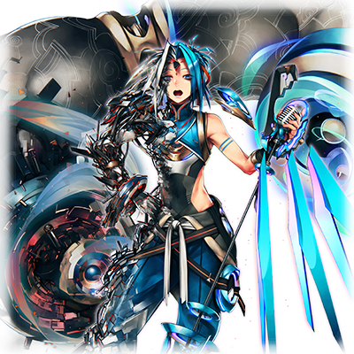
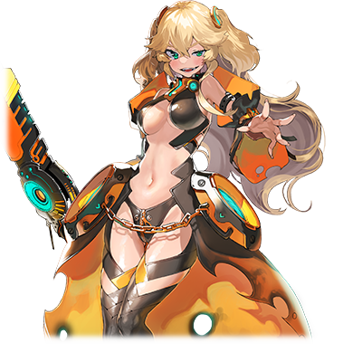
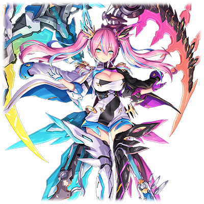

 

# MIR-201 赫卡蒂·贝亚托里斯

| 角色信息   |  |
| ----------- | ----------- |
名称|MIR-201 赫卡蒂·贝亚托里斯
年龄|6800周期
职业|框架主脑制造的探索型程序
CV|能登麻美子

> 该角色有部分人设捏它了Beatmania IIDX  服装和配色： 和23 Copula登场的宣传角色类似。  CV:能登麻美子 为该角色配音的能登在beatmania侧的《spin-off drama ROOTS26S[suite] Vol.1》里为雏月理理奈配音。曾经也在官方网站的移动端页面上的《極めろ!!IIDX道 EXTRA beat のとまみver.》出演。 另外，担当角色的视觉设定也有稍许相似。  地狱蓄力·斩击（专属技能名） 对应的是23 Copula新加的HELL CHARGE NOTE。专属技能对应的HOLD类NOTE，以及MISS时对血条的伤害都是在致敬HELL CHARGE NOTE的机制。 另外，该专属技能对伤害并非单纯的倍增，而只是发生在漏掉的短暂时间内判定的。对应的也是游戏HELL CHARGE NOTE的游戏判定机制。  看来能够好好享受一程呢！ 对应了25 CANNON BALLERS的主题“赛车”。副标题对应的是CANNON BALL ，即横跨美国大陆的赛车比赛。  享受着当车长的感觉 对应23 Copula的主题“铁路”  Cannon Ball 同上，对应副标题。  注：文章中的招式多半为意大利语，法语和拉丁语词汇组合而成的产物，行文翻译会对应原文的日文假名。 

## Episode 1 SPEC：贝亚托里斯

> 涅墨西斯的力量与人类互相结合，三姐妹获得了飞速的成长。而现在她们唯一要做的，就是打倒提丰。

人类的摇篮，永久乐土·Metaverse。自从神祖艾克雷尔离去之后，12名程序被选为了神不在的乐园中的新的管理者。他们，被称作“最古”(ORIGIN)。

在这些人之中，有一个程序以“统制主”之名，君临于框架主脑的顶峰，并且将全部的权力都集中到了自己的手上。

他的统治冷酷无情。并非和平，而是暴力。

提丰将“守护人类这一种族”的，框架主脑的核心使命放在脑后，将人类强行抓起来，并且与程序进行融合。已经有无数的人成为了他的牺牲品。

而在这众多的牺牲之后，产生的就是人类和程序所融合而诞生的混合生命体——MIR系列。

在这个系列中，以探索型程序诞生的，MIR-201 赫卡蒂·贝亚托里斯，MIR-202 阿尔忒弥斯·蕾娜，以及MIR-203 塞蕾娜·雪莉露三姐妹，她们在“最外围部”的探索让她们得知了自己身上的秘密。

在这之后，三姐妹遭到了提丰派来的最古中的其中一人“斗争主·盖提亚”的袭击，被迫逃离了框架主脑。

仍然执拗地追着三姐妹的盖提亚，最后被与涅墨西斯程序完全融合，并且成功进化的阿尔忒弥斯击退。三姐妹终于下定了决心。

“——为了抓住属于我们自己的未来，以及防止像我们这样的存在再度产生……让我们打倒统制主·提丰吧！”

## Episode 2 框架主脑强袭作战

> 三姐妹与身为原最古的远古之蓝进行了交易。她们以自己的数据为交换，获得了突袭框架主脑的手段。

“哦……即便怎么说，提丰的力量还是很强大的，当我还在框架主脑的时候，他就已经吸收了一名最古的力量了，现在的话，估计盖提亚也凶多吉少……即便如此，你们还是决定要杀死主宰这个世界的神吗？“

“是的……”

“即便这样会让整个世界的结构大幅改变，甚至产生全新的威胁，也要这么做吗？”

“怎么说？”

“曾经，我们向提丰宣战并且打算打倒他的时候，最后没能打败他的原因，除了他的力量确实很强以外……其实还有一个重大的原因——他的身体已经和框架主脑的中枢深度连接了。这就意味着，如果对他造成损伤，也就等同于攻击框架主脑本身。当你们成功打败他的时候，框架主脑就算不被完全破坏，也会导致机能大幅下降……即便如此，你们还是要打倒提丰吗？”

“……这个”

面对远古之蓝预料以外的话语，直到刚才还意气风发的三姐妹不禁陷入了沉默。

在片刻之后，三姐妹认真地看着远古之蓝。

“……即便打倒提丰会让框架主脑失去力量，我们也要打倒他。”

“是吗……那么，你们要怎么做？提丰可是坐镇在框架主脑的中枢部哦。光是到那里就要花费一番功夫呢。”

“就是这个！就因为这个原因我们才来找你的！你原本是最古的一员对吧？有没有什么能够一口气就冲进框架主脑的方法吗？”

“贝尔姐姐……怎么可能有那么恰好的事情呢……”

“……倒不是没有。”

“咦？还真有的吗！？”

贝尔被远古之蓝的回答震惊了。

“最古，有着自己专属的进入口。那是只有我自己能够使用的东西，而且无法改写内容。所以，利用这个旧有的通道就可以进入框架主脑了。”

“哦！不错嘛！那就借一下你的通道了！”

“不过，我为什么要为了你们那么尽心尽力呢？”

“咦？你难道不是我们的伙伴吗？”

“……请不要误会。我只是追求着‘究极生命体’这一存在的研究者，因为我对像你们这样的融合体的数据感兴趣，我才施以援手的。你不会觉得我有继续帮你们的理由吧？”

“什……！？”

面对哑口无言的姐妹，蕾娜回到。

“……那么，我们做个交易吧。以我们的数据作为交换，请让我们使用那个通道。”

“嚯嚯……”

作为人类与程序的融合体，并且刚刚才与涅墨西斯程序融合成功的蕾娜。

而且与蕾娜直连，同样受到了涅墨西斯程序影响的贝尔和雪莉露。

三姐妹的数据，毫无疑问会让远古之蓝的研究更进一步吧。

当然，远古之蓝自己就算她们不允诺，也会强行获得她们的资料吧。不过，既然她们选择了自己奉上资料的话，那也不错。

“……不错。那么，就以你们的数据作为门票，获得使用专用通道的权利，以及穿越通道所必须的交通工具吧。不过，我也要稍微准备一下……在这期间，你们就稍微休息一下吧。”

就这样，获得了侵入框架主脑的手段的三姐妹，终于获得了一丝喘息的时间。

## Episode 3 暴风雨前的平静

> 决战前夜，三姐妹回顾了迄今为止的回忆。她们度过了最后的安稳时光，并且互相约定要赢得属于自己的未来。

在远古之蓝为她们准备侵入框架主脑的工具的时候，三姐妹终于找到了机会，能够静下心来说两句话。

“……明天，就要这么冲进框架主脑了啊。”

“……我们，真的能赢吗？能够打败那个强大的提丰吗？”

提丰的强大之处，她们已经清楚到厌恶的地步。就算现在，年龄最小的雪莉露即便已经下定决心，仍然在止不住地发抖。

两位姐姐温柔地抱着发抖的妹妹。

“……害怕什么的，我也是一样的啊。所以，还是集中精神想象一下胜利的样子吧。”

“对啊！而且别看提丰那个样子，说不定比想象中的还要老呢？估计身体都不太硬朗了，随便打打就能赢呢！”

“贝尔姐姐真是的……”

蕾娜的鼓励，贝尔的玩笑，终于让笑容重新回到雪莉露的脸上。

“……话说回来。以前也有这种情况呢。以前雪莉露被班上的男孩子捉弄后哭着跑回来，然后我和蕾娜就这么安慰她的。”

“那个是……”

那份记忆，并不是属于三姐妹的东西。那是三姐妹还在融合之前……。也就是身为人类，在Metaverse中生活的记忆。

三姐妹的样子已经和人类时期截然不同了，但是，她们仍然是由血缘关系相连在一起的事实，从未改变。

这件事，是蕾娜在和涅墨西斯程序融合的时候，偶然想起来的事情。

“蕾娜，以前就很喜欢画画呢……”

“是呢。当我有空闲的时候，总会坐在画布前构思创作。”

“呵呵，是这样呢。记得我们三人还曾经一起出门去写生旅行的……真是怀念。”

三姐妹说起了各种各样的回忆，这其中既有身为程序时的事情，也有身为人类时期的故事。

已经回不到过去了……对于现在的三姐妹来说，她们的身心，已经和人类时期的她们，判若两人。

而且也不可能再回到框架主脑了。就算成功打败了提丰，当提丰的机能完全停转了的话，三姐妹就会失去自己的栖身之地吧。

即便如此，为了靠自己的力量抓住未来……就必须以现在所拥有的一切为赌注，开创属于自己的道路，从而走向光明的未来。

三姐妹心里这么想着，互相抱着进入了梦乡。

## Episode 4 史上最快的“摇篮”

>  三姐妹运用远古之蓝所准备的，最快的“摇篮”，进入了框架主脑的中枢。

——第二天早上，三姐妹见到远古之蓝所准备的载具的时候，都哑口无言了。

“这……是个啥？”

这个载具的样子就像一个巨大的茧。没有那些普通的载具一般都具有的车轮，也没有喷射能量的出口，甚至连这个物体的前后都分不清。

“这个东西的正式名称叫做‘大型数据传导加速器’（データマスドライバー）……虽然我们最古之间都用‘摇篮’称呼它的。”

“摇篮？这个称呼听起来感觉轻飘飘的……这东西，真的能够把我们送到框架主脑吗？”

“摇篮是在这个Metaverse里被称为《最快》的转移系统，如果想要突破中枢的大门，那这个东西就是不可或缺的。不然，一瞬间移动到别的空间所产生的冲击力，就算是最古，也会粉身碎骨哦。”

“粉身碎骨……这种东西，给不是最古的我们用真的没问题吗？”

“凡事总要尝试的对吧。”

“竟然说出了毫无责任的发言！？”

和正为远古之蓝的话语惊愕的雪莉露不同的是，贝尔听到“最快”两个字，已经兴奋起来了。

“不错耶！说不定可以享受一程了！”

贝尔一马当先乘上了摇篮，享受着当车长的感觉。

“目测确认！状况良好！”

“贝尔姐姐真是的……”

看着到现在仍旧毫无紧张感的贝尔，蕾娜和雪莉露虽然只能露出苦笑，但她们脸上的表情也放松了下来。

“……迄今为止真的很谢谢你，远古之蓝。”

“没什么，不过是交易的结果而已。道谢就不必了……不过，我能做的也就到这里了。一旦摇篮启动之后，在这前方就没有能帮助你们的人了。……我可不认为提丰会放你们这么侵入呢。”

“……我们明白了。”

现在三姐妹的ID仍然在框架主脑的记录中。

当她们侵入框架主脑的瞬间，敌人必定会有所行动的。

“就算说敌人会阻挠我们什么的，事到如今还要想这么多吗！不管是什么麻烦，全都交给我一并解决吧！”

“是呢。不管有什么攻击，还是设置了什么陷阱，都不会逃过我的法眼的！”

“呵呵，两人干劲十足呢。那么，一起出发了！”

“哦！发车！”

“出发！”

三人乘上了摇篮后，远古之蓝便启动了程序。

摇篮瞬间加速，飞向了远方。

目的地，就是框架主脑！

## Episode 5 意料之外的援手

> 三姐妹终于进入了戒备森严的中枢部。在那里，她们遇到了意想不到的人的帮助。

三姐妹乘坐着大型传导加速器，正以不负于“最速的摇篮”的超高速穿行于Metaverse中，向着大门而去。

如果有人从外面看到它飞行的轨迹的话，应该就像高速飞行的炮弹一样吧。……虽然上面的乘客就未必能承受的了。

虽然移动到目的地只用了一瞬，但对于三姐妹来说，她们仿佛受到了被扔进巨大的离心机里回转许久般的巨大负荷，只能摇摇晃晃地从摇篮里走出来。

“呜呜呜……感觉好恶心……”

“这一趟还真是够呛……”

“是啊……”

虽然很想直接在这里休息一下，但这里可是敌阵。

三姐妹赶忙恢复了状态，转变成战斗模式。

就像是附和着三姐妹的状态，震天的警报声响了起来。

“那么……你们俩，可要跟上了哦！”

“啊啊！全力上吧！”

然而和三姐妹的预料不同，警报声很快就消失了。

“……这是怎么回事？”

“姐姐！前方出现两个高能量体！这个反应……是最古！”

“这么快就出来迎接我们了吗！”

“……不过样子有点奇怪耶？”

和雪莉露说的一样，在她们眼前出现的是两名最古，但是他们不但没有攻击，反而连武器都没有携带在身上、

“哦，来的真是迟啊……”

“我的名字是‘哲学主·捷夫提’，而她是‘裁定者·塞拉菲塔’。我们并没有攻击的意图。”

“……那么，要怎么让我们相信你们的话？”

“刚刚把警报解除的，就是我们。”

突然出现的两柱最古的话语震惊了三姐妹。

“那么，要从哪里说起呢。那是迄今为止12万……哦不对，应该是16万两千周期左右的事情吧？……无所谓。总之，有一件大事，使得我们最古之间的平衡彻底崩坏了。”

根据捷夫提所说，本来他们与提丰平起平坐的关系，随着提丰吸收了一柱最古之后，就此结束。

“……虽说提丰是现在框架主脑的统治者，但是，我们并不打算服从他。所以才放你们进来的。”

“为什么？”

“你们是来打倒提丰的对吧？那么，我们就必须见证到最后一刻……你们仍然是我们所应该爱护的人类啊。将人类引导至最美好的未来……这就是我们本来的目的。”

“……而且，见证人类的罪业，守护人类也是我们框架主脑的义务。但是，提丰忘掉了这件事。”

最古们一边说着，一边将手放在了墙上。前往中枢的王座之间的门口就出现在他们面前。

“和我们这样就算拥有着力量，也无法脱离自己目的的存在不同，你们拥有着名为自由的翅膀。”

“只有人类所拥有的唯一且绝对的力量，那就是靠自己的意志决定应该前行的道路啊……好了，快走吧！”

“谢谢你们！捷夫提！塞拉菲塔！”

“不过，还是要小心。提丰身边还有一名忠诚于他的最古‘确率主·西克扎尔’。如果进入他创造出来的领域的话，一切事像都会往对他有利的方向改变，只要稍有不慎就会被他击败。”

“啊啊，我们明白了！”

目送着前往王座之间的三姐妹，两名最古嘟囔着说到。

“……那些孩子们，到底能不能赢呢？”

“答案什么的，还是去问神祖·艾克雷尔吧……虽然平时的话都这么说……不过，这次就让我为她们祈愿吧。毕竟真的是些好孩子啊。”

## Episode 6 与风暴之王的对峙

> 来到核心区域的三姐妹，终于见到了暴风缠身的神明的王座。最终决战，就在这里上演。

“……哼，看来叛徒还不止你们的样子啊。像最古这样一盘散沙的分割统治，终究不能成事。果然还是要能够引导一切的，一个单独而绝对的力量啊。”

来到框架主脑中枢的三姐妹，迎接她们的，正是坐在王座之上的提丰。

“提丰大人……不，提丰！我们要打倒你，获得真正的自由！”

“真正的自由？那和无秩序有什么分别？……这个Metaverse，正是因为有我这一绝对的管理者，才能够让这里的人享受到适当的自由和幸福啊。如果你们选择破坏这个系统的话，也就意味着这个世界的破灭哦。”

“……我们不是不能理解你说的东西。毕竟，我们本来就是这里出身的。我们非常清楚，只有遵守秩序，才能保护众多重要的东西。但是，前提是这个秩序本身是正确的时候！”

“的确，虽然看起来，我们决定打倒你不过是个自私而任性的目的也说不定……不过，提丰，你也是一样的！手握着神明一般的权能，却无法容忍与自己意见相左的人，我们并不认为你是正义的！”

三姐妹的话让提丰露出了不爽的表情。

“……少说废话了你们这些家伙。夏虫不可语冰，和你们这些无知的家伙说再多都是浪费时间的样子呢。”

提丰身边的空气发生了变化。随着三姐妹摆好架势，一名男子从什么都没有的地方冒了出来站在了提丰和三姐妹之间。

“提丰大人。”

“西克扎尔吗。”

确率主·西克扎尔。司掌物理法则的他，只要在自己产生的领域内就能够操纵一切的事物现象，让其成立与否。某种意义上，是比提丰更加可怕的最古。

“不需要提丰大人出手。这里就交给我了。”

“……好吧。”

从捷夫提那里听说了西克扎尔的恐怖的三姐妹，不由得紧张了起来。

“哇啊！？”

突然，西克扎尔的胸口被开了一个大洞，一只手臂从开口伸了出来。三姐妹面对这突如其来的事态顿时说不出话。

“……这……这是为什么？”

“……西克扎尔，迄今为止，辛苦你了。……你的这股力量，就在我的体内永远地为我所用吧！”

“咕哇啊啊啊啊啊啊啊啊啊啊——！！”

西克扎尔就这样被提丰全部吸收，消失得毫无踪迹。

## Episode 7 激斗

> 一方是和涅墨西斯融合的三姐妹，另一边是吸收了最古力量的提丰。两者的战斗打的天昏地暗，超越想象。

吸收了西克扎尔的提丰，不禁为自己体内满溢的能量感到兴奋，不自觉地舔了舔舌头。

“呵呵呵呵……这就是三名最古的力量吗。感觉力量正在自己的体内宛如暴风般肆虐啊。”

“……为什么，要将西克扎尔给？他难道不是你的同伴吗？”

“同伴？……不过是可以利用的棋子罢了。棋子要怎么利用，都要看王的决定，不是吗？”

“你这个冷血的家伙！”

以提丰冷血的话语作为契机，三姐妹对统制主的战斗正式打响。

“……不管是你们也好，还是那些苟延残喘的最古也好，很快都会被我吸收掉的。就算这样，你们还是想要挑战这个世界上独一无二的，超越了曾经的神格的我吗？”

“少废话！……蕾娜！雪莉露！一口气上了！”

“明白！”

三姐妹很快就进行了直连，并且将力量集中到了贝尔身上。

 

“——三重脉冲·类星体之剑（トリニティヴァーテックス・クェイサー）！”

这是身为攻击型的贝尔为主的时候才能使用的攻击型大招。

宛如钝器般沉重，锋利而致命的巨剑，向着前方挥出了足以将空间切断的一击。

三姐妹聚集起来的能量的余波，让整个框架主脑的系统都产生了混乱，甚至附近的物件也被破坏，冒出了黑烟。

但是提丰并未在意这些，只是对三姐妹的力量感到欣喜。

“哈哈哈哈哈！本来以为只是嘴皮子上说的好听，没想到还有两把刷子。好吧，那么就顺路作为新的身体的试运转，让我来当你们的对手！”

提丰只是将单手张在空中，手中便爆出了青白色的电流，聚集成了巨大的光的团块。

  

“可不要那么快就被毁掉啊……。——银河新星！”

三姐妹的斩击，和提丰放出的大招互相碰撞，让整个空间都被撕裂。

虽然看似不相上下，但是最后还是银河新星略胜一筹。

“呀！？”

带着强大力量的粒子，冲破了被撕裂的空间向着三姐妹袭来。三姐妹被击飞了很远的距离，撞断了好几根支撑房间的柱子才停了下来。

“……呵呵呵，啊哈哈哈哈哈哈——！曾经要吸收大量杂鱼程序才能够释放一次的银河新星，现在只要挥一挥手就放出来了啊！”

提丰向着天空大喊。

“看到了吧！神祖·艾克雷尔！我已经超越了你啊！能够和统治Metaverse的神明这一称号相称的，就是我，统制主·提丰啊！”

## Episode 8 狂舞的风暴

> 见识到比自己下贱的存在竟然拥有与自己分庭抗礼的力量的神明，终于使出了全力，以破坏的旋风压制三姐妹。

“……蕾娜，雪莉露，没事吗？”

“是……”

“勉强吧……”

三姐妹躺在废墟中确认着互相的安危，接着便忍着疼痛站了起来。

“真是的，提丰那家伙竟然用了那么厉害的招式。该说是不愧于神明之名吗。”

“该怎么办？对手看来还游刃有余呢。”

“……看来，只能使用三重脉冲进行攻击了。不过，这次必须连续切换并且使用才行。我们要同时使用‘三重脉冲·日冕盾’（トリニティヴァーテックス・プロミネンス），‘三重脉冲·白雪镜’（ トリニティヴァーテックス・ネーヴェ），‘三重脉冲·类星体之剑’（ トリニティヴァーテックス・クェイサー），一边根据战况切换，一边连续进行攻击！雪莉露专心负责感知部分，贝尔负责将出力提高到最大，我负责调整这之间的平衡！”

“明白！”

“好嘞！……都坚持到这里了，怎么能放弃啊！直到提丰那家伙彻底倒下之前我都不会放弃的！”

……正如蕾娜和贝尔所说，她们无论多少次被提丰弹开攻击，不论多少次身体被击飞，都没有放弃，仍然执拗的向提丰迎战。

而这战斗的姿态也令提丰失去了原有的游刃有余，开始察觉到了些许违和感。

（为什么！？为什么这些家伙从来都没有对我的力量绝望，没有对我卑躬屈膝！？）

提丰的疑问不止于此。

（这些家伙的力量，在不断上升吗！？）

三姐妹在战斗初期只能被提丰的攻击击飞，但是现在的她们，已经能顶着银河新星的攻击将招式反弹回去了。

三姐妹在这场死斗之中，的确在成长。现在的她们，已经成长到超越了曾经给提丰造成灾难的那个存在的程度，距离即将成神的他，已经只有一步之遥了。

注意到这点的提丰不禁怒火中烧。

“……可恶啊！你们这些家伙，难道不知道是谁赋予了你们‘成长’这一力量的吗！光是背叛身为神明，身为你们的生身父母的我，就已经值得碎尸万段了，不仅如此，还要将我从神明的宝座上拉下来吗！？此等大罪，不可饶恕！你们的存在已经没有一丝认可的价值了！我要将你们一片不留地从这世界上抹消掉！以你们的脆弱身躯，接下这灭亡的飓风吧！！”

 

随着提丰愤怒到顶点的吼叫，他将框架主脑的全部力量都集中到自己身上。

由于刚才的激烈战斗，已经受损的框架主脑全体又被提丰强行吸取了能量，产生了严重的短路现象。

“渣滓们……都给我看好了！灭亡之岚（ロヴィーナ・テンペスタース）（Rovina Tempestas）！！”

带着电光的狂风像无数的刀刃般直击了三姐妹。她们遭受了无数的斩击，最后被击飞了很远。

## Episode 9 照亮未来的月虹

> 三姐妹靠着自身的羁绊，合力使出了最后的一击！周围的一切都被白光所包围……

三姐妹遭到了提丰释放的灭亡之风的直击，已经身受重伤，连站起来都是问题了。

（呜呜……机能已经降到20%以下了。再这样下去，别说打倒提丰，我们连逃离这里都……）

（该死……这样的话，就连保护蕾娜和雪莉露都做不到啊！）

（已经……只能放弃了吗？果然，向神明举刀相向只是无谋的挑战吗？）

三姐妹的心中已经充满了绝望。不知道是不是本能的反应，倒在地上的她们不知不觉地伸出了手，互相握在了一起。

——就在这时，不可思议的事情发生了。

（咦！？这个地方是！？）

不知不觉，三姐妹正站在蕾娜梦中一直见到的白色房间里。

而站在她们面前的，则是和她们样子完全不同的，三名少女。

“……不要放弃。不管再怎么辛苦，面临再不可理喻的恶意，也不要就此屈服……”

“只要你们仍然在战斗，我们就是你们永远的后盾。”

“……而且，请你们一定要为这个世界带来名为自由的翅膀，……连带着我们的份。”

站在中间的少女，将自己手上的画作送到了蕾娜手里。那上面描绘的是美丽的蓝天。

“好好活下去……连我们的那一份也……”

眼前的三名少女露出微笑，化为发光的粒子消失了……。

“——刚刚的”

“是梦吗？”

“不清楚……”

那说不定是受伤的思考回路产生的错误，抑或是普通的妄想。或者是，和涅墨西斯程序融合的结果所产生的微小奇迹也说不定。

将她们唤醒的，难道就是曾经的她们自己吗。即便是这样微小的鼓励，也让三姐妹获得了再度站起来的力量。

  

（对啊……）

 

（就由我们三人……）

 

（把我们的自由和未来都夺回来！）

 

遍体鳞伤，白皙的皮肤已经被染上朱红的血渍的三姐妹，迎着提丰的嗤笑发动了突击。

“愚蠢至极！只要这么乖乖的倒在地上，说不定还能轻松地死去呢！”

提丰的手上再度缠上灭亡的狂风。三姐妹手牵着手，飞上了高空。

“——光辉脉冲（レディアントヴァーテックスッ）！！”

随着这句无意识中发出的话，三姐妹的头顶上出现了无数的光之枪，向着提丰袭来！

“还以为你们死前至少能够让我稍微开开眼界的呢……这种程度的攻击，就妄想伤到神明的御体吗！”

提丰的灭亡之风将三姐妹的光之枪各个击碎。

然而三姐妹生出了更多的光之枪，向着提丰而去。

终于，几枚长枪终于突破了提丰的绝对防护，贯穿了他的身体。

光之枪刺穿了他的四肢，让他在数秒内无法动弹。

“怎么会！？”

“就是现在！”

三姐妹飞向了高空，制造了三柄巨大的光之枪，投向了提丰。

三柄光之枪最终合为一体，成为了宛如恒星般耀眼的，闪烁着白银般颜色的膨大能量球。

“净玩些小手段……！”

然而，在三姐妹的攻击碰到提丰之前，提丰就解除了束缚，并且集中了全部的力量，向光之枪释放出了灭亡之风！

两股巨大的能量互相冲突，产生了让任何人都无法睁眼的白光，超越极限的能量碰撞产生了巨大的爆炸。

## Episode 10 风暴枯竭之时

> 当光芒散去，站在那里的只有三姐妹。人类的可能性，终究还是凌驾了由机械制造出来的神明。

“这……不可能……为什么超越了神祖·艾克雷尔的我……会被区区的程序……打败？”

提丰的身体已经被损毁了大半，露出了可怖的机械内脏。

这伤势和曾经与灾厄之翼·提亚马特所战斗的时候受的伤一样。

本应吸收进体内的，三体最古的数据，似乎也无法让提丰回复的样子。

“……结果，你也不过是把最古的数据的意义放在一旁，只是当成自己的食粮看待呢。你所做的，不过是用暴力强迫别人而已……而这就是你的下场。”

“你们……究竟……知不知道……自己犯下了……多大的罪吗？……如果失去了我……人类……还有他们的未来……就也要消失了哦……”

正如提丰所说，框架主脑的系统已经大部分被破坏，各个地方都产生了错误。

但是，三姐妹的决心并未动摇。

“确实，如果失去了你，整个框架主脑也会失去大半的机能。不过，能够为人类开创未来的，终究是人类自己……绝对不是像你这样的存在能染指的东西。”

“我们的目的，是守护，并且鼓励陷入了绝境然而决不放弃的人类才对啊……然而像你这样忘掉了自己目的的，虚假的王，是没有资格引导这个世界的！”

“虚假的……王……”

不知是不是巧合，曾经和提丰交战的破灭的使者·提亚马特也曾经这么说过。

面对这句曾经从现行人类的遗产中说出的话，他感受到了一股憎恨，嗤笑着说到。

“……从人类中诞生的……程序们哟……你们，果然……是何等的……愚蠢啊……不过……这种所谓的……愚蠢……就是……所谓的……人类……吗……”

就这样，曾经以接近于神明的姿态统治着这个世界的提丰，就在三姐妹的面前化为尘埃，消失得无影无踪。

……而且，随着他的消灭，框架主脑也丧失了众多的机能。

“……永别了，提丰。傲慢而暴虐的，身缠着旋风的，Metaverse的王哟……”

## Episode 11 一片空白的未来

> 就这样，阿尔忒弥斯她们获得了如白纸般的未来，飞向了永无尽头的，自由的远方。

三姐妹在见证了提丰的临终后，从被破坏的王座之间里，曾经帮助过三姐妹潜入的最古，捷夫提和塞拉菲塔走了出来。

“……看来，一切都结束了啊。”

“是的。”

“我对你们能够成功阻止提丰一事，从心底里表示感谢。”

“真是的！结果到最后还是全部都交给我们负责了啊！”

“是啊。如果你们也从心底里期望框架主脑的变革的话，至少也多帮点忙嘛……”

“关于这点我无言以对。不过，就算我们的真实意图再怎么想，神的意志都是绝对的啊。只要提丰的束缚还在，我们就无法反抗啊。这都是我们酿成的大祸……然而现在，这个神已经不在了。”

“你们今后要怎么办？……如果你们想要回框架主脑的话，我们也会热烈欢迎的哦？”

“不，谢谢了。”

“我们已经不打算回到框架主脑了。”

“毕竟，难得获得了自由嘛！”

三姐妹虽然脸上已经脏兮兮，还是露出了灿烂的笑容。

“……我们知道了，那么，我们尊重你们的意见。……不过，还是请注意，因为你们的身体已经……”

“……我们明白的。”

刚刚才经历了几乎造成濒死伤害的激烈战斗，而且还无数次地使用三重脉冲，以及用尽全力将提丰葬送的光辉脉冲……这众多的负荷已经让三姐妹的寿命大幅缩减了。

“就算我们仅剩的时间只有一点……不，正因如此，我们才必须靠自己决定自己应该前进的道路。”

“真是对不起。就算靠我们的力量，也无法让你们恢复原状……虽然算不上补偿，不过我们会为了我们本应达成的目的，保护人类，并和他们携手共进的。”

“提丰曾经比任何人都想要变得更加强大，因为他相信只有做到这点，才能够将这个世界导向理想的方向……说不定他根本就没有注意到他的脑中已经只有超越神祖·艾克雷尔的念头了……。我们在这里，以最古之名，以及我们的责任发誓，再也不会让Metaverse产生这样残暴的王了。”

“……请你们一定要这么做……只要有这句话的话，我们就能够放心地从这里离开了。”

“……如果，你们今后仍然担忧着人类的未来的话，还请你们用这剩余的时间，守护着这个世界……”

“哈哈哈！不用你们说我们也会做的！对吧！蕾娜！雪莉露！”

“是啊！”

“那是当然！”

就这样，三姐妹告别了捷夫提和塞拉菲塔，向着远方飞去。

“毫无目的地出发，听起来就很让人兴奋呢！”

“那么……该去哪里呢？”

“还是没有答案呢。不过，我们是自由的，所以，不论是哪里，我们都能去到那儿！”

——就这样，三姐妹游历于各种各样的世界，偶尔帮助那些善良的人，就这样度过自己最后的时光。

姐妹三人，直到生命的最后一刻，都是自由地笑着的。

