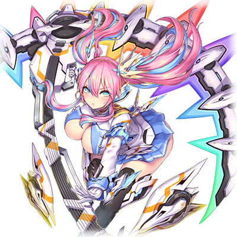

  

# MIR-203  塞蕾娜·雪莉露

| 角色信息   |  |
| ----------- | ----------- |
| 名称    | MIR-203  塞蕾娜·雪莉露       |
| 年龄   |4500周期        |
| 职业 |  框架主脑制作的探索型程序  |
| 对应曲   |Dual Fractal   |
| 初出   | Chunithm Star Plus     |

> 该角色部分内容捏它了SOUND VOLTEX  配色：角色的配色和人设类似于原作游戏中的蕾西斯（四代版本）  音速巨镰·电压（サウンドサイズ・ボルテージ）：前半段对应SOUND，后面对应VOLTEX，即作品标题。初代SOUND VOLTEX只有最高判定的CRITICAL才会增加血槽。和本作的人物专属技能对应。  据说是以疾走感作为卖点：对应了从初代SOUND VOLTEX开始的宣传语“疾走感200%”。另外，二代以后，每一代的宣传语分别为“疾走感400%”，“疾走感800%”，“爽快感1600%”，“临场感3200%”等，以200%的n次方为基准的数值。 

## Episode 1 SPEC:雪莉露

> 雪莉露是被称作MIR型的探索程序。她和同型号的两名姐姐和睦相处，过着安稳的日常。

MIR-203 塞蕾娜·雪莉露是由“框架主脑”所制造的自立型探索程序。

在这个持续繁荣和扩张中的Metaverse，就算框架主脑拥有再强大的权限和力量，也无法把握这个世界的全貌。

于是，像雪莉露这样的探索程序被大量生产，并身负观测整个世界的重要任务。

雪莉露在观测程序中属于被称作“感知型”的种类，虽然只有4500周期的年龄，但是与生俱来的冷静性格和优秀的感知能力，让她的表现极为出彩。

除了雪莉露，还有两名属于同个系统的程序……。也就是两个姐姐。一个是型号MIR-201， 赫卡蒂·贝亚托里斯，是具有和“攻击型”的设计十分相称的，生性豪爽的大姐，是一名时常鼓励着内向的雪莉露和二姐MIR-202阿尔忒弥斯·蕾娜的，三姐妹中的长女。

而雪莉露的另一名姐姐蕾娜，则是被称为“万能型”的程序，在三人之中较为平衡，是能够应对各种不测情况的类型。

二姐认真且品行端正的性格让雪莉露非常尊敬她。

她们三人作为框架主脑制造出来的探索程序的最新型号被寄予了厚望，但平时的她们也就只是正值花季的三姐妹罢了。

会去好评如潮的咖啡店尝试菜色，会一起去逛街找各自喜欢的衣服。

今天，贝尔刚刚看完一部叫做《BEASTDREAM》的动画，雪莉露就拿着一盘游戏走了过来。

“贝尔姐姐！我们比一比这个赛车游戏吧！”

“这是啥？……哦，是最近流行的那个东西对吧？”

“是啊。据说是以疾走感作为卖点什么的。……总之，我们来对战吧！我可要把上次玩格斗游戏吃的瘪都还回来！”

“呵呵，可以哦~不过我可不会手下留情哦。万一再把雪莉露打得落花流水我可不负责哦♪”

“正合我意！”

看着打得热火朝天的姐妹二人，蕾娜看着她们俩，笑着喝了口茶。

“你们俩，这盘结束了要不要休息一下？刚刚饼干才做好哦。”

……三姐妹一直都是在一起的。沮丧的时候，只要看着各自的笑容的话，她们就很满足了。这样安稳的日子，一定会持续下去的吧。……她们这么想着。

## Episode 2 突然曝光的出身

> 安稳的日常就这么突然崩塌了。在前往最外围部探索的时候，三姐妹知道了自己是以人类为基础制造出来的事实。

雪莉露她们收到了前往最外围部进行探索的命令。

最外围部，是Metaverse仍然在扩张中的，最遥远的地方。

即便现在也无法正常观测，是充满了未知和臆测的地方。

据说里面还有被称为“涅墨西斯”的恶性程序化身在那里徘徊着。

“怎么突然就被叫去最外围部调查了啊，想想也是奇了。那些框架主脑的大人物究竟在想什么呢……”

“这个任务据说是提丰大人直接要求的呢。”

“提丰大人直接命令的吗？”

Metaverse的王·提丰。他手握着庞大的权力，镇座于框架主脑的中枢。

“不止如此，听说在我们之前的探索队，迄今为止已经派遣了5队了，然而却没有一队成功返回的……。这个任务，看来必须小心谨慎。”

蕾娜的话让其他两人倒吸了一口气。

贝尔尝试着让两人打起精神，说到。

“没关系啦！只要我们三姐妹在一起的话，不管是什么麻烦都能迎刃而解的！不管是什么凶恶的程序，还是未经确认的大怪兽什么的，都放马过来吧！”

听着贝尔的话，蕾娜和雪莉露终于放松了下来。

“……要是恶性程序和大怪兽什么的都那么随便就冒出来那就不是闹着玩的了！”

“哈哈！是啊！”

“呵呵呵……好啦，一起走吧。让我们一起前往未知的最外围区域。然后，三人一定要一起回到框架主脑。”

“哦！”

“是！”

——就这样，三姐妹踏上了前往最外围部的旅程。然后，她们在那里遭遇了被称作潘多拉·涅墨西斯的凶恶涅墨西斯程序，并且在一番大战后获得胜利。

她们完成了从最外围部获得数据，并且成功带回数据的重要任务。

然而，这次探索，却也让三姐妹找到了被刻意隐藏起来的，自己出生的秘密。

在最外围部，她们遭遇了被称作“远古之蓝”以及WISEMAN的两名谜之程序。

从他们的口中，三姐妹得知自己实际上是人类与程序融合而产生的混合生命体。

虽然这个特性给三姐妹带来了属于人类的“进化”这一具有无限可能性的系统，但是对她们的数据损耗非常厉害，而且由于随时都在变化的原因，所以无法修复到曾有的样子……换句话说，三姐妹的寿命是有限的。

而且，三姐妹始终相信的，框架主脑的命令的正义性也被无情拆穿。框架主脑的使命正是守护人类，而三姐妹也为能遵守这一使命而感到光荣。然而玷污了，违反了这一使命，让框架主脑的正义性受到怀疑的，不是别人，正是她们的王，提丰。

出生的秘密被判明，曾经为之荣耀的东西也消失了，而且被告知了终将死亡的宿命……这一切让三姐妹的心无比动摇。

## Episode 3 埋葬于黑暗中的真相

> 三姐妹对自己效忠的框架主脑产生了怀疑。然而即使向提丰询问真实的情况，也得不到想要的回答。

雪莉露她们回到了框架主脑报告完这次探索的情况之后，就开始着手调查自己出生的秘密了。

“究竟从远古之蓝和WISEMAN他们那里听到的是真的吗？”

三姐妹从他们那里得知了自己是提丰经过无数残酷的实验才诞生的存在。

但反过来，她们也就仅仅知道这件事情而已。

三姐妹为了找出自己出生的秘密，以及诞生下来的真正理由，开始了行动。

她们拜访了制造出自己的地方，框架主脑的制作工厂，并且打算找找相关的人物打听一下。

但是，三姐妹的出生这一内容似乎被下达了封口令，三姐妹未能从工人们打听到消息。

“究竟我们出生的真相会在哪里找到呢？……难道说，把这一切都忘掉，不抱疑问地活着更好呢？”

……就在三人脑中冒出示弱的念头的时候，一个意外的人物向她们告知了真相。

那是平时就帮她们调整的程序。

他以前就在制作工厂工作，并且参与了三姐妹的开发计划。

从他的口中所复述的东西和WISEMAN以及远古之蓝那里得到的事实互相比对，结果千真万确。

而且，连提丰所进行的残忍的人体实验也……。

“怎么会这样……”

为了防止三姐妹受到更大的打击，调整程序决定不继续将更详细的情报跟她们讲。

“这之后的事情，还是等下次再说吧。”

而这就是他的遗言了。

等到三姐妹再度来访的时候，得知了他成为了处分对象的噩耗。

“为什么？明明那个人没有犯任何错误的！”

三姐妹决定再度和提丰见面，并且打算从他那里问出自己出生的经历，还有调整程序的处分，以及框架主脑的使命等问题。然而不过是竹篮打水一场空。

最后，三姐妹从提丰那儿得到了“在下个任务到来之前，在框架主脑内待机”的指令。

## Episode 4 迷惘与决心

> 三姐妹被命令待在框架主脑，实质上与软禁无异。而她们基于自己的自由意志决定了某件事。

提丰下达的指令，就是在下个任务到来为止，在自己的房间待机。而她们被暂时剥夺了能力，而且无法前往框架主脑的管理区域以外的地方，已经与软禁无异。

“我们，在这之后，会怎样呢？”

雪莉露已经表现出了不安，蕾娜温柔地抱住了她。

“没事的，我们肯定会没事的……”

“蕾娜姐姐……”

和一脸严肃的妹妹们相比，大姐贝尔却是一副满不在乎的模样。

“对对对，就和蕾娜说的那样，没事的！不如说还很走运呢！我们最近可是大吃苦头啊，正想着要来个大长假呢！”

“贝尔姐姐……”

“是呢，正如贝尔所说，就算是为了我们以后的事情考虑，现在也还是养精蓄锐吧。”

“……我明白了。”

虽然面对软禁，三人的态度各有不同，但是想法却是一致的。

“不管发生什么，我们三姐妹一定要一起活下去，为了这个世界……为了我们的未来！”

然后，不知道是谁说出了这句话。

“……我们逃离框架主脑吧！”

## Episode 5 叛逃

> 三姐妹决定离开框架主脑。然而最古的袭击却让阿尔忒弥斯身受重伤。

某天，三姐妹收到了解除她们的谨慎处分，以及前去与提丰见面接受新的任务的联络。

被叫到框架主脑的三姐妹，确认了自己力量的回归。

“……好，看起来各处都没有问题。一切就绪。”

“不过还是要小心。”

“是啊，现在的框架主脑对我们来说已经不再是安全的地方了啊。”

“是啊……先装作接收来自上级的命令之后，接着就趁机离开吧！”

三姐妹这么说着，缓缓踏进了接见提丰的房间。

然而，在房里的，并不是提丰，而是在他身边服侍的最古，斗争主·盖提亚。

“……有劳你们前来了。MIR系列哟。由我代表提丰向你们下达命令。……上前来吧。”

三姐妹感觉到了一股可疑的气息，还是接近了盖提亚。

“提丰大人给你们下达的命令，那就是……死！”

“……姐姐大人！危险！”

“嗯！？”

与盖提亚的话音一起袭来的，是高速挥向蕾娜的拳头，在感知力优秀的雪莉露的提醒下，蕾娜勉强躲过了第一发攻击。

高速挥动的拳头带来的是迅猛如刀的破坏力，蕾娜的数根头发被拳风切断，在空中飞舞。

“欣喜吧……我们最古，将以经过了成千上万的实验体才终于诞生的你们作为垫脚石，从而踏向更高的境界！”

“难道你们又要进行那样惨无人道的实验，诞生像我们那样的存在吗！？你们这样，还有资格面对框架主脑的使命吗！？”

“闭嘴！胆敢向提丰大人的意见反对的，只有以死谢罪！”

盖提亚召唤了藏在旁边的手下，向三姐妹发动了攻击。

虽说三人已经做足了会被袭击的准备，但对手可是拥有压倒性力量的最古的其中一人。

三姐妹在盖提亚的面前毫无优势，只能被动地防御。

……就在这个时候。

“呀！？”

盖提亚致命的拳头，袭向了雪莉露。

蕾娜立刻就站在了雪莉露的面前。

“雪莉露！危险！”

“蕾娜姐姐！”

蕾娜帮妹妹挡住了来自盖提亚的攻击。

闪烁着紫光的盖提亚的拳头命中了蕾娜身体好几下，瞬间就让蕾娜失去了战斗能力。

“蕾娜！？你这家伙啊啊啊啊啊啊！对我的妹妹干了什么好事啊！！！！”

“姐姐……又因为掩护我而……不可原谅！”

似乎因为蕾娜受伤刺激到了二人，贝尔和雪莉露的能力瞬间提升了不少！

爆发出来的力量，甚至暂时镇住了盖提亚。

“什么！？”

盖提亚面对觉醒的贝尔和雪莉露的全力攻击，只能被动防御。

找到机会的二人，立刻就不再恋战，而是带着蕾娜离开了这里。

“那就是……能够进化的程序吗……”

留在现场的盖提亚，对三姐妹的力量第一次感觉到了威胁。

## Episode 6 死亡的倒计时

> 终于从最古的袭击中脱身的三姐妹，逃到了最外围部。然而阿尔忒弥斯的状态却在不停恶化……

终于逃离了盖提亚的袭击，从框架主脑逃离出来的三姐妹，已经没有可以去的地方了。

“哈……哈……”

“蕾娜……姐姐……快点醒醒啊！醒醒啊！……对不起，这都是我的错……”

蕾娜仍旧没有恢复意识，看着抱着蕾娜大哭的雪莉露，贝尔安慰到。

“雪莉露，现在的当务之急，还是赶紧带着蕾娜去框架主脑无法探知的地方吧。”

“……可是，真的有这样的地方吗？”

框架主脑的搜索能力，身为探索型程序的她们是最清楚的。

贝尔在沉思之后，静静地回答了这个问题。

“……我们去最外围区域吧。只要去到那里的话，就算是框架主脑也找不到我们的。”

“怎么会……难道说要回到那种地方吗！？到那么偏远的地方的话，蕾娜姐姐的治疗岂不是更加困难……”

“即便如此！也比这么被框架主脑抓回去要好啊！……万一被他们抓到的话，我们三姐妹可是毫无疑问会被删除的啊！”

“贝尔姐姐……我明白了！我们走吧！前往最外围区域！”

“啊啊……蕾娜，再坚持一下吧。我们一定会救你的。”

两人带着蕾娜，躲过框架主脑的追踪，终于勉强到达了最外围区域。

身为人类和程序的融合体的三姐妹虽然牺牲了“寿命”，但是她们换来的，是随时常驻的超回复力和强化能力。本来像这样的物理伤害，应该能立刻恢复的。

然而，蕾娜的样子，非但没有好转，反而在持续恶化。

无法愈合的伤口中开始出现数据崩坏的样子，看着恶化的蕾娜，两人不由得皱紧了眉头。

“蕾娜姐姐……求你了，醒醒……”

## Episode 7 危险的赌注

> 三姐妹再度和远古之蓝见面了。为了让阿尔忒弥斯恢复，似乎需要和涅墨西斯程序互相融合才行……

“——这个女孩中的可是剧毒啊。再这样下去的话，她就会这样长眠不醒，最后死亡的啊。”

“是谁！？”

在雪莉露和贝尔的背后，突然冒出了一个瘦小的男人。两人赶紧摆出了架势。

男人并未在意摆出战斗架势的二人，毫无防备地观察着蕾娜的状况。

“哦……这可是盖提亚的猛毒啊。这下解析可麻烦了。”

“等等……你到底是什么人啊！”

“我吗，远古之蓝。”

“远古之蓝……不就是蕾娜姐姐说的，在最外围部见面的那个人……”

只从蕾娜那里得知远古之蓝名字的雪莉露和贝尔，对他仍旧保持着警戒的态度。

然而在这片边境之地，几乎没有能够为她们提供帮助的人。

所以即便再怎么可疑，二人还是只能向他寻求帮助。

“——你们的姐妹，应该是被最古的其中一人，斗争主·盖提亚的毒素侵蚀了。……虽然叫做毒素，不过准确来说，应该是会自动侵蚀的BUG吧。”

“毒素？”

“叫做诅咒什么的也可以。虽然说的很像是非科学的东西……如果要祓除这个东西的话，即便是盖提亚效忠的主人，提丰也做不到呢。当然，我也是……再这样下去的话，这个女孩应该就会这样在沉睡中死去的吧。”

“怎么会……！”

“就没有什么方法吗！？不管什么手段都好！真的连一点方法都没有吗！你难道不是最古之中的一人吗！？”

贝尔由于急于拯救蕾娜，已经不知不觉喊出了声。听到这句话的远古之蓝提起了兴趣。

“……你刚刚，说了什么手段都好，对吧？”

“是……是这样的。”

“那么……想要拯救你的妹妹的话，有一个可能的方法。”

“那，那究竟是什么？！”

“……就是和涅墨西斯程序融合。”
“咦！？”

涅墨西斯程序……在框架主脑的时候，被当作敌人所憎恨，只当成祸害处理的恶性程序化身。

曾经和被称作潘多拉·涅墨西斯的涅墨西斯程序战斗的三姐妹，不禁对远古之蓝的提案感到恐惧。

“你说要和涅墨西斯程序进行融合……。只要这么做的话，蕾娜就能够恢复吗！？”

“说不准呢。这点只能看她自己的能耐了。如果顺利的话，盖提亚给她的损伤就能够完全恢复，但是失败的话，会发生什么就不知道了。是暴走导致身体组织的数据崩坏，还是被涅墨西斯程序支配人格都说不定呢。”

“怎么会……真的只有这么危险的赌注吗？我们可是要拿蕾娜的生命作为赌注啊！？”

“不过，除此以外别无他法了……那么，你们怎么选择？”

## Episode 8 追击者袭来

> 提丰派遣的追兵已经来到了最外围部。为了保护阿尔忒弥斯，两人只能迎战最古。

为了拯救蕾娜，到底要不要允诺，将一切希望都赌在充满危险性的涅墨西斯程序上呢？

还是说，就这样白白等死呢？

……雪莉露和贝尔陷入了沉思。然而在她们得出了答案之前，不速之客就已经来到了这里。

“贝尔姐姐！这个反应……是斗争主·盖提亚……正在向这里逼近！”

“该死！已经追到这里了吗！……喂！远古之蓝！蕾娜就拜托你了！”

雪莉露和贝尔只能两人迎战盖提亚。

“……小姑娘们，终于找到你们了。这次可不会像上次那样重蹈覆辙了。以斗争主之名起誓，这里就是你们的葬身之地！为了提丰大人永远的荣耀，就请你们上路吧！”

“哼！说的轻巧！……要上了！雪莉露！”

“好的！贝尔姐姐！就由我来辅助战斗！”

两人开始了战斗。虽然说两人也是十分勇敢……但是面对最古之一的压倒性实力，战况还是十分不明朗。

雪莉露和贝尔的身体已经被盖提亚的拳击打的遍体鳞伤。

虽然她们努力避开了毒素的攻击，但是已经难以起身。

“……去死吧！向提丰大人反抗的蠢货们！”

“不要啊啊啊！”

“可恶！……雪莉露！”

盖提亚的拳头，眼看就要贯穿正保护着雪莉露的贝尔。

在那个瞬间……。盖提亚的手被一道真红色的闪光贯穿。

“呜哇啊啊啊啊啊！？……是谁！？”

“……别想对二人出手！”

“蕾娜！？”

“蕾娜姐姐！？”

拯救雪莉露和贝尔的，正是蕾娜。

## Episode 9 向着自由的觉醒

> 将雪莉露和贝尔从困境中救出来的，正是阿尔忒弥斯。三姐妹齐心协力，终于击退了追兵。

——这是在雪莉露和贝尔即将被盖提亚的拳头贯穿之前发生的事情。

正被自主侵蚀中的BUG攻击陷入沉睡的蕾娜，勉强取回了意识。

“嗯嗯……这里是？”

蕾娜从远古之蓝那里，听说了迄今为止发生的一切事情。

“请给我移植涅墨西斯程序。”

“真的可以吗？你能够镇住涅墨西斯的可能性，就算乐观点说，也是微乎其微的哦？”

“只要不是零的话……。我现在，如果不在这里动起来的话，一切的希望就真的没有了。那么，不就只能这么做了吗！”

“也罢。对我来说这也是收集贵重的样本的机会啊。我可是很欢迎的。”

远古之蓝用着对自己植入时同样的方法，向蕾娜移植了涅墨西斯程序。

很快，蕾娜的身体就发生了剧烈的反应。

“啊啊啊啊啊啊啊啊啊啊——！！”

蕾娜的超回复能力被彻底解放，她的身体正在不顾一切地愈合着伤口，并且出现了暴走。构成她身体的数据开始慢慢被覆写。

不仅如此，在她的精神世界中，来自涅墨西斯程序的复仇之火，正灼烧着她的人格程序。

“将伪造的神明……将Metaverse毁掉！”

（啊啊……已经快撑不住了）

蕾娜的人格几乎就要被涅墨西斯的破坏冲动摧毁。

在那个瞬间……蕾娜的脑中想起的，是贝尔和雪莉露的笑容。

（……我必须保护好大家的未来！而且，我怎么能破坏这个世界呢！因为，我们可是守护人类的存在啊！）

蕾娜的决心，转为了力量。她成功地控制住了涅墨西斯程序，并且恢复了伤势，获得了全新的力量。

 

“哦哦……熬过来了吗。真是太美妙了！这样的话……作为你成功获得‘自由’的形态，以后就以MIR-202 阿尔忒弥斯·蕾娜/自由女神形态——如此称呼吧！进化的体现者哟！”

 

获得全新力量的蕾娜，立刻就奔向了姐妹所在的地方，并且成功地救出了她们。

“这个力量……难道说，你已经获得了进化吗？”

“是呢，真是多亏了你……不会再让你为所欲为了！”

和涅墨西斯程序融合的蕾娜，实力已经和最古平起平坐了。

再加上雪莉露和贝尔的辅助，三姐妹占据了优势。

但是对于刚刚恢复的蕾娜来说，仍然不是最佳的状态，随着战斗的拉长，局势渐渐开始倾斜。

“咕……！”

“蕾娜姐姐，没问题吗？”

“还行……不过再这样下去，也坚持不了多久了。”

“那该怎么办？”

“准备释放三重脉冲（トリニティヴァーテックス）吧。”

通过三姐妹互相直连能源线路，从而解放限制器将力量发挥到极限，就可以使出三重脉冲。

曾经大破潘多拉·涅墨西斯的终极大招，在蕾娜已经和涅墨西斯程序融合完毕的现在，威力应该更加强大。

……当然，释放后对身体的负担也会更重，想必会大幅度减少三姐妹的寿命吧。

然而，为了抓住仅有的未来，也只能这么做了。

“——好嘞。那么，谁负责把能量集中起来？”

“让受伤最少的雪莉露来吧。”

“咦？我，我吗？”

年纪尚小的雪莉露不禁为自己突如其来的重大责任而颤抖。

“……我真的可以做到吗？”

“放心吧！你可是我自豪的妹妹啊！”

“是啊。我和贝尔都相信雪莉露你一定能行的。……所以，拜托你了！”

“姐姐……我明白了！”

下定决心的雪莉露集中了精神。两位姐姐则将自己的能量全部集中到妹妹的身上。

“——三重·脉冲！神经元模式！！”

随着雪莉露的声音，三姐妹的感知机能被提高到了极限，从而感知到了盖提亚的位置和动作的细节。

而且在这数秒之内，她们甚至能做到宛如未来预知一般的预判。

不管盖提亚的攻击再怎么致命，他的攻击究竟指向何方，现在心意相通的三姐妹都能明白。

“——就是这里！！”

  

闪过了盖提亚的攻击，雪莉露挥舞着大镰，在斗争主的身上留下了一道巨大的伤口！

“呜哇啊啊啊！？”

“好！趁这个机会……！”

三姐妹再次向勉强躲过致命伤，无法动弹的盖提亚发动了攻击。

……然而。

“嗯！？身体，怎么感觉要烧起来一样……！”

“啊！咕！啊啊啊啊啊啊！！！”

“咦！？……啊啊啊啊啊啊！！”

由于刚刚释放了三重脉冲带来的剧烈负荷，以及涅墨西斯程序的影响，巨大的痛苦袭击了三姐妹的身体，瞬间无法动弹。

身受重伤的最古并没有放过这个机会。

“……到此为止了！MIR系列！”

“——！”

就在这时候，一名意外的人物阻止了盖提亚的攻击。

“……真是的，请不要随便破坏我贵重的实验样本行吗。”

“你，你是！？远古之蓝……吗！？”

“的确，好久不见了啊，盖提亚……不过现在根本不是值得庆贺再会的时候吧？”

“咕……！”

三姐妹的战力本就和自己不相上下，如果再加上最古的助阵的话，怕不是只能自讨没趣。

盖提亚不得不狼狈撤退，回到了框架主脑。

## Episode 10 独裁者的处罚

> 面对两次暗杀三姐妹都失败的最古并未留情，将他的一切数据都吸收殆尽。

盖提亚不仅没有成功打倒蕾娜她们，反而让蕾娜获得了进化。

回到框架主脑的他，迎接他的是来自统制主提丰的无情裁决。

“——现在这个瞬间，剥夺斗争主·盖提亚身为最古的资格，以及能力。”
“这，这是！”

“像你这样的无能之人，不过是给框架主脑添麻烦而已。“

提丰慢慢地走近盖提亚。

盖提亚拼命地辩解着。

“请，请等一下！她们在最外围区域受到了远古之蓝的帮助……如果没有那个家伙的意外帮忙肯定能够将她们打倒的！”

“意外？就算远古之蓝那个家伙真的还呆在那里，我也早就知道了。而且，不论是什么‘意外情况’，能够稳妥处理，以胜利收场，才是我们身为框架主脑的程序应该做到的！是身为最古应该做到的！”

提丰的愤怒已经形成电磁波的风暴，拍打着盖提亚。

“请，请等一下！提丰大人！请再给我一次挽回脸面的机会！请大发慈悲啊！”

“……一次就算了，居然两次都没法完成我给的使命，像你这样的蠢货根本不值得以最古相称……。至少在最后一刻变成我的力量，以你的性命，偿还你的罪孽吧！”

“咿呀啊啊啊啊啊啊啊——！！”

盖提亚被提丰彻底吸收，没有留下一点残渣。

看着此等场面，旁边的两柱最古不由得皱起了眉头。

在提丰终于离开后，一人叹了口气。

“……嗯嗯。究竟这样的支配要持续多久呢。不过，这也是没办法的事情……毕竟神的力量是绝对的……”

他是曾经在框架主脑掀起革命的时候处于中立立场的最古。

然而现在提丰掌握大权，他也只能言听计从。

“……还是不要去担忧了，毕竟时间有的是呢。”

## Episode 11 为了阻止暴虐的狂风

> 三姐妹为了人类和自己的未来，终于决定讨伐几乎等同于神的提丰。

——在盖提亚正在框架主脑内被提丰吸收的时候，在最外围部终于恢复完毕的蕾娜她们，下定了决心。

“……我们已经是脱离了框架主脑的自由身了。那么，从此以后，我们就必须靠自己的判断，自己的意志决定要做什么了。”

“是的……”

“不过，直到现在真的获得了自由，才真真切切地感受到……统制主·提丰是必须打倒的存在啊！”

“提丰那个家伙，估计会派人追着我们追到天涯海角吧……为了争取到我们的未来，一定要将他打倒！”

“……而且，提丰大人……不，提丰的思想，已经过于危险了。他自己放弃了‘守护人类’这一首要的使命，为了自己的私利私欲让整个世界跟着他陪葬……再这样下去肯定会有更多的人和程序都成为他野心的牺牲品吧。……真不想看到像我们这样建立在悲伤的牺牲之上的程序再次出现呢。”

“是的……提丰的所作所为，毫无疑问会将我们的未来，还有整个Metaverse的整个未来导向灭亡的。”

三姐妹的意见是一致的。

“——为了终结这一切，让我们打倒提丰吧！”

