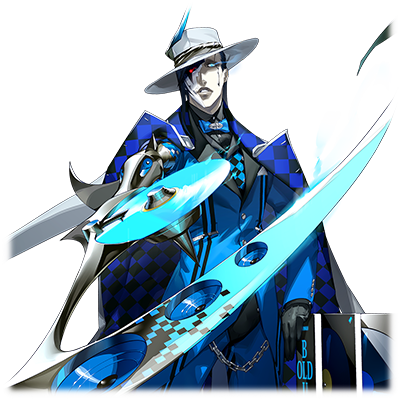
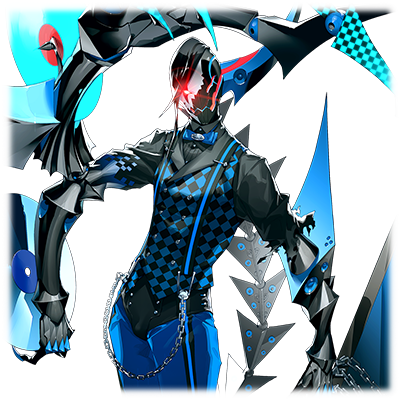

  

# 远古之蓝

| 角色信息   |  |
| ----------- | ----------- |
| 名称    | 远古之蓝     |
| 年龄   | 未知       |
| 职业 | 原“最古”成员/追放者(EXILE)  |
| 对应曲   |Twice up Scenery |
| 初出   | Chunithm Star      |

## Episode 1 SPEC：远古之蓝
> 我的名字是远古之蓝。虽然原本所属于“框架主脑”，不过现在只是个无依无靠的观测者罢了。也就是“追放者”（EXILE）。

Metaverse，孕育人类的摇篮，被称作永久乐土的地方。自从管理这里的神祖——艾克雷尔消失以后，这片仍然年轻的乐园正需要一位新的统治者。

而最终君临于这个世界顶端的，是居于“框架主脑”的，十二柱程序。

获得了支配这个世界权利的他们，各自拥有着不同的能力。

他们运用着各自的能力，以合议制的形式，治理并负责着Metaverse的扩张。他们被称为“最古”。

在他们的努力下，整个世界获得了前所未有的安定与繁荣。

然而，看似完美的力量平衡却被一个强力的程序所破坏了。

本来就位于“最古”之间的权力中心的《提丰》，突然开始了将其他程序的能力据为己有的计划。

无法及时应对提丰邪恶计划的其他“最古”，要么被他夺取了力量，彻底消失，要么逃离了“框架主脑”，摆脱了他的魔爪。

而提丰称呼这些逃离出去的人们为“追放者”（EXILE），并且将他们视为眼中钉并派自己的手下去追杀他们。

在这些被乐园驱逐出去的，拥有着和神同等力量的人们中，就有一名被称为“远古之蓝”的男人。

## Episode 2 被乐园驱逐之人
> 被提丰驱逐的我，为了隐藏自己的存在，前往了“框架主脑”也无法感知到的世界的尽头。

逃离了“框架主脑”的远古之蓝，为这初次体验到的自由无比喜悦。

（没想到竟然是以这种形式离开了“框架主脑”啊。这就是所谓的世事难料吗……）

迄今为止，远古之蓝都是以“最古”之一的身份，为Metaverse的繁荣尽心尽力。

虽然并非对曾经的使命感到不满，但是，被突如其来的变故驱逐出“框架主脑”的远古之蓝，第一次意识到了深藏于自己心中的求知欲。

（引导着我行动的东西……就是“好奇心”啊。我想知道更多。我想知道这个世界究竟延伸到什么地方？还有这个世界的命运究竟会走向何处？）

曾经自己所属的“框架主脑”赋予自己让世界变得更加广大而繁荣的使命，从根本上就有者微妙的差距。

而现在终于从“框架主脑”的任务中解脱的他，决定只为了自己想要的东西而活。

（提丰不管干什么名堂都和我无关了。我只要能满足我的好奇心就足够了）

然而，像提丰这样猜疑心极重的人肯定不会放过自己的吧。总有一天他会找到自己，并且杀死自己夺去他的能力。

远古之蓝这么想着，便决定前往最遥远的边境，躲藏自己。

Metaverse的最外围区域……那里是程序的残骸最终漂流到的尽头，被人遗忘的世界。

（到那里的话，“框架主脑”应该就找不到我了。只要在那里，我就能尽情地研究自己喜欢的东西了。）

## Episode 3 被遗忘的世界
> Metaverse的外围部充满了混沌。对我来说，这可是比“框架主脑”更加充满魅力的地方啊！

终于来到Metaverse的最外围区域的远古之蓝，和他预想的一样，这里是充满了无数程序的残渣所组成的混沌之海。

（嗯嗯……比想象中的还要宽广许多啊。这些残渣之间，由于互相影响的缘故，以至于连“框架主脑”的探测器也无法触及这片领域吗。）

远古之蓝被这片位于最外围区域的，宛如黑色的淤泥一般的数据之海吸引了注意力。

以前就推测过被称为“涅墨西斯”的恶性程序化身是不是从这片最外围部诞生的……现在，远古之蓝正亲眼目睹着这一事实的发生。

（从那片黑色的海洋中冒出来的泡泡般的东西……那就是新诞生的程序吗！真是太美妙了！竟然还有以这样的形式诞生的程序，这可是曾经在“框架主脑”时期所不敢想象的事情啊！）

欣喜若狂的远古之蓝，将这片区域当成了他的研究场所。

当然，一方面也有躲避“框架主脑”的通缉的目的，但，对于远古之蓝来说，这片地方，才是属于他自己的，真正的“乐园”。

这片混沌之海，说不定就潜藏着他所追求的，让这个世界进化的可能性。

（如果想让这个世界进化的话，只靠环境的进化是远远不够的。必须让生存在这个世界上的生物也得到进化才行……对，能和这个世界的终焉相提并论的，只有究极的生命啊！我要……我要用自己的双手，创造出来！）

从此，他便将“世界的进化”以及“究极的生命”作为他倾尽一生的研究课题。

## Episode 4 追求着究极的生命体
> 我以这片混沌之海的数据为基础，我决定，靠自己的双手，创造出人类的崭新形态，以及更高层次的进化……

日复一日，研究着这片混沌之海的远古之蓝，确立了一个假说。

（这片混沌之海，正是之前的大战中，本应由提丰打倒的，现行的人类种所创造的灾厄级别程序的伤痕）

很快，他就见到了证明他的假说的存在。

她，是本来所属于“框架主脑”的程序（虽然地位相比远古之蓝要低等很多），但是却憎恨着“框架主脑”，脑海中已经被想要破坏这个世界的意志所支配。

远古之蓝最初见到她的时候，她正处于战斗的状态。远古之蓝很快意识到，她不是普通的下级程序，而是与这片混沌之海产生的“涅墨西斯”互相融合之后的存在。

与BUG融合，变形，获得了超越过往的规格的她，正是距离他所考虑的“究极生命体”最接近的存在。

“不过，这样还不够。”

远古之蓝扩张了她手上的VOX的机能，想要实验一下身为变异程序的她究竟能够走到何种地步。

而作为其结果，她使用了VOX的新机能，将外围部的世界慢慢地污染，并且划为自己的领地。

随着污染程度的加深，远古之蓝也观察着程序，还有动物们和BUG之间互相融合以及排斥后自毁的各种现象，甚至自己进行了相应的实验。

远古之蓝选择抓住那些程序和化为涅墨西斯的怪物，并且进行了一次又一次的融合实验。

但是，这些实验都失败了，最终的产物不过是一滩滩的数据的碎屑，或者是半途而废的怪物而已。

“为什么……我的研究究竟缺少了什么？”

## Episode 5 与融合者的邂逅
> 仔细一看，这个从“框架主脑”来到这里调查的女孩子，不就是人类和程序的融合体吗！

某天，和往常一样前往混沌之海观测的远古之蓝，发现了几个从最外围部的边界进来的陌生程序。

（那难道是来自“框架主脑”的使者吗？但是好像又不是战斗用的类型呢）

如果是提丰派来的杀手的话，应该都是些全副武装的战斗用程序吧。

那么，她们为为什么会在这里呢？

（而且……从那些女孩那里我还能感受到一些并不属于程序的东西）

在稍加思索之后，远古之蓝决定满足自己的好奇心。

“……那边的小姐，能打扰一下吗？”

少女的名字是“阿尔忒弥斯”。本来远古之蓝最初只把她当成了下级的探索程序，然而在和她进行了直连之后，却得知了惊人的事实。

（这个女孩难道说！？这不可能！竟然还有这样的事情！）

虽然经过了精心的设计，但是从构成少女的源代码底层的部分，还是能找到她曾经身为“人类”的蛛丝马迹。

人为开发制造出来的和程序的融合体……正是隐藏着能够让人类这一种族进化的可能性的存在。

心花怒放的远古之蓝不禁大叫。

“太美妙了吧！这就是进化的可能性吗！”

## Episode 6 进化的希望之光
> 被称作“阿尔忒弥斯”的这名少女的数据实在是太棒了啊！不过，如果是我的话，一定能够制造出更加完美的生命！

远古之蓝紧紧地攥着阿尔忒弥斯的手抒发着感想。

“你真的是令人惊叹的存在啊，阿尔忒弥斯。竟然能将人类与程序的融合体这一设想变为现实！”

“融合体？和人类的？你在说什么？”

“哦哦，看来你还不清楚自己的事情呢？”

远古之蓝向一无所知的少女详细地讲解了内容。

“是呢。说不定你的姐妹也和你一样，都是利用人类的数据为基础，和特殊的程序融合，最终产生并获得全新能力的新人类啊！”

远古之蓝沉浸在这一新发现的喜悦中无法自拔。

（啊啊！没想到提丰你也和我一样，找到了利用人类与程序之间的融合体这一手段，来达成Metaverse的进化的方法啊！真是没想到，竟然在这种边陲之地遇上如此有缘的事情。虽然在“框架主脑”的时候还没有什么实感，不过我们“最古”之间，说不定有着宛如兄弟般的联系啊。）

和刚刚发现进化的可能性的少女而欢欣雀跃的远古之蓝不同，对面的少女反而陷入了不安之中。

但是，远古之蓝并未理会少女的样子，立刻就离开了此地。

（这个少女还有姐妹存在。虽然还想去提取她们的数据……不过继续和“框架主脑”的使者产生联系可不是上策。说回来，必须尽快开展新的实验才行！）

远古之蓝的脑海中，已经只剩下开展新的实验，创造出理想中的究极生命体这一念头了。

## Episode 7 欠缺的片段
> 为什么？为什么我做出来的都只是距离究极的生命相差甚远的怪物而已。我到底是缺少了什么？

以阿尔忒弥斯的数据为基础，远古之蓝开始正式以体现进化的方向制作起究极的生命体了。

（以那个女孩的资料为参考，我的理论支持也前进了很大一步。这次一定能成功的！）

远古之蓝将抓来的程序与涅墨西斯进行了融合。但最后诞生的东西却是……

“唔噢噢噢噢噢噢噢哦哦！”

“这是为什么！为什么会变成这样的怪物！”

实验体变成了缠绕着淤泥一般的黑暗，一半身体融化掉的丑陋样子。

从这只宛如邪恶的龙一般的生命体那里，能感觉到庞大的力量。但是，这和远古之蓝想要做出来的究极生命体相差甚远，只是一只丑陋的怪物罢了。

“要，要将，框架……主……脑……破坏掉！！”

这只怪物向远古之蓝露出了杀气，并发动了攻击！

“哼。竟然向自己的创造主攻击吗。也罢。”

远古之蓝不慌不忙地发动了自己的能力。他的能力，简单来说就是抢夺。他能够将其他东西的记忆，能力，甚至想要的话连心灵都能夺取，化为数据碟保存，并且作为自己的能力使用。

远古之蓝正是靠着这股力量，才能够收集到众多的样本数据。

“这次……就用这个吧。”

远古之蓝发动了过去被称为剑神的男人的力量。斩击轻松将眼前的怪物一刀两断，残骸堕入了黑暗之中。

虽然以压倒性的力量将怪物消灭，但是远古之蓝没有一丝的欢喜。

相反，一股不甘心和悲伤的感情从心底浮了上来。

（到底是缺少了什么……我到底是缺少了什么才没能成功呢）

## Episode 8 断罪的天使，现身

> 看来，“框架主脑”已经知道我的所在了。竟然还派出了这种专门击杀“追放者”（EXILE）的家伙……

从此以后，远古之蓝便进行了无数次的实验。用于融合的材料（人类）众多，有男人，有女人，有一片懵懂的婴儿，也有充满欲望的大人，还有已经对人生看开的老人，远古之蓝进行了各种各样条件的实验。

然而，不论是什么样的材料，最后诞生的也只是丑陋的怪物罢了。

（这是为什么！明明理论是正确的。为什么最后却没办法成功？明明提丰都已经成功做到了！）

同样身为“最古”的自尊让远古之蓝为之焦躁。即便如此，他的实验仍旧没有进展。

就这样，直到某一天的到来……。

“汝就是远古之蓝吗？”

一尊宛如白色的城池般庄严宏伟的程序出现在了远古之蓝的面前。

“正是。来者何人？”

“吾乃利希德修茨。身披断罪之双翅的程序。身负制裁从乐园放逐出去的罪人的大任。……追放者·远古之蓝。这里就是你的葬身之地！”

利希德修茨的设计非常简单明了。通过记录各种各样的音素，然后加以随时变化的波形进行处理，就可以让自己身边的碟形飞盘造成难以防御的攻击，从而随着利希德修茨的意思而动，斩切眼前的敌人。现在，足以将空间切裂的飞盘正向着远古之蓝袭来。

“别开玩笑了！这种程度的高周波变动武器就想要了我的命吗！”

远古之蓝从手中伸出了刀刃，直接冲向了利希德修茨，想要夺走他的能力。

然而，这白色的城墙早已经过特殊的调整，对远古之蓝的攻击有了抗性，他的能力完全无法伤及分毫。

“什么！？竟然无法夺取吗！”

“愚蠢至极。远古之蓝。”

刺向利希德修茨的刀刃出现了巨大的裂痕。

而妄图后退拉开距离的远古之蓝，被四面八方飞来的飞盘大卸八块。

看着命中倒地的远古之蓝，利希德修茨只是冷冷地看着。

## Episode 9 追放者与断罪者
> 没想到利希德修茨竟然专门安装了为我的战斗所准备的程序啊……这可真是糟糕。

勉强躲过致命伤的远古之蓝，嘴角流着赤红色的液体，但还是努力冷静下来分析了现在的状况。

“果然是这样吗……利希德修茨，你的身上安装了专门用来对付我的程序呢。”

“正是。这是为了能和被称作最古的远古之蓝分庭抗礼而专门制造出来的产物。”

“果然吗。就和你说的一样啊……如果有可能的话，我也想慢慢分析下身为‘框架主脑’的最新型防御程序的你呢……”

“不会给你犹豫的时间的。CPST爆裂器！”

利希德修茨的身体发出光芒，浮现出发光的阵法。

强力的除错领域包围了周边的环境。

能够将领域中被解析的敌人机能彻底禁用，从而单方面攻击的特殊空间，就宛如处刑的刑场一般。

“嗯……！？我竟然要被吸收掉了吗！？”

“到此为止了。远古之蓝。”

在利希德修茨的力量下，远古之蓝的防御机能被悉数破坏。

专门为杀死远古之蓝的程序正准备将这名“最古”的其中一人带向最后的毁灭。

“果然很棘手啊……。不过！！”

随着远古之蓝的动作，几枚小型的炸弹在利希德修茨的身边爆炸。

在这个瞬间，除错领域被解除了。

“可恶，是陷阱吗！”

“想要维持这样强大的领域的话，应该需要消耗非常大量的数据和集中力吧？而相应的，这样的领域也没法持续很久的样子呢。”

远古之蓝露出了狡猾的笑容。

“再见了，断罪的天使。虽然没法得到你的能力……不过就此别过了。”

远古之蓝立刻从这片地方发动了转移，从而逃离了利希德修茨的追杀。

## Episode 10 至高无上的实验

> 因为战斗遭到严重损伤，我的脑中冒过了一个绝无仅有的灵感——“如果将自己迄今为止收集到的数据全部装到自己的身上会怎么样？”

虽然远古之蓝终于脱离了恐怖的光之追杀者，利希德修茨的追杀，但是，他的身体已经遭到了严重的损坏，这样下去，消失不过是时间的问题而已。

（看来，我也快到极限了啊。如果自己将规格下降的话，说不定还能苟延残喘……）

但是，如果降级为下级的程序的话，就无法维持现在的处理能力了。这样的话，想必也无法继续进行足以促进世界的进化的实验吧

（这样不就没有意义了吗。我活下去的唯一目的，就是靠自己的双手见证这个世界的进化，最终诞生究极的生命体啊！而如今，理论体系已经完成，只差最后的实践而已，怎么能在这种地方放弃呢！至少，能够争取到支持恢复机能的数据量的话……）

就在这时，一个破天荒的想法在远古之蓝的脑海中闪过。

（我的手上已经收集了众多的数据了。如果将这些东西组合起来的话，说不定就能让自己向究极生命体的进化更进一步？）

迄今为止的实验体，最后都是无法承受住当成材料吸收的素材而崩溃消失的。但是，自己不一样。身为原属于“框架主脑”的十二柱“最古”的其中一人，拥有着Metaverse中也是最高级的处理能力，储存容量，具有为神代理权能的强大权限。应该不管吸收多少资料，都能够将排斥反应压制到最小吧。

（但是，这个设想也仅限于我的身体还完好的情况。现在这种苟延残喘的状态，如果大量的数据流入我的体内的话，又会变得怎么样呢？）

乾坤一掷。但是这个赌注后面的奖品又是那么的诱人。

而远古之蓝正是顺着自己心中的好奇心而活，于是，对现在的他来说，答案就只有一个。

“那么，就让我的身体成为最棒的实验台吧。”

这么说着，远古之蓝将阿尔忒弥斯，潘多拉·涅墨西斯，以及其他他所拥有的全部的资料灌入了自己的体内。

## Episode 11 追求究极的生命姿态

> 实验的结果非常成功。我成为了“固形体·远古之蓝”，并且为了更高层次的进化，潜入了更深的混沌之中。

大量的数据流直接冲进了身受重伤的远古之蓝的体内。现在，他的体内就宛如翻江倒海一般。

“呜！？呜咕啊啊啊啊啊啊啊——！”

远古之蓝硬撑着随时都有可能爆炸四散的身体，双手紧抓着地面。

各种强力的数据流正在远古之蓝的体内流淌。在这之中，涅墨西斯的数据尤其凶暴，甚至想要污染他的精神世界。

“……平静下来吧！我的身体啊！我可是，身为Metaverse的‘最古’一员，被人冠以‘太古之青’的观测者，远古之蓝啊啊啊啊啊！！”

濒临死亡的远古之蓝靠着自己的意志力，终于让自己体内杂乱无章的数据平静了下来。

随着数据和他的身体慢慢地适应，他的样子开始变化。

“哦哦……这股力量就是！！太美妙了！实验终于成功了啊！我终于进化成了融合体啊！！”

远古之蓝的身体变成了异常的形态。然而他并未丧失自己的意识，不仅如此，还获得了比现在更加强大的力量。

  

“我终于到达了更高的境界了啊。……那么，现在应该以‘固形体·远古之蓝’称呼自己比较好呢。呵呵呵……！”

远古之蓝为自己实验的成功而陶醉。

但，心系探索的人并不会因此而止步。

“……这具身体真是太棒了。但这还不够。还没有到达究极生命体的境界……看来还需要更多的实验啊。”

为了这个世界的进化……远古之蓝继续踏上了他的探索之旅，为了全新的可能性，再次潜入了混沌的大海中。