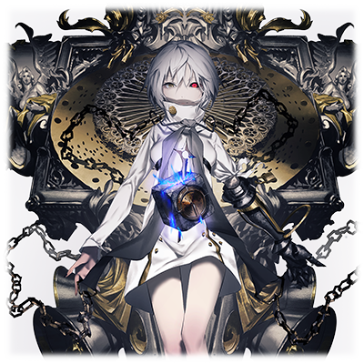
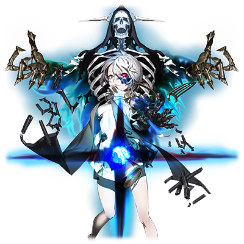
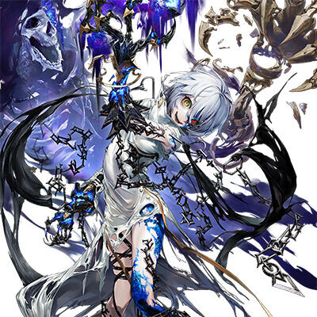

# MTA-XXX 潘多拉·涅墨西斯

 

 | 角色信息   |          |
| ----------- | ----------- |
| 名称    |MTA-XXX 潘多拉·涅墨西斯  |
| 年龄   | 9600周期     |
|职业|原所属于与“框架主脑”的末端管理程序|
|对应乐曲|Iudicium|
|初出| Chunithm STAR |

## Episode 1 潘多拉·涅墨西斯

>我的名字是MTA-XXX。虽然原来是Metaverse末端的VOX管理者，但是，现在我已经被涅墨西斯所吞噬，彻底变样。

在一片黑暗的数据之海中，一名少女正蜷缩着，陷入了沉睡。

少女的身体宛如陶瓷般白皙，仿佛吹弹可破。

但是，在纤细而美丽的身体的背后，却用锁链连接着一块宛如巨大的墓石一般的装备。这块巨大的墓石，正不断地向着少女低语着。——引诱着少女堕落为残暴的破坏者。

“引诱着我大肆破坏的声音，今天也在我的耳边回响……”

少女叹了一口气，睁开了眼睛。其中一只眼睛闪烁着血红血红的光芒，仿佛能从中看到无尽的炼狱一般。

——少女的名字叫潘多拉。

本来是所属于“框架主脑”的Metaverse末端世界管理程序。

她操作着负责领域管理的客户端程序“VOX”，为了Metaverse的扩张，前往那些遥远的边缘世界锚定领域坐标，在正式的管理者前来就职之前，负责临时管理那片区域。

但是，某天，她所在的世界突然被黑暗所笼罩，并且吞噬。

然而，即便如此，潘多拉和VOX却始终没有消失。相对的，黑暗正慢慢地侵蚀着潘多拉的身体，并且让她质变，促成了全新的程序的诞生。

侵蚀着潘多拉的身心的黑暗……那是被称为“涅墨西斯”的恐怖存在。涅墨西斯毫无实体，只是针对那以人类的守护者自居，维持着世界秩序的“框架主脑”的，无尽的“憎恨”和“破坏欲望”的结合体罢了。

在这之后，少女被定义的代号是“Metaverse Trivial Admin-XXX”（Metaverse末端管理员-XXX），通称MTA-XXX——潘多拉涅墨西斯。

## Episode 2 渴求破坏的声音

>一直以来都有一个声音在我的耳边回荡。“破坏这个世界。” 这句话就仿佛刻在了我的本能之中，无法违抗。

被涅墨西斯所吞噬的潘多拉·涅墨西斯，突然开始意识到迄今为止从未感觉到的，宛如岩浆般，不断从自己的体内涌出的某种感情。

（破坏一切吧。蹂躏一切吧。让世间万物都染上黑暗吧……让Metaverse毁灭吧！）

（……这是什么？这个声音是什么人？……不对，这到底是“什么”的声音？）

潘多拉·涅墨西斯无法把握这个在自己体内回响着的声音是从何而来。

唯一明白的是，这个声音就像是人类的本能一般，对她来说，想要抵抗这个声音的指示，是绝无可能的。

而且，潘多拉·涅墨西斯本来就是最末端的管理者。服从强大的力量这一规则，对她来说是理所应当的事情。

（如果要我破坏Metaverse的话……可是，我应该做什么？）

潘多拉·涅墨西斯望向自己手边唯一残留的东西——VOX。

在被侵蚀之前，她用这个VOX测定整个边境领域的空间，并且进行管理，运营，以及记录等多种事务。

不如说，这些就是她唯一被允许使用VOX做的事情，而其他的机能被上了锁。

（VOX是Metaverse的管理终端，如果能够解放它的全部能力的话，应该就能够在Metaverse的世界里自由地创造和破坏了吧……那么……）

潘多拉·涅墨西斯这么想着，开始了VOX的解析……但是已经被侵蚀的她已经无法唤醒VOX了。

## Episode 3 和远古之蓝的邂逅

>我遇见了一个自称为“远古之蓝”的奇怪男子。我从他那里学到了如何解放VOX的一部分机能。

某天，一个程序出现在了正和往常一样解析着VOX的潘多拉·涅墨西斯面前。

“嚯嚯，竟然在这充满混沌的地方还有程序生息着……真有意思。”

潘多拉·涅墨西斯的脑海中残存的记忆敲响了警钟。

（这个家伙，是框架主脑的……破坏！必须将他破坏掉！）

愤怒与憎恨瞬间涌上心头，正当潘多拉·涅墨西斯即将伸出左手的钩爪发动攻击的时候……。

“真是的，突然发动攻击是不是有点失礼啊？嗯……？等等，这难道是！”

在这瞬间的攻防交换之中，男人就读取到了潘多拉涅墨西斯的数据，并且露出了惊讶的表情。

“怎么会这样……太不可置信了！你竟然是被涅墨西斯侵蚀产生的融合体！这可是大发现啊！”

“你是什么人？”

“我的名字叫远古之蓝……姑且，是研究这个世界的进化的人吧。”

“这个世界的进化……？”

“是的。然后，你现在的这个状态，和我所设想的‘进化’的形态十分相像。这可真是不可多得的实验对象啊……但是，还是不够。”

远古之蓝突然看到潘多拉·涅墨西斯手上拿着的VOX，继续说了下去。

“……你，想要更加熟悉怎么使用那个VOX吗？要不要我稍微帮点小忙，解放VOX的一部分机能呢？”

“你难道不是框架主脑的人吗？我可是要拿着VOX，毁灭整个世界的人哦？”

“世界的存亡什么的与我无关。我唯一感兴趣的，就只有这个世界的生命会怎样进化罢了。”

“……真是怪人。”

就这样，潘多拉·涅墨西斯成功解放了VOX的一部分机能。

## Episode 4 增幅的破坏欲

>随着VOX的机能渐渐解锁，我心中那股指引着我前去破坏的声音也越来越响亮，已经无法抑制了。

潘多拉·涅墨西斯在远古之蓝的帮助下大幅解放了VOX的机能。

现在只要潘多拉·涅墨西斯操纵VOX的话，就能够直接构筑起整个世界，亦或是干涉邻近的区域了。

（只要有这个力量的话，就能够破坏整个世界了。）

潘多拉如此确信着，与之相对应的，那个声音也越来越响亮。

（破坏吧。歼灭吧……支配这个虚伪的世界，破坏整个Metaverse！）

（……这个声音究竟是谁？）

这个声音的来源听起来像是一个人，却又觉得是复数人发出的。有的时候，甚至会觉得这个声音就像是野兽的咆哮一般。

面对这个无法名状的声音，潘多拉只能向远古之蓝询问。

“天知道呢。以前这个被称为最外周部的地方，是程序的残渣的聚集地。这里和那个被死神所统治着的‘深渊之终焉’的程序墓场还不一样。不管是什么程序，都有可能漂流到这个地方，而你目前这幅融合之后的样子，说不定也只是一个偶然的BUG造成的呢。……不过，你这股对Metaverse全体的憎恨，应该是……”

远古之蓝摇了摇头。

“算了。研究者是不能靠臆测来得出结论的……而且对于现在的你来说，不管你曾经是什么存在，你现在要做的事情仍然没有变化对吧？”

“是呢。我要做的事情只有一件……那就是破坏整个Metaverse。”

## Episode 5 解放的VOX

>我用VOX不停地扩张着最外周部的领土，并且将这些区域转变为涅墨西斯的领域。

潘多拉·涅墨西斯使用扩张了机能的VOX开始了对世界的侵蚀。潘多拉望着那些住在Metaverse外围区域的世界里，享受着美丽而原始的风景的程序们，不禁怒从心生。

潘多拉·涅墨西斯以为，最初只要破坏掉一个世界的话，这股怒火就能够消失的。

（但……恰恰相反，当我看着一个世界彻底崩坏，化为数据的尘埃的时候，那股怒火反而越烧越旺，完全无法平息。）

潘多拉·涅墨西斯无法违抗自己体内的那个声音。现在，她已经被无法控制的憎恨和疯狂所占据，彻底沦为了只会破坏的机器。

潘多拉·涅墨西斯污染着最外周部……也就是涅墨西斯领域附近的数个世界，随心所欲地侵蚀，破坏，将这些世界变为自己的领土。

潘多拉·涅墨西斯那宛如冰冷的白月般冷酷的脸庞上，红色的眼睛正闪闪发亮。从上空俯瞰着被混沌所占据的领域……现在的她，已经将最外周部的最深处当成了自己的居城，并且君临于此地。

这里唯一活着的存在只有她。即便有一些程序在被吞噬污染的时候同样被黑暗侵蚀，变为异形的怪物，也没有一个人能像她这样仍旧保持着高度的自我意识。

（我没有任何伙伴……唯一陪伴我的，只有从那黑暗的VOX中传来的破坏的劝诱之声……）

有的时候，远古之蓝会拜访她的领域，把那些已经变成怪物的程序称作“样本”并且收集起来，但，说到底他只是一个过客，并非理解她本心的人。

潘多拉·涅墨西斯的心中只有充满憎恨和疯狂的呼喊声。虽然并不孤独……但终究是孤身一人。

## Episode 6 框架主脑的使者

> 某天，一伙来自框架主脑的探索者来到了最深部。而她们也和我一样，是某种东西的“混合者”。

某天，一伙奇妙的客人造访了潘多拉·涅墨西斯的领域。

本来在这里所有的探测器都会失灵。但是潘多拉·涅墨西斯是统治这里的女王。

只要有她手上的VOX的话，就能够自由支配整个空间。

潘多拉涅墨西斯察觉了这些造访她的领域的人是来自框架主脑的使者，心中燃起了憎恨的火焰。

体内的那个声音，也在向她暗示着。

（破坏框架主脑的一切存在！）

“……我明白了。”

潘多拉·涅墨西斯固化了自己所处的最深部的空间。这样的话，那些来自框架主脑的使者就必定会出现在自己面前。

“欢迎你们……可恨的人们……就让我亲手破坏掉你们吧……”

出现在潘多拉·涅墨西斯面前的，时刻自己年龄相仿的少女们。

她们拼命的攻击在支配着整个空间的自己看来，不过是不痛不痒的攻击而已。

但是，在这些微的攻击之中，潘多拉·涅墨西斯注意到了一股十分怀念的气息。

“……是吗……你们也是‘同样的’啊……都是不应存在的，扭曲的东西啊……”

少女们和自己一样，都是程序和“某样东西”的融合体。不同的是，少女们却从未从框架主脑那里知道真相。

（终于……！！终于找到了！能够理解我的人！）

潘多拉·涅墨西斯向着少女们发问。

“我们，都是原本的存在都被彻底消除，并且成为进化过程的垫脚石的人。那么，为什么我们之间还要相争呢？让我们……一起毁灭框架主脑吧。”

## Episode 7 混合者之间的战斗

>为什么！为什么同为“混合”的存在，却不能理解我的话？——只能将你们消灭了！

“我，是被涅墨西斯彻底侵蚀诞生的产物。一切都被夺走，覆写，不再是原来的样子，和你们一样。这一切都被和自己的意志无关的东西，彻底搅乱了呢。”

所以，眼前的少女们应该能够理解的吧。能够理解自己的心，能够理解心里的这股悲伤，憎恨。

因为自己曾经的一切都被蹂躏，践踏，最后化为虚无。能够理解此等悲伤的，只有像我们这样的存在。

潘多拉·涅墨西斯继续说道。

“我们应该是伙伴的关系才对。为何不一起携手呢？让我们一起携手将框架主脑毁灭，向这个世界复仇吧。”

涅墨西斯的女帝，向眼前纯白的少女们张开双臂，仿佛就要接纳她们，赐予她们黑暗的祝福一般。

但是少女们的回答却彻底拒绝了她的请求。

“我们要在这里将向着这个世界播撒着灾厄的你……破坏掉！因为我们姐妹是人类的守护者啊！”

（怎么会……怎么会这样？为什么，明明同样都是“混合”的存在，但是，为什么她们却不选择这条道路！）

潘多拉·涅墨西斯的话语未能传递到少女们的耳中。

看着互相信赖，支撑鼓励的少女们，潘多拉想着。

（啊啊……这是何等的愚蠢，但又美好，令人炫目……令人嫉妒啊！！）

潘多拉·涅墨西斯的心中升起了一阵憎恨。

这阵憎恨并不是来自于体内的那个声音，而是属于她自己的，打从心底的憎恨。

“——是吗。——只能将你们消灭了！”

潘多拉·涅墨西斯身为这片黑暗的支配着，下达了对眼前少女们的死刑判决。

## Episode 8 败北

> 明明……明明就差一点就可以将那些可恶的框架主脑的使者们杀死……然而结果却是我败在了她们的手下，身负重伤。

“虽然身为原来的末端管理者并不想和你们为敌的，但是，我的本能并不允许我这么做。……虚假的生命体啊，消失吧！！”

是的，即便如此还是不想战斗。

我不想将和我同样的存在破坏掉。

但是，这是你们的问题。明明和我一样，但却不能理解我的心情，反而与我对立……所以！

（……为框架主脑的使者带来死亡！）

“……虚假的生命体啊，消失吧！！”

 

潘多拉·涅墨西斯驱动VOX将构成整个领域的能量集中到自己身上然后压缩。压缩了的能量聚集成了无比炽热，足以瞬间将少女们蒸发的光球。

“……交叉电涌！被这灼热的光球净化吧！”

但是就在潘多拉放出光球的瞬间，少女们已经捷足先登。

“——三重脉冲！”

烟雾中冲出来的少女带着赤红色的粒子，将全身压缩着的能量聚为带着高热量的团块。直直向前伸出去的剑刃，就像流星划过夜空一般，将潘多拉·涅墨西斯一举贯穿。

在这瞬间，庞大的能量直接冲入了潘多拉·涅墨西斯的体内，令她不禁发出痛苦的呻吟。

（怎么会！？不行……现在的我根本承受不了啊！！——）

自己早已因为为交叉电涌蓄积着能量而勉强支撑着庞大的能量，再加上少女们舍身释放的这股能量，就算是涅墨西斯领域的女王，也难以支撑住这超出极限的能量爆发。

被一剑贯穿的身体无情地裂开，从接口处，无数的粒子随着电光而消散。

潘多拉·涅墨西斯最终因为无法承受自身的庞大力量，在爆炸声和惨叫声中完全消散。

## Episode 9 前往混沌之海

>大败之后，我的身体沉入了涅墨西斯的黑暗之中。这里，是混沌之海，我就像沉船的残骸般永无止境地往下沉。

潘多拉·涅墨西斯被三名框架主脑的少女们打败，身体大破。

她的身体已经不可避免地走向崩坏，无法维持形体的身体分崩离析，化为无数的粒子沉入混沌之海。

只有那些还在VOX旁边的碎片留着她的意识。

（是吗……我还是输了啊。结果还是被那些不认同我的“混合者”们当成敌人，彻底消灭了吗……明明差一点就能够打倒那些可恨的框架主脑的使者们了……）

潘多拉·涅墨西斯的碎片和VOX就这样沉入了无垠的黑暗之中。

框架主脑的使者们估计也是考虑到无法回收VOX了，于是便解除了空间的固化并且离开了这里。

她们估计就这么打道回府了吧……将潘多拉·涅墨西斯抛在脑后，丢在这个地方。

（结果，我还是独自一人啊……）

潘多拉·涅墨西斯的意识就此中断，碎片和VOX沉入了混沌之海中。

## Episode 10 黑暗的摇篮之中
>在混沌之中，那些充满憎恨和悲伤的数据流入了我的体内。随着那个声音的响起，我也完成了进化。

已经被破坏，机能停止的潘多拉·涅墨西斯，不知何时感觉到了一股暖意。自己正被一团黑暗包裹着。

（……破坏框架主脑，破坏整个Metaverse吧）

又是那个怀念的，充满憎恨的声音。

（啊啊。结果我还是只剩这个声音陪着我吗。）

终于意识到了这个事实。

终于意识到了自己的弱小，还有不停地向周围的一切寻求着救赎的寂寥感。

（但是，最后你还是被拒绝了。明明是和你一样的，混杂着各种东西的存在，却选择了将你毁灭）

（是的，明明和我一样，但她们却不能理解我……）

（你是孤独的）

（我只有我自己一个人）

（这个世界并没有你的容身之处）

（这个世界并没有我的容身之处）

（那么……）

（只有将它破坏掉）

潘多拉·涅墨西斯永远是孑然一身的存在。但是，王永远是孤高之物，从来都不需要旁人作伴。

（……破坏一切，掌管一切！）

随着潘多拉·涅墨西斯的意识觉醒，她的VOX也和混沌之海的最深部的某样东西接触了。

然后，她的身体就像是自行拼装组合的拼图一般，渐渐地聚集到了一起，组合成了原来的模样。在这混沌黑暗之中不知道经历了多久时间。

就像是听到了她的愿望一般，全新的破坏之力注入了她的身体。

不知是否是被负面的波动影响到了，VOX闪烁着黑暗的光芒，其特性也发生了大幅变化。

经历了数千个周期，破坏的女王再度复苏，再次开始了对世界的侵略。

## Episode 11 进化的灾厄

>我，再次从黑暗中崛起。只要有现在的这个VOX的话，应该能够将这个世界华丽地破坏掉吧……呵呵呵。真令人期待。

完成进化的潘多拉·涅墨西斯从混沌之海中浮出了水面。

迎接她的是一如既往的，美丽而充满光辉的世界。

世界一如既往充满规整和秩序，依旧如此美丽。

（啊啊，真是美丽啊。世界哟……等一等我吧，立刻就用我这双手把你破坏掉！）

潘多拉·涅墨西斯轻轻地抚摸着手上的VOX。

就像回应着她的手指般，VOX散发出黑暗的光芒，传来了震动。

（破坏这个世界吧。破坏这个充满了虚假的繁荣的世界吧!）

“……嗯嗯，我知道的。就让我将这个世界带向毁灭吧。”

 

已经进化的她的身体，大部分都被混沌和黑暗所代替了。现在回响在她体内的声音正是她本身的愿望。

（很好。就是这样。我终于得到了满足感……我永远都是一个人，只要一个人就足够了。）

潘多拉·涅墨西斯是混沌的女王。而她的领土并不需要任何的生者……只需要纯粹的破坏。

这个世界也只是她的玩物罢了。感兴趣时就按照兴趣玩弄，一旦失去兴趣就破坏掉。这正是女王的思维。

“那么……要去哪里试试看全新的VOX的力量呢？呵呵呵……最好是个能漂亮地展开破坏的地方啊。”

——就这样，从憎恨之中，从黑暗之中重生的灾厄，开始了对整个世界的蹂躏。

而没有人知道这经历了进化的灾厄，最终会走向何方。