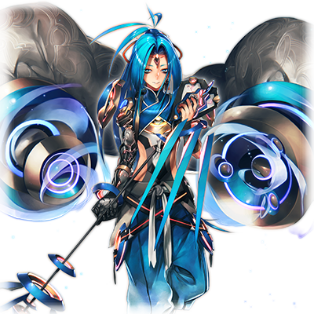

# 提丰

|角色信息| |
| --------- | --------- |
|名称|提丰|
|年龄|未知
|职业|现“框架主脑“的最上位管理程序
|CV|中村悠一
|对应歌曲| BlazinG AIR
|初出|Chunithm Star

## Episode 1 SPEC:提丰

> 自从神祖消失之后，Metaverse降临了12柱程序并为这个世界带来了繁荣。他们，被称作“最古”(ORIGIN)。

人类的摇篮，永久乐土Metaverse。自从神祖艾克雷尔离去之后，有12个新的存在被当选为神明不在时负责管理乐园的管理者。

他们就是被称作“最古”(ORIGIN)的程序们。

他们各自有着例如“调律者”，“哲学主”，“探求者”等各种往不同方面特化的能力，手握着绝对的权限，代表着“框架主脑”对整个世界进行管理。

他们以合议制的方式决定决策，而他们的立场是平起平坐的。

然而随着时间推移，“统制主·提丰”开始崭露头角，权力的平衡发生了偏移。

本来，“框架主脑”的任务，是《保护人类这一物种的生存》以及《Metaverse的繁荣》，正因如此，为了让这个不断扩张的世界保持安定，大部分的最古并不对权力表现出兴趣。

这个时候身居高位的最古们仍未发觉，不久之后，足以让Metaverse的未来大幅度改变的事情，即将到来。

## Episode 2 与复仇之翼的战斗

> 我虽然在和提亚马特的战斗中负伤，但是通过吸收同为最古的一柱，我成功地恢复了全部的机能。

作为现行人类为了复仇而送到Metaverse的破坏之翼，提亚马特。

令人意外的是，本该已经是风中残烛的人类所制造出来的漆黑巨龙，居然让本应远远凌驾于人类力量的Metaverse的精锐部队被悉数歼灭。

即便是最古，也无法幸免于难。虽然在明面上率领大军交战的，是最古的中心人物，提丰，但是其他的最古也在各自的战场上面对着这场浩劫。

在这之中，负责掌管丰收的“大地支配着·吉斯库克”被提亚马特的“终极涡流”重创，被破坏到无法再度修复的地步。

而在冷血无情的“马尔杜克计划”中勉强战胜提亚马特的提丰，其自身收到的损伤也让他的机能降低到只剩下30%的程度。

这件大事让最古们大为震惊。而为了让Metaverse再度恢复安定，12柱程序之间展开了激烈的辩论。

然而，当事者的提丰，却在其他最古得出答案之前，就将无法修复的吉斯库克彻底吸收，通过将他的力量据为己有，从而完全复活。

提丰的行为非常合理，但也冷酷无情。

迄今为止对提丰的决定并没有异议的最古们，初次发出了疑问。

然而与之相对的是……。

“这能叫做冷酷无情吗。吉斯库克可是连人格数据都被破坏掉了啊。除了为我的修复提供帮助以外还有什么用途吗？”

提丰用着理所当然的语气向其他最古说到。

确实，他说的也是事实。于是其他的最古便不再对这件事提出意见。

经由提亚马特一战，擅自吸收了一名最古的资料的提丰，在这之后，获得了更加强大的权限。

## Episode 3 我们所没有的可能性

> 我对人类的“进化”产生了兴趣。于是我数次捕获了人类并进行了各种实验，这都是为了这个世界的繁荣所需要的牺牲。

自从提亚马特一战之后，提丰的统治变得愈发专横。

他将其他的最古扔在一旁，想效仿曾经的神祖·艾克雷尔那样，自己成为统治这个Metaverse的，独一无二至高无上的管理程序。

与此同时，提丰对他曾经不屑一顾的现行人类产生了浓厚的兴趣。

（人类是本该被毁灭的下等种族。但是像这样的种族竟然能够产生像提亚马特那样的存在，不管怎么思考都觉得这是不可能的事情。……但结果就是，现行的人类超越了他们自己的极限。这种能够超越我们计算的结果的东西，究竟是什么？）

提丰决定，彻底调查出和身为数据的组合的自己所不同的，现行人类绝无仅有的特性到底是什么东西。

结果就是找到了“进化”这一系统。

（虽说不够完全，但是寄宿着无数的可能性的存在。只要能够获得进化的力量的话，Metaverse……也就是我应该能够变为更高次元的存在吧。）

虽说如此，但是需要的样本严重缺失……而且，将电脑数据和人类进行融合的实验也遇上了困难。

本来，Metaverse，以及“框架主脑”的职责应该是“保护人类这一种族”的。

但是，提丰却放弃了这一绝对的使命，选择了满足自己的好奇心和野心。

他无数次地进行着将人类抓起来并且解体，之后强行和程序融合起来地残酷的实验。

终于，提丰的实验让其他的最古们知晓了。

提丰惨无人道的实验遭到了以“调律者·WISEMAN”为首的稳健派的反对。

——不管再怎么以Metaverse的繁荣作为理由，侵犯了身为“框架主脑”的使命这一行为是不可饶恕的。

于是，曾经互相平起平坐，相互交流，各自完成使命的“框架主脑”的高层们，被分成了“亲提丰派”，“中立派”以及“反提丰派”三组人，从此分道扬镳。

## Episode 4 无法理解崇高理想之人

> 似乎有些不理解我的实验的蠢货的样子……“最古”不需要这样愚蠢的家伙存在，就乖乖变成我的食粮吧。

本来，提丰就是身为“统制主”而设计的程序，而自从吸收了吉斯库克的力量并且据为己有之后，他就成为了最古中最强的存在。

不止如此，他专横的统治，以及对本应该守护的人类出手的，残酷无情的人体实验……。

这些事情使得提丰的统治权威受到了冲击。

特别是反提丰派的成员，已经在默默地做着准备，想要将提丰的统治拉下来。

（哼……这些愚蠢的家伙，竟然无法理解我崇高的理想……这样的家伙，就不需要当“最古”的一员了）

面对与自己为敌的实力，提丰决定像吉斯库克那样，将他们一一吸收。

当然，他们的机能现在仍然在正常运转，而提丰也并不是像提亚马特一战那个时候，需要吸收别人的力量的情况。

即便如此，想要将其他运转正常的最古们吸收的这一行为，毫无疑问是违背了“统制主”这一名份的行为。

提丰以外的最古们面对这巨大的危机，很快便制定了对应的策略。

## Episode 5 愚蠢的叛军

> 那群叛乱军怎么可能是已经和框架主脑中枢互相连接的我的对手。虽然有2人已经逃离这里，但现在还是放到一旁吧。

提丰想要吸收其他最古并且将力量据为己有的恐怖计划很快就被反提丰派的人知晓，他们联合了处于中立立场的远古之蓝和WISEMAN，向提丰揭起了反旗。

结果就是，他们见识到了提丰的强大之处。

他已经和框架主脑的中枢深度融合，如果打倒他的话，同时也会让中枢的机能大幅下降。

如果框架主脑整体的机能下降的话，就无法稳定控制Metaverse，甚至会对那些格纳起来的人类的数据造成威胁。正因如此，反提丰派无法做出“危害人类”这一违反了最古的使命的行为。

结果，他们的革命只能以失败收场。

反提丰派的力量并未全部被提丰所吸收，但是，他们也只能在提丰压倒性的力量面前卑躬屈膝。

而被提丰视为危险人物的WISEMAN，以及思考方式异常而成为排除对象的远古之蓝二人，则自己离开了框架主脑，成为了众所周知的“追放者”(EXILE)。

就这样，最古之间的合议制就此不复存在，框架主脑成为了提丰独裁下的所有物。

## Episode 6 持续增殖的世界

> 我最终成为了王，而Metaverse在我的统治之下获得了安定。那么，接下来就是继续实验，产生全新的可能了。

提丰虽然傲慢，但同时也是治理有方的王。

座于框架主脑的核心的他，为Metaverse带来了安定，让整个世界进入了和平的时代。

终于安定下来的世界，又开始了无秩序的增殖，终于增长到就连框架主脑的全部算力，都无法全部控制的地步。

然而提丰故意选择放手不管。

与此相反，他反而对这随机增长的世界充满期待，期待着能够诞生全新的可能性。

他想做的，正是促进现行人类这名为“进化”的系统尽快开花结果。

当提丰停下增殖世界的脚步后，便着手赋予了数名人类予以力量。

接受了神的力量的人们，有些人立刻就发现了端倪，而有一些人也不曾知晓自己的变化。不管如何，他们总有一天会觉醒超越人类认知的力量。

经过像这样的尝试，以及积累了迄今为止众多的人体实验，提丰终于成功制造出了后来认定的，人类与程序融合而成的混合生命体。

## Episode 7 从边境之地归来

> 从最外围区域归来的探查队带来的情报确定了几项事实。而且，还找到了那些追放者的行踪。

距离提丰成为王，已经经过了很长的时间。

他的眼光投向了仍在扩张的世界的边缘，连开拓与否都无法确定的“最外围区域”。

那片区域被称为“涅墨西斯”，是宛如黑盒子一般，完全无法窥探究竟的领域。

常常能从涅墨西斯观测到未知的敌意数据的记录，所以，当务之急是前往那里进行实际的调查。

而且，提丰除此以外也确信了一个猜想。

（这片黑盒子一般的区域，说不定就有那个家伙……也就是提亚马特在那里沉睡呢？）

曾经战斗过的黑龙，光是想起她的身姿，提丰的身上就会感知到曾经受伤部位的幻痛。

（……不得不承认，即便是成为了现今仍在不断进化的Metaverse之王，在我的生涯中，从未见过像它这样能和我分庭抗礼的生命体……如果那个家伙的残骸在这天涯海角之地沉睡着的话，那无论如何也要拿到手！）

提丰向着最外围的区域派出了探索队。这个探索队的人员构成，都是提丰进行试验的产物——“数据和人类的融合体”所组成。

因为不是完全的数据，所以拥有着全新的力量和可能性的融合体。

然而即便是他们这样的存在，想前往潜藏着未知威胁的外围区域并非易事，没有一队能够安然无恙地收集到数据并回到这里。

实际上，一共经历了5次失败，而第六次的探险队，终于到达了最外围区域，并且凯旋而归。

看着以MIR-202为中心的探索队带给提丰的报告，提丰的内心窃喜。这片外围区域，果然就和自己的想想一样……不，说不定是具有更多可能性的地方。

（真是太棒了。只要将那片地方的数据归为我等所有的话，Metaverse一定能获得更高的进化）

MIR-202组成的探索队，还带来了其他好消息。

长年下落不明的两位追放者的行踪终于确定了。

## Episode 8 追放者讨伐

> 那些愚蠢的追放者再怎么说都是原“最古”的一员。只要这些家伙还会成为我的麻烦的话，就必须斩草除根。

（WISEMAN和远古之蓝吗……这两个人一直都没能找到线索的，没想到竟然躲到了那种地方）

WISEMAN的能力是“观测”。他观察着Meta verse内的一切事情，并且记录到WISEMAN所持有的“森罗万象记录”（阿卡夏记录）之中。积累了几乎无限多的数据，并且能够自由控制的他，拥有非常高的战斗能力。

与之相对的，远古之蓝的能力则是“抢夺”。通过将别人的能力夺取并保存为碟片，就能作为自己的东西使用。远古之蓝过去已经和众多凶恶的恶性程序化身交战过，也是不可小觑的实力派。

提丰最警戒的是WISEMAN。因为他从一开始就反对提丰非人道的实验。而且，能够再现观测记录的能力，也是提丰所没有的。

远古之蓝的话，虽然从性格方面是不太可能会反抗提丰的。但是，从以前就对人类的进化有兴趣的他，在遭遇了足亦被称为现行人类的负之遗产的涅墨西斯的时候，会做什么已经不言而喻。如果他真的长年呆在外围区域收集数据的话，他手上的东西应该毫无疑问能够为提丰的实验提供帮助。

（不论如何，一定要拿到他们手上的数据。然后，我要将涅墨西斯纳入囊中，让Metaverse完全支配！）

提丰召唤了身为“处刑人”(EXECUTIONER)程序的利希德修茨，并且下达了抹杀追放者以及回收数据的命令。

这个白银色的处刑人是以和MIR-202完全相异的设计制造出来的程序。

感情被彻底除去，对一切非正规之物都无法饶恕的他，正是只为提丰而挥舞的断罪之剑。

（……说起来，MIR-202她们，似乎想要见我的样子呢）

目送完利希德修茨出发的提丰走向了謁见之间。

## Episode 9 进化的弊害

> 人和程序的融合体，MIR-202她们虽然的确获得了成果，但相应的，也产生了不必要的思考。

房间里，MIR-202为首的三姐妹已经在房内久等。自从从最外围区域回归以来，提丰和她们见面虽然已经是第二次了，但是像这样静下心来说话还是第一次。

“……这次探索辛苦你们了。已经听闻了你们的活跃。值得赞赏。”

“……非常感谢。提丰大人。”

看着表情紧张低着头的三姐妹，提丰眯起了眼睛。她们也是自己长期实验的成果，而且也是能够为世界的进化提供一臂之力的重要样本。提丰对此非常满足。……直到三姐妹的下一句话。

“那个……提丰大人，有一件事属下一直很在意。”

“何事？”

“其实呢，我们三姐妹，是人类和程序的融合体，这件事情，是真的吗？”

“……从哪里知道这些事情的？”

“从名叫‘远古之蓝’和WISEMAN的谜之程序那里……”

提丰露出了不爽的表情哼了一声。

（切！这堆叛徒，偏偏说了些多余的话……！）

“……正是如此，你们正是人类和程序融合诞生的混合生命体。”

“那，那么！我们难道真的是牺牲了那些我们理应保护的人类，才得以诞生的对吗！？”

“而且……从WISEMAN那里得知，我们是有寿命的限制的……”

三姐妹的质问，一句一句地质问着提丰的内心。露出烦躁表情的提丰，用宛如驱赶虫子般的手势回到：

“……你们知道这些真相，又想怎么样？你们可是进化的体现者，可是在这个Metaverse中，最具有可能性的生命体哦？向我表示感激之情，顶礼膜拜还差不多，然而现在你们这幅态度，是何居心？”

“但，但是……说不定，提丰大人所做的事情，未免过于逾越了框架主脑的使命……”

“无礼的家伙！竟敢对着身为神明的我口出狂言！”

三姐妹被提丰的恫吓吓得哑口无言，再也说不出话。然而心底里已经对提丰表现出了不信任。这点从她们的眼睛里就能看出来。

（……进化，虽然也带来了不少意料之外的好事，不过也会诞生一些不利的想法吗……果然世事从来不能一帆风顺啊）

曾经遭遇最古他们的叛乱的提丰不想重蹈覆辙，在这个瞬间，他的脑海里已经下定决心，要将三姐妹处分掉。

## Episode 10 愚者的断罪

> 我不需要和我唱反调的人。于是我便将处分MIR-202她们的人物交给了一名最古。

提丰命令MIR-202她们三姐妹在这里待命休息。

然后，限制了她们的活动，禁止她们前往框架主脑以外的区域。

事实上，已经与软禁无异。

“……斗争主·盖提亚哟。在吗？”

“是！随时都可以下命令，提丰大人！”

“我要说什么，你也应该知道的吧？”

“……将MIR-202，以及她的姐妹，MIR-201以及MIR-203一同抹杀对吧？”

“正是。”

已经完全收集了三姐妹的数据。

虽然要将仍有进化的可能性的融合体删除掉有些可惜，但是，将叛乱的火种在早期就灭掉才是上策的提丰仍旧决定抹杀掉她们。

盖提亚在最古之中，也是擅长战斗的程序。只要他用上全力的话，只不过是探索程序级别的MIR-202她们，想必也是插翅难逃，肯定会被请以消灭的吧。

……提丰对此确信不疑。然而现实却给他开了个玩笑。

MIR-202三姐妹，竟然成功逃过了盖提亚的袭击，并且成功从框架主脑逃了出去。

## Episode 11 无法允许的事态

> 最古一人竟然连下等程序的处分计划都能失败……不可饶恕。和神明对抗之人，必将死无葬身之地！

从侦察程序那里得到了情报，MIR-202她们从框架主脑逃离之后，便逃向了提丰触及不到的最外围区域。

“……赶紧去追她们，并且将她们的项上人头带回来。……可没有下次机会了哦？盖提亚。”

“……是！铭记于心！”

盖提亚立刻就前往了最外围区域。盖提亚的内心，已经没有了身为最古的自信和尊严了。面对曾经给自己带来苦头的三姐妹，他的内心充满了憎恶，以及必须将任务完成的使命感。靠着对提丰的忠心和恐惧而行动的他，不敢怠慢。

即便如此……盖提亚还是未能完成任务，只能狼狈地回到框架主脑。

而且，战斗的结果，反而为MIR-202的进一步进化提供了助推。

可以说是无法饶恕的失态了。

“请，请等一下！提丰大人！请再给我一次挽回的机会！请大发慈悲啊！！”

盖提亚虽然拼命地求饶，但是提丰却没有一丝迟疑。

“……明明第一次已经给过你机会了，然而第二次都没能完成任务的蠢货不需要活在这个世上，像你这种和最古之名毫不相称的家伙，至少在最后一刻变成我的力量，以你的性命，偿还你的罪孽吧！”

“咿呀啊啊啊啊啊啊啊啊——”

盖提亚的数据一点不剩地被吸收进了提丰的体内。

从远处看着这惨状的原中立派的最古们，也不得不紧皱眉头。

然而提丰却丝毫不顾他们的感受。因为他是这里独一无二的王。

框架主脑的王身披着暴风，向着天空咆哮着。

“……愚蠢的家伙！我要让你们后悔和我作对。就让你们的身体，深深地记住我的愤怒吧！”

……就这样，框架主脑正式下达了对三姐妹的破坏命令。

