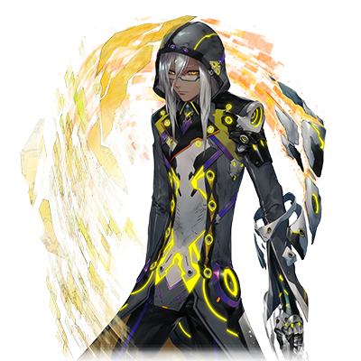

# WISEMAN

 

 | 角色信息   |          |
| ----------- | ----------- |
| 名称    |WISEMAN   |
| 年龄   | UNKNOWN      |
|职业|原所属于与“框架主脑”的EXILE（追放者）|
|对应乐曲|macrocosmos|
|初出| Chunithm STAR PLUS|
|CV|诹访部顺一|

注：该剧情同步于Liberate the Metaverse篇。可以先行阅读主线相关的人物故事以获得更棒的剧情体验。

## Episode 1 SPEC:WISEMAN
> 我的名字是WISEMAN。虽然曾为“最古”的医院，但是我对提丰的做法有着疑问，并且离开了他。

人类的摇篮，永久乐土Metaverse。在管理着Metaverse的神祖·艾克雷尔消失之后，诞生不久的乐园需要新的统治者进行管理。

最终，人们选出来的，是立于“框架主脑”顶端的十二柱程序。

拥有支配整个世界的权限的程序们，各自拥有不同的能力。

他们各显神通，以合议制的形式，扩张着Metaverse，以“最古”之名统治着世界。

在最古们的统治之下，世界获得了安定与繁荣。

但是，这样的局面随着一个程序的崛起而走向了崩坏。

统制主·提丰，在最古之中也是位于中心位置的一柱程序，放弃了守护人类的本职工作，反而强行捕获人类，进行例如将他们和程序进行强制融合之类的非人道的实验。

在提丰的手下，已经不知道有多少人类就这么悄无声息地成为了他的牺牲品。

于是，部分仍然忠于“框架主脑”的最古们和一些对人类持同情态度的最古们联合了起来形成了“反提丰派”，或者称为“稳健派”。他们打算齐心协力推翻提丰的统治。

但是，提丰早早就注意到了他们的行动，于是他反过来吸收了那些反对自己的人，并且威胁说要将他们的力量据为己有。

结果，反提丰派的革命宣告失败，大多数最古们的力量被限制。

但是，仍然有一部分人逃离了提丰的控制，离开了“框架主脑”。

提丰将这些从“框架主脑”逃离的最古们称作“追放者(EXILE)”，并且将他们视为最大的威胁，派出了追兵势要追到天涯海角。

在这些被乐园所放逐的，拥有着与神同等力量的流浪者之中……就有着WISEMAN的身影。

## Episode 2 前往世界尽头

> 我的职责就是“观测”。但是，由于提丰把我视作他的威胁，我只能逃到他无法干涉到我的地方。

我的名字是WISEMAN。

作为掌握着“阿卡夏记录”的“最古”，我被这个世界赋予了观测整个Metaverse的职责。……不过，现在也只是个“原·最古”而已了。

我摆脱了提丰的追击，逃离了“框架主脑”。

但是，即便我离开了“框架主脑”，我的使命也不会改变。

现在的Metaverse仍然处于扩张期。人们在不同的世界里繁衍生息，而无数的新世界正在爆发性地产生。

如果继续这样不受控制地扩张的话，就算是“框架主脑”，也会有无法管理到的“混沌”角落吧。

在那些充满混沌的地方，存在着一些对这个世界充满着仇恨的数据碎片。

为了将这个世界导向更加安定和繁荣的局面，势必需要更多的观测数据，从而确定人类的进化走向何方。

……但是，对于已经脱离了“框架主脑”的我来说，这个任务实在是太困难了。

对我的力量充满戒心的提丰派出了源源不绝的刺客们前来追杀我。

Metaverse的各个领域也加强了防备，只是躲在眼皮底下的话，终究会被发现。

所以，我跑到了距离框架主脑尽可能远的边界之地……“最外围部”，并且在那里安营扎寨。

这里人迹罕至，十分荒凉，就算是框架主脑的管理范围也不会到这里的吧。

（如果在这里的话，就能慢慢地观测数据了吧。）

这就是我隐居于此地观测着整个世界的原因。

## Episode 3 邂逅涅墨西斯

> 居于边境之地的我迄今为止已经遇上了数体来历不明的恶性程序。看起来这些东西都是从最深处产生的。

“最外围部”……这个区域，似乎是从Metaverse诞生就存在的区域。

但是，我的数据库中却没有这片领域的数据。

作为Metaverse中存在的区域，这里却并不受到框架主脑的管束……不仅如此，这片区域还随着人类和世界的扩张成比例地跟着扩大。

我从未想过会以这样的形式来到这片未经探索的新大陆，在我踏上，我还是感到了无尽的欣喜。

（这片边境之地应该埋藏着不少未知的资源和数据吧。只要能在这里进行观测的话，肯定能够为Metaverse的繁荣出一份力吧）

……最初，我还如此乐观地想着，但是真正踏上最外周部的土地的时候，这种感情就烟消云散了。

（……这片地方到底怎么回事？这是发生了什么事？）

本来，我就推测过恶性程序化身是不是从最外周部产生的。

（但是……这里的样子也太不寻常了）

在我眼前的，是一片漆黑的，宛如淤泥一般的数据之海，而且还宛如沸水一般冒着气泡，发出令人不快的声音。

那些冒出来的泡泡中产生了全新的程序。这些程序并未在框架主脑的数据库中登录过。

这些从混沌之海中诞生的数据都有一个共通点。

“……向……虚伪……的……神明……发起……反抗！……给神明……带来……灭亡！！”

这些数据……被称作“涅墨西斯”的恶性程序化身，都对框架主脑抱有强烈的憎恨。

（看来我必须继续观察下去才行……涅墨西斯程序……为了一探究竟，看来必须要前往它们的出生地——最深部才行）

## Episode 4 涅墨西斯的使者

>这些涅墨西斯程序和曾经的那场灾难里的某样东西有着相似的性质。说不定，它们正是给这个世界带来毁灭的存在……

来到“最外周部”的我，遇见了某个恶性程序化身。

“……破坏吧。为虚伪的王所统治着的Metaverse带来终焉！”

潘多拉·涅墨西斯……作为迄今为止碰见的恶性程序化身中最特别的存在，她有着强大的力量。

但是最让我惊讶的是她手上正握着VOX。

（这不可能！为什么恶性程序化身会有VOX这种东西！？这可是就算在框架主脑的程序之中也需要一定等级的管理程序才能拿到手的东西啊。）

在持续观测着潘多拉·涅墨西斯之后，我得出了她本来应该是“框架主脑”所属的末端管理程序的结论。

而让她变成现在这副样子，足以超越末端程序的范畴的力量……很明显，她是被某种程序侵蚀了。

（究竟在她身上发生了什么……？等等，这个数据的排列是！？）

我在潘多拉·涅墨西斯的身上，发现了和曾经让框架主脑陷入恐怖之中，在集结了全部最古的力量之后，才勉强打败的那个怪物……提亚马特高度相似的数据。

本来提亚马特早就被提丰的宇宙新星彻底烧成灰烬的……但是最后还是未能确认它的数据已经彻底消灭。

（难道说潘多拉·涅墨西斯就是……。不，说不定全部的涅墨西斯程序，都是从提亚马特的残骸中诞生，从这片混沌之海中走出来的存在呢。说不定在未来，这些家伙会成为全新的威胁。）

从提亚马特和潘多拉·涅墨西斯的特征上来看的话，应该是这样没错了。

但是，为了验证我的推论，我需要更多的数据。

潘多拉·涅墨西斯操纵着VOX封锁着这片区域的最深处，于是我选择了撤离到效果范围之外的地方继续进行着观测。

## Episode 5 融合体的少女们

> 我和那些融合体的少女们邂逅了。虽然她们诞生的经历令人痛心，但是还是希望她们能够在有限的生命之中尽情地享受一切。

在最外围部观测的我随着时间的推移，发现眼前这片混沌之海变得越来越大了。

而且我发现那些从中诞生的涅墨西斯程序，也渐渐从比较低级的怪物形态开始自发性的进化，最终变成了宛如潘多拉·涅墨西斯那样具有很高的完成度的数据生命体。

我最初一直认为涅墨西斯程序只是单纯想破坏这个世界的，野蛮而残忍的程序而已……。

（……难道说，它们只不过是和我们完全相异的存在，是这个世界进化的另一种可能性呢。）

就在我想改变一下方法进行研究，想要前往最深处进行观测的时候……。我碰到了几名少女。

她们是框架主脑派来这里进行探索的探索型程序。

……本来，像我这样的逃犯是不该和她们进行接触的。

但是我目睹了她们其中的一人和恶性程序化身进行了战斗并且受伤的场景，不得不跟着进入了最深部，从而暴露了自己的行踪。

（……这是！）

MIR-202【阿尔忒弥斯·蕾娜】

……在我为这名被她的姐妹们称作“蕾娜”的少女进行治疗的时候，我发现了隐藏在她身体里的某样数据，简直如同晴天霹雳。

因为根据她的组成数据来看，她们实际上是由人类和程序融合而成的混合生命体。

（……从结果来看，还是没能阻止提丰的邪恶计划吗。最后，他还是跨越了禁忌的红线。）

这些少女是经过残忍的人体实验诞生的产物。一方面，她们本就是禁忌而扭曲的存在，在被赋予了强大的力量同时又不得不面临着终有一天粉身碎骨的残酷命运，令人看不下去。同时，她们也没有放弃属于自己的意志，仍旧坚强地和她们的命运作斗争，又令我非常感动。

听说她们想要回到框架主脑，我便告诉了她们目前掌管着这个领域的正是潘多拉·涅墨西斯这一事实。

“……能够从这里突围的方法只有一个……就是打倒身为管理者的‘她’。”

我还将她们身体里的秘密告诉了她。虽然事实很残酷，但无法改变。所以，不如尽早告诉她们真相，让她们决定自己应该如何在这仅剩无几的时间里活着。

（本来我也想助她们一臂之力的……）

但是就这么让她们回去的话，我的行踪肯定会暴露。

而且这也意味着涅墨西斯的势力也会查知到我的存在。

……我还不能结束在这里的观测呢。

我和三姐妹道别，为了安全起见离开了这里。没过多久，我就得知了闭锁空间被解除的消息。

（竟然打倒了潘多拉·涅墨西斯吗。了不起。）

随着潘多拉·涅墨西斯的破坏，混沌之海的封印也被解除了。

究竟，涅墨西斯是什么样的存在呢？我抱着这样的问题，踏入了更深的领域。

## Episode 6 白色钢铁之翼，再度现身
>在涅墨西斯领域的最深处，我遭遇了白色的处刑人。虽然很想避开战斗的……

我终于来到了这片区域的最深处。来到混沌之海的最深处的我，终于发现了那个东西。

（不会错……那是提亚马特的残骸！）

残骸由于提丰的猛烈攻击，还有长年沉没于混沌之海之中表面已经风化到看不出原型了。

但是我还是能从中看到曾经肆虐整个Metaverse的那只凶暴而且充满憎恨的怪物的背影。这确实是提亚马特的残骸。

在那块碎片的周围，正源源不断地产生着涅墨西斯程序。

看到这番光景的我终于得出了结论。

（……果然，涅墨西斯程序还是危险的存在。如果就这么放任自流的话，总有一天会成为框架主脑，不，整个Metaverse的威胁吧）

这些涅墨西斯程序本身就十分强大，但更加可怕的是它们异常快的进化速度。再这样下去，它们进化到能和我们最古分庭抗礼的地步也只是时间的问题……不，情况说不定更糟，早就已经出现了这样的存在也说不定。

（涅墨西斯程序……到底有没有办法能够将它们或者说，这一整片区域彻底消失的方法呢？）

就在我想继续前往深处探索的时候……

“汝就是WISEMAN吗。请跟吾一起前去‘框架主脑’吧。”

突然，有人突破了我张开的结界，闯了进来。

宛如纯白无暇的城池般宏伟，壮观的姿态。但却从头盔的缝隙中看不到一丝感情的余光。

  

自称为“利希德修茨”的程序不由分说向我发动了攻击。……没办法了。

“这可是久违的战斗啊。怕是没法手下留情了！”

无奈应战。不过，我的目的终究还是观测这个世界，并不需要将他完全破坏。

我闪开了利希德修茨放出的空间攻击，将迄今为止所收集的全部数据都注入了他的体内。

暴露在巨大的数据奔流之中，利希德修茨陷入了无法动弹的过热状态。我便趁此发动了空间转移，离开了此地。

“祝你好运，白色的断罪人……”

## Episode 7 黑暗的使者，厄里斯·涅墨西斯

> 就在战斗进入白热化的时候，持有着强大力量的涅墨西斯程序突然向我们发起了攻击。我和处刑人的战斗不得不就此作罢。

逃离了利希德修茨的追杀，我终于到达了位于混沌之海的中心的提亚马特的残骸之处，并且立刻开始了调查。

（……好强大的负面数据流啊。光是站在这片风暴面前没被吞噬就已经这么费劲了。）

我在这片几乎被憎恨所支配的数据空间中观测了一阵子……然而。

“终于找到你了！！WISEMAN！！”

“真是的……阴魂不散。”

声音的来源正是白亚的断罪者·利希德修茨。

“为了追杀我竟然跑到这样的地方？可真是辛苦了啊。”

“……吾已经不能再失败了！！今天，吾必定会在这里将您捉拿归案！！”

（……哦？）

利希德修茨的样子和之前战斗的样子有所不同。

从他那毫无生机的眼睛里……那恰如其分的，宛如毫无感情的程序一般的眼睛里，现在却闪闪发光着，闪烁着某种感情一般的东西。

那是充满了执念的目光。

（这眼神，是认真的啊。这次就算是我也没法全身而退了吗……）

“也罢。白亚的断罪者哟……就让身为原‘最古’的我——WISEMAN来当你的对手吧！”

“正合吾意！放马过来吧！！”

就在我们两人即将正式开战的时候——

“什么！？”

不知道是什么人从旁插手发动了攻击，利希德修茨的一只腿被斩断，然后身体被狠狠地击飞。

“……我还以为是什么东西，原来是框架主脑的愚蠢小虫子们啊。来到我等所统治的领域，有何贵干？”

“……你是什么人？”

我质问着突然出现的漆黑的程序。

“我的名字是‘厄里斯·涅墨西斯’。我等，是承载着破坏的使者之记忆的七名程序……‘混沌之器’……我正是其中一人，挑起斗争与不和的斗争之王。”

突然出现在我们面前的，被称为“厄里斯·涅墨西斯”的强大程序，彻底打断了我和利希德修茨的战斗。

## Episode 8 与不和之女王的战斗

> 被称为厄里斯·涅墨西斯的程序主张他们才是人类的正统后继者。而且，他们还对整个框架主脑，抱有无尽的仇恨。

## Episode 9 白亚之城的崩坏

> 处刑人在和争斗的女王的战斗中消失了。侥幸逃脱的

## Episode 10 暴虐之岚平息之时

## Episode 11 智慧的隐者之归还