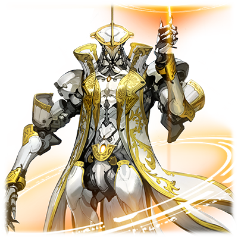
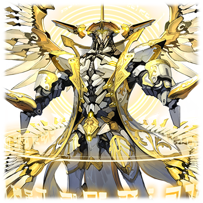

  

# 利希德修茨

| 角色信息   |  |
| ----------- | ----------- |
| 名称    | 利希德修茨       |
| 年龄   | 未知       |
| 职业 |  处刑人（EXECUTIONER）  |
| 对应曲   |World Vanquisher   |
| 初出   | Chunithm Star      |

注：角色名“利希德修茨”语源为德语“Richtschütze”。意思为“炮手”。

## Episode 1 利希德修茨

> 吾名为利希德修茨。背负断罪的双翼的程序。为那些从乐园中被放逐的罪人带来死亡的处刑人。

Metaverse，孕育人类的摇篮，永远安宁的电脑乐土。在曾经管理这里的神祖·艾克雷尔离去之后，这个世界正祈求着新时代的统治者。

而最后选出来的，是立于“框架主脑”的顶端的十二柱程序。被称作“最古”的他们，拥有强大的力量。

然而，随着统治者“提丰”的崛起，全部的权利都集中到了他的手上……事情本该如此发展的。

遗憾的事，部分“最古”拒绝了回归提丰旗下的要求，逃离了“框架主脑”。

这些逃离此处的人们被打上“追放者”（EXILE）的烙印，成为了被乐园放逐的大罪人，成为了要被制裁的对象。

为了制裁这些逃离出去的人们，制造出来的就是被称为“处刑人”（EXECUTIONER）的程序。

处刑人的任务不只是为追放者带来制裁，同时也要清除一切对Metaverse有害的存在。

提丰所统治的Metaverse正在不断地开疆拓土，而日渐广大的领土也越来越难以全面观测了。

特别是被称为最外围部的未知区域，是产生无数的BUG，孕育着对Metaverse有害的恶性程序的混沌之海。

这些为世界带来威胁的不肖之徒，也是处刑人必须清理的对象。

他的存在，正是守护这个世界的秩序的守护者。

## Episode 2 断罪的天使

> “框架主脑”目前的统治者是提丰，而将那些反抗他的威权的人清除掉，就是吾之任务。

首先，还是好好地讲解一下什么是“追放者”（EXILE）吧。他们本来是立于Metaverse的顶端的十二柱程序“最古”。

这些获得了足以支配世界的权限的程序们，拥有各异的能力。

他们各显神通，为Metaverse的繁荣发展尽心尽力，以合议制的形式运营着“框架主脑”。

然而，随着在“最古”之中也是权力中心的提丰的崛起，剩余的“最古”们的地位也被不断剥夺。

不管是多么位高权重的程序，一旦结束了任务，都必须回归“框架主脑”。回归之后，将力量回归于系统，并且在由“死亡之神”所管理的“深渊尽头”中沉睡。这一规则，即便是“最古”也不能免俗。

本来，他们应该将力量全部交给提丰，之后从表面的舞台上退去的。

然而，拥有高度的思考能力以及自我意识的他们中的其中一些人，脱离了这个回收的循环，并且选择了逃亡。

这些从“框架主脑”逃出去的“最古”之中，开始出现一些只跟随自己的愿望而行动的人。

这些持有着和神同等力量的反逆之人，成为“框架主脑”的统治者的提丰将他们称为“追放者”，视为最大的威胁。

作为其结果，就是诞生了能够最终对这些罪孽深重的追放者们降下制裁的，强大的断罪天使。

身披白色的钢铁之翼的断罪之人，就是“利希德修茨”。

## Episode 3 第一份命令

> 吾最初收到的命令，就是同时兼任性能测试的实战。吾则使用特殊的压缩空间，粉碎眼前的敌人。

在“框架主脑”的制造工厂中，现在正在生产全新的处刑人程序。

普通的处刑人程序，都是由制造工厂的技师进行编程制造的。

但是，这个处刑人是特别的。因为他是由统治者提丰亲手设计，亲手生产出来的程序。

“——主系统启动。活性率上升……利希德修茨，启动完毕。”

从生产线中走出来的利希德修茨，随着启动的完成，向着面前的创造主提丰跪了下来。

“……终于苏醒了吗。吾之利剑……”

“正是。吾乃为了吾之创造主而挥舞的利刃，正义的执行者……”

“不错。你正是我的利剑……”

“吾之断罪双翼只为您而挥动。您怒火所向，即为吾之仇敌……请下命令，吾主哟……”

“……那么，就稍微试试看吧。”

提丰下达了清理某个恶性程序化身的命令。

目标的敌人并非等闲之辈，对于初生的程序来说绝对不是应该面对的敌人……但这只限正常的情况。

“——除错领域展开。崩解。”

 利希德修茨的领域，能够分析并限制领域中敌人的机能，从而单方面地攻击。

无法动弹的敌人，被利希德修茨投掷的闪光飞盘命中，切成了碎片。

看着面不改色，纯白的机身被红色染透的利希德修茨，提丰露出了满足的笑容。

“嗯，看起来很不错。”

## Episode 4 追放者·扫荡命令

> 将最外围部当作藏身的巢窟的追放者——远古之蓝。吾被下达了将他彻底抹杀的命令。

从此以后，利希德修茨就开始为提丰效命，将那些与“框架主脑”为敌的程序赶尽杀绝。

利希德修茨从启动之后，就立刻在处刑人的行列中大放光彩，成为了处刑人的代表。

那宛如白色城池般庄严的身姿，令无数处刑人程序的同行不禁肃然起敬。

某天，从“框架主脑”也无法观测到的，Metaverse的大地尽头，传来了由派往最外围部的探索型程序所带来的信息。

“……追放者·远古之蓝在那里现身了？此事是否为真？”

“是。从探索型程序MIR-202那里得知了她们的确在这片地方和追放者接触的痕迹。”

“是吗…远古之蓝。我还在想你究竟躲到哪里了，没想到竟然躲到那种地方了啊。简直就是在给最古二字蒙羞……”

曾经和自己一样身为“最古”的远古之蓝，却逃到秩序统治下的Metaverse的触角无法伸及之地，提丰对于这轻蔑而无视他统治的行为感到了不快，脸上毫无掩饰的意思。

“从以前还在‘框架主脑’的时候，就是个没法把握性格的家伙啊。虽然不知道这个家伙到底为何蜷缩在那种混沌的地方，到底要做什么……利希德修茨，你要做的事情只有一件。”

“是的。抹杀追放者·远古之蓝……以及回收他所持有的东西对吧。”

“正是……不过，即便被驱逐出去，他也是曾经在‘框架主脑’被称作太古之青的，音律的抢夺者啊。……必须为他专门做些准备。”

“明白。”

## Episode 5 乐园之光无法触及之地

> 吾来到了最外围部。迎接吾的是远古之蓝的所创造出来的怪物。不过，终究不是吾之对手。

接受了提丰下达的“追放者·远古之蓝的驱逐命令”后，利希德修茨很快久准备完毕，并且前往了最外围部。

现在的最外部，正有一片他未曾观测到的混沌之海在持续延伸着。

利希德修茨想起了曾经在“框架主脑”中枢看到的绝密情报，里面描述了与“涅墨西斯”相关的现象。他很快理解到，眼前的这片空间估计就是描述中的内容。

这个飘荡着无数程序残渣的空间密度异常高，而且能从某个地方感觉到有机物的气息。

（……就和报告描述的一样，这片空间完全无法扫描呢。）

被混沌所支配的最外围部，即便他身上的感应器性能再优秀，也无法分析周围的环境。

即便如此，他还是毫不犹豫地走向了外围区域的深处。没过多久……。

“怎么回事？那群程序是什么？……开始搜索……未知结果。”

这群程序就像是从混沌之海中冲出来般，向利希德修茨发动了突袭！

“噫哎哎哎哎哎哎哎——！”

这些怪物是利希德修茨的数据库中没有发现的怪物，但是扫描的结果还是让利希德修茨很快断定这些家伙是程序与涅墨西斯融合产生的怪物。

（这些怎么看都不是自然产生的怪物，到底是什么东西？）

利希德修茨不带迷惘地用手上的飞盘斩杀了怪物的大群。

“……不论是什么东西，只要是与‘框架主脑’为敌的，皆为吾之仇敌。”

## Episode 6 太古之青与光之射手

> 虽然说是曾经“框架主脑”的人，不过，远古之蓝的攻击对吾毫无影响。然而还是让他逃走了。

来到了外围区域的最深处。利希德修茨终于和远古之蓝正面交锋。

“……你就是远古之蓝吗？”

“是又如何？你又是什么人？”

“吾乃‘利希德修茨’。身披断罪之翼的程序。是为那些从乐园中被放逐出去的罪人降下才觉得处刑人。”

面前的男人瘦骨嶙峋宛如枯柳，相比宛如白色城池般高大宏伟的自己来说，简直显得不堪一击。

然而，对手可是原“最古”。是曾经在“框架主脑”能和统治者提丰分庭抗礼的存在，是曾经身为神的代言人的其中一名男人。

（万一让他耍些小手段的话，肯定会减少胜利的可能吧）

利希德修茨这么想着，便立刻接近了远古之蓝。

“……追放者远古之蓝。这里就是你的葬身之地！”

利希德修茨放出了无数的飞盘，闪光的飞刃似乎就要将远古之蓝切成碎片。

然而这只是佯动。实际上有别的目的。

就在利希德修茨接下远古之蓝的反击的时候。

  

身体被光芒包围……。

“——CPST爆裂器！”

如利希德修茨所想，远古之蓝被卷进了除错领域，接下来只要用飞盘斩杀已经沦为板上鱼肉的远古之蓝的话……。

应该说果然是“太古之青”吗，远古之蓝看破了利希德修茨无法长时间维持除错领域的弱点，并且立刻靠自己的手段解除了困境。

“那么，后会无期，断罪的天使哟。虽然没法获得你的能力有点遗憾……不过还是请让我告退吧。”

重伤的远古之蓝逃离了战场。

而这也是利希德修茨初次的败仗。

## Episode 7 初次的任务失败

> 虽说是收集到了远古之蓝的数据，但仍然无法改变任务失败的事实。吾等待着提丰的惩罚。

“——完全丢失追放者远古之蓝的信息。任务无法完成。”

利希德修茨在上次战斗中丢失了远古之蓝的行踪，这成了他生涯中第一次的失败。

如果是普通的程序的话，应该会为这种事情而感到羞耻，从而愤怒到全身发抖吧。亦或是害怕来自上级的斥责，为此感到恐惧才是。然而，利希德修茨却没有一丝变化。因为，他虽然安装了完成度很高的自我思考程序，但是并没有安装感情。

回到“框架主脑”的利希德修茨，立刻就回到了提丰面前向他报告了情况。

“让远古之蓝逃掉了吗……看来也不过如此……光明的猎人啊，抬起头来。”

虽然提丰的语气仍旧平稳，但是周围的空气已经带着一股热量，似乎一触即发。

“非常抱歉。不论什么惩罚吾都会诚心接受的。”

“……哦？不论是什么处罚吗？那么，如果让你在这里自裁的话，如何？”

“如果是您的命令的话。”

“真是和傀儡相称的回答。也罢。这个回答就当做是对我表示忠心吧……这次交战的结果，还是回收了远古之蓝的部分数据。看他现在的伤势……想必也命不久矣，按他的性格，以后应该不会对我造成威胁了……不用理会。”

“明白。”

“你就去改造一下自己吧。作为忠诚于我的猎手，获得比现在更强大的力量吧……所以，下次就不许失败了。”

“遵命。吾之御主。”

## Episode 8 被放逐的贤者之去向

> 提丰并未处罚任务失败的吾，而是让吾去另外采集追放者“WISEMAN”的数据。

经历改造强化的利希德修茨得到了新的命令。

那就是去采集和远古之蓝同为追放者的WISEMAN的数据。

“听好，绝对不能让他消失。就算在他身体上打个大洞，还是断掉一两条胳膊都行，只有他的头和核心必须带回来。”

利希德修茨身为处刑人，向追放者施以制裁就是他的天职。然而，这次来自于主人的命令，并非是身为处刑人的自己该做的事情。

虽然利希德修茨这么想着，但是主人的命令是绝对的。于是便在提丰的面前恭敬地跪下。

“吾乃为了‘框架主脑’的统治者，提丰大人而战的，绝对忠诚的正义执行者……必定完成使命。”

“期待你的活跃，利希德修茨。”

## Episode 9 被称为WISEMAN的男人

> WISEMAN是曾经于“框架主脑”的时候记录森罗万象的程序。这次的目的就是夺取他受伤的数据。

提丰向利希德修茨详细讲解了任务的内容。

“WISEMAN这个人，本来是所属于‘框架主脑’，和我一样，同为‘最古’的其中一人。他被称为‘记录者’——也就是手握记录着森罗万象的数据（阿卡夏记录）的人，自从神祖·艾克雷尔离去之后，他就记录着这个Metaverse所发生的一切事情，并且管理着这全知全能的数据库。而现在，这个男人将一部分的机能封印了起来，并且带着数据库的钥匙消失了踪影。……为了让我能够为这个Metaverse带来繁荣，他手上的钥匙和对应的森罗万象记录都是不可或缺的。”

“所以这次的任务才并非‘制裁’，而是‘采集数据’吗。”

“正是……而且不止如此……”

提丰低声说着。

“当安全确保了数据之后，一定要将他斩草除根。……WISEMAN可是比远古之蓝更加危险的存在。远古之蓝只对自己有兴趣的东西出手。但是WISEMAN可是被任命于干涉整个世界的事情。作为拥有规格外的权限的‘最古’中最为危险的一人……在他眼中，我也是必须打倒的障碍啊。”

“为吾主清除眼前的障碍是吾之职责。”

“很好。等到时机成熟，就把他的脑袋带回来吧。……你可以出发了，利希德修茨。”

## Episode 10 全知全能的贤者之力

> WISEMAN是拥有远远超越远古之蓝力量的人。战斗难分难解，陷入了胶着状态。

跟随着探索程序的数据记录，利希德修茨来到了最外围部的，据说遭遇WISEMAN记录的坐标。然后找到了看似WISEMAN留下的痕迹，并且终于发现了他做出来的防护壁。

利希德修茨启动了战斗系统，并且使用飞盘破坏了防护壁，侵入了WISEMAN的防护壁。

“……真是令人惊讶。你可是第一个能够直接看穿隐身状态并且进入这里的人啊。”

“汝就是WISEMAN吗。请跟吾一起前去‘框架主脑’吧。”

“……嗯嗯。看起来你应该是提丰派来的人对吧？请你转告一下他。我虽然并不会与你们为敌……但也不打算成为盟友。我身为Metaverse的永远的观测者，是隐居于世上管理森罗万象记录的人……是早已从表面的舞台上消失的人了。”

WISEMAN尝试使用高速转移离开这里。

周围开始散布金色的粒子，将要改写附近的领域。

然而，利希德修茨立刻采取了措施，将附近的空间固定下来，阻止了转移。

“不会让你逃走的……追放者(EXILE)啊……！”

领域的改写被阻止，WISEMAN身边的粒子消失了。

“原来如此……没想到身上没有VOX也能进行这么复杂的数据处理吗……”

“别想逃……只有你绝对不能逃走！”

“真是的……我可是很不擅长战斗的啊。”

  

WISEMAN脱下了身上的斗篷，向着两手集中了力量，很快，发光的粒子便从手中涌出。

“这可是久违的战斗啊。怕是没法手下留情了！”

“正合我意！——CPST爆裂器！”

  

“你的拿手好戏——空间压缩攻击可是对我无效的。”

WISEMAN搓了搓手便显现出一张发光的飞盘，而那张飞盘直接让利希德修茨的除错空间直接无效化了。

曾经从和远古之蓝的战斗中吸取了数据进行改造强化的利希德修茨，本该具有比以前更加强大的能力的。然而，他却无法将WISEMAN置于死地。

## Episode 11 白色处刑人的动摇

> 成功收集到了WISEMAN的部分数据，但是与他的战斗让吾也发生了质变。

“……真不愧是WISEMAN。果然不愧持有森罗万象记录的观测者之名啊……早有耳闻拥有规格外的权限，但没想到竟然这么厉害……”

“我的记录中就有像你这样的能力……。不过，我的力量还能这么用！”

WISEMAN瞬间接近了利希德修茨。在WISEMAN的手碰到白色城池般的身体的瞬间，巨大的能量冲进了利希德修茨的体内。

“这！？这是怎么回事！？有一股强大的力量正在涌进我的体内！？唔噢噢噢噢噢噢噢哦哦哦哦哦哦！？”

WISEMAN可以将自己所持有的知识和能力强制性灌输进对手的体内。

而面对这突如其来的能量，利希德修茨暂时出现了数据超载，并且陷入了当机状态。

WISEMAN没有放过这个机会。

“祝你好运，白亚的断罪人哟……”

等到利希德修茨重新恢复视野的时候，WISEMAN已经不见踪影。

本来，利希德修茨在最初将WISEMAN封在压缩空间的时候，就已经收集到了一部分的数据。本来，直接带着数据回去向提丰交差才是最好的选择。即便这会导致自己的任务失败被提丰删除……。

然而，利希德修茨并未如此选择。他靠着自己的判断，决定以处刑人的身份继续追击WISEMAN。

灌入利希德修茨的数据之中，大部分都是利希德修茨未曾拥有的，人类的感情等数据，而这些外来的数据和他本体的数据互相融合，在不知不觉中产生了质变。

“别想逃，追放者哟……即便追到天涯海角，海枯石烂为止！”

发出暗淡光芒的利希德修茨的眼中露出了一丝感情……那是名为“执念”的东西。

                