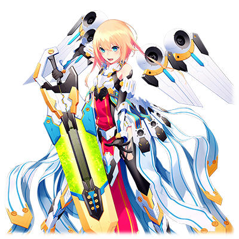

# MDA-01 天狼星

 

 
| 角色信息   |          |
| ----------- | ----------- |
| 名称    |MDA-01 天狼星   |
| 年龄   | 6225周期      |
|职业|“工厂”制防卫型BOT|
|对应曲|Paqqin|
|初出|Chunithm AIR|
|CV|川澄 綾子|

注：MDA为Metaverse世界观下负责抵御从涅墨西斯领域袭来的恶意程序化身的防卫型BOT。MDA系列的BOT命名都是以恒星中著名的一等星进行命名。MDA-01天狼星所对应的是大犬座的α星。

注2：不知为何，在AIR时期的角色故事文字里，Episode 1里人物的自称型号为KM-01【天狼星】。后来在STAR版本已经修复。本篇文章以修正后为基准。

## Episode 1 SPEC:天狼星
> 我是MDA-01【天狼星】。我的任务就是驱逐那些从涅墨西斯领域袭来的不明来源的程序化身。

我的名字是MDA-01【天狼星】。我是由“工厂”所制造出来的防卫型BOT程序。

我的任务就是驱逐那些从涅墨西斯领域袭来的不明来源的程序化身。

涅墨西斯……那是威胁着这个Metaverse的安危的黑暗世界。如果放任那些从那里产生的恶性程序化身大肆破坏的话，这个世界就会被它们所吞噬吧。

但是，为什么涅墨西斯要毁灭人类呢？

这些家伙究竟有多大的规模呢？

……关于这方面的问题也是重中之重，但是，我的任务则是别的东西。

在那些恶性程序化身之中，也有一些将魔爪伸向了人类的存在。为了守护他们，才产生了像我们这样的防卫程序。

## Episode 2 同伴之情

>虽然敌人都是些难缠的家伙，但是，我并不孤独，我的身后，是21位实力强大的伙伴啊！

和涅墨西斯的战斗是非常激烈的。今天，我也和我的同伴一同和持有着可怕的能力的恶性程序化身战斗着。战斗陷入了僵局。

“……天狼星！我和南河三(Procyon)负责绕道旁边夹击，你就继续从后面追着敌人！”

“不行啊！五车二(Capella)！这样会对城市造成损伤的！必须速战速决才行！”

我一口气加快了速度，直接冲向了恶性程序化身的方向。

“天狼星？！”

好像听到了同伴们的悲鸣。

对面的恶性程序化身也被突然冲到面前的白银骑士所吓到。我举起了手上的大剑，在一瞬间挥了过去。敌人的防御屏障被我一刀两断，数据组成的身体四散成了粉末。

靠着舍命的突击，天狼星的剑最终将敌人一刀两断，敌人散成了发光的粒子，彻底消失了。

“敌势力已击破。将转换为通常模式。”

通讯系统传递着敌人已被消灭的信息。

“好，大功告成！”

“天狼星！你没事吧？”

“……真是的。怎么每次都做这种铤而走险的事情。”

“咦——！这种程度没问题的啦！”

……虽然大家都是在担心我，不过总觉得大家是不是太过保护了啊？

不行，我必须变得更强，不再让大家担心才行！

## Episode 3 充满后悔和反省的过往

> 我必须变得更强……因为，以前在我面前有一名女孩子，而我却救不了她。即便到今天，那个画面仍然在我的脑海中未曾褪色。

是的……我有必须变强的理由。比谁都更强烈的愿望。我会如此希望变强，是有理由的。

曾经，有一次我们面临着大群的涅墨西斯程序化身攻击。虽然我和我的同伴们尽了全力……但是，我们大败而归。那个数据世界没能保住。

我伸手抓住了自己的耳朵。那里挂着一个耳环，正闪闪发亮着。

那个耳环，正是那个时候的战斗中，某个少女带在身上的东西。

那个少女向着我拼命地呼喊着寻求帮助，但是我的手却没有抓住她……就在差一步就抓住少女的时候，涅墨西斯的BUG彻底地吞噬了她……。

我虽然不知道少女的名字，但是，我无法忘记那个瞬间，少女脸上那充满绝望的表情。

“……我必须变强！必须变强！”

我握紧了耳环，望着远方。

不能忘记那个时候的不甘心，还有悲伤……。而且，为了不再产生像那名少女那样的悲剧，我必须继续战斗下去。

## Episode 4 步步逼近的破坏者

> 听说最近有个十分凶暴的程序化身在大闹。名字好像叫“休伯利斯”的样子。

今天，我也正在和恶性程序化身战斗着。

“就是这儿！竟然对着我空门大开啊！”

我看准时机将恶性程序化身一刀两断。旁边的同伴们不禁感慨到。

“啊哈……天狼星又是这样不要命地攻击啊。”

“嘛，最近天狼星的技术也在不断进步，这点也没啥吧。”

“是啊。”

“真的吗！？”

我听到南河三和五车二两名前辈的赞赏，不禁喜形于色。

“不过，你也不能大意啊。最近我们接到报告，有一体十分凶暴的程序化身在大肆破坏呢。”

“是怎样的家伙呢？”

“无法确认其本体。我们现在暂且称其为‘休伯利斯’。”

“休伯利斯……”

当我听到这个名字的时候，我的心中，有某个角落似乎感觉到了一股凶险的气息。

但是这个感觉太过微弱，我很快就忘到了脑后。

“……不管是多强大的敌人，我们都要打倒它！”

……那个时候的我，还相信着我们的力量，是无敌的。

