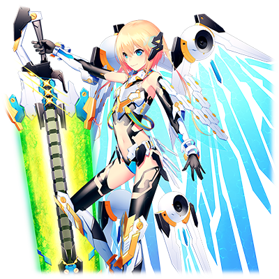

# MDA-01 天狼星

 

 
| 角色信息   |          |
| ----------- | ----------- |
| 名称    |MDA-01 天狼星   |
| 年龄   | 6225周期      |
|职业|“工厂”制防卫型BOT|
|对应曲|Paqqin|
|初出|Chunithm AIR|
|CV|川澄 綾子|

注：MDA为Metaverse世界观下负责抵御从涅墨西斯领域袭来的恶意程序化身的防卫型BOT。MDA系列的BOT命名都是以恒星中著名的一等星进行命名。MDA-01天狼星所对应的是大犬座的α星。

注2：不知为何，在AIR时期的角色故事文字里，Episode 1里人物的自称型号为KM-01【天狼星】。后来在STAR版本已经修复。本篇文章以修正后为基准。

## Episode 1 SPEC:天狼星
> 我是MDA-01【天狼星】。我的任务就是驱逐那些从涅墨西斯领域袭来的不明来源的程序化身。

我的名字是MDA-01【天狼星】。我是由“工厂”所制造出来的防卫型BOT程序。

我的任务就是驱逐那些从涅墨西斯领域袭来的不明来源的程序化身。

涅墨西斯……那是威胁着这个Metaverse的安危的黑暗世界。如果放任那些从那里产生的恶性程序化身大肆破坏的话，这个世界就会被它们所吞噬吧。

但是，为什么涅墨西斯要毁灭人类呢？

这些家伙究竟有多大的规模呢？

……关于这方面的问题也是重中之重，但是，我的任务则是别的东西。

在那些恶性程序化身之中，也有一些将魔爪伸向了人类的存在。为了守护他们，才产生了像我们这样的防卫程序。

## Episode 2 同伴之情

>虽然敌人都是些难缠的家伙，但是，我并不孤独，我的身后，是21位实力强大的伙伴啊！

和涅墨西斯的战斗是非常激烈的。今天，我也和我的同伴一同和持有着可怕的能力的恶性程序化身战斗着。战斗陷入了僵局。

“……天狼星！我和南河三(Procyon)负责绕道旁边夹击，你就继续从后面追着敌人！”

“不行啊！五车二(Capella)！这样会对城市造成损伤的！必须速战速决才行！”

我一口气加快了速度，直接冲向了恶性程序化身的方向。

“天狼星？！”

好像听到了同伴们的悲鸣。

对面的恶性程序化身也被突然冲到面前的白银骑士所吓到。我举起了手上的大剑，在一瞬间挥了过去。敌人的防御屏障被我一刀两断，数据组成的身体四散成了粉末。

靠着舍命的突击，天狼星的剑最终将敌人一刀两断，敌人散成了发光的粒子，彻底消失了。

“敌势力已击破。将转换为通常模式。”

通讯系统传递着敌人已被消灭的信息。

“好，大功告成！”

“天狼星！你没事吧？”

“……真是的。怎么每次都做这种铤而走险的事情。”

“咦——！这种程度没问题的啦！”

……虽然大家都是在担心我，不过总觉得大家是不是太过保护了啊？

不行，我必须变得更强，不再让大家担心才行！

## Episode 3 充满后悔和反省的过往

> 我必须变得更强……因为，以前在我面前有一名女孩子，而我却救不了她。即便到今天，那个画面仍然在我的脑海中未曾褪色。

是的……我有必须变强的理由。比谁都更强烈的愿望。我会如此希望变强，是有理由的。

曾经，有一次我们面临着大群的涅墨西斯程序化身攻击。虽然我和我的同伴们尽了全力……但是，我们大败而归。那个数据世界没能保住。

我伸手抓住了自己的耳朵。那里挂着一个耳环，正闪闪发亮着。

那个耳环，正是那个时候的战斗中，某个少女带在身上的东西。

那个少女向着我拼命地呼喊着寻求帮助，但是我的手却没有抓住她……就在差一步就抓住少女的时候，涅墨西斯的BUG彻底地吞噬了她……。

我虽然不知道少女的名字，但是，我无法忘记那个瞬间，少女脸上那充满绝望的表情。

“……我必须变强！必须变强！”

我握紧了耳环，望着远方。

不能忘记那个时候的不甘心，还有悲伤……。而且，为了不再产生像那名少女那样的悲剧，我必须继续战斗下去。

## Episode 4 步步逼近的破坏者

> 听说最近有个十分凶暴的程序化身在大闹。名字好像叫“休伯利斯”的样子。

今天，我也正在和恶性程序化身战斗着。

“就是这儿！竟然对着我空门大开啊！”

我看准时机将恶性程序化身一刀两断。旁边的同伴们不禁感慨到。

“啊哈……天狼星又是这样不要命地攻击啊。”

“嘛，最近天狼星的技术也在不断进步，这点也没啥吧。”

“是啊。”

“真的吗！？”

我听到南河三和五车二两名前辈的赞赏，不禁喜形于色。

“不过，你也不能大意啊。最近我们接到报告，有一体十分凶暴的程序化身在大肆破坏呢。”

“是怎样的家伙呢？”

“无法确认其本体。我们现在暂且称其为‘休伯利斯’。”

“休伯利斯……”

当我听到这个名字的时候，我的心中，有某个角落似乎感觉到了一股凶险的气息。

但是这个感觉太过微弱，我很快就忘到了脑后。

“……不管是多强大的敌人，我们都要打倒它！”

……那个时候的我，还相信着我们的力量，是无敌的。

## Episode 5 折断的剑，折断的心

>怎么可能……我迄今为止所锻炼的成果竟然不能伤到分毫……而且还轻易折断了我的大剑！

修伯利斯的破坏活动愈演愈烈，终于，上级下达了由我们驱逐的命令。

“对手很强……可不要轻敌了啊！”

就连久经沙场的五车二都变得如此认真，看来会是一场恶战。

是的……我们绝对不能掉以轻心……但现实还是比想象中的要残酷。

“呵呵呵……我本来以为能好好和‘工厂’的精锐们玩一下的，就这个水准吗？真扫兴……”

和修伯利斯的战斗，陷入了极其不利的状况中。

“……不行，必须回去重振旗鼓才行！全员撤退！”

“什么！？”

我无法接受五车二的命令。如果在这里放走修伯利斯的话，势必会带来更大的破坏。

“修伯利斯！绝对不能在这里放你走……看招！原力复生斩！！”

我用尽全身的力量挥舞着大剑向修伯利斯斩去……然而。

“……就这程度？”

“怎么会……我的剑……碎了！？”

象征着我的力量的大剑，在修伯利斯那散发着不详紫光的断头台下，被打成了碎片。

## Episode 6 败退

>……我的失误让战局陷入了不可挽回的状态。失去战斗能力的我，只能在同伴的掩护下撤离战场。

曾经宛如我自身的象征的大剑在我眼前被无情折断，我只能待在原地怅然若失。

“真是可怜……就这么送你上路吧！”

就在发出紫色光芒的断头台之剑直接向着我挥来的时候，我默默地闭上了眼睛。然而，预想中的冲击却没有到来。

当我睁开眼睛，看到的却是在我面前挡住攻击的南河三。

“南河三！？这是在掩护我吗？！”

“不要管我！快走！！”

“但是……”

看着仍在原地犹豫不决的我，修伯利斯再次摆好了架势。

“……你们的友情还真是美妙啊。想必把它毁掉也会很漂亮吧。”

“有种就来试试看啊……？”

“五车二！”

“你先撤吧，天狼星！没有武器的你是无法战斗的！”

是啊。现在手无寸铁的我只会在这里拖累大家……不能因为一时的感情误事。

“……我知道了。那么我就先撤退了。不过，两人可都要活着回来啊！”

我背对着同伴们，只能狼狈地脱离了战场。

## Episode 7 惨败与悔恨

> 修伯利斯一战让我们失去了五位战友……结果我又一次失去了重要的东西。

……最终，修伯利斯一战让我们丧失了五名战友。

掩护我撤退的南河三也没有回来。

在这之后，修伯利斯仍在持续着破坏活动，我们这边则没有一丝方法阻止她。

（……迄今为止，我究竟干了什么呢？本来以为自己已经变强了，但事实是我依旧没法保护我最重要的东西……。不仅如此，我还拖了同伴们的后腿……）

（……说不定，我再怎么努力也是无济于事的。就这样被删除掉是不是更好呢……）

就在这么想的时候，耳朵上的耳环掉了下来，掉到了我的手里。

“这是……”

闪闪发亮的耳环似乎在向我诉说着什么。

看着耳环，我想起了某件事。

“……对啊。我还有不得不去做的事情。我曾经向那孩子发誓过，不能再度放弃，必须变得比任何人都强……”

就算失去了重要的伙伴……我也必须连他们的份一起变得更强！如果不这么做的话，就对不起拼上性命也要保护我的他们了啊！

我握紧了耳环，站了起来。

## Episode 8 一以贯之的信念与决意

>我决定了，我要使用那些同伴们的数据进行升级。这次，我一定要保护好！

“……求你了！帮我升级吧！”

面对我突如其来的要求，“工厂”的研究者们惊讶的合不拢嘴。

“可是……就算你说要升级……可是像你这样的型号并没有能够提升的手段啊？”

“不。我听说在和修伯利斯的战斗中那些逝去的同伴们的数据和组成材料已经被回收了。如果是同样型号的我，应该能够用来提升自己吧！”

“不过……天狼星，按现行的设计思路的话，想要赢修伯利斯还是未免……”

“……其实不是毫无希望的。修伯利斯的攻击力确实很强……。不过与之相对的，防御力有所不足。所以，只要舍弃防御的机能，彻底集中于攻击和机动力的话，应该就能打倒修伯利斯了了。”

我的提议令研究者们陷入了骚动。

“……理论上是这样的。不过……这也只是能够成功的情况。要是这次改造失败了的话，我们可不知道你会变成什么样哦？”

“……我已经做好了觉悟。求你们了。就让我完成我应尽的事情……请帮我升级吧！”

## Episode 9 再度现身的破坏使者

>升级成功的我收到了修伯利斯再度出现的情报。这次绝对不会输了。

这次升级改造颠覆以往的思路，是需要将我的组成数据拆解成碎片再进行重构的大工程。

随着我的身体被慢慢地拆解，我感受到了一阵阵锥心刺骨的疼痛。

“意识等级低下……天狼星，果然像这样超常规的改造还是不可能的啊……立刻中止改造吧……”

“没关系……我还能继续……下去……！”

即便遭受再大的痛苦，我也没有屈服。

（……因为，这次我一定要保护好！我不能让大家的努力白费！所以，请大家助我一臂之力吧！！）

“天狼星，意识等级上升！重构进度正在加速！！”

我感受到了构成身体的东西正在慢慢地重新聚起来，等到我重新睁开眼睛，我注意到了自己崭新的身体正寄宿着强大的力量。

 

“心理模块正常启动……扫描中……扫描完毕。”

“MDA-01 天狼星，升级完成！”

那些牺牲的伙伴没有消失。她们就在我的心中，在我的身体里，和我一起战斗。

就在这时，“工厂”响起了警报声。

“涅墨西斯敌人·修伯利斯已出现！位置是……”

“来了啊！立即出发！”

一决胜负吧，修伯利斯！将这一切的恩怨了结！

我以最快的速度奔向了战场。

## Episode 10 谜之既视感与对峙

>修伯利斯现身的这个世界……总觉得在哪里见过的样子……不好，必须集中在战斗上。

当我到达修伯利斯现身的世界的时候，我有种奇妙的感觉。

（这里……和曾经那名少女所在的世界很相像！）

就像是被什么呼唤着，我奔向了海边。

“真是漂亮的夕阳呢。就像是世界终结之前拼尽全力为这个世界做点缀的灯火一般……”

“修伯利斯……”

修伯利斯转头望向我，露出了带着些许慈爱的微笑。

“已经损坏过一次的人偶，又能伤到我多少呢？也罢……既然都到这里了也无需多言……”

“为了那些牺牲的同伴，我要在这里打倒你！”

天空被夕阳染成了一片血红，战斗就此打响。

“哈哈哈！不错啊！现在的你还有点意思啊！就让我看看你能不能让我享受一把吧！”

“绝对……不会输给你……我绝对不会枉费我的同伴们的心意！”

修伯利斯的凶狠攻击擦身而过，在我的身上留下了几道伤疤，但现在不是打退堂鼓的时候。

……无论如何，我都必须在这里阻止修伯利斯！

“就是现在！就靠这一击！！命中吧————！”

我用尽全力的一击彻底粉碎了修伯利斯的剑，然后直接对她构成核心的数据造成了致命伤。

## Episode 11 为所有人奉上的祈愿

>修伯利斯被我打败了。难道说……她就是……？……现在还是为那些在战场逝去的人们祈祷吧。

“啊哈……挺厉害的嘛……没想到我就这样被打倒了。最后的这场战斗……我玩的很开心哦……”

在掺杂着噪音的声音中，修伯利斯露出了笑容。身体渐渐变为发光的粒子，融化在夕阳的光芒中。

在最后只剩下一块碎片的瞬间……修伯利斯露出了和迄今为止完全不同的笑容向我说到。

“谢……谢……你……天使……大人……我终于……可以……到……妈妈……所在的……地方…………了……”

“……咦？”

当我正想向她询问这句话的含义的时候，修伯利斯就彻底消散了。

不知道是不是战斗太过激烈，就连我的耳环也不知不觉碎掉了。

“……修伯利斯，身为从涅墨西斯而来的破坏者，你究竟是什么人……难道说……她就是……？”

回过神来，夕阳已经沉入海面，天空中已经是繁星点点了。我望着夜空中最亮的星默默祈祷着。

“希望在这场战斗中逝去的人们，都能安息……”

就像呼应着我的祈祷般，星星默默地闪耀着。

