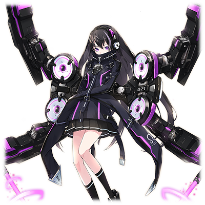

# MDA-21 轩辕十四

 

 
| 角色信息   |          |
| ----------- | ----------- |
| 名称    |MDA-21 轩辕十四   |
| 年龄   | 5550周期      |
|职业|“工厂”制防卫型BOT|
|对应曲|Supersonic Generation|
|初出|Chunithm AIRPLUS|
|CV|浅仓杏美|

## Episode 1 SPEC:轩辕十四

>我，我的名字是MDA-21 轩辕十四！虽然我只是个刚刚加入的新人防御程序……不过……我会努力的！

我的名字是MDA-21【轩辕十四】。姑且……算是“工厂”制造的防卫型BOT程序吧。

为什么要加上个“姑且”呢，那是因为……我迄今为止都还没有实战经验。

我在队里也是地位最低的存在。弱到连我自己都想同情自己了……。

虽然想像那些前辈们那样“啪！”地一下就能把恶性病毒干掉，成为可靠而帅气的防卫程序的……但现实并没有那么顺利……。

例如最近的某次模拟训练，我本来是想放出电磁光束的，但却在慌乱之中把身上的了外甲全部爆开了……。

呜呜呜……那次事故想想就丢人啊……

要是地上有个洞的话……不，我还是自己挖个洞把自己埋了比较好吧……

不仅如此，我也不像前辈们那样“今天也要把涅墨西斯打爆哦——！”这样有干劲……这样下去真的好吗？唉……

## Episode 2 梦与希望

>明天终于要我正式出战和涅墨西斯的恶性程序化身战斗了……呜呜呜，完全没有信心……

那天……我去了一趟海边。那里有一个女人正等着我。在夕阳的照耀下，她的样子虽然看不太清楚……但是，我和她有着……什么关系……。

然后，我醒了过来。看来，我又梦见了那个梦。虽然仍未明白梦的内容，我却感受到了一股怀念和悲伤的感觉，有的时候甚至醒来的时候眼中都是泪水。

虽然在梦中我去了一趟海边，但是对于仍然是半吊子的我来说，离开“工厂”是不太可能的事情。更不用说去海边了。

（这个梦到底是什么意义呢……？）

正在我发呆的时候，时钟上显示的时间让我不禁跳了起来。

“不好！明明今天就是初次出击的日子就要这么迟到了~”

我赶忙整理了一下便奔向了实验室。

“迟到了哦！轩辕十四！”

“不、不好意思~！”

在被研究员们骂了一通之后，我就和平时一样带上了拘束器具。因为我还是半吊子的新人，所以还没法稳定控制自己的力量。所以还是需要限制器防止出现损害的。

“……毕竟，今天是你第一次上场战斗，对面也不是什么强敌。跟着训练的感觉来就行了。”

“好，好呜！”

不小心咬到了舌头。研究员们看到这样的我露出了苦笑。

（呜呜呜……我这样的状态真的能战斗吗……完全没有信心啊……）

## Episode 3 希望和同伴

>啊哇哇哇……果然，我还是不行啊……要是没有天狼星前辈帮忙的话，还不知道会变成什么样呢……

就这样，我和前辈们一起和来自涅墨西斯领域的恶性病毒展开了战斗。

（我必须认真一点……我必须认真一点……）

就在战斗即将开始的时候，我的肩膀突然被什么东西拍了一下。

“呀啊啊啊啊啊——！？敌、是敌人吗！？”

“轩辕十四，你冷静一点。”

“啊哇哇哇哇……是天狼星前辈！”

天狼星前辈是在我们防卫程序中数一数二的王牌队员，是大家憧憬的对象。

而我也是其中一员……

“……你没事吧？今天的敌人没那么强的，放平心态上吧！”

“是的！”

“……哈。也好。那么！战斗开始！”

总之战斗就这样打响了。确实和天狼星前辈说的那样只是一些弱小的病毒而已。

不过……我实在是太紧张了，完全无法正常战斗。

“啊哇哇哇哇哇……！”

就在病毒的攻击即将碰到我的咽喉的时候，天狼星前辈的大剑将眼前的敌人一刀两断。

“天、天狼星前辈！”

“放心吧。你的后背由我保护着……你就尽情战斗吧！”

“好！”

天狼星前辈这么鼓励着我，再次奔向了前线。

（果然天狼星前辈好帅气啊……）

在战场中如入无人之境的天狼星前辈就像是一道光，在敌群中穿梭着。

（与之相对的……我也太不上心了啊……）

## Episode 4 同伴和秘密

>我的首秀简直就是一团糟。再这样下去就会成为前辈们的累赘了……。难道我就没有什么靠谱的能力吗？

……本来值得纪念的初次战斗最后弄得一团糟。

“轩辕十四，不要放在心上啦。大家最初不都是这么过来的吗！”

“是啊！天狼星曾经也是连武器都拿不稳就直接冲进敌人堆里，把自己弄得鼻青脸肿的呢！”

“喂！角宿一！这个话题就别再提了吧！”

虽然前辈们都安慰着我，以积极的态度向我搭话，但我却始终高兴不起来。

认识到自己的无力，只能一个人关在实验室里研究着自己的身体。

我一直在想，是不是因为什么特别的原因，我才无法完全掌握自己的身体状态。

（说不定只要我仔细检查一下的话，就能够找到有助于战斗的东西？）

在仔细检查了之后，我发现了几个锁定的机能。于是我一个一个将其解锁。

“这个是……‘能够熟练训狗的机能’？……应该和战斗没什么关系吧？”

虽然大多数上锁的机能都是些排不上用场的垃圾技能，不过我还是发现了某个被巧妙地隐藏起来的机能。

在经过解析之后，虽然大部份的内容都是黑盒子化，无法解析，但是这个“ZTX2-EXECUTION”似乎还可以一用。

“……好！这样我应该也能够为大家尽一份力了吧！”

我毫不犹豫地将这个系统安装了上去。

## Episode 5 秘密与疯狂

>在我将隐藏的系统安装进去之后，我在模拟战中失去了意识。等我醒来之后……

那天晚上，我又做了梦。

那并不是一如既往的前往海边的梦境。那是个充满破坏的景象的噩梦。

我在梦中破坏着各种各样的东西。受害者可能是年幼的少年，也可能是可爱的动物。我不停地攻击着这些东西，一直攻击到它们再也动不了，彻底不成样子为止。

而在旁边已经裂成碎片的玻璃窗上映着我的脸庞。玻璃窗中的我……却露出了笑容。露出了由衷的笑容。

“不要啊啊啊啊……！”

“……十四……轩辕十四！！你没事吧！”

“天狼星……前辈？为什么会在我的屋子里？”

“今天是你参加模拟战的日子对吧？我本来是来向你加油打气的……结果我在门口就听到了你的惨叫。”

“是吗……谢谢……”

“要不要今天请假维护一下？”

“没，没事的！我真的没事的！”

我为了不让天狼星前辈继续担心，努力挤出了个笑脸。

我和原定的那样前往了模拟战的场地。在那里等着的，是角宿一前辈。

“不必留情，你就放马过来吧！”

“是……是的！请多指教！”

机会难得。我毫不犹豫地启动了安装好的新系统。

“ZTX2-EXECUTION启动……倒计时……3、2、1……”

在倒计时结束，系统启动的瞬间……我的眼前变得一片漆黑。

等我再度恢复意识的时候……角宿一前辈已经是被伤到中破，背部正着火的样子了。

## Episode 6 疯狂与噩梦

>模拟战的时候把前辈打伤的我……并不是我自己的意志啊！我究竟体内藏着什么样的东西啊？！

我看到眼前中破的角宿一前辈的时候，只是呆呆地站在那里。之后我才注意到，我正被天狼星前辈从背后架着双臂。

“前……前辈，这究竟是怎么一回事？”

“我们这边才想问呢！轩辕十四！你究竟是怎么使出那样的攻击打伤角宿一的！？”

“咦……？”

角宿一前辈再怎么说也是身经百战的前辈。像我这样的半吊子怎么可能打伤她呢。

不……就算我有那个实力，我也不可能将自己的同伴伤到这么严重的地步。

这绝不可能……。

（现在……我的心跳正在不断加速……难道说……我在为之欢喜吗？现在的我，正享受着这个状况吗？）

我的身体，似乎正沉浸在破坏着对手的喜悦之中，止不住地颤抖着。

双手伸向了我的脸，这时候，我才发现我的嘴已经咧开来，我，正在笑着，面对这个现状露出了笑容。

“不要啊啊啊啊啊啊啊啊啊——！！”

……在这之后，我被送到了调整室，经由研究者们的诊断，我才认识到一件事。

实际上，我是由某个恶性病毒的残渣为基础制造出来的实验型防卫程序。

（……虽然我确实听说过我的前身是特化的攻击型实验程序，但，我从没想过居然残暴到会失去自我，那么残暴地发动攻击啊！）

我为自己内心潜藏着这样的一只恶魔而感到恐惧，不禁哭了出来。

（到底潜藏在我体内的是什么怪物！？我究竟会变成怎样！？）

## Episode 7 噩梦与真实
>我……原来是由病毒制造出来的程序吗？像这样的我，真的有资格战斗吗？天狼星前辈……我好怕……

在那场战斗之后，周围的人看我的目光都发生了变化。甚至有些人已经开始对我产生了戒心。

想想这也是难免的。无法控制自己力量的程序，就和普通的BUG没有区别。

……而直到最后，我也未能知道真相。据说当时用于制造我的恶性病毒，当时被“工厂”视为一大威胁，而对那个病毒的厌恶，现在发泄到了我的身上。

虽然当事人角宿一和天狼星两名前辈都说了“没事的不要在意”……但我还是禁不住对自己产生了厌恶。

（……像这样的我，真的有资格作为防卫程序活在世上吗？干脆，直接把自己删除了比较好吧……）

就在我这么苦恼着的某一天……“工厂”响起了敌袭警报。似乎涅墨西斯领域派出了恶性程序化身进行着广范围的袭击。

“……轩辕十四，这次行动你也必须参加。”

“为什么！？我……我不行的啦！”

“轩辕十四……现在角宿一还不能出击……我们的战力紧缺，你明白吧？”

“……是的。”

“没关系，不管轩辕十四遇上什么事情，我都会保护你的。”

“天狼星前辈……”

天狼星前辈只是温柔地抱着我的肩膀。即便我无法信任自己，天狼星前辈还是给了我最大程度的信任。我抱着这样的决心，前往了战场。

## Episode 8 真实与混沌
> 果然……我只要一到战场，我就会被并不属于我的，某个人的意识占领……然后向天狼星前辈伸出魔爪！

和恶性程序化身的战斗，一开始还很顺利。但是，等到我看见那些从涅墨西斯领域前来的恶性程序化身的时候……我的心底里就涌现出一股强烈的“破坏冲动”。

“呵呵呵呵……啊哈哈哈哈哈哈！！”

我一刀斩断了涅墨西斯的使者，之后便开始破坏起那些支援我方的“工厂”制小型无人兵器。

“轩辕十四！快停下来！轩辕十四！”

“啊哈哈哈哈——！像这样痛快的事情，我怎么可能停下来啊——！！前辈哟哦哦哦！！”

“可恶……没办法了。只能用直接接触的方法将她的程序超载从而制止行动了……为了这么做，就必须找到机会近身！”

天狼星前辈向我鲁莽地冲了过来。

“啊哈哈哈——！前辈……就让我把你破坏到变成程序的粒子为止吧——！呐——！！”

“咕！？”

我举起电磁军刀直接斩向了天狼星前辈的侧腹。但，与此同时，天狼星的手也和我的身体直接接触，进行了直连操作。

瞬间……我的眼前一片惨白，回路瞬间短路。

“嗯嗯……我，我究竟是？”

“太好了……轩辕十四，终于恢复原状了啊……”

前辈虚弱地向我露出了个笑容。之后便无力地倒了下去。前辈的身体已经被破坏掉了大半。

“天狼星前辈……不要啊啊啊啊！”

我终于意识到自己做了什么事情，发出了惨叫。

## Episode 9 混沌与纠结

