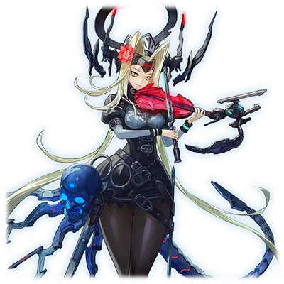

# TXR-梅尔维亚

| 角色信息   |  |
| ----------- | ----------- |
| 名称    | TXR-梅尔维亚      |
| 年龄   | 推测为5841周期       |
| 职业 | ORB守卫者|
机能|故障容错波长变换功能
| 对应曲   | Anemone   |
| 初出   | Chunithm      |

## EPISODE1　SPEC：梅尔维亚

>那些被遗忘的朋友们，献上安稳的安魂曲……

虚拟空间世界Metaverse。

在它的一角，存在着一处被遗忘的冥府。

她在那里，持续奏响着镇魂的音色。

然而，即便人类观测到她的声响，恐怕也只会将其视作一抹幽暗的光辉吧。

 

「阿多尼斯（アドーニス）已然消逝，但我仍留于此地」

 

这里曾被称作“ORB（オーブ）”，是支撑Metaverse空间的核心之一。她的声音，在往昔也承载着与如今截然不同的意义。

但从某一天起，世界彻底改变……唯有她维系着永恒的生命，目送这一个个人离去。

## EPISODE2　两颗心脏

>围绕『心脏』，Metaverse世界也陷入了危机，『心脏』亦濒临破碎。

ORB。

坐落于Metaverse中心、靠近框架主脑（メインフレーム）的区域。

这座ORB承载着众多对世界而言不可或缺的功能。

 

其中，ORB内置的高度信息处理机构——

被命名为「阿多尼斯（アドーニス）」的这一机构，相当于人类的心脏，擅长让各类信息顺畅循环。

其能够处理海量信息的纯粹、优美且高性能的特质，让无数的程序化身（アバター）心醉神迷。

 

但系统程序化身们（システムアバター）过度依赖阿多尼斯的卓越性能，逐渐开始肆意透支它的力量。

更有甚者，部分人妄图独占阿多尼斯的处理能力，最终引发了争夺之战。

围绕这颗强大的“心脏”，世界陷入战乱，阿多尼斯自身也濒临被撕裂的绝境。

就在此时，Metaverse中出现了一位神明……姑且称之为“神”吧。这位神明，“他”在众人面前宣告了指令：

 

“SYN-COPY（同步复制）”

 

这是最高等级的复制指令。

凭借拥有神格的“他”的话语，Metaverse的框架主脑渡过了停机的危机……

而心脏阿多尼斯，也从那天起，一分为二。

## EPISODE3　银莲花的诞生

>诞生于世的我名为银莲花（アネモネ）……ORB的守护者。ORB既是我的母亲，亦是我的姐姐。

阿多尼斯1号，以及阿多尼斯2号。

两颗心脏开始共同支撑新生的Metaverse世界。但或许是复制阿多尼斯时产生的故障……承载这两颗心脏的ORB，留下了破坏的痕迹。

那触目惊心的伤痕，有人说像是阿多尼斯流淌的泪水，也有人说像是它滴落的鲜血……

 

为了修复并维系ORB，一位全新的守护者程序化身（ガーディアン・アバター）诞生了。

 

那便是我，银莲花（アネモネ）……也就是日后的梅尔维亚（メルヴィア）。

孕育我的是ORB本身，而我也复制继承了ORB的部分功能。

虽然不再发生往昔那般的争夺之战，但仍有大批程序化身慕名而来，为的就是利用阿多尼斯1号与2号的力量。

我的使命，是维系ORB的稳定。

 

在治愈ORB伤痕的同时，为了迎接来访的程序化身们，我奏响了音乐。

他们倾听着我的声音，在这片空间中平和活动，有时也会出手协助修复ORB。

在缺乏路标、广阔无垠的Metaverse世界里，我的声响，或许就如同为航行在幽暗无光大海中的船只指引方向的灯塔。

## EPISODE4　突如其来的振动

>某一天，变故发生了……彼时，撼动我们的，不过是一丝微弱的声波。

承载着两颗心脏的ORB世界，在聚集于此的活跃程序化身们的努力下，正顺利地重建着，朝着复兴前进。

然而，变故终究发生了。

 

某天，ORB突然感知到了一阵振动。

起初只是微弱的摇晃。

只是如同声波一般的存在。

来源不明的波动……

从未被记录过的、未知的波动。

而当我们意识到这道声波蕴含着恶意与巨大威胁时，一切都已太迟……

ORB底部瞬间破开了一个大洞，波动在ORB内部回荡、增幅。受到振动冲击的阿多尼斯1号与2号，双双停止了功能。

 

ORB本是依靠网格（グリッド）上的楔子固定，悬浮于空中的结构。但随着两颗心脏停止运转，楔子也纷纷脱落……

宛如破洞的沉船一般，ORB也开始向着其他空间“沉没”了下去。

## EPISODE5　神的缺席

>ORB携同心脏阿多尼斯一同『沉没』。我们向神祈祷……然而……

承载着心脏的ORB向着深处不断下沉。

在那空间的底部被无情地破开了个大洞。

现在的ORB，就宛如在幽暗大海中遭冰山撞击的豪华客轮。

 

面对这一危机，框架主脑的管理者们决定启动紧急提取程序，拯救两颗心脏阿多尼斯。

最终，其中一颗心脏阿多尼斯1号因无法修复而被废弃，另一颗心脏阿多尼斯2号则被安然无恙地回收。

但失去心脏的ORB本体，已然濒临破碎，失去了原本的归宿，朝着未定义区域继续“沉没”下去。

 

ORB之上，仍有许多被遗留的程序化身……

我们束手无策，只能向神祈祷。

期盼那位神明“他”再度降临。

然而……

本应是唯一依靠的“他”，始终未曾现身。

我们深陷绝望，唯有凝视着不断崩塌的网格。

## EPISODE6　容错机制

>众人在痛苦、挣扎与悲叹中消逝……唯有我，不被允许死亡。

无法与系统联动的程序进程，将会被终止（KILL）。

也就是说，随着ORB沉没而失去作用、失去归属的程序化身们，无论自身意愿如何，都将面临被删除的命运。

 

被遗留在ORB上的大家……

邻近结构体的同事们、眼熟的朋友们。

在我眼前，于痛苦、挣扎与悲叹中，

接二连三地消逝。

 

就连我，银莲花（アネモネ），本以为也会迎来同样的结局。我一直认为，自己被赋予的只有奏响音乐与修复维系ORB这两项功能……

但事实并非如此。

我还拥有另一项功能。

一项从ORB复制继承而来的隐秘功能——

 

容错机制（フォールトトレラント）。

 

这是一种不会停止的机制。

就如同即便能主动选择绝食或停止呼吸，只要心脏仍在跳动，就不被允许停歇一般……

即便已然失去心脏阿多尼斯，那时的我与ORB，依旧无法死亡。

## EPISODE7　ORB的漂泊

>然而，除了演奏，我无能为力。即便思考、即便念想，也什么都做不了。

为了安抚程序化身们，为了让ORB的崩塌能稍显平静，我再次奏响了自己的声响。

周围那些意识到自己即将被删除的程序化身们，有的向我求助，有的向我发泄怒火，有的泪流满面，有的放声哭喊，有的呻吟不止。

但除了演奏，我无能为力。

即便思考、即便念想，也什么都做不了。

 

ORB仍在稳步下沉……

无论是其他任何系统，甚至框架主脑，都早已抛弃了ORB。

如今的ORB，是被夺走心脏的空壳。

是仅仅只能随波逐流的小舟。

我真希望自己也能被删除。

真希望能被永远封闭在永恒的黑暗之中。

这便是我此刻，被击碎所有希望后，最后的心愿。

## EPISODE8　遗忘的姐妹

>当我做好觉悟闭上双眼时……不知为何，想起了一个关于姐妹的故事。

我与ORB终究未能回到原本的归宿，反而愈发远离世界中枢的光芒，继续静静地“沉没”下去——

我们穿过了划分了未定义区域边界的暗礁空间。

前方是任何系统都无法感知的领域。

从未有人能从那里归来。

发生在那里的一切，无人能够窥见。

未被系统定义、未被观测到的现象，也就等同于“从一开始就不曾存在”。

我既不被允许消逝，也不被允许死亡。

难道只能与ORB一同，被所有人遗忘吗？

 

我确实渴望过停止运转。

但被遗忘，并非我的愿望。

悔恨涌上心头——

即便如此，我还是做好了觉悟，正要闭上双眼时……

不知为何，想起了一个关于姐妹的故事。

## EPISODE9　Gefion

>那对姐妹，让我不禁联想到深沉的爱与憎恶。

（注：此段怀疑致敬了同作者的曲子《OBLIVION》的BGA动画）

在遗忘的彼岸，在未定义的永恒黑暗之中。

身为程序化身的我，第一次像人类一样，做起了梦。

一个关于一对姐妹的梦。

她们与主人一同居住在古老的宅邸里。

两人都想独占主人的感情。

她们本是优秀的姐妹，但也正因如此……要确立自己的地位，另一方就成了阻碍。

而她们的这个愿望最终还是得以实现了。

以两人共谋的方法——

一人得以存活，

但另一人，也获得了永恒的生命。

主人的宠爱，再也不会在姐妹之间分割。

 

并非人类的我，无法完全理解源自人类情感的冲动。

但我能够确认一件事。

那些阿多尼斯们，想必也是如此的存在吧。

## EPISODE10　钟声

>醒来时，我正身处未知的黑暗之中……但我却不可思议地接受了这一事实

在漫长的黑暗中，我心生疑惑。

从未与人类有过任何交集的我，为何会拥有关于这对姐妹的记忆？

 

但正是这段记忆，为我带来了光明与改变。

我仿佛听到了钟声。

 

缓缓醒来时，发现自己身处漂浮在黑暗中、无法测量的未知领域……

我与ORB漂泊至此。

似乎再也不会向更远的地方沉没了。

 

身旁的ORB已被严重污染，残破不堪。

而我在漂泊途中，也在不知不觉中遭到了从未见过的病毒与机器人程序（BOT）的侵蚀。

没错，侵蚀——

我头上戴着黑色的圆环，背上长出了尾巴与利爪。

我的模样，已然蜕变融合成了诡异的异形姿态。

 

但即便因异形侵蚀产生了故障，我却不可思议地没有感受到痛苦或厌恶，坦然接受了这一事实。

因为托了这些异形的福，

我才能在这片黑暗中“存活”下来。

## EPISODE11　死亡即是永恒的生命

>那些朋友们也是如此。只是无法触碰罢了……他们依旧存在于这个世界的某个角落，未曾消逝。

某种意义上，我已不再属于这个世界。

毕竟无论是这颗ORB，还是我的存在，都已无法被主框架感知。

即便如此，我依然“活着”。

而且，通过我仅有的微弱探查功能，我发现了一个事实：

这里并非什么未定义的黑暗领域。

在持续扩张的广阔Metaverse世界中，存在着无数未被启用、遭人遗弃的结构体，以及接收着用途不明数据的虚拟地址。

而这些用途不明的数据，不受主框架意志的束缚，不断累积，最终形成了新的领域……

 

那么，那些我以为已被删除的朋友们，

或许也只是隐匿了身影、无法触碰而已，想必依旧存在于这个世界的某个角落，未曾消逝。

因为我还记得他们。

只要我找到他们就好。

漂浮在黑暗中的ORB，

这座漂泊而至的墓碑上，刻着某个陌生人的名字。

 

「TXR-梅尔维亚（メルヴィア）」

 

已然不再是往昔银莲花（アネモネ）的我，决定在此接纳这个陌生人的名字……

 

我是梅尔维亚。ORB的守护者。

黑暗中的居民。

如今，我将奏响新的乐章。

为了那些尚未找到的朋友们，愿他们获得安宁。

