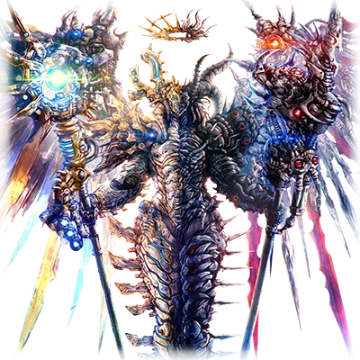
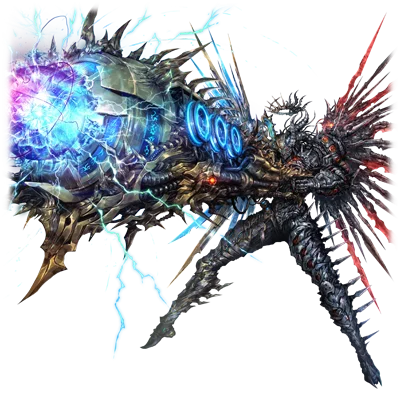

# 格兰雷斯

| 角色信息   |  |
| ----------- | ----------- |
| 名称    | 格兰雷斯     |
| 年龄   | UNKNOWN       |
| 职业 |  行星移民船兼传说巨神兵器
| 对应曲   | 業 -善なる神とこの世の悪について- |
| 初出   | Chunithm STARPLUS     |

（注：全文大篇幅致敬了《传说巨神伊甸安》。）

（注2：剧情中的两名“最古”布利斯利希德（ブリスリヒテ，ブリス(bliss)=幸福（吉），リヒテ=德语的“光”）以及霍尔伯格（ホルベルグ，ホル(hole)→对应英语的洞穴，即“穴”，ベルグ(Berg)→对应德语的“山”）其单词语源各自对应了光吉猛修和穴山大辅二人的姓氏。）

（注3：后文出现的獲夷智（えいち，对应字母H的发音）以及師機・緋櫓（しき・ひろ，即“Hiro氏”的倒装）分别在恶搞世嘉的音频制作团队[H.]以及Hiro这位作曲家）

## Episode 1 SPEC:格兰雷斯

>格兰雷斯。那是承载着人类的未来，前往宇宙的飞船。那是由“最古”之手所驱动的，人工的传说巨神。 

人类的摇篮，电子的乐园，Metaverse。  
之所以要建造这个人工的乐园，是有理由的。  

资源枯竭，大地与天空皆被污染。   
要让这片荒废的大地恢复，需要数万以上的周期。  
对于人来说，地上已经不再是适合他们生存的地方了。  

为了从地球的污染中保护人类这一种群，Metaverse考虑了两种方案。   

其一，就是人与机械间的共生。   

通过人工创造的神明·艾克雷尔，让人类移居至电子的乐园Metaverse之中即可。  

移居工作取得了成功，而负责地上的再生与创造的奥米茄·昆提斯成功地将地上的一切净化的一干二净。  
然而，奥米茄·昆提斯似乎过于遵循自身的使命，结果导致净化工作规模过大，产生了新的问题。  

“——这样的话，说不定无法顺利让地表重获新生。”  

在神祖艾克雷尔逝去后，  
统治着Metaverse的十二位被称为“最古（Origin）”的程序，  
针对这一危机决定尝试第二种方案。  

第二种方案……  
即在宇宙中为人类寻找新的栖身之所。  

他们从最古之中选中了【净化者·布利斯利希德】与【征服者·霍尔伯格】两位，作为宇宙移民计划的领袖。    
二人迅速推进了超大型行星移民船【格兰雷斯】的研发。    
这艘格兰雷斯以布利斯利希德与霍尔伯格二人作为核心驱动者，同时，它也是一件兵器。  
其庞然之姿，堪称名副其实的【巨神】。  

在这尊巨神格兰雷斯内部，被嵌入了某项数据——  
那是先前大战后回收的提亚马特的组织数据。  
提亚马特是现世人类所创造的破坏之神，即便是最古也存在许多无法解析的部分。  
即便如此，布利斯利希德与霍尔伯格仍认为，提亚马特所持有的兵器【究极涡流】肯定会在这场可能遭遇未知威胁的宇宙之旅中派上用场，于是，他们决定将这位破坏之神的羽翼组织植入格兰雷斯之中。 

## Episode 2 SPACE RUNAWAY

>格兰雷斯虽然平安无事地启动了，但是却因为谜之暴走，将一颗行星破坏掉了！？

（注：标题恶搞了《传说巨神伊甸安》的片头曲中的歌词——“SPACE RUNAWAY IDEON”。其中的剧情也是模仿了发射伊甸炮的桥段。）

布利斯利希德与霍尔伯格最终选择了一颗无人行星，作为格兰雷斯的启动地点。

“这颗星球虽然不适合人类居住，但正因为它空旷无边，就算乱来也绰绰有余啊！”  

面对热血冲动、乐观积极的布利斯利希德的发言，冷静的霍尔伯格带着叹息回应：

“……如果可以的话，请别乱来。要是试航时突然故障什么的，可不是闹着玩的。”

“我知道啦！”

随后，两位启动了格兰雷斯的试航程序。  
起初，格兰雷斯的行动完全符合他们的预期，顺利地在无人行星上展开探索。  
标配的光束军刀也毫无问题，其锋利程度足以让布利斯利希德和霍尔伯格确信这样的性能足以面对宇宙中各种各样的威胁了。    

……然而。

"……喂，霍尔伯格。驾驶舱中央的这个计量表到底是什么？"   
"那个……据说连负责开发的程序也不清楚。"  
"据说是移植提亚马特组织时，自行生成的……"  
"唔……Ν（Nu）Ε（Epsilon）Μ（Mu）Ε（Epsilon）Σ（Sigma）Ι（Iota）Σ（Sigma）……像是叠加在一起的符号啊……"  
"太长了！干脆叫它『<ruby>复仇女神计量表<rp>（</rp><rt>NEMEΣIΣ Gauge</rt><rp>）</rp></ruby>』吧！"  
"这也太随便了……"   

（此处恶搞的计量表对应了《传说巨神伊甸安》中搭载于伊甸安的伊甸计量表）

就在两人交谈之际，驾驶舱内突然响起了紧急警报。

"怎、怎么了！？"    
"快、快看！复仇女神计量表——！"   

计量表开始不受控制地上升。与此同时，格兰雷斯脱离了布利斯利希德与霍尔伯格的操控，陷入暴走状态。   

"可恶！到底怎么回事！？"   
"不、不好了！再这样下去……！"   

暴走的格兰雷斯突破临界点，发动了终极武器。   
那让人足以回想起昔日提亚马特的“<ruby>究极涡流<rp>（</rp><rt>アルテマヴォルテックス</rt><rp>）</rp></ruby>”的毁灭光束，撕裂了大地，将整颗行星摧毁殆尽。  

面对这压倒性的力量，布利斯利希德与霍尔伯格一时失语。

"怎么会……居然无视我们的控制，擅自启动这种兵器……"

霍尔伯格凝视着化为废墟的行星，脸色苍白。布利斯利希德拍了拍他的肩膀，试图鼓舞他：
"别担心啦！只是巧合吧？不如说反而显得这东西更可加可靠了啊！格兰雷斯的兵器威力，可是超出了我们的想象啊！"  
"话是这么说……但这已经远超想象，甚至堪称恐怖了……"  
"这台格兰雷斯，恐怕比我们预想的更加危险……"  

性格谨慎的霍尔伯格如此说道。然而布利斯利希德却豪迈地大笑：

"没问题的！"  
"只要我们牢牢握住缰绳就行！"  
"是时候启航，驶向星辰大海了！"

——就这样，带着一丝不安，布利斯利希德与霍尔伯格乘上巨型移民船格兰雷斯，开始了宇宙之旅。

## Episode 3 地球来舰！

>经历格兰雷斯暴走一事之后，二人终于找到了适合人类居住的星球，但是却在跟原住民的对话中遇到了麻烦。

尽管最初发生了意外的暴走事件，但之后的旅程却异常顺利。   
格兰雷斯忠实地遵循着布利斯利希德与霍尔伯格的指令，穿越了一个又一个星团。  

终于，在远离地球的星域中，两人发现了一颗特殊的行星。  
这里有着郁郁葱葱的自然景观、丰富的水源，大地坚实稳固，大气中维持着最适合人类呼吸的氧气浓度，气候也是恒定而温暖。     

"太棒了！这里的生态环境简直和鼎盛时期的地球一模一样！太完美了！"  
"是啊！我们终于找到新家园了！"  

两位驾驶着格兰雷斯，在行星上空巡航观测着。     
突然，传感器探测到了热源反应——  
似乎是这个星球的原住民。  

"这颗行星上居然有原住民..."  
"考虑到这里优越的自然环境，倒也不奇怪...不过，他们和地球人类似是而非呢。"  

这些原住民体毛浓密，身躯魁梧，简直就像地球曾经存在过的"大猩猩"这一生物。  
然而，尽管外表接近类人猿，他们却似乎掌握着高度发达的科技。  
面对突然出现在上空的巨神，惊恐的他们立刻举起武器摆出了威慑姿态。  

"哇！那是等离子武器！...现在该怎么办？"  
"先尝试对话！好好沟通的话一定能互相理解！"  

但原住民们根本  
不愿听取布利斯利希德他们的解释，  
只是一味重复着"立刻离开"的要求。  

"...嗯，那唱歌怎么样！？歌声最能抚慰人心了！"  

布利斯利希德拥有激情澎湃的歌喉，作为"Metaverse最会唱歌的最古"，他的歌唱实力有口皆碑。     

"只要听到我灵魂的歌声，一定能和平解决的！"  

布利斯利希德信心满满地说道...  

"...怎么可能啊。没看到那个东西吗？"  

终于，原住民们向格兰雷斯发动了攻击！  

"糟、糟了！"  

虽然格兰雷斯具备反击能力，但想起上次摧毁整颗行星的教训，他们不敢贸然出手。  
更重要的是，布利斯利希德仍未放弃与原住民沟通的希望。  
一边控制格兰雷斯，一边试图说服原住民...  
布利斯利希德与霍尔伯格陷入了苦战。  

## Episode 4 讨伐异星人

>目睹了被原住民击坠的德尔塔·昆图斯的格兰雷斯，再次开启了暴走模式！

（以下剧情恶搞了《传说巨神伊甸安》的剧情桥段）

由于原住民的攻击，神秘的“<ruby>复仇女神计量表<rp>（</rp><rt>NEMEΣIΣ Gauge</rt><rp>）</rp></ruby>”正逐渐攀升。  

“……情况不妙，布利斯利希德！再这样下去，格兰雷斯可能会再次暴走！”  
“啊，我知道！”    

布利斯利希德与霍尔伯格迅速展开小型伴航机“德尔塔·昆图斯”，击落原住民的攻击以保护格兰雷斯免受伤害。  

“……好！先向他们表明我们没有敌意吧！”    

为了终结这场无谓的战斗，两人举起了白旗。    

……然而，这却是悲剧的开端。   
在原住民的文化中，“白旗”象征着“死战到底、全面宣战”！  

（注：此处对应了《传说巨神伊甸安》之中巴夫克兰军误解白旗含义的桥段。）

原住民的攻势骤然加剧，最终一架德尔塔·昆图斯被击落。  

目睹喷吐火焰坠落的德尔塔·昆图斯，格兰雷斯的<ruby>复仇女神计量表<rp>（</rp><rt>NEMEΣIΣ Gauge</rt><rp>）</rp></ruby>瞬间飙升至MAX！  

“怎、怎么回事！？格兰雷斯！？”   
“快阻止它！快停下啊！”   

……布利斯利希德与霍尔伯格并不知道，德尔塔·昆图斯正是仿照昔日焚尽大地的“断绝的破坏神”所制造的机体。  
当格兰雷斯看到燃烧的德尔塔·昆图斯时，曾被断绝的破坏神审判的现代人类的记忆被唤醒——  
它陷入了极度的恐惧之中。  

“糟了！格兰雷斯要暴走了！”  

## Episode 5 圣杖之怒

>圣杖“<ruby>雷霆之剑<rp>（</rp><rt>ミョルニルソード</rt><rp>）</rp></ruby>”将大地一分为二。这是即便身为搭乘者的最古二人也没有预料到的事情。

（此处恶搞了《传说巨神伊甸安》的主角机体伊甸的武器伊甸剑）

暴走的格兰雷斯从手中的圣杖迸发出刺眼的光芒！  
……这道后来被命名为“雷霆之剑”的光束，瞬间蒸发了森林，令大地沸腾。  

布利斯利希德与霍尔伯格为之感到恐惧。  

“怎么可能……我们从未开发过这种武器！”  
“难道说……这是格兰雷斯自行创造的吗！？”  

格兰雷斯深受提亚马特组织的影响……其控制系统与涅墨西斯存在结构重合部分。  
被现代人类创造的它们，拥有名为“进化”的机制。  
而格兰雷斯在被逼至极限的绝境中，竟通过进化构筑了自我防卫的手段。  

“……但这显然做过头了。”  
“是啊……”  

如今屹立在大地上的，唯有这尊人工巨神·格兰雷斯。  
原住民已在“雷霆之剑”下全数灭绝。  

“接下来究竟该怎么办……”  
“糟了！布利斯利希德！右舷方向侦测到大量热源反应！这是……敌人的大军！”  
“你说什么！？”  

未等二人从震惊中回神，原住民的大军已黑压压地迫近。  

## Episode 6 赤色的血

>得知先遣队已被消灭的原住民们，集结全部的势力向我们发动了攻击。已经没有交涉或对话的可能了。

得知先遣队全军覆没的原住民大军，向格兰雷斯发起了总攻。  
此刻，对话已然无望。  

"可恶......！怎么办，布利斯利希德！虽然现在还能勉强支撑一会，但再这样下去就危险了！"    
"我知道！"  

仿佛印证霍尔伯格的话一般，<ruby>复仇女神计量表<rp>（</rp><rt>NEMEΣIΣ Gauge</rt><rp>）</rp></ruby>正逐渐攀升。  
看来这个量表会在格兰雷斯感受到强烈恐惧或愤怒时上升，  
一旦突破临界点，就会脱离布利斯利希德和霍尔伯格的控制，让格兰雷斯自行做出判断。  

（......必须避免再次发生刚才那样的大屠杀）  

然而，原住民们的攻击毫不停歇，反而随着时间的推移愈发猛烈。  

"......快看！那是什么！"  
"是荷电粒子炮！"  

那是原住民发射的亚音速荷电粒子光束。  
即便是格兰雷斯厚重的装甲也无法完全抵消带来的伤害。  

"呃啊！？"  
"唔！"  

在剧烈摇晃的驾驶舱内，<ruby>复仇女神计量表<rp>（</rp><rt>NEMEΣIΣ Gauge</rt><rp>）</rp></ruby>仍在继续飙升。  
布利斯利希德和霍尔伯格感到了强烈的危机。

## Episode 7 燃烧着的第二故乡

>身为格兰雷斯的驾驶员，为了他们所心心念念的人类，两名最古不惜化作厉鬼，也要保护他们。

即便格兰雷斯伤痕累累、陷入绝境，布利斯利希德仍在寻找与原住民和解的方法。  
然而他的想法早已如同痴人说梦。霍尔伯格用充满苦涩的神情向他揭示了残酷的现实。  

"......我们不可能再继续承受攻击了。是时候反击了。"  
"可是......"  
"如果我们在这里倒下的话，还有谁能去寻找新天地！？还有谁能去拯救地球！？"  
"霍尔伯格......"  

霍尔伯格的呐喊，终于斩断了布利斯利希德最后的犹豫。  

"......抱歉，霍尔伯格。让你说出这么痛苦的话......好！就在这里狠下心来战斗吧！为了地球的未来！"

“明白！”

历经漫长的宇宙航行才找到的希望之星......绝不能在这里放弃。  

"格兰雷斯！<ruby>全武器使用许可<rp>（</rp><rt>FULL POWER PERMISSION</rt><rp>）</rp></ruby>！"  

获得全部武装使用权的格兰雷斯展现出了压倒性的力量，以摧枯拉朽之势将敌人歼灭。  

"这样就行了！"    
"没错！这次我们一定能赢得人类的新天地！"  

让人类在新乐园繁荣昌盛——  
这是框架主脑的使命，也是他们毕生的夙愿。  

（为了实现这个愿望......就算化身修罗也在所不惜！）  

布利斯利希德与霍尔伯格的心此刻合而为一。  

## Episode 8 华丽的<ruby>获夷智<rp>（</rp><rt>H.</rt><rp>）</rp></ruby>

>出现在局势逐渐进入上风的最古面前的，是敌人的旗舰——“师机·绯橹”。

在占据上风的格兰雷斯面前，出现了另一台拥有同样规格的超大型机动兵器。  

"那东西……跟我们以往见过的都不一样啊。"  
"啊啊，要打起十二分精神了。"  

从那台明显比其他机体更为庞大、等级更高的超大型人形机动兵器中，传来对格兰雷斯的通讯请求。  

"......吾乃统合防卫舰队'获夷智'所属——'师机·绯橹'。听好了，侵略者们！作为这颗星球的守护者，吾将倾尽全力将尔等驱逐殆尽！"  

从师机·绯橹威严的架势就能看出，这绝对是位身经百战的强者。  

"......怎么办？布利斯利希德？"  
"还用问吗！击溃它！"  

行星守护者 vs 地球守护者。  
这场无可回避的巅峰对决——  
此刻正式打响！  

## Episode 9 恐怖！师机·绯橹

>师机·绯橹的VERTEX加农炮重创了格兰雷斯，然而格兰雷斯可不能败在这里。

（注：此处的ウェルテクスキャノン恶搞了Hiro写的Vertex）

师机·绯橹与格兰雷斯的对决，简直堪称惊天动地。

一方企图用反应弹焚尽万物，另一方则以荷电粒子炮横扫千军。   
虽技术存在代差，实力却在伯仲之间。  
......然而。 

"——去死吧！侵略者！"

师机·绯橹发射的【VERTEX加农炮】正中格兰雷斯胸部！机体顿时遭受重创！

"呜啊啊啊啊——！！"    
"呃！？"

驾驶舱内警报声刺耳轰鸣，格兰雷斯庞大的身躯剧烈倾斜。   
但布利斯利希德与霍尔伯格迅速稳住操控，令机体重新摆出战斗姿态。  
他们将圣杖对准师机·绯橹，放出了必杀技【雷霆之剑】！    
然而，他们的攻击却被师机·绯橹以VERTEX加农炮抵消。  

随着战斗持续，先前所受的损伤逐渐将格兰雷斯逼入劣势。   
即便如此，两位驾驶员仍未放弃。  

（若我们在此败北，人类未来的新天地将就此湮灭......这是绝对不容允许的事情！）

布利斯利希德与霍尔伯格誓要战斗至最后一刻。   
就在此时......格兰雷斯突然开始诡异地蠕动。

## Episode 10 逆袭的格兰雷斯

>在师机·绯橹的猛攻下，格兰雷斯再次暴走。那东西就宛如拥有自我意识一般，将敌人吞噬。

千钧一发之际，格兰雷斯的诡异蠕动愈发剧烈。  

"快、快看！<ruby>复仇女神计量表<rp>（</rp><rt>NEMEΣIΣ Gauge</rt><rp>）</rp></ruby>！"  

仪表盘上的数值正以肉眼可见的速度飙升。  

"糟、糟了！又要暴走了吗！？"  

师机·绯橹全然未觉驾驶舱内二人的焦急，已然凝聚最大功率的涡流加农炮准备给予二人致命一击！  

......它无从知晓。  
这记杀招，与当年葬送提亚马特的，由提丰发出的“银河新星”如出一辙。  
更不会明白——   
格兰雷斯的核心中正翻涌着前所未有的恐惧与愤怒！  

"吼噢噢噢噢噢噢——！！"   

钢铁巨神发出震天的咆哮！  

"格兰雷斯失控！......暴走了！"  

暴走的机体猛然扑向师机·绯橹，浑身迸发出未知的光芒！  

这名为【雷霆之枪】的恐怖光束，通过与物质发生湮灭反应，从而利用释放出的能量风暴吞噬周遭的一切。  
即便是师机·绯橹也不例外。  

"呜啊啊啊！？混、混蛋......我岂能白白死在这里！获夷智荣光永存——！！"  

机体严重损毁的师机·绯橹榨干了最后的一点能量，向着格兰雷斯发动了自杀式冲锋！  

## Episode 11 大宇宙的凯歌

>暴走的格兰雷斯将整个行星破坏掉了。不得已，最古二人只能再度踏上旅程，寻找新的宜居行星。

师机·绯橹以近乎癫狂之势，向格兰雷斯发起了自杀式的袭击！  
目睹这一幕的钢铁巨神再度提升了能量输出。  

"住手！冷静下来！格兰雷斯！"

但被愤怒与恐惧支配的格兰雷斯早已拒绝听从布利斯利希德他们的指令。  

"吼噢噢噢噢噢——！！"  

伴随着毁灭的咆哮，格兰雷斯释放出最大功率的【雷霆之枪】，将师机·绯橹彻底消灭！

......然而这道灭世之光，不仅吞噬了师机·绯橹，更贯穿其身后的地核，将整颗行星的地核彻底粉碎。

行星发生了全域湮灭反应，在狂暴的能量洪流中，就连格兰雷斯驾驶舱内的布利斯利希德与霍尔伯格也陷入了昏迷......

......当二人恢复意识时，发现自己正漂浮在宇宙的黑暗虚空中。

"怎么会这样......整个星球都化为尘埃了吗……"
"我们......亲手葬送了整颗星球，还有无数的生命！"

布利斯利希德与霍尔伯格为自己犯下的重罪陷入深深的自责与痛苦。

"......即便如此，不，正因牺牲了这么多生命我们才更不能在此止步吧？"
"是啊......这具身躯还背负着人类的未来"

两位驾驶员重新立下誓言。   
『必定要为人类找到新的家园』......

格兰雷斯。  
由人工之神锻造的传说巨神。  
运载神明的星间方舟。

承载着人类最后的希望与未来，今日依然航行在浩瀚的星海之中。

