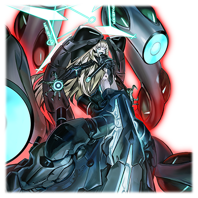

# 格拉维·诺瓦

 

| 角色信息   |          |
| ----------- | ----------- |
| 名称    |格拉维·诺瓦（Grave Nova 73)   |
| 年龄   | 4428.6周期执行废弃处理，之后再度启动（实际数值为6800周期） |
|职业|“工厂”制BOT（试作型杀毒用）|
|特技|裁决/二进制=T.N.T.|
|对应曲|Cyberozar|
|初出|Chunithm PLUS|

该人物的剧情对应上一篇“辉煌号”的剧情，建议先行阅读以获得最佳的故事理解。

## Episode 1 SPEC:格拉维

>快想起来，快点想起本来的你被制造出来的目的！快想起属于这个世界的真相！啊哈哈哈哈哈哈……

假想空间Metaverse，已经充满了混沌……为了探索世界的最深处，“工厂”制造了一系列可以自主行动的BOT程序化身。

BOT拥有极强的骇入能力，还有自我增殖能力，而且还有不亚于战斗型机体的杀伤力，这正是GN系列的集大成，最终的型号。和身为姐妹机的辉煌号同样，她被赋予了以人的意识为蓝本所制造出来的AI智能程序，从而实现了自主的运行。

但是，她的性能实在是太强大了，不要说达成探索的目的，甚至连整个空间都会被影响。“工厂”的上层领导立刻决定将她废弃。最终，机体被破坏拆解，并且丢弃到了Metaverse的边境……

这个BOT，就是格拉维。而现在，格拉维再次醒了过来。她决定继续执行自己被赋予的任务。

## Episode 2 少女的梦境

>我正在沉睡着。 等待着那个觉醒的时刻……

我正在沉睡着。在永远持续的梦境之中沉睡着。

我是第73时代的复制品。只是由数据所组成的，“精神复制体”（アストラル・クローン）。

是只剩下灵魂和感情的，曾经的人类。

人类到底要经历多长的时间，才能够在Metaverse中繁衍后代呢？

说不定已经没有人记得，亦或是没有人知道这个事实了。

知道人类，曾经是在地上生息这一事实。

由于地上发生了某些悲剧，大家才躲到地下，最终甚至不得不舍弃自己的肉体才能苟活下去。

请不要忘记这些东西。希望有人，希望有人能够想起这些事情。

大家都在沉睡着，逃避着这个世界的真实。

想要逃离这个世界的话，只有一个方法。

不管谁都可以。请醒过来吧——

* * * 

——Awakening GN 73

Reboot...Succeed

重启成功。我从沉睡中苏醒了。

虽然我好像听到了“谁”的声音，不过这个声音是谁都无所谓。

我要以我的方式在这个世界活下去。

## Episode 3 远隔觉醒

>我终于觉醒了……首先要做的，就是将自己复原。为的证明自己存在的理由。

总之，我恢复了意识。为了再次开始自己的“任务”，我开始了自我诊断。如果出现故障或者欠缺的部件，就去附近的数据残渣那里找一找能用的部分拼装上去。虽然都是些凑合着用的部件，但现在也别无选择了。毕竟“工厂”的那些家伙，早就不想为我进行维护了……我必须自己想办法。

接着，是射击测试。砰砰砰砰砰！很好！电离枪还能正常运作！感应器也没什么问题，就是身体动起来好僵硬。还是喷射单元修复好之后再试试看飞行吧。

接着……是发声的机能。

“啊，啊啊啊~……咦咦咦？”

等等，这是怎么回事？为啥发出来的声音这么奇怪。

“喂！搞什么啊！好奇怪的声音啊！OH,NO！！”

……不是吧！？我还很喜欢我的本音的，现在完全变成跟吸了氦气的小丑一样了！明明以前的声音还是比较清晰的高音的……现在别说声线了，连说话方式都变了……而且不知为何，只有声音这方面的机能不能修复，可恶。

可恶啊，“工厂”的那群杀手们，绝对饶不了他们。既然都这样了，肯定要给他们一点颜色看看！让他们知道我存在于此的理由！

## Episode 4 GN计划，复活

>任务，再次开始。这和谁的命令都没有关系。我的任务，就由我自己决定！

我偷偷地确认了“工厂”的数据库，确认自己现在的所在地。乱成一团的坐标数据传入了我的传感器里。

“喂……这是什么啊？我竟然被扔到了世界的边界吗？”

看起来这里并不是普通的空间。记得同僚都叫这里是“涅墨西斯”，是一片充满了数据的垃圾的，边境的黑暗领域。

“果然还是被遗弃了啊，不过居然会被扔到这种奇怪的地方。”

……话说，从附近捡了各种各样的零件修复自己的身体……现在这幅身体真的没问题吧？

……算了，现在也不是后悔的时候。

我还有我必须完成的事情。

即便没有人请求，我也要完成我的“任务”！

然后，给“工厂”的这帮家伙一点儿颜色看看！

“任务，再次开始！”

虽然曾经独一无二的任务代码被那些“工厂”的杀手们用病毒清理掉了，但我还是从我的脑海深处的垃圾堆里找了出来。

“目的地是……Metaverse世界的最中心……框架主脑！……就是……那，那个地方……那么，走吧！”

是的，这就是GN计划，这就是我生存的理由。

## Episode 5 成长

>我的力量正在不断成长，虽然现在还不为人知……哈哈，总有一天要让那群家伙后悔将我遗弃掉啊！！

“升级！升级！升级！”

啊……真是太爽了。感觉头发都变得更长了的样子。

“打打打打打打打打给我狠狠地打！杂鱼就该乖乖地躺在地上受死啊！！”

“工厂”的家伙似乎注意到了我复活，甚至派出了病毒前来阻止我，当然，结果是被我狠狠地虐了一番。对于刚刚复活的我来说，打倒这些病毒也让我不断地吸收着它们的残骸，变得越来越强大。看看，这个恐怖的躯体。干脆把整体的轮廓也变成小恶魔一样吧？

“喂——。就没些能让我玩玩的对手吗？”

虽然声音还是老样子，除此之外真是再爽不过了。特别是这个蜂巢单元的自动调整功能。哦，忘了说了，“蜂巢”是在说我的这个巢穴一样的东西，就是我像救生圈一样抓着的这个单元。趴在这东西上面真是太舒服了。而且调教的相当适合我的习惯。我只要趴在上面操作喷口就能够自由地飞向各个地方，去到任何我想去的地方，而且在电能枪和巨大的腕刃手下，不管什么东西都是一击必杀。被打爆的敌人又会变成我的经验值。只要这样继续打下去，我就能离开这片黑暗之海，回到普通的——

“站住。不然我就要强制停止你的行动了。”

突然，一架白色的机体出现在我的面前。

电能枪的枪口对准了我，看起来来者不善啊……等等，这个机体我好像在哪儿见过的样子。

## Episode 6 惩戒

>真是贫弱的追击者啊，就让我好好教训你一下吧！全方位·裁决堙灭！！

“啊啊？你谁啊……？”

我提高了警戒，和眼前的陌生人拉开了距离。

等等，等等啊……好像不是那些病毒的样子。

好像是那些死板还很认真的，曾经同样身为同僚的BOT的样子。

名字……我想想啊，这家伙叫啥来着？

“难道是因为废弃太久就把我忘了？”

“哦哦，想起来了！好久不见了啊！ES1！”

我根据自己的数据库报出了名字。

嗯嗯，ES1，辉煌号(Brillant)。确实是这么个名字来着？

“你也，是跟我一样，被‘工厂’命令着，要去，框架主脑，对吗~~？”

我的声音和说话方式还是这么奇葩。

“……目标锁定，准备开始武力排除敌人。”

说时迟那时快，ES1很快就张开了危险的纳米爆裂器（装着能够让敌人瞬间失去战斗能力的危险东西）……啊？

“这种东西，怎么可能对我有用！逆转操作！全方位·裁决堙灭！！”

瞬间血气上来的我，立刻发动了反击。

那种家伙，就必须好好地教训一下。

我反弹了袭来的纳米爆裂器，并且将攻击目标改为了ES1。

接着，爆裂器喷出了巨大的火光。

啊，真是太爽了。和同类间的战斗真是令人爽快。

## Episode 7 二进制=T.N.T.

>我可没有跟你说明的必要！就让我把整个领域都炸飞吧！像你这种啥都不懂的家伙，只有被炸成灰才最合适啊……！！

“裁决”是更上位的屏蔽命令。靠这个就可以直接阻止敌人病毒的攻击。

“真是白费力气啊。”

稍微调戏了一下对手。说到底，身为杀毒机体的我，怎么可能被那些弱鸡敌人侵蚀。反正纳米机器人也不好使，其实根本没有防御的必要。

我只是稍微和敌人玩玩而已。

而且对于ES1来说，想要对付一台陷入暴走的BOT来说还是太难了吧……？

然而……

“你这家伙真是死缠烂打啊！烦不烦啊你这人！”

ES1居然发动了空间震动兵器，将我追到了绝境。我的机体和ES1发生了共振导致机能底下。而且周围的空间也开始不稳定了起来，最后，整片黑暗领域都出现了裂缝，开始和通常空间混杂在一起了。

“哎呀……这也太过分了吧。再这样下去的话，储存在Metaverse上的人类们的DNA数据也要殃及了啊……”

“工厂”的这些家伙也太为所欲为了吧。

为了阻止我，有必要做到这种地步吗？

“等等。你刚刚说了人类的DNA数据对吧……那是什么意思？”

白色的机体，ES1叫住了我。

咦？好像ES1除了任务以外的记忆只保留了最少的部分呢？

懂了，果然只是个不明事理的家伙。

但很可惜，我现在没有跟你解释的空闲。

“想要知道答案的话，为什么不去问那些通讯员呢？”

听了我的话，ES1直接停止了行动。

“我明白了，且让我询问一下……”

好机会。为了完成我的任务，就请你，烦人的ES1乖乖地被我炸死在这里吧……

## Episode 8 九头蛇模式

>呵呵呵……现在的我又变成了什么模样？感觉好像变成了某些东西呢？章鱼？

轰隆隆隆！！震耳欲聋的爆炸声响彻了整个空间！！

二进制=T.N.T.——这就是我的秘密武器“原始炸弹”。我利用这个东西将我和ES1两人的机体炸了个粉碎！！

两机周围的空间化为了简单的0和1的数据，变成虚无的粉末消失了！！

——然而，这样的爆炸是无法取我性命的。

顷刻间，修复系统开始启动，我又从一片残骸中活了过来。被炸了个粉碎的ES1的机体数据变成了我的经验值，变成了我身体的一部分。

“很遗憾，ES1，你的戏份就到这里了，乖乖退场吧……”

我和ES1的接触最终促成了这场大爆炸。

真是的，所以说我不喜欢打架啊。说到底，搞得我们不得不近身战斗的都是打开了共振的ES1的错啊。

“嗯？啊啊~啊？咦？咦咦咦咦？？？”

似乎是吸收了ES1的副作用，我的身体开始发生变化。

身体开始产生形变，原来的样子已经无法支撑成长的力量了。

渐渐地，我的身体越来越大，长出了越来越多的机械脚。

“哦哦哦……这可真是……爽……爽……爽·翻·天·了·啊！！”

身体的状态从没有这么爽快过，头脑也比想象中的还要明晰。

声音好像也变得好听多了，不错，我喜欢。

不过总觉得好闷热。把裙甲脱了说不定还轻快一点。

还得注意不要挂到那些脚上……

说起来，这个样子，感觉就像一只巨大的乌贼啊……

算了，够强才是硬道理。

 

“那么，是时候去干正事了。目标，当然是世界的中心。”

据说，Metaverse的中枢储藏着不老不死的DNA数据。这个传言，从几万个周期以前就有了。

GN计划73号机，继续执行任务。

## Episode 9 真正的黑暗领域

>这里就是人类沉睡着的地方吗？为何这么黑暗，感觉……就像墓穴一样。

我扭动着触手（应该说叫触脚比较好？），穿过了ES1打开的空间的裂缝，前往了假想空间世界的中枢——也就是框架主脑的所在地。

“真是的，这些家伙就不能早点放弃这种想法吗。”

我一边清理着挡路的防御装置，一边咕叨着。

还记得大概6800个周期前，那个制造了我的，“工厂”最年长的，胆小如鼠的研究者，明明一边追求着永恒的生命，一边却拒绝着将自身机械化的手术。

说着什么“人类尊严”之类的狗屁不通的话。

“明明肉体什么的迟早会腐烂，为啥还要在意这种东西？”

然而和那些对肉体这一事物固执己见的那些“工厂”成员所在的“现实”所不同，Metaverse却是实现了“不老不死”这一终极愿望的乐园。完全转化为化身数据的人类的DNA，不论经历多长的时间都不会老化，腐朽。

而现在，我正在前往揭露这些DNA的秘密的路上。

虽然，现在知道这些秘密的真相也没有什么意义就是了……

突然，无限延伸着的通道似乎也到了尽头。

好奇怪。明明这附近应该就保存着这些生活在Metaverse内的人们的DNA数据的啊。

为什么这附近这么暗，甚至比之前呆着的黑暗领域还更加昏暗。

这里，与其说是人类的摇篮，不如说，更像是墓穴的样子。

“搞什么东西啊。喂！有人在吗？”

我在黑暗中呼喊着，然后，不知从哪里亮起了灯光。

渐渐地，灯光越来越多，终于将整个空间照亮。

## Episode 10 镜之国的格拉维

>都是假的……什么不老不死的人类什么的……都是假的……不过是镜子映出来的虚像啊！

我沿着通道走着，发现房间里只是放着无数多的镜子。镜子间互相反射着光芒，令整个房间变得格外耀眼。镜子中似乎还映照着不同世界的风景。一个一个的镜子中映照着各不相同的画面，那些似乎都是在假想空间中生活着的人们的人生影像。

不对……应该换一个说法。放在这里的东西，不是什么镜子。

这里是能够重新放映过去的历史的房间。这些“镜子”则是放映历史的屏幕阵列。

这里不只是保管DNA的地方，还是保存着“整个世界”的地方。

曾经的Metaverse存在着各不相同的“世界观”的虚拟空间集群。

但是，Metaverse的处理能力是有极限的，只是无节制地扩大的话终究会达到极限。

而这个时候，那些“旧”的世界，就会成批成批的停止运行。

“冻结……将这些世界中的一切冰封起来。然后等待再生的那天吗。”

许多屏幕中，映着已经被冰封的人的样子。

原来是这样的吗……我从未了解这些事情。

这样的话，确实能够将整个世界的“时间”冻结住，没有人会老去，没有人会死去。

但是，这样不就是……

“等等，容量错误？系统还出现了问题吗！”

直到现在，框架主脑的系统仍旧在像镜子映射一般，向着对面的屏幕复制着浩如烟海的世界和DNA的数据。

数据最终从保管的容器中溢出来，吞没了其他容器，然后一并消失。

为什么会有这样致命的BUG？

“这到底是……”

我赶忙向“工厂”的人们汇报了这件事。

但是，已经没有能够接受这些信息的人了。

这并不是因为我被拒绝了。

而是我从通讯系统中得知了“工厂”的通讯员，已经一个都不在了这件事……。

谁都不在了。

……原来是这样的吗。我才注意到这件事。这一切都是假的。

这个世界已经没救了，已经到极限了。

## Episode 11 次元门的诞生

>就让我把这一切都砸个粉碎吧！爆炸吧！让一切都化为乌有吧！！

“就让我在这一切被弄得一团糟之前……全部破坏掉吧！！”

即便拿到“工厂”的DNA数据，也是为时已晚。

我的制造者早已逝去。

就算还有其他的研究者们，他们的消失也只是时间的问题。

不老不死什么的，终究只是妄想。

那么，就让我送大家上路吧！在被这个坏掉的系统杀死之前！！

“啊哈哈哈哈哈哈！！消失吧！！全都给我消失吧！！”

永不终止的沉睡，究竟有何意义？？

我解放了全部的力量，尽情地释放着火力。

镜子，影像，世界，人类，全部都在我的面前变成了碎片。

我的心也渐渐地碎裂，崩坏。

那么……我又是为什么存在的呢？

精神复制体。

这个词汇突然从我的脑海中蹦了出来。这是为了让BOT持有人格，由“工厂”安装上去的，感情……亦或者……灵魂？

而我……就是承载着那个东西的容器吗？

“赶紧从这里离开。用二进制=T.N.T.吧。”

我听到了ES1的声音。不可能。你不是早已消失了吗。

还是说，ES1你还在哪个地方“活着”吗？

前往另一边的世界吧。只要能到达那里的话，我也可以……

我也可以从这个封闭的假想世界中离开吗。

那么，我——

* * *

——Burn out/量子传送，完毕。

随着B.T.N.T.（二进制=T.N.T.）的爆炸声，空间产生了巨大的扭曲，我打破了隔绝时间和空间的那面墙壁，灵魂再度获得了新生。

估计在遥远的未来，我的身体也会恢复重组起来的吧。

我醒了过来。虽然似乎听到了不知道谁的声音……我还是向前踏出了一步。

抱着对这个声音的主人的感谢之情。

为了那些成为后继者的人们，我必须在这里建立起一座全新的大门。

为了前往全新的世界的，次元大门。

