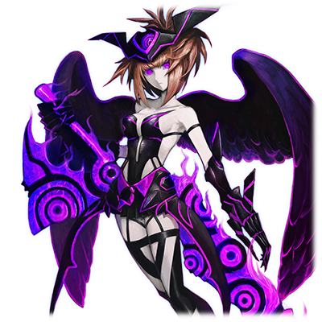

# 休伯利斯

 

 
| 角色信息   |          |
| ----------- | ----------- |
| 名称    |休伯利斯   |
| 年龄   | UNKNOWN 由于数据损坏无法得知。     |
|职业|UNKNOWN 由于数据损坏无法得知。|
|出身|UNKNOWN 由于数据损坏无法得知。|
|对应曲|紅華刑|
|初出|Chunithm AIR|

## Episode 1 少女与觉醒

>这里是……？我究竟发生了什么事……？……我什么都想不起来。我究竟是谁？

名称：休伯利斯

年龄： UNKNOWN 由于数据损坏无法得知。

职业： UNKNOWN 由于数据损坏无法得知。

出身： UNKNOWN 由于数据损坏无法得知。

某天，少女睁开了眼睛。在她面前的，是无尽的漆黑。这个谜一样的空间没有一丝光明，只有伸手不见五指的黑暗。

少女能听到的，只有自己的呼吸声和渐渐加速的心跳声。

少女只是在这一片虚无之中飘荡着。

“这里究竟是……？”

直到这个时候，少女才注意到一件事。

“咦？……我……叫什么名字……？我……我的名字……是什么来着……！？”

想不起的东西，不只是名字。

“我迄今为止……究竟在哪里，做了什么？……我究竟是谁！？”

少女失去了关于自己的一切记忆。

唯一能确定的事物……。

“这个……东西……是我的对吧？”

少女的手中握着一把钝重的铁剑。大剑散发着不祥的紫光，和眼前可爱的少女丝毫不搭，但却有一种使用了很久，已经习惯了的感觉……。

## Episode 2 少女与记忆

> ……对了，我记得我和被称作“妈妈”的人在一起……好像……我们一起去了海边……然后被什么东西袭击了……呜！

“我必须想起来……我究竟是什么人？”

少女绞尽脑汁思考着，翻找着自己的记忆。但是，她的脑子就像是凝固了一般，记忆完全无法组织起来。

“……为什么我什么都想不起来呢？”

“……还是冷静一下……慢慢地回忆起来吧。”

少女为了驱散自己脑海中的迷雾，努力地深呼吸。渐渐地，本来一片朦胧的记忆开始变得慢慢鲜明起来。

浮现在她脑海中的，是一名看起来十分温柔的女性的笑脸。

“……妈妈？对啊！那是我的妈妈！”

脱口而出的少女想起了和自己母亲所经历的一切。

母亲给自己做喜欢吃的东西时的喜悦、手拉着手一起出门的时候手心那温柔的感触、生日时给自己购买的**耳环**……还有那片一直都会去那儿散步的，蓝色的大海。

少女一人在这片黑暗虚空中哭泣着。

“妈妈……你在哪里？妈妈你去哪儿了？为什么，为什么我会一个人在这样的地方？”

眼泪仍未流尽，正抱着双膝蜷缩成一团哭泣着的少女，突然脑海里传来了一股强烈的念头。

“这是什么……？头……好痛！”

有一股宛如淤泥般黑暗的感情从自己的体内迸发而出，让少女的身体仿佛被灼烧一般。那是一股想要将眼前所见之物都毁坏殆尽的念头……那是不属于少女自身意志的——“破坏念头”。

## Episode 3 少女与希望

> 虽然不太明白，但我好像见到了一个手持大剑的女人的样子……如果我能见到她的话，是不是就能明白什么呢？

“哈……哈……这是什么感觉……身体好奇怪……！”

从心底里涌出的破坏冲动令少女万分痛苦。

为了抑制住这股冲动，少女强行闭上了眼睛，努力回忆起了其他东西。

那是充满破坏的记忆……。从未见过的异形士兵挥舞着从未见过的武器破坏着，焚烧着自然景观，街道，还有人们。

少女和母亲在人群中逃亡着，人们虽然有些许的反抗，但是这不过是徒劳。敌人无情地屠杀着，破坏着。周围已经被烈火所包围，夜空被火光染成了一片血红。

就在这个时候，一道白色的光芒从天而降。带着纯白色的翅膀，举起一柄宛如夜空中的一等星般耀眼的大剑挥向敌人的，天之使者……。

“那难道……是天使大人……？……呜！”

少女回想到天使的部分，头就会传来阵阵剧痛。仿佛有一股力量在暗示着“不能继续深究下去了”……

“至少，我知道了一件事。只要能见到那个‘天使大人’的话，说不定就能明白我的事情了！”

少女在这空无一物的黑暗中获得了这唯一的希望。于是，为了找到那天她所见到的天使，少女开始了寻访之旅。

## Episode 4 少女与疑惑

> ……咦？这把剑是什么？为什么我会握着这样的东西？……我究竟……干了什么！？

等少女回过神来，她已经来到了一片充满绿地的公园中。

“……天气真不错。……总觉得以前也似乎和母亲一起在这里散步过的样子。”

在那朦胧的回忆之中，少女露出了笑容。

“……究竟应该怎么去见那个天使大人呢？……嗯？这股香味是……”

少女跟着香味的踪迹走了过去，来到了一片宛如宝石般闪烁着阵阵波光的海边。

“这里是……海边……海……”

——在这个瞬间，少女的记忆再次陷入一片黑暗。等到她再度睁开眼睛的时候，她又再度沉入了黑暗虚空之中，一个人徘徊着。

“咦！？大家，大家都去哪儿了？”

没有人回应少女。

只有少女手中钝重的铁剑散发出不详的紫光回应着她。少女突然明白了什么。

“难道说……这一切……都是我破坏掉的吗？不可能！这是在开什么玩笑对吧！？”

即便口中再怎么不可置信，少女还是在心中默认了这个事实。

眼前的这一切都是自己破坏的。

自己就是破坏这一切的存在。

“……有没有人！有没有人告诉我这不是真的啊——！！”

……然而，这黑暗虚空之中能够回答少女这一问题的人，并不存在。

## Episode 5 少女与恐惧
> 我对自己根本一无所知，关于自己的一切记忆正在慢慢地消失……好可怕……谁来救救我！

少女突然注意到一件事情。直到刚才为止还十分清晰的回忆，正变得越来越模糊，甚至彻底消失。

“不要……为什么会变成这样？妈妈……我好怕啊……”

没有任何可以信赖的东西，少女只能漫无方向地逃跑。

某天，少女就像是在恐惧着什么一样，躲在巷子里走着。

突然，前方某样东西映入了她的眼帘。那是一群青年正在虐待着一只小狗。

就在少女正想上前阻止的时候，她察觉到了某样强烈的违和感，不禁痛苦地蹲了下来。

“咕……！这个感觉是……！”

那正是偶尔就会袭来的，强烈的破坏欲望。

“呜呜呜……”

就在少女勉强控制住了破坏欲望的时候，一名少年从她身旁冲了过去。

“等一下！快把那孩子放开！”

少年为了拯救小狗，向着远比他高大的青年们无所畏惧地大喊着。

青年们将矛头转向了少年，开始对少年拳打脚踢。

“为什么……为什么那个孩子能够像那样勇敢地和比自己强大的存在战斗呢？”

看到少年挺身而出的姿态，少女心底里的那股黑暗的冲动也不知不觉地压制了下来。

## Episode 6 少女与朋友

> 你难道不害怕我吗？……你真的愿意跟这样的我成为朋友吗？

收起了自己体内黑暗火焰的少女，瞥了青年们一眼，举起了手中的剑说到。

“……大哥哥们，立刻放开那个孩子和小狗。……不然的话……”

就算是平素以暴力让人屈服的青年们，在注意到眼前娇小的少女那弹指间即可取人性命的杀气时，也不得不感觉到本能般的恐惧。

“噫——！”

青年们纷纷作鸟兽散，巷子里只剩下少女，少年，还有那只小狗。

“……你没事吧？有没有受伤？”

“嗯嗯……我没事。谢谢你救了我！你明明长得这么可爱，没想到还这么厉害啊。吓了我一跳……哦对了，如果可以的话，和我交个朋友吧！”

“咦……？朋友……？”

“嗯！”

少年那天真无邪的笑容让少女不由得为之心动。

“那么……你的名字是什么？”

“其实……我忘掉了。下次见面的时候我肯定会想起来的！所以能不能再等一下呢？”

“竟然把自己的名字忘掉了！？……你太有趣了吧！哈哈哈！”

“呵呵呵……”

这是少女自从苏醒以来，第一次打从心底里露出笑容。

## Episode 7 少女与违和感

> 好开心……第一次交到了朋友……在这之后要怎么……呜……呵呵呵……。既然交到了朋友，那就把他破坏掉吧。

和少年与小狗一起相处的时间让少女的心境发生了巨大变化。

心中那股黑暗的火焰渐渐地黯淡了下来，取而代之的是宛如温暖的烛光般充满希望的火焰。

“如果和那孩子一起的话，说不定就能够想起和母亲曾经度过的那阵时光了。……对了，干脆明天就去海边……”

——就在这时，少女的记忆中断了。少女失去了平衡，倒在了路边。

“哦呵呵……海边吗，真不错呢。大海可是很漂亮的啊。我可是很喜欢哦……”

缓缓起身的少女变了一个样子，露出一副宛如大人般妖艳的笑容。

“不过……我还想看到比大海更加漂亮的景色啊……对，那就是将这一切都破坏，粉碎之后的样子啊……”

少女舔了舔发红的嘴唇，而她的眼睛，已经宛如无底深渊般空洞而黑暗。

就在少女即将举起手中的剑挥向城市的时候……空中降下了几道光芒。

“哎呀？那些家伙又来了吗？每次都趁着我刚刚打算享受的时候冒出来……真是失礼呢？”

少女叹了一口气，便收起了剑离开了这里。

## Episode 8 少女与哀叹

> 我已经快受够了。为什么我要被大家所厌恶？为什么我的记忆正在不断消失？

某天，少女正被追杀着。

“……为什么我非得被这些人追杀不可！？”

少女受了伤，只能拖着沉重的身体逃亡。脸上已经被汗水和血水弄得脏兮兮的。

即便已经累到双膝跪地，敌人也没有放缓追击的步伐。

“……为什么！为什么我会被‘天使大人’她们追杀！？”

是的，正在追杀着少女的，正是那些和她所寻找的“天使”十分相像的战士们。

那些人看到少女的瞬间便不由分说地发动了袭击。

“……太过分了。我明明什么都没做……”

然而说到这里，少女又欲言又止。自己真的没有做什么坏事吗？

随时都会支配全身的破坏冲动。还有常常消失的意识……以及完全无法从自己手上松开的这把钝重的铁剑。

少女终于理解了现实。天使说的是正确的，迄今为止做错事情的是自己。

但是，即便如此她也不愿意承认。因为如果承认的话，那这一切就都完了。

“呜呜……救救我……妈……咦？……我刚刚是在向谁求救来着？”

少女经历了连续的战斗，终于连最爱的母亲的记忆也从脑海中被抹去了……。

## Episode 9 少女与救赎

> 已经不想去考虑东西了……对了，去见那个孩子吧。如果是他的话，肯定能够拯救我的吧。

少女的记忆就宛如流沙般慢慢地从脑海中流逝。不管是曾经最爱的人，还是最重要的回忆……甚至是令人恐惧的破坏的回忆，也渐渐地从脑海中消失了。

“不要……谁来救救我……可是，我应该去哪里才行呢？又有谁能够救我呢？”

目前还残存在少女脑海中的记忆，已经只剩下“天使”，“大海”……还有“初次认识的朋友”而已了。

“对了……去见那个孩子吧。如果是他的话肯定能够救我的吧？”

少女为了追寻那最后的希望，从黑暗中冲了出去。

“……求你了！请你继续将我当成朋友吧！请你相信我，相信我还没事！”

少女一心只想见到朋友，就这么不顾一切地冲了出去。

“……发现目标！”

但是她的愿望最终落空了，追杀着她的敌人出现在了她面前。

“为什么我……。就那么想被我宰掉吗！”

这个瞬间，少女第一次靠着自己的意志将自己的心交给了破坏的人格。

## Episode 10 少女与绝望

> 咦……？为什么？为什么我会把朋友给……这不可能！快告诉我这一切都是假的啊！不要啊啊啊啊——！！

化身为破坏的使者的少女轻轻松松地击退了“天使”的大军。

“仅凭你们就想破坏我的好事还太早了点呢……给我轰成碎片吧……”

少女用着温柔的语气抱着手中的剑说到。

就在这个时候，少女发觉了背后有人的气息。

“竟然还有没来得及逃命的家伙……就怪你的命不好吧！”

少女露出喜悦的表情向着那里挥动了剑。然而……。

（不可以！……求你了，快停下来！）

成为少女的刀下亡魂的，并不是“天使”们，而是那天结识并成为朋友的少年。

“为……为什么……”

少年只是看向少女问了这句话，便化为了发光的尘埃消失在空中。

“不是吧……这是开玩笑的对吧？为什么……！？为什么啊！快来人告诉我这一切都是假的啊！不要啊啊啊啊啊——！”

少女声嘶力竭的哭喊着。在眼泪都流干之后……便永远地陷入了黑暗。

## Episode 11 少女与崩坏

> 看来，“我”最终还是不能承受住我的力量崩溃了呢……真是可怜的孩子……至少，这样就不会再承受痛苦了呢。

 

毫不犹豫地一击毙命，宛如斩断罪人的头颅的断头台般凶狠。这样战斗的她被赋予了这样的代号。

“修伯利斯(Supplice)”（注：名称来源于《幻想交响曲》第四乐章《断头台的行进》(Marche au supplice)，即断头台之义）

“咦……修伯利斯……吗。听起来是个不错的名字呢。”

“……说起来，记得好像有谁跟我说过，如果知道了自己的名字的话，就要告诉他的来着……。已经想不起来了呢。也罢。”

“曾经的‘我’惧怕着我的力量，一直在为之痛苦……不过，一切都结束了。过去的我已经得到了救赎了。”

“……现在的‘我’还记住的，就只有‘大海’和‘天使大人’的记忆而已……不过想必很快就会忘在脑后了吧……”

然而少女却没有一丝悲伤。相反，露出一脸清爽的表情，回到了黑暗中。

“……那么，接下来要去哪里制造破坏呢？”