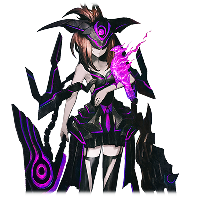

# 休伯利斯

 

 
| 角色信息   |          |
| ----------- | ----------- |
| 名称    |休伯利斯   |
| 年龄   | UNKNOWN 由于数据损坏无法得知。     |
|职业|UNKNOWN 由于数据损坏无法得知。|
|出身|UNKNOWN 由于数据损坏无法得知。|
|对应曲|紅華刑|
|初出|Chunithm AIR|

## Episode 1 少女与觉醒

>这里是……？我究竟发生了什么事……？……我什么都想不起来。我究竟是谁？

名称：休伯利斯

年龄： UNKNOWN 由于数据损坏无法得知。

职业： UNKNOWN 由于数据损坏无法得知。

出身： UNKNOWN 由于数据损坏无法得知。

某天，少女睁开了眼睛。在她面前的，是无尽的漆黑。这个谜一样的空间没有一丝光明，只有伸手不见五指的黑暗。

少女能听到的，只有自己的呼吸声和渐渐加速的心跳声。

少女只是在这一片虚无之中飘荡着。

“这里究竟是……？”

直到这个时候，少女才注意到一件事。

“咦？……我……叫什么名字……？我……我的名字……是什么来着……！？”

想不起的东西，不只是名字。

“我迄今为止……究竟在哪里，做了什么？……我究竟是谁！？”

少女失去了关于自己的一切记忆。

唯一能确定的事物……。

“这个……东西……是我的对吧？”

少女的手中握着一把钝重的铁剑。大剑散发着不祥的紫光，和眼前可爱的少女丝毫不搭，但却有一种使用了很久，已经习惯了的感觉……。

## Episode 2 少女与记忆

> ……对了，我记得我和被称作“妈妈”的人在一起……好像……我们一起去了海边……然后被什么东西袭击了……呜！

“我必须想起来……我究竟是什么人？”

少女绞尽脑汁思考着，翻找着自己的记忆。但是，她的脑子就像是凝固了一般，记忆完全无法组织起来。

“……为什么我什么都想不起来呢？”

“……还是冷静一下……慢慢地回忆起来吧。”

少女为了驱散自己脑海中的迷雾，努力地深呼吸。渐渐地，本来一片朦胧的记忆开始变得慢慢鲜明起来。

浮现在她脑海中的，是一名看起来十分温柔的女性的笑脸。

“……妈妈？对啊！那是我的妈妈！”

脱口而出的少女想起了和自己母亲所经历的一切。

母亲给自己做喜欢吃的东西时的喜悦、手拉着手一起出门的时候手心那温柔的感触、生日时给自己购买的**耳环**……还有那片一直都会去那儿散步的，蓝色的大海。

少女一人在这片黑暗虚空中哭泣着。

“妈妈……你在哪里？妈妈你去哪儿了？为什么，为什么我会一个人在这样的地方？”

眼泪仍未流尽，正抱着双膝蜷缩成一团哭泣着的少女，突然脑海里传来了一股强烈的念头。

“这是什么……？头……好痛！”

有一股宛如淤泥般黑暗的感情从自己的体内迸发而出，让少女的身体仿佛被灼烧一般。那是一股想要将眼前所见之物都毁坏殆尽的念头……那是不属于少女自身意志的——“破坏念头”。

## Episode 3 少女与希望

> 虽然不太明白，但我好像见到了一个手持大剑的女人的样子……如果我能见到她的话，是不是就能明白什么呢？

“哈……哈……这是什么感觉……身体好奇怪……！”

从心底里涌出的破坏冲动令少女万分痛苦。

为了抑制住这股冲动，少女强行闭上了眼睛，努力回忆起了其他东西。

那是充满破坏的记忆……。从未见过的异形士兵挥舞着从未见过的武器破坏着，焚烧着自然景观，街道，还有人们。

少女和母亲在人群中逃亡着，人们虽然有些许的反抗，但是这不过是徒劳。敌人无情地屠杀着，破坏着。周围已经被烈火所包围，夜空被火光染成了一片血红。

就在这个时候，一道白色的光芒从天而降。带着纯白色的翅膀，举起一柄宛如夜空中的一等星般耀眼的大剑挥向敌人的，天之使者……。

“那难道……是天使大人……？……呜！”

少女回想到天使的部分，头就会传来阵阵剧痛。仿佛有一股力量在暗示着“不能继续深究下去了”……

“至少，我知道了一件事。只要能见到那个‘天使大人’的话，说不定就能明白我的事情了！”

少女在这空无一物的黑暗中获得了这唯一的希望。于是，为了找到那天她所见到的天使，少女开始了寻访之旅。

