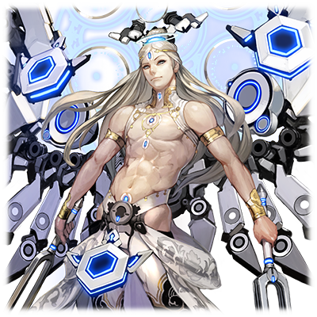

# 哲学主 捷夫提

| 角色信息   |          |
| ----------- | ----------- |
| 名称    |哲学主 捷夫提|
| 年龄   | 不明   |
|所属|框架主脑|
|对应曲|電光石火|
|初出|Chunithm Amazon Plus|

## Episode 1 SPEC：捷夫提

>让我们稍微花点时间讲解一下这个世界吧。讲一下身为框架主脑的支配者，最古们的故事……

——让我们稍微花点时间讲一下这个世界吧。

人类的乐园，永久乐土·Metaverse。

在神祖·艾克雷尔离开这个世界之后，12体程序成为了这个乐园的新的管理者，也就是“最古（オリジン）”们。

我——捷夫提，正是这12名“最古”之一。俯瞰一切，以最冷静的态度处理万事万物的我，并不像塞拉菲塔或者WISEMAN那样拥有人类一样的感情。

至于其原因，则是因为我的使命——不论什么时候都要下达最正确的判断所致。

就在“最古”们正在准备各显神通统治这个世界的时候，一个巨大的危机降临了这个世界。

从不知道什么地方，出现了一匹被称作“提亚马特”的破灭之巨龙。这黑色的巨龙肆虐着整个世界，甚至冲进了框架主脑，将无数我们的精兵烧的一干二净。

再这样下去的话，世界就要毁灭了——

就在这个时候，在我们“最古”中已经崭露头角的“统制主·提丰”进行了一场作战，而这场战斗也在我们付出了重大牺牲之中结束了。

混乱即将平息，世界将会回归秩序。在这个时候，无论是谁都这么想着。

所以并没有人注意到这件事。

注意到曾经蚕食着世界的邪龙的爪牙仍然留存在这个世上的事实。

和提亚马特死战身受重伤的提丰，吸收了在战斗中大破的最古“大地的支配者 吉斯库克”，从此便展露出他的野心，开始了他的称霸之路。

他将其他最古纳入了自己的管理之下，开始为自己的欲望而行动。

提丰将本来在他的使命中必须保护的“人类”变成了他的试验品。看着无数的人沦为他的试验品悲惨死去，我们却毫无反抗的手段。但是，在持续了很久的试验之后，他的生命也被曾经被他当做小白鼠一般玩弄的“人类”所夺走。

被那些称作“MIR系列”的，程序和人类的融合体少女们——。

在这之后，框架主脑便归于“哲学主·捷夫提”、“调律者·WISEMAN”、“裁定者·塞拉菲塔”、“再生者·迪安”以及“全天之支配着·雪儿”这剩余的五名“最古”进行管理。

这个世界，现在仍旧在扩张之中。

已经大幅减员的我们已经无法正常管理了。

但是，即便如此我还是要做我应做的事情。

即便要将世界的一部分舍弃出去，我也要让整个世界恢复安宁。

于是乎——在这充满混沌的Metaverse之中，全新的故事就此开始。

## Episode 2 日薄西山的世界

>从世界的尽头出现的，是充满憎恨的化身。我们也不得不构筑起人类和神明的共同战线抵御外敌。

涅墨西斯的袭来，打响了全新战斗的第一枪。

眼前正是宛如排山倒海之势的涅墨西斯集群。

它们从世界的尽头出现，以可怕的气势一片片地侵蚀着Metaverse的领域。

我和WISEMAN赶紧封锁了部分连接框架主脑的接入点，筑起了防线。

如果要打败它们的话，找同为协力关系的“工厂”是上策。只要能够一起夹击的话，应该就能找到反击的关键吧。

但是，涅墨西斯的行动却远远超出了我们的想象。

在后来被称作“大侵攻”的这场战争中，框架主脑和“工厂”之间互相维持联系的领域也被敌人夺走了。

是要出兵救援“工厂”，还是力求自保？

在这进退两难的选择中，一个凛然的声音响了起来。

声音的主人，正是名为“裁定者”的最古，塞拉菲塔。

“只要我出马的话，应该就能逆转现在的状况吧。现在就出兵如何？”

“如果是你的话虽然没有问题，不过这样简单的思考可能会让你招致杀身之祸哦？”

虽然她是现存的“最古”中最强的战力，但是稍微有些莽撞的性格也是一大弱点。虽然我并不能明白持有人类中“爱”这一感情的她的思考方式，但毫无疑问这也会成为她的弱点。

“那么我们该怎么办……就这样放着‘工厂’见死不救吗？”

“现在也只能维持守势了。在和‘工厂’断绝联系的时候，敌我之间的差距就不言而喻了。”

“……真的只能隐忍一阵了吗？”

“正是。所以，我们必须为了终将到来的反击之时，先忍耐一下了。”

在这之后，以防卫战作为核心，塞拉菲塔和雪儿两人在前线大展身手，终于将Metaverse的损伤降低到一半以下。这似乎也有将深入我们防卫线深处的“泰斯塔蒙特”大破的一份功劳呢。

我们为了即将袭来的下一次袭击，强化着防线。

这些被夺走的领域，就暂时给他们吧。

不过，等到时机成熟的时候他们就会明白了。

明白我们框架主脑真正的力量——。

## Episode 3 剩余的最古们

>我们终于分析出了涅墨西斯的弱点。就等着吧，涅墨西斯……你们的末日即将到来……好好见识“最古”的力量吧。

在这场“大侵攻”中，我们所获得的东西，并不只有“泰斯塔蒙特”的情报。

“我们从和涅墨西斯的战斗数据中互相对照分析后得出了某个结论。”

“是吗，对我们来说这可是天大的好事啊，WISEMAN。”

“看，这就是涅墨西斯的指挥系统。它们完全是自上而下的组织形式。除了那些被称作‘混沌七器’的敌人以外，没有任何的指挥系统。下层的涅墨西斯就只是懂得破坏的存在而已。”

“原来如此。为什么它们人多势众却会进化成这个样子呢……真令人感兴趣。不过现在，还是让我们思考一下反击的策略吧。”

讨论之后，我们定好的作战就是——

大幅限制能够进入框架主脑中枢的接入点，接着集中攻击那些侵入其中的涅墨西斯和其领导者。

如果要实施这个作战的话，就需要好好配置一下。迪安和WISEMAN负责在中枢部进行后方的支援，而塞拉菲塔和雪儿两人在前线抵御敌人。我则是辅助塞拉菲塔的作战。

我们展开的作战终于获得了成果，本来无穷无尽仿佛要淹没大地一般的涅墨西斯，终于被慢慢地打了回去，曾经的劣势不复存在。

只要再这样下去的话，我们也能获得一丝喘息的空间了吧。

涅墨西斯哟，你们就好好看着“最古”的力量吧。

## Episode 4 制裁之日

>战争就在预料好的剧本之中落下帷幕。但是，我还必须观察下去，将这之后的局势全面看透。

在我和WISEMAN两人的作战下，本来在“大侵攻”中一边倒的状况，也渐渐地夺回了平衡。

从整体上来看，涅墨西斯的行动真是无比的混乱。

真是不错的计划。

很快，Metaverse就能够恢复曾经的和平了吧。这短暂的和平对于疲惫的框架主脑和“工厂”来说都是必须的。

不管怎样都要尽可能地维持下去，为即将到来的下一场战斗准备才是……为了以万全的状态迎击他们。

在这个时候，我从塞拉菲塔那里获得了一项情报，预示着他们的再度来袭。

简单来说，涅墨西斯再度复活了。

虽然我们已经做了充分的准备，但是涅墨西斯的威胁还是超出了我的想象。

“想要先发制人吗。也罢……放马过来吧。”

正在框架主脑的中枢看着涅墨西斯的去向的我们，打开了头顶上张开的领域图。

敌人的反应集中在传送门附近——涅墨西斯正以惊人的速度在地图上增殖着。

在无数的能量反应之中，有着两个特别明亮的光点。

毫无疑问，那就是混沌七器他们。

“看这个强烈的反应……他们果然还是攻过来了呢。”

“塞拉菲塔，准备好了吗？”

“已经准备好了，放心吧。”

声音依旧充满了自信。

“真是令人安心啊。那么，就让我们去迎接那帮愚蠢的涅墨西斯吧。”

“好！”

我们各自奔向了不同的传送门。

然后，到达目的地的我们，很快就看到了一大堆正在啃食着传送门的涅墨西斯。

但是，不管哪只都只是最底层的杂兵而已。

“这可真是大阵仗啊。不过，仅凭这么多杂鱼就想阻止我们‘最古’吗？”

“破坏……！破坏……一切……！”

“叽叽叽叽叽叽叽叽！！”

似乎是被我的挑衅刺激到了，众多的怪物发出了又像是怒吼，又像是咒骂一般的声音，让战场的空气都为之一震。

是想要威吓我吗。很遗憾，对于没有感情的我来说这毫无意义。

真是可笑的行为。

“还要在原地发呆多久？猎物可就在你们的面前哦？”

随着这句话，众多的涅墨西斯向我扑了过来。

我举起了音叉准备攻击。

就让这群愚蠢的涅墨西斯明白吧。

明白它们是何等的愚昧、脆弱——。

## Episode 5 神明间的战斗

>“最古”们被逼到了绝境。这场战斗的结果，究竟是生，还是死呢？

一场恶战之后，我终于成功击退了盘踞于传送门的大批涅墨西斯。

这些家伙真的以为派这么多杂兵就能够摆平这里吗。也太小看我们了吧。

“不过，塞拉菲塔这出去的也太久了吧。以她的实力，不应该在那两人那里耗费那么长时间才是啊……？”

如果她被打倒了的话，接下来就得由我代替她而战了吗——。

就在我这么想着的时候。

我听见了一个熟悉的声音。

这个声音，毫无疑问是塞拉菲塔。

不过，声音不止一个，有好几个。

说不定那边的传送门出现了什么情况。

“我们终于做到了呢！赛拉菲塔小姐！”

“是的。这样的话就可以和在框架主脑的同伴们取得联系了。”

“……没有这个必要。”

“——谁！？”

塞拉菲塔立刻张开了银色的翅膀，举起手中的双剑，进入了战斗模式。

不过她很快就意识到对面是我。

“……捷夫提！别吓唬人嘛！”

解除警戒的她回到了平时的样子。

“被吓到的可是我们这边啊。竟然花了这么久才回来……也罢。”

仔细一看，她的身上虽然没什么损伤，不过看得出消耗了大半力量。

“没事就好。虽然我认为是你的话应该是没啥问题的，遇上什么麻烦了吗？”

“抱歉……捷夫提。之前在和涅墨西斯交战的时候，传送门被破坏，连补给线也断掉了……所以才会拖延这么久。”

“原来如此。然后在路途中就捡到了这两位小姑娘吗……”

两名少女站在塞拉菲塔的背后偷偷地向这里望着，她们紧张地看着我的脸，缓缓地开了口。

“我们是从‘工厂’前来的，狄安娜和露娜。”

“初次见面！请多关照！”

青色和银色的两名少女。

从她们的脸上总有种既视感——果然吗……

似乎是注意到了我的眼神，塞拉菲塔点了点头。

果然如此。

她们果然是基于我们提供的“MIR系列”的数据制造出来的。

“……倒也不错嘛。‘工厂’也为我们统治整个Metaverse提供了帮助呢。”

“是的……另外，关于狄安娜和露娜……那个，希望能够好好地‘处理’一下。”

“哦……‘处理’……吗？”

我明白了她的言外之意。

不过，现在的我们能做的事情已经——。

“……可以。不如说，你的请求我也找不到拒绝的理由。毕竟我们最古之间的权力都是平等的呢……。我就尽自己所能帮帮忙吧。”

“谢谢……”

“……不过，在这之前，还是先打发走那些不速之客吧。”

不知何时，周围的气氛变得十分诡异。

从塞拉菲塔她们背后的空间中产生了扭曲。两个阴魂不散的声音响起。出现的不是别人，正是两体混沌之器。

“你好呀♪又见面了哦，小姑娘们……这次可不会放你们走哦？”

“……可恨的伪神哟，今天，你的项上人头就归我了！”

“贝尔泽布特和阿雷斯！？为什么你们知道这个坐标……！？”

“呵呵呵……那还得多亏了那位黑色的小姑娘哦。要不是她身上的追踪器带路，我们也找不到这个传送门呢。”

“什么！怎么会这样……”

被戳中痛处的露娜难掩痛苦之色。

而这样的表情似乎刺激到了贝尔泽布特，她发出了更加愉悦的笑声。

“哈哈！这副陷入混乱中的表情真是可爱啊！等我把那些‘最古’们料理之后，我再来好好地跟你玩哦。”

“就算我已经经历了长途消耗，只凭两名‘混沌之器’就想攻破框架主脑，也未免太小看我们了吧……”

我接着塞拉菲塔的话头。

“真是的，我们也有被看扁了的一天吗……这样无谋的计划真的没问题吗？涅墨西斯的各位……可不要小看统治Metaverse的最古之名啊。”

“赛拉菲塔小姐！捷夫提先生！我们姐妹会尽自己所能帮你们战斗的！”

这场战斗不论从什么方面来看都是对我们不利。

但是，已经没有退路了。

“说什么大话！你们的统治，就让我在今天为你们拉下帷幕吧！”

“直到你们变成灰烬为止我都不会停止攻击的哦！”

赌上“最古”之名，我绝对不能输。

“竟然用了那么多卑鄙的手段……才终于现身对决了吗。果然是下贱的涅墨西斯会考虑的手段呢。”

“你想说什么？”

“没什么。就是‘器’居然也懂这些个小手段而已。”

“呵呵呵……你这虫子！！”

贝尔泽布特立刻就受到了我的挑衅。想要掌控这个涅墨西斯的行动还是挺简单的。

这一手应该会成为决定胜负的关键吧。

只有尽可能让姐妹俩的支援起到用途，阻止贝尔泽布特干涉塞拉菲塔和阿雷斯的战斗，才能让我们活着离开这个地方。

即便执行起来有诸多困难，但是对于俯瞰着整个战局的我来说，是可以做到的。

“贝尔泽布特，你就好好看着吧，什么才是真正的战斗——”

现在，决定框架主脑的命运的战斗就此打响。

## Episode 6 悲伤的进化

>狄安娜和露娜两人刚刚从生死线上挣扎回来，悲剧就再度造访了她们。现在，像她们这样全新的存在，究竟能在进化到什么程度呢……

在塞拉菲塔的帮助下，狄安娜和露娜两人倾尽全力，终于击退了从传送门处现身的阿雷斯和贝尔泽布特。

但是作为其代价，用尽了全部力量的两人，已经奄奄一息。

绝对不能让这些为我们带来胜利的英雄们就此死去。

我将两人带回了中枢防卫据点“艾崔兰克”，将她们放进修复设备之后就赶忙开始了治疗工作。

“塞拉菲塔，你现在的状况也是不容乐观，只靠补给装置撑着真的没问题吗？对于能量承载量巨大的你来说，恢复可是要花很久时间的……”

如果是别人的话，估计是看不出这些细枝末节的变化。但是我很清楚，现在的她只是在强撑着身子而已。

但是她还是坚持己见
