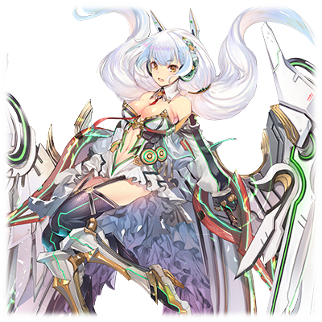

# XGN-72 露娜·诺瓦

| 角色信息   |          |
| ----------- | ----------- |
| 名称    |XGN-72 露娜·诺瓦  |
| 年龄   | 不明   |
|职业|“工厂”制探索型程序|
|对应曲|Innocent Truth|
|初出|Chunithm Amazon|

该人物故事剧情紧密衔接XES-72 狄安娜·普利梅拉篇，建议连续阅读保证故事连贯。

## Episode 1 SPEC：露娜

>因为涅墨西斯的进攻，“工厂”和框架主脑失去了联系。面对危机，“工厂”的当务之急是和框架主脑重新连接。

人类的摇篮，Metaverse。

由神祖·艾克雷尔所创造的这个电脑乐园，统治它的人由艾克雷尔转为了提丰。

提丰又被自己制造出来的自律型探索程序“MIR系列”所背叛杀死，失去神明的框架主脑失去了诸多的资源和力量，让整个世界陷入了混乱。

而且，不知何时，从被称为“最外周部”的Metaverse的边境地区出现了性质成谜的恶性程序化身“涅墨西斯”，它们对Metaverse展开了入侵行动，令整个世界陷入了前所未有的危机。

就在这个时候，处于框架主脑庇护下的组织“工厂”和框架主脑失去了联系，已经是危急存亡之秋。

“工厂”为了保证自身的安危，决定尝试和框架主脑再次取得联系。于是派出了两名探索程序。

被赋予了“XES-72 狄安娜·普利梅拉”和“XGN-72 露娜·诺瓦”的名字的姐妹两体程序，是以曾经打倒了Metaverse的帝王——提丰的“MIR系列”为基础做出来的程序。姐妹俩和她们一样，都是以人类为基础制造出来的和程序的融合体。正因如此，她们也有着“进化”这一可能性，以及“寿命”这一缺陷。

对于狄安娜和露娜姐妹两人来说，为了活下去，就只能和框架主脑再度取得联系才行。

姐妹俩潜入了涅墨西斯领域，踏上了前往框架主脑的旅途

## Episode 2 残存的希望

>身为ES计划的产物的姐妹俩，为了和框架主脑再次取得联系，前往了涅墨西斯军团进军的地方。

虽然两人还是不完全的状态，但是由于事态紧急，狄安娜和露娜两人只能立刻从“工厂”启程。

她们在最初前往的前哨基地见到了和自己同样出身于“工厂”的程序，MDA-88-009 弧矢二·诺因。

和诺因的对话让姐妹俩首次认识到除了她们两人以外，还有同样平等地位的友军存在。

但是，就在一片祥和之中，“混沌之器”之中的其中一人——欺瞒的使徒·贝尔泽布特带着大军袭击了前哨基地。

看着自己初次结识的朋友诺因葬身于贝尔泽布特的手下，姐妹俩下定了决心，亲自应战贝尔泽布特。

但是，姐妹俩的决心在贝尔泽布特强大的力量面前如此无力。

在这绝体绝命的时刻，姐妹俩使用了从“工厂”的三贤者其中的二人，提欧和梅德那里托付的特殊战斗程序FREQ-Vertex，终于勉强击退了贝尔泽布特和她带领的涅墨西斯军。

然后，姐妹根据尤巴尔的预测，认为跟着撤军的涅墨西斯军团行进就能找到接触框架主脑的方法，再次踏上了旅途，跟随涅墨西斯大军而去。

## Episode 3 混沌之器们

>姐妹俩人发现了目标，但是在那里，姐妹俩看到了“战神·阿雷斯”以及“欺瞒的使徒·贝尔泽布特”两人的身影。

离开已是一片废墟的前哨基地，姐妹俩跟着大军的方向行进着，最终抵达的地方正如尤巴尔的预想，正是和框架主脑的接触坐标。

“姐姐！只要到那里就能够和框架主脑接触了！只要这样的话，我们就能够恢复我们的身体，获得自由了吧！？”

“嗯嗯，是呢……不过事实并没有那么简单的样子。”

正如狄安娜所说，目前在框架主脑的接触坐标附近的，不止贝尔泽布特的军队。

光是贝尔泽布特一人就已经拥有强大的力量了，更糟糕的是，在她们面前还站着另一个人——在“混沌之器”中最为好战，拥有强横力量的“憎恶的战神·阿雷斯”。

“战神·阿雷斯……根据我从‘工厂’的数据看，记得他是曾经带领大军进军框架主脑，将大片的虚拟世界变成一片混沌的涅墨西斯之王……”

“怎么会……姐姐，我们该怎么办？”

“……现在的我们是无法和他们交手的。想想别的方法吧。”

姐妹两人发动了自己身上的隐身机能。因为狄安娜和露娜两人都是以MIR系列为蓝本制造出来的，所以她们的身上还残留着些许的涅墨西斯程序部分。她们利用涅墨西斯程序的性质发动了拟态机能，从而暂时地成为了“涅墨西斯”的同伴。姐妹借着拟态机能的掩护，在贝尔泽布特的大军眼皮底下偷偷地跟着他们前进。

终于，贝尔泽布特和阿雷斯的军队来到了框架主脑的接触坐标，他们开始了强行开放传送门的工作。

“一切顺利呢！姐姐！”

“是啊。接着只要这样平安无事地和框架主脑的坐标进行接触就行了……！”

拟态成涅墨西斯是一场危险的赌注。

而成功地潜入其中的姐妹们为这难得的胜利感到欣喜。

##  Episode 4 传送门防卫战

>来到接触坐标的姐妹俩目睹了框架主脑和涅墨西斯两军的激战。神明之间激烈的战斗令姐妹二人震惊。

欺瞒的使徒·贝尔泽布特和憎恶的战神·阿雷斯。两位充满压倒性的力量的涅墨西斯之王正在前往框架主脑的传送门前。再这样下去的话，传送门就会被他们强行打开，到时候就是正式开战的时候了。

突然，传送门被启动了。从散发出蓝白色光芒的门中射出了闪光的箭矢，向涅墨西斯的大军袭来。

“这到底是！？”

“姐姐！快看传送门的里面！”

从传送门之中冒出来的，是框架主脑制造出来的防卫BOT的大军——处刑人（EXECUTIONER）程序。

……曾经，提丰为了破坏那些和自己拥有同等权限的“最古”之中被视为最大威胁的“追放者”（EXILE）们，制造出了名为“利希德修茨”的程序，虽然最后利希德修茨败于“混沌之器”中的“斗争的女帝·厄里斯”，但是利希德修茨的数据，在提丰消失之后，依旧在加以改良强化。

而最新版本的程序，就是被大幅量产的“利希德二型”（リヒトツヴァイ，即リヒト与德语的Zwei（德语中意为第二），所结合而成）——现在他们正为了保护传送大门，从另一头被召唤而来。

传送门的周围已经变成了贝尔泽布特和阿雷斯所带领的涅墨西斯大军和利希德二型的大混战。

虽然论个体实力是贝尔泽布特和阿雷斯占据优势，但是利希德二型却重在人多势众。

“好厉害……！”

“这就是框架主脑和涅墨西斯的战斗吗！”

说到底，“工厂”不过是人类的研究者们抱团取暖的象牙之塔而已，相比较框架主脑来说不过是一个小小的附庸。对于在那里诞生的狄安娜和露娜来说，眼前框架主脑和涅墨西斯的战斗是那么地激烈，就像是神明与恶魔之间的大战，完全没有自己能够插手的余地。

“……呐，姐姐。现在也许可以趁着两方混战的机会前去传送门那里哦。”

“是呢……现在战斗如此激烈，正是最好的时机。”

姐妹两人的目的终究还是和框架主脑取得联系，获得自己的自由之身。并没有必要卷入像这样宛如异次元般激烈的战斗。

如此判断的姐妹俩再次开启了潜行机能，沿着战场偷偷行进，慢慢接近传送门，然后只要使用自己手上被托付了的“工厂”用的认证钥匙的话，就能够离开这里了。

## Episode 5 刚强暴虐的涅墨西斯之王

>得知了贝尔泽布特在姐妹俩手下吃过亏的阿雷斯将姐妹俩当成了最危险的敌人，在阿雷斯的猛攻下，狄安娜遭受重创，身体半毁。

框架主脑这边出动的是钢铁的守护天使·利希德二型。即便涅墨西斯的王能力再强大，面对从传送门中源源不断地用出来的利希德二型，也开始稍显疲态。

阿雷斯和贝尔泽布特决定暂时脱离传送门的所在地，和利希德二型的大军展开游击作战。

姐妹俩并未看漏两人的行动。

“……就是现在！！”

“嗯！”

开启潜行系统，拟态成涅墨西斯的姐妹俩终于抵达了传送门附近，两人看准时机解除了潜行。

姐妹掏出了接触用的钥匙启动了传送门。身份认识系统很快就认出了二人的身份。

“成了！只要这样，就可以和框架主脑……”

“……！露娜！快躲开！”

“咦！？呀！？”

狄安娜撞开了露娜的身体强制让两人卧倒在地上。就在那个瞬间，露娜头上的空间瞬间被扭曲成了一团，一颗能量巨大足以让空间都扭曲的红黑色光弹掠过了二人的头顶。

“……什么？发生了什么事！？”

“你们，是‘工厂’的小虫子们吗。”

“啊！”

一瞬间，憎恶的战神·阿雷斯就这么出现在姐妹面前。

“……你们俩，就是之前让贝尔泽布特吃瘪了的虫子对吧。竟然胆敢拟态成我等涅墨西斯的模样偷偷地来到这里……净耍些小手段啊！你们这群跟着机械之神摇尾乞怜的虫豸们！”

“噫！？”

阿雷斯只是放出一股怒气，便让露娜全身发抖。狄安娜大叫着，鼓励着妹妹。

“露娜！这里就由我来拖住他！你赶紧去启动传送系统吧！”

“可，可是！”

“没有可是了！快去！”

在狄安娜的呐喊下，露娜重新站了起来，奔向了传送门的方向。狄安娜目送着妹妹的离去，重新面向了阿雷斯。

“……这里绝对不会让你过去的。”

“哼，就凭你一个人也想阻止我？真是笑掉大牙啊，虫子。不过……别以为我会和贝尔泽布特那样陪你们玩玩啊！”

就这么说着，阿雷斯挥动着自己背上无数的手臂，向着狄安娜发动着连绵不断的拳击和冲击波。

“——嗯！！啊啊啊啊啊啊啊啊啊——！！！”

“像你这样手无缚鸡之力的弱者，就该给我变成一堆碎片消失啊！看我将你打到连渣都不剩！！”

在毫无保留的，阿雷斯宛如暴风骤雨般的攻击下，狄安娜连些许的反击机会都没有。别说反击，就连抵御阿雷斯的猛攻都十分困难。

即便如此，狄安娜还是为了保护自己背后的露娜，拼尽全力地死守着。

但是狄安娜的努力也只能维持片刻。身为破坏的象征的阿雷斯所发出的攻击，一瞬间就将狄安娜打到半毁的状态。

“……竟然已经动不了了吗。真是遗憾啊。”

阿雷斯将已经失去意识的狄安娜单手抓了起来，扔到了旁边。

见到已经伤痕累累的姐姐，露娜发出了惨叫声。

“怎么会……姐姐啊啊啊啊啊！！！”

## Episode 6 露娜暴走

>看到姐姐受伤的露娜陷入了暴走状态。但是即便露娜消灭多少下级的涅墨西斯程序，也无法触及阿雷斯。

看到为了保护自己被打到半毁的狄安娜，露娜顿时怒上心头。

“哇啊啊啊啊啊啊啊啊啊——！！竟然……竟然把姐姐——！！”

露娜想都没想就解除了限制器。

“……FREQ-Vertex！！去死吧——！！”

由于愤怒而失去自我的露娜展开了最大范围的二进制覆网。阿雷斯的周围被一层厚厚的病毒种子所覆盖，将战场的视线全部覆盖住。

然后，露娜用宛如出膛子弹般的速度冲向了阿雷斯的死角。

露娜举起了手中的内藏指向性音击炮的大刀“昴宿星”，向阿雷斯的头上砍去。

“呜哇啊啊啊啊啊啊啊啊——！！”

“你们这群虫子在干什么我可是一清二楚啊！！”

“什么！？”

本该从死角发动无法防御的一击，却被阿雷斯背后的手臂轻松地接了下来。

“哼！！”

“啊啊！？”

阿雷斯将露娜狠狠地摔在地上，被甩飞的露娜以足以令人头晕目眩的速度撞到了远处的传送门上。

虽然露娜因为剧痛短时间失去了意识，但很快就再次站了起来，再次向阿雷斯发动了攻击。

“唔哦哦哦哦哦哦哦——！！”

“愚蠢！就这么想送死吗！”

露娜的攻击将挡在阿雷斯面前的所有下属涅墨西斯敌人一扫而光，却无法碰到阿雷斯。

那是因为，露娜来到阿雷斯的眼前的时候，FREQ-Vertex的使用时间已经到极限了。

“啊……呜！”

就算露娜忘记了普通的痛觉，FREQ-Vertex对身体的损耗可是完全不一样的。露娜从身体里感觉到了一股仿佛构成自身的细胞和神经都被侵蚀一般的刺骨疼痛，令她的意识几近消散。

“……呼……呼！！还……还没有啊！！……还没有结束……还没有把这家伙……！！”

即便承受着系统对身体的损耗，露娜也没有失去意识，而是靠着对阿雷斯的憎恨站了起来。而且，明明已经超过了使用的时间限制，FREQ-Vertex却仍然在使用着。

“唔哦哦哦哦哦哦哦哦————！”

现在驱动露娜战斗的，并不只有“工厂”赐给她们的力量。还有一股强烈的破坏冲动，那正是来自涅墨西斯的力量。

就和曾经MIR-202 阿尔忒弥斯·蕾娜的那场战斗一样，超越了极限继续战斗的露娜似乎也继承了那个身影。

但是，露娜的眼中和蕾娜不同，那是一种充满血性的宛如野兽一般的眼光。露娜已经被憎恨所支配，化作了修罗。

## Episode 7 降临于战场的天使

>拯救了做好赴死准备的姐妹俩的，是从框架主脑的传送门中出现的，缠绕着火焰的天使。

超出了身体极限仍然继续战斗的露娜，即便身体的耗损速度已经超出了修复的速度仍旧没有放弃。

但是，这不过是蜡烛燃尽前的灯火一般，燃烧的再怎么亮，也不过是昙花一现而已。

随着时间过去，露娜终于彻底达到了活动的极限。

露娜挤出最后的一丝力量将全部的推力都用上，举起剑奔向了阿雷斯。

“昴宿星！！多面变幻斩！！（ヴァーサタイルブレード）”

“嗯嗯？！”

露娜积蓄了全部力量使出的这一剑终于来到了阿雷斯面前，阿雷斯不禁皱起了眉头。

然而，露娜的剑仍未触碰到阿雷斯，被几条从她背后伸来的触手挡住并抵消了攻势。

“怎么会……！？”

“……没想到这么快就再次见面了呢，小姑娘。”

“贝尔泽布特！你这家伙！是想妨碍我的战斗吗！”

“哎，话可不是这么说的哦，阿雷斯。最初非要说的话……先盯上两位小姑娘们的，可是我哦？”

“哼……”

没想到别说打倒阿雷斯，甚至连一点擦伤都造成不了。

不但如此，眼前还出现了之前战斗过的贝尔泽布特，另一位“混沌之器”，贝尔泽布特的实力，早已在之前前哨基地一役深有体会。

（……已经……结束了吗……）

露娜顿时失去了战斗的意志。这也让她身上的战斗系统瞬间宕机。现在的她已是砧板上的鱼肉，再无反抗之力。

看到弱化了的露娜，阿雷斯立刻失去了兴趣。

“……真没意思，虫子竟然退化成了这副模样。”

“我们还有事儿要忙呢，赶紧收拾掉吧？”

“是呢。也没有必要陪她们浪费时间了。”

在意识即将远去的时候，露娜已经预感到了自己的死。

（结果……我对他们来说，不过是连玩玩都不配的对手吗……甚至连展露杀意将我们消灭都没有必要……）

露娜最后想到的，是她的朋友还有姐姐。

（……诺因。还记得你在最后的时候说过，要无悔地战斗对吧。但是……我已经这么努力了啊！为什么结果还是这么地残酷……还想救救我的姐姐……救救我的姐姐……）

终于，阿雷斯将手伸向了露娜。就在一切即将落下帷幕的这个瞬间。

“……！？”

“阿雷斯！”

突然，从传送门中生成了一团无法测定能量大小的高能量体，那是一道缠绕着日冕般耀眼的火光的光之长枪。光之长枪冲向了阿雷斯和贝尔泽布特的所在地，救出了露娜。

在这之后，这柄光之长枪仅凭一击，就将涅墨西斯的大军一扫而空。

“可恶！什么人！”

阿雷斯和贝尔泽布特的脸上首次出现了焦躁的表情。

从传送门中走出了一名宛如天使般外表的女性。

“……邪神的使徒·涅墨西斯们哟……你们的暴行，就到此为止了！”