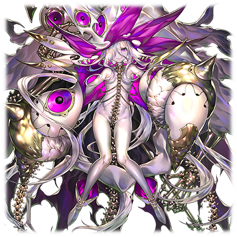

# Dr.尤巴尔·霍尔米斯达斯

| 角色信息   |          |
| ----------- | ----------- |
| 名称    |Dr.尤巴尔·霍尔米斯达斯|
| 年龄   | 不明   |
|职业|Metaverse创世时期的开发者 统治“工厂”的三贤者之一
|对应曲|Sqlupp|
|初出|Chunithm Amazon Plus|

## Episode 1 Metaverse的创造者

>吾辈名为Dr.尤巴尔。吾乃创造了Metaverse的，“工厂”的伟大科学家之一。

电脑的乐园，Metaverse。

身为人类的摇篮的这个世界，曾经，是由某个企业制造出来的电子基础设施为基础创造出来的东西。

在那个被称作Metaverse的黎明期的时代，有一个被称作“K.H.D”的企业，创造了某样革命性的电子基础设施。

靠着这个发明，K.H.D吸收了大大小小的各种企业，最终成长为了横跨全球的大型复合企业。

K.H.D吸收了来自世界各地的优秀人才和科学家。

在这些人之中，就有后世被称作“三贤者”之一的，统治着“工厂”的Dr.尤巴尔·霍尔米斯达斯的身影。当时的他，也是K.H.D的一名工程师。

随着K.H.D的发展，他们所创造出来的电子基础设施覆盖了整个地球，让世界合为一体。

人们的生活从此便置于建造于各地的管理AI之下。

不停重演的战争，毫无改善的环境污染……。

面对这个充满绝望和破灭的世界，人们终于意识到，能够管理这个未来的，并不是人类自己了。

他们除了依赖建造于各地的管理AI之外，已经别无选择了。

## Episode 2 第二次复兴
>在人类仍然持有着物理定义上的肉体的时候，吾等为了追求救济，选择了成为最初进入Metaverse的人们。

人类终于到了生死存亡的时刻。积年累月的环境污染已经让地面无法提供生物的生存之地了，而又因为争夺粮食和生存区域的原因，人们之间又不断地爆发着大小战争。

人类必须尽早找到他们的救济才行。而在这充满绝望的世界之中，站出来的正是超越了各国力量的超巨大复合企业——K.H.D。

所属于K.H.D的研究者们，很早就开始了研究，以求让人类这一物种能够在世界末日之前，升华为更加强大的存在。

而他们研究的结果，就是将人类生存的地方由地球上，转变为电脑世界之中。

为了让人类进入加速的空间中，成为理想的生存形态，就必须要移植进电脑世界——Metaverse。

而在这阵时间里，污染的环境就由以管理AI为中心的机械对地球进行彻底的大清洗。等到人类能够再次生存的时候，就可以让人类从电脑世界回归地上。

这，就是Metaverse计划。这正是机械为人们带来的救赎。

舍弃人类的肉体，成为电脑世界的居民这一计划，理所应当地引来了巨大的争议。

但是，在末日已经近在咫尺的当下，人类已经没有多少选择权了。而成为第一批进入Metaverse的K.H.D的技术人员们成功地适应了Metaverse的环境，于是，Metaverse的存在正式被人们所承认，开始了大规模的移植行动。

而以最初进行移植进入Metaverse的三名K.H.D.的天才技术人员们为中心，致力于Metaverse的开发，完善，运营的组织“工厂”就此成立。

设立了这个组织的Dr.尤巴尔·霍尔米斯达斯、Dr.梅德·巴萨奈德尔以及Dr.缇欧·梅尔基奥尔三人被称作“三贤者”。从此，他们便为了Metaverse和“工厂”的发展尽心尽力。

## Episode 3 持续扩张的世界

>利用机械来拯救人类是再正确不过的选择。而现在，整个世界正在不断地扩张着。即便我们“工厂”大权旁落沦为附庸也无所谓。

“工厂”在Metaverse建设的最初期，身为电脑的乐园的开发者，保持着绝对的权威。

然而，以人类遭遇了“大灾厄”为分界，在这之后的“工厂”选择了归顺于管理整个Metaverse的系统“框架主脑”，以微妙的平衡在这个世界中共生着。

之后，经过了好几轮的改造和升级，从超自然系统模拟器的运用代行者那里，终于诞生了君临于整个Metaverse的人工神明·艾克雷尔。到了在艾克雷尔之后统治了整个世界的统制主·提丰的时代，“工厂”已经彻底沦为了框架主脑的附庸。

但是，那些所属于“工厂”的科学家和技术人员们，本来就是一堆淡泊名利的家伙。只要有能够让自己潜心研究的环境的话，其他东西都无所谓。

特别是“三贤者”之一的尤巴尔，正是这种思想的代言人，对他来说，能够随心所欲按照自己欲望投放大量的资源用于他自己的研究的Metaverse，正是他求之不得的天堂。

尤巴尔每天都潜心于像在电脑空间内制造新世界，然后随手破坏掉这样的疯狂实验。

“EXCITING！！这种爽快感！这种感动的感觉！！这可是肉体凡胎绝不可能体验到的感觉啊！！”

提丰虽然将“工厂”视为自己的附庸，但却认可了他们的自由。

而且此时的提丰仍然困扰于“进化”这一可能性之中，尝试着用各种手段构筑和开拓世界，又在潜意识地鼓励着“工厂”的实验。

就这样，电脑的乐园进入了爆发性的扩张期。

## Episode 4 被讨伐的王·提丰

>就在世界的持续扩张之中，提丰被人杀死了。而涅墨西斯的攻击也越来越频繁。

为了追求进化的可能性，由提丰带领的“框架主脑”以及“工厂”在这个世界里进行了无数的实验。

实验的次数已经多到无法计算，而旷日持久的实验已经让他们甚至连原本进行实验的目的都要忘记了。作为其结果，就是目前的Metaverse中已经有了浩如烟海的，多姿多彩的无数世界。

即便身为神的权能再怎么强大，面对着爆炸性增长的世界，也无法完全管理，于是，框架主脑便将部分世界的管理权力交给了“工厂”。

就这样，“工厂”获得了一片独有的支配领域，从此和框架主脑之间形成了独特的自治关系。

虽然“工厂”依旧远离权力的中心，但是能够在Metaverse这个绝佳的试验场中获得一片让他们大展拳脚的天地还是十分幸运的。

求知欲永无止境的他们，为了追上框架主脑的技术水平，开始了各种各样的程序化身的开发。而尤巴尔就和提丰一样，即便是那些丧尽天良的人体试验，也乐于去做。

“哈哈哈哈哈哈哈！！只要为了吾等更上一层的实验的话，这点牺牲又算得了什么！？这可是神圣的框架主脑赐予我们的伟业啊！”

和尤巴尔一样同为三贤者的提欧，虽然对尤巴尔的行径感到不满和恐惧，但是令人讽刺的是，尤巴尔的激进试验硕果累累，从结果上看，Metaverse里诞生了许多种类的防卫BOT和探索BOT，这些各式各样的BOT让整个Metaverse的运作更加顺畅。

这阵时间，从某种意义上说，正是“工厂”和框架主脑的蜜月期。就在两者繁荣发展造福Metaverse的时候，某件事却让局势急转直下。

那件事就是曾经身为框架主脑的统制主·提丰，被自己开发的程序所杀死。

提丰的死亡对框架主脑的损伤是巨大的，失去了提丰的框架主脑已经损失了许多资源和能力，元气大伤的框架主脑已经无法统治无比宽广的整个Metaverse了。

鉴于这一情况，框架主脑选择了大幅度缩减自己管理的领域，就这样，一部分世界从此失去了自己的管理者。

而为了补偿框架主脑无法管理的部分，“工厂”接受了部分的世界，但是相比
神明般强大的框架主脑，“工厂”的统治能力就贫弱多了。

这也是Metaverse由盛转衰，开始慢慢步入毁灭的开始。

然而危机不止这些。由于提丰的死亡造成的框架主脑的弱化，那些憎恨着Metaverse，想要毁灭Metaverse的恶性程序化身“涅墨西斯”也开始出现在人们的视野之中。

Metaverse已经不再是人类能够宛如赤子般安宁享受的世界了。

“工厂”和框架主脑，已经到了不得不联合起来，面对危机的时候了。

## Episode 5 全天二十一星的诞生
>为了对抗涅墨西斯，吾等开发出了MDA型号这一强大而完善的程序！

袭击Metaverse的涅墨西斯虽然数量不多，但每一体的力量都很强大，已经有不少世界在他们的攻击下毁灭，沉入混沌之中。

看着世界遭受涅墨西斯的攻击，框架主脑和“工厂”，不得不开始制定策略对抗涅墨西斯的攻击了。

在这其中，框架主脑将自己所拥有的高端技术的情报公开给了“工厂”。

在这些数据中，就有曾经提丰所进行的，“人和程序之间的融合实验”这一禁忌的实验内容。

“这实在是太棒了！！！竟然还有MIR系列这样的存在！！竟然还能想到利用人类作为基底，从而使得完成的个体拥有迄今为止未能拥有的‘进化和不确定性’这一特征啊！！真不愧是曾经统治Metaverse的提丰！！这是何等绝妙的主意！”

“……不过，如果身为基底素材的人类适合率不够的话，也是做不出来的。从框架主脑的数据中我们并未能获知关于适合率的信息。完全没法保证这个计划的实用性啊。”

“那么，只要不停地实验，直到找到天然拥有很高适合率的个体出现就行了。”

“当真？如果真的这么做的话，这根本是大海捞针，也得经历成千上万的实验才行啊？”

“怎么会……”

尤巴尔冷酷无情的提议让提欧脸色发青。

“……尤巴尔！梅德！你们真的明白吗！？实验失败的话，也就意味着实验体的死亡啊！？你们真的想持续这么残酷的人体实验，几千几万次吗！？”

提欧的悲叹并未传入尤巴尔的耳中。梅德也是，望着尤巴尔的脸，点了点头表示赞同。

“这是当然的。科学这种东西，本就是需要成千上万次的实验和试错才能一步一步地向前推进的。明明提欧你也是一名科学家，这样简单的道理怎么能不懂呢？”

“可是……”

“……呐，提欧，虽然这样的选择会让我们牺牲成千上万的人，不过如果我们这样放任不管导致无法开发对涅墨西斯的程序的话……整个世界，整个Metaverse很可能就会直接毁灭的。到时候，全部的人类都会跟着一起陪葬的。”

“……”

“所以，吾等现在所做的，不过是必要之恶……是为了拯救世界所需的恶事啊！”

“……我明白了。虽然我很清楚实验确实是必须的，但是，我才不会用‘必要之恶’这样的借口来麻痹自己，忘记自己所犯下的罪孽啊！”

提欧这么大喊着，离开了会议室。尤巴尔一脸惊讶地目送着提欧离开，梅德则是露出了怜悯的眼神。

“……提欧……不管到什么时候，她都是这样，留着点人类的思维……不，应该说是幼稚的思维吧。现在的我们，早已经和曾经以人类活着的我们是截然不同的存在了啊……执行实验的时候，认为自己是‘机械’的话，说不定还能够更轻松一点的……可是她却不这么做……不，应该是做不到的吧……这样的活法可是很辛苦的啊。”

“不管怎么说，这就算是告一段落了。为了拯救Metaverse，我等无论如何都要造出强大而美丽的程序啊！”

就这样，“工厂”开始了人和程序的融合实验。而正如他们所说，在无尽的实验之中，远超他们想象的实验体在他们的手中丧生。但是，三贤者他们最后仍旧创造出了被称为“MDA系列”的程序。

MDA系列和迄今为止的BOT程序不同，搭载了和人类一模一样的精神模块，又拥有和框架主脑那些程序相似的特征，正是符合“强大而美丽”这一标准的程序化身。

虽然仍未做出MIR系列那样的融合体，但是在这片领域首战告捷这一事实，令尤巴尔走向了更加疯狂的实验中。

“真是太棒了……MDA系列的各位，正是照耀着这个最黑暗最混沌的时代之中的，最耀眼的一等星啊！！”

就这样，以闪耀于天空中的二十一颗一等星命名的MDA系列，在他们最擅长的领域大展身手，从涅墨西斯的手中保护了众多的世界和人们。

## Episode 6 禁忌科技的孩子们

>涅墨西斯的威胁越来越激烈。在这种情况下，吾等开始制作人类和程序和涅墨西斯的融合体。

MDA系列的程序们就像夜空中闪耀的流星一般，在战场上大显身手，击破了无数的涅墨西斯。

人们期待着涅墨西斯的威胁消除，Metaverse能够再次回归和平，然而不久，更加深邃的黑暗就吞没了MDA系列的光辉。

涅墨西斯开展了更加疯狂的攻势，压制住了MDA系列的活跃。特别是以“混沌之器”为首的涅墨西斯的王们，以猛烈的攻势席卷着整个Metaverse。

框架主脑虽然和“工厂”之间通力合作，尽力救助着自己所属世界的人们，但是整体的战况却每况愈下。

在这之中，“工厂”的三贤者收到了他们一直很感兴趣的涅墨西斯的数据。这些数据正是人类被涅墨西斯侵蚀之后质变产生的产物。

这数据不是别的，正是“工厂”的最高杰作之一的MDA-01【天狼星】所带来的，被称作“修伯利斯”的涅墨西斯个体的数据。看到这个数据的瞬间，尤巴尔的脑中闪过一道霹雳。

“……就是这个！就是这个啊！这就是我们的计划欠缺的最后一片拼图啊！！”

修伯利斯的数据虽然已经因为战斗损坏了大半，剩下的只是一些残垣断片而已。但是尤巴尔竟然从这些数据碎片之中找到了关键，成功的尝试将这些解析出来的东西装入了MDA系列的生产线中。

最后诞生的，就是MDA-21【轩辕十四】。她正是结合了框架主脑的程序，人类的碎片数据，以及涅墨西斯的数据所构成的混合体程序……。可以说是“工厂”制造的程序里，距离MIR系列最接近的存在。

虽然轩辕十四在稼动初期因为涅墨西斯的缘故产生的破坏冲动引发了数次暴走事件，但也在众人努力之下安定了下来，并且发挥了前所未有的作用，在和强敌的战斗中，像人类那样成长了起来。

“……程序、人类，以及涅墨西斯……只要有这三样元素合而为一的话，吾等也能够成功踏入神的领域……吾等能够靠着自己的双手造出宛如MIR系列的存在那样的日子，已经不远了啊！！”

## Episode 7 铸造崭新的翅膀

>某天，吾等和框架主脑的联系被中断了。情况紧急，看来无论如何都要制造能够进入涅墨西斯领域探索的存在了。

程序，人，涅墨西斯。以结合了这三种要素的防卫程序BOT“轩辕十四”的诞生为契机，“工厂”开发出了许多全新世代的MDA系列机型。

本以为有了全新力量的加成，“工厂”就可高枕无忧的……然而。

“为什么！？为什么我们做不出像MIR系列那样的‘进化’程序！？”

以尤巴尔为首的“工厂”的科学家们，虽然制造和改良了众多的MDA系列，但却未能产生足以匹敌MIR系列强度的程序。

另外，因为“工厂”制造了大量的MDA系列，防卫体系也初见成效，提欧于是主张了停止必要范围以外的人体实验的方针，梅德也表示了赞同。三贤者中的两人现在站在了尤巴尔的对立面，对他来说并不是个好消息，因为这意味着他无法像以前那样大张旗鼓地进行试验。

就在“进化”这一程序的开发计划即将就此腰斩的时候，某件大事发生了。涅墨西斯向整个Metaverse发起了大规模的攻击。而结果就是框架主脑和“工厂”之间接壤的领域被敌人切断。

三贤者派出了全部的MDA系列，才终于将攻击“工厂”的涅墨西斯击破。但是，那个时候的涅墨西斯，已经超出了他们的预想，以更快的速度“进化”着。

“……只靠现有的MDA系列的话，估计难以应对在这之后的激烈战斗了吧，虽然很遗憾……”

“那么，直接重启之前的实验就行了吧？”

尤巴尔和梅德的话令提欧陷入了沉思。

“……是呢。现在的当务之急就是确保有足够的力量能够迎击涅墨西斯。而且只靠目前的MDA系列的力量的话，是无法重新和框架主脑取得联系的……”

听着提欧的话，尤巴尔露出了笑容。

“就是这样！如果要和框架主脑的传送门再次联系上的话，就需要有能够穿越涅墨西斯支配领域的能力啊！为此我们制造的东西，必须拥有强大的战斗能力，以及探查能力！最后，就是能够在危急关头对应战况‘进化’的系统啊！”

## Episode 8 ES计划，启动

>为了再现MIR系列的奇迹，“工厂”选择了一对姐妹。这都是为了拯救世界必须的牺牲。

为了能和框架主脑再次连接，“工厂”正式开始了ES计划（Explorer Survive），开始了正式的实验。

他们的目标是打造出能够突破凶险的涅墨西斯领域，找到连接框架主脑的程序，在遭遇不测的时候能够利用“进化”这一机能自我突破困难的强大程序……换言之，就是能和曾经的MIR系列分庭抗礼的自立型探索程序。

但是，即便是曾经开发过众多MDA系列的三贤者，在开发MIR系列的时候也陷入了苦战之中。

说到底，MIR系列的设计图从一开始就并未展露全貌，从框架主脑获得的数据中，相比其它的内容，反而有着诸多的空白，仿佛被人刻意隐瞒了一样。

于是“工厂”就沿用了制造“轩辕十四”时候的经验，以涅墨西斯相关的个体作为融合体的基底。这样的结果就是，对于实验体的素质要求更高。“工厂”必须选择那些既拥有很高适应性，又拥有能够忍受破坏冲动和痛苦的强大精神力的实验体才行。

要问为什么的话，这次的实验需要无数次地对同一个实验体进行改造和尝试。

这个实验不仅会因为改造身体造成的负荷导致组成身体的数据损失，甚至还会引发精神污染等负面效果。所以为了能够找到经受这上刀山下火海一般的考验的，拥有强大自我意识，又拥有很高的涅墨西斯适合率的人类，“工厂”只能在残存的人类之中进行挑选。

最后挑选出来的，是一对仍旧年幼的姐妹俩。想象着两名仍旧懵懂的少女之后即将遭受的残酷命运，提欧就不禁感到恐惧。

“……尤巴尔，难道不能选择那些一定年龄以上的人进行试验吗？”

“这和年龄没有任何关系。唯一相关的只有适合率。……而且仅因为她们年幼就放弃实验什么的，这不过是一种伪善而已。”

“……”

获得了“拯救人类”这一大义名分的尤巴尔，目前的行事风格已经没有一丝道德和伦理的顾虑了。

尤巴尔毫不犹豫地执行了对那对姐妹们与程序之间的融合实验。

最初，姐妹俩还因为痛苦而不禁喊出了声，但自从她们领悟到不论怎么样哭喊，求救，都不会有人来救她们之后，惨叫声就渐渐的微弱了下来，甚至连感情都消失了，只剩下些许的呻吟而已。

为什么少女们非得被选中参加这样残酷的实验呢？为什么她们非得背负这样的责任战斗呢？

她们无法得知答案，只能在宛如地狱般的实验室之中承受无尽的实验。

## Episode 9 试作型探索程序

>在经历了无数的实验之后诞生的产物，就是被称为XES和XGN这两体程序了。虽然身为实验体的她们似乎有些“不满”……

被选为ES计划的姐妹俩所迎接的，是常人无法想象的残酷实验。

她们本来的身体被切割，分解，重组，而自己的脑子里则被填入了自己以外的“别人”的人格。

也许就这么失去自我，最终疯掉还比较幸福呢。

然而，“保持强烈的自我意识”正是试验成功的必要条件，所以为了保持她们的意识，每时每刻都要投放相应的药物，以维持她们不论遇到如何的精神冲击或者肉体上的痛苦，都能维持意识存续。

在这样无血无泪的长期而残酷的实验的最后，“工厂”终于制造出了两体程序——XES-72 狄安娜·普利梅拉，还有XGN-72 露娜·诺瓦。

她们毫无疑问是继承了曾经MIR系列的少女们身上的“进化”这一机能的自立探索型程序，正是人类靠着自己的双手制造出来的，神之翼。

面对自己亲手创造出来的最高杰作，就连尤巴尔也为之欣喜若狂。

“太棒了……！！这……这正是吾辈亲手创造的神迹啊！！！”

即便是三贤者的另外两人，梅德，以及对实验本身并未抱有积极态度的提欧，也对狄安娜和露娜的诞生难掩自豪之色。

“真是厉害！这样就能够和框架主脑再次建立联系了！”

“是的……这样的话，应该就能够将世界从涅墨西斯的威胁中解放，Metaverse也能够回归和平了吧。”

……然而，和周围充满希望的气氛不同，狄安娜和露娜的脸上却没有一丝欣喜的表情。似乎她们仍旧未能忘记曾经持有肉体时的记忆。

“……你们俩这是怎么了？现在的你们，正是人类的希望的具象化啊……惦记那点儿曾经身为人类的记忆对你们来说只是水中捞月罢了，毫无意义。来，赶紧把这些无关紧要的东西忘掉，赶紧前往框架主脑吧。”

“……”

现在，支配着狄安娜和露娜行动的，正是制造了她们出来的尤巴尔。面对尤巴尔这毫不在意二人的话语，姐妹俩只能怒目而视。

## Episode 10 贝尔泽布特·强袭

>吾在前哨基地遭遇了贝尔泽布特的强袭，遭受了重伤。没办法，还是先回“工厂”从长计议吧。

狄安娜和露娜的诞生也让ES计划进入了佳境。

尤巴尔将姐妹俩的调整交给了提欧和梅德，自己则前往了位于涅墨西斯领域之中的，用于捕获涅墨西斯单元的前哨基地，为了提升姐妹俩的能力，进行着涅墨西斯的研究。

然而，“工厂”的资源在完成狄安娜和露娜的调整之前就到达了极限。

已经没有时间了。“工厂”只能派出仍未调整完全的狄安娜和露娜前去框架主脑再度建立连接。

之后，出发的狄安娜和露娜在前哨基地与尤巴尔汇合并且交流数据的时候，遇到了神秘的涅墨西斯个体的攻击。

自称为“贝尔泽布特”的青白色的女性涅墨西斯将驻守于前哨基地的MDA最新型“弧矢二”组成的防卫队轻而易举地破坏掉，对尤巴尔造成了致命的伤口，之后就离开了这里。

“咕……！这……难道说……甚至连‘精神复制体’（アストラルコピー）都伤到了吗！？……真没辙啊……”

精神复制体（アストラルコピー）正是人们在Metaverse中的，负责记录心和记忆的记忆媒体，从另一种角度来看，也可以说是人的“灵魂”。

在三贤者移植进入Metaverse以来，虽然他们的身体经历了无数次的改造，但是内部的精神复制体却从未进行过替换或者改造，仍然保持着当时的原样。如果这东西真的被破坏的话，那这也就意味着完全的死亡。

尤巴尔带着自身的精神复制体撤回了“工厂”，继续命令狄安娜和露娜前往涅墨西斯领域进行探索。

## Episode 11 涅墨西斯，大军袭来

>吾等刚一回到“工厂”，就看到了泰斯塔蒙特的大军袭来。这可真是不妙了啊。

尤巴尔在贝尔泽布特的猛攻下，不但连身体都被破坏，甚至伤到了精神复制体。但是他还是尽可能地保留住了其他部分，安全回到了“工厂”。

在将剩下的精神复制体移植到新身体内之后，尤巴尔叹了一口气。

“真是的……这次可真的是被害惨了啊……虽然没法完全恢复，不过能够在涅墨西斯的王‘混沌之器’面前捡回一条命也算是命大啊……”

就在为这侥幸而欢欣之时，“工厂”响起了紧急通知。

“怎么回事！？”

“打开屏幕！！”

“什么！？怎么会！”

看到屏幕上出现的东西的时候，三贤者都大惊失色。

要问为什么的话，屏幕上显示的，正是“混沌之器”之中的其中一人——终焉的奏者·泰斯塔蒙特。

“……那么，小虫子们，来和我玩玩吧？”

眼前的敌人，正是和贝尔泽布特和阿雷斯拥有同等实力的“混沌之器”的一人，与之相对的，“工厂”的实力在敌人面前不过是螳臂当车。

唯一能够调用的MDA系列，从之前的前哨基地的战斗来看，估计也只能拖延一小点时间。

提欧，梅德，以及仍未痊愈的尤巴尔，陷入了九死一生的绝境之中。

曾经建立起Metaverse，成为最初的电脑的乐园之居所的“工厂”，其漫长的历史，似乎也将走到尽头。