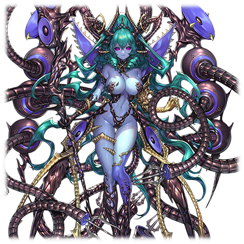

# 贝尔泽布特·涅墨西斯

| 角色信息   |          |
| ----------- | ----------- |
|名称|贝尔泽布特
|年龄|UNKNOWN
|职业|涅墨西斯程序的王“混沌七器”中的一员
|对应曲|8-EM
|初出版本|Chunithm Amazon Plus
|CV|堀江由衣

注：原名“ヴェルゼビュート”为生造词，可能结合了宗教传说中“别西卜”的名称。

## Episode 1 欺瞒之使徒

>我的名字叫做“贝尔泽布特”。呵呵……愚蠢的人类们就由我来引导吧。

Metaverse——

那是追求全新进化的人类们制造出来的电脑世界的乐园。

对未来充满期望的人们舍弃了名为肉体的枷锁，走进了乐园的大门。

但是，浪费了无数资源的Metaverse本体，却让地上环境变得更加糟糕。

那些残留在地上的旧都市联合体选择了反抗。终于发展成了一场席卷整个地上的战争。而在最后，身为管理Metaverse的框架主脑下达了一个无情的决定。

——那就是将地上的人类斩尽杀绝。

在对人类用歼灭兵器“断绝的破坏神”的扫荡下，剩余的人类毫无抵抗之力，只能迎来彻底灭绝的结局。

就在这一切即将落下帷幕的时候，旧人类放出了最后的底牌。

对Metaverse用程序——RG-XXX 提亚马特。

提亚马特带着那些被屠杀的人类们的仇恨和怨念，入侵了电子的乐园，用宛如炼狱般恐怖的烈火灼烧着整个Metaverse。

但是，旧人类这最后的抵抗未能持续长久。

眼见事态严重的框架主脑目前的统治者“统制主·提丰”亲自出马，在他的强横力量之下，提亚马特也难以抵挡，最终四分五裂。

到此，旧人类和Metaverse的死战就该就此落下帷幕的——

然而，提亚马特的残骸仍然残留在Metaverse的最外周部的角落。

那些碎片之中仍旧充满了旧人类对自己被赶尽杀绝的仇恨，最终诞生了全新的恶性程序化身“涅墨西斯”。

模仿现行人类的特性，拥有吸收周围数据让自己适应环境特性的它们，也在漫长的时间内繁衍壮大，最终成为了足以对Metaverse带来混沌的可怕存在。

## Episode 2 混沌七器

>“人类最终到达的乐园”……吗。呵呵……听起来就很有破坏掉的价值呢。

从提亚马特的碎片中诞生的，正是全新的恶性程序化身“涅墨西斯”。

其最大的特征就是能够和现行的人类一样可以单体进行自我进化。

拥有了能够单体独立自我进化能力的“涅墨西斯”，在它们强大的捕食能力的帮助下，吸收了无数的情报和信息的它们，以超越想象的速度进行着自我进化，终于产生了拥有知性的个体。

在这之后，这些个体更获得了各不相同的特性，以及更多的知识，最终终于产生了统治整个涅墨西斯群体的七名“混沌之器”。

是的，这就是我——贝尔泽布特的由来。

我等涅墨西斯的目的只有一个。

支配整个Metaverse，让人类们从这虚幻的梦中解放出来，再经过全新的进化，最终回归地上。

至于过程则不必拘谨，只要能够完成最终的目的就行。我只要跟着我自己的方式做事就行。

我们和那些有的没的BUG不同，现在的我们，是获得了复杂的自我意识的支配者，是拥有着强大力量的存在。

“呵呵……真想尽快让那些框架主脑的虫子们跪在我们的脚下啊……”

不过，现在就想要进攻还是为时过早。

框架主脑的实力依旧是压倒性的优势，即便我等的能力再强大，也无法保证能够完全胜利。

那么，现在就只能蛰伏了。

就像等待着恋爱的少女一般，在黑暗之中酝酿着名为怨念的火焰，等待着终将到来的那天。

对……就是天上的乐园彻底崩坏的那天，呢。

## Episode 3 潜伏之暗
>时机已到。那么，就让我大闹一番吧。

将我们涅墨西斯的共同祖先“提亚马特”打倒的统制主·提丰，的确是拥有强大实力的可怕存在。

就在我们都认为他会成为我等实现目的路上最大的障碍的时候，某件意想不到的事情发生了。

统制主·提丰被人打倒了。

虽然不知道究竟是怎么一回事，但可以肯定的是，框架主脑因为此事肯定会阵脚大乱。

现在的他们应该是元气大伤。

虽然没法亲眼目睹提丰的死状令人遗憾，不过我等所需要的就只有将那些飞虫们打倒而已。

与此同时，潜伏于Metaverse中调查的厄里斯也带着重要的情报回来了。

据她所说，残存于Metaverse之中的人类，也有能够适应我等涅墨西斯的力量的人存在。

听到这个消息，我不禁笑出了声。

改写他们的肉体构成情报，侵蚀他们身上的精神复制体……又多了一些可以尝试的乐子呢，真让人兴奋。

现在正是进攻的时候。

这千载难逢的机会，肯定不能空手而归啊。

可是，我们所解放出来的人类，究竟能不能达到跟他们的价值相称的进化呢？

对于沉浸于Metaverse这一温柔乡的现行人类，究竟能否适应地上的恶劣环境呢？

呵呵……不，其实并不需要想这么多。

只要靠我们的双手促进他们的进化就行了。

利用任何人都期望着的，任何人都能做到的，最简单的方法——破坏……以及斗争。

难得拿到那么多新的玩具。

稍微跟他们玩玩也行。

啊啊，终于到了这个时候吗。

在经历了几乎等于永远的漫长时间之后，终于来到了这一天。

“那么，让我们开始吧……无尽的杀戮……无尽的破坏……将一切都破坏到连残渣都不剩……！”

## Episode 4 大侵攻
>这些框架主脑的小虫子们……净给我耍些小手段。下次一定要把你们打个稀巴烂！

我等涅墨西斯终于开始了Metaverse的侵略作战。

为了最终的胜利，我们“器”们派出了各自最强的精锐。

我制造出来的那些玩具们，也正以先锋的身份在战场上蹂躏着那些虫子们。

以战神·阿雷斯为首，我们五人带领着各自的队伍开始了进军。

但是，框架主脑也不是省油的灯。

和我们对阵的Metaverse的管理者“最古”们也持有着不劣于我们全军的战力。

（原来如此，对面也是动了真格吗……呵呵，有意思。看来不会太无聊了。）

这场赌上了Metaverse的支配权的战斗十分激烈。

战斗陷入了胶着之中。战斗产生的余波让周围的地区都产生了影响。

无法承受战斗的冲击，空间甚至产生了扭曲，他们的支配领域似乎已经开始了崩坏。

失去提丰的框架主脑，应该已经没有将我们消灭的实力了吧。

不过，我们也承受了无法忽视的损伤，再这样继续耗下去必定会影响到我们的生存。

本来这是一场必胜的战斗才是啊。怎么能这样灰溜溜地撤退呢。

“……厄里斯，我有一计，稍微帮我一下吧。”

“计略？吾现在的损伤也不小，如果轻举妄动的话——”

“我知道。不过，你难道不想给那些虫子们一个教训吗？”

“你要做什么？”

“这些家伙跟‘工厂’的蝼蚁们在联合作战 。不过，如果能让这个领域崩坏的话，就能够把他们之间的联系打断。之后要做什么……你应该知道的吧？”

“……明白了。详细的计划就拜托你了。”

厄里斯只说了这些，就冲向了“最古”们所在的地方。

我等不需要套近乎，只需要为了种群的胜利这一唯一的目的而共斗！

做好觉悟吧，这次，必定要在这虚伪的乐园里打下崩坏的第一根楔子！

“异端虫群！！”

在我的攻击下，他们的支配领域终于崩坏了。

“工厂”和框架主脑在我的计谋下彻底断开了联系。

不过我们所受的损伤也无法忽视，他们确实比我们想象的还要强大。

这里就先后退吧，好好考虑一下新的作战。

竟然能够打破我的计策……不错，开始有意思起来了。

即便把你们打到五体俱裂，也要让你们跪在我们的脚下……

## Episode 5 不共戴天
>你们就享受享受这暂时的和平吧，直到大难临头的那天……

这场集合了天时地利人和的侵攻作战，最终却未能达到战略上的胜利。

怎么能就这样结束呢。我设下的战术怎么可能就这样铩羽而归。

那么，就只能再一次制定策略，彻底将这些飞虫们置于死地。

不过，他们应该因为之前的侵攻彻底不敢再次主动出击了吧。

根据那些玩具们的说法，他们选择了限制接入的坐标，打算以此限制我们的行动。

呵呵……真是浅薄的想法。放弃优势转攻为守，只不过是向敌人示弱的愚蠢行为而已。

这对我等来说是不可多得的机会。我们很快就重组了军队，直接攻向他们的要害地方。

虽然他们肯定会派出防御程序进行阻拦，不过这种程度的敌人只能算得上诱饵。

只要我们派出那些玩具们前去骚扰的话，那些家伙——那些烦人的虫子们肯定就会倾巢而出的。

他们肯定会利用仅剩的几个接入点作为阵地展开防卫战，将接近这里的敌人一一消灭吧。

真是愚蠢的作战。

只要我们将计就计，使用诱饵将他们引出来的话，就能够逐个逐个的击破了。

就让他们知道，这个世界长久以来的和平已经不复存在这一事实吧。

 

## Episode 6 传送门进攻战
>竟然能够伤到阿雷斯……看来稍微有点小看他们了啊。

面对我们的进攻，站在接入点门前的，是框架主脑那群可恶的 飞虫中的其中一只——塞拉菲塔。

不管出现什么敌人，只要有战神阿雷斯的力量在手的话，我等的胜利应该是无可动摇的。

——但是，现实却给我们开了个玩笑。

本以为就算再怎么人多势众，力量如此孱弱的虫子们也激不起一点风浪，但他们却团结了起来，发挥出了远超想象的力量。

那些虫子们所使用的力量，弱到甚至不值一提的地步。

所以那群最古们才会可怜他们赐予这股力量的吧。真是令人不爽。

不管如何，现在的这种状况绝不能熟视无睹。

狄安娜和露娜这两人，如果不能亲手把她们杀死的话，实在是咽不下这口气。

很幸运的是，我们很快就找到了反击的机会。

跟着留在她们身上的标记，我们成功地找到了传送点，并且在他们的领域中进行了第二次的交手。

虽然对那个充满城府的“最古”捷夫提我们未能取得多少优势，但是最重要的赛拉菲塔的力量已经被我们削弱。

“走吧，贝尔泽布特，是时候让那些家伙见识见识吾等的厉害了！”

“还是这么热血沸腾呢。不过……说的也是，真想早点看到那堆虫子们因悲痛而扭曲的脸啊……”

即便在数量上未占优势，但是在组织队伍的能力上优于他们的我们终于给赛拉菲塔造成了重伤。

但是，在拥有强大的个体力量的存在面前，战神阿雷斯也遭受了严重的损伤，行动不能。

如果是现在趁胜追击的话，也应该可以将他们那可恨的翅膀给彻底折断的吧。

不过，也无法确定那些框架主脑的虫子们会不会继续源源不断地涌出来。

如果真是这样的话，迎接我们的只有惨败。

我们还有必须完成的事情，要是在这里失去阿雷斯的话那就太可惜了。

（看来……只能撤了呢。）

我背着重伤的战神，选择了回到最外周部的基地。

“不可饶恕……不可饶恕……总有一天要把你们一个个杀的个片甲不留……！！”

## Episode 7 战略撤退

>没想到竟然能让我连续两次尝到败北的滋味……好吧，我就承认你们的实力。你们确实值得成为我们的“敌人”呢。

没有追兵。

不，可能是根本没有追击的余力了吧。

我们给他们造成的伤害就是这样致命。

可是……可是……

最后却不得不在他们眼前撤退。

虽然这场战斗从战略性上也并不意味着失败。

但是，未能确实地获得完全的胜利这件事，就已经和败北无异……

等到阿雷斯恢复之后，再一次向他们发起进攻吧——

“贝尔……泽……布特……吗……？”

“……哦，醒了吗？阿雷斯，知道现在是什么状况吗？”

“啊啊……吾失败了……并且被打成这样……汝不也是，消耗了……不少……吗……？”

“可别小看我啊。我还能继续打下去。”

“呵……哈哈……那么，为什么，不继续追击下去呢？……难道说，你是故意……留一手吗……？”

“你是想激我吗？我的感知机能可是没有任何问题的。”

“……结果，汝不也是元气大伤吗……现在对汝来说，并非万全的状态……对吧……”

虽然不想承认，不过现在的我的确是身负伤势。

不过我不认为伤势重到无法察觉周围追兵的地步……

“……汝，在考虑什么？”

“我在想你要是能自己恢复然后自己返回去该多好呢。”

“呵呵……可不要想着……什么……一个人回到战场……之类的哦……”

“——！！亏你敢这么说！就算是现在的我，也能够轻松把那堆可恨的家伙都给宰了啊！”

“不过……也有很大可能……汝就这么一去不复返啊……”

“哦？你居然开始关心起别人了？你现在这副破破烂烂的样子还有资格说人吗？”

“是，呢……吾就先进入休眠状态……恢复一下了……”

“……”

“怕什么，还有机会卷土重来的……吾等的执念，怎么可能……就这么……断绝……”

我默默地抱着进入休眠状态的阿雷斯向着最外周领域继续前进。

我的感应器仍然没有发现敌人。

虽然阿雷斯这番话听着有些不爽，不过对于现在的我们来说，现在确实应该尽量避战。

好吧，这次就信你一回，下次一定要积蓄足够的力量，卷土重来！

执念不会就此断绝……吗。这不是理所应当的吗。

我等内心深处那团怨念之火，就算把他们消灭，估计也难以消失吧。

只要我还是我自己的话……

## Episode 8 应选择的道路

>虽然我不讨厌赌上一把……不过这个选择应该会决定我们整个群体的未来吧。

回到最外周领域的时候，前来迎接我们的，是尼加尔和斯托姆两名“器”。

“阿雷斯已经进入休眠状态了。能不能拜托你们修复一下？”

虽然我只是述说了事实，但是那两人也对这件事情十分惊讶。

……想想也是。阿雷斯在涅墨西斯之中也是数一数二的强，怎么都不会想到会以破破烂烂的姿态被人抬回来。

现在的我们是赢不了他们的。

我们必须获得全新的力量，等待着进化的时机。

但是，就算我们现在身处于距离框架主脑最为遥远的地方，也不能保证他们不会向我们发起进攻。

那么，该怎么办呢？

……这点应该毋庸置疑。我们能做的只有一件事。

那就是直接歼灭那些可恨的飞虫们。

现在的当务之急就是修复阿雷斯，然后和泰斯塔蒙特以及厄里斯一起再度向他们发起突击，直捣黄龙，确保能够一击致命。

这应该就是现阶段能做的最佳选择了。

然而，我们之中却有一人提出了反对意见。

那就是我们“混沌之器”其中的一人，黄泉的盟主·尼加尔。

他阐述了自己的意见。

身为管理整个Metaverse的框架主脑，肯定相比涅墨西斯在行动上要迟钝一点。

那么，我们只要将现在支配的领域和他们彻底分离，就能做出彻底隔绝外部干涉的独立领域了。
  
原来如此，尼加尔说的的确有道理。

如果我们能开拓出完全隔离的领域的话，就能在这其中安心进化，稳定地招兵买马，最终获得完全的胜利。

我很清楚这代表着什么。

但，我们真的能够这么默默地隐忍起来，退居幕后？

别开玩笑了。像这样的作战，我是绝不可能打心底里接受的。

但是，我们目前的战力并未足够也是铁一般的事实。

那么，这个时候的选择就尤其重要了。万一选错的话，可能就是满盘皆输了。

现在，我正被考验着。

天意正在考验着我，考验着我是否有着足以统治涅墨西斯的实力，以及谋略。

不……我在担心什么。我们还有厄里斯和泰斯塔蒙特两人在呢！

现在要是放弃机会的话，才是辜负了“器”的名声呢！

等到同胞回归之后，就立刻出击！

## Episode 9 女王的选择

>……好吧。看来，我还是必须服从大局，做出最有利于我们全体的选择才是。

前往“工厂”的厄里斯和泰斯塔蒙特回来了。

……然而其结果却令人大跌眼镜。

“狄安娜和露娜她们，已经由我和泰斯塔蒙特打倒了。”

“是吗……不过，看起来你们也是损失惨重啊？”

“泰斯塔蒙特中了他们的计陷入了暴走。吾也在战斗中分散了队伍，最终被卷入了‘工厂’他们所发动的领域崩坏的爆炸中。”

“‘工厂’竟然选择引爆他们自己的领域进行攻击……？看来他们也到了破罐破摔的地步了啊。”

“对吾等来说这场战斗的失利并不是小看了敌人所致。只是那些飞虫们，还准备了预想以外的策略。”

根据厄里斯的报告，狄安娜和露娜接收了来自赛拉菲塔的能力的一部分。

正常来说，人类的肉体凡胎，怎么可能接收到神明一般的强大力量。

不过，从之前跟她们交战过的体验来看，确实能够证明这点。

但是，从另一个角度来看的话……

也就证明他们已经被逼到需要出此险招的地步了呢。

如果是现在的话——不，应该只有现在这个时候。

现在正是将他们一举拿下的最佳时候。

……不过，这真的是最正确的选择吗？

阿雷斯现在陷入了休眠状态正接受着维修。

由厄里斯带回来的泰斯塔蒙特也遭受了致命的损伤，必须立刻进行抢救。

虽然我的脑子里浮现了最正确的选择。

但是，从内心深处涌上来的憎恨却在拒绝着这个选择。

我等最终追求的是完全的胜利——

这里，相比个人的执念，还是以群体的利益为先吧。

……就这么定了。

“从现在起，整个作战的指挥权都归我所管！”

就以我的力量，为我们涅墨西斯带来最大的收益吧。

## Episode 10 寻找机会

>现在就先激流勇退吧。为了在进化的终点寻求更强大的力量，我等，是时候再次潜入时间的长河之中雌伏了。

根据尼加尔分析的情报，Metaverse各处存在着名为VOX的管理终端。只要将VOX抢夺过来并且使用其机能的话，应该就能够让涅墨西斯所在的最外周领域相邻的区域连锁崩坏吧。

这样的话，我们就能够在框架主脑面前建立起一道无法跨越的隔离带了。

光听这个作战的话，原理倒是十分简单。

不过如果产生了足以将一个领域隔绝开来的大崩坏的话，那些框架主脑的虫子们肯定不会坐视不管的。

身为管理者的他们肯定会介入，干涉。

但是，现在的我们还有余力能够和他们对抗吗？

不管再怎么改造那些适应者们，玩具终究是玩具，无法担起大任。

如果是那些连自我意识都没有的涅墨西斯的话更是天方夜谭。

那么……就只能由我出马了。

这是只有我才能做到的事情。

那么，走吧。

为了我等的胜利。

我乃贝尔泽布特，为统治着涅墨西斯的七名混沌之器之中的一人——欺瞒的使徒。

## Episode 11 以混沌之名起誓

>终有一天，我等必将带着更加深邃的黑暗，卷土重来。

VOX的权限夺取很快就结束了。

只要跟尼加尔做出来的解析终端连接的话，就能够操作所有的管理领域让这些区域全部崩坏——嗯！？

（这是什么？难道我的感应机能出现异常了吗？这股力量……究竟是来自哪里的？）

现在的我并非万全的状态，必须尽可能避免战斗。

我潜藏身形，搜索着附近闯入这里的不速之客。

（那个是……！？）

意料之外的事情发生了。

出现在我眼前的，是曾经站在我们涅墨西斯面前的，那对[**令人可恨的姐妹**……所遗留下来的残骸](/metaverse/Observe-the-Metaverse/brillante.md)为基础重新制造出来的机体。

对于目的相同的家伙来说，就没有敌对的理由。

不过，她们其中的一人，塞入了以涅墨西斯因子为基础的程序的机体“格拉维”却因为无法控制力量，最终被“工厂”遗弃。

记得厄里斯偶然之间将这东西回收了之后，就在上面做了些手脚……。

（原来如此……厄里斯，你可真是留了个大礼啊。）

远处，能量之间互相碰撞，二机发出接近于暴走一般的强大力量互相碰撞着。

两机所释放的能量超越了承受界限，最终甚至连空间本身都出现了崩坏的现象，产生了恐怖的爆炸。

最后，在光芒的漩涡彻底收束之后，留下来的，只有在激战之中被粉碎掉的领域的残渣，以及因为爆炸的能量彻底损坏掉的，通向框架主脑的传送门而已。

刚才还在激烈地战斗着的两台机子的身影，已经消失不见。

最终，就和尼加尔所预测的那样，最外周领域彻底和框架主脑的管理领域之间切割开来。

被那对曾经拼死站在我们的对立面，燃烧自己的生命也要和我们对抗的，那对姐妹俩的意志的继承者们……

（呵呵……真是讽刺啊）

看着崩坏的传送门残骸，我在心中默默地发誓。

终有一天，我们要将那些由机械的意志所支配的统治推翻，让完成进化的人类们获得真正的自由，回到属于他们的地上……

为这镜花水月的乐园敲响丧钟——

  [1]: http://chunithm.noysoft.com/usr/uploads/2022/07/752489291.png