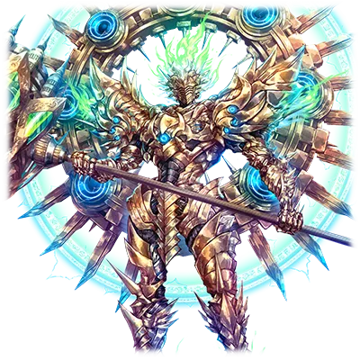

# 远古破坏者 贝格尔米尔

| 角色信息   |  |
| ----------- | ----------- |
| 名称    |巨神贝格尔米尔 |
| 年龄   | 不明    |
|职业| 框架主脑制·据点歼灭用机动兵器程序|
|对应乐曲|The Metaverse -First story of the SeelischTact-
|初出版本|Chunithm Crystal Plus

注：该剧情发生的时间点位于[黄泉的盟主 尼加尔](/metaverse/Revive-the-Metaverse/negal.md)同个时期，位于新世界篇发生之前，可以接续Revive the Metaverse篇继续阅读下去。

## Episode 1 遗留下来的人们

>吾乃守护通往地上再生的大门的守护者。被“他们”所选中的人们，就由吾来审判。

塞蕾·海兹和再生者·迪安之间爆发的大战。

从结果上看，失去了庞大的能量的电子的乐园，已经无法继续维持领域的存在了。

能够将乐园从崩坏的危机之中拯救的方法只有一个。

那就是让在构成这个世界的时候，被授予了大部分力量的“最古”，和“混沌之器”们一起回归中枢单元进行修复，从而让领域恢复正常。

在这之后，两方都成为了中枢单元的一部分，而这场旷日持久的战争，就这样落下了帷幕。

失去神明的世界。

曾经由他们所管理的无数世界，最终被统合成了一个世界，而其中的一部分，变成了被称作“超大陆艾玛格”的世界。

这个大陆的全域究竟多宽广，没有人能知道。

因为这突然的变故流落到这个大陆的人们，虽然为这奇妙的境遇感到困惑，但很快就接受了现实，开始适应，并且开始携手帮助，在这严酷的世界中继续生活下去。

然而，流落到艾玛格大陆的，并不只有人类。

那些并非人类的存在也来到了这里。

那些存在就是——在佛诺·泽尼斯的最终之战中，仍然在浴血奋战的程序们。

他们失去了自己所服从的主人，甚至连自己的存在意义也一无所知。

即便如此，他们还是开始渐渐地寻找自己的存在意义，并且开始摸索自己应该如何在这个世界活下去的方法。

巨神·贝格尔米尔，也是流落到艾玛格的程序之中的一员。

被这个世界所遗留下来的意义究竟是什么呢？

而这个乐园的结局，究竟会走向何方呢？

这个答案，只有神才会知晓。

## Episode 2 涅墨西斯所求之物

>在佛诺·泽尼斯的战斗中，从现在开始，想要通过这里的话，就先跨过吾这一关吧！

这场为了争夺Metaverse的支配权而展开的战争，在艾崔兰克被涅墨西斯占领之后，涅墨西斯军势如破竹，突破了框架主脑的层层防线，最后的决战，就在中枢都市“佛诺·泽尼斯”的城下展开。

一边是铺天盖地的涅墨西斯大军，另一边是开动所有防卫设施，倾巢而出死守防线的框架主脑。

这场战斗正是名副其实的总力战。

而战况也十分激烈。

已经被逼到无路可退，只剩下最终防线“佛诺·泽尼斯”的框架主脑军，派出了曾经被列为禁忌而封印起来的各种兵器——例如会导致领域崩坏，将周围的一切不分敌我卷入爆炸之中的自爆兵器，或者是仍未能完全控制的大型破坏兵器等……

而贝格尔米尔，也是为了抵抗由混沌之器所率领的涅墨西斯大军，被框架主脑所制造出来的据点歼灭用机动兵器之一。

被赋予了高度的自我意识的贝格尔米尔，率领着利希德二型等防卫程序，展开了防卫战。

虽然贝格尔米尔的实力很强，但是不管他们怎么奋战，都杀不尽从四面八方涌来的涅墨西斯大军。

也正是这个原因，他们无法抽身前去支援其他的战线。

“敌人竟然如此众多……难道说，这些家伙从很久以前就在为这场大战而做准备吗？”

当然，也不能说框架主脑就并未倾注精力于这场决战。但是，由于框架主脑需要同时管理广大的领域，所以框架主脑总是在对涅墨西斯方面的行动慢人一步。

“就算现在气馁也没有用了。不过……在如此庞大的数量面前……决定胜负也只是时间的问题了吗……”

在贝格尔米尔视线的远方，是正和混沌之器展开激战的塞拉菲塔和捷夫提。

塞拉菲塔正和身为混沌之器的阿雷斯以肉眼无法捕捉的神速缠斗着，捷夫提和贝尔哲布特则是在互相牵制之余，为友军的战斗作掩护。

“吾等也不能落后了。各位，将那些涅墨西斯清理干净吧！”

和涅墨西斯的大军正面交锋的贝格尔米尔，用他惊人的腕力，挥动了黄金色的雷锤。

散发着高周波震动的雷锤，将行进路径上的所有涅墨西斯全部化为齑粉。

“……叽叽……宰了那个家伙……！”

被雷锤的威力所吓到的涅墨西斯开始集中攻击贝格尔米尔一机，漫山遍野的涅墨西斯向贝格尔米尔袭来。

“人海战术吗。在‘审判的雷锤’面前，这不过是无用功啊！”

就在贝格尔米尔横扫着一队又一队的涅墨西斯的时候，又不知从哪里冒出了另一股军队。

在迎战近乎无限的涅墨西斯的大军之中，贝格尔米尔开始思考起涅墨西斯它们的目的。

（到底是什么东西驱使着它们如此拼命地战斗……为何它们要做到这个地步……）

然后，就像是要打断贝格尔米尔的思考一样，涅墨西斯的代理构成体出现在了战场上。黄金色的身躯抵挡住了敌人的猛攻，

“这种程度的攻击，是别想击沉吾的！”

贝格尔米尔放出雷电，将眼前的涅墨西斯一扫而空。贝格尔米尔就这样屹立在交战的前线，一步未退。

## Episode 3 走向毁灭的世界

>吾等，除了互相争斗到死以外，就没有别的选择了吗……

## Episode 4 漂流到的新世界

>世界已经失去了神明。吾所能做的事情，只有——

## Episode 5 斗争的火种

>既然吾被赐予了全新的使命，那么就让我回应创造主的期望吧。

## Episode 6 黄金的肃清者

>为什么人类仍旧如此沉醉于争斗呢？难道人类就只能无数次的重复以往的错误吗？

## Episode 7 探索调和之人

>这个崭新的世界出现了异变。我必须前去确认才行……

## Episode 8 残留下来的人们的使命

>你也是，和我一样的存在啊……那么，我就必须纠正才行……纠正像你这样的存在！

## Episode 9 暴走的正义

>“明明尔等也拥有这样的力量，却为何不投身于其中！” “那不是我的使命。我应该做的事情是……！”

## Episode 10 再生的道路

>“尔等所追求的答案究竟为何物？” “那个答案，只要伸出手的话，不论是谁都能找到。”

## Episode 11 延续的故事

>……那吾就在这里等待着吧。等待着能够继承尔等的意志的继承者现身的时刻。

