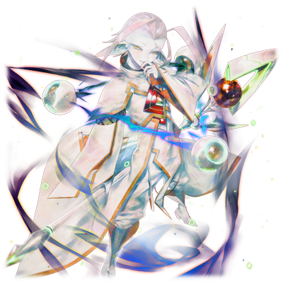

# 再生者 迪安

| 角色信息   |          |
| ----------- | ----------- |
|名称|迪安
|年龄|UNKNOWN
|职业|框架主脑
|对应曲|Megameteor
|初出版本|Chunithm Crystal

## Episode 1 SPEC：迪安

>最古的力量已经消失。不过只要利用这些碎片的话，也可以让Metaverse的统治更加完美吧。

永久的乐土，为了人类再生而建设的试验场，电子的乐园——Metaverse这个世界，由身为神的代行者，名为“最古”的十二体程序进行管理，然后让人类重新再生，回归地上……本该如此发展的。

然而，最古们分成了三股势力互相斗争，在这之后又经历了众多的战斗，被动应对的最古们，最终活下来的，只剩五人。

最古们必须阻挡涅墨西斯的入侵的同时，还需要稳定那些不断扩张的领域。已经没有时间让他们犹豫了。然而即便如此，最古中的一人，再生者·迪安却对这一切都没有兴趣，只是忠实地执行自己的使命。

曾经在“统制主·提丰”所率领的势力与MIR三姐妹之间战斗的时候，他只是觉得跟随提丰比较方便完成自己的工作，就站在了提丰一边。

而他的职务，则是管理和保存，并且决定那些沉睡着的程序的去向。

深居于框架主脑的中枢领域之中，一心执行着工作的身影，就像隐居一般。

然而就在这一成不变的日常中，迪安突然有一天冒出了一个想法。

虽然“最古”们早已失却，但仍然保管着这些最古们的部分碎片的他，如果利用这些东西的力量的话，能否让框架主脑的权力重回巅峰呢？

就这样，他为了让Metaverse的统治更加完美，开始了秘密的行动。

## Episode 2 无情的贤者

>Metaverse的人类，不过是即将在地上再生的全新人类的祭品而已。

在传送门的攻防战中失利，最终败退的涅墨西斯，为了和框架主脑对抗，他们决定将计划进行到下个阶段。

于是，他们自己将所在的最外周部和Metaverse所在的领域分离，为了将来的战斗而做准备。等到他们再次回归的时候，应该就是为双方旷日持久的战争拉下帷幕的时刻了吧。

迪安注意到了这点，并且产生了危机感。万一他们完成了远超自己所预想的进化的话，那么框架主脑也就只有毁灭一途。

“绝对不能让这种事情发生……”

然而现实就像是在嘲笑迪安的想法一样，涅墨西斯再次出现在Metaverse的领域中。

进化后的涅墨西斯的力量已经无比强大，借由他们之手所生产出来的代理构成体，则拥有比现有的防卫程序更强的力量。

但是，即便他们已经展现出了压倒性的力量，他们却从未向框架主脑发动正式的进攻。

说不定，他们也很清楚现在的Metaverse的状态仍未稳定这一事实。

身为管理者的框架主脑必须将领域安定下来才行。

而频繁爆发的小规模战斗，也只是妨碍框架主脑集结战力的行动而已。

目前的战况已经是一目了然。

框架主脑已是十面埋伏之势。面对这种情况，迪安向其他的“最古”们提出了某个提案。

“现在的局势已经可以说是非常不利了……果然，我们还是得重拾曾经提丰所开发过的MIR系列的研究吗？”

听到这件事的最古们都陷入了动摇之中，也产生了反对的声音。

“万万不可！那是完全违背了我们的使命的禁忌的技术。重拾这样的技术，是绝对不能被原谅的啊！”

第一个提出反对意见的，不出所料，正是被设计的更接近于人类的程序，塞拉菲塔。

“像我们这样的存在万一太接近人类的话，反而会对我们的目的产生妨碍。你要明白，存在于Metaverse的人类，不过是即将在地上再生的全新人类的祭品而已。”

迪安所说的话中总是带刺，令人难以接受。所以对于偏向于感情的塞拉菲塔来说，即便再怎么明白话中的道理，对于迪安来说，她都是最为敬而远之的存在。

“我们真正的目的，是将那些舍弃了斗争，并且在这前方找到进化的人类送回地上。为了达成这个目的，我们是不限手段的。”

“但，但是，这难道不会让曾经的过错再次重演吗？”

“塞拉菲塔，我明白你的心情，但是我们也不能忘记我们的使命。根据情况，做出牺牲什么的觉悟也是必须的……”

虽然未能达成一致，但是至少让塞拉菲塔收起了意见。

就这样，迪安为了研究对抗代理构成体的方法，开始了研究。

最终诞生的，就是“西梅翁”。

但是，西梅翁却被涅墨西斯的代理构成体击破，整体的战况大幅倾向了涅墨西斯一方。

迪安虽然对此感到焦急，但他其实早已进入了下个阶段的计划中。

“必须尽早完成那个东西……”

中枢领域，迪安的研究室。

在并排放着众多“箱子”的仓库一角，放着数个写着“Type:Metaverse Domination Unit”的，宛如棺材一般的物体。

## Episode 3 优秀的素体

>你有着相应的素养，能否协助我的实验呢？不过，别说拒绝了，你应该连选择的权利也没有吧？

现在，Metaverse的总人口相比“统制主”统治时期，已经大幅锐减到只剩下大概三成的地步。

对于本该是探索人类众多可能性的Metaverse来说，这已经是危急存亡的事态了。

“观测多种多样的人类的进化，吗……真是的，要是提丰见到现在这个世界的样子不知道会是什么表情呢。”

迪安看着储藏室中保存着的提丰的数据碎片自言自语着。

就现在这种情况，想找到能够执行自己计划的适格者简直就是大海捞针。

再这样下去的话，计划的完成也只能是一纸空谈了。

“必须尽早找到优秀的适格者……。在这些被选中的人们里面，肯定有我想要的东西……”

迪安在焦急之中浏览着数据，突然，一个男人的数据映入了他的眼帘。

那是保存在“工厂”里面的人类之中的初期移植者的人类之一，名为“GENE”的男人。

“很好。这个男人的适应度，足以帮助我完成计划。”

迪安立刻前往了“工厂”，很快就来到了装载着目标人物的区域。

之后，他就将沉睡中的“GENE”唤醒，稍微进行了自我介绍。

“你就是GENE对吧。我是管理这个世界的，名为‘最古’的存在……直接进入主题吧，请你协助我的实验。”

“你要我……做什么……？”

“为了拯救人类，请你和我们一同战斗……。你拥有成为优秀的代理构成体的素养。”

“结果……又要继续战争吗？……我拒绝。这场由你们所引起的战争，不要把我们人类卷进来。”

GENE干脆地回绝了迪安的提案。

但是，在他面前的，可是这个世界的统治者。

对他来说，选择的权利从一开始就没有。

“……你这家伙……要干什么！！”

“不要给我制造不必要的麻烦行吗。来吧，成为这个世界的奠基吧……”

就在迪安将GENE压制住准备回到研究室的时候。

他突然从视线的角落发现了一名沉睡着的少女。

“这是……竟然没有记录在数据库里……还真是有趣的特性啊。”

GENE在渐渐模糊的意识之中最后见到的，是迪安那狡黠的笑容。

## Episode 4 实验体GENE

>你能做的事情只有一件，就是撑过这些实验而已。这样的话，她也能够作为完美的构成体重获新生的吧。

迪安从“工厂”那里拿到了保存着的GENE的数据。虽然他最初因为GENE的高适应性对其寄予厚望，但迪安的注意力却很快转移到了并未登录到数据库里的GENE的女儿，塞蕾。

迪安将两人带到自己的领地，并且放进调整槽中。

“这个女孩会成为极其优秀的代理构成体的。”

“……你、你这家伙……如果要出手的话，只要冲我来……”

“哦？居然已经醒了吗？”

GENE脸上已是怒火中烧，不过迪安并未在意，只是淡淡的继续说着。

“她会成为框架主脑的救世主的。你放心吧。”

“别开玩笑了！我要怎样都好。只有我的女儿……”

面对拼命哀求的GENE，迪安只是暗示着一个残酷的事实。

“本来就想这么做的。”

“……？这是什么意思？”

“你在被‘工厂’保存起来的时候，数据就已经破损了，所以实际上你已经时日无多。不过，你还有一件事情可以做，那就是成为我的实验体。对了！这样吧，如果你能获得些成果的话，她就不需要经历改造，也不需要走上前线战斗了……我以我身为‘最古’的身份作保证……”

“你这家伙！是要拿她当做人质吗！！”

“哈哈，脑子转的挺快嘛，明白就好！”

“为什么，为什么像你这样的存在会……！”

看着GENE的反应，迪安只是继续进行着工作。

“我们是人类的守护者，如果能够明白这点的话就够了……”

只要能够好好利用这个素体的话，说不定就能够在和涅墨西斯的战斗中抢得先机。所以迪安必须小心谨慎地处理这名少女，进行适当的适合性处理。

而这之中的关键，就是跟她组成相近的GENE。只要在这个男人身上做实验的话，应该就能够产生更加完美的代理构成体了。

绝对不会让他反抗这个选择……

至少死在追求这一希望的路上，是他唯一的救赎。

“那么让我们开始吧。”

迪安取出了自身保管的各种数据，和GENE的构成数据之间开始互相组合。

“这是曾经名为‘统制主’的存在所残留下来的备份数据的一部分……也就是‘碎片’……你可要撑住哦？”

被列为禁忌的技术，就在此刻，重现于GENE的身上。

## Episode 5 过犹不及的力量

>看来是太小看他了啊。那么，该怎么回收呢……对了，干脆就投入实战吧。

被框架主脑所封印的禁忌技术，现在正寄宿于GENE的身上。

经过了重重实验的考验，迪安终于从GENE的身上获得了他所想要的结果。

但是即便GENE再怎么为女儿着想而努力，这样宛如削减寿命一般严苛的实验，还是将他渐渐地逼上了绝路。

GENE的寿命已经宛如风中残烛。

“咕……啊啊啊啊……！”

然后，随着禁忌的力量愈发强大，GENE的身体就越难控制，终于成长到了他自己完全无法控制的地步。

“嗯……差不多是时候了。接着就是最后的实验了。”

察觉到极限的迪安，决定遗弃GENE。

然后，为了回收GENE身上的最古之力，迪安趁GENE被派遣出去任务的时候，派出了BOT前去抹杀。

但是GENE的反抗超出了想象，他撑过了BOT的攻击，潜入了Metaverse领域的深处。

“看来稍微超出了预想呢……没想到竟然还剩下如此多的力量吗。”

即便GENE已是大限将至，他的身上也仍旧保存着最古的力量。

“看来是我太小看他了……。幸运的是，似乎还没有别人注意到这件事。那么，就必须想个办法回收他了。”

就在迪安思考的时候，他的视线瞥向了桌子。

在视线的前方，是正沉睡着的塞蕾的脸庞。

“是时候进行实战了。就让我见识一下你的实力吧。”

## Episode 6 敌意的眼瞳

>塞蕾的力量，从理论上来说拥有超越我等的力量。那么，这次就来测试一下吧，用你的父亲来测试……

为了回收已经踏入鞭长莫及的领域的GENE，迪安开始了针对塞蕾的最终调整。

最终完成的塞蕾，理论上拥有超越最古和混沌之器的力量。和GENE同样，她的身上也拥有“统制主”、“确率主”等最古们的碎片。

不同的是，塞蕾的身上做了些许处理。

具体的内容，就是写满了对框架主脑的忠诚，以及对涅墨西斯的无限憎恨的，虚假的记忆。

这样的话，即便在路途中遇上了涅墨西斯也没有问题。

“只要不会出现背叛行为的话那就万事大吉了。那么接着是……”

迪安还加上了另一道保险，那就是当任务失败的时候才会执行的自毁程序。毕竟不能重蹈GENE的覆辙。

接着就是等待探查BOT的发现报告了。

然而不论再怎么等，都没有关于GENE位置的消息。

“嗯，那个家伙的寿命应该早就到极限了才是啊……没想到竟然花了这么久都没发现他的踪影。”

事态陷入了僵局。然而，就在这个时候，从框架主脑针对VOX管理系统专用的回路上，开始偶尔出现针对专用回路的网络攻击。

根据发出信号的源头，终于找到了消失的无影无踪的GENE的线索。

“这算是对我的挑衅吗……”

信号源是Metaverse的最外周部附近。

现在这个领域并没有涅墨西斯，如果要将目标抹杀的话再合适不过了。

迪安将获得的情报传给了塞蕾，并且命令她出击。

“如果GENE还活着的话，代理构成体之间的战斗将不可避免。到时候，两者想必会拼个鱼死网破的吧。”

疑心重重的迪安，在塞蕾前往无人的领域之后，又让“全天的支配者”雪儿紧跟其后，前往了该处。

——不久，雪儿就带着遍体鳞伤的塞蕾回来了。

确认了两人无事的迪安，张开了双手迎接两人的回归。

“迪安大人，属下回来了。”

“哦哦，塞蕾吗。这一路辛苦你了。没事就好。”

“谢谢您的关心。”

“那么，GENE还活着吗？”

回来执行作战报告的塞蕾，报告了自己未能回收GENE，在经历了一场大战之后，最终消灭的事实。

迪安并未太在意这件事，原谅了塞蕾。

至少，相比较让GENE的构成数据落入涅墨西斯手中，只是消灭的话已经很不错了。反正适合的个体再去找就行了。

虽然只是说辞，迪安还是向着塞蕾说了一声“不要在意。”

塞蕾清楚地听到了这句话。

从她望向迪安的瞳孔之中闪烁着的，是明确的敌意。虽然她只是一言不发，但是她那苍蓝色的眼睛仿佛就在诉说着现在就要将迪安置于死地的念头。

现在的话也是可以动手的吧。然而，塞蕾并未采取行动。因为她认为，只有迪安陷入愤怒之中失去理智的时候，才是真正动手的时候。

塞蕾就这么静静地等候着那个时刻的来临。

## Episode 7 带来终焉的剑

>为了奖励如此功绩，就把这把剑送给你吧。将这把グランタクト赐予你……

经过GENE的回收任务这一战，塞蕾成功展现了足以和涅墨西斯的“器”们分庭抗礼的实力。

“没想到面对‘器’竟然能有如此战果。这样子的话，将那些涅墨西斯斩草除根也不是梦了……”

身为自己制造出来的代理构成体，初战就带来赫赫战功这一事实令迪安欣喜若狂。于是，他将自己制作出来的全新武器交给了塞蕾。

“为了奖励如此功绩，就把这把剑送给你吧。”

“迪安大人，这到底是……？”

“这把剑，正是终焉的苍剑·グランタクト。”

グランタクト——刃身通体苍蓝的这把剑，是以最古的数据为基础，为了毁灭涅墨西斯而制作出来的剑。

这把剑在将被认识为敌人的目标歼灭之前，会一直增幅使用者的战斗意识。接着，被命中的目标会强制性和使用者之间强行建立连接以进行能量的移动……简而言之就是能够夺取对方的力量。

可以说正是为了终结涅墨西斯的战争而制造出来的武器。

“非常感谢。就让我以这把苍蓝色的剑披荆斩棘，将令人可恨的涅墨西斯斩尽杀绝吧。”

“期待你的表现。愿你能大展身手，将全部的涅墨西斯都消灭。”

迪安打算将这把武器交给塞蕾运用，再利用获得的数据进行量产化。当量产化成功的时候，涅墨西斯应该也就无法造成威胁了吧。

——就在塞蕾获得这把剑之后几天。

她带着グランタクト从这里消失了。

迪安虽然早已为这最坏的情况做好了准备，然而，没过多久，更加意想不到的事情就发生了。

框架主脑的防卫据点“艾崔兰克”被攻陷了。攻破艾崔兰克的涅墨西斯势如破竹，无人能挡。位于中枢领域的佛诺·泽尼斯成为前线的日子也不远了吧。

“真是祸不单行啊……不过，现在还不是最坏的情况。佛诺·泽尼斯可是固若金汤的啊。”

根据迪安的模拟，涅墨西斯想要攻破佛诺·泽尼斯的可能性几乎为零，所以他们是绝不可能获得胜利的。

然后，为了迎击涅墨西斯的进攻，最古们开始巩固起了防线。

## Episode 8 激荡的佛诺·泽尼斯

>很快就要到决定这个世界命运的最终决战了。放马过来吧……这个佛诺·泽尼斯会成为你们的葬身之地。

艾崔兰克沦陷的信息传到了框架主脑这里，令整个中枢部都紧张了起来。

战火很快就会蔓延到佛诺·泽尼斯了吧。

虽然一部分最古仍然心中仍然挂记着塞蕾的事情，但是在这十万火急的局势中根本抽不开身去寻找她。现在的他们，必须将十二分精力都集中在佛诺·泽尼斯的防卫上。

佛诺·泽尼斯可以说是组成框架主脑的根基领域。

这保存着各种充满可能性的世界，关联到人类能否再生，回归地上的最重要的据点。如果这里被攻下的话，也就同时意味着这个世界的终结，甚至可以说连存在的意义都会消失。

所以这里是正如文字描述那般，不论使用什么手段，都必须要保护好的最终防线。

迪安驻守在最深的中枢领域，而前往这个领域的大门则由特化防御的雪儿所负责，剩余的三人则各自负责其他的大门。

在同一时间，涅墨西斯也包围了佛诺·泽尼斯。

他们的目的只有一个。

那就是占领中枢。

即便现状如此绝望，迪安却仍旧胸有成竹。

“不管你们来多少都是白费力气。等到你们攻势弱下来的时候就是此战的分水岭。涅墨西斯们……这里将会是你们的葬身之地！”

决定世界命运的决战，就此打响。

由于框架主脑获得了从佛诺·泽尼斯的能量供给，所以战况持续向着这边倾斜。就在这时，迪安注意到了一个事实。

“……‘器’的数量，减少了？呵呵，天助我也啊！”

根据战场上传来的画面和之前的情报对比，迪安发现了一名混沌之器并未出现在战场上。那就是“混沌之器”中的其中一人，被称为斯托姆的涅墨西斯。虽然不排除是敌人的计策，但是现在缺少一名混沌之器的事实令迪安喜出望外。

“这就是他们比想象的还要早发动进攻的原因吗？也罢。那么，会造成这种结果的原因是……”

仔细一看，尼加尔，雷布尔，泰斯塔蒙特三名“器”正在前往雪儿所在的位置。

“就算她的防线被攻破了，我还有……嗯？这是什么反应！？”

迪安的视线被某个东西吸引了。

画面上的，正是象征着自己死亡的那艘方舟到来的画面。

## Episode 9 世界的破坏者

>那个家伙，难道说早就盯准这个时机……！？该死的塞蕾！难道你想成为世界的破坏者吗！

在那些前往雪儿方向的涅墨西斯的上空出现了一个谜一样的物体。

迪安对这个东西有印象。那个物体不是别的，正是框架主脑用的“摇篮”。

也就是说，搭乘那个东西的人，毫无疑问就是——

“难道她一早就盯准这个时候了吗！？”

下个瞬间，周围就遭到了严重的冲击。

冲击波之猛烈，以至于让周围布置的全部传感器都暂时宕机。

烟尘散去，从被撞击到看不出原形的“摇篮”中走出来的，正是前日逃离框架主脑的少女——塞蕾·海兹。

她利用“摇篮”的大质量作为武器，直接将其撞向包裹着坚硬装甲的雷布尔。

塞蕾则趁周围一片混乱之际大杀四方。没过多久，她就将雪儿的一半翅膀斩落，并且吸收了她的部分力量。

迪安终于明白了她的真实目的。

做这么多事情为的目的只有一个。

“难道是……前来报仇的吗。”

迪安怒狠狠地盯着屏幕。在这个时间点发动突袭可以说是最致命的了。

——没过多久，塞蕾就出现在迪安的面前。

她借助之前吸收掉的雪儿翅膀上的数据，穿过了大门的防卫。

“迪安，让你久等了呢。”

塞蕾的声音比以往冰冷。

从她身上散发的杀气，仿佛一把出鞘的尖刀。

“哎呀，脸上都写满了杀气呢。真是的……这次真是败给你了啊。”

“哈哈！被自己养的狗反咬一口的感觉如何！？只有你……只有你，必须在这里打倒！！”

塞蕾举起了手中的苍剑。

“等到涅墨西斯都消灭了，整个世界安定下来了之后有的是时间和你交手。你难道不知道现在是怎样的情况吗？”

“你们这些家伙之间有什么纠葛我才不管。现在！就在这里！我要杀了你！！”

“愚蠢的家伙……！就那么想把整个世界都破坏掉吗！就让你见识一下我真正的力量吧！”

迪安突然瞪大了眼睛。

与此同时，迪安的周围开始散发出炫目的光芒。

## Episode 10 贤者所求之物

>等到把你杀死之后，我就将那些涅墨西斯都消灭的一干二净！然后，就让我来引导那些人类吧！

迪安的全身散发出了夺目的光芒。

光芒覆盖了佛诺·泽尼斯整个领域，最后收束到了迪安身上。

之后，在光芒收束之地，出现了一名穿着白色装束的少年，手中握着一柄闪烁着红光的法杖。

“嗯……这就是你的真实样貌吗？而且这把武器是……”

“グランタクト・カドゥケウス。グランタクト的姿态并不只有一种……而这把则是以你的剑为原型制造出来的产物。”

迪安露出得意的笑容继续说到。

“也就是说，你连万分之一的机会都没有！”

随着这句话，迪安向塞蕾猛地冲了过来。

如此快的速度，以至于根本想象不出曾经的他只是个隐遁于中枢中的最古而已。

“咦？还算是有两把刷子啊？不过！”

塞蕾接住了这超出人类认知的速度发动的攻击，时而用武器架开，时而屈身闪开。

能够在这恐怖的高速攻击中幸存下来，也是多亏了塞蕾所获得的种种力量。

“净耍些小聪明！但你还能支撑多久呢！”

战况陷入了胶着。在这只要稍有损伤就会被夺去力量，一瞬间的闪失可能就会身首异处的战斗中，两人的武器互相碰撞，产生的火花和光芒照亮了四周。

塞蕾面对渐渐加重的攻势只能缓缓地向后退去。

看准这个时机的迪安决定强行突破，直接突破了塞蕾的架势。

“结束了！！”

迪安的攻击即将命中塞蕾，武器即将贯穿她的身体的这个瞬间——塞蕾的身影就像雾气一般消散。

“什么！？”

塞蕾并未放过这个破绽，从迪安的背后出现，一剑刺穿了他的胸膛。

“噶……哈……刚才的……是诱饵吗！？这怎么……可能！”

呼吸已经断断续续。

贴着迪安的塞蕾，仔细地听着迪安死前的喊叫，然后……

“这就是从父亲那里学到的力量。战斗这种东西本就没有所谓的光明磊落哦。”

已经成为复仇的化身的少女，只是露出扭曲的笑容望着在地上喘息着的迪安。

“呵呵，就让我看着你最后是怎么惨死的吧。”

“你这家伙真的明白自己做了什么吗……。如果把我杀掉的话，这个世界就……”

“这种事情怎么都好。这个世界是属于谁的，和我无关。”

“……呵呵，啊哈哈……”

“有什么好笑的？”

看着一脸不爽的塞蕾，迪安挤出一丝力气大喊到。

“还没结束呢！”

突然，发生了强烈的能量反应。

巨大的能量让整个领域都为之撼动，并且朝着塞蕾袭来。

“又是这股力量吗！？”

就算是塞蕾也意识到了此地的空间发生了变化，将注意力放到了周围。

“我已经和这个中枢领域直接连接了……现在的我，就是佛诺·泽尼斯本身，不，应该说，是整个Metaverse本身啊！！啊哈哈哈哈哈！已经没有你能——”

“休想！”

塞蕾立刻向迪安发动了攻击，但是，构成佛诺·泽尼斯的构造体立刻从地板上伸了出来，挡住了她的攻击。

“都已经这样了，还要反抗吗？白费心机啊！”

不知道何时起，组成佛诺·泽尼斯整个领域的部分构造体向着迪安的周围飞去，就像盾牌一样围在他的身边。

“等到把你杀死之后，我就将那些涅墨西斯都消灭的一干二净！然后，就是将人类放回地上再生，创造全新的世界！……这一切的一切，都将由我执行！”

## Episode 11 然后，神败北了

>为何？为何要违抗神明的意志？没有神明的世界，你真的认为仅靠人就能活下去吗？

和中枢系统直连的迪安，将整个佛诺·泽尼斯本身化为了他的武器。

从四面八方袭来的全面攻击，塞蕾只能拼命闪避。在如此激烈的攻势面前，塞蕾也难以取得优势。

“可恶，这样就无法接近他了……”

虽然塞蕾尝试用剑突入位于中心的迪安，但是随时伸出来的，来自佛诺·泽尼斯的构造体总能挡下她的攻击。即便再怎么破坏，残骸立刻就会化为形状简单的崭新构造体，再生回来。

管理着沉睡中的程序的迪安的力量，在这意想不到的场合发挥了作用。

“……早知道刚刚就该把你这股力量吸收过来的。”

“向神发起挑战的愚昧者啊！还不明白自己不过是在白费力气吗！”

“闭嘴！既然这样我就砍到你的再生速度跟不上的地步！”

塞蕾使出自己的全部力量疯狂攻击，而迪安也随之回应，疯狂地重构构造体。

战场重复着破坏和再生的循环。两股力量之间的冲突，甚至不亚于曾经与暴虐之王交战的那场战斗。

不过，在永无止境的攻击面前，塞蕾还是渐渐地陷入了下风。

“哈哈哈！！刚刚那股气势都上哪去了啊？看起来都开始喘气了呢。果然，到最后你也不过是一介人类而已啊。”

“别开玩笑了……。不要……随便小看人啊……！！”

呼吸越来越紊乱，集中力在渐渐流失。

即便拼尽全力强撑着，但是就连这股力量也要耗尽了。

再这样下去，先倒下的肯定是自己。但是，即便这样，手持苍剑的少女眼中还是没有放弃的意思。

“竟然到这个地步还没有放弃吗。”

“那是当然！”

“竟然到了这个地步仍然想复仇吗。我们这些等同于管理系统的存在，也可以说是Metaverse本身所有无意识的集合体了。就算打倒了我，也得不到什么的哦？更何况，你有什么理由，又有什么意义，要打倒继承了先人意志的我们呢？”

看着露出怜悯表情的迪安，塞蕾只是投以充满决心的眼神。

“我只是……饶不了你！对，绝无可能，也没有必要饶恕你！”

“……看来是谈不拢。之后再对你进行再度调整吧。你就乖乖成为人类再生这一大业的祭品吧！”

“……什么人类的再生啊。你们口中所说的‘人类’，已经哪里都不存在了……结束这一切吧！光辉脉冲（レディアント·ヴァーテックスッ）！！”

随着塞蕾的呐喊，她解放了所有吸收的力量，向机械装置的神明冲了过去。

“竟然不躲不藏，直接向我冲来吗！天真！”

构造体从四面八方飞来，每一块都像是要将塞蕾置于死地。

“看这招啊啊啊啊啊啊！！”

塞蕾被无数构造体吞没，覆盖。估计内部已经被压成肉酱了吧。

“那么，这就是结束了吗。让我看看吧……”

迪安为了确认塞雷已经死亡，靠近了构造体的集合。

“我也消耗了不少呢……在我还能维持连接的时候赶紧将剩下的涅墨西斯清理……掉……吧？”

——突然，一道攻击趁迪安分心的瞬间命中了他。

从构造体的碎块之间的缝隙冲出的一击，准确地命中了迪安的胸口。

“这是……グラン、タクト吗……怎么可能……还活着……”

脱离了迪安的控制，构造体轰然倒塌。从中走出的是毫发无伤的塞蕾。

“虽然实际运用还是第一次，不过终归是成功了呢。”

“怎么会……”

“借用了一下雪儿和雷布尔的力量哦。”

原来，塞蕾在发动雪儿的防御结界保护自身的同时，利用雷布尔组成铠甲的力量，反过来控制了构造体的行动。

“你这个怪物……”

“唯一不想被你这么说啊。”

一瞬间——苍剑挥下。

迪安便再也没有看到世界的终结的可能了。

“……蕾……塞蕾！”

从远处听到了一个响亮的声音。

塞蕾回头望去，是满脸焦急的雪儿正向这里奔来。

“你来晚了，雪儿。迪安已经……”

然而雪儿并未听到塞蕾说的话，她只是望向系统的方向，之后无力地瘫软下去。

“怎么会……中枢系统……已经要撑不住了……！”

本来被迪安掌握的中枢系统陷入了危机。构成整个佛诺·泽尼斯的空间，开始发出悲鸣般的巨响，开始渐渐地走向崩坏。

“怎么会这样……再这样下去的话，整个Metaverse，整个世界就要彻底崩坏了……”

塞蕾的大仇已报，神明业已身死。

但是，这也意味着这个世界走到了终点。

