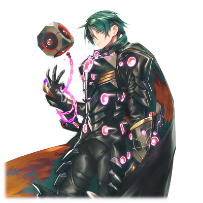
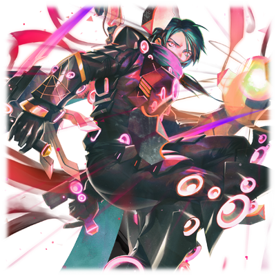

# 金恩·载因

| 角色信息   |          |
| ----------- | ----------- |
|  名称 |金恩·载因
|年龄 |UNKNOWN
|身份 |逃亡程序
|所属|原所属于框架主脑
|对应乐曲|Nijirate Fanatics
|初出|CHUNITHM Crystal

## Episode 1 SPEC:金恩·载因

>NEO……确实记得有这么一阵子被这么叫过呢。不过，现在的我是金恩。叫我金恩·载因吧。

这里是曾经被人类，还有框架主脑所荒废的边界领域。现在，我正一个人流浪到了那个地方。

我自己倒是没有感到孤独什么的。不如说，能够避免卷入那些自作主张又无聊的争斗，对我来说刚好。

生活在Metaverse的人类，只要有数据备份和精神复制体（アストラルコピー）的话，就可以无限次地再生了，但是我的构成情报损伤太多，所以无法利用这种手段复活。

也就是说，我的生命是有限的。

那么，干脆自己跑出来选择一个能够心安理得死去的场所也是很正常的对吧？

所以我现在会在这里一个人讴歌着自由，也都是我自己的选择。
  

而且……现在的我，虽然是“一个人”，但并不是“孤身一人”。

曾经，我是身为人类和程序的两个完全不同的个体，但是在某些因缘际会之下，我们两个的目的一致，最终合二为一……哎呀，光是想到这个脑子就一团糟了。

我就是我。我是怎么来的这种东西怎么都好。

NEO……GENE……这些都只是过去的名称。

对了……以后就自称为“金恩·载因”吧。

虽然我觉得我根本不需要名字什么的……算了，也没有别的事情可做。

## Episode 2 战争中残留下来的渣滓

>音响空间VOX，这里就是我最后停留的地方。你问为什么？因为那是我的工作。

在漫长无比……以至于长到连时间这个概念都会消失的漫长历史之中，战争正在进行着。

而这历史最后的结果，就是整个Metaverse的荒废。

大部分的领域都已经罕无人迹，那些被荒废的领域里甚至就连末端的程序都消失了。

现在，幸存的人类只存在于框架主脑所保存的中枢区域而已。

在各个领域被放弃之初，那些被框架主脑舍弃的程序们即便只有绵薄之力，还是想努力地在这个严酷的世界中生存下去。

但是，失去框架主脑保护的程序们，面对涅墨西斯的攻击，也毫无还手之力，这些被放弃的区域也只能就这样被吞噬，消亡，只剩下一具空壳。

现在，这个世界的程序和人类都已经几近灭亡，已经几乎化为了一片虚无的空间。

而在最外周部的边缘安置着的音响空间里进行管理工作的NEO，也是在这绝望的末世之中享受着孤独的一人罢了。

在NEO所能识别的范围内，他所看到的，也就只有那些能够稍微看到曾经繁华过的世界的残骸，渣滓而已。

能够操纵音波的NEO，不管经历了多久的时光，仍然数十年如一日地发送着音响脉冲。

即便外界早已是一地碎屑，只剩虚空。

为的，是某天能够传送到不知道哪里的某个人……

## Episode 3 被神选中之人

>虽然他们确实说了“需要能够战斗的力量”……不过，在他们的面前，实际上是没有拒绝的权力的。

为了将框架主脑灭绝从而诞生出来的涅墨西斯的势力，现在已经进攻到了各个薄弱的地方。

一直处于守势的框架主脑试图打破这样的局面，最终推进了可成长的程序·MIR系列的继续研究。

利用人类的肉体为基础制造出所谓的“代理构成体”……面对这个从各个方面都挑战到了禁忌的反感，框架主脑中对这个计划的反对声音不绝于耳。

但是，面对日渐壮大的涅墨西斯力量，框架主脑也到了不得不用这种力量的时候了。

然后，框架主脑开始了大幅度的筛选工作，从框架主脑的管理之下的众多人类中选出有素养的人，再进行最新锐的技术以让他们能够适应MIR系列的改造工作。

今天，又有一名从Metaverse初期就被移植进来的人类被框架主脑发现，并被改造成了代理构成体。

他的名字，叫GENE。

正是被Metaverse的神明所摆弄着人生的，被制造出来士兵当中的一人。

## Episode 4 秘密研制的实验体

>说不定死了还更好呢……现在的我，完全变成了框架主脑的一条忠实的狗了。

作为士兵前往前线战斗，并非GENE的本意。

但是，他的家人却被框架主脑所保管着。关于这点，虽然并未从框架主脑那里得到确证，但是从事实上看，GENE的家人，毫无疑问被框架主脑当成了人质，以逼迫他参加改造，参加战斗。

没有拒绝手段的GENE，只能够参加各种各样的改造手术，以让自己变成代理构成体的样子。

不过和迄今为止的MIR系列所不同的是，他所获得的改造，是源于由框架主脑所保存着的，来自提丰他们所构成的数据，以其中的一部分基础复制出来的，足以匹敌“最古”的力量。

以获得如此强大的力量作为交换，GENE的个体寿命相比较他应有的理论年龄要削减了很多。

而且，为了防止万一出现背叛框架主脑的情况，还在体内装上了自毁装置，至此，他就彻底变成了框架主脑所管理下的一名士兵。

执行这一切操作的，是“最古”的其中一人，再生者·迪安。

这个过于危险的计划，本质上已经是人体试验以及强制让人类变为士兵的禁忌行为，明显违反了“最古”所应遵守的使命。

对这个计划本身的危险性和会引来其他“最古”的反对这点，迪安心知肚明，所以他一直都是隐藏着GENE他们的存在，在暗地里进行操作的。

## Episode 5 框架主脑的真意

>原来如此，说到底，我也就只是一个实验体吗。不过……我会活下去！即便躲到天涯海角也要活下去！

GENE成为了框架主脑的先锋，持续进行着战斗。

刚成为代理构成体，他就被立刻派往最凶险的地方进行战斗。在激烈的战斗中，GENE的身体也在战斗之中渐渐地积累着错误和损耗。

然后，在某次战斗的时候，大量积累的错误让MIR程序被误触发，结果导致了GENE体内储存的最古的力量发生了暴走。

在一片混沌的意识之中，GENE觉得眼前天旋地转，几乎无法站稳脚跟。

终于机能停止了下来，他赶忙躲到战场的死角处，躲进了一个空间。

“我到底是怎么回事……？这里是……哪里？”

这附近没有战斗的迹象。

注意到自已经是孤身一人的GENE，决定回到“工厂”，他站了起来。

“嗯！？可恶……是伤势太重了吗……”

虽然他接受了拥有自我修复能力的MIR系列的改造，但是他的伤势实在是太重了，现在也只能保证身体不会失去意识，但是伤口的修复就来不及了。

虽然周围没有战斗，不过仍然不能改变现在身处于危险区域的事实。选择等待身体修复完毕的GENE，对目前的状况进行了总结。

“呵……什么‘对程序高度适合素养体’啊，结果就是被派到最严酷的地方干最危险的活儿吗……”

自从当上代理构成体开始战斗之后，他就未能从上层那里得知自己家人的安全了，虽然他一直都听说他们正在框架主脑直辖的“工厂”底下保护着……。

已经被改造成非人之物的GENE确信，自己已经再也见不到家人了。

但是，只要自己在前线拼命战斗的话，应该就能让自己的家人免于遭受这样的苦难吧。

正是因此，他才相信了迪安所说的那些苍白无力的许诺，战斗至此。

“不管怎么说，还是先回去比较好吧……”

就在这个时候，从空间的角落突然冒出了几道龟裂，从中冒出来的是来自框架主脑的探索BOT。

“发现目标，立刻进行处理。”

“看来是信标起了作用呢。终于得救了吗。”

但是，就在GENE以为前来迎接他的是救兵的时候，BOT却向他发起了进攻。

GENE勉强抵挡住了攻击，但是BOT却只是冷淡的继续念着“执行任务”的语音，继续向他发起了攻击。

“为什么？为什么攻击我！？”

GENE努力拖着受伤的身体，努力地思考着这个问题。

“……原来如此。果然说到底我也只是个用来收集数据的实验体，现在不要了就直接把我废弃掉是吗！”

虽然暂时没法反击，不过GENE还是勉强恢复到了可以发动领域移动的状态，瞬间，他就离开了战场，将BOT甩在了身后。

他的目的地，是Metaverse的那遥远的边界。

## Episode 6 两人的邂逅和融合

>NEO，这样你和我就是一心同体了。虽然你可能会很不爽就是了……不怕，很快就会结束了。

注意到自己被迪安欺骗，逃离战场的GENE，来到了距离最外周部最近的边界区域。

在这个被框架主脑所放弃的领域之内，本该是个只有残垣断壁和无数尘埃的了无生机的空间，但是，GENE在这里却感到了一丝奇妙的安心感。

“说不定在这里等死还比较好呢……反正，这具身体也没法支撑太久了。”

在被改造成为代理构成体的时候，寿命就已经比正常程序要短很多了，而在这之前的战斗中遭受的重伤则进一步压榨着这具脆弱的身体。

对一切已经看开了的GENE，决定将这个领域作为自己最后的葬身之处，静静地等待自己的死期到来。

虽然这个边境的领域因为人类已经被全部回收看起来空空荡荡的，但是，GENE发现在这里还有一个被丢在这里未被带走的管理程序。

GENE抱着消磨时间的想法向那个程序搭了话。

“你，是谁？”

“！？这可真是难得一见啊……这里竟然还有人活着的吗。”

“人……？呵呵，我都已经变成这副模样了，还算是‘人’吗？”

“你在笑什么。”

“没啥，只是我自己的事情而已。看起来是个嘴皮子不饶人的家伙呢。我喜欢。”

这家伙看来是VOX的管理程序的样子，但是似乎是因为构成体有些异常的要素所以框架主脑才没有将他回收，而是留在这里。

GENE感觉自己在某些地方和他有着共性，于是便给他起了个叫NEO的名字，偶尔接入他所在的系统里互相吵嘴，两人就形成了这样奇妙的孽缘关系。

NEO虽然在感性上有些特别，不过的确是个优秀的程序。

对于GENE来说，这是他成为代理构成体之后难得能享受的安稳时间。

但是，这样的安稳也随着病毒群入侵这片边境之地就此结束。

“敌性反应？让我先数一下……2，3，5……6……按照这个感觉来看，应该是涅墨西斯了。看起来并不是追着我而来的，那么……目标就应该是NEO了。”

病毒本身虽然不是什么强力的对手，但是还是有些缠人。

判断没有框架主脑的保护的NEO一定会陷入苦战的GENE，毫不犹豫地决定前去帮助这个结交不久的朋友。

“这些家伙，在我大限将至的时候就恰好打了过来……这难道就是所谓的命运吗？”

GENE已经离死不远。这个未能保护好家人，保护好整个世界，未能保护任何东西的男人，决定即便只有一人，即便这份心意只是兴趣使然，自我满足也罢，也想拯救眼前的这个同伴。

GENE绕开周围的病毒，强行打开了VOX和NEO进行了直连。

“NEO，看起来你还活着啊。让我帮你一把吧。”

“GENE……你这家伙，少给我多管闲事。”

“行了，好好听着。NEO，我现在就把我的‘模拟程序’（イミュレーター）发给你。”

GENE的提案是将记录了自己身体所构成的所有情报的程序，从另一种层面上等同于遗传基因的复制体——“模拟程序”传送给NEO。

因为来袭的病毒是会攻击程序的类型。如果攻击的个体里有人类的遗传基因情报的话，它们就束手无策了。

接受提案的NEO打开了自己的端口，和GENE送来的数据同化了。

送出“模拟程序”的GENE的肉体很快就消失在空气中。

但是NEO并未注意到这件事。

GENE在同化之后，意识即将消失的瞬间，看到了妻子和女儿的幻影。

（这就是最后了吗……对不起……最后还是这么任性地，对待我的这条命啊……）

两人融合，一个同时继承了双方的记忆的全新个体诞生了。

后来，这个被称作金恩·赞因的个体，平安无事地击退了病毒，并且以全新的姿态开始了旅行。

## Episode 7 名为金恩的融合体

>看起来已经要到时间的极限了。不过，我可不想掺和进和神明之间的战斗啊。

NEO和GENE的融合体，同时继承了两边的记忆。

虽然整体是以NEO的肉体为基础，但是形成了全新的人格的他，决定从曾经的记忆之中选出“金恩·赞因”为自己的名字。

并非人类，也并非程序，半人半机的存在。

不知道是幸还是不幸，继承过来的东西并不只有记忆。

GENE在融合前由框架主脑将他改造成代理构成体所赐予的这股力量，也被融合进了金恩的体内。

现在，框架主脑和涅墨西斯的战火已经蔓延到了中枢领域。

“呵……是这样烂在这里呢，还是向神举起反抗的大旗呢？不管怎么说，最后这个世界都会彻底灭亡的吧。乖乖呆在这里还比较好。”

金恩相信这场战争，不论是谁最终获胜，都预示着整个Metaverse的终结。于是他选择和曾经的GENE和NEO那样，继续在边缘的世界中等待着。

在结构不安定的最外周部，时间正在不停地加速着。即便外面经历了足够漫长以至于普通的程序都会自然死亡的时间，金恩仍然活着，呆在那个世界之中。

但是，对于金恩来说，永远的安宁是不存在的。

框架主脑的战斗仍在继续，战事陷入了泥潭之中，半个Metaverse已经被卷进了涅墨西斯的猛攻之中。

而某样东西也正在接近着这里，让战争和憎恨的连锁愈发深刻。

## Episode 8 血脉的共鸣

>这种感觉……我知道这个家伙吗？怎么可能……怎么可能会有这种事……

来到金恩所在的边境之地的人，是被框架主脑的BOT带着的，一名代理构成体的少女。

“竟然有敌性反应吗？明明这里因为时间加速的缘故，会因为情报膨胀的缘故无法进行观测才对的……”

感知到那个东西的金恩面露难色。

“可恶，为什么会被发现？看起来是从未见过的代理构成体的样子……总之还是先藏起来吧，被发现就完了。”

不知是否是因为以前NEO被袭击过的缘故，还是因为不清楚为何会被人发现藏身之处的缘故，金恩选择了躲在残骸之中，希望能够躲过敌人的搜索。

然而，少女却发动了攻击。少女发动了无差别的攻击，弹幕扫遍了领域内的所有残骸，将金恩逼了出来。

“看来已经无路可退了啊。看起来也不是能够放我一马的家伙……Are you Ready?……让我们开始吧。”

金恩摆出架势和眼前同样身为代理构成体的少女对峙着。

少女慢慢地睁开了眼睛，说到。

“终于找到了……这个程序的反应，是GENE……”

“确实，我曾经被人这么称呼过，不过现在早就变了。我也不知道你是谁。”

“少开玩笑了……竟敢把我的家人，把我们平稳的生活彻底破坏掉！别跟我说你把这一切都忘了啊！”

金恩的话语并未传进少女的耳中，少女举起武器向金恩冲了过去。

虽然急忙进行了回避，但是战斗已经陷入了被动的状态，无法脱身。

（这家伙，难道也是MIR系列吗？可是……为什么会有股讨厌的感觉……）

金恩察觉到一股明显的违和感，而此时的少女已经近在眼前，并且高高举着手中的剑向着金恩劈了过去。

少女的剑锋压的金恩几乎抬不起头，在用手中的武器咯吱咯吱地架住少女的攻击的时候，金恩向少女发问。

“你究竟是……”

在说出这句话的瞬间，相互碰撞的武器爆发出了强劲的冲击波，将两人弹开。

（刚刚，难道是共鸣吗……？为什么我和那个少女的生命波形如此相似？）

金恩开始注意到什么了。而少女的脸上也出现了困惑的脸色。

“你刚刚，做了什么？”

“我什么也没做哦。说起来，你不是来杀死我的吗？那么能不能至少报个名字呢？”

“……也好。听好了，我的名字是——塞蕾，是要将你杀死的女人的名字！！”

听到名字的金恩瞬间停止了动作。

金恩脑海中属于GENE的记忆出现了反应。

——塞蕾。真是怀念的名字啊。

原来……你也变成这副模样了吗。

本就是被身为支配者的“最古”欺骗着，却还在骗着自己，骗自己说家人仍然平安无事……

怎么可能得救呢……其实在心底里的某个角落，早就明白了吧。

挥舞利剑发出破空响声，准备再次进攻的少女。

她正是留着和GENE同样血脉的——他的女儿，塞蕾。

## Episode 9 身为父亲的行为

>没想到，最后你也走上了和我一样的命运吗……等着吧。我现在，就来救你！

“从刚才就在跳来跳去的，给我站住！”

在用着高速的剑法接近自己的塞蕾面前，金恩驱使着自己身上的辅助腕进行着各种灵巧的闪避动作。

看着明明有反击的余地却只是一味逃避的金恩，塞蕾感觉到自己似乎被侮辱了一般，不禁怒上心头，发动了固有能力“脉冲单元”（モデュレイト・ヴァーテックス）。

塞蕾的身上缠绕着淡淡的，宛如海市蜃楼一般的光芒，之后她突然开始加速，以超越视觉极限的动作冲了过来，其速度之快甚至产生了残影。

“竟然还有底牌吗！”

金恩看到眼前的对手竟然还有超越自己预料的杀手锏，不禁暗暗叫苦。

虽然同样身为代理构成体，两人的实力差距不大，但是因为自己的身手灵活，所以迄今为止都能够全身而退。但是现在这种情况那就不一样了。不但无法反击，甚至还有可能被单方面的虐杀。

但是金恩并不想攻击的理由不止一个。那就是因为他知道了塞蕾正是GENE的女儿这一事实。

（GENE……是救了我……我们的恩人啊。怎么能做让他伤心的事情呢……）

金恩努力在自己的极限范围内驱动着身体，持续地逃避着攻击。

终于在塞蕾的斩击即将追上背部，将要被命中的时候……

“啊？啊啊啊啊啊啊啊啊啊啊！！”

突然，塞蕾发出了惨叫声，抱着自己的头躺在地上蜷缩成了一团。

“这难道是……机体达到活动的极限了吗？可是……”

本来，使用固有能力就会对肉体造成负荷，但是本来应该备有安全锁以防止这种情况发生的才是。

“与之替换的，是自毁装置吗……真是多亏了你们做的手脚啊，框架主脑！”

塞蕾已经口吐白沫，无法战斗了。

要救她……必须救自己的女儿才行。

金恩发觉，他的心中就宛如明镜止水一般，没有一丝迷惘。

“身为父亲，应当在这个时候做什么事情吗……”

金恩这么说着，缓缓地走向塞蕾所在的地方。

就像安慰着大哭的婴儿一般，带着温柔的表情向她走去。

## Episode 10 拥抱与陷阱

>将那些坏人们给孩子带来的有害的东西都驱除掉……也是身为父母的责任啊。

金恩一边接近着塞蕾，一边高声地说到。

“我明白的。你现在所感受的痛苦，是前所未有的对吧？这一切都是那些框架主脑的人渣们害的！”

一步，又一步。

“这些家伙，为了防止手下的棋子临阵脱逃，就会像这样在你的身体里装上自毁装置。说不定，前来抓我的这个任务，他们也借此给你下达了期限了吧！”

“啊咕呜呜！啊啊啊啊啊啊啊啊！！！”

由于痛苦到不能自已，塞蕾的手指甚至抓破了自己的头皮，渗出了血迹。

金恩露出了一副温柔的表情，怜悯一般地将手伸向了塞蕾。

“……没关系，就让我来救你吧。我已经见过太多被那些人渣们玩弄人生的家伙了。”

“呜啊啊啊啊啊啊！！给我……闭嘴啊啊啊！！！”

一边这么大喊着，一边漫无目的地乱挥这武器。看来因为过于痛苦，金恩的话并未传进她的耳中。

金恩并未在意挥舞着的利剑，继续向塞蕾的方向前进。剑锋直接埋进了金恩的肩膀。

“咕……”

这一击确实凶狠。金恩很清楚，刚刚的这一下已经足以造成致命的伤害，但是他还是维持着冷静，伸出了双手，紧紧地抓住塞蕾的肩膀。

然后，用尽全力抱住了她。

（用VOX的再构成机能的话……应该就能去掉自毁机能的……如果是我的话！）

塞蕾在金恩的怀里虽然还是大闹了一阵，但是随着金恩启动VOX，她的动作就渐渐地放松了下来。擦去脸上豆大的汗珠，却仍然处于半睡半醒状态的她，脸上已经没有了痛苦，而是一副安详的表情。

“哈哈……终于成功了……吗？All Justice……呢……”

这是一场生死攸关的赌注，而他现在成功了，塞蕾安全了……本该如此的。

突然，塞蕾的程序部分又出现了异常。

“什么……这是怎么回事！？她的构成数据……竟然正在自动删除！”

框架主脑在塞蕾的身上准备了多重的保险措施以防可能出现的各种情况，而目前发动的，正是最终的保险措施——“完全删除程序”。

塞蕾的身体正在金恩的怀中渐渐地消散，化为乌有。

抱着塞蕾的身体，金恩愤怒的大吼着。

“这到底……算什么神明啊！！这一切究竟哪里，算得上是神应做的事情了啊！？将自己手上的人类随自己的喜欢改造成喜欢的模样，然后还说这样的存在可以拯救人类……还有这种恬不知耻的神吗！！！”

这声怒吼，并未传至正以Metaverse的神明君临这个世界的框架主脑的耳中。

## Episode 11 一如既往

>GENE，别在意。你本来就是我的恩人。如果换成是我的话，我也会这么做的。

即便如此，拯救塞蕾的可能性，仍旧存在。

“就像我曾经对‘我’做过的那样……将‘模拟程序’传送过去就行了。”

只要将模拟程序数据覆写上去的话，就可以让塞蕾的构成数据质变，变成“别的东西”，这样的话，塞蕾就会变成“完全删除程序”的目标范围之外从而幸免于难。

这是金恩再熟悉不过的手段了，因为他正是由GENE和NEO经过如此过程融合而来的。

“虽然和自己的父亲同化什么的听着有点儿恶心……不过，现在你就忍忍吧。”

金恩的肉体化为细小的比特数据，渐渐地聚成了发光的螺旋，就这样包裹住了塞蕾的身体，进行了再构筑数据的过程。

在金恩·载因失去意识前的最后一刻，金恩用着宛如讲睡前故事一般的温柔语气，向着塞蕾说道。

“孩子……战斗什么的……不去勉强自己做也是可以的……你要活下去……坚强地活下去……”

然后，金恩的生命就随着这些光芒的消失跟着逝去了。

在Metaverse的最遥远的边界之地，在一片虚空之中漂浮着的塞蕾醒了过来。

“这里是……还有，这个感觉，到底是怎么回事？”

和NEO与GENE互相融合时不同，由于塞蕾和金恩之间遗传基因共有的部分较多，所以即便同化之后，她的样貌也没有发生较大的变化。但是，她的心中，却确实地，完整地继承了NEO，以及GENE的记忆。

当她取回记忆的瞬间，那浩如烟海的记忆就像浊流一般向她袭来。

“爸……爸……是你吗……？”

塞蕾终于明白了一切。

迄今为止自以为都是属于自己的记忆。

还有被框架主脑植入的，涅墨西斯的代理构成体杀死了自己所有的家人的虚假记忆。

以及被派遣出去讨伐的，以及刚刚战斗过的人，正是自己的父亲经历这一切痛苦之后最终成就的模样。

“爸爸……爸爸……啊……啊……呜啊啊啊啊啊啊啊啊啊啊啊啊啊啊啊啊啊啊！！”

塞蕾发出了悲鸣。这一刻，她背上了这悲伤的罪孽。

知道如此残酷的真相，究竟是幸福，还是不幸呢？

这个问题虽然现在的她还没法回答。

但是，她的脑海中只有一件事，清楚的不得了。

“还没有结束……我的战斗……还没有结束！！！”

在憎恨之后，究竟还要走向何方呢？

对自己目的深信不疑的塞蕾，此刻，只能在Metaverse的边境空间中恸哭着。