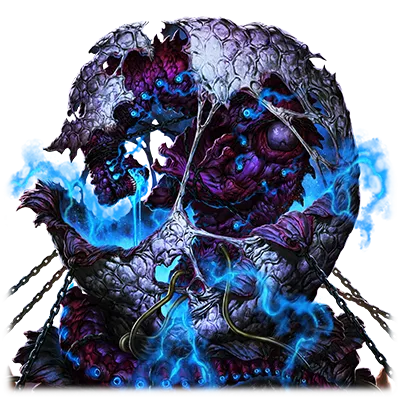
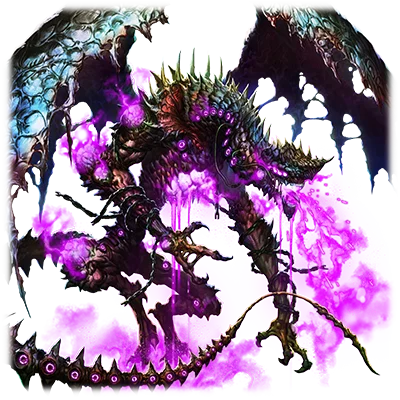

# 憎恶之源的古龙

| 角色信息   |  |
| ----------- | ----------- |
| 名称    |纳格尔法尔之卵 |
| 年龄   | UNKNOWN     |
|观测结果 |一颗缠绕着瘴气的卵，看起来似乎是太古时期的遗产。|
|对应乐曲|Hainuwele
|初出版本|Chunithm Crystal Plus

注：接下来的剧情将包含众多视角和不同时间点的插叙，强烈建议先阅读完前面的所有篇章理解完毕剧情再观看。

## Episode 1 亦神、亦灾厄

>巡礼教团发现了一颗谜一样的卵。而这颗卵，正是绝对不可打开的潘多拉之盒。

沙沙。

可以从很远的方向听到挖掘土壤的声音。

声音越来越近，越来越响。最终，一束阳光终于照进了这里。

被埋在地下不见天日，已经经历了多久呢？

不，已经不能用“多久”二字来描述了。已经经历了无比漫长，足以让无数个文明轮回再生的漫长时间。

而这邂逅也并非偶然，只是无数命运之中的细小齿轮，最终聚集到了一起而已。

不过……现在仍旧不是苏醒的时候……。

——那是一个无比巨大的“卵”。

在黑色的大地·纳格尔法尔，巡礼教团挖出了这颗巨大的卵。而最终他们将这颗卵送到了教团的巫女，塞夏特所在的地方。

巡礼教团，那是一群以发掘那些曾经被称作管理者的旧日神明所遗留下来的，被称作“森罗万象记录”的遗物为主业的人们。然而即便是见惯了各种遗物的教团，面对这个巨大而且散发着不详气息的卵，也仍旧是手足无措。

从卵中散发出邪恶的瘴气，然后，就像是被其吸引来一般，冒出了各种异形的怪物，开始袭击起人类。

以神话教国为首的各个国家，都陷入了混乱。

在卵被发掘出来的同个时期，远在大陆的极北之地。

在荒无人迹的未开地的中心，突然出现了一座巨大的光之塔。

而卵似乎也被这座塔呼唤着，鸣动着。

被卵所放出的瘴气所魅惑的塞夏特，最终得出了判断——卵的真面目是正在沉眠着的神之御体。

以让神重新诞生于这片大地为己任的教团，认为将卵带到光之塔的所在地奉上的话，就能够达成他们的目的。于是，以塞夏特为首，他们组织了一队车队，前往遥远的大陆北方，光之塔所在之地。

到底这颗卵是他们所期望的神明呢？亦或是灾厄呢？

现在，卵的意识仍旧在一片混沌之中，缓缓地等待着苏醒之时。

## Episode 2 被魅惑的盲信者

>教团的巫女随着时间的流逝愈发自信。然而从她的眼中露出眼神，却充满了疯狂。

巡礼教团的车队，已经在荒野上行进了数日。

前几天，队伍才遭到怪物的袭击，不得不停下来休整一天。现在正是傍晚时分，教团的人们点起了篝火，为明天的远行养精蓄锐。

当夜幕降临，众人各自回到自己帐篷的时候，塞夏特支开了负责看守的信徒们，一人走进了保存着巨大的卵的地方，并且暂时将其身上的重重封印解开。

当所有的封印都被解除之后，塞夏特用全身贴了上去。

“这骇人而充满神性的鼓动，真不愧于‘神之卵’之名……”

塞夏特露出一副陶醉其中的表情，轻轻地抚摸着卵的表面。虽然仍旧沉醉在眼前的这颗卵，但她还是试着回顾了一下此行的目的。

“那座和卵的发觉同个时期出现的光之塔……这两者之间必定有着什么联系。而现在也是，随着卵越来越接近这座塔，它的鼓动就越来越强烈……那么让神明复活的关键，应该就是将这个卵献给这座塔了吧……而且……”

塞夏特想起了在途中遇上的，和他们同样前往光之塔的两名少女。

“神话教国的巫女，塞拉菲娜……她手上拿着的剑正是神所留下来的圣遗物，根据她所说，那把剑也和那座塔遥相呼应的样子。那么，那把剑想必肯定和这颗卵，以及背后的神明有关吧……”

综合了各种线索，笃定这颗卵就是神明的幼体的塞夏特。

决定以自己的双手，让神明降临于世间。

虽然在巡礼教团之中也有人并不相信她的说法，不过面对巫女的地位他们也是敢怒不敢言，就这样，一行人来到了塔的脚下。

“先我们一步前往光之塔的塞拉菲娜和米姆吗……就算是神话教国的巫女，也别想妨碍我们巡礼教团的神明。为了不让她们妨碍我们的计划，必须加快脚步才行……”

就像呼应着塞夏特那异常的目光般，卵发出了响亮的鼓动声。

## Episode 3 难以被称为神的存在

>被运到塔下的卵，终于苏醒。而庆祝其苏醒的，则是人类的悲鸣。

塞夏特他们的车队来到阿普斯之谷的顶端，在他们脚下的不远处，就是塔的入口。在那里，某样超乎现实的场景正在那里上演。

“塞拉菲娜、米姆……还有那个东西……那到底是什么？”

那是宛如石壁一样高大的铁之巨人。铁巨人以和拿庞大身躯形成反差的高速，向着二人发动攻击。

塞拉菲娜挥舞着身为神的圣遗物的圣剑·神统奏鸣剑，躲开铁巨人的猛攻，向着敌人挥出道道剑光。米姆则站在后方，用光弹为前方的塞拉菲娜打掩护。

这幅光景，让人不禁联想起曾经在传说中描述的，神明之间那天崩地裂的激战的模样。塞夏特甚至看到入了神，忘记了自身的目的。

然而，就在这时。

“塞夏特大人！！卵、卵的样子……！！”

回头一看，卵的外壳早已开裂，从中伸出无数的触手，将在场的信徒们一一杀死。

无数的触手就仿佛鞭子一样在空中乱舞，碰到的人的身体都会被瞬间击碎，从人变成无数的碎块。

“哦哦，神啊！！终于……终于重新降临到我们的身边了吗！！”

陷入恐慌中的信徒们，要么大喊着卵并非神而是恶魔的事实，要么跪倒在地，拼命求饶，最终被触手击个粉碎。然而，塞夏特的却目前这异样的光景充耳不闻。

与之相反，塞夏特仿佛是为“神”的复活而欣喜若狂，在血水和尸块的暴雨中高喊着，大笑着。

“……！！”

下个瞬间，一道宛如雷鸣般的巨响爆发，让塞夏特和在场的信徒们都呆在了原地。

震耳欲聋的声音，仿佛连周围的空间都能扭曲。而当他们再度睁开眼睛的时候，“那个东西”出现了。

“这个声音……不对，这个声音……是神明的声音吗！？”

不知何时，已经看不到刚才将信徒们杀死的触手了。

在卵曾经所在的地方，取而代之的是——

一只宛如被腐肉所聚集起来组成的，宛如一条巨蟒般的怪物。

从那可怖的口中喷出的腐臭气息，和所谓神明的形象，实在是相差甚远。

## Episode 4 始祖的继承者·乌休姆加尔

>明明很清楚眼前的存在是不该存在于此的东西，然而，已经太迟了。

## Episode 5 破坏和死亡的象征

>一边是向着周围平等地降下死亡的制裁的灾厄之巨龙，另一边，则是从天而降的，苍蓝色的神剑。

## Episode 6 斩断灾厄

>当战斗结束之后，导师意味深长地说着。仿佛就像在和一位认识已久的老友对话般。

## Episode 7 愿望化为力量

>悲鸣，惨叫，以及从内心深处涌现的愤怒。为了保护受伤的友人，少女举起了剑。

得知真相

## Episode 8 战争的轮回

>出现在少女面前的，是从那天起直到现在的，所有的记忆。而在不久的未来，她将会知道将这一切托付给自己的理由。

## Episode 9 与血脉相连之人的邂逅

>眼前的她如此说着——相比所谓的正义，或者所谓的理想，真正重要的，是那少许的温柔。

完成约定

## Episode 10 米姆的真意

>少女等待着这个瞬间。从十年前，百年前……从遥远的时间尽头直到现在，一直等待着。

## Episode 11 她的意思，我的意思

>塞蕾。米姆。框架主脑以及涅墨西斯。诸多东西浮现在塞拉菲娜的脑海中，她做出了决定。

