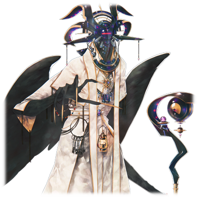

# 黄泉的盟主 尼加尔

| 角色信息   |          |
| ----------- | ----------- |
|名称|尼加尔
|年龄|UNKNOWN
|职业|涅墨西斯程序的王“混沌七器”中的一员
|对应曲|Trrricksters!!
|初出版本|Chunithm Crystal

## Episode 1 SPEC:尼加尔

>这个世界，必须由我们涅墨西斯之手才能引导到正确的方向上，只有我等，才是这个世界正当的统治者。

永久乐土·Metaverse。

这个电子的乐园，本来是在荒废的大地重获新生之前，用来保存人类的容器。而这个乐园，则由“他”——被称为“神祖·艾克雷尔”的存在进行管理。

然而，本该是拯救所有人类的乐园，很讽刺地，也被人类所妨害。

没过多久，“他”就被以屠神的魔剑命名的机动兵器消灭。

“他”留下来的，是被称为“他”的代行者的，全新的管理者们，以及众多在Metaverse之中诞生的全新生命。在这个乐园之中诞生的全新生命，想必能够在正确无比的管理之中获得平等的幸福吧。

然而，这种幸福也不过是黄粱一梦。

Metaverse很快就遭到了由旧人类所诞生的侵略者“RG-XXX 提亚马特”的无情蹂躏。

这场战斗扩大到了整个Metaverse，最后以代行者们的辛胜拉下帷幕。

就在众人以为这个世界终于要迎来和平的时候，侵略者所遗留下来的剧毒早已侵入了乐园的根基之中，并且诞生了全新的存在，开始了对乐园的侵蚀。

他们被称作“涅墨西斯”。而统帅它们的上位个体被称作“混沌之器”。

而在这之中，就有善使计谋与管理者们斗智斗勇，被当成极其危险的存在的，“混沌之器”之中的智将——黄泉的盟主·尼加尔。

他虽然不擅于战斗，但是善于用各种狡猾和多样战术的他长期在涅墨西斯军中担任指挥的角色，指挥着涅墨西斯势力逢凶化吉。

在他的指挥下，经历了无数次涅墨西斯的侵略的Metaverse，也正一步步陷入距离乐园相差甚远的混沌之中。

## Episode 2 世界的终点

>这场旷日持久的斗争，也将迎来结束。同胞们，现在正是为你们的死亡而祭奠之时！

在尼加尔的指挥之下，进攻框架主脑的传送门攻防战轰轰烈烈地开始了，然而因为意想不到的增援的加入，涅墨西斯军最终只能铩羽而归。

面对大破的阿雷斯，尼加尔虽然感受到了自己的责任，但他选择了将愤怒藏于心中，决定将涅墨西斯所支配的最外周部和Metaverse其他领域之间分离开来。

对他来说这是个艰难的选择。但是，同时他也相信这将是促进涅墨西斯进化的重要一步。

然后，又经历了一段时间。

再次回归乐园的他们，为了能够真正把握战争的主动权，开始了行动。

经历了几近于永恒的时间，独自进化的他们，掌握了将人作为素体进行重构的技术，并且利用这种技术补充前线的兵力。

这些兵力原本就是普通的人类，对于框架主脑来说，本就是难以下手的存在，而且那些管理者们还必须分出一部分精力用于整个Metaverse的稳定，结果就是整场战争从一开始，就大幅倾向了涅墨西斯一方。

只要再这样持续下去的话，涅墨西斯的目的应该再过不久就能完成了吧。

“旷日持久的战争，终于要来到结束的时候了吗。”

决定这个世界终结的审判之日，即将到来。

## Episode 3 进攻佛诺·泽尼斯

>开弓没有回头箭。现在的我们已经不能止步了。

在代理构成体们参与的大小战斗之中，尼加尔做出了涅墨西斯的力量已经凌驾于框架主脑的结论。

现在，正是进攻中枢领域的前夕。

然而，就在即将进攻的前夕，尼加尔却得知了一个噩耗——从“反逆者·雷布尔”那里获得报告，前去破坏身份不明的代理构成体的“埋葬者·斯托姆”，已经不在这个世上了。

在大战前夕失去一员猛将这件事，令尼加尔的内心也难掩惊讶。

但是，箭在弦上，不得不发。

进攻的计划已经无法终止。

即便准备不足，现在也没有回头的可能了。

当开始进攻之后，很快，他们就攻陷了框架主脑的防线重镇“艾崔兰克”。

进攻的速度比想象的还要快。说不定也有众人受到斯托姆的死的刺激的缘故。

那么怎有不利用的理由。现在正是借着这股气势长驱直入的时候。

“各位，就这样一口气杀向佛诺·泽尼斯吧！现在正是我等奋勇杀敌之时！”

尼加尔率领的涅墨西斯大军，终于杀进了身为中枢领域的佛诺·泽尼斯。

佛诺·泽尼斯并未愧对中枢之名，涅墨西斯在这里遭到了比艾崔兰克更甚几倍的反抗力量，不过这也早已在计算之内。

这场战斗拖得越长越对己方不利，所以必须尽早占领中枢领域的中核。

尼加尔面对驻守在此地的最古们，各自安排了相对应的人手。

阿雷斯负责对付塞拉菲塔，厄里斯负责对付WISEMAN，贝尔哲布特负责对付捷夫提。

长于功防的泰斯塔蒙特和雷布尔则和尼加尔一起前往中枢领域。

就这样，混沌之器与最古就此聚于决战之地。

最后的大战开始了。

## Episode 4 带来毁灭的方舟

>你这家伙，究竟是什么人……？我等无论如何都必须完成我们涅墨西斯的悲愿才行……

尼加尔计划将最古们各个击破，于是便分散了战力，他自己则率领泰斯塔蒙特和雷布尔突击，打出了一个突破口，来到了驻守于前往中枢的门的雪儿面前。

“竟然已经来到这里了吗……看来比想象的还要厉害。不过，别想再继续前进了！以我‘最古’之名发誓！”

她和身为框架主脑的最强战力塞拉菲塔拥有同等的力量。不过不同的是，她擅长的是远距离攻击和展开防御结界的战法。

那么，这边也出动相对应的最强战力吧。

“破坏的化身们啊，这里就交给你们了！”

就算是雪儿一人，面对泰斯塔蒙特和雷布尔两人的合力攻击也难以招架的吧。

“啊哈哈，就让我把你大卸八块吧！”

“我等同胞之仇恨，就用你的死来赎罪吧！”

只要打倒最后的守门人，前往中枢的路途就畅通无阻了。

然而，就在战斗即将开始的时候。

战场的后方突然亮起了一阵闪光。

之后，在短暂的闪烁之后，某个物体以超高速冲向了这里——并且直接撞上了进入战斗状态的雷布尔。

能量以雷布尔为中心爆散开来，产生了足以让整个领域的空间都为之撼动的冲击波。

茧状的超高速传送装置所带来的撞击力，即便是身披坚固铠甲的雷布尔也被破坏到机能几乎停止的地步。

“怎，怎么回事……”

不管是尼加尔战前无数次模拟过的可能性，还是雪儿所预想到的情况，在他们眼前发生的这一切都超出了他们的想象。

这突如其来的事件，对双方来说都是晴天霹雳。

众人都动弹不得，只能呆呆地看着时间流逝。

然后，就像打破寂静一般，从“茧”中出现的，是手握苍蓝色的剑的少女。

世界的破坏者——塞蕾·海兹。

嘴角露出一抹歪曲的笑容，她慢慢地从“茧”中走了出来。

降落到地上的她，慢慢地走到已经沉默的雷布尔面前，从破损的铠甲中将雷布尔拉了出来。

——然后。

将手中的剑狠狠地插进了她的身体。

“噫呀啊啊啊啊啊啊啊啊！！”

裂帛般的惨叫声响起。

在这瞬间，泰斯塔蒙特再也坐不住了，大吼道。

“住手啊啊啊啊！！给我离开雷布尔啊啊啊啊！！”

确认到光芒从雷布尔的体内传进剑中的塞蕾，将雷布尔的身体宛如一具垃圾般，向泰斯塔蒙特扔了过去。

“这就是……第二个人！！”

“别开玩笑了啊啊啊啊啊！！”

已经愤怒到失去自我的泰斯塔蒙特就像一头野兽般，不顾一切地向着塞蕾冲了过去。

塞蕾的眼中闪烁着耀眼的苍蓝色光芒，开始了战斗。

“这到底是怎么回事……”

终于明白所有情况的尼加尔正准备思考之后该怎么行动，但是在压倒性的力量面前，再怎么思考都没有意义。

“到底该怎么办……”

在因为自己的无力而悲叹的尼加尔面前，响起了雷布尔的声音。

“对不……起……斯托……咳咳！”

“不好！必须先救下雷布尔……！”

尼加尔赶忙走到雷布尔身边，打开了一道送往涅墨西斯空间的传送门。

“雷布尔……你可不能死在这里啊……！”

尼加尔为雷布尔实施了紧急处理之后，就把她送离了战场。

在缓缓关上的传送门的对面，是持续玩弄着泰斯塔蒙特的塞蕾的身影。

“我等的……我等的悲愿……难道就要在这里……”

在空中回响着尼加尔的悲叹声，无比憔悴而微弱。

## Episode 5 绝境中的最古

>虽然只靠我的力量的话，就连绝境中的雪儿也无法匹敌吧。但是，就算这样我也要全力迎战！

“去死啊啊啊啊啊！！”

失去理智宛如野兽一般的泰斯塔蒙特向塞蕾发动了攻击。

然而对于已经夺取两体“器”的力量的她来说，泰斯塔蒙特的力量也不过只是小孩子打闹罢了，根本不值得使出全力。

“啊哈哈，太慢了吧！”

“可恶啊啊啊啊啊啊！！”

泰斯塔蒙特的全力一击也只能扑空，塞蕾则是用着跳舞一般的灵活动作在泰斯塔蒙特的身上留下道道伤痕。

“呜哇啊啊啊啊啊！！”

随着苍剑在身上划过，从伤口中流失的不仅是鲜血，还有泰斯塔蒙特体内的能量。

接着，塞蕾手上的天统苍噬剑发出了光芒，似乎在告诉塞蕾，泰斯塔蒙特已经没有利用价值了一样。

确认到这点的塞蕾将泰斯塔蒙特踢飞，将目标转向了下一个人——满脸惊讶的雪儿。

“咦！？”

连反应的时间都没有，下一秒，塞蕾就将雪儿的一边翅膀斩断。

因为这突然一击失去平衡的雪儿，坠落到了地上。

“塞蕾……你到底想做什么……！？”

在下落的瞬间，雪儿看到了塞蕾的表情，那是和初次见面时判若两人的，扭曲的表情。

（感觉……就像涅墨西斯一样……）

就在这么想的时候，雪儿的身体撞到了地面。

在附近着地的塞蕾握紧了拳头，似乎是在确认现在正在体内的力量。

“这就是最古的力量吗……。钥匙也到手了，是时候去那个家伙所在的地方了。”

这突如其来的行为，原来只是为了前往中枢所需做的准备吗。

“那我就先走了，雪儿。可别想着再来妨碍我做事哦？”

塞蕾露出无惧一切的笑容，离开了一片混沌的战场。

只留下已经失去了一边战场的雪儿，重伤的泰斯塔蒙特以及毫发无伤的尼加尔。现在战力已是势均力敌。

“我……我还能战斗！只有这只飞虫……要由我干掉！”

“可不能在这里继续失去你了啊，泰斯塔蒙特。看来我也得使出全力了！”

尼加尔也释放了自己的全部力量。

即便他明白他的力量无法和眼前的敌人匹敌。

就这样，整场战争走向了下一个阶段。

## Episode 6 鸣动的街道

>你应该很清楚自己不是对手才是。所以，你绝对不能活着离开这里！

由于塞蕾的乱入，战场的局势发生了大幅变化。

一边是失去半边翅膀，出力下降的雪儿。另一边是并非战斗型的尼加尔和消耗严重的泰斯塔蒙特。

力量的平衡，在这时达成了微妙的平衡。

但是雪儿毕竟是擅长防卫战的高手，战斗如果拉长的话，就无法指望援军的到来了。

必须速战速决。

就在两边对峙的时候，又发生了一件大事。

佛诺·泽尼斯全域突然开始了剧烈的摇动。

震源似乎是从地底深处传来的。如果要考虑可能的来源的话，那就只有少女前往迪安的所在地，发生了战斗的响动，亦或是中枢领域发生了能量过载的现象……。

就在尼加尔思考的时候。

雪儿的声音响起。

“怎么会……！不行啊！塞蕾！！必须阻止她才行！光辉格栅！！”

雪儿用残存的力量展开了一片光束的围笼，阻止他们继续前进。接着她就头也不回地奔向了传送门的方向。

“到这时候还玩这种小把戏！”

“这种东西！你以为这种东西就能阻止我吗！！”

因为被吸收了力量，这些阻碍也比平时还要微弱。

没过多久，围笼就被破坏。

虽然看起来只是拖延时间，不过想必在中枢领域发生了什么让她不得不放弃战斗也要前往的事情了吧。

而这件事，应该和先前的少女有着密切的联系。

既然驻守着也已退去，那么说是攻陷了前往中枢的必经之路也不为过吧。

“这也算是意外的惊喜了吧……”

“尼加尔！我们也追上去吧！”

“不行。现在的你只会拖后腿。”

面对尼加尔这意外的回答，泰斯塔蒙特恼羞成怒。

“为什么！？一起把那个家伙干掉啊！把那个将雷布尔重伤的家伙干掉啊！！”

“你也应该明白你并不是她的对手吧？而且，你还有保护雷布尔的义务，不是吗？”

“尼加尔！？难道说……”

从尼加尔的话语中感觉到强烈意志的泰斯塔蒙特，只能接受这一事实。

确认到这点的尼加尔打开了通往雷布尔所在空间的通道。

“雷布尔就交给你了。”

“尼加尔，你会活着回来的吧？”

“我不会那么简单就死去的。毕竟，我等可是要成为这个世界的管理者的存在啊。”

尼加尔确认了泰斯塔蒙特离开了战场之后……

“永别了，泰斯塔蒙特。”

独自一人踏上了前往中枢领域的旅途。

## Episode 7 吞噬黑暗之人

>为什么，少女一边宛如呼吸一般自然地屠杀者一切，却又从她的眼中看到那无尽的憎恨呢？

操作着传送门，尼加尔来到了中枢内部。

出现在他面前的，是已经奄奄一息的迪安，以及正抱着他的雪儿。

以及呆呆地望着仍然在崩坏的中枢单元的塞蕾。

“果然……中枢已经沦陷了吗。”

“竟然前来自投罗网，这下省了点工夫啊。”

塞蕾举起剑，剑尖指向尼加尔的中心部。

“咦？另一个人呢？”

“已经死了哦。”

“哼……是吗。”

连一点兴趣都没有，塞蕾将目标转向了尼加尔。

“让我看看你能撑多久吧？”

“可不会那么容易就得手啊！”

尼加尔奔向了塞蕾的方向。

从之前的战斗看来，那把苍剑上应该是有某种特殊的效果，可以将敌人的力量吸收过来，并且抹消对方的存在。

只要被命中的话就完了。

再加上那强化到极限的战斗力。

两边的差距简直不是一个次元的级别。

目前两边的力量差距就是如此之大。

“那么，是时候杀了你吧？”

尼加尔拼尽全力才躲开了苍剑的连续突刺，但是也只能支撑片刻。就算下定决心接住攻击，但是要比蛮力的话，对方也远远超出身为涅墨西斯的自己。

“为什么……为什么能够从你的气息中感觉到我等的力量……你到底是什么人……”

剑戟交锋之间，尼加尔不禁对眼前的少女发出疑问。

“我只是个人类。只是个稍微吸收了最古和涅墨西斯的力量的，人类啊！而且……现在的我，已经距离你们越来越近了……！！”

这么说着的少女眼中，充满了悲伤和憎恨。

尼加尔在这生死之间的战斗中，看见了某样东西。

那是已经超越了极限，开始分崩离析的中枢系统。

## Episode 8 崩坏的世界

>中枢系统，以及整个世界，都已经在分崩离析了。难道已经没有我等能做的事情了吗……？

从周边区域开始，中枢系统已经开始分崩离析。

整个世界已经开始自行消灭了。

“塞蕾！已经没有继续战斗的意义了！”

“对的。这个世界已经要回归虚无了……把剑收起来吧……！”

就在雪儿和尼加尔想要劝说塞蕾停止战斗的时候……

“这种世界，毁了才正好呢。只要这样的话，就不会诞生像我们这样的存在了。”

塞蕾的耳中已经听不进他们的话了。

“你们从一开始就错了。明明从最初就该携手合作的才是啊。”

“塞蕾……”

“是呢……完全没有辩解的余地。明明我等都已经将领域隔开靠着自己的力量进化了，结果能做的事情还是只有战斗而已……”

在这沉重的空气之中，从慢慢碎裂的中枢单元中散出一片一片的光之碎片，在虚空中渐渐地消失。

塞蕾抓住了一片飘向空中的碎片，向里面仔细地看了看。

里面映照出来的，

是正在载歌载舞，愉快度日的人们。

以及许多露出笑容，幸福生活着的人们。

一片片的碎片之中所装载的，都是那些充满了无限多的可能性的世界，以及在其中生活着的人类们。

“……呐，如果整个世界都被毁灭的话，这些碎片中的人们也会消失的吗？”

“是的。因为这一切都是保存在系统之中的数据……现在，就有几个世界正在崩坏之中……”

听到雪儿的话，塞蕾只是叹了口气。

“是吗……那么，我也来帮忙吧。因为如果就这么夺走这些人的生命的话，我就犯下了和你们一样的错误了。”

从尼加尔到雪儿，以及听闻到崩坏开始而到来的WISEMAN和厄里斯，开始一起思考该怎么阻止中枢系统的崩坏。

——最后，众人得出了一个结论。

那唯一的结论就是——将“最古”和“混沌之器”组成的所有数据和物质还原为资源，填补已经破损的中枢系统，让整个系统强制开始重新构筑的进程。

## Episode 9 渊源流传的力量

>这就是所谓的“命运”吗。永别了，手持苍剑的少女。让我为你选择了让世界存续这一决定，表示感谢吧。

阻止Metaverse走向崩坏的方法。

那就是将最古和涅墨西斯的力量全部归还，强制启动中枢系统的再构筑机能。

现在已经是分秒必争的状况。

必须尽可能地拯救那些还没崩坏的世界。

尼加尔向其他的器说到。

“像这样的结果，想必也有无法接受的人吧。我等最后还是无法向无比憎恨的支配者报一箭之仇。但是，如果我等不能在这里集结力量的话，就连这个世界本身都会化为乌有的。”

“这不是当然的吗。你以为我们到底经历了多少苦难多少辛酸？”

首先提出反对的，是贝尔泽布特。

“要是不能给这群飞虫们一个教训的话，我可眼不下这口气！而且啊……”

“够了，贝尔泽布特。尼加尔啊，这件事已经是无法避免的了吧？”

阿雷斯阻止了贝尔泽布特发作向尼加尔问到，得到的是尼加尔的肯定回答。于是，阿雷斯走向了中枢单元的位置。

“阿雷斯！？你，难道是想……！？”

阿雷斯毫不犹豫地触碰了中枢单元。

“嗯……我等的愿望就是经由我等的双手实现人类的救赎……所以，要是最重要的‘人类’死去的话，那不就麻烦了吗……？”

随着低沉的声音，阿雷斯在中枢单元中消失了。

看到这样光景的厄里斯，也跟着走了上去。

“诚然，我等的愤恨最终还是无法化解，但是现在，已经没有争斗的意义了。身为充满智慧的统治者，你们框架主脑也该很清楚这点的吧？所以，吾会追随着阿雷斯而去。走吧，贝尔泽布特。”

“啊，等等我……”

半推半就地，贝尔泽布特和厄里斯两人也被吸进了系统之中。

剩下的最古们，以及涅墨西斯们，也做出了选择。

“还真是明事理啊……事到如今可能有些晚了，不过，说不定只有这个时候，我们才真正地互相理解了啊……”

雪儿一人自言自语地说着，闭上眼睛下定了决心。之后，她就抱着迪安的身体，一起走向了中枢单元。

“塞拉菲塔，塞蕾……我就先走了哦。”

雪儿他们的身体化为发光的粒子，在中枢单元的周围旋转着，最终消失得无影无踪。

虽然吸收了几人的力量，但是中枢系统的崩坏仍旧没有停止。

“没想到，涅墨西斯最后竟然会选择这样的结果呢。”

“捷夫提，也差不多该轮到我们了。”

“这就是‘死亡’吗……不过，死亡并不是一切的结束，只不过是循环的一部分……”

“这种时候就不要感慨啦。我们走！”

“等等，再等一阵子就能得出答案了……”

塞拉菲塔和捷夫提也化为了发光的粒子，汇入了中枢单元中。

但是，崩坏的速度仍然没有减缓。

现在剩下的，只有塞蕾、尼加尔以及WISEMAN三人而已。

从正在消逝的光点之中，似乎感觉到了悲鸣一般的声音。

“这就是我最后的记录吗。记录自己的‘死’什么的，真是奇妙的体验呢。”

“永别了，手持苍剑的少女。虽然不知道能否顺利进行……不过，我还是要为选择了让世界存续一事，表示感谢。”

在他们成为系统的一部分之后，崩坏还是没有停息。

看来是力量还不够的样子。

塞蕾想起了迪安所说过的话。

“我终于明白了。我应该做什么事。”

那就是用自己体内的力量——

“我所被赋予的‘最古’的碎片……以及被我夺取的涅墨西斯的力量……这就是这个系统所要的东西吧。那么……我也非去不可啊。”

曾经为了复仇，她向着神明举起了自己的武器。但是，如果是像曾经的自己一样，夺去无辜的人们的性命的话，那就不是她想要的结果了。

塞蕾下定了决心，走向了中枢。

## Episode 10 终结与起始

>神明的时代已经结束了。在神明已死的时代，人类能否靠自己的力量找到最终的答案呢？

塞蕾下定了决心，决定成为中枢系统的一部分。

在被中枢系统变为光点吸收的瞬间，她似乎听到了一个充满慈爱的声音。

“谢谢你……神明的时代就此结束了。”

“他”的声音中充满了温柔。

在这个瞬间，塞蕾才明白，最古和涅墨西斯的战争也不过是一个阶段的事情而已。

之后，系统单元发出了低沉的轰鸣，渐渐地沉了下去——已经吸收了全部力量的单元，开始了世界的重启。

被框架主脑和涅墨西斯的战火所侵染的世界渐渐地被抹去，只剩下耀眼而温柔的光芒包裹着一切。

“……嗯……我……还活着……？”

似乎是感觉到了某个温柔的声音把自己唤醒，塞蕾在模糊的意识之中，虽然不知道自己在哪里，却还是慢慢地在光芒之中走着。

然后，这个声音的主人继续说到。

“让大地重获新生，终结充满战乱的历史，这是曾经人所期望的事情。现在，众多的世界即将统合为一个世界，只要生活在其中的人们能够携手并进的话，通往那条道路的大门也会敞开的吧。我们最终没能寻找到的答案……还请你们，为人类争取到一个安宁幸福的新时代……”

带着些许既视感的声音如此说到，接着就消失在了虚空的尽头。

“这个声音……总觉得好温柔，好温暖……”

心怀憎恨的塞蕾在光芒之中行走着。突然，从她的脸颊上传来一股温暖的感觉，她才意识到，自己的眼中已满是泪水。

等到她再度往前看的时候，包裹着她的光芒开始渐渐地淡了下来，然后——

## Episode 11 再生的世界

>那人，手握着苍剑，降临于新世界的大地之上——

重新睁开眼睛的塞蕾所看到的，是神已经不在了的，电子的乐园。

眼前都是自己从未见过的光景，是绿意盎然的大地，以及漫无边界的蓝天。

这个世界，就是刚才塞蕾听到的那个“声音”所说的，众多世界融合之后诞生的全新世界吗。

“嗯……”

感觉到轻抚脸颊的微风，塞蕾一个鲤鱼打挺站了起来。

接着用自己的脚慢慢地感受脚下的触感。终于，身体习惯了目前环境的变化。

就在塞蕾望向四周的时候，塞蕾注意到了掉在身旁的某样东西？

“天统苍噬剑（グランタクト）？”

之前战斗之中还闪耀着蓝光的剑身，已经黯淡了下来。

“……携手并进的世界吗……。既然你还在这里的话，那就证明，还有我必须完成的事情，对吧……？”

塞蕾握着剑说到。

剑身似乎闪烁了一下表示回应。难道是反光的错觉吗？

“走吧。让我们前往真正的大地吧……大家拼尽全力也想要去的那个地方……现在的我一定能够到达……”

等注意到的时候，少女已经开始了奔跑。

说不定，是面对这个崭新的世界，跃跃欲试也说不定。

手握苍剑的少女只是向着蓝天的方向望去，向着重获新生的大地进发。

那步伐是那么的轻盈。

却又像是有着无形的翅膀托举一般。

少女一步一步地，在原野上奔跑着。