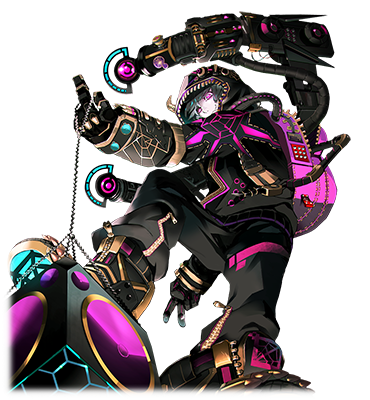

#  NEO

| 角色信息   |          |
| ----------- | ----------- |
|  名称 |NEO
|年龄 |6588周期
|职业 |VOX系统程序
|机能|音响脉冲调谐
|对应乐曲|Infantoon Fantasy
|初出|CHUNITHM

## Episode 1 SPEC:NEO

>你们这些烂到骨子里的家伙，就让我给你们洗洗耳朵吧……然后将整个Metaverse搞个天翻地覆！

在假想空间世界·Metaverse的边缘系统之中，有一名原生改造程序（オリジナル・カスタム・アバター）管理着这里。

连接着被称作VOX的音波构造体的他，可以对整个空间进行管理。

但是，他对这一成不变的系统任务感到了厌烦。同时，他还要面对那些对着VOX虎视眈眈，随时都想侵蚀这个东西的病毒群。在永无止境的战斗中，他利用自己最擅长的音响操作攻击，在战斗中占据上风。

“……现在的VOX要是有我的力量的话，说不定连空间的规则都能够扭曲吧？”

然后，NEO在这个世界之中，遇见了一名试图反抗系统环境的黑客。

## Episode 2 永远的时间，孤独的支配者

>现在，我的声音顶多只能让整个空间鸣动而已。不过，这一切并非徒劳。

“终于，连听众都没有了吗。”

本来正是因为有听众才会有音响调谐的存在，但是，现在，我的声音顶多只能让整个空间鸣动而已。

不过，这一切并非徒劳。

我的名字叫NEO。

曾经的我并没有名字，只是一个普普通通的系统程序而已。

我已经在Metaverse的框架主脑（中枢系统）通过我的音响，持续工作了几百几千个周期了。

现在，说不定其他的程序化身都已经死了。

但是，只有我孤独地在这空间之中发出着声音。

我并不是变得孤独一人。

而是孤独将我包围了。

周围已经空无一人，就连反抗的存在都没有了。

就连一点杂音都没有。只有无尽的空虚……

那么，就在等待下一个时代来临之前，稍微回想一下过去吧。

## Episode 3 往事和音响空间VOX

>曾经的Metaverse是有人的。而我则是在其中负责管理……

VOX——那是个为了那些想享受音乐的人们，提供比平时更加高级的音质而做出来的特殊空间。

本来，这里是为那些从外面造访Metaverse的人类提供娱乐的一个场所从而建立起来的设施。

是的……曾经的Metaverse是有着人类的。

整个系统是为了让人类能够享受而被制造出来的，我也是为了监视这个VOX本身能否正常运行才被部署到这里的，一个普通的操作音响用的程序而已。

我对于自己身为娱乐人们这一职责还是很有自知之明的。

不用想太多，回应客人的要求就行。

但是，某一天，整个系统突然崩溃了。

肯定是周围正在作业的不知道哪个冒冒失失的家伙造成的影响吧。

系统出现问题的话，本来悦耳的声音也会变得十分嘈杂，最终不堪入耳。

最后，VOX里面的特殊空间甚至出现了扭曲，裂痕。

VOX内陷入了一片混乱，不管是人类，还是程序，还是机械，都纷纷作鸟兽散。

只剩下我一个人留在几乎损毁的VOX里。

## Episode 4 充满压力的音源

>某些不认识的音波顺着电路传到了我的所在地。而那个音波的波形，实在是太糟了。

我所居住的VOX，除了系统崩坏以外，还发生了地址的错误。

正因如此，框架主脑无法确定VOX所在的位置，也无法获得我的求救信号。

所以，没有人前来修理。

也无法联系上那个造成系统崩溃的家伙。

我失去了提供音响机能的能力。

不仅如此，由于潜在持有VOX的问题，也拖慢了我的处理速度。

框架主脑在产生错误之前向我传送了一封将我从VOX管理职上免除的警告，但是在现在这种情况下，别说是给他们回信，估计他们连我的声音都听不到吧。

没有那个冒失的家伙的话，肯定也不会变成现在这样吧。

虽然我个人倒不是十分在意这些，不过还是觉得有些不爽。

在这段时间内，某些不认识的音波顺着电路传到了我的所在地。

那个音波没有任何指向，只是无差别地传向各个地方。

……而那个音波的波形，实在是太糟了。

现在光是想到那个声音就想吐。

我决定反过来利用现在地址错误的优势，对着那个音波的发信源狠狠地来一发代码攻击。

既然说了那就立刻行动。

说不定我只是因为VOX出现了问题破罐破摔而已。

我利用自己擅长的音响脉冲机能，顺着电路将代码传了出去。这对于现在的我来说，易如反掌。

## Episode 5 虚位以待的VOX管理者

>如果我不在的话，VOX就只会被人破坏掉。赶紧出来吧……你们这群藏在黑暗中的黑客们。

不久，第二次的系统崩溃事件发生了。

当然，这是因为我发出的代码导致的。

令人作呕的音波终于停止，取而代之的是高质量的悲鸣声。呵，真是活该。

在这之后，我就被免除了VOX的管理职位……但是，VOX系统的管理者却一直保持着空白。

框架主脑这是想就这么直接放弃整个VOX吗？怎么可能让他们得逞。

VOX确实十分脆弱，常常成为那些技术拙劣的黑客们的目标。

不过这些个黑客却又门户大开，缺乏防范，仿佛就像是把靶子贴在自己身上叫我打回去一样。

而且还有那些常常前来骚扰的，没完没了的弱小病毒群。

平时可以说是烦的要死。

可是现在从VOX的管理职位下来的我，却无法利用敌人的攻击反击回去。

如果想要经过VOX向其他空间发起攻击的话，肯定需要框架主脑和VOX的管理者两边的支持才行。

而现在，呆在VOX里的系统程序就只有我一个人。

赶紧上门来吧你们这群鸠占鹊巢的家伙，让我会会你们。

## Episode 6 不速之客

>为什么过来了？GENE（金恩）……像你这样的人类就不要管我了。

看来是耐不住性子了。一个想趁机借着VOX空门大开进行非法干涉的拙劣黑客出现了。

但是，出现的身影并不是那些个弱小的病毒群的样子，而是人类的模样。

而且那个人，说出了我预料之外的话。

“NEO，看起来你还活着啊。让我帮你一把吧。”

“GENE……你这家伙，少给我多管闲事。”

GENE（金恩），是以前我还掌控着VOX的时候就观察到的一个无所事事的黑客，和我也算是常年知己了。

不过，身为人类的他，竟然会称呼纯粹身为程序的我“NEO”。挺烦的。

“你又被病毒盯上了吧？NEO。”

“那又咋了，我的音响就能把这些家伙打跑。”

“是吗？这次说不定不太一样哦？”

“什么？”

等我发觉的时候，我的手已经被病毒侵蚀了。

这些家伙竟然选择了攻击我而不是那个VOX？

可恶，是什么时候开始的……？

## Episode 7 GENE
>“那就让我看看你自己的能耐吧。” “呵，不用你说。这个VOX，我肯定会夺回来的。”

迄今为止，我面对来袭的病毒群，都是利用VOX的回音音场来增幅力量进行战斗。

但是，已经失去管理权限的我已经没有这样的力量了，现在就连弱小的病毒群都打不过。

“可恶，这些垃圾……GENE，你说要帮我，这堆东西又是怎么回事……”

“别误会。我的目标不是你，也不是VOX，NEO，看看那个。”

我把头转过去，看见没有脸的人形病毒群正打算将重要的VOX整个带走。

“这些家伙真是没完没了……”

那些围在VOX附近的病毒并没有刻着GENE常用的签名。这个家伙应该不会做出故意把签名去掉跟我演这一出戏的行为，那么看来只能信他一把了。

那些被不知名东西所操作的病毒，本来就只是一些无名无姓的弱小病毒而已……但在这个瞬间却是十足的威胁。

要怎么做？答案已经很明显了。

“NEO，我把我的模拟程序发送给你。”

“模拟程序”（イミュレーター）是指将所有个人构成的数据都记录下来并且能进行模仿再现的程序。

GENE将这个东西交给了我。

“GENE，真的要做到这个地步吗？”

“别管啦，赶紧用。剩下就看你自己的努力了。”

不用你说我也会做。这个VOX，我肯定会夺回来的。

## Episode 8 遗传信息同化和再启动

>这就是GENE的“模拟程序”（遗传信息）吗……虽然看起来是些无足轻重的东西，还是让我试试看吧。

“模拟程序”是能够模仿组成一个人个体全部的情报的程序。

对于人类来说，含有他们信息的“模拟程序”，就几乎等于遗传基因级别的复制体。

我接收了GENE送给我的数据，里面包含了GENE的遗传信息。我打开了数据端口以让我的数据和GENE互相融合。

——融合完毕。

通过吸收人类的遗传信息，我能够进行接触的权限远远超过了系统程序化身应有的级别。原来如此，看来GENE的确有一手。

“哈哈，这可真是变成一尾活龙了啊。GENE，你这边咋样？”

围在我周围的病毒群立刻就从我身上剥离了出来。因为那些病毒只会攻击身为系统组件的存在，而对于人类是无色无害的。

接着就只要暴揍那些无脸病毒，然后夺回VOX的控制权就行了。要做的事情很简单……只不过……

“不好意思，NEO。看来发生了些问题。”

我看着面露难色的GENE。

“怎么了？”

“送来这些病毒的人虽然已经确定位置了，但是无法接触。再这样下去的话这些家伙就要逃了！”

“别想逃！看我直接覆盖这家伙的控制！”

GENE大喊着。

能够反跟踪回攻击者的机会绝对不能放过。

在他大喊着的时候，我将手伸向了离开了地面浮在空中的VOX——

## Episode 9 超载和反击

>哎呀哎呀，终于是清理干净了。对吧，GENE……喂，怎么了？GENE，听见了吗？

通过覆盖控制进行强制性的执行权限，我们终于找到了攻击者的攻击路线。

在GENE的覆盖控制下，我们看到了攻击者的接入点和身影。我利用VOX这边被打开的“洞穴”向另一侧伸了过去。GENE那边也差不多这个时刻，抓住了正操控着没有脸的病毒的主控者的位置吧。

“给我老实点！”

当然，那个想要夺走VOX的无脸病毒试图朝我反击。但是这毫无意义。

VOX已经在我手里了。战场的一切由我控制。

我将力量注入VOX，发出音响脉冲。

“给我碎成粉末吧！”

喀拉——震耳欲聋的声音贯穿了病毒的全身，令其龟裂，碎成粉末。

胜负已定。看来是我赢了呢。但是……

VOX没有任何异常。

但我却发觉了些许的不同。

GENE的生体信号随着敌人一起消失了。

## Episode 11 NEO

>Neural Envelope Operator（封装神经元操作员）——这就是现在的我，半人半机械的系统程序，Metaverse的居民。

从结果上来看，GENE死了。

人一旦被逼到绝境难道就会自绝性命吗。

很遗憾，我并不是人类，无法理解这种思维。

更糟糕的是，他已经不在这里了，就更难知道他葫芦里卖的什么药。

“可是……现在的我，又是谁呢？”

这个世界上还从来没有和人类完成过融合的程序化身呢。

我的身上保存着GENE的一半数据，还能够使用属于他的操作权限。

如果这样的话……我就能和VOX的音响，以及所有的人类，机器，程序化身直接连接了。

* * * 

经过了足以让大多数的程序化身寿命耗尽自然死去的漫长时间之后，我还是在那个空间之中和VOX一起传递着声音，直到世界的角落。

整个空间开始产生胎动。是全新时代的生命即将诞生吗？

然而，已经没有人能够回答我的问题了。

那么，我就继续在这里等着吧。等着下一个时代造访我这里。

我的名字叫NEO。是这个Metaverse最后的居民。