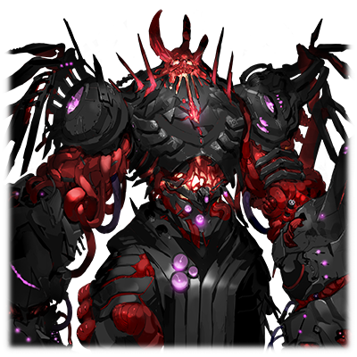

# 远古的混沌巨人

| 角色信息   |  |
| ----------- | ----------- |
| 名称    |反■者 ■■■ |
| 年龄   | U■KN■WN     |
|目的 | ■死■■苍剑■女人|
|对应乐曲|ハードコア・シンドローム
|初出版本|Chunithm Crystal Plus

注：本篇故事中会出现大块大块的方块，此为阅读效果。

## Episode 1 苍之楔子

>恨啊。恨啊恨啊恨啊！！那个将我的家人全部夺走的家伙！……绝对不会饶了你！！

“雷布尔……你可不能死在这里啊……！”

■

全身宛如被烈火炙烧般剧痛。就在这样撕心裂肺的剧痛之中，少女听到了声音。■

——一个温柔的声音。

但这个声音却又像是在祈祷一般，带着强烈的意志。■

她还能继续撑下去的原因，很大程度上都要多亏这个声音。

最终，她在涅墨西斯空间之中，勉强捡回了一条命。

■

但是，身体却根本没有修复的迹象。

她身上所受的伤痕，正是足以将自己这样的存在彻底“消灭”的致命伤。

不管怎么修复伤口，伤口中的“猛毒”就以同样，甚至更快的速度侵蚀着身体。

现在的她就连维持意识的正常运行都很吃力。即便如此，她仍旧不愿选择“死亡”这一结果。

■

“我、不会死……绝对不会……”

■

靠着怒火拖着自己遍体鳞伤的身体。

将所有即将死去的细胞全部从自己的身上除去。 ■

她最终成功从鬼门关爬了回来。

■  ■ ■ ■ ■ ■ ■ ■ ■ ■ ■ ■ ■                ■

但是，在连续不断的痛苦挣扎之中，她失去了许多重要的东西。

强大又可靠的尼■尔、■雷斯……

■

——都消失不见了。

像姐姐一样充满知性的厄里■、■尔泽■■……。

——全都像流沙一般消失的无影无踪。

还有拥有同样脸庞的妹妹泰■塔■特，以及……

“那不是■■愉■了■。■■■，你就乖乖养伤到■■的时候吧——”

■ ■

以及宛如兄长一样的，最喜欢的人……■托■。

和那些被称之为“家人”的命运共同体一起生活过的，他们的记忆，大部分都随着损伤渐渐地褪色，变为一片空白。

■

■

“啊啊、啊啊啊啊……什么都想不起来……我最重要的……”

　――■■■■■■■■■■■■■■　■■■■■■

■■■■■　――■■■■■、■■■■――■■

少女就像抓住砂砾一般，拼命地回想着这些记忆。但这也只是徒劳，脑海中浮现的——

■■■■■■■■■■■■■■■■■■■■■■■■■

■■■■■■■■■■■■■■■■■■■■■■■■■

■■■■■■■■■■■■■■■■■■■■■■■■■

■■■■■■■■■■■■■■■■■■■■■■■■■

■■■■■■■■■■■■■■■■■■■■■■■■■

■■■■■■■■■■■■■■■■■■■■■■■■■

——只有手握长剑的“苍蓝色的少女”的身影。

不管怎么忘却都无法抹去的，那个绝望的，苍蓝色的身影。

那个身影就像是刻在了脑海深处，不论怎么努力，都挥之不去。

而她也像是被少女所吸引一般，沉入了世界的深处。

她的自我意识也在下沉之中，被吸收，被扭曲，经过重重碰撞和变形，沉淀，最终消失。

她身为个体的存在本身，正在缓慢地崩溃。

## Episode 2 挚爱的兄长

>重要的人被夺去性命的感觉。就像燃烧着全身一般的痛苦。必须让那个家伙也尝尝看相同的滋味才行……

曾经，我有个最喜欢的哥哥。

在混沌之器之中，只有我和哥哥两人是十分脆弱的存在。和其他人不同，我们是根本无法和框架主脑的支配者对抗的弱小存在。

所以，我们每次都只能担任看家的任务。

所以，我们二人在一起的时间比任何人都长，也比任何人都要互帮互助。

但是，这样的关系总会随着时间而变化。

经过了漫长的时间，我们终于获得了足以和那些飞虫们战斗的“力量”。

终于。终于能够靠自己的双手将那些可恨的飞虫们——

就在我这么想的时候。某件事发生了。

那是和框架主脑的决战前夕。

我在最外周领域和一个异常的代理构成体接触了。

虽然在那个时候因为“全天之支配者”的支援而遭到了阻挠，但我还是从那个构成体身上感觉到了某些其他个体所没有的，特别的“某种东西”。

对此感兴趣的斯托姆，代替负伤的我，前去迎战那个代理构成体。

就在我和平时一样向他告别的时候，不知为何，我心中的不安仍未散去，于是我走上前去向斯托姆搭话。

“你要小心啊，斯托姆。那个家伙总有种令人讨厌的感觉。”

“那不是更加愉快了吗。雷布尔，你就乖乖养伤到决战的时候吧。”

不知是不是看透了我心中的担忧，斯托姆露出稳重的笑容，温柔地摸着我的脸。

“等我将那些虫子们干掉，我们再一起将框架主脑的领地烧成一片灰烬吧。”

——然而，这就是他最后的遗言。

没想到在“混沌之器”之中也拥有着极度凶暴力量的斯托姆也会被打败。

我从未想过，之前还在有声有笑的说着话的，最重要的人，就这样消失不见了。

这种感觉，就是足以燃烧身体一般的痛苦吗。

这种感觉，就是失去最爱的东西的时候的痛苦吗。

……从内心深处涌现的憎恨和愤怒变成了话语。

“绝对！！饶不了她！！！”

斯托姆的仇，绝对要由我来报！

我在灰暗的空间之中如此发誓着。

然后，在我前往最终决战之地，佛诺·泽尼斯的时候，就在我和同伴们即将占领中枢的时候——

我唯一记得起的，只有一瞬间的闪光。

之后，在熊熊燃烧的火焰之中，我被什么东西从碎裂的铠甲中丢了出来。

等我回过神来，苍蓝色的剑已经插进了我的胸口。

## Episode 3 红色的世界，摇曳的苍光

>对不起，斯托姆。明明那个家伙就在眼前，我却什么也做不到……

眼前的视野，是正在熊熊燃烧着的，红色的世界。

在这染成通红的火海之中，苍蓝色的剑光仿佛要将热气隔开一般，闪耀着，并且向我缓缓地接近。

那道光最终变成了人型——原来是一名少女拿着这把闪烁着苍蓝色光芒的剑。

那个脸！不会认错的！就是我要报仇雪恨的女的！

——我要杀了你。

等我把铠甲重新组成之后，看我怎么逮住你。

必须赶紧动起来。

就算只有一只手，一条腿也好。

我要把那双把斯托姆杀死的双手剁个粉碎，吞噬掉，变成我的东西！！

怒火中烧的我不禁握紧了拳头。

……可是为什么！？为什么啊！！

为什么我连一丝力气都没有！！

——脚步声已经距离我越来越近了。

动啊！快动啊！

我一定要宰了这个女的！！

我要！！为斯托姆！！报仇——

脚步声停了下来。

仔细一看，映入我眼帘的，是一张正露出冷冷笑容的女人的脸。

无力抵抗的我，就这么被那个女的从铠甲的残骸中拖了出来。

接着，那把剑就贯穿了我的胸口。

轻描淡写地，毫不犹豫地——

“噫呀啊啊啊啊啊啊啊啊！！”

剧痛直击脑门。

宛如被烧红的钢针插入体内一般的痛感袭击了我的全身。

## Episode 4 令人嫉恨的世界

>这片天空究竟是……？为什么？为什么天会这么蓝……头好痛……

## Episode 5 幻视

>这个世界也有那些飞虫们啊……那么，我要做的事情，就只有一件……

## Episode 6 鲜红的礼服

>啊哈……竟然这种地方也有。飞虫们竟然还有这么多基地……如果不仔细地清理掉的话，那个人肯定会生气的吧。

## Episode 7 不共戴天之敌

>终于找到了……必须把这里的一切都破坏掉。这个世界，就由我们来重新改造吧！

## Episode 8 苍与红的邂逅

>不要这么看我……不要用“那双眼睛”，看着我……不要这样可怜我啊！！

## Episode 9 被斩断的羁绊

>只有这个家伙！只有这个家伙无论如何都要由我打倒！你就以自己的身体，亲身体验我们的怨恨吧！

## Episode 10 消失于虚空中的话语

>啊啊——天空是这么蔚蓝的吗。这样的话……我就能去到大家所在的地方了吧。

## Episode 11 旅程的终点

>既然前往地上的通道只有那个的话——那我也来帮忙吧。就让我们看看，她有没有那个本事前往地上！