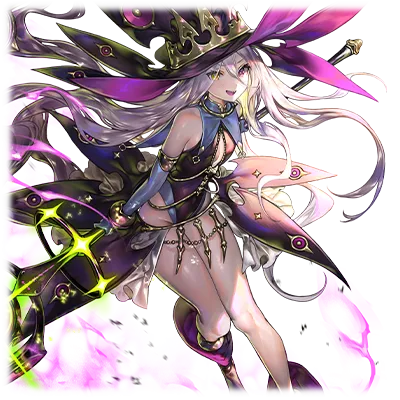

# 远古的混沌巨人

| 角色信息   |  |
| ----------- | ----------- |
| 名称    |反■者 ■■■ |
| 年龄   | U■KN■WN     |
|目的 | ■死■■苍剑■女人|
|对应乐曲|ハードコア・シンドローム
|初出版本|Chunithm Crystal Plus

注：本篇故事中会出现大块大块的方块，此为阅读效果。

注2：本故事中的后半部分与[憎恶之源的古龙](/metaverse/Revive-the-Metaverse/hainuwele.md)呈联动关系，可以前去阅读以获得最佳体验。

## Episode 1 苍之楔子

>恨啊。恨啊恨啊恨啊！！那个将我的家人全部夺走的家伙！……绝对不会饶了你！！

“雷布尔……你可不能死在这里啊……！”

■

全身宛如被烈火炙烧般剧痛。就在这样撕心裂肺的剧痛之中，少女听到了声音。■

——一个温柔的声音。

但这个声音却又像是在祈祷一般，带着强烈的意志。■

她还能继续撑下去的原因，很大程度上都要多亏这个声音。

最终，她在涅墨西斯空间之中，勉强捡回了一条命。

■

但是，身体却根本没有修复的迹象。

她身上所受的伤痕，正是足以将自己这样的存在彻底“消灭”的致命伤。

不管怎么修复伤口，伤口中的“猛毒”就以同样，甚至更快的速度侵蚀着身体。

现在的她就连维持意识的正常运行都很吃力。即便如此，她仍旧不愿选择“死亡”这一结果。

■

“我、不会死……绝对不会……”

■

靠着怒火拖着自己遍体鳞伤的身体。

将所有即将死去的细胞全部从自己的身上除去。 ■

她最终成功从鬼门关爬了回来。

■  ■ ■ ■ ■ ■ ■ ■ ■ ■ ■ ■ ■                ■

但是，在连续不断的痛苦挣扎之中，她失去了许多重要的东西。

强大又可靠的尼■尔、■雷斯……

■

——都消失不见了。

像姐姐一样充满知性的厄里■、■尔泽■■……。

——全都像流沙一般消失的无影无踪。

还有拥有同样脸庞的妹妹泰■塔■特，以及……

“那不是■■愉■了■。■■■，你就乖乖养伤到■■的时候吧——”

■ ■

以及宛如兄长一样的，最喜欢的人……■托■。

和那些被称之为“家人”的命运共同体一起生活过的，他们的记忆，大部分都随着损伤渐渐地褪色，变为一片空白。

■

■

“啊啊、啊啊啊啊……什么都想不起来……我最重要的……”

　――■■■■■■■■■■■■■■　■■■■■■

■■■■■　――■■■■■、■■■■――■■

少女就像抓住砂砾一般，拼命地回想着这些记忆。但这也只是徒劳，脑海中浮现的——

■■■■■■■■■■■■■■■■■■■■■■■■■

■■■■■■■■■■■■■■■■■■■■■■■■■

■■■■■■■■■■■■■■■■■■■■■■■■■

■■■■■■■■■■■■■■■■■■■■■■■■■

■■■■■■■■■■■■■■■■■■■■■■■■■

■■■■■■■■■■■■■■■■■■■■■■■■■

——只有手握长剑的“苍蓝色的少女”的身影。

不管怎么忘却都无法抹去的，那个绝望的，苍蓝色的身影。

那个身影就像是刻在了脑海深处，不论怎么努力，都挥之不去。

而她也像是被少女所吸引一般，沉入了世界的深处。

她的自我意识也在下沉之中，被吸收，被扭曲，经过重重碰撞和变形，沉淀，最终消失。

她身为个体的存在本身，正在缓慢地崩溃。

## Episode 2 挚爱的兄长

>重要的人被夺去性命的感觉。就像燃烧着全身一般的痛苦。必须让那个家伙也尝尝看相同的滋味才行……

曾经，我有个最喜欢的哥哥。

在混沌之器之中，只有我和哥哥两人是十分脆弱的存在。和其他人不同，我们是根本无法和框架主脑的支配者对抗的弱小存在。

所以，我们每次都只能担任看家的任务。

所以，我们二人在一起的时间比任何人都长，也比任何人都要互帮互助。

但是，这样的关系总会随着时间而变化。

经过了漫长的时间，我们终于获得了足以和那些飞虫们战斗的“力量”。

终于。终于能够靠自己的双手将那些可恨的飞虫们——

就在我这么想的时候。某件事发生了。

那是和框架主脑的决战前夕。

我在最外周领域和一个异常的代理构成体接触了。

虽然在那个时候因为“全天之支配者”的支援而遭到了阻挠，但我还是从那个构成体身上感觉到了某些其他个体所没有的，特别的“某种东西”。

对此感兴趣的斯托姆，代替负伤的我，前去迎战那个代理构成体。

就在我和平时一样向他告别的时候，不知为何，我心中的不安仍未散去，于是我走上前去向斯托姆搭话。

“你要小心啊，斯托姆。那个家伙总有种令人讨厌的感觉。”

“那不是更加愉快了吗。雷布尔，你就乖乖养伤到决战的时候吧。”

不知是不是看透了我心中的担忧，斯托姆露出稳重的笑容，温柔地摸着我的脸。

“等我将那些虫子们干掉，我们再一起将框架主脑的领地烧成一片灰烬吧。”

——然而，这就是他最后的遗言。

没想到在“混沌之器”之中也拥有着极度凶暴力量的斯托姆也会被打败。

我从未想过，之前还在有声有笑的说着话的，最重要的人，就这样消失不见了。

这种感觉，就是足以燃烧身体一般的痛苦吗。

这种感觉，就是失去最爱的东西的时候的痛苦吗。

……从内心深处涌现的憎恨和愤怒变成了话语。

“绝对！！饶不了她！！！”

斯托姆的仇，绝对要由我来报！

我在灰暗的空间之中如此发誓着。

然后，在我前往最终决战之地，佛诺·泽尼斯的时候，就在我和同伴们即将占领中枢的时候——

我唯一记得起的，只有一瞬间的闪光。

之后，在熊熊燃烧的火焰之中，我被什么东西从碎裂的铠甲中丢了出来。

等我回过神来，苍蓝色的剑已经插进了我的胸口。

## Episode 3 红色的世界，摇曳的苍光

>对不起，斯托姆。明明那个家伙就在眼前，我却什么也做不到……

眼前的视野，是正在熊熊燃烧着的，红色的世界。

在这染成通红的火海之中，苍蓝色的剑光仿佛要将热气隔开一般，闪耀着，并且向我缓缓地接近。

那道光最终变成了人型——原来是一名少女拿着这把闪烁着苍蓝色光芒的剑。

那个脸！不会认错的！就是我要报仇雪恨的女的！

——我要杀了你。

等我把铠甲重新组成之后，看我怎么逮住你。

必须赶紧动起来。

就算只有一只手，一条腿也好。

我要把那双把斯托姆杀死的双手剁个粉碎，吞噬掉，变成我的东西！！

怒火中烧的我不禁握紧了拳头。

……可是为什么！？为什么啊！！

为什么我连一丝力气都没有！！

——脚步声已经距离我越来越近了。

动啊！快动啊！

我一定要宰了这个女的！！

我要！！为斯托姆！！报仇——

脚步声停了下来。

仔细一看，映入我眼帘的，是一张正露出冷冷笑容的女人的脸。

无力抵抗的我，就这么被那个女的从铠甲的残骸中拖了出来。

接着，那把剑就贯穿了我的胸口。

轻描淡写地，毫不犹豫地——

“噫呀啊啊啊啊啊啊啊啊！！”

剧痛直击脑门。

宛如被烧红的钢针插入体内一般的痛感袭击了我的全身。

四肢不受控制地痉挛，然后，脉搏停了下来。在我感觉到自己的灵魂仿佛从身体中被抽出的瞬间，我终于意识到自己的身体已经无法动弹了。

剑的主人把我的身体像垃圾一般扔到了旁边，带着那副冷笑，继续扑向了下一个目标。

……我就这样被轻易地破坏掉。

那把苍蓝色的剑，是为了杀死我们而被制造出来的“猛毒”。斯托姆肯定也是被这东西——

必须赶紧向尼加尔和泰斯塔蒙特他们说才行。

但是，被剧毒侵蚀的身体，已经无法动弹了。

鲜红色的世界，以及闪烁于其中的苍蓝色的光芒。

这应该就是我死前看到的最后景象了吧。

不要啊。我才不要以如此绝望，如此悲惨的样子死去……

不要。不要不要不要不要不要不要不要不要不要不要——

等我回过神来，我已经身处于涅墨西斯空间之中。

在沉入空间的深处的时候，我的记忆也在不断流失。

要是就这样死去的话，我也会去到斯托姆所在的地方吗……？

就在我即将放弃一切，打算就这样长眠的时候。

“某样东西”狠狠地拉住了我。

那就是对“苍之少女”的复仇之心。

“我、我不会死的……绝对不会……”

这残存的执念激发了我最后的一点力量，重新生成了铠甲。

我就这样被包裹在铠甲之中，在伸手不见五指的黑暗空间之中继续往下沉。

直到伤势恢复为止……我就沉睡一会儿吧。

“等到伤势痊愈……我一定要把那个女的……杀掉……”

就在我如此决定的瞬间，我的意识断线了。

## Episode 4 令人嫉恨的世界

>这片天空究竟是……？为什么？为什么天会这么蓝……头好痛……

现在，我正在我们曾经所梦寐以求的世界中。

我们打倒了框架主脑的程序们，开始筛选那些强大的人类。

■姆■和泰■■蒙■站在在我的身旁。

他们两人向我露出笑容，将手伸了过来。

我也伸出手回应他们，然而，不论怎么努力，我的手都无法碰到他们。

就在我以为终于触碰到他们的瞬间，随着一声泡沫破裂的声音，他们的身形瞬间消失的无影无踪，只留下一滩血水。

只剩下我独自一人像疯了一般呆在那里狂笑着……然后梦就结束了。

明明根本无法想起那两个人的名字。

但不论多少次，不论多少次。

多少次多少次多少次。

多少次多少次多少次，每次都在我的身边出现，然后消失不见。

就像这样，这个噩梦一直在我身边纠缠，永不停止。

但是，这次却和平时不同。

就在我以为是同一个梦的时候。

“雷布尔，时候到了——”

我似乎听到了什么人的声音……

虽然想不起来是谁的声音，但是听起来非常温暖。

就像是被这个声音引导一样，我的意识也被从黑暗的空间中拉了起来——

* * * 

——终于，我苏醒了。

“唔……唔唔……这里是……”

我缓缓从铠甲中爬了出来。

出现在我眼前的，是我从未见过的世界。

荒废的大地，沉闷的空气，以及从远处清晰可见的光之柱。

以及。

一望无际的——蔚蓝的天空。

当我看到这片景色的瞬间，我的头就像要裂开一般，剧痛无比。

“……咕、啊啊啊啊啊啊啊啊啊啊！！”

眼窝深处好热。

感觉发出了悲鸣一般。

一眼望去的天空是那么的蓝，令人可憎地蓝。

每当我抬头望向天空，我的脑中就会想起那个女人的身影。

看来，这股疼痛，直到我把那个女人杀死之前，都不会停息的吧。

这次，一定要由我……。

“必须找到她……”

可是，应该往哪里走才对呢。

应该往哪里……

就在我呆住的时候，不知道从什么地方听到了一个声音。

“——先走——了，雷布尔……”

在渐渐模糊的意识之中，我本能地望向传出声音的地方——也就是塔的方向。然后，我看到了梦中出现的那两个人。

他们的身影，正缓缓地走向塔的方向。

仿佛就像是在为我引路一般——

“我们就先走了哦，雷布尔。”

再一次听到了这个声音，我自然而然地跟了上去。

“■■姆■……我……现在……就……去……”

不要丢下我一个人。

至少……让我抓住那双手……

## Episode 5 幻视

>这个世界也有那些飞虫们啊……那么，我要做的事情，就只有一件……

我从散落在周围的铠甲残骸中挑选了一部分，重构成了较为简易的铠甲，踏上了前往塔的旅途。

只要带上头盔的话，就不用看到那可恨的蓝天了。拜此所赐，头痛也缓解了一些。

这个世界，应该是由框架主脑制造出来的才对。在我前方走着的两人，他们的声音就像是心灵感应一般，直接传进了我的脑海里。

“雷布尔……在光之塔那里似乎有框架主脑所属的城市……要怎么破坏它呢？”

光之塔。

只要前往那里，肯定能找到我想要的东西。

“是啊，■■姆■。那些飞虫们以及那个女的，肯定在那里……这次肯定要抓住她，然后，就由你把她的身体大卸八块，打到千疮百孔……接着，我们就一起吃吧？”

“这想法不错！已经开始期待了……果然跟你在一起才是最棒的啊！”

听到这个温柔的声音，我的内心也开始雀跃。

“雷布尔，小心。周围有什么东西。”

我遵从指示停了下来环顾四周，然后，从周围的石头和残垣断壁的后面，走出了数个人。

“哦？一个人跑到这——么偏僻的地方，是想干啥啊？”

“身上还戴着挺稀有的东西嘛。那个，能让给我们吗？只要老老实实交出来的话，我们也不会为难你的啦……咦嘻嘻……”

出现在我面前的，是一群衣衫褴褛的男人们。

难道是觉得穿的破破烂烂的我比较好对付吗。

“哈哈，不理我们吗。难道说是我们样子太可怕了，吓得都动不了了吗？”

这群家伙。

只不过是太弱了，根本提不起兴趣而已。

就在我想下杀手直接将他们干掉的时候。

“呜……”

突然，我的眼前一花。

等到我的视野恢复之后，我看到的并不是刚刚那些男人们的样子，而是某些我再熟悉不过的东西。

“那是……利息德二型……！必、必须宰掉它们啊啊啊啊啊！”

“啊？这家伙怎么回事？难道是疯了吗！？”

“区区飞虫！都给我去死吧！！”

就在我挥手的同时。

就像是呼应着我的意志一般，从地面上冒出了形态不完整的涅墨西斯群。

“噫！？这、这些家伙是怎么回事！？”

“你们，给我上。”

“噢噢噢噢！！”

四散而逃的飞虫们，被召唤出来的涅墨西斯们咬断喉咙，身首异处，没过多久，整片大地就被鲜血染红。

想想看还是第一次看到会跪地求饶，四散逃窜的飞虫们啊。

不过，这对我们来说是毫无意义的。

“求、求求你……饶了……”

“这个家伙，就随你们喜欢处置吧。”

“吱呀啊啊啊啊啊！！”

当我看着正在啃食着飞虫们的尸体的涅墨西斯的时候，我突然发觉这场景似曾相识。

虽然想不起那是和谁的回忆，但是我还记得那个时候，对我来说是最重要的时光……

“啊啊，当时的你……最喜欢的就是进食这件事啊……”

这句话，自然而然地从我的口中说出。

就在我沉浸在回忆之中的时候，涅墨西斯它们的进食已经结束了。

这些东西很自然地接近了我。

我将手放到它们的身上，然后，它们的身形就渐渐的分解，变成黑暗的粒子，最终吸收进我的体内。

看来只要吸收这些粒子的话，我就能稍微回复一些力量。不过……。

“这还不够，还远远不够……”

这种程度的力量是绝对不够的。

必须更加拼命地吸收才行。

为了将那个家伙狠狠地折磨到死，我需要更多、更多的力量……

## Episode 6 鲜红的礼服

>啊哈……竟然这种地方也有。飞虫们竟然还有这么多基地……如果不仔细地清理掉的话，那个人肯定会生气的吧。

穿过了大片的荒野，周围的景色也开始渐渐摆脱单调，肃杀的印象。

路面越来越平整，周围也增添了更多开垦过的农地，开始渐渐地感觉到有人生活的气息。

就这样，我沿着路一直走着，来到了一个小山村。

发现了我的身影的飞虫们，开始急忙呼唤更多的同伴们。

“啊哈……这些飞虫们，可得一个一个捏成粉碎才行啊？”

这里就是框架主脑的前线基地吧。没想到居然积蓄了这么多的战力，不过很遗憾，在我面前不过是螳臂当车而已。

就让我来彻底破坏掉吧。

而且，这也是那个人说过的话。

“……必须要好好地，细心地吃掉才行。”

所以。

这一切就由我破坏掉，然后仔细地享用吧。

从此之后，我每天都会出门前去破坏那些基地。

一个，两个。

三个，四个。

已经记不起究竟破坏了多少个基地了。

不过，我也借此恢复了绝大部分的力量。

“啊哈哈……多谢款待。”

“厉害啊，雷布尔。阻挡我们前进的障碍，全部都不见了呢。”

“呵呵，因为有■■姆在，我才能如此努力地战斗啊。”

积累到这个地步的话，就能够跟那个女人战斗了。

“呐，这副新制造的铠甲，合适吗？”

“太合适了！感觉就像一件红色的礼服一样。”

“好开心！有努力制作真的是太好了！”

■■姆为我感到高兴了！

这副鲜艳的红色铠甲，真想早点让大家看到啊！

“那么，就去和大家见面吧。”

“嗯！”

前往大家所在的那座塔的所在。

将那座塔破坏掉，将那片可憎的天空染上别的颜色。

## Episode 7 不共戴天之敌

>终于找到了……必须把这里的一切都破坏掉。这个世界，就由我们来重新改造吧！

一道巨大的裂谷延伸到远方。这里就是大地的尽头。

光之塔，我们的目的地，现在正近在眼前，展示着它的威严。

感觉到了。我感觉到了。

这股熟悉不过的味道……那些天使们的气息。

“终于来到这里了。大家已经开始攻击那座塔了哦。我们也一起去把那座塔破坏掉吧！”

“嗯！把这里夷为平地！你们，都给我上！”

漫山遍野的涅墨西斯围住了被框架主脑的街道所围着的光之塔。

不过，光之塔却展开了一面巨大的光之防壁，裹住了整座塔，试图阻止我们的攻击。

“啊哈哈！这家伙，不会只能对着我们的攻击被动地防御吧？”

“就是这个样子，雷布尔。只要这样继续的话……！？这个，难道说……咕、啊啊啊啊啊！！”

“怎么了！？到底发生什么事？”

本来还充满活力的那个人的声音，却变得十分微弱。

只剩痛苦的声音在脑海中回荡。

“要……小……心……”

“■■姆！？不要啊！不要走啊！！”

明明刚刚还在我的身边的。

环视周围，不管是■■姆，还是泰■塔■■，还是厄里■，还是■尔■■特，还是■雷■，还是尼■尔！

大家都不见了！！大家都消失不见了！！

不要……不要啊不要啊不要啊！！不要只留下我一个人啊！！

求求你们了，留在我的身边吧！！

为什么……为什么要留下我一个人活在这个世界上……！？

“我应该怎么办……嗯！？”

——我感觉到了熟悉的气息。

毫无疑问，是那把曾经带给我们无限痛苦的，那把剑没错！！

虽然形状略有改变，但是确实是那把剑没错。从我身体上传来的痛苦，以及颤抖的感觉，都在告诉我，这个气息是真的。

而且……还有那张脸……那个持有者的脸……

啊啊……那张脸……那张脸！！！

自从不再仰望蓝天，就再也感觉不到的那种疼痛。

现在正在我的脑中复苏，并且狠狠地折磨着我。

明明迄今为止都感觉不到的。

明明，只要不去回想起来，就，没有，问题的。

现在，却在我的脑中重新复苏了！！

那个……女人的……那无比可憎的……气息啊啊啊啊啊！！！

“咕噢噢噢噢噢噢噢噢噢噢噢噢噢噢噢噢噢！！！！”

必须把那家伙破坏掉才行……就由我……杀了那个女的……杀了她、杀了她杀了她杀了她！

把那个女的，碎尸万段！！！

## Episode 8 苍与红的邂逅

>不要这么看我……不要用“那双眼睛”，看着我……不要这样可怜我啊！！

杀气暴增，猛增。

完全变为复仇的恶鬼的铁巨人发出了震天的怒吼。

为的是将给它造成了痛苦的，苍蓝之剑以及其主人破坏掉。

“噢噢噢噢噢噢噢噢噢噢噢噢噢！！”

雷布尔将那名苍蓝色的少女——塞拉菲娜的身姿，和曾经令自己无比痛恨的敌人的身影重合了。

完全沉沦于愤怒之中的她，已经不存在任何一丝的理性了。

完全变为了不将那记忆中带给她那鲜明无比的痛苦的“苍”消灭为止，就绝不会停下来的复仇机械。

“啊哈哈……看起来，似乎不像是什么塔的守护者……吧？”

杀气全开的敌人正向这边高速逼近。

塞拉菲娜看准了向自己逼近的雷布尔，架起了剑防御。

但是，内心深处还是难以抵抗恐惧，身体无法自如行动。

就在恐惧传遍全身，失去战斗意志的时候。

“怎么会……怎么会这样……呐，还认得出我是谁吗？”

米姆露出了和塞拉菲娜完全不同的反应，她陷入了动摇之中。

然后，她连法杖都没举起来，毫无防备地向着雷布尔所在的方向走了过去。

“雷布尔……难道听不见吗？求你了……快回答我……”

她向雷布尔轻声细语地说着。

然而，这样微弱的声音，是无法传到对方的耳中的。

“噢噢噢噢噢噢噢噢！！”

狠狠地踏着地面，雷布尔向着对方冲了过去。

已经举起的拳头，扑向了米姆所在的方向。

“米姆，危险！！”

就在差点就要被直击的瞬间，米姆被塞拉菲娜推开，保住了性命。

本该命中的一拳扑了个空，失去平衡的雷布尔就这样撞上了山崖。

然后剧烈的冲击产生了落石，将她埋在了石堆之中。

“杀了她……杀了她……杀了她……！！”

埋在石堆中的时候，雷布尔想起了很久以前的记忆。

佛诺·泽尼斯的最终决战。

突然爆裂四散的火焰。

以及在火海之中闪烁着的苍蓝闪光。

以及将自己的胸膛贯穿的那把剑，还有那充满了鄙夷的眼神。

“不要……那样……看着我啊啊啊啊啊啊啊啊啊啊——！！”

怒火冲天的雷布尔靠着蛮力从石堆中挣脱了出来，向着复仇的对手恶狠狠地瞪着。

在那里，她看到的，是两名少女正直直的盯着自己的样子。

“咕呜……哦哦哦哦哦哦！！”

雷布尔的怒吼，响彻了整个阿普斯之谷。

## Episode 9 被斩断的羁绊

>只有这个家伙！只有这个家伙无论如何都要由我打倒！你就以自己的身体，亲身体验我们的怨恨吧！

飞奔而来的巨人，爆发出和那重量完全不符的跳跃力。

顺势而出的重拳，向着塞拉菲娜所在的位置而去。借由米姆的援护提升了机动力的塞拉菲娜，躲过了重拳的直击，转入了反击的态势。

就在这时，跟随着雷布尔的那些黑暗的眷属冒了出来，试图为她打掩护。

“你们这些家伙！！别来碍事啊啊啊！！”

塞拉菲娜执剑向着周围使出了一记横扫，将围上来的眷属们一扫而空。

然后，重拳从这些眷属们的尸骸堆中现身，向着塞拉菲娜袭来——

“不好！？”

“我来掩护你！”

千钧一发之时。

本该直击目标的拳击，却被米姆架起的防护壁挡了下来。

重拳与防护壁之间激烈碰撞，爆发出白色的火花。

“米姆，谢谢你！”

“那拳头……看起来没法简单砍下来呢……难道强化到了刀剑也无法造成伤害的地步了吗？”

“有什么策略吗？”

米姆稍微犹豫了一下，接着用法杖指向了巨人的方向。

“腹部的红色光点应该就是弱点。那里是装甲作为薄弱的地方。瞄准那里攻击吧。”

“我明白了！”

“我们一起上吧！前路就由我打开！！”

米姆放出了无数的光弹组成了弹幕，为塞拉菲娜打开了一条血路。

米姆张开了障壁，将周围的眷属们隔开，用障壁组成了一条蜿蜒曲折的通道。

这条通往雷布尔的通道前方，形成了一个带着些微角度的斜坡。

“哈啊啊啊啊啊啊啊！！”

塞拉菲娜向着雷布尔的方向一口气冲了过去。

来到斜坡顶端的塞拉菲娜，向着高空纵身一跃，躲过了试图抓住她的雷布尔的手臂，来到了雷布尔的背后——然后笔直地冲向了雷布尔的怀中。

“咕呜呜……啊啊啊！”

雷布尔向后面不假思索地挥了过去。

但是，本该是其长处的巨腕却无法在这贴身的距离之中发挥其应有的实力。

而且，围绕在雷布尔身边的眷属们，也被巨腕的攻击波及，被砸了个粉碎。

一击，两击，三击。

在巨腕疯狂挥舞的死亡距离之中。

塞拉菲娜准确地回避着攻击，静待着机会来临，向着雷布尔步步逼近。

（可恶……再这样一味地闪躲下去也会到极限的……不过，只要再撑一会儿的话！）

一击，两击，三击。

冷静地回避着袭来的拳头，然后——

“就是这个距离！哈啊啊啊啊啊！！”

塞拉菲娜就像是要将失去平衡的雷布尔撑起来一样，向着雷布尔扑了过去。然后，神统奏鸣剑的剑锋命中了腹部的位置。

“……咕、哦哦、噢噢噢噢哦哦哦！！”

面对这突如其来的剧痛，雷布尔难忍疼痛，单膝跪地。

“命中了吗！既然命中了的话，那就……去吧啊啊啊啊啊啊啊啊啊啊！！神·统·奏·鸣·剑！！！”

塞拉菲娜将剑柄反握，将剑举到了身体的上段。

接着，将自身全部的重量都压上去，使出了浑身一击，就这么将雷布尔一刀两断。

## Episode 10 消失于虚空中的话语

>啊啊——天空是这么蔚蓝的吗。这样的话……我就能去到大家所在的地方了吧。

被剑贯穿，我的意识开始模糊。在模糊的意识中我见到的，是让我回想起母亲的身姿的，巨大的“龙”。

然后，等我再度恢复意识的时候，我才发觉，自己也很快将不久于人世。

看来，我是连着这头龙，一起被那把剑杀死了啊。

肉体和骨骼都发出了不成形的悲鸣，血液正止不住地流失。

很快，我就会死去了吧。

（啊啊……结果，我还是没能……赢过吗……■■姆，对不起，啊……）

我难道就要这样一事无成地死去了吗。

（不甘心。不甘心不甘心不甘心不甘心不甘心——我，又一次……被夺走了全部……）

至少，就算是一道伤痕也好。

也要让那家伙留下一道一生也无法消弭的伤痕……。

就在我想用最后一丝力气从龙的尸体中爬出来的时候，我却感觉到了什么东西的动静。然后，突然出现的白色的双手，就像是抱着我一样，将我从黑暗之中拉了出来。

从黑暗的空间之中被拉出来的我所看到的，是无比耀眼的天空，以及不知为何感到些许怀念的人类女性。

纯白色的衣服已经被血染红，而她的身体也和我一样，已经遍体鳞伤，随时都可能迎来死亡。

“你……是谁……”

“雷布尔，对不起。明明终于能够见到你，却是以这样的形式……”

眼前的女性已经泣不成声。

只是见到这样表情，我的心就涌上了一股无比安稳的感觉。

（为、什么……这个味道……感觉就像家人……一样）

就在我连反抗的时间都没有，还呆在原地犹豫的时候，那个女性温柔地抱住了我。

就在这时——本该消失不见，彻底褪色的记忆的残渣，却在此刻重新聚集了起来。

“啊……啊啊……想起……来了……‘终焉的’……泰斯塔、蒙特……”

接着，大家的名字也开始从脑海中浮现。

尼加尔、阿雷斯、厄里斯、贝尔哲布特。

以及我最喜欢的——斯托姆。

啊啊，我终于想起来了。

“泰斯塔蒙特……就由我们……将那个女的……”

“雷布尔，那场战斗已经结束了。曾经伤害我们的塞蕾，已经不在这个世上了。”

泰斯塔蒙特温柔地抚摸着我的脸庞。

“……自从那场决战之后，我一直……一直都在找着你。可是……为何现在却以这样的形式再会了呢……”

“……”

身体已经无法动弹了。

明明终于见到了自己梦中无数次念想的家人，却连伸出手抱住自己的妹妹都做不到。

“雷布尔，一起实现大家的梦想吧……助我一臂之力。和我一起……完成那个目的吧。”

“嗯……”

我用最后的一丝力气点了点头。

泰斯塔蒙特的双手抱住了我。而组成了我的身体部分渐渐地变成了无数的粒子，变成了泰斯塔蒙特的一部分。然后——

泰斯塔蒙特本来宛如白百合一般的身姿，渐渐地变成了和曾经的那副姿态十分相似的，恐怖而妖艳的，漆黑的魔女——

## Episode 11 旅程的终点

>既然前往地上的通道只有那个的话——那我也来帮忙吧。就让我们看看，她有没有那个本事前往地上！

咦……我还没有死吗？

现在，我正在一片无限的黑暗之中漂流着。

但是，这里和曾经修复身体的涅墨西斯空间不同，从不知道什么地方传来了暖意……。

“这里，是我的精神世界。”

听到了一个熟悉的声音。

然后，在我面前，一个人形的身影渐渐的浮现。

虽然和回忆中有些不同，但是随着人影渐渐清晰，我很快就认出了眼前的身影就是泰斯塔蒙特。

“好久不见了，泰斯塔蒙特。我还以为我肯定会被那把剑的猛毒侵蚀致死呢。”

“关于那把剑——也就是‘神统奏鸣剑’，虽然不知道发生了什么事，不过那把剑，现在已经没有能够‘杀死’我们的力量了。”

原来如此……所以明明被斩到了，却没有像当时那样的痛感吗。

而且，我也正是借此才得以不会迷失自我。

“看你这么说，泰斯塔蒙特难道你也被……？”

“嗯，在决战当时，我的身体也被这猛毒侵蚀，身体已经无法维持下去了。”

“所以，你就利用了那个人类的身体？”

泰斯塔蒙特点了点头，继续说到。

“从涅墨西斯空间来到现在这个世界的我，转移进了偶然发现的女人的身体。而迄今为止我已经转移过了无数的肉体，一直在这个世界里寻找着你的踪迹……”

我终于理解了。

难怪我当时无法认出泰斯塔蒙特……。

而且，按这样的话，她到底在这个世界流浪了多久的时光呢？人和涅墨西斯之间对于时间的感知可是截然不同的啊。

而我就在泰斯塔蒙特辛苦搜寻的时候，一直在梦中沉睡着吗。

竟然没有注意到这些事情……

结果，还是给她带来了辛酸的回忆啊……

可是……为什么？

我不禁浮现了一个疑问，向泰斯塔蒙特问到。

“可是，为什么已经以身为人的形式活下来了，却还要吸收我的身体呢？相比较苟延残喘的我，吸收那个女人的话难道不是更好……”

面对满头雾水的我，泰斯塔蒙特摇了摇头。

“因为，塞拉菲娜是完成我们的悲愿的存在。”

“所以……你是想说她拥有着我们所一直在追求的强大吗？”

“正是。塞拉菲娜正是超越了我们的存在。而她的身体里，也流淌着和涅墨西斯混合过的，塞蕾的血脉。”

我终于明白了泰斯塔蒙特的意思。

也就是说，既然她能成为超越我们的存在的话——就能够完成我们一直以来的悲愿——“由我们自己寻找到强大的存在，并且送往地上，让人类复苏”。

“所以，我们现在就要测试她，看看她是否真的有足够的器量能够前往地上，对吧？”

“嗯。所以，最后也请和我一起战斗吧？借我一臂之力吧？雷布尔？”

和塞拉菲娜战斗的话，毫无疑问迎接我们的只有死亡。

但是——即便如此，我们还是要去做。

因为——这才是我们涅墨西斯必须为后世所留下来的贡献啊。

“当然。我要是没有泰斯塔蒙特在的话，估计早就已经死去了。相比较那样碌碌无为地死去，还是战斗到最后一刻死去比较好吧。”

“哈哈……谢谢你，雷布尔。”

心意已决。

就让我们成为新世界的基石吧。

“要是那个女的不够强的话，我可不会饶了她……而且，这次可要给她留下一生都无法消去的伤疤！”

“看来已经兴奋起来了啊，雷布尔！”

看着露出天真无邪的笑容的泰斯塔蒙特，我也不假思索地以笑容回应。

塞拉菲娜……继承了那个女人的血脉的人啊。

就让我们看看，你有没有这个本事前往地上吧！

* * * 

“——那么，让我们开始吧？属于我的……属于我们的故事啊！！”

通过泰斯塔蒙特的双眼，我看到了正与之相对的，手持苍剑的少女。

塞拉菲娜似乎还在对眼前的状况感到迷惘，眼中已经满是泪花，露出不安的神色向我们大喊着。

“呐，米姆，难道已经没有别的方法了吗！？能够让我们一起前往真正的世界的方法！”

“啊哈哈哈哈！我现在已经不叫米姆了。身为目睹人类的未来的最后的契约——泰斯塔蒙特(TESTAMENT)·米库拉，这么叫比较好吧？那么，塞拉菲娜，让我们开始互相残杀吧？”

加油啊，泰斯塔蒙特。

我会在这里见证一切的。

见证属于我们的存在的证明……以及。

崭新的人类诞生的瞬间！

