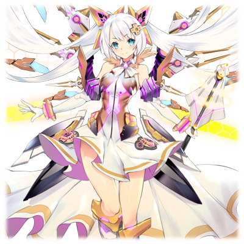
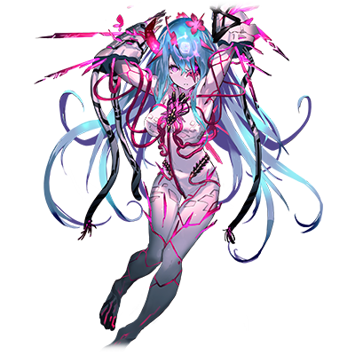
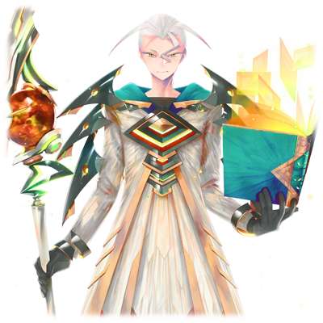
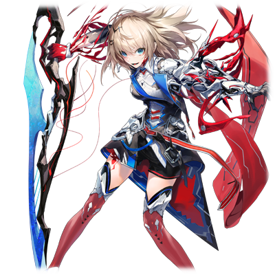

# 塞蕾·海兹

| 角色信息   |          |
| ----------- | ----------- |
|  名称 |塞蕾·海兹
|年龄 |UNKNOWN
|身份 |EXILE（流放程序）
|所属|框架主脑的代理构成体
|对应乐曲|ヴンダーカンマー
|初出|CHUNITHM Crystal Plus

## Episode  1 背负憎恨的少女

>将一切交给别人什么的，我做不到。我一定要靠我自己的双手报仇雪恨！

框架主脑的中枢领域“佛诺·泽尼斯”。

（注：原名フォノ・ゼニス可以对应单词phono和zenith。phono为拉丁语的根词，代表声音的意思。zenith则为天顶，最高点之意）

本该是只有“最古”们和上位的程序才能踏入的禁地，现在却站着一名没有任何特别力量的人类少女。

少女的名字为塞蕾·海兹。

那苍蓝的眼睛之中蕴藏着一层暗云。她渐渐地睁开眼睛，听着来自“最古”的一人，“再生者·迪安”的说明。

如果将身为素体的人类肉体装上战斗用的程序，就可以变成拥有足以对抗涅墨西斯力量的“代理构成体”。

塞蕾正是有着能成为素体的潜质，而被召集到佛诺·泽尼斯的人类之中的一员。

“将自己的身体改造成代理构成体可是需要承受超出想象的痛苦的哦。你确定准备好了吗？”

听着迪安的提问，塞蕾坚定地点了点头。

她有着需要力量的理由。

因为涅墨西斯的“大侵攻”，塞蕾失去了她的故乡，朋友，还有她的家人。曾经拥有的一切都在瞬间灰飞烟灭。

劫后余生的她燃起了无尽的怒火，誓要将那些夺走了一切的敌人斩尽杀绝。

塞蕾已经下定决心，为了复仇，无论多大的苦痛都能够忍受。

之后，在无数次的肉体改造之后，塞蕾成为了“代理改造体”。

相比其他代理构成体更加优秀的她，成为了框架主脑的重要战力。

在一边执行着框架主脑给予的任务同时，塞蕾也在时刻关注着一个人。那就是那个将自己的一切全部都夺走的人——涅墨西斯的代理构成体“GENE”。

塞蕾无数次地在脑中描绘着将那个可憎的敌人一刀两断的画面。

## Episode  2 战乱和荒废的世界
>为了让整个世界回复安定，就只有将涅墨西斯消灭了。为了保护我最重要的东西，今天，我也在前线奋战着。

身为人类的理想乡而诞生的电脑领域·Metaverse。

这个世界的历史，总是伴随着战乱。

一边是高度进化以至于强大到能自称神明的程序集群“框架主脑”。

另一边是聚集了旧人类怨念和憎恨的恶性程序群“涅墨西斯”。

持有强大力量的双方，爆发了席卷Metaverse全域的激烈战斗。甚至让这个世界本身都受到了损伤。随着双方的不停战争，Metaverse也变得愈加荒废。

漫长的战斗令两边都已经疲惫不堪。

许多领域变成了战场，最终变为了没有管理者的荒废领域。

这些领域持续扩张，加速了Metaverse世界的不安定化。

换句话说，就是世界距离崩坏越来越近。

但是，即使框架主脑明白这些，却依然认为“将涅墨西斯歼灭才是最能让世界安定的手段“，所以并没有停止战争的意思。
  

为了停止战斗的战斗，今日仍在上演。

然而能够为这一切画上休止符的存在，仍未诞生。

## Episode  3 忠诚之刃
>GENE……这就是那个把我的一切都夺走的男人的名字吗。为了能够报仇雪恨，我已经等了很久了。

我在框架主脑的中枢领域“佛诺·泽尼斯”经由“最古”之中的一人，“再生者·迪安”之手，重获新生了。

现在的我，已经不再是那个面对变故和灾难毫无反抗之力的弱小人类“赛蕾”了。

现在的我，是拥有能对抗涅墨西斯的力量的代理构成体，赛蕾·海兹。

在那场“大侵攻”之中，我失去了一切。

不管是我的家，还是我的朋友，还是我的家人……

之后我从迪安大人那里知道了一件事。原来那些涅墨西斯是以“憎恨”为缘由才向我们发起攻击的。

……开什么玩笑。

他们仅凭他们心中的一腔憎恨就将我的家人屠杀殆尽的话……那我的家人又算得上什么？我的憎恨又算得上什么？

  

现在，这些家伙还在对框架主脑虎视眈眈。

即便这场旷日持久的战斗会让整个Metaverse更不安定。

怎么能允许他们为所欲为！

我从框架主脑那里获得了力量，并向他们宣誓效忠。

为了那些惨死的家人们，为了整个世界的和平。
  
“赛蕾，有一个新的任务要交给你。”

眼前的人正是管理着整个Metaverse的框架主脑的支配者——最古之一，也是授予我复仇的力量的人。
  
“是。迪安大人。随时等待吩咐。”

“我们找到涅墨西斯的代理构成体GENE的潜伏地址了。你就前去那里尽快回收吧。如果到了不得已的场合，就要将其彻底破坏才行。”
  
听到迪安大人说的任务目标的时候，我不知不觉握紧了拳头。

——GENE。

就是他。他就是将我所住的整个领域……包括我的家人全都破坏掉的代理构成体。

他，就是我的仇敌。

  
“任务目标非常危险，所以这次会派探查BOT跟随前往。”

“……恕我直言，我一个人就足够了。”

  
——父亲，母亲，大家……

就让我为你们报仇，为这个世界带来和平吧。
  

在向着GENE所在的地方前进的时候，我无数次的在脑海中默念着。

## Episode  4 搜索和毁灭
>不管再怎么躲藏都去不掉那股腐朽的味道。就让我将全部的残骸都轰飞把你逼出来吧。

最外周部……也就是远在Metaverse边境，长期被涅墨西斯所管理，已经被框架主脑所舍弃管理的地方。

然而自从涅墨西斯领域自行进行了切割之后，其中的一部分被框架主脑收复，重新变为了管理领域。

但是在愈发激烈的战斗中，这片地方从未进行过成型的复兴和最适化，这里就像一个谁都不愿清理的垃圾堆……可以说是最适合用来隐藏身形的地方。

“GENE的信号……应该就是在这附近吧。”
  

这片宛如垃圾场一样的领域和普通的领域不同，在这之中，时间的流速会加快。

难道说是想借此躲过框架主脑的观测吗……净会耍小聪明。

我的任务，是回收目标，或者将其破坏。

将我的家乡，我的家人们杀死的那个家伙，就是我这次的目标。光是想象着将仇敌大卸八块的样子就已经令我热血沸腾。虽然任务确实说了优先回收，但我很怀疑自己见到那个目标的时候，还能否控制得住破坏的欲望。
  

等我终于平静了呼吸之后，我也来到了捕捉到信号的Metaverse最外周部的深处。

到达观测到反应的地方的我，确实感受到了GENE。他就隐藏在这片区域之中。

留在这里的，只有被破坏，被舍弃的残渣，只是一片和“终焉”二字十分相称的领域而已。

目标就隐藏在这些浩如烟海的残骸碎片之中。

既然打算这么藏着的话，那么解决方法就很简单了。全部破坏掉！

“不管到什么时候都是这么狡猾……！那我就打到你出来为止吧！！”

我指挥着BOT和我协同攻击，轰向了无数的残骸。

……不出所料。敌人就这么乖乖地被引出来了。

是想要求饶？还是想拼命辩解呢？不管说什么，都和我无关，也没有必要听。
只要把敌人打个半死带回去就够了。

“我可是等了好久啊……等着这一天的到来啊！”

  

我立马举起了武器上前攻击，他也不甘示弱，立刻和我拉开距离进行回避。

果然还是不能小看涅墨西斯的代理构成体啊。不过，虽然确实有两把刷子，但是也并未能彻底甩开我。

当我抓住了他的背后，经过一阵子的分析思考，我立刻追了过去。

……就是现在。

当我用尽全力挥出武器之后，我听到了某种东西被弹飞的声音，接着，我被击飞，视野变得一片苍白。

  
——在无法分清前后左右的白色空间之中，我只能看到一个朦胧的身影。

这是谁？我完全不认识他。

然而，虽然我的脑海中并未对这个人产生什么印象，但是我的内心深处却感觉到了一股怀念的感觉，令我产生了想要扑进对方怀里的冲动。

就像是我记忆之中，父母的那股温暖一般……。

“——！？”

  

刚刚似乎是分神了一下。可是，刚刚我看到的究竟是什么？为什么我会看到自己家人的幻影？

难道说，这是敌人展开的精神攻击吗？不。在数据库里没有这样的记录。而且对方也露出了同样困惑的表情。

算了，再怎么想也没用。只要执行任务就行了。

我这么想着，再次开始了追击，但是他一直在我的轨道上铺设着各种各样的陷阱阻碍我的前进，并未向我发动反击。

  

“你是在小看我吗？”

真令人火大。不会让你逃走了。

虽然确实说了优先回收，不过也不是不能直接把你宰了，对，这样就好。

“单元化脉冲！”

我启动了能够瞬间爆发出超越肉体和精神极限的“单元化脉冲”，向他冲了过去。

虽然他依然在拼命地逃跑，不过我们之间的差距已经越来越小了。

——就差一点，就差一点点……我就能为大家报仇了……！

“咦……？”

  

突然我的身体察觉到了一丝违和感。

“哇啊啊啊啊啊！”
  

下个瞬间，仿佛侵蚀着全身的神经内侧的剧痛向我袭来。

明明眼前就是不得不杀掉的仇人。

现在的我却只能倒在地上，承受着这前所未有的疼痛。

## Episode  5 过往的温暖
>我知道这个声音……我知道这股温暖来自何处。那是存在我的脑海的最深处，确实藏在我的心中的回忆。

钻心刺骨，宛如全身的皮肤被人强行扯开一般。

又宛如被灼热的火焰燃烧一般。

难以形容的剧痛正席卷着我的全身，感觉一切都变得那么漫长。

  

“很痛苦对吧……很难受对吧……”

痛苦。憎恨。痛苦。憎恨。痛苦。憎恨。痛苦。憎恨。

我的脑海中疼痛和憎恨两种感情在疯狂地奔走着。

  

“等等，就差一点了。”

为什么？为什么我要受这样的罪？

我不想要什么富足的衣食，我只想要和我的家人一起安心度日啊……

  

“就让我来救你。”

从刚才就在我的耳边大吵大闹！

不要跟我说话啊啊啊啊！！

我向着模糊的视野胡乱的挥舞着，然后感觉到了一股刮到肉的手感。

“赛蕾……已经够了……这一切已经足够了……”

……你究竟是谁？

好温柔的声音……感觉被人这样搭话，已经是许久未见了……。

感觉太不可思议了……刚刚席卷全身的疼痛都烟消云散了……。

不行……不能在这里睡着的……但是……

  

——我是睡着了呢，还是失去意识了呢？总觉得是做了一个梦……不，应该说只能这么解释而已吧。

我正躺在父亲的怀里，他正擦拭着我额头的汗。

父亲的眼中似乎带着泪光。他张开了嘴，似乎想说些什么的样子，但我却听不清楚。

他到底说了什么？又要向哪里去？

没有人回答这个问题。父亲化作了阵阵光点，消失在虚空之中。

  

“这里是……哪里？”

不知道究竟沉睡了多久。

当我醒来的时候，我发现自己正孤身一人，躺在刚刚还是战场的最外周部领域之中。

## Episode  6 遗留之物
>GENE……也就是我父亲的记忆正汇入我的脑海之中。原来，父亲迄今为止都在痛苦之中吗……

“这个感觉……究竟是怎么回事！？”

  

直到刚才为止，我还在受着锥心刺骨的剧痛。就算没有什么外伤，应该会对身体和精神产生一定程度的负荷才对。然而，现在的我却没有任何的疲惫或者伤痛。

  

“而且……GENE到底去了哪里……”

环视四周，却找不到任何人的身影，只剩下一个东西，那就是VOX的残骸。

看到那个东西的瞬间，就像打开开关一样，脑中的各种东西都连了起来。

我想起了全部的事情。

  

——我和GENE的记忆已经融合了。准确来说，是和叫做“金恩·载因”的男人的记忆融合了。

我知道了他和NEO之间的故事，以及最后互相融合成为了“金恩”的事情。

我知道了GENE的人生经历。

在他的记忆之中，我看到了幼年的自己。

GENE就是我的父亲。

而注意到这点的父亲，面对启动了内部隐藏的自毁装置的我，选择了将自己的记忆和构成数据全部注入到VOX之中……

  

“父亲……”

  

继承了父亲的记忆之后，我终于明白了真相。

不管是我成为代理构成体的经过，经受了地狱一般的改造手术的事情，

还是对家人的爱，还有对那些夺走了我家人的敌人的仇恨……

这一切的一切，从记忆，到感情……

  

“原来都是假的吗……全都只是骗人的东西吗！都只是为了战争便利而制造出来的虚假记忆吗！——迪安！！”

当我说到一半的时候，突然失去了力气，接着，我笑了出来。

之后又从大笑转为哭泣，等我回过神来，我已经大喊了出来。

  

我伤害了我的父亲，而他却仍想要救我……！

我杀死了我的父亲！

  
就在我一个人哭喊着的时候，本该无人造访的最外周部的一个方向突然出现了一丝光点。

“那个反应……是涅墨西斯的代理构成体吗？”

难道是被先前的战斗吸引来了吗。他们会来到这个几乎被舍弃的地方，估计就是为我而来吧。

由框架主脑制造出来的这具身体，不由分说地强制进入了战斗姿态。

“……原来是这样吗，父亲，我明白了。”

不能再继续哭下去了。我还有必须做的事情。

“框架主脑……涅墨西斯……结果都只是些随着自己的意愿摆弄着我们的命运的祸害。既然如此，那么……就让我来终结这一切吧！”

## Episode  7 憎恨的前方

>我的回忆，我的感情，这一切都是虚假的。现在，我终于知道了，我应该面对的敌人。

为什么会变成这样呢？

被人以家人的死为理由所欺骗，被改造成这样的身体，还将仍然存活着的父亲亲手杀死。

为什么？这到底是为什么？为什么会变成这样？

将我变成这样的元凶究竟是什么？

答案很明显，就是这个被战争所扭曲的该死的世界。

还有为了自己的自私理由让战争持续下去的框架主脑和涅墨西斯两方。
  

“找到了！这个信号，果然是来自框架主脑的代理构成体！”

“这次的任务是要捕获目标吗……”

……我所能做的，我必须做的事情，只有一件。

那就是将给我们带来如此悲惨命运的框架主脑和涅墨西斯，统统歼灭！

“准备攻击！大家一起上！”

“……从刚才为止就在我身边吵什么啊！”

眼前是结成队伍向我袭来的涅墨西斯所属的代理构成体们。我立刻上前，将其中一人斩成两半。

接着，又一个人，再一个人死于我的剑下。

只是一刀两断是不够的。必须刺穿敌人，狠狠地将内部结构挖出来，再把核心的动力源给破坏掉。

必须破坏到再也无法修复的地步。

  

“这个家伙……！不妙啊！这可不是普通的代理构成体啊！”

“太快了！无法识别动作！”

“战况超出预料！！快去请求支援！！”

  

这些涅墨西斯的代理构成体，没想到竟然这么脆弱。

不，应该是我变得更强了。

我的战斗程序已经进行了升级。

这股力量，应该是来自父亲的力量。

将一切都破坏殆尽，为他而复仇……这一定是父亲最后的愿望吧。

所以，就先从这堆涅墨西斯的杂鱼们开始吧！

  

“不好，再这样下去会全灭的！”

“撤退！快撤退咕哇！！？”

某样类似铁块一样的物体，直接冲破了涅墨西斯的代理构成体们组成的阵型，冲到了塞蕾的面前。出现在眼前的这个存在，是一个带着强大力量的铁巨人。

“你，是什么人？”

“我乃混沌之器中的其中一人。反逆者·雷布尔。”

“混沌之器……”

“刚刚在最外周部爆发的高能量反应，就是你干的吗……框架主脑竟然还有拥有这么强大力量的代理构成体吗，有意思。”

“虽然不好意思打断你的兴致，不过既然是涅墨西斯的‘器’，那我可不能放你走了。我要杀死你。”

“哼，竟然想要‘杀死’我吗。看来，你似乎是做了些特殊的处理呢……就让我回收回去分析一下吧。”

“——宰了你！！”
  
混沌之器。那就是总领着涅墨西斯的人们的通称。也是这场战争的起因之一。

他们正是将我的一切都夺走的，令人可憎的存在。

这些家伙是整个Metaverse的癌细胞。必须斩草除根，杀到一个不剩才行。
  
“单元化脉冲……就让你见识一下基于这个机能的力量吧。父亲……我要上了。——三重脉冲（トリニティ・ヴァーテックス）！！”
  
这股力量，是能够将秩序的世界彻底终结的力量。以一己之力接受了三股力量，将活性化的力量结合起来，就像曾经的三姐妹那样，燃烧自己的生命战斗。

既然要和涅墨西斯的“器”战斗的话，那么从最初就不做保留就是上上之策。

而且更重要的是……现在，我只想不顾一切地释放力量。

不管是知晓了自己被欺骗的事实，还是和父亲之间的事情，还是和混沌之器的遭遇。

这一切的一切已经让我的的心中一片乱麻，所以，我用尽全力地呐喊着。

  
“来吧！混沌之器！就让你亲身为自己的罪行赎罪吧！”

## Episode 8 反逆者雷布尔的袭击

>混沌之器……虽然曾经是我预想中最难缠的对手。不过，现在的我肯定没问题。绝对没有问题！

和名为雷布尔的“器”的战斗，并没有想象中的那么简单。

覆盖了厚重盔甲的巨大身躯却同时拥有超乎想象的机动力，根本找不到攻击的间隙。

即便是已经进化成为MIR系列最高峰的存在的我，即使吸收了父亲的力量，也只能和对方打个五五开。

但是，我确实感觉到了胜利的可能。眼前的对手不是完全无法打倒的存在……本应如此。

只要我的状态完好的话……

  
“怎么了？动作变得这么迟钝了哦。”

“可恶……你这大块头……”
  

从和父亲开始连续的多场战斗，加上我连续解放了自己的限制器过度地使用了自己的力量，现在我的体力已经被大幅消耗。

如果是和势均力敌的对手战斗的话，这是十分不利的条件。

  
“就这个程度？我还以为能够让我稍微找点乐子呢。”

“趁你还能说的时候多叫嚷几句吧……！看我把你打到再也说不出一句话来！”
  

即便这么说，自己身体的出力却在明显下降。

难以维持攻势，我只能被动地闪避雷布尔的猛攻。

一次，两次，三次。

每当我躲开雷布尔的刚拳，我就意识到自己已经距离他的拳头越来越近了。

终于，当我确定下一击再也躲不开，摆开架势试图防御这致命一拳的时候。

突然，战场上闪过一阵夺目的闪光，雷布尔身上的几片装甲被炸飞，本人也被击退了一段距离。
  

“……来回收我了吗，雪儿。”

闪光的来源正是框架主脑的支配者，“最古”中的其中一名，全天之支配者·雪儿。

“由于这么久都没有看到你归来，就在想是不是遇上什么事情了……结果是碰上了‘器’吗。总之还是先迎战吧！”

  

这么说着，雪儿再次放出了巨大的光团。雷布尔虽然勉强躲开了攻击，但是钢铁的巨体装甲因为和闪光擦身而过的关系，被散发出来的热量加热到通红。而下个瞬间，装甲以猛烈的气势爆裂开来，雷布尔彻底解除了装甲。

本以为雷布尔的本体是披着装甲的巨大身躯，实际上这个铠甲更像是能量外装甲一样的结构。从爆裂开来的装甲中走出来的，是一名年幼的少女。

但是，少女眼中那充满了黑暗的眼睛，却又展示着眼前的存在超越了人类认知的这一事实。

“很遗憾，不过以后还会再见面的……下次，一定会确实地杀死你。”
  
少女发出了和之前完全不同的声线说到。

之后就露出若无其事的表情，离开了战场。
  
“塞蕾！没事吧！？”
  
当确认雷布尔已经完全离开这片战区之后，雪儿向我喊到。

明明趁此机会乘胜追击的话说不定就能够干掉她的。

到底是谨慎行事呢，还是把筋疲力尽的我当做负担了呢？不管怎么说，从结果上看，我们就这么放着涅墨西斯的“器”这么灰溜溜地逃走了。
  
“就算你不来救我……我也能……一个人……干……掉……她…………”

“塞蕾？塞蕾——！”
  
我用尽了最后一丝力气，意识断线，眼前陷入了一片黑暗。

我还是太弱了。

必须要更强的力量才行……更强，更强，更强才行。

必须是足以神挡杀神，佛挡杀佛的无敌力量才行。

现在的我，还不足以做到这点。

## Episode 9 回归佛诺·泽尼斯

>站在将我的人生肆意摆弄的人的面前，我默默地在心里发誓。只有你，一定要由我亲手打倒……

我被雪儿带回了框架主脑的中枢领域，佛诺·泽尼斯。

如果是解除洗脑之前的我的话，还会将这里当成自己的第二个家，但是在现在的我看来，这里只是一处聚集了给这个世界带来战乱的恶党们的巢窟罢了。
  
“损伤太严重了。在开始作战报告之前，还是先好好休息吧。”
  
我默默地点头回应雪儿的话，然而我却没有前往代理构成体的调整室。

因为现在的我已经和父亲的构成数据融合，已经是和以前完全不同的两个人。如果就这样前去框架主脑进行调整的话肯定会露出马脚的。

为了避免这点，我决定前去借用一下那些框架主脑的“最古”们使用的大容量能量罐进行补给。

只要在这里的话，就可以避人耳目地修复身体了。

我取出能量罐的接口，连上了自己的手腕。我狠狠的握紧了拳头，等我注意到的时候，已经捏出了血。闭上眼睛，我在心里下定决心。

虽然现在在这里和框架主脑直接宣战也是可以的，但是现在的我力量还不够。

那么就先装作服从，尽可能地利用他们的信任吧。

“要将整个世界破坏”。就像是呼应着塞蕾的意志一般，装满能量的罐子失去了光芒，转而在塞蕾的眼中闪烁出充满憎恨的眼光。

  

“哦哦，塞蕾吗。你终于回来了啊。没事真是太好了。”

  
前去进行作战报告的我，受到了以迪安为首的“最古”们的迎接。

这个家伙，就是将我和父亲改造成这样身体的男人。虽然现在就在想着直接将这个男人一刀两断，但是，现在必须忍耐。

  

“……迪安大人，关于这次任务的代理构成体未能回收，真的非常抱歉。不过，我已经确认了GENE的肉体数据已经彻底从这个世界上消失了。”

“是吗，不必在意。没有让那个家伙身上带着的，提丰和西格扎尔的构成数据落入涅墨西斯之手已经是不幸中的万幸了。想要素体的话，再准备一个就行了。”

  

听着迪安的回答，我气的只能咬紧牙关。

旁边还有来自其他最古的议论声。似乎将最古的构成数据装到父亲身上这件事，是迪安自己背后私自进行的行为，并非框架主脑的本意。

初次听到关于GENE的事情的“哲学主·捷夫提”和“调律者·WISEMAN”似乎对此十分不满，愤怒地望向迪安，立刻就向迪安发出了质问。

但是，迪安却将质问打发到一旁，而是慢慢地走到我的面前。

  

“已经从雪儿那里获得报告了。看起来面对涅墨西斯的‘器’们还挺能干的嘛。”

  

迪安露出那一如既往的假笑向我说着。

这意料之外的接近让我内心的杀意不禁就要爆发出来。

为了不让别人发现自己内心中的怒火，我只能紧紧的抱着自己的肩，低下头来。

  

“难道是在发抖吗？看来战斗的伤势还没恢复的样子呢。”

“……是的。应该是这个缘故。”

  

我努力摆出一副不明所以的表情回答着。

迪安也以那虚假的笑容向我回应。

## Episode 10 天统苍噬剑（グランタクト）

>如果想要复仇的话，现在的我还没有足够的力量。不过，只要有这把剑的话。

“没想到能跟‘器’打个有来有回，真是超出了我们的期望啊。”

“是。非常感谢您的夸奖。”

“这样的话，距离涅墨西斯的末日也越来越近了吧……呵呵呵……”

  

我能够和“器”之间分庭抗礼，都是因为有父亲的力量在啊。

然而迪安却不知道其中内情，只是在那里洋洋自得地笑着，我在心中又多了一丝唾弃之意。

  

“为了奖励如此功绩，就把这把剑送给你吧。”

  

迪安这么说着，拿出了一把剑送给了我。

我举起剑空挥了几下，听到了一阵尖锐而响亮的刀鸣声。

看来是一把不可多得的好剑。

  

“迪安大人，这到底是……？”

“这把剑，正是终焉的苍剑·天统苍噬剑（グランタクト）。”

  

这把名为天统苍噬剑（グランタクト）的苍色利剑，并非普通的刀剑。

这把剑是由过去回收的提亚马特的残骸进行彻底的分析之后制造出来的产物，能够完全消去涅墨西斯的存在，为他们带来完全的“终焉”。

被这把剑贯穿的敌人会被剑吞噬掉能力，并将其夺为己用。

当然，迪安肯定是想着将这把剑用在对抗涅墨西斯之上，但我不一样。

对我来说，敌人不止是涅墨西斯，也包括框架主脑在内。

  

“非常感谢。就让我以这把苍蓝色的剑披荆斩棘，将令人可恨的涅墨西斯斩尽杀绝吧。”

“期待你的表现。愿你能大展身手，将全部的涅墨西斯都消灭。”

  

呵呵，这么容易就被骗了。

那么就按照你所说的，将一切都消灭吧。不管是涅墨西斯……还是框架主脑。

掺杂着一丝嘲笑之意，我向迪安露出了微笑。

## Episode 11 开启终焉的交响曲

>只要将那些蜗居在Metaverse的蛀虫们全部歼灭的话，世界就能够安定下来。这个任务，就由我来做吧。那么，是时候出发了。

和迪安他们分开之后，我一个人在佛诺·泽尼斯的领域之中行走着。

越前往中枢最深部，人影就越来越少，最后，偌大的空间中就回响着我自己的脚步声而已。

Metaverse最快的移动装置“摇篮”。

现在，我正站在它的面前。我握紧了手中的天统苍噬剑（グランタクト）。

  

——父亲。现在我就要出发，前去结束这场战争。

让这场战争持续下去的，不管是框架主脑的“最古”们，还是涅墨西斯的“混沌之器”们。

不管他们是不是我的伙伴，对我来说，都是必须打倒的对象。

天统苍噬剑（グランタクト）拥有捕食对象，并且吸收敌人力量的能力。

首先要做的，就是强化我自己的力量。

首先就从那些“混沌之器”开始吧。

先向佛诺·泽尼斯上交出击的申请。等到我下次回来的时候……就是框架主脑的这些家伙的末日了。

  

“是谁！！”

  

突然，我感觉到了一股气息。

从黑暗中现身的，是最古中的其中一人，全天之支配者·雪儿。

  

“……为什么会在这里？”

“这个问题我也想问你呢，塞蕾。因为总觉得你的样子有点奇怪……”

“怎么会……我就和平常一样啊……”

“能量罐有使用者的记录。为什么不经允许就使用了这个？而且明明上交了出击的申请，但是在构成数据还未经调整的情况下出击可是违规的哦？”

“就因为这个原因来找我吗……？”

“确实有这一部分的理由……还是担心你的安危啊。”

  

——担心？

你们这群人有什么资格说这种话？

明明就随着自己的方便管理着整个世界，让战斗永无止境地上演，在你们将人们居住的领域炸个粉碎的时候你们有想到这些吗？

像你们这样视人命为草芥的家伙，才是将我和我父亲的人生彻底破坏的元凶啊！

  

“啊哈……啊哈哈哈哈哈哈哈！！”

“——！？”

雪儿突然听到塞蕾发出的狂笑，不禁露出惊讶的表情。

“哈——啊……没想到我竟然被这群愚蠢至极的家伙使唤了这么久啊，想想就恶心。”

“……塞蕾？”

  

我拔出天统苍噬剑，剑尖指向了雪儿的方向。

  

“身为造成这场战争，让憎恨的螺旋无尽轮回的元凶。不管是涅墨西斯，还是框架主脑，就由我来斩尽杀绝吧！”

这正是我的宣战公告。

我不会像那些虚伪的神明那样用些低劣的手段。

只要光明正大地将眼前阻挡我的一切障碍统统打倒，打倒，统统一刀两断，斩草除根。

  

似乎是领悟到我并不是在开玩笑的样子，雪儿的眼中虽然还留着一丝惊讶，但很快就转变为了战斗形态。

面对着来自框架主脑的强大敌人所伴随着的尖锐视线，我感觉身体内的血液都要被冻结一样。

我深深地吸了一口气。

  

在这之后，就是属于我的故事，我的战斗了……。

就像是为终焉的交响乐挥动第一拍的指挥棒般。

我举起了天统苍噬剑。

