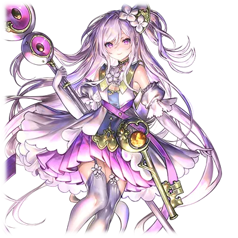
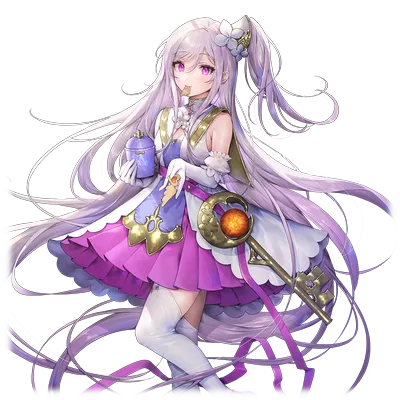

#  塞拉菲娜·维斯·阿尼玛特

| 角色信息   |  |
| ----------- | ----------- |
| 名称    |塞拉菲娜·维斯·阿尼玛特  |
| 年龄   | 17岁        |
| 职业 | 佛诺神殿的巫女 |
|身份|神话教国的贵族的女儿 阿尼玛特家排行最小的女儿 神统奏鸣剑（ゼーレタクト）的继承者
|对应乐曲|モノクロトワイライト
|初出版本|Chunithm Crystal Plus

## Episode 1 起始的故事

>这种流于形式的的继承仪式有什么意义吗？我可不想还没看到外面的世界就这样死去啊。

深绿的大地，以及看不到边际的，广阔无垠的青空。

这里是坐落于艾玛格大陆的古国——神话教国。

是由一名从神所在的圣域降临于世间的神人所建立起来的大国。

继承了无数的古代文明的遗迹，还有各种各样的传说。这个国家就由神人的后裔们管理着。

但是，由一代人传给下一代的故事，总是会带着些许误差的。这个神话教国也不例外，这些故事的样貌，有的时候，总会进行适当的篡改，最终以符合自身利益的形式重新解释。

神人本来的故事，在不知不觉之间，早已变成了忽远忽近，无法确认真伪的模样。

佛诺神殿，这座位于教国的圣都，被教国当成重要场所的地方。

这里也是由神明的时代所继承下来的一座遗迹，现在则变成了教国的民众们祈祷，许愿的地方。

而现在他们正在供奉的，正是被当做神人·塞蕾的后裔所信仰着的巫女们。

在神殿的中央，一片严肃沉闷的空气中，站在人群中央进行着洗礼仪式的，正是血统纯正的阿尼玛特家的女儿——塞拉菲娜·维斯·阿尼玛特。

“现在，开始继承的仪式。来吧，请上前。”

“……我明白了。”

她所在的一族世世代代被赋予了管理圣遗物“神统奏鸣剑（ゼーレタクト）”的使命。到了她们这一代，被赋予继承这一圣物的重任，就落到了这个和神人·塞蕾十分相似的少女，塞拉菲娜身上。

——圣剑“神统奏鸣剑”（ゼーレタクト）。

曾经闪耀着耀眼的蓝光，将与神明为敌的恶魔斩尽杀绝的破邪之剑。然而现在握在少女手上的，却只是一把久经风霜，早已被染上了肮脏的青铜色的钝剑罢了。

（这真的是那把传说中的圣剑吗？总觉得去附近的山上随便找块石头打磨出来的剑都比它好看……话说，这个无聊的仪式，到底啥时候结束啊？）

塞拉菲娜趁周围没有注意到的时候轻轻地叹了口气，重新摆正表情，伸手接住了圣遗物。

——就在这个瞬间。

青铜色的剑就像是对塞拉菲娜起了反应一般，从剑身的中心放出了一束光。之后，光芒越发耀眼。

然后，就像破壳一般，苍蓝色的剑身从其中渐渐现身。

“咦！？咦咦咦！？我做了什么事吗！？”

“……总有一天……一定……回到……的……一定会……”

“好像听到了声音……？”

“……远行吧……前往世界的各个角落吧……”

“这声音，是从神统奏鸣剑里面传来的吗……？”

——与此同时。

就像是对应着苍蓝色的圣剑觉醒一般，在大地的尽头的某个角落，也发生了某样剧变。那个“东西”，正绽放着直冲天际的光束，散布着光的粒子，向这个世界的人们彰显自己的存在。

从此刻起，围绕这把圣剑的命运的故事，就此展开。

将塞拉菲娜认定为新的主人的圣剑，将带领她踏上消失在时间长河尽头的神话之旅。

在无数的邂逅与离别之中，她到底会迎来什么样的结局呢？

从此刻起，她的冒险故事，开始了——

## Episode 2 无聊的少女和光之塔

>呐，那边那位小姐！ 对对对，就是在说你！能不能拜托你带我前往世界的尽头呢！

身为神人·塞蕾的后裔，我从小，就过着衣食无忧的人生。

我从小就被别人说长得和她很相像，结果就是，我不论干什么事情，总有无数的仆人围上来帮忙。就连洗澡，换衣服都得几个人瞻前马后的。而且那个时候也是……不行，这个话题还是别继续说下去了！

简而言之，我就是个温室中的大小姐而已。

不过，这种无聊透顶的生活，我可忍不了多久。

如果可以的话，我现在就想赶紧逃离这里……

“塞蕾大人……吗……真的跟我有那么像吗？”

每次我看着摆在房间里的肖像画的时候，就总是想起小的时候从其他人那里听闻的传说。不过那些从他们口中所听到的故事，想必也早已添油加醋，改造成了适合让人顺从，让人接受的内容吧。就连眼前的这幅肖像画想必也是如此。

……不过。

如果塞蕾大人的冒险故事是真实的话。

我也想像她那样，闯荡整个世界啊。

——某一天。

不知道是不是神明听见了我的愿望，一个可以改变这个平凡的日常的机会来了！

在继承的仪式上，我被授予了圣遗物“神统奏鸣剑”（ゼーレタクト）。

闪耀着夺目蓝光的剑，用着只有我才听得见的声音，指示着我前往世界的尽头。

这可是千载难逢的机会啊！

就在我这么想着的时候，我见到了那个人。

“初次见面。我是导师 米姆·米库拉。是前来带领圣剑的主人前往光之塔的。”

（哇……她好漂亮……）

“那个……我脸上是沾了什么东西吗？”

“没……没什么！对不起！”

我瞬间就看入迷了。因为啊！

那双眼睛就跟清澈透明的紫水晶一样，还有那白皙无暇的皮肤，颜色明亮的头发看起来就像一张完美的丝绸般！

看起来就像是花朵精灵的公主一般。

在看到她的瞬间，我就有种预感，她，会成为我命中注定的那个人啊！

带着一纸介绍信来到阿尼玛特家的她，自称自己是传承了光之塔的传说的一族的后裔。

根据她的描述，出现那座光之塔正是世界即将天崩地裂的前兆。

最初，关于她所说的这些，姐姐们和其他仆人还对此半信半疑，但是随着她所说的东西越发偏向关于塞蕾的传说之后……

“……在这座被诅咒的塔带来灾难之前，必须结合圣遗物‘神统奏鸣剑’（ゼーレタクト），以及操作这把剑的‘奏者’（コンダクター）的能力才能化解这一灾难。所以，我希望她能够跟我一起前往光之塔的所在之地。”

听完她的解释之后，姐姐们也放下了戒心，相信了她的故事。

不过，她们还是以不希望妹妹遭遇危险这一理由，暂时回绝了正面的回答。

但是对我来说，就算大家再怎么担心，心中的这阵鼓动，已经任谁都无法阻止了。

## Episode 3 危险的前兆

>自从我拿到了这把圣剑之后，某些东西就开始发生了变化。不知道何时，就连这个世界也会……

立刻就想离开教国的我，很快就和父亲和姐姐进行了谈话。但不论我怎么跟他们说，得到的都是“等待调查队的回来再说”的回答。

而且，就像是为了防止我逃出去一样，他们甚至派遣了仆人随时监视我的一举一动。

所以我能做的，也就只有整日躺在床上发呆而已。

“真是的……真不敢相信……米姆你怎么想？”

米姆躺坐在床上，只是平静地笑着。

现在在我的房间的，就只有我和米姆两人。

在我跟父亲的死缠乱打之下，才终于得以让米姆在我得到家中许可之前留在这里。

她也没什么拒绝的理由，就这样接受了我的提议。

“我可以理解他们的心情。毕竟突然冒出个不认识的人，说着要带着他们重要的家人走的话肯定没法欣然接受的吧。”

“或许是这样……不过再这样下去的话……我可能真的就要这样关在屋子里，碌碌无为地过完一生了……”

“呵呵。我明白你的心情。像这种从未要求过的安宁什么的，只会给自己徒增麻烦而已。”

“米姆……”

米姆略带忧愁的侧脸实在是太美了，以至于让我忘记了时间。但与此同时，我却在意起了米姆的过去。

“米姆，你迄今为止都去过什么地方？我想知道更多关于你的故事！”

“是呢。那么，就让我们先从光之塔开始说起吧……”

——在这之后。

白天我就从她那里学习关于这个世界的知识，晚上则是听她讲述她的冒险故事。

从她口中讲的故事，不管哪个都是充满了惊喜，总能让我深刻意识到这个世界上还有那么多不可思议的东西。不管是从未听过的植物的名字，还是沉入湖中的各种遗迹，这些每天都能听到的故事让我深陷其中。

就在我正期待着今天会有什么样的故事的时候，突然一阵敲门声打破了宁静。

“塞拉菲娜大人！从老爷那里得到了调查队归来的消息了。请您立刻前往神殿！”

——终于到了这个时候了吗！

我和米姆急忙赶往神殿。父亲他们正和被派往塔的人们在一起。然而，却有点奇怪。因为我记得出发的时候，调查队可是有足足三十人的大阵仗啊。

“怎么回事？为什么只有一个调查队员在这里？是其他人先回去休息了吗？”

“不……那是因为……从塔那里回来的人……只有我而已……”

心跳开始加速。我才发觉我竟然开始无意识地躲开视线，以不去看他的伤势。

归来的调查队员已是遍体鳞伤，从绷带之中甚至渗出了血。

沉重的空气包围着整个神殿。我说不出一句话，只能默默地看着父亲的脸色。然后，父亲露出了十分沉重的表情，只是用平淡的语气叫我们先回去。

看来事情比我想象中的还要危险。

我必须在事情变得更糟之前行动才行。因为能做到这个的，只有我而已……

当我拿起剑的时候听到的那个声音，应该也是希望我这么做的吧。

所以，即便周围的人反对，我也要和米姆两人一起启程。

我在内心深处默默发誓。

## Episode 4 丰壤之都与青绿之丘

>太厉害了！这个世界竟然这么美丽吗！谢谢你，米姆。果然，你就是我的……

“塞拉菲娜，关于前往光之塔一事，家里下达了许可吗？”

米姆一开口就问了这个问题。

就在我默默下定决心的那个晚上，教国发生了[前所未有的灾难](metaverse/Revive-the-Metaverse/hainuwele?id=episode-1-%e4%ba%a6%e7%a5%9e%e3%80%81%e4%ba%a6%e7%81%be%e5%8e%84)。

父亲他们也应该意识到她所说的那些预言是真的了吧。

“我也想去见见外面的世界……米姆，让我们一起拯救这个世界吧！”

我很清楚，这绝不是什么风平浪静的旅途，但是，在我心中的这股冲动早已经超越了对未知的恐惧。

等我回过神来，我已经抱紧了米姆。

“嗯……？塞拉菲娜？”

在这旅途的前方，不管还会遇上什么困难。

只要跟她在一起的话，想必都能迎刃而解吧！

——第二天。

我们最终决定两人出发，前往光之塔所在的地方。

当然，肯定会有人反对，但最终还是在我强硬的要求之下压了下来。

然后，终于——

“这就是我的第一步！走咯！”

抬起脚，向着门外踏出第一步。

我很清楚，只是踏出这一步并不代表什么就将立刻发生改变。

但是，在我的心底里的某个角落。

却坚信着某些东西已经发生了变化。

而在这看不到尽头的道路前方，崭新的世界正迎接着我！

“米姆，我们走吧！”

我拉着米姆的手，走出了大门。

那么，首先就从主干道的安奇街道向被誉为丰壤之都的蓝色诺瓦进发吧！

一路上，我看见的，是那些在昨天的风雨中仍然傲然挺立的花草树木。从树叶上滴下来的水珠，又让平常的花朵多了一份奇异的姿色。

对我来说，眼前看到的一切都是从未见过的景色。

“喂~！米姆！再不跟上来就要跟丢了哦——！？啊！快看那个！能不能去那座山丘上看看？山上开了好多花啊！”

“哎呀……明明前面还有很远的路……算了，也不是不能理解你的心情。”

虽然刚出发的时候我老是东逛逛西逛逛绕各种远路，不过之后就没什么波折，顺利来到了蓝色诺瓦。

据说这座城市，有着治愈的天使曾经到访这里的传说。

当我将这个故事说给米姆听的时候。

“说起来，这个城市有模仿天使的翅膀形状做出来的烤制点心，要不要去吃吃看？”

“要去要去要去！店家在哪里？赶紧带路啊！”

我们逛了整个城市一圈后，来到了能够看见塔的山丘上。听城市中的商人们说，那座塔的位置就在被称为“禁忌之地”的未开拓地之中。

如果要前往那里的话，就必须要穿过往雷斯古瓦台地的峡谷地带，前往阿普斯之谷的深处才行。

“塞拉菲娜，在这之后的旅途会越来越艰险。可要小心哦？”

“放心吧！有米姆在一起的话，就算是天涯海角也不怕！”

光之塔，就乖乖在那里等着吧！

就让我们阻止这场异变吧！

## Episode 5 在路途前方之物

>吹拂过身边的微风，以及对无尽冒险的兴奋之情，以及对人，爱着世间万物的这种情感，这些东西，难道也是假的吗？

离开城市，我们俩沿着安奇街道向着北部前进，穿过夏尔维丘陵，向着雷斯古瓦台地前进。

在前往塔的途中，我向米姆提出了几个问题。

“你们一族人除了引导‘奏者’以外，还有别的什么事吗？”

“有的。我们一族人是继承了某个传承。为了完成这个目的，才要前往那座塔所在的地方。”

“完成目的？具体来说是什么样的呢？”

米姆听到这个问题，稍微转头望向了塔的方向。

“……是呢。虽然有点早，不过今天我们就先在这附近准备野营吧。”

之后，我们就各自分工进行着露营的准备。等我们将营地搭建好后，已经是夕阳西下的时候了。

我们两人围坐在篝火堆前，随着噼里啪啦的篝火声，听着她的描述。

“——在光之塔的另一边的世界，就是所谓真实的世界。我们一族人的目的就是为了前往那里。”

“真实的世界？和这个世界不一样吗？”

“嗯嗯。虽然这话对你们来说可能有些残酷，不过，这个世界，说到底也不过是个虚假的存在而已。”

这个世界，是虚假的？

也就是说……

“曾经，人们在愚蠢的斗争之中迎来了自己的灭亡。他们为了逃避灭亡的灾祸，制造出了一个假想的世界，并在其中成为了神。但是他们也未能维持多久的繁荣，最终被自己所种下的恶果所葬送——而这一切最终形成的，就是这个蓝色的世界。”

即便米姆说的再怎么真实，我也实在是难以置信。

因为——

“那个，塞拉菲娜……你在干什么？”

“米姆的大腿，摸起来很有弹性啊。呐。如果这个世界真的是假的话，那我现在触碰到的你的身体，难道也是虚假的吗？我实在是不敢相信啊。”

我丝毫不在意投过来的视线，只是一心一意地戳着她的腿。

“……你啊，真是个有趣的人。我还是第一次见到这样的人。”

“因为……米姆对我来说也是第一次见到的人啊。毕竟是打破了我百无聊赖的人生，给了我全新希望的人啊。”

我认真地看着她的眼睛。

不知道是不是火光的缘故，我似乎看到了她的内心深处有所触动。

——就在这个时候。

啪！

篝火突然爆开了一些火星子，散落出来的火粉向我的方向飘了过来。

我条件反射一般地向某个方向扑去，却撞到了米姆……。

随着轻轻一声。身体失去平衡的我们，结果就是以我抱着米姆的形式，躺在地上。

“塞拉菲娜？你没事吧？……塞拉菲娜？”

“呐，米姆。果然不管我怎么想，我都无法理解。现在，我正躺在米姆的怀里，可是，我不但能够清晰地听到心脏的跳动声，甚至能够感觉到体温。难道你要说，我这感受到的一切都是虚假的吗？”

“……”

“回答我啊，米姆……”

米姆并未作答。

只是默默地摸着我的头发。

然后，我就在她温柔的抚摸中，意识渐渐的模糊——

在漫天的星空之下，渐渐地进入梦乡。

## Episode 6 黑暗的眷属

>塞蕾的传说，果然是真的吗……拜托了，请赐予我力量吧！

穿过丘陵地带，我们离雷斯古瓦台地就只有一步之遥。

在这期间，我们很幸运的没有碰上什么严重的自然灾害，能走到这里真的是老天保佑。

当我们穿过雷斯古瓦台地的冻土地带之后，地形就发生了明显的变化。和迄今为止看到的草原地带完全不同，出现在我们面前的，是伴随着冷风矗立在我们眼前的，年久失修的古代遗迹，以及画着各种不可思议图案的超构造体。

看到这样的景象，我只有满满的惊讶。

在这里看到的数个遗迹，都能看到和佛诺神殿很相似的神话文字。

“塞拉菲娜，我知道你对这些东西很在意，可不要连脚下的路都不看然后摔个狗啃泥哦？”

“哇啊！诶嘿嘿……还真摔了一跤啊。这、这次我会注意的！”

“不，如果你真的想看的话至少不要随意走动……”

向着米姆指的方向望去，虽然有些模糊，但用肉眼已经可以依稀见到了——我们此行目的地的那座塔。

虽然从这个地方还没法确认这座塔的高度，但是，从目前看来，这座塔的身形已经给人一种难以言喻的压力，让人觉得仿佛异于这个世界一样。感觉就像是这座塔所在的地方，才是这个世界的中心……

自从我们进入雷斯古瓦台地以来，我们就几乎见不到什么擦肩而过的旅行者了。

来到这里，我才真正感觉到，自己踏入了未有他人涉足过的未开拓地是什么感觉。

也不知道是不是这个缘故……我的脚步似乎比平时还要紧张。

然后，就像是呼应着我的不安一般，那些东西突然出现在我们的面前。

“塞拉菲娜，小心！”

“不，不会再摔倒了啦！”

“不是这个！是敌人出现了！”

……敌人？

米姆已经架起了法杖。出现在我们面前的，是一群既不像人类，又不像动物，以不成形状的样子屹立于此的怪物。

“这个……难道是……？”

我想起了曾经在神话教国所流传的，神人塞蕾的传说。

这些怪物的样子，和传说中存在的黑暗的眷属十分相像。我本来以为这只是为了粉饰而虚构出来的怪物，没想到竟然真的存在……！

“要、要打倒才行！”

我急忙拔出了神统奏鸣剑，但是脚却扭伤了，无法灵活行动。虽然米姆一人在拖着它们，但是敌人的数量是我们的几倍，已经没有脱离的可能了……。

明明我是被圣剑·神统奏鸣剑所选中的人啊！明明我必须打倒那些怪物才行！为什么我却连一步都动不了？！

就在我因为恐惧在原地踌躇不前的时候，我看到了遭到怪物攻击被击飞的米姆的身影。

“呜呜……哇啊啊啊啊啊！！”

从心底里冒出一股无名火，而这股想要打倒怪物的愿望，让神统奏鸣剑发出了光芒。在这个瞬间，我用尽全力地呐喊着。

拜托了！请赐我能够打倒那些怪物的力量！

在无意识间，我已经奔跑了起来。就像是回应了我的动作一样，圣剑也以其力量回应了我。

“看招啊啊啊啊啊！！”

圣剑贯穿了怪物的身体。

手中传来了柔软的感触……。

真的是太可怕了。

但是……即便如此……我也要拯救米姆啊！！

圣剑的光芒更加耀眼，为我的身体带来更强的力量。

本来还只能勉强跟上怪物动作的我，现在却能渐渐地掌握他们的行动了。

真是不可思议。

仿佛就像从一开始就知道该如何应对这些怪物一样，我熟练地回避着怪物的攻击。

说不定是神统奏鸣剑在暗中教着我战斗的方法呢。

随着剑锋划过，怪物们发出了短暂的怨念般的呻吟，接着就化为尘埃，消失的无影无踪。

终于，敌人只剩最后一只。

我挥动圣剑将怪物一刀两断。之后，战场上一片死寂，只剩下我混乱的喘息声。

“咦、咦……？”

就在我放松下来的时候，我顿时瘫倒在地上。

原来，神统奏鸣剑的力量，还有塞蕾的传说。

这一切的一切——

“啊哈哈……原来，都是真的吗……”

“塞拉菲娜！没事吗！？”

“嗯，我没事。等等，米姆你没受伤吗！？”

当我回过神来重新把握状况，我才急忙前去确认米姆的身上是否有受伤。

我记得我看到米姆被怪物的攻击击飞，应该是受了很重的伤才对……咦？

仔细一看，米姆的身上竟然没有一丝伤痕。

“放心吧，我还是懂一些秘术的，靠这点力量的话这种轻伤很快就能治好。”

“可是……”

“而且，你能够将圣剑的力量激发出来，对我来说没有比这更高兴的事情了。”

“如果我能更早前去帮你的话……就不会遭到这样的危险了！”

我的心中充满愧疚，不知不觉已经哭了出来。

“竟然让你这么担心……感觉就像个小孩一样呢。放心吧，我没事，所以不要再哭了。”

“呜呜……可是……”

米姆轻轻地摸着我的头。

劫后余生的我，就像是为了确认米姆的存在一般，紧紧地抱着她。

## Episode 7 巡礼者们

>这种深入骨髓的寒冷……根本不是什么寒凉冷气所能比的，是某种更可怕的东西……

我们将暗之眷属平安击退，决定稍微休养一下再继续前行。

天寒地冻的荒野，陡峭险峻的兽道，都在消耗着我们的体力。

和刚从教国出发时的艰险程度，已经不可同日而语。

“哈啊……哈啊……”

停下脚步的次数越来越多了。

再这样下去的话，肯定会拖米姆的后腿的。

“没问题吧？果然这种未开拓的土地对人来说太严峻了吧？”

“可、可是，你不也是人类吗……？”

“这个嘛……毕竟我一直在旅行，所以比其他人应该还要能多撑一会儿吧？”

“呜呜，老实说我还真的是小看了远行的辛苦……要是平时能再多锻炼一点、就好了……啊嚏！”

自从来到这片台地，我就总能感觉到一股奇妙的寒气。虽然米姆也在猜测是不是周围的寒冷导致的，但我总觉得应该和其他的东西有关。

因为，我总感觉就像是从那些怪物身上感觉到的怨念一样——

就在这个时候。

“嗯……！”

刺骨的寒意席卷了我的全身。

不……这不是什么寒冷的感觉。是某些更加尖锐的，刺激的，发自人内心的，感情的涟漪……

“……将整个世界……整个……”

在我的脑海中甚至传来了话语。

你到底是谁……？

“足以毁灭……整个世界……的憎恨……？”

“塞拉菲娜！快看那个！！”

我看向米姆所指的地方。在那里，是一队穿着白色外套的马车队伍正在被黑暗的眷属所攻击着。仔细一看，我似乎对这些人有印象。好像是曾经来到神话教国交流过的巡礼教团？

可是，为什么他们会在这里？

嗯嗯，现在不是想这些东西的时候！

“那些家伙……看起来有些奇怪……”

“怎么了米姆！我们得去先救下他们才行啊！”

“啊，是、是啊。支援就交给我吧。”

虽然我对米姆的反应有些在意，但是现在分秒必争。

必须救下那些人！我才不会输给这些怪物啊！

## Episode 8 不和谐音

>我开始感觉到了一些疑问。但是，即便如此，我还是不想毁坏我们之间的关系……

“——最后一个！！”

最后一只包围马车的怪物也被我们打倒。虽然经历了一番苦战，我们还是最终脱离了险境。

巡礼教团的人们也放下了武器，其中一名女性向我们走了过来。

“实在太感谢你们了，旅人们。我是就任这个旅团的代表一职的塞夏特。”

女性将头套取了下来，露出的是一张气质静谧的脸庞。

虽然第一眼的印象似乎比我们年龄还小。但是，从她的脸上总能感觉到一股异于这幅童颜的气质，一种冰冷而毫无生机的感觉。

明明长得那么漂亮，却总有种将周围的一切以价值衡量的冷峻目光。对我来说有点可怕。

“初次见面。我是塞拉菲娜，然后，在我旁边的……咦？米姆？怎么了吗？”

“不……没事。我叫米姆·米库拉。”

米姆从见到她的那个瞬间，就一直露出一副怀疑的表情。明明两边都是初次见面，为什么会……。

就在我正在思考着的时候，米姆就像是试探一般向对方发问。

“为什么像你们这样的人，会专门来到这种未开拓的土地呢？专门跑到死地赴死，也是巡礼教团的教义吗？”

“啊呀，说话这么刺耳可不行啊……。你们这边才是，教国的贵族两个人，专门来到这个地方。难道不是在做什么秘而不宣的事情？”

两人之间已经开始唇枪舌战。可不能再这样拖延下去。

我如此想着，强硬地打断了两人的对话。

“好啦好啦！我们是要前往那座光之塔。塞夏特你们也是要前往那里的吗？”

“嗯嗯，正是如此。”

“那么！不如我们一起……哇啊！？”

就在我的提议即将说出口的瞬间，突然大大小小的冰块和石子掉了下来。

“看来此地不宜久留。我们现在还是一起行动比较好吧？”

“看来只能这样了。”

从结果上看，我们就只能这样共同行动几天了。

“……”

米姆从见到教团的人们之后，就一直是板着脸一言不发的样子。之前那股温和的感觉仿佛就像不曾存在一般。

而她的视线，则一直投向那个巨大的货车。

那是一个类似箱子一样的巨大物体。

被一条破破烂烂的布盖着，无法确认其中到底装了什么，但是总觉得里面有些不妙的东西……。

即便向旅团的人们询问，他们也无可奉告……也难怪米姆会摆着一副臭脸吧。

几天后，我们终于穿过了危险地带。

在这几天我们顶着豪雨和暴雪，在寒风中前进。连续几天的无休止行军已经让人精疲力尽。

就在我们以为终于能休息的时候。

黑暗的眷属们再次出现在我们眼前。

这个数量至少得有……不，不止十几个！

至少也得上百只了！

怎么会这样……就算有圣剑在手，也根本挡不住这么多怪物啊！？

“叽……！叽叽叽叽！”

“这么多怪物……各位，赶紧摆好阵型准备迎击敌人！”

在塞夏特的指挥下，教团的人们开始了某种仪式。他们在怪物群的面前立起了各种很明显并非这个时代的神话文字的图案。

文字之间互相连接起来，最终组成了一张巨大的结界法阵。

“叽噫……！？”

怪物们被结界封住，无法发动攻击。旅团的人们纷纷趁此机会掏出了带着光芒的武器开始了攻击。

“必须趁这个机会打倒它们！”

在旅团的人们的合力攻击下，怪物们的数量在不断减少。而结界失效的时候，我一个箭步冲到了前方，直接冲进了敌阵中央。

在和旅团的人们的通力合作下，我终于将最后一只怪物打倒。

然而，最后那只怪物虽然在弥留之际依旧残留着那份杀意，却不知为何一直盯着米姆的方向。

然后用着只有我能听到的微弱声音说着“吾之……主人……”，然后消失了。

怪物有着自我意识一事就已经令人震惊了，但令我更惊讶的，是那只怪物最后的遗言。

“吾之主人”……难道说……？

我立刻回头望向米姆所在的地方。

然后，虽然只是短暂的一瞬间，但我确实看到了——那寂寞无比，仿佛随时都要哭出来的表情。

看着这样的她，我完全不知道该怎么和她说话。

呐，米姆？为什么你会露出这样的表情呢？

米姆，你不是那些怪物的一员，对吧？

## Episode 9 不得碰触之物

>这股一直都能感觉得到的恶寒——米姆你也能感觉到吗？呐，我们还是趁现在离开这里吧！

“我们要先确认这场战斗的损伤，你们就先前进吧。”

就在我们看准天气良好，打算就此出发前往阿普斯之谷的时候。

塞夏特突然走了过来，向我们说了这句话。

“是吗。那么，在我们分别之前我能不能提一个问题呢？你们所拥有的，并不只有圣遗物的力量，应该还隐藏着什么别的东西对吧？”

米姆伸手指向马车的方向。

“我从那些货物里感觉到强烈的瘴气。难道不是这些东西才引来了这么多的敌人吗？到底那些货物是什么！？”

面对米姆的质问，她只是露出轻蔑的笑容。

不知道是不是被这种反应刺激到，米姆的态度变得更加强硬。

“如果这些东西会成为我们路上的障碍的话，我就在这里破坏掉……”

“呵呵，哦呵呵呵呵呵！”

塞夏特放声大笑，打断了米姆的质问。

然后就像逗小孩安静一般，举起食指放在嘴边“嘘”了一下。

“这可不行哦？那个东西可不是寻常人类能处理的东西啊。不要装作一副很懂的样子自作主张行吗？”

这番言论，完全是在挑衅米姆。

就连我也感觉到了些许不爽。

“……够了！米姆，我们走！”

在米姆爆发前，我赶紧带着她离开了这里。

我们头也不回地向着前方继续进发。

“那些并非人所能言传的圣遗物。只希望，这些东西不会为你们带来苦难……”

米姆虽然还想继续说些什么，但她并未多言，只是转头走向了山谷的深处。

——说不定。

我们会这么急急忙忙地离开，只是想要从那堆货物之中所感觉到的恶寒之中逃离而已。

那堆货物，就是有着如此可怕的感觉。

总感觉如果用手触碰的话，就会连我们的灵魂都一并吞噬一样。

## Episode 10 完成约定的地方

>现在已经不是犹豫不决的时候了。我要以笑容目送她的离开，绝对！

穿过大陆边界的雷斯古瓦台地的前方。

再穿过宛如地裂一般狭长而险峻的阿普斯之谷。

穿过这两处地方之后，我们就来到了光之塔的脚下。

距离光之塔越来越近，天空也渐渐地被足以照亮星空的强光所填满。

“距离目的地，已经很近了吧……”

“嗯。明天一早，我们就直接前往光之塔所在的地方吧。”

我们开始了最后一晚的野营。两人肩靠肩围着篝火坐在一起。

看着眼前即便在暗夜之中也散发着耀眼光芒的那座塔，难道真的会连向真实的世界吗？

想着这个问题的时候，我的内心就变得越来越苦闷、沉重。

等到明天的话，我们的旅途，就要终结了吧……

米姆。带给了我无数多的“第一次”的人。

让我能以真正的自己的样子活下去的，重要的朋友。

等到她到达那座塔的时候，她应该就会通过那座塔，前往“真实的世界”吧？

光是这么想就很可怕了。

所以我一直在路上努力不去想这件事。

不过，时间是不会等人的。

“呐……米姆为什么要对那个真实的世界如此执拗呢？说不定这样的世界其实并不存在呢。如果真的是这样的话，等到这场灾难平息，就和我一起游历整个世界吧？”

“谢谢你。听到你这么说，我很高兴。但是，我的想法是不会变的。”

……真是遥远啊。

虽然我们之间距离如此之近，但心之间却相隔的如此遥远。

即便能够明白对方的想法，但还是很寂寞。

在一片沉默之中，米姆稍微将身子靠在我的肩膀上，开始说了起来。

“曾经……我有着众多的家人。大家都拥有一个共同的梦想，那就是改变这个充满各种不可理喻的事情的世界。”

“米姆的家人们是怎样的人呢？”

“又聪明，又强大。我们之间就这样互相支持着。当时的我坚信，我们牢不可破的羁绊，甚至能和神明的力量不相上下。但是，大家都在某一天，突然不辞而别，从这个世界上消失了。”

“怎么会……”

“所以，即便我已经成为我们一族最后的遗孤，我也要完成属于我们的悲愿，打开前往那个真实世界的大门。”

她的眼中充满了无尽的决意。

看着这样的她，我实在是说不出挽留的话语。

我能够和她说的，只有这点话了。

“米姆。虽然说的有点早，不过，能够跟你见面，我真的很高兴。虽然也有因为恐惧而害怕的差点要逃离的时候，不过，能够带来如此快乐的经历，真的是从出生以来第一次啊！……所以，就让我亲眼目送你的远行吧！”

“塞拉菲娜，谢谢你。我也很开心。我也不会忘记和你一起的经历的。”

那是我第一次看见她露出如此漂亮的笑容。然后，泪水模糊了我的视线。

“呜呜……果然，我最喜欢米姆了啊——！”

“等、等等，你突然在说什么啊……”

……等到天亮时分，这场旅途就将迎来终结。

今晚，我紧紧地握着米姆的手，进入了梦乡。

## Episode 11 反抗神明之人

>我绝对要将米姆带到那个地方！战斗啊！塞拉菲娜！战啊！！！

当我们来到光之塔的脚下，我们看到的，是曾经神明时代的遗迹。

矗立于从遗迹群中漂浮着的塔身无比宏伟，令我站在原地目不转睛。

“还是先找找看入口在哪里吧……——危险！”

突然，我被米姆拉着趴到了地上，身体在地上重重的摩擦着。

眼前的一切天旋地转，然后视野变成一片黑暗，震天的爆炸声刺激着鼓膜。

等我再次抬头，我才发现，刚才我们站着的地方那里，正插着一块仿佛刚刚从炭炉中取出的，通红的巨大铁块。

“塞拉菲娜！有什么东西正在接近这里！”

我看向遗迹深处，从高塔的暗处之中，那个“东西”缓缓地从阴影中现身。

随着那个“东西”一步步的接近这里，地面就会激起一阵阵的波动。

随着黑暗眷属的大军所出现的，是远远高于我的高度几倍的钢铁之山——一尊漆黑色的铁巨人。

从那个东西身上散发出来的，是似乎永无止境的漆黑杀气。

光是看着那东西那充满憎恨的血红色的眼睛，都会让人吓得落荒而逃吧。

“那……那个不会是什么……高塔的守护者……对吧……？”

我一边发抖着，一边向米姆问到。

但是，看到铁巨人的米姆却呆若木鸡，站在原地一动不动。

“怎么会……为、为什么……难道是……我……的原因？”

米姆看到铁巨人的瞬间，陷入了动摇之中。

然后，就像是要确认什么一样，摇摇晃晃地向着铁巨人的方向前进。注意到这边视线的铁巨人，也举起了双手，向着空中大吼着。

“噢噢噢噢噢噢噢噢！！”

感觉就像开战的口号一般，铁巨人爆发出从它那庞大身体难以想象的高速向这里冲了过来。

如果被如此高速的拳击命中的话，我们肯定会立刻化为齑粉的吧。

就在拳头即将命中的瞬间。

“米姆，危险！！”

我抱着米姆扑向了一旁，勉强闪开了铁巨人的突击。

铁巨人难以控制这舍身的攻击，就这么撞上了山崖。撞击让山崖直接开裂，碎落一地的巨石埋住了它。

“都是我……的错。对不起啊……对不起……”

“米姆，振作一点！”

米姆在我的怀中，仿佛就像在恳求某人原谅一般，哭泣着。

而在视线的前方，铁巨人正扫开身上的巨石，准备重新站起来。老实说，我不认为现在的自己能够打赢这样的怪物。

就算是现在，我的身体还是在止不住地发抖。

——但是。

我还有不得不完成的事情。我必须将米姆送到那座塔所在的地方。所以，现在没有时间在这里发抖了。

我向着米姆大喊着，同时也是为了鼓励自己。

“米姆，振作一点！我们只要齐心协力的话，肯定不会输给这种大块头的！所以，求你了，站起来吧！！”

不知道是不是我的话语传到了她的耳中呢，米姆也慢慢站了起来。

“……不好意思，看来是稍微乱了些阵脚呢。塞拉菲娜，我们上！”

“嗯！我们上！”

站在铁巨人面前。米姆走到了我的前方，直直地盯着铁巨人说到。

“这……就是属于我的故事。这……就是我的……一个古老的约定……。”

米姆就像是下定了决心一样，点了点头，继续说到。

“塞拉菲娜，请助我一臂之力吧！将她……反逆者·雷布尔打倒吧！”

米姆的语气变得前所未有的强烈，而这请求也点燃了我的斗志。

“……嗯！只要我们两人一起的话！！”

我的身旁还有米姆在。就算一个人力量不够，两个人的话就能够做到！

随着我们的声音，神统奏鸣剑的光芒也比以前更加耀眼！

“神统奏鸣剑！塞蕾大人！请借给我们力量吧！！”

我举起圣剑，向铁巨人冲了过去。

我们是不会输给这种怪物的！

我们的故事，怎么可能就在这里结束啊！！