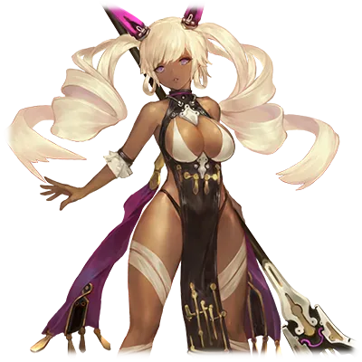

# 塞夏特·夏福特利希

| 角色信息   |  |
| ----------- | ----------- |
| 名称    |塞夏特·夏福特利希 |
| 年龄   | 哎呀，真是失礼的人啊……     |
| 职业 | 巡礼教团的巫女 |
|对应乐曲|U ARE
|初出版本|Chunithm Crystal Plus

## Episode 1 秩序的使徒，巡礼教团

>整个世界会如此堕落的缘故，就是因为没有神明来管理这些愚蠢的人类啊。

很久很久以前。那是个遥远到会让人失去时间概念的时期。

曾经，这个世界是由近乎无限的世界所组成，众多的人们在这些世界中生活着，讴歌着繁荣的生活。

世界由12名被称作“最古”的神明所管理，人们在由神明所创造出来的箱庭之中，幸福地生活着。

但是，就算是这样充满光明的世界也被黑暗所侵蚀。世界被混沌所包围，神明们一个又一个地消失了。

最终，无数光明的世界聚为一体，形成了我们现在生活着的这个世界——

这就是我们所知道的，这个世界诞生的历史。

这些历史从文献和遗迹，以及各种口口相传的诗歌中一代一代地传承下去，最终成为我们熟知的历史。

但是，毕竟那是过于遥远的事情，其中的细节也无法考据，甚至有可能加上后人自作主张的解释。

——所以，我认为我们所知道的历史，其实是错误的。

艾玛格大陆。在这片大陆上残留着无数的遗迹。

我们一直生活在这里，世代守护着由神明赐予我们的众多的圣遗物。

然后，某天，我们从地底发掘出了被称为“森罗万象记录”的记录媒体簇，并且对其予以编辑。

经过漫长的岁月，磨损，风化，锈蚀，记录已经变得残缺不全。我们就在这些残枝末叶之中寻找着能够利用的情报。

从中我们得出的事实，就是残留在艾玛格大陆上的遗迹，都是由被称作“框架主脑”的，那些管理人类的神明所制造出来的。

也就是说，这些遗迹，正是证明曾经的世界并非子虚乌有的证据。

不知何时，这些继承了管理者的血脉的使徒们开始以共通的理念聚集了起来，最终建立起了组织。

为的是以这些过去的遗物的力量，让曾经管理人类的神明再度降临这个世界。

这就是被称作“框架主脑”的子孙，也就是我们“巡礼教团”的理念。

## Episode 2 名为巫女的偶像

>我的身体里流淌着的，是无比纯正的，“框架主脑”的血脉。所以会被那些人崇拜，奉为巫女也是没办法的事吧。

这里是曾经由天使所净化过的传承之都，封存着

## Episode 3 宛如剧毒的麻痹感

>这个东西和迄今为止发掘出来的圣遗物完全不一样。对，感觉就像是神明的怒火的体现一般……

## Episode 4 卵之胎动的启示

>经过了不知道多少代人的传承，教团终于等到了这个时刻。神明的再诞。这就是我等的悲愿。

## Episode 5 焦躁与失态

>看来是我太操之过急了啊。没想到我居然会让神明的存在陷入危险。

## Episode 6 少女手中挥舞的苍之剑

>这个少女就是那把剑的正当继承者，神话教国的巫女吗……那么现在就让我利用一下她们的力量吧。

## Episode 7 剑和卵，以及其来源

>果然，那个蛋应该就是神明再诞的关键吧。不过，导师·米姆吗……根本看不懂在思考什么……

## Episode 8 两人的偶像

>虽然我们都被周围的人奉为巫女所崇拜，但我和你们可不一样。只有我，才是被神选中的，真正的巫女。

## Episode 9 导师的疑惑

>这些愚蠢的人类果然只能看懂事情的表象。不过，想必你们也会有向神明感恩戴德的那一天吧。

## Episode 10 在光之塔等待之物

>这些……都是人类发生的战斗吗？感觉就像是神……不对，神明应该就在我们手上的啊……

## Episode 11 死亡之中的救赎

>现在正是变革的时候！！就让我们的神明，将整个世界，全部的人类，都重新再生吧！！
