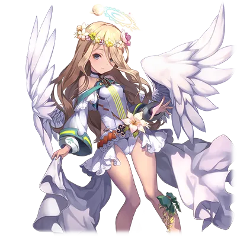

# 索尔娜

| 角色信息   |          |
| ----------- | ----------- |
|名称|索尔娜
|年龄|14岁
|职业|治愈之民
|对应曲|Solstånd
|初出版本|Chunithm Amazon

## Episode 1 青之乐园·蓝色诺瓦

>我的名字叫索尔娜。现在正和家人一起居住在被誉为水与绿茵的乐园的“蓝色诺瓦”这里，每天都为了净化这片大地而工作着。

我的名字叫索尔娜，而这里，则是水与绿茵的乐园——蓝色诺瓦。

我们就住在这个乐园之中，过着每天种植草木，净化大地的生活。

曾经这里还是寸草不生的土地，不过现在已经变成了生机盎然的原野。

我们一家人就住在这片地方，一起进行着净化大地的工作。

不过就算这么说，我的工作还是比较简单的。祖先们虽然说曾经去过很遥远的地方，我却从没有走出过蓝色诺瓦一步。

## Episode 2 12个神明的传说

>曾经在这个世界上，还有着众多的世界存在。在这些世界的中心，有着12个神明。

这是奶奶曾经跟我讲过的神话故事，也是关乎我的使命的故事。

很久很久以前，这个世界的中心有着数座高耸入云的高塔，无数的世界就像云朵一般围在高塔的旁边，在空中漂浮着。

在世界的中心有着十二名神明。他们守望着这个世界，也正是因为他们的努力，人们才能迎来繁荣的时代。

“哇！竟然有着12个神明存在，那当时的世界肯定十分热闹吧！”

“是呢。说不定比现在还要热闹许多哦。”

“……不过呢，有那么多神明存在的话，肯定也免不了争吵的吧？我们家隔壁的三兄弟可是每天都能见到他们吵架呢。”

“哈哈哈，你还真会说啊。”

奶奶继续说了下去。

## Episode 3 机械装置的天使和恶魔

>有一天，神明之间出现了争吵。而从世界的尽头的黑暗之中出现了恶魔，让整个世界陷入了混沌之中。

奶奶继续说着这个故事。

由神明们制造出来的世界虽然十分美丽，但不知何时开始，神明们出现了争执，最终变成了战争。

然后，足以将照耀整个世界的光芒的黑暗也降临了这个世界。

不知从何时起，世界被分成两个部分，最终，发展成了光明与黑暗之间互相碰撞，将整个世界都卷入其中的大战。

空中飞行着的机械装置的天使和恶魔之间的战火，燃遍了整个世界。

“哇……听起来好可怕呀……”

“毕竟是神明之间的争斗，在这个世界上，是没有人能够阻止他们的。”

“确实呢……不过，隔壁家的三兄弟也是这样呢。一旦开始吵架就谁都阻止不了。不管是做好的玩具，还是家里的桌椅都会被翻个底朝天。”

“哈哈哈，确实是这样呢，这么一看，神明们就跟那些大孩子一样呢。”

之后，奶奶继续说了下去。

## Episode 4 光暗合一

>光明与黑暗双方为这布满灰烬的大地发出了悲叹。光与暗最终合为一体，之后，诞生的就是全新的世界。而这就是蓝色诺瓦的来历。

最终，整个世界都被灰烬所覆盖，许多的生命都在战火中消逝。

而且，被灰烬所覆盖的，空无一物的世界，蔓延到了世界的尽头。

光明与黑暗为这生灵涂炭的大地所震撼，不仅为自己的行为感到悔恨。

最终，光明与黑暗结为一体，诞生了全新的世界。

我们所生活的这个世界，就是传说中的这个新世界。

“最后光明与黑暗合为一体了呢……。那么，他们之间最后和好了吗？”

“谁知道呢？没有人能知道那么细节的东西吧？”

“肯定是这样的吧！隔壁家的三兄弟虽然总是吵架，最后却总是能和好！要是光明与黑暗之间一直战斗到最后从未停息，那也太悲伤了吧！”

“……索尔娜，你真是个好孩子啊。”

奶奶看着我，露出了笑容。

就像这样，奶奶总是告诉我各种我所不知道的事情。

总有一天，我也想成为像奶奶那样的万事通。

## Episode 5 我们的使命

>自从神明们消失之后，大地满目疮痍。修复这样的大地就是我们一族的使命。

蓝色诺瓦的山丘上视野开阔，可以从这里看到很远的地方。

从山上望去，可以看到一座高耸入云，感觉只会在神话故事中出现的高塔矗立在遥远的地方。

我虽然不知道这个蓝色诺瓦之外的世界，不过听说我的奶奶也曾经出发远行，前往宛如那座塔一样遥远的地方。

我们一族的使命就是净化这片大地。这一使命延续了无数代人，一边旅行，一边净化荒芜的大地。

第一次和奶奶一起眺望远在天边的高塔，听她讲着这些过去的神话传说的时候，不知为何，我居然感觉到非常恐怖。

因为在蓝色诺瓦之外的世界，还矗立着这么高大的东西。光是想到这些，脑子里就一片空白，思绪瞬间就想到了那黑暗深邃的世界的边缘。

之后我才明白，那是我对自己如此渺小这一事实的恐惧之心。

但与此同时，我却又产生了想要前去更加广大的外界增长见识的想法。

## Episode 6 觉醒的圣遗物

>某天，我从长老那里获得了一个指示——圣遗物下达了神的指示，要我前往别的土地去治愈那里的环境。

在这之后又过了一阵子，我被负责治理这里的长老叫了过来。

“蓝色诺瓦已经恢复的足够好了。为了前去治愈下一片大地，你就前去旅行吧。”

长老这么说着，拿出了一个很古老的箱子。长老说，他们将这个箱子当做圣遗物所崇拜，而等到这个箱子觉醒的时候，就会下达神的指示。

根据指示，我要前往那座我曾经在山丘上见过的，高耸入云的塔所在的地方，然后将箱子放到那里。

“真是令人不安啊……为何要让索尔娜一人前去旅行呢？”

“外面充满了危险，为什么要将这样重要的任务交给这孩子呢？”

听到要让我出门旅行的指示，父母的脸上充满了不安。

不过，最初和他们一样充满不安的我，却随着启程之日一天天的接近，好奇心愈发膨胀。

## Episode 7 高耸入云的古塔
>我正在前往高塔的路上。虽然途中遇到的人们都在畏惧着那座塔，但是我必须完成我的使命才行。

然后，我终于迎来了启程的那天。当我走出蓝色诺瓦的时候，出现在我眼前的，是一望无尽的荒凉大地。

果然神话中，灰烬笼罩了整个世界的传说都是真的吗。

在旅途之中，我发现了一座由灰烬所堆积而成的大山。

然而走近一看，组成山体的东西却并非想象中的那么简单。那是一些比想象中更加坚硬，长满尖刺，甚至带着十分恐怖的气息的物质。这难道是某个太古的遗迹吗？

遗迹的顶部高耸入云，仅凭我的力量是无法登顶的。但是，不知为何我却总感觉上面的某个地方似乎能够隐约看到一张脸的样子。

果然，外面的世界充满了不可思议的东西。

终于，穿过了铺满灰烬的大地，我来到了一座小小的城市。住在那里的人们，自称是曾经住在那座山的对面的那座塔底下的人们的后裔。

我将自己收到的神托向他们阐释了一通，表达了不得不前往那座塔的所在之处的意思。

然而，听见此番目的的居民们，却瞪大了眼睛，极力想要阻止我。

从他们的口中，我听到了他们对那座塔的恐惧。

我非常明白他们的心情。

因为如果有人问我，要我一个人前往那从未见过的高塔，要说我不恐惧，那想必是骗人的。

所以，即便这是长老的命令，也不足以让我鼓起勇气踏上这趟前途未卜的旅程。

那到底是什么东西最终让我踏上了旅程呢？我认为，那就是我自己的好奇心。不是来自于他人的意志或命令，是发自内心深处的好奇。

现在，这股好奇心仍未停息，指引着我前往远方。

城中的人们也明白了我的决心，于是便不再阻拦我，而是开始帮助我，为我指出了前往那座高塔的道路。

## Episode 8 毁灭的街道，艾崔兰克

>来到高塔脚下的街道附近，圣遗物发出了光芒，显示出了发光的文字，似乎在说眼前这片街道的名称是艾崔兰克。

曾经在蓝色诺瓦远远眺望就能看到的山岭，现在就在我的眼前。映入我眼帘的，是一大片丘陵。

穿过被灰烬所覆盖的大地，我看到的是从未见过的景观。

眼前是一座用成千上万块宛如镜子一般的板材贴合，构造，组建起来的巨塔。在这座塔的周围，同样拥有数座宛如这座塔般高耸入云的建筑物存在。

看起来，这里是一片城区的样子。但是巨塔看起来已经荒废许久，里面的物件看起来都上了年纪，到处都是倒塌的遗迹。

而这里的街区，则是空无一人。即便我向其他人询问，他们也只能以“因为这是从很久以前就立下的规矩”作答。而他们世世代代则未曾踏入这片地方一步。

就在我下定决心走入这片街区的时候，我手中拿着的箱子开始闪闪发光。箱子的表面出现了一行不可思议的文字。

“这里……是……艾崔……兰……克？为什么我会看得懂这些文字？”

我将显示出来的文字描下来之后拿给向导看的时候，他们瞪大了眼睛，表示这是神的文字。是刻在这个他们从未踏足的地方的，神的文字。向导向着能够读懂文字的我献上了最虔诚的祈祷，祈愿着我的旅途平安，然后就转头回去了。

——艾崔兰克。

看来这就是这个布满了高塔的城市的名字。

## Episode 9 沉睡街道中央的高塔

>不知何时，我已经来到了塔的顶端。当我将圣遗物放在台座上后，光芒包围了四周。

这个街道似乎是围着高塔为圆心建立起来的。

曾经能够在蓝色诺瓦远远看到的，直冲天际的高塔，现在就在我的面前。

随着我越发接近城市的中心，手中的箱子就越来越亮，仿佛是在指引着我前往塔的最深处。

在我前往塔的途中，我穿过了一片片荒无人迹的街道。然而即便我再怎么寻找，也找不到一个人的总计。只有曾经人们在这里生活过，创造过的文化的痕迹还留在这里。

这个街道，想必也曾经有着众多在其中生活着的生命吧。

当我随着光芒走近了塔中的时候，我突然发掘脚下的地面开始移动。等我回过神来，我已经来到了塔的高处。

箱子仍旧在指引着我，让我前往房间的中央的台座。

当我将箱子放到台座中央的时候，箱子发出了美丽的音色，周围开始被光芒所包围。

## Episode 10 天上的声音

>在光芒之中传来了神明美妙的声音。神赞赏了我们一族人的行为，并且让我们继续前去下一片土地治愈大地。

在光芒之中，我听见了声音。那是个温暖的声音，似乎在迎接着我的道来。

温暖，而又清澈的声音向我如此说道。

“曾经，为了治愈这个被破坏的世界，我们被赋予了特别的治愈之力。”

……声音，仍在继续。

“你们已经治愈了好几片大地，终于来到了这里。”

“虽然会花费很久的时间，但我希望你们也能为这里带来治愈。”

……声音是这么说的。

难道就像奶奶说过的一样，我们也曾经来到过类似这座塔一样的地方吗？

那么，眼前的这个声音，肯定是来自于很久以前的神明他们那里的吧？

从他们的口中听到了我们的使命，我才初次意识到自己一族的使命之崇高，感到了无比的自豪。

当光芒消散之后，我已经来到了街道的外面。

光芒中心的巨塔放出了耀眼的光芒，和周围的街道一起化为了发光的粒子，消失不见。

## Episode 11 再生的世界

>就这样，高塔消失了，大地也重获新生。我将神明的话语记在心中，继续踏上了治愈大地的旅途。

“喂！你没事吧！”

目睹了眼前的城市和高塔化为光消散的，并不只有我。

那些一起来到附近的大小街道的人们，他们似乎也看到了这一奇妙景象的样子，纷纷来到了我的面前。

“让你们担心了。我没有什么奇怪的问题。而且，你们看看这些。”

我回头望去，街道消失之后，被灰烬覆盖的大地开始恢复生机，绿草开始在大地上生长，生命正在回归这片大地。

“这……竟然有此等神迹！”

“请让我在这里，将神明的旨意传达吧。”

我将塔中发生的一切，一五一十地传达给了那些人们。

我将神明的旨意放在心中，请求这些人们把这片地方变为宛如蓝色诺瓦一般丰饶的地方。

“是吗……原来，你就是天使吗……”

这些人们试图把我当成同样崇拜的对象，但我谢绝了。

这个世界还有众多被灰烬所覆盖着，失去生机的地方。

为了治愈这些地方，我会继续踏上旅途。

和那些人们告别之后，我再次踏上旅途，离开了曾经被称为艾崔兰克的这个地方。

在我心中这持续跳动着的好奇心，肯定会支持着我继续走下去的吧。