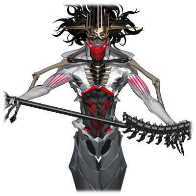

# 埋葬者•斯托姆

| 角色信息   |          |
| ----------- | ----------- |
|名称|斯托姆
|年龄|UNKNOWN
|职业|涅墨西斯程序的王“混沌七器”中的一员
|对应曲|Fidget Dancer
|初出版本|Chunithm Crystal

## Episode 1 SPEC:斯托姆

>像蚂蚁一般弱小的我，只能一直捕食下去才行。捕食，捕食……只有一直捕食下去才行……！

永久乐土Metaverse。身为孕育人类摇篮的这个电子空间，正是能够描绘出众多可能性的世界。

这个世界自从“神祖•艾克雷尔”逝去过后，管理权就交到了身为神的代行者的12体程序身上。

但是，与之对抗而诞生的怪物“RG-XXX 提亚马特”却成功侵入了乐园，对整个世界造成了威胁。

虽然整个乐园已是风雨飘摇之势，但是这头邪恶之龙最终还是在“统制主•提丰”的面前败下阵来。

乐园中的存在本以为打倒怪物就能迎来和平，但是从提亚马特的尸身之中残留的毒素却渗入了这个世界的深处，并以全新的形式重生。

而这些被称作“涅墨西斯”的存在，都有着一种特性。

那就是“捕食”这一能力——。

将打倒的敌人吞噬从而将其吸收为自己的力量。既可以借此获得更强大的形态，也可以用于治愈自己的伤势。

只要有这个力量的话，不论是再弱小的个体，假以时日也会变成无人能敌的存在吧。

而在这些个体之中，“埋葬者•斯托姆”可以说是最为体现这一弱肉强食的力量的存在。

曾经是支配着涅墨西斯的“混沌之器”中最弱小存在的他，日复一日地捕食着那些死亡的同胞，以及那些身为敌人的框架主脑的程序们。

不知何时，他也进化成了令周遭恐惧的强大个体。

现在的他仍在捕食着，为的是证明自己的存在。

## Episode 2 一切从人类的斗争开始

>这一切都是提亚马特所带来的福音。被称作涅墨西斯的这一剧毒，在将整个世界毁灭之前，都不会停息。

达到进化的极限的人类们，为了追求地上的复兴和自己的未来，在机械装置的神明加护之下，逃往了电子的世界。

然而能够前往Metaverse的大多都是当时的那些上层人物，而那些参加了都市联合军的大多数人类也不过是被支配的下层民众罢了。

等待那些残留在地上的都市联合军的人们的，就只有被肃清的命运。

被留在地上的都市联合军们，为了破坏掉潜藏在新建的超构造体演算机内的程序，制造出了致死型病毒——提亚马特。

提亚马特确实给Metaverse造成了很大的损伤，但却未能将整个世界破坏掉。

都市联合军的怨念本来就该在这里消失的。然而，提亚马特的残骸中孕育出来的，被称作涅墨西斯的“剧毒”，却渗透了整个世界的根基。

从诞生就充满了暴力性的这剂猛毒，为了毁灭整个世界开始了他们的行动。

而反应了这一暴力性的“混沌之器”们，他们会以吞噬其他存在为生，也是因为这宛如猛毒般的特性所致。他们停止吞噬的时候，要么就是他们大限将至的时候，抑或是，世界彻底毁灭的时候。

## Episode 3 暴食之力

>啊啊……我想活下去。我想活下去啊……。所以，你的命……就由我享用了。

为了将支配Metaverse的强大管理程序“最古”们打倒，混沌之器们雌伏了很久。

等到支配框架主脑的王，提丰消灭，世界的均衡崩溃之时，他们发起了被称为“大侵攻”的战争，第一次出现在大众视野中。

战事十分激烈。

环顾四周，都是些被破坏到看不出原型的残骸。就是这样荒凉凄惨的世界。

在这战场上，不论是框架主脑，还是涅墨西斯都毫无关系，留在这片战场上的，只有平等的“死亡”而已。

斯托姆别说是在“混沌之器”，甚至在涅墨西斯中也是极其弱小的存在。

连防卫程序都打不过的他无法参加战斗，只能独自在这片充满“死亡”的世界中游荡。

“呵呵……估计某天我也会像这些残骸一样埋在土里的吧……要是我有能够战斗的力量的话……”

斯托姆露出郁郁寡欢的表情。然而就在这时，身旁传出了微小的声音。

“……嘎、嘎嘎、吞、噬……”

沿着传出声音的方向看去，斯托姆看到的是一只奄奄一息的涅墨西斯个体。

斯托姆为了确认它的情况，缓缓地向他靠近。

“竟然还活着吗……咦、哇啊！？”

“去死吧！被我碾碎、吧……”

似乎这个个体将自己当成了框架主脑的程序的样子。

奄奄一息的涅墨西斯，突然张开了血盆大口，试图咬噬眼前的斯托姆。

“都、都已经命悬一线了还这么生龙活虎……相比之下，我还真是没用啊……”

斯托姆突然想到了一件事。

自己现在还活着，还能做该做的某件事情。

等他回过神来，他已经将手伸向了仍然张着血盆大口试图想要吞噬眼前一切的涅墨西斯个体。

“去、去死吧！”

“……！”

即便自己的手正被利齿咬着，斯托姆也没有后退的意思。他只是闭上眼，缓缓地感受着自己手上传来的疼痛。

“啊啊，是这样的啊……我还活着，现在，我还活着啊……”

他抱起了仍在吞噬着自己身体的涅墨西斯个体——

“你的命，就归我了。”

首先是从手掌开始，沿着手指，手心，向着腕部的方向前进。

将嚼成碎片的指头细细地咀嚼着。

充满敬意地，充满爱意地缓慢咀嚼。

即便已经嚼剩骨头也无所谓。

为了将口中的生命夺走，变为自身的力量。

斯托姆不停地咀嚼着。

即便口中流出了液体，沿着嘴角流过喉咙，滴到地上，最终将地面染成一片血红。

在一阵心无旁骛的咀嚼过后。

曾经身为涅墨西斯的这个物体，现在已经完全从这世上消失了。

“那么，你的全部就归我所有了……谢谢款待……”

将一切吃干抹净的斯托姆慢慢地站了起来。

“呵、呵呵……现在，就前来吃掉你们了哦……”

斯托姆露出了笑容，已经没有了之前的落魄。

在战斗之中，发挥了“捕食”这一能力的他，凭借着这个手段，实力突飞猛进。

本来空有高度的智慧却没有力量的斯托姆，很快就成长为了足以威胁到最古的存在。

不分敌我都会被他无情吞噬的斯托姆，在大侵攻的最终阶段，甚至获得了足以和塞拉菲塔和雪儿对抗的力量，并且最终借此救回了濒死的泰斯塔蒙特。

现在的“埋葬者•斯托姆”，已经是一头会将眼前所有的东西都吞噬的凶兽了。

## Episode 4 支配者的资格

>终于有机会能够吞噬那些家伙了。光是想想都要笑出声来啊！

由涅墨西斯所进行的“大侵攻”计划，最终定为了将最古们各个击破的作战。

这场作战成功地将框架主脑拥有最强战斗力的“裁定者•塞拉菲塔”逼到了绝境。

然而，就在差一点就能够击破她的时候，却遭受到了来自“工厂”的那些飞虫们的强烈反抗，最终导致阿雷斯大破，作战功亏一篑。

斯托姆在为阿雷斯被最古们逼到如此田地而感到愤恨之余，内心中却有着这样的想法。

啊啊，裁定者竟然还活着，真是太好了。

没能在这次大侵攻中吞噬掉她实在是太遗憾了。从此，脑海中就一直在想着这件事。

那闪闪发光的翅膀，美丽的腿脚，还有那秀发，那手指，还有那清澈的眼瞳。将那些东西都吞噬掉的话一定很美味吧。

光是想到那些东西，嘴角就不禁笑了出来。

这次就轮到自己主动出击吧。

然而，就在他这么想的时候。

“我等将会自行切断领域间的联系。”

“黄泉的盟主•尼加尔”如此宣言到。

为了让涅墨西斯能够凌驾于框架主脑之上，势必要进行更进一步的进化。

听到这个消息的斯托姆气的牙痒，只能咬紧牙关接受这一现实。

因为他明白现在并不是可以单独行动的时候。

就这样，涅墨西斯们将Metaverse的最外周部和其他领域分割开，和框架主脑分离开来。

只要在独立的领域之中的话，就算是框架主脑也无法出手干涉。涅墨西斯就在这个被隔离开来的世界中进化着。

又经历了漫长的岁月，涅墨西斯再度回归了Metaverse。

为的是将居住于这里的神明打倒，从而成为全新的管理者。

“啊啊……我已经等待了这个时刻有多久了啊……真是期待啊……期待将那些家伙吞噬干净的日子……一定很美味的吧？”

斯托姆不禁吞咽了一口口水。

##  Episode 5 各方谋略的电子乐园

>果然，对付这些虫子们还是得趁他们活着的时候生吞活剥啊。就让我从头到脚，细细的品尝品尝吧。

完成进化的涅墨西斯有一个目的。

那就是打倒框架主脑，成为全新的管理者，由自己对人类进行筛选，让那些强大的人类重返地上再生。

而框架主脑也有一个目的。

那就是消灭涅墨西斯，让拥有众多可能性的人类重返地上再生。

两者虽然所指的，都是人类再生这一相同的目的。

但是，双方的思考却宛如平行线般，绝无相交的可能。而曾经的支配者和被支配者之间的战斗，仍在继续。

既然不可能互相理解的话，那么双方必定会再次冲突的吧

而就在双方剑拔弩张的这个期间，斯托姆却在想着自己的事情。

那就是吞噬那些强者们。

不知从何时起，他即便再怎么吞噬那些杂兵，也无法填满心中的空虚。

“终于……终于到了这个时候了啊……再也不用忍耐自己欲望的这个时刻……呵呵、啊哈哈哈哈哈哈哈哈！”

被饥渴感所困的日子终于也将结束了。

“哈哈哈哈哈！那么，就去把那些虫子们吃个干净吧！我可是等不及了啊！！”

## Episode 6 从涅墨西斯中诞生的存在

>这就是由人类为基础制造出来的代理构成体吗。如果是这些家伙的话，说不定能够满足我的需求呢。
利用观察涅墨西斯进化的过程所获得的技术，人们制造出了全新的存在。这种将人类重构从而生产出来的存在——代理构成体，拥有超越框架主脑的防御程序的战斗力。

将这些原本身为人类的代理构成体当成进攻的先锋，涅墨西斯发现他们对“最古”十分有效，结果就是将他们逼进了绝境。

最古们为了打破这样的劣势，他们也使用自己独特的技术——也就是MIR系列的技术，同样制造出了众多的代理构成体。

在这场在这之后被称作“代理战争”的战斗中，虽然只爆发了一些小规模的战斗，但是除了让Metaverse变得更不稳定以外，并没有什么决定性的影响。

在这期间，斯托姆为了满足自身的欲望，开始独自行动。

他只吞噬那些强大的个体，以最高的效率强化自己……

手握捕食之力的斯托姆变得更加强大，而整体的战况也越来越向着涅墨西斯的方向倾斜。

“各位。我等经历如此漫长时间的等待也终于要达到尽头了。Metaverse已经进入了安定状态。我等为这一刻而养精蓄锐的成果，就让他们看看吧！”

就这样，在尼加尔的号令之下，涅墨西斯开始了面向框架主脑的侵攻。

## Episode 7 不确定因素

>能够与“器”分庭抗礼的这股力量……就归我了！没有我“埋葬者•斯托姆”不能吞噬的东西啊！

就在剑指框架主脑的大侵攻即将展开的前夕。

某个消息突然席卷了涅墨西斯阵营。

“我方遭遇了一名正体不明的代理构成体，并且同时还和一名‘最古’交战，导致我方遭受损失。”

反逆者·雷布尔遭遇的是一名无法确认身份的代理构成体。

而这位少女强大到不仅能击退自己手下的代理构成体，甚至能对自己造成威胁。

“没想到在作战的前夕还会出现这样的事情。”

“就让吾来想想怎么处理掉她吧。这样留着势必会对计划产生威胁。”

必须将一切不确定因素都排除掉。

就在尼加尔和厄里斯两人正在思考对策的时候，斯托姆挂着笑容走了过来。

“那个异常因素，就交给我解决吧。尼加尔你们就专心准备作战去吧。”

“如果是交给你的话，也好。可不能掉以轻心啊。”

“交给我吧。这世上可是没有‘埋葬者·斯托姆’吃不掉的东西啊。”

雷布尔走到了斯托姆身旁。

“你要小心啊，斯托姆。那个家伙总有种令人讨厌的感觉。”

“那不是更加愉快了吗。雷布尔，你就乖乖养伤到决战的时候吧。等我将那些虫子们干掉，我们再一起将框架主脑的领地烧成一片灰烬吧。”

“嗯！”

斯托姆温柔地摸着露出不安表情的雷布尔的头。

——“反逆者·雷布尔”是包裹着铁块般厚重外甲的涅墨西斯，和泰斯塔蒙特之间就像姐妹一样。

不过和特化了攻击的泰斯塔蒙特不同，雷布尔特化的是防御能力。

虽然现在包裹着外甲在前线奋勇战斗，但是本来的她也是像斯托姆那样，和其他的“混沌之器”相比过于脆弱的存在。

从她身上感觉到同伴意识的斯托姆，不知从何时起，就开始和她一起行动了，甚至产生了保护欲。

虽然斯托姆接下了讨伐这个敌人的任务只是顺水推舟，不过在心底里，斯托姆也在想着一件事——那就是说不定能够见到足以对自己造成威胁的强者这件事。

难掩兴奋的斯托姆召集了自己的部下，一起前往了报告所说的那片领域。那片领域，原本是聚集了准备攻打“艾崔兰克”的精锐部队的地方。

明明那里已经驻守了人数众多的精锐部队，为何还会这样？

“库呵呵……到底会是什么样的东西等待着我呢？”

虽然脑中还有众多疑问，但是已经兴奋道不能自已的斯托姆，向着战场的前方大喊着。

“赶紧给我滚出来吧！那个什么不确定因素的家伙啊！？”

## Episode 8 青色眼瞳的破坏者

>原来只是只不会说话的野兽吗？也罢。反正你的身体也会被吞噬，变成我的一部分的啦。

斯托姆正在前往雷布尔遭遇了那个代理构成体的地方。

在四处散落的涅墨西斯的残骸之中，站着一个人。仔细一看的话，那个人的右手上拿着一把闪烁着耀眼蓝光的剑。

感觉好像没有从雷布尔那里听到关于剑的事情啊……不过其他的特征确实符合情报中描述的样子。应该就是这次的目标了。

“那么就先去试探试探吧。你们，给我上！”

斯托姆一声令下，涅墨西斯的代理构成体们纷纷包围住了眼前的“不确定因素”。

“……？”

“没想到区区一个少女也敢跟我们作对啊。就让我看看你有几斤几两吧！？”

以这句话为信号，代理构成体们冲向了少女。

他们举起手中或近或远的武器从四面八方发动攻击。如果少女只是泛泛之辈的话，想必是无法逃脱此等猛攻的吧。

就在涅墨西斯们的攻击向少女的方向而去的这个瞬间，某个现象发生了。

那只是一瞬间发生的事。

少女连摆出架势的样子都没见到，就向周围挥出了斩击。剑势无比凶狠，超越了所有在场的构成体的速度，宛如庖丁解牛一般，将周围的敌人全部一刀两断。

“嘿……难怪会被全灭啊。我说你啊，看来是经受了相当多的改造啊？”

在短暂的时间内斯托姆就理解了一切。

眼前这个少女的力量已经足以与“器”势均力敌了。

“哈哈，呀哈哈哈！！不错，不错啊！！你这家伙！！就让我把你的力量吃个一干二净吧！！”

斯托姆一边说着，一边举起了手。

斯托姆在自己和少女之间围起了一片隔离领域。为的是防止任何一方眼看形势不利逃离这里。

注意到周围空间发生变化的少女，慢慢地转头面向斯托姆。

和少女四目相对的斯托姆，摆出了夸张的姿势报上了自己的名号。

“初次见面！我的名字叫斯托姆。身为混沌之器，同时也是将一切都吞噬殆尽的，黄泉的引路人。”

“……”

“是改造过头连话都不会说了吗？也罢，反正不管怎样我都要好好品尝一下你的味道啊！”

就像回应着这句话一样，对面的少女举起了剑冲向了斯托姆，以行动代替了回答。

“哈哈，这才对啊！感觉兴奋起来了啊！！”

斯托姆举起自己的大镰刀向少女袭来。

“不知道你的身体，味道又是怎样的呢！？”

斯托姆和苍蓝眼睛的少女同时冲向了彼此——

## Episode 9 微小的爪痕

>哈哈！这才有意思嘛！再来！让我更加兴奋吧！！！

埋葬者与苍剑的少女四目相对，以风驰电掣之势向对方发动最猛烈的攻击。

斯托姆的大镰刀占据长度的优势，眼看就要占得先机。

然而他的镰刀只是挥了个空，打穿了地面。

少女对斯托姆的浑身一击早有预判，缩起身子躲过了攻击。

“哈哈哈！这腿不错啊！”

斯托姆拉开了半步距离，重新摆好架势。被数次挑衅的少女不为所动，只是用冷冷的眼神望着斯托姆。

“眼睛也挺漂亮的……我可是越来越中意了啊！”

就像回应着斯托姆的气势一般，镰刀攻击的速度越来越快。甚至在高速的横扫中穿插着垂直的斩击。

攻势之激烈，任何触碰到刀刃的东西都会被一刀两断。

然而，少女还是面不改色。

只是冷静地回避着一记记致命的攻击。

“咕呜呜！看你还能能躲到什么时候！？继续啊！继续取悦我啊！！！”

身为强者的斯托姆，迄今为止从未遇见过能够与自己打得如此难分难解的存在。意识到这点的斯托姆，心境渐渐地转变为愉悦。不过，即便看起来再怎么漫长的交锋，终究是要落下帷幕的。

面对越来越快的攻击，少女也开始显出疲态。

“……哈。”

难掩兴奋的斯托姆已经毫无顾忌，尽显暴力本色。一边说着话，一边期待着那个瞬间的到来。

“不会这就到极限了吧！？别以为那么容易从我的舞台上逃走啊！！”

镰刀挥出的致命一击。

直接将少女的左手斩落。

“……！！”

少女的脸上露出因为疼痛而扭曲的表情。

确认自己攻击命中的斯托姆捡起了被砍下来的手腕，不顾还在痉挛着的手指，只是以十分怜爱的表情舔着它。

“啊啊……太美味了……太美味了。就是这个啊！就是这个啊！！快让我，快让我让我让我继续吃上一口啊啊啊啊！！！”

失去一手，无法维持平衡的少女仍旧没有放弃，摆出了架势。

但是已经没有先前的气势，胡乱挥舞的剑根本无法对斯托姆造成任何致命伤害。

“下一次就是你的右腿了！”

斯托姆挥动大镰刀挥出了一记逆袈裟斩，而他确实地感觉到命中敌人身体的触感。

成为自己发泄暴力对象的少女，正正摔到地上，打了几个滚。

然而，即便是躺在地上，少女眼中的敌意也并未熄灭。

“哈哈……我还玩的挺开心呢……那么，接下来要先从哪里开始下刀呢……不，干脆就这样先从头开始吃吧？”

少女已经承受如此重伤，想必也无法对斯托姆造成致命伤害了。更不用说，斯托姆还有着身为涅墨西斯的再生能力。

就当斯托姆还沉浸在捕食者享用猎物的欢愉之中的时候，他突然感觉到身上的某个部位有种热热的感觉。

他看向那个地方，原来是手臂被削去一块，流出了鲜血。应该是之前那发猛攻的途中被她命中了吧。

“什么啊，原来只是被命中了一刀吗……”

然而，就在下个瞬间，这种热的感触就像是被点燃一般，开始在斯托姆的身体内侧燃烧着。疼痛就像是有自我意识一般，很快就传遍了全身。

“这、这是、这是怎么回事啊啊啊啊！！？不，刚刚，是这东西在吃……噶啊啊啊啊啊啊！！！”

苍蓝色的剑闪烁着和少女的眼瞳一样刺眼的光芒。

斯托姆感觉到了一股迄今为止从未感受到的未知的疼痛。

首先必须平息这股疼痛才行。但是，不管斯托姆怎么努力，身体都没有再生的迹象。

不如说，伤口就像是在反应着再生的行动一般，加速侵蚀着整个身体。

“这、这到底是怎么回事……？那把剑，难道是为了杀死涅墨西斯而制造出来的兵器……吗？”

——大事不妙。

这种无法名状的恐怖感让斯托姆自发开始了行动。在他脑海里想起了之前雷布尔所说的话。

“我有不祥的预感——”

必须在这里将这把剑破坏掉。

斯托姆无意识地挥下了大镰刀，为的是将那把苍蓝色的剑破坏掉。

## Episode 10 强欲的掠夺者

>这，这到底是什么力量！快让我吃！快！快！快给我快给我快给我吃啊啊啊啊啊啊！！

少女之前在斯托姆身上留下的浅浅一道伤痕。

其疼痛却瞬间蔓延到了全身，让斯托姆仿佛被地狱的烈火灼烧一般。

只剩下破坏剑这一个想法的斯托姆却忽视了少女身上发生的变化。

就在镰刀即将碰到剑的瞬间。

少女的身上突然出现了几条红黑色的飘带，弹开了镰刀。然后，飘带裹住了少女的身体，并且带着她向上空飞去。

这个女人很危险……！

眼前正发生着接连不断的，令人难以理解的光景。

再这样下去的话，情况只会继续恶化。必须尽早阻止她！

斯托姆再次开始了进攻，挥舞着大镰刀试图将少女和那把剑破坏掉。

但无论斯托姆怎么攻击，都只是被飘带挡住，无法造成伤害。

“————啊啊啊啊啊啊啊啊啊啊！！”

随着一阵响彻天际的喊声，将少女裹住的丝带覆盖住了伤口，本该被斩断的手脚也渐渐地再生回来。

从丝带的缝隙中看到了少女锐利的目光。那目光的凄厉，甚至连斯托姆都心惊胆战。

“难道说……这家伙把我的力量吸收了吗？就靠那把剑！？别开玩笑了！怎么可能，怎么可能会有这种事情啊……！！”

不管再怎么否定，事实就是事实。眼前发生的一切就是最好的证明。

“嘻、嘻嘻、这算什么啊……这也太狡猾了吧……让我吃一口吧……呐……”

斯托姆释放了自身参与的全部力量，向少女冲了过去。

“让我，快让我快让我吃一口啊啊啊啊啊啊！！！”

## Episode 11 持续追求的强者

>太厉害了……这种力量，才是我们在追求着的强大的人类的姿态啊……

苍蓝色的剑将斯托姆的力量吸收，少女也借此完全恢复。eve/cartouche

从占据完全优势的捕食者立场调转为猎物的斯托姆，只能拼命地抵抗着攻击。

少女再次降落到地上。斯托姆使出浑身解数向少女发动了攻击，但少女却都毫发无伤地一一化解了下来。

刀光剑影，针锋相对。随着刀剑的一声声碰撞，斯托姆开始察觉到自己身上的伤开始越来越多，而少女的力量变得越来越强。

“即便是这个状况，也在从我的身上吸收力量吗？这不就是……”

对的，斯托姆记得这个感觉。那就是斯托姆还很弱小的时候，只能在以命相搏的战斗中不停吞噬着别的存在才能变得强大的那个时候——

而现在，同样的感觉又回来了。

少女正在以惊人的速度成长着。为了将斯托姆这个存在吞噬掉，超越掉。

“好、好啊！！你这个家伙！！看我怎么吃掉你！！绝对要吃掉你！！”

即便斯托姆大喊着，陷入了激昂之中，少女却依旧保持着冷静。当两人短兵相接的时候，斯托姆猛然接近了少女，张开了血盆大口。

“就让我……就让我将你吞噬吧！”

“这话该轮到我说！看我怎么生吞活剥了你！！”

少女的语气虽然和刚刚差不多，但却有些许违和感。

就像是从普通的杀戮兵器，渐渐地变为人类一般。

“咦？怎么从刚刚开始就一刀都没命中啊？”

“别小看我！！宵暗·回环！！（イブ・カルトゥーシュ）”

“我的身体已经吸收了你的血脉……就让你见识一下吧，曾经将‘王’打倒的那股力量！三重·脉冲！！（トリニティ・ヴァーテックス）”

漆黑和苍蓝的两道光芒互相碰撞。

产生的冲击波和散射的能量化为道道激流四散而去——

“咕……”

胜负已分。斯托姆的胸口被苍蓝色的剑所贯穿，矗立于战场的中心。他已经失去反抗的力量了。喷涌而出的血迹，已经将地面染成一片色彩斑斓的画卷。

——很快他就会彻底死亡。

“啊……啊啊……这难道就是‘死亡’吗……”

“对。你已经输了。”

“……太，太厉害了……这股力量……还有对力量无限饥渴的欲望。那才是，我们所追求的……理想的、人类……”

大口大口的鲜血从他的口中吐出，力量正在急速流失。斯托姆已经连说句话都极为困难了。即便如此，斯托姆还是努力地从口中挤出最后一句话。

“如果……想要回归和再生于地上……的话，必须……培养……强大的人类……才行……”

斯托姆的身体开始崩坏，然后就像沙堡一般，崩塌，散去。

与此同时，斯托姆设下的结界也悄无声息地消失了。

“呵呵，多谢款待。你的力量，真的十分美味。……父亲，很快就要结束了……只要拥有这足以将一切终结的光辉的话……”

少女的嘴角咧开，露出扭曲的笑容。

她只是望向天空，一人嗤笑着。

——与此同时，涅墨西斯方也感知到了斯托姆的存在已经从这个世界消失这个事实。

这个事实很快就传遍了整个领域，正在备战的涅墨西斯们也陷入了慌乱之中。

“嗯……斯托姆竟然就这么去了吗……”

面对着这不确定因素所引来的横祸，阿雷斯也难掩惊慌之色。但是，进攻计划已经在进行之中了。现在已经没有时间去管这些多余的事情。

就在这个时候，感觉到指挥即将陷入混乱的尼加尔，立刻采取了行动。

“各位都听好了！‘埋葬者’斯托姆已经消失。我等也明白大家会如此恐慌的理由……但是，现在我们必须舍弃这种感情才行。不要忘了，驱动我等的感情是什么！？是愤怒！只有愤怒，才是驱动我等的原动力！将一切都吞噬干净吧！连带他的那一份！！”

在尼加尔的演说下，涅墨西斯们的恐慌也渐渐平息。

尼加尔顺水推舟说了下去。

“不要忘记这份苦痛！就算只为了斯托姆，不管是艾崔兰克，还是佛诺·泽尼斯，我们都要把他们的领地攻占下来！让他们见识见识我们的怒火！！”

在尼加尔的号召之下，涅墨西斯方开始了针对艾崔兰克的进攻行动。

然而就在这大军之中，只有一个人陷入了无尽的憎恨。

“……不可饶恕。绝对，不可饶恕……绝对不能饶恕那个将斯托姆杀死的家伙！！”

眼中尽是仇恨的雷布尔，站在大军之中，向着天空发誓，一定要报仇雪恨。

而这绝不会消失的怨恨，又将成为新的“毒”，渗入这个世界之中。