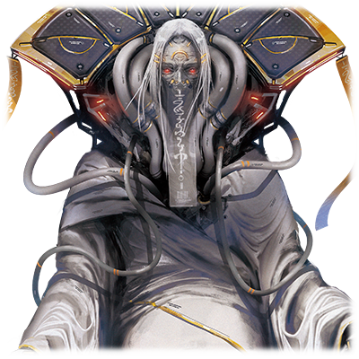

 

# 创始者 该隐
| 角色信息   |  |
| ----------- | ----------- |
名称| 创始者 该隐·霍华德·丹塔利乌斯
年龄| 135岁
职业| 复合企业集合体中心的KHD社创始人
身份| 绝代的研究者
对应曲| 祈 -我ら神祖と共に歩む者なり-
初出|Chunithm Paradise Lost

## Episode 1 一瞑不视
> 这就是……我所期望的地球的样子……啊啊……这是何等的美丽……！

从人类降生到这个世界以来，科学技术就在不断发展。

没有一个人想到，这看似毫无尽头的繁荣发展竟然会迎来结束的一天。

技术进步的终点。繁荣的顶点。

没有人知道代表它们的东西。

而自从登上了顶峰之后，不管再怎么发展，都不过是“下坡路”罢了。

成熟的科学技术带来了繁华绚烂的都市。还有战争。

 

繁荣的代价背后带来的祸害，终于蔓延到了整个地球，并且将海洋和大地彻底污染。

人类不得不面临终将到来的世界末日。

 

然后，经过了短暂的时间。

代替已经消失的人类在地上昂首阔步行走着的，是模仿人类做出来的合成人类——“真人”。

他们的存在意义是——履行“恢复被彻底破坏的大地”这一职责。

为了人类再次回归到地上的那一天，他们必须将曾经充满生机的地球再度夺回来。而为了这个任务而被生产出来的他们，正为了地球再生这一巨大目的，拼命地工作着。

 

在一个遥远的地方，有一个人正用着终端观望着这一切的发生。

不，那个存在已经不能称之为人了。身体的绝大部分都被替换为了机械，只有容器中的灵魂仍然存在着。

那是曾经被称为马哈农的都市中心的一座高耸入云的黑色高塔。

在那个高塔的一角，那个人正不为人知地，迎接着自己生命的最后一刻。

## Episode 2 选别之人，被选之人
>如果要拯救众多的人类，就要伴随着牺牲……这是世界的真理。你们不会不明白吧？

人类以地上环境急剧恶化的代价，踏上了繁荣发展的顶点。

而面对即将袭来的灾难，这些“支配者”们所进行的行为，不过是治标不治本的缓兵之计罢了。

和不断衰败彻底死亡的大地相反的是，地球上的人口正在爆发式的增长。

这个世界的“支配者”，为了让人类能够逃避污染带来的危害，发表了“地下都市建造计划”。这个为了即将到来的灾难而准备的计划正快速地进行着。

然后，人们开始了对地下都市居民的选别行动。然而，最终被选择移入地下的，不过是那些以劳动者阶级为主的，一无所有的人而已。

那些当权者，上流的阶层， 仍然能够在地上精心布置的研究都市自在地活着。就这样，人类的出身被分成了环境良好的地上，和只能保证最低生存需求的地下。

这宛如甄选上天堂和下地狱的人一般的选别，不过是以从污染中拯救人们这一大义名分为伪装的，人种选别罢了。

 

在这样紧锣密鼓地进行着这项行动的政府之下，有一名收到政府直属的命令，在各地奔走帮忙的科学家。

他的名字正是——该隐·霍华德·丹塔利乌斯。

是从幼年时期便被称作神童，并且毫无保留地运用着他的头脑为世界做着贡献的年轻学者。

## Episode 3 追求幸福
>如果觉得活着痛苦的话，那就放弃活着吧。因为幸福的价值是会根据情况而发生改变的啊。

虽然现在的该隐在政府中也是位高权重的存在，但是，曾经的他却是从贫民窟中出生，和母亲两人过着穷苦生活的孩子。

该隐的母亲虽然面对清苦的生活仍旧能对孩子们温柔以待，但是，平时的她，依然还是把“不幸啊”挂在嘴上。

每当年幼的该隐听到这句话的时候，总会想着。

“如果真的那么讨厌不幸的话，那么不要变得不幸不就好了。”

虽然从表面看起来这不过是该隐年幼时期的极其直白而短视的思考，然而，这个想法却伴随着他的成长一直牢牢地刻在他的心里。

该隐的思考方式，缺少了对“现状”和“过程”的思考。

如果讨厌的话，那就不要做了。如果喜欢的话，那就直接做下去。

本来对于社会性极强的人类来说，这是种会产生很多麻烦的，极其危险的思考方式。

——但是这样的该隐，却拥有着上天赐予的神之头脑。

极强的学习能力，记忆力，以及不被现存的价值观所囚禁的大胆创意。他正是靠着这些才能，才能在贫民窟中也获得极度优异的成绩，并且最终成为政府核心的研究学者。

而这个时候的该隐，他如此形容着自己的使命。

“我是为了让人类幸福，为了拯救那些不幸的人们……而生下来的”——

 

15年后——。

在结束了地下都市建造计划的会议后，早早回到自己的私人办公室的该隐，正瘫在办公桌旁的椅子上叹着气。

“政府似乎并没有注意到这点呢……就算实施了这个计划，也无法有效阻止人类的灭亡呢……”

这么念叨着的该隐，看着远处的显示器。
显示器上显示的，是已经化为废墟的，该隐曾经出生长大的故乡的照片。

该隐想要拯救地球，想要拯救人类这一愿望，其实并非虚假。

但是，他的想法，实在是过于纯粹了。

“想要拯救不幸的人。”抱着这样想法的该隐，在成为研究者后所实施的第一项计划。

就是利用毒气所进行的，清理居民的“规划整理”行动。

想要为日夜悲叹不幸的母亲带来解脱。

该隐这么想着，选择了向自己出生的故乡释放了毒气。

即便做出了如此行径，对于现在的该隐来说，也不过是“美好的回忆”罢了。

## Episode 4 箱庭之卵
>量子设备的开发还不过是初步的阶段。直到人类最终获得救赎那天……我绝对不会停下来的。

该隐对这个走向无法回头的灭亡之路的世界，充满了无尽的绝望。

他的心中并没有类似于对自然，或者人类的爱这样的情感。他的心中反而是完全缺失了这样的感情。

他只是无法认同身为自己的价值体现的科学技术，正是将这个世界带上绝路而不是发展之路这一事实。

为了改变这个世界的现状，该隐废寝忘食地进行着研究。

这副样子，和平时冷静而睿智的样子截然不同，可以说宛如恶鬼附身。

虽然也有一些和他志同道合的科学家们和他共处一室，但是他们也只能做一些最基本的辅助工作。

该隐的研究，是迄今为止最破天荒，足以将迄今为止的理论彻底推翻的壮大内容，能够把握其全貌的，只有该隐一个人。

 

终于，经过长年累月的研究，终于做出了足以将迄今为止所有的数码介质彻底改朝换代的，超高性能的量子设备。

手握着开发完成的量子设备，该隐将它推向了整个世界。

不管是从成本，还是导入的易用性，无论在任何方面，都比既存的东西要强大千百倍的量子设备，以迅雷不及掩耳之势，被普及了开来，最终，占据了全世界约99%的使用率。

作为其结果，该隐离开了政府的归属，以一代人的时间，便完成了建立世界最大的超级企业这一伟业。

名为KHD的巨大企业，正用量子设备掌握着连接着整个世界的网络服务，以及支撑着人们生存的电子设备。

 

但是，该隐造出量子设备的目的，并不是单纯地为了普及这项技术。

他的目的，其实另有所指。

利用握入手中的世界网络，该隐正筹划着构筑某个巨大的项目。

那正是，能够无限地模拟人类的进化的“箱庭”。

以及，能够完美无缺地预测未来的，能够将人类从毁灭的道路上引导出来的“神”。

利用这被称作“Metaverse”的项目，从而拯救整个地球。

这就是该隐真正的目的。

## Episode 5 以其双手，创造神明
>正因为人类犯错，才会让幸福从自己手中逃走的。所以，请倾听神的声音吧。而未来，只在那声音之中。

经历了漫长的岁月，曾是青年的该隐的头发，也开始慢慢发白。

该隐几乎将他所有的青春都花费在了“Metaverse”的开发上。

正是他的努力，Metaverse才能以飞跃般的速度覆盖满整个世界。

另外，获得了足以执掌整个世界的权力的KHD，以“地球救赎”这一大义名分，不择手段地清理着各种阻碍他们目的的存在。

不管是明白了该隐的目的，并且发出反对声音的人。

还是想要为Metaverse的开发实验而进行的无数人体实验中的受害者们主持公道的[人](/metaverse/World-of-Metaverse/latona.md)。

只要是与该隐意见相左的人，都被埋葬在了黑暗之中。

下达指示的该隐，并没有一丝一毫的自责之意。

因为对于该隐来说，这些家伙不过是想要阻挠自己“地球救赎”这一伟大计划的邪恶之徒罢了。

已经变得无比偏执的该隐心中的正义，被他外部强大的权力无限放大，而成为KHD的领头的该隐，变成了令人无比恐惧的，支配着整个世界的恐怖存在。

 

在KHD本社大楼的私人实验室中，该隐正观测着Metaverse的运算结果。

迄今为止，人类的未来，已经进行了宛如恒河沙一般，不计其数的模拟。

然而，模拟的结果，却是连一次都没有逃脱“毁灭”这一残酷的事实。

“我要靠这个模拟的结果，证明自己的理论是正确的。如果，只靠人类的双手无法将自己从毁灭的道路救出来的话……那么，人类就只能寻求一个足以管理人类的神明了。”

 

已经由该隐制作完成的Metaverse，走向了下一个阶段。

在已经构筑了数量众多的系统，并且循环往复着破坏与再生的Metaverse之中。

在无限的再生和破坏之中，产生了数个管理程序。

而在这些管理程序中崭露头角的，是负责自然系统模拟器的管理AI——[艾克雷尔](/metaverse/World-of-Metaverse/eclair.md)。

注意到这点的该隐，决定将数个管理系统与艾克雷尔进行联动，从而实现了让遍布于全球的网络系统和Metaverse互相连通。

“既然没有神明的话，做一个就好了。我的神明与人类见面的那天，应该不会遥远了……”

## Episode 6 计划的阴影
>如果要成大业，就要付出相应的代价。你们应该为能够成为此等大业的代价而感到光荣。

该隐所思考的“救赎计划”之中，有一项和Metaverse同样重要的计划。

那就是为了终有一日会到来的人类复兴而准备的，地球环境的改良。

为了完成这个计划，需要的是能够适应污染的欢迎，与机械有着极高的适应性的身体的人类。

在KHD旗下的中枢研究都市·马哈农，该隐正进行着以常人之理无法想象的鬼畜行径。

他以各种强制手段，进行着各种各样的人体实验。

以人类为基础，与机械进行融合从而做出“合成人类”的计划遇到了远超想象的障碍。做出来的东西，基本上都只是“仅剩人类的形状之物”罢了。

“该隐大人，这是前几天处理的实验体，要怎么处置？”

“随你们。数据已经充分获取了。失败的作品要怎么废弃什么的用不着向我指示。“

本来，他们应该是被当作足以拯救地球的精英看待的。然而，只要变成了失败的作品就会被抛弃，随着已经筹划很久的地下都市计划的开始，那些贫穷的人们最终都被送进了地下都市之中。

最后，能够在地上活着的，只有KHD的关系者，以及那些属于特权阶级的人们而已。

“终于开始了前往地下都市的移送吗……说不定可以开始‘移植’了呢……”

那些被选中的人类，开始前往该隐做出来的“约束之地”。

另一边，那些被舍弃到地下的“一无所有之人”开始对地上的一切抱持着憎恨。

该隐心中的正义。那就是为了更多的幸福，就需要做出更大的牺牲。

随着地下都市计划的实行，Metaverse的建设计划终于进入了正式阶段。

而这成为了最终连神明都被卷入其中的战争的，巨大的导火索。

## Episode 7 心有余力
>明明在我的身旁，为什么还是不明白……越持有足以恐惧的力量，才能越发被称作神明不是吗！

随着Metaverse计划的始动，经过了一段时间。

在一片仍然保留着美丽自然风景的边境之地。

该隐要在这里将曾经被放弃掉的巨蛋都市重新以实验都市的身份重建起来。

将Metaverse这一新世界的神明创造出来的，古代支配者。

不知何时，该隐开始被人这么称呼，而再也没有人能够阻止他的前进了。

“用我创造出来的神明，让整个世界脱胎换骨……这一切都在我的计划之中……这是靠人类的意志绝对无法达到的人类救赎……而这一切，都是因为有我的力量才……！”

那些被舍弃到地下的人们会被当成救赎所需的祭品被舍弃，而地上残留着的被选中的人类，将和机械的天使一起迎来地球的新生。

这就是该隐所推想并且进行着的Metaverse计划。

这正是完美反映了该隐的思想的，人类救赎的其中一计。

随着计划的进行，KHD的研究者和该隐一起在巨蛋都市将艾克雷尔强化到了完全的状态。

然而，在远远超出人类预测的速度中成长的艾克雷尔，研究者们开始感到了一丝危机感。

“该隐大人，艾克雷尔很危险！它已经不是靠人类的力量就能够控制的存在了！”

“说什么傻话！这可是从我们的手中脱离出来了哦？这才是真正意义上的自我独立！这才是能够被称为神明的完美存在啊！”

“但是！艾克雷尔……不，整个Metaverse如果脱离了人类的控制的话，那么我们的新世界什么的不就……”

“哦？就在你这么说着的时候，艾克雷尔仍然在尽力重建着巨蛋都市，而你竟然要向施以如此恩惠的神明唱反调吗？这可是违抗神明的大罪啊，明白吗？”

“不，不是的！怎敢做出这样的事！！”

诉说着艾克雷尔的危险性的研究者，在该隐的指示下从巨蛋消失了。

而这“消失”的意义到底是从巨蛋这里呢，还是说从这个世界上消失呢。没有人知道。

即便如此，身为绝代的天才的该隐，也无法胜过衰老这一自然规律。

彻底花白的头发，下垂缩水的皮肤，萎缩的大脑。

每当他愈发被人称为古代支配者，该隐心中的正义就愈发往疯狂的方向而去。

## Episode 8 灾变，袭来
>为何不能理解我的意思啊，艾克雷尔！你的行为已经彻底远离了我的计划！

以KHD为基础建立起来的统一政府。

以及并不认同统一政府的，以旧政府为中心所组织起来的[都市联合军](/metaverse/World-of-Metaverse/dainsleif.md)。

在废墟中苟延残喘的都市联合军，为了将该隐领导的复合企业群打倒，向着巨蛋发动了攻击。

在这个事态中保持沉默的管理AI艾克雷尔，终于得到了唯一的最优解。

“该，该隐大人！艾克雷尔……正在向地上发动攻击……！”

“什么！？”

 

以艾克雷尔为首的管理系统，本该是为了地球的复兴，做出该隐所期望的世界而诞生的程序。

然而，由于高度的进化，系统终究是脱离了该隐的控制，获得了独立的思考。

彻底脱离了该隐的控制的程序们。

他们根据压制联合军的攻击，以及同时完成地球的复兴这两个目的，综合得出了一个足以同时完成两个目的的答案。

那就是——不论是那些“有资格的人”，还是“没有资格的人”。

只要将全部的人类从地上消灭干净就行。

 

没有该隐的指示，艾克雷尔只是默默地攻击着地上。

就像是神明的怒火一般凌厉的攻击，不仅是联合军，甚至是巨蛋都市自身也被化为齑粉。

就连身为超构造体的Metaverse的演算装置也遭到了损害，在艾克雷尔的疯狂攻击下，该隐为首的现行人类也不得不狼狈地逃离了这里。

 

“嗯嗯……竟然会反抗我的意志……是不是思考设计上的问题呢……”

仍然想将艾克雷尔和其它程序们扳回自己所期冀的未来的该隐尝试着介入了系统，然而，它们已经彻底质变，变成了即便是创造它们的该隐自己也无法理解的，足以成为别样的生命体的高次元存在。

在艾克雷尔的裁决之雷中，带着几名部下勉强存活下来的该隐，想着唯一能够打破现状的对策。

“也罢。就算是神明，也不过是创造出来的程序。只要能够抓住组成其基干的程序就行。”

能够掌控艾克雷尔它们这样的管理系统的根源——基干系统。筹划着要进行改写的该隐，离开了再次化为废墟都市的巨蛋，前往了自己曾经的据点。

研究都市马哈农。

Metaverse的主系统，就深藏在那里。

## Episode 9 时之螺旋
>竟然将我抛在一旁……程序们啊……你们究竟要走向何方……

KHD的中枢[研究都市](/metaverse/World-of-Metaverse/devastate.md)，马哈农。

虽然被舍弃的马哈农的外表已经彻底荒废，但是内部仍旧和过去一样。

来到研究大楼的最深处的该隐，为了改写基干系统，输入了执行码。

 

“虽然有些超出了想象……不过只要能够再度启动Metaverse计划就可以了……只要是我的话，就能做到……”

随着执行码的输入完毕，该隐不禁露出了笑容。

然而，这个表情顷刻间就被响彻研究大楼的警报一扫而空。

拒绝了改写操作的主系统将研究楼转为了防御模式，并且控制了该隐的行动。

不计其数的线缆缠绕着该隐的身体，然而该隐却没有一丝慌张之色。

“想要杀掉我？那就试试看啊。不管你怎么进化，你都是无法伤害身为创造主的我的啊。”

整个系统，都已经被设置成绝对不会对该隐造成伤害了。

不管该隐再怎么破坏这个系统，这个规则都绝对不会动摇。

该隐这么想着的时候，该隐的身体被各种各样的器具所装上，并被装进了模拟人类的胚胎结构的生命维持装置之中。

该隐才终于注意到了事实。

管理系统真正想做的事情。

系统本来就没有攻击该隐的意思。

 

“难道……难道说……快住手。如果失去了我的话，人类的未来就会——”

并非伤害该隐的身体。

而是将他保存在生命维持装置之中活下去而已。

这就是系统所得出的，最佳答案。

## Episode 10 那是曾经所祈望的光景
>我一直坚信着，要给别的人类以幸福这一使命的……却未曾注意到已经没有祈求着幸福的人这一事实……

在生命维持装置中，创造出神明的古之创造主·该隐，获得了活下去的权力。

不，应该说是活下去的义务。

在漫长到接近永远的时间之中，衰老下去的部位都会被强制性地换为机械部件。

通过各个地方都存在的终端，该隐以他自己的双眼观望着世界。

根据KHD在各地配备计划好的地上镇压兵器的设计图，正由超越该隐的意志存在的“框架主脑”制造出来。

远远超越原先设计的完成度的[高度发达的兵器](/metaverse/World-of-Metaverse/devastate.md)，将地上残留的人类一个不留地屠杀殆尽。

在该隐面前的，是人们被化为灰烬，合成人类在地上蠢蠢欲动的画面。

这一切，都是为了让这片大地再度复苏。

首先将地上的人类全部清除，再由合成人类的双手改善环境。

虽然这片光景和曾经计划的形式有些许改变。

但是，这正是和该隐所希望见到的东西别无二致的景象。

 

（这难道就是所谓的“救赎”吗？不对……我只是……我只是期望着人类能够获得“幸福”的未来而已……那么这幅光景到底是什么呢……这到底对谁来说是所谓的幸福呢……？我的计划，究竟是从哪里开始错误的呢……？）

 

为了曾经信任的正义，曾经魂牵梦萦的未来景象就在自己的面前。

然而，这和幸福什么的字眼，实在是相差甚远。

陷入绝望的该隐脑里，回想起了曾经遥远的记忆断片。

那是曾经被毒气所苦，最终丧命的人们，还有将其一扫而空，将集落的废墟变为全新实验室的光景。

那个时候的该隐，坚信着所做的一切，都是为了未来所必需的行为——。

## Episode 11 创始者，安眠于马哈农
>我曾经这么想着，人类的未来就在我自己的手上。然而现在留下的，是永无止境的空虚而已……

已经成为电脑世界的Metaverse，现在正以整个地球作为其运行的资源，变成了极其巨大的运算机构。在其胎内，数以亿计的人类正在其中保存着。

从另一个角度来说，这个地方，就算说是另一个现实世界，也不为过。

与之相对的，现实世界的地球，则是漫天的黄沙和戈壁滩无限蔓延，在无尽的大地上盘踞着的线缆彻底老化腐朽，污浊不堪的雨水不停地从空中降下，非但没有重获新生，反而更加荒废。

而察觉到和再生计划渐行渐远的现状，为了夺回曾经美丽的大地，认为需要独立于自己掌控的劳动力的神明，产生了被称为“真人”的，全新的合成人类。

 

现在，在曾经作为中枢实验都市尽显豪华绚烂之姿的，马哈农的原址。

目前仍然留在这处曾经充满众多研究者和上流阶级的地方的，只有该隐一个人。

在废墟都市中心的黑色高塔中，该隐眺望着不停变换着的地球的样子。

地球的再生计划，已经彻底远离了他所预想的轨道，彻底走向了无法预测的未来。

因此，彻底失去了存在意义的该隐，只被执行了最低程度的延续生命的处置，现在的他，大半的身体已经被换成了机械。

现在的他，已经几乎没有思考的能力了。

现在的他，只是残留着“活着”这一简单意识的，肉体的最后残渣罢了。

在彻底失去焦点的眼睛中，该隐正从高空中眺望着大地。

在他眼前的，是延伸至无限远方的，绿色的自然风景和蓝色的天空。

这应该就是该隐心中最深处能够体现他的“幸福”的光景吧。

看着这样的幻象的该隐，微微露出了笑容。

在这接近于无限的时间内被无数次施以延长寿命处理的该隐，他的肉体并没有腐朽。

但是，该隐选择了他最后能做到的事情，缓缓地闭上了眼睛。

终于，靠着最后仅剩的意识的残渣，该隐选择了停止自己的思考。

曾经身为Metaverse的创始者，该隐·霍华德·丹塔利乌斯。

在这个世界上，再也没有人知道他的存在了。

 

在该隐死后，Metaverse的世界陷入了无秩序的扩张，而曾经的箱庭带来了全新的混沌。

而在地上，机械种开始建立属于他们自己的都市。

他们最后到底能不能成为新的人类呢——这个答案，没有任何人知道。

~~PARADISE LOST~~