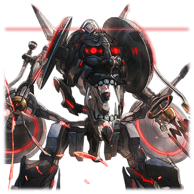
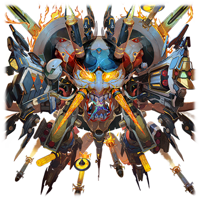

  

# RG-XIII 达因斯雷夫

| 角色信息   |  |
| ----------- | ----------- |
| 名称    | RG-XIII 达因斯雷夫       |
| 年龄   | 制造年份不明（记录被清除）        |
| 职业 |  超大型大质量破坏机动兵器  |
|特技|无人化精神联动系统
| 对应曲   | Contrapasso -inferno-    |
| 初出   | Chunithm Plus      |

## Episode 1 SPEC：达因斯雷夫

> 曾经，有一台和神明为敌，实力能与神明分庭抗礼的究极机动兵器……

旧都市联合军所诞生的究极机体，正在他们的眼前复活。

如果神明能自由自在地控制雷电的话，那么就把雷电变为自己的武器，以其人之道治其人之身。

曾经这股力量是为了防卫都市而存在的，然而现在，人类为了向神明展示自己的意志，这股力量反过来开始破坏起了都市。

 

这高耸的巨大身躯，可以说在有人机动兵器中达到了最大的规模，而机体令人生畏的外表则令所有见到的人无不敬畏。机体搭载了大容量的发电机，配合电磁驱动的机关让机体获得了很高的运动性，并且搭载了各式各样的攻防兵装进行联动。

“魔剑”之名，并非虚有其表。

 

这台论强度空前绝后的机体，与之相对的是极高的操作要求。就像一匹日行千里的烈马一般，非常挑驾驶员。只有与这台机体相性很高并且技术娴熟的人驾驶，甚至必须在战斗中达到人机一体的境界，这台机体真正的价值才能展现出来。

## Episode 2 对人造之神的信仰的意义

> 人类被逼上了绝路，为了创造新的世界，决定向神明祈祷……然而，也有一些人并不赞同神明的存在。

人类走到了一个时代的尽头。

资源枯竭，天空和大海都被污染。

这片人类栖息的大地，终于迎来了大限。

 

“我们已经用尽了所有的手段。现在我们唯一能做的，只有向神，向地球的大自然祈祷，等待地上的环境重新再生的那一天。”

让这片荒芜的大地能够重获生机，需要数万个周期，于是，统一政府将人们聚集到了地下，禁止回到地上。

 

然而，政府也在秘密进行着一个计划，利用操纵雷击的人工知性体·神格艾克雷尔进行的地上环境的改革试验。而这整个实验，不只局限于假象空间，也有对现实世界的干涉，而这一切，众多的市民并不知晓。

住在地下的市民们，本就因为这种密不透风的戒严生活积累了众多不爽，而政府消极且晦涩的说明又引来了不满，怨气就这么在人们之中慢慢积累。

然后——

 

“那个人造的神明，真的值得我们所信仰吗？”

一名原军人，踏上了前往地面的旅途。

他的名字叫海格尼。是一名身经百战的机动兵器驾驶员。

## Episode 3 面对雷神的反抗

> 同志们，集合！这个世界决不能依赖神明过活！如果不靠自己的选择前进的话，就不能称之为人类的历史了！

曾经，旧都市联合军在荒废的地上留存有最后的反抗集团，但是，最后仍然在与统一政府军的交战中败北，不得不屈服于他们。

而这个男人——海格尼，正是当时旧联合军的攻击队长。

在脱离军队后，他成为了模范的劳动市民，然而仍然对政府的方针抱有极强的不信任感。

 

某天，海格尼在调查地下都市常常出现慢性的电力不足的原因的时候，发现了某个惊人的事实——政府正调用着大多数的电力用于运转着他们的服务器群和某种计算单元设备。而这惊人的电量，最终的目的正是维持神格·艾克雷尔的“生存”。

艾克雷尔在刚启动的初期，仍然无法自如地运用天然的雷电进行运作。所以如果没有人工的电能支撑的话，甚至连自身都无法启动。换句话说，市民的生活必须为神所让步……

 

“可恶的政府！只为了地上的那尊神明能够存活下去，就让那么多人在寒冷的地下忍饥挨饿，活活冻死！！”

为此感到愤慨的海格尼，向市民们发表了这一消息。

 

“同志们！集合起来！难道我们就忍心将自己的未来拱手让给神明吗？我们绝对不会屈服，不会屈服于那个人造的神明！！”

海格尼最终成为了反抗政府的叛军先锋，揭竿而起。

## Episode 4 无法杀死人的神

> 正因为这些都是旧时代的机械，所以才有机会打倒神明啊！如果要改变这个世界的话，一定要由我们自己来……！

大多数的地下市民已经疲于面对肮脏而丑陋的地上，纷纷选择了栖身于统一政府所带来的安宁之中，酣然入梦。

然而剩下的部分市民中，还是出现了不少与海格尼观点共鸣的人。渐渐地聚集成数千人的他们拿起了武器，聚集成了反抗军。

 

“把机体派到那里！由我来把防护门打开！”

冲锋陷阵的海格尼闯入了地下的仓库，乘上了封印于地底的最后一台机器。

达因斯雷夫。这台机体正是旧联合军中被誉为最强的一机。

 

这一切都是有备而来的叛乱。地下的市民们将从污染的外界中保护他们的天井防护壁直接破坏，希望能连接到地上。

而这正是人们将要从神明那里取回自己的权利的战争。

穿过政府军警以及机器人的封锁线，离开地下通道，人们终于来到了地面上的巨蛋都市“EDEN（伊甸）”的面前。

 

神·艾克雷尔只是飞在高空中，默默地看着地上的人们。

“那就是……神的样子吗……！？”

初次目睹神的真实样貌的反抗军不禁为之颤栗。

然而，海格尼却心中另有盘算。

 

“不要惧怕。就算神在天空之上也不足为惧。要问为什么的话，他是没办法直接对人们降下制裁的。”

达因斯雷夫瞄准了上空，发射了一枚炮弹。

那是以前与政府军交战的时候使用的电磁炮。

曾经通过EDEN向神格·艾克雷尔供给的巨大电力，就这么转化为电磁炮的能量，向着神的方向而去。

“看来是小看了旧时代的东西，百密一疏啊。”

海格尼望着天空，露出了得意的笑容。

## Episode 5 未来的再次构建

> 像这种由神明单方面赐予的理想什么的，都要破坏掉！人类的理想乡，必须由我们人类自己建立起来……！

由达因斯雷夫所施展的奇袭攻击，对神生效了。

艾克雷尔毕竟是以环境再生和重建都市为基准设计的。所以对人战斗什么的可以说是预料之外的情况。

艾克雷尔的一半身体被破坏，然而他并没有防御或者反击的行动，只是这么呆呆地浮在空中。

 

“看来拔得头筹了啊。就这样再射一发的话——”

海格尼操纵着自己的爱机露出了得意的笑容，然而同时，反抗军们突然开始骚乱起来。

 

“天啊，这也未免太厉害了。”“这样看来，人类说不定能够复苏……”

环视周围……曾经因为环境被破坏以及战争而荒废的都市EDEN，在艾克雷尔的力量下基本都复原了回来。

艾克雷尔，似乎正像是由政府的网络所集中起来的市民们的愿望和理想所聚集而成的集合体一般。

“面对这样的神，我们是否应该为之感恩呢……”

部分反抗军的心中冒出了疑问。

难道说，这个神明的力量，真的值得我们所信任？

追根究底，在地下生活着的市民们的日常生活正是依靠政府的电脑群才能得以维持下去。那么，我们岂不是从最初就是那位神明的臣下了吗？那么，这场叛乱，到底是不是正确的呢？

 

“不要被骗了！这根本不是什么理想，不过是幻术！”

海格尼呐喊着。然后操纵着达因斯雷夫的拳头，挥向了都市的大楼群。

命中了的大楼影子没有发出任何破坏的声响，只是发出了噪音然后直接消灭……这不过是靠立体影像做出来的虚幻之城。

“把这些东西都破坏掉！理想乡，是要靠我们自己的双手去建立的啊！”

跟着全面开火的达因斯雷夫，反抗军们再次举起了武器，继续参加着叛乱。

## Episode 6 预想之外的神之反击

> 本应该拯救人类的神，竟然敢攻击我们……可恶，这些都是那些崇拜着神的家伙的做的手脚吗！

“神明，一定会为人们创造出理想的都市。人类距离回到地上重新复兴已经不远了。赞颂他吧。敬仰他吧——”

——政府终于决定将神所带来的环境变化公之于众，直接改变了宣传方针打算拉拢人心，然而已经太迟了。

 

“快想起来吧。我们为何要举起反抗神明的大旗的理由。”

海格尼驾驶着达因斯雷夫破坏着眼前的一切，一边向着反抗军们讲话。

“难道我们可以把人类的未来托付给那样的神明吗。”

达因斯雷夫指向了天空。在那里，艾克雷尔仍然只留着半截身体，浮在空中呆立不动。

“说不定神已经就这么死了呢。此时不待更待何时！我们必须要靠我们自己的力量，为我们创造新的历史啊！！”

 

“是啊！神自己创造的理想的都市，不要也罢！”

“虚构的美梦什么的赶紧破坏掉吧！”“未来要由我们创造啊！”

参加战斗的市民们并没有士兵那样的力量，但是他们擅长使用网络。他们靠着远程操作，从附近的废弃都市招来了重击和自动化的攻击机器，开始了大肆破坏。

 

然而，EDEN的上空发生了微妙的变化。

“怎么回事？神明的姿态……难道正在回归？”

本应被破坏的半截身子，似乎正在恢复的样子。

到底是真的再生了呢，还是虚幻的影像呢。

之后，艾克雷尔睁开了双眼。

神一言不发地放出了一道雷电。

 

在这之后的几秒，战场瞬间变得一片死寂。

反抗军失去了联系，无法再度联系上在废弃都市的同志们，而远程操作着的机器也停了下来。

无法直接伤害人类的艾克雷尔，在都市间的电路网络上空，落下了雷电。

## Episode 7 降下神罚的决战

> 奋起啊各位！这可是和神之间的，倾尽一切的最终决战啊！这场战斗，将赌上人类的尊严，是决定人类存亡的一战啊……！

“那家伙竟然发动了攻击！？难道说……”

正坐在达因斯雷夫的驾驶舱内的海格尼，看着天空中的神明的行动，不禁咬牙切齿。

 

一直漂浮在EDEN上空的艾克雷尔，将云层中的污染空气化为自己的能源，解放了自己的机能限制……而就此觉醒的神明，获得了无限的电能。然而这些事实，地上的反抗军们丝毫不知情。

 

“为何，为何！为什么那个家伙，会对人类举刀相向！？”

神就这么屹立在半空中，向着地上的EDEN落下了阵阵天雷。

达因斯雷夫承受着阵阵打击。

而电流顺着机体扩散到了周围。在海格尼的机体周围展开的支援部队，瞬间变为了焦炭。

而维持战局的重机和攻击机器人也一台台倒下，腐朽，化为赤铜色的铁屑。

 

“呜！？站起来！同志们，站起来！！我们不能在神的面前就此屈服啊！！”

海格尼驾驶着达因斯雷夫扛着宛如神罚般的雷击，向着地上的反抗军呐喊着。

然而，已经没有人能够回应他的话了。

“是吗……可恶……神的攻击通过我自己，我驾驶着的机体，夺走了大家的生命吗……”

跑到地上的人们，都已经被神的天雷所斩尽杀绝。

 

而在这之后，战场回归了短时间的平静。

EDEN的街道，已经被破坏的不成样子了。

只有偶尔才会从废墟上映照出理想的都市的幻影……立体影像仍然在宣示着神的全能。

现在，战场上唯一立着的，只有达因斯雷夫一台机子了。

## Episode 8 超越人类智慧的机兽之力

> 就算是已经获得了超越了人类想象之外秩序框架的究极神明。只要人类也持有同样能超越极限的机关的话，这种秩序也可以破坏掉。

EDEN上空的艾克雷尔，正如神明一般，支配了附近的电磁场。

达因斯雷夫则正在神的脚下，在遥远的地上，无法动弹。

失去了外部的电力供给，燃料电池也所剩无几。

剩余的活动时间已经即将到达极限。

 

“束手无策了吗。”

已经孤掌难鸣的海格尼思考着。

如果靠机体全部的火力倾泻出去的话，应该就能让神明找不到再生的机会，就这么瞬间将神明击溃吧。

然而仅仅这样是不够的。不确定因素太多了。

距离神的射击距离。弹道推算，还有如何压制住神的机动性。

更重要的是……

自己作为持有着脆弱肉体的人类，是无法接近那个神明所释放的电磁立场的。只要接近，身体就毫无疑问会被烧焦，彻底死亡。

再这样下去的话，是不可能对他造成伤害的。

然而，他笑了出来。

 

“呵呵……现在这个时候还会怕死吗。——舍弃理性，化为野兽。最终防护，解除。诸神黄昏模式，启动。”

随着海格尼的宣告，达因斯雷夫的全身开始变形，全部的武器都解放了出来。

进入最终攻击用的“诸神黄昏模式”的达因斯雷夫，是专门为机械身体的驾驶员准备的突击用模式。所以无法保证驾驶员的生命。

也就是说——

——我，将舍弃自己的肉体，让意识与精神与AI互相融合，将感官与神经与机体同步。

要做的事情再简单不过了。已经没有什么需要质疑的了。

虽然传来了剧烈的疼痛，然而这也不过是一瞬间的事情。

是的。**我成为了达因斯雷夫本身**。

## Episode 9 击穿“希望”的魔剑

> 这一击聚集了人们的绝望……这样的话，神的愿望也会断绝了吧。

我已经从驾驶舱中消失，只剩下冰冷的肉块了。

然而，我并不只是从肉体中脱离出来。现在的我，只要挥动手臂就能卷起狂风，发射漫天的弹幕，伸出耀眼的光刃。伸出腿脚便能发出怒吼划破长空，飞向远方。

人机一体。是的。这就是我所想要的力量。

 

只要我稍微动动脑子，就能轻易侵入政府的网络。而在那里，囚禁着我的同志们的记忆和思念——只要能够将Metaverse上的化身资料救出来的话，就能成为我的友军，承载到机体的身上。

 

通过夺取政府网络的各种技能，我夺取了提供给神的初级供给电源。并且通过远程传输直接传送到了我自己身上。

靠着机体剩下的电能我尽可能地启动了所有的武器，驱动了所有的运动机能，而这些处理过程我交给了那些同志们。

决战的准备已经结束。之后就只剩我完成未竟的事情了。

我要用这双手，将那个神杀死。

那个用幻术和梦境埋葬了人类的未来的那个神。

我背后承载着大家的绝望和悲伤，我非得这么做不可。

 

“同志们，最后再赐予我一次力量吧……！！”

限制器反转。突破敌人防护立场。磁场吸收。

即便神明发出的雷击也终于被我克服，最终成为了自己的力量。

我用尽了全身的力气，跳上了万米的高空。在神明回头迎击之前，我冲到了神明的背后，在贴身的距离对准了炮口。

全弹发射。

从机体发出的无数光束，化为光的漩涡吞没了敌人。在光影之中看到了一片空洞。爆炸的声音响彻天空，冲击波在战场上横扫了很久。

## Episode 10 叛军之死

> 系统停机，无法弹出。但是，我明明，是人类啊……只是普通的一个人，啊……

机体也遭受了爆炸的波及，我坠向了EDEN。

然而，我确确实实打倒了神·艾克雷尔。

神已经被我一刀两断，而剩下的残骸也在空气中慢慢地消散了。

 

我到底是谁呢。我已经不是海格尼了。

我现在是达因斯雷夫。

那么，我现在应该去哪里呢？

已经没有必要回到地下了。

然而在地面上生存，也未免太难了。

神也已经死了。人类，从今以后会变成什么样呢。

 

——机体搭载的AI，似乎在驾驶员弹出的时候发生了错误，并且直接就这么停机了。而且看起来无法恢复。

达因斯雷夫是机动兵器，并非是让人的化身搭载上去的身体啊。看起来，AI把我当成了操纵者，本来应该让我脱离出去的，然而在一片混乱中被破坏了。

 

“真是愚蠢的家伙。”

我是人类。只是普通的一个人类啊。

没法回去，也没法逃离，即便失去了自由的意志，即便漫无目的地徘徊。

我的灵魂仍然是人类的模样，只能，留在这里——

 

终于，坠落到地上的机体也耗尽了最后一丝电力。

机子就这么倒在地上，再也无法动弹。

达因斯雷夫，就这么长眠于EDEN的中心。

## Episode 11 直到再度讨伐神明的那天

> 之后，再度苏醒的自动兵器，被人们称作死神……作为屠杀神明的神，走上了新的道路。

达因斯雷夫。名字来源于北欧神话的魔剑，一旦魔剑从鞘中拔出，必定要吸尽对手的鲜血，造成无法愈合的伤口，最终夺走对手的性命。

 

达因斯雷夫的名字，就这么流传后世，成为了传说中的存在。

然而从某个时候，根据探险者的情报，似乎它正沉睡于王都的地下深处。

由于对它的力量十分好奇，王在好奇心的驱使下，来到了地下，获得了宝剑。

 

然后……达因斯雷夫就这样复活了。

“怎么回事？都是没见过的人和风景……”

它只是抱着疑问说了几句，然而他的语言，对于这个时代和世界的人来说，不过是无字天书。

把剑丢在身后逃走的王。以及被达因斯雷夫巨大的身躯吓到而开始攻击的士兵。

“为什么要逃走？为什么要害怕？我，我可是曾经为人类的未来和自由而战斗过的，EDEN的反抗军……”

一边哀叹着的它，只是轻轻地一动就将身边的士兵全部扫开。

看着士兵们被它轻松击飞，又多添了几分恐怖感，而在这之后，它被人称为了“死神”、

 

“话说回来，神，神究竟在哪儿啊！我的使命，就是杀死神啊！无论是任何人，甚至是我自己，都绝不会停止下来……！“

它抬起了头，并且飞上了天空。

本应打倒的神的气息，应该还存在于某个角落。

所以它下定了决心。一定要找出来，并且彻底消灭神。

一定要将神杀死。不论什么东西，都不能阻止它。

