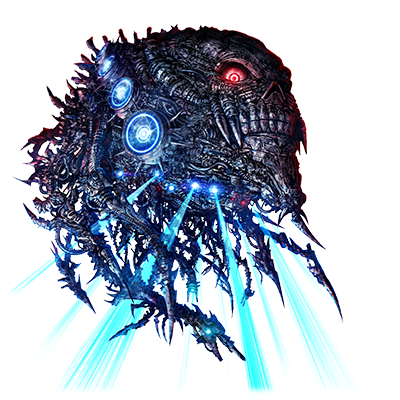

 

# 断绝的破坏神

| 角色信息   |  |
| ----------- | ----------- |
| 名称    | 断绝的破坏神（人类称呼）      |
| 年龄   | 制造年份不明        |
| 职业 |  地上再生机构所属 -人类肃清用大型机动兵器- |
|体长|108米
| 对应曲   | Devastating Blaster   |
| 初出   | Chunithm Air Plus     |

## Episode 1 SPEC：断绝的破坏神

> “那个东西”就这么突然出现了，身拥压倒性的破坏力和质量。人们将这丑陋外表的“那个东西”称作“断绝的破坏神”。

人类这一物种走上了穷途末路，于是创造出了人工的神明，而作为将自身的命运托付给神明的结果，招来了旧都市联合军的抵抗。

而以此为契机，神舍弃了人类，选择了暂时性灭绝人类的做法。

在激烈的战斗过后，操纵着雷电和火焰的神明终究是被持有着魔剑之名的超大型大质量破坏机动兵器毁灭……然而“那个东西”很快就出现在神已经消散的天空中。

 

足以覆盖整片天空的，具有压倒性的质量的机械团块。以及身为机械却长着足以让人类产生生理性厌恶的扭曲身姿。

 

从“那个东西”的嘴里射出了众多的小型肃清用的自动兵器，将地面上的人类宛如野草般烧尽。而“那个东西”自身射出了仿佛曾经的神明那般强大的热能射线，将曾经人类建造的文明的废墟，以及妄图攻击“那个东西”的反抗军们，瞬间蒸发。

 

“那个东西”的全名是——地上再生机构所属—人类肃清用大型机动兵器—。

这正是在神离去之后，执行神的意志的空中要塞。

“那个东西”正是将人类所有的未来与希望彻底破坏的存在……从而获得了“断绝的破坏神”的名号。

## Episode 2 失声

> 我们失去达因斯雷夫之后，抵抗军就再也没有对抗“断绝的破坏神”的能力了。

旧都市联合军组成的反抗军陷入了即将崩溃的危机。

曾经的领导人物海格尼，以及他驾驶的，唯一能和神分庭抗礼的武器，超大型大质量破坏机动兵器“RG-XIII 达因斯雷夫”都已消失，面对突如其来的新威胁“断绝的破坏神”，反抗军束手无策。

 

断绝的破坏神将地表彻底变为了地狱。

如果说断绝的破坏神是地狱的帝王的话，那它所排出的肃清用小型自动兵器就是地狱的狱卒了。

不论男女老幼，凡是机器遇到的人都会被它们残忍杀害。而这些小型兵器，甚至连人类残存的地下区域都不放过。

 

当然，这死亡的威胁也伸到了曾经海格尼揭竿而起的地下都市。

 

“快点！还活着的人赶紧乘上机动兵器逃走啊！”

 

海格尼死后，接替他成为反抗军领导的，是一名年轻的青年，基尔。

曾经面对神格艾克雷尔也毫不退缩的反抗军，在失去反抗能力，燃料和食物都被断绝的破坏神破坏之后，也只能抱头鼠窜。

## Episode 3 燃烧的大地

> 反抗军们在基尔的带领下驾驶着量产型的机动兵器逃亡。即便如此，还是失去了众多的伙伴。

基尔等人乘上了机动兵器，打算从被肃清用小型自动兵器围攻着的地下都市突围。

他们驾驶的机体是“PM-XIII”——“Production model（量产型） 达因斯雷夫”，虽然被冠以曾经打倒神格艾克雷尔的名号……然而性能和原型相差甚远。

曾经的达因斯雷夫，可以说拥有着不负于“弑神”的强大性能……然而那台机体也不过是宛如偶然中诞生的艺术品一般的东西，如果没有海格尼那样的超人般实力的操作水准的话，是没有人能够操纵的。

而在这之后开发的“PM系列”虽然是一般的士兵也能操纵的型号，不过性能自然有所限制。

而这样的“劣化版”机体，结果也是承受不了断绝的破坏神的凌厉攻击。

 

“呜哇啊啊啊啊啊啊！？”

被肃清用小型自动兵器的齐射攻击的友军惨叫声从基尔他们的通信机传了出来。

“乌伽尔——！！”

基尔不由自主地接近了已经大破的乌伽尔的机子，然而其他的伙伴很快就阻止了他。

“已经不行了！基尔！那个家伙已经……”

“为什么……为什么啊！这可是那个乌伽尔啊！？那家伙就这么突然地……”

“……现在先忍耐吧。如果我们大家都死在这里的话，人类就真的要灭亡了啊。”

“可恶啊……可恶啊啊啊啊啊啊啊啊啊——！！”

现在可不是自乱阵脚的时候。基尔只能咬着牙指挥着大家脱离此地。

## Episode 4 新的羁绊

> 基尔他们终于逃到了仍未被“断绝的破坏神”波及的地下城市，获得了暂时的安宁，以及新的希望。

基尔所带领的反抗军，虽然失去了众多宝贵的同伴们的生命，还是带领着大家逃到了其他地下都市。

而他们的目的地是名为“香格里拉”的地方，对于一直在逃亡的反抗军来说，这片地区毫无疑问是他们的“乐园”。

 

以前，这片地方是食品企业聚居的地方，不仅是食物，这里还保留着以燃料资源为基础，能够生产各类物资的能力。而且最重要的是，这里还留存着大多数幸存着的人们。

在这些幸存者中，还有涉世未深的孩子，以及风烛残年的老人们。

“香格里拉”的原住民们，热情地迎接了突然闯入的反抗军们。

他们将自己仅剩无几的食物和生活物资分给反抗军，把反抗军们当成“同甘共苦的同伴”对待。

从这里的人们拿到的是，极其朴素的豆子汤和面包，然而这对现在的基尔他们来说，这些饭食甚至胜过王公贵族的奢华料理。

基尔望着感动流泪喝着汤的同伴们，以及以慈爱的笑容看着他们的原住民们，他确信了一件事。

 

（……果然，不论是怎样的绝望境况，人与人还是能够互相扶持的。只要有这点，就能产生新的希望。这就是人类的强大之处啊！）

## Episode 5 消逝的光芒

> 反抗军在此休养生息的时候，接收到了其他都市的救援请求。为了燃起反抗的狼烟，反抗军再次开始了进军。

“香格里拉”的生活十分顺利，基尔他们很快就融入了这座城市。

今天，基尔正和他的伙伴拉哈姆被孩子们缠着，带着他们去参观PM系列机体的驾驶舱。

看着和孩子们一起玩闹的拉哈姆，基尔沉思着。

（……反抗军作为人们奋起反抗的象征，理应和断绝的破坏神战斗才对。然而，如果就这么留在这里保护“香格里拉”的人们的话，不也一样重要吗？）

 

某天，一通电报彻底打消了基尔的迷惘。那是来自于其他都市的救援信号。

“难道说除了我们之外还有人活着吗！而且，这个都市……不就是曾经制造那台‘达因斯雷夫’的研究都市吗！说不定，这是制造出新的‘弑神者’的机会啊！”

“但是，那里说不定已经遍地都是肃清用的小型自动兵器了啊！”

“而且……如果现在从‘香格里拉’离开的话，这里的人们就没法保证安全了。”

“……怎么办？基尔？”

在稍微思索了之后，基尔决定了。

“……我们可不能对任何正在求救的人不管啊。”

基尔握紧拳头，指向天空。

“怎么能让那些杀人机器为所欲为呢！”

就这样，反抗军和“香格里拉”的人们传达了“很快就会回来”的指示，便踏上了寻找反抗的契机的旅程。

## Episode 6 黑暗的胎动

> 地下都市虽然已被毁，然而基尔他们拿到了某样储存的装置。然而他们仍未知道即将袭来的悲剧。

基尔他们沿着SOS信号的来源，奔向了曾经开发“弑神者”的研究都市。

然而，为时已晚，研究都市已经被断绝的破坏神所释放的小型自动兵器破坏掉了。

一切都已化为焦土。赶到这片只剩下焦炭堆中的红光照耀着的死寂之地的时候，反抗军也哑口无言。

 

“可恶！太晚了！”

“有人在吗！还有人活着吗！？”

大家扫描了各个地方，然而都找不到生命反应。

 

“……怎么会这样……该死！这该死的断绝的破坏神啊啊！！”

反抗军们面对着实施了如此残酷的行径的破坏神，只能诅咒着自己的无力，发出悲痛的声音。

 

大家正在这片死亡的都市中游荡的时候，基尔发现了一台勉强保留着形状的PM型号的残骸。

“……已经没救了。驾驶员已经死了。”

“嗯……？好像手上拿着什么东西？这难道是……储存卡吗？”

“……应该会成为什么线索的吧。”

基尔从这具尸体上感觉到了曾经驻守这里为了人类而战的同志们的意志，于是毫不犹豫地拿走了储存卡。

 

而在这片噩梦之中，另一条噩耗袭来了。

“不好了！！断绝的破坏神已经逼近‘香格里拉’了！！！”

## Episode 7 呼啸的死亡之风

> 地下都市已经沐浴在断绝的破坏神的炮火中。基尔只能将后悔摆在脑后，努力地拯救着人们。

基尔他们闻讯后急忙撤回“香格里拉”，然而当他们到达的时候，断绝的破坏神已经开始了攻击。

整个城市已经到处都能听到居民们的惨叫。

“这些，难道都是我们离开这里才导致的吗！”

“……不要泄气！尽可能救出更多的人离开这里！我们是不能在这种地方放弃的啊！！”

反抗军们顺着基尔的指示，将人们疏导到运送用的机械，开始了疏散。

然而，当他们距离到达地面的出口还有一小段的时候，最后列的机械已经收到了肃清用小型自动兵器的攻击。

“啊啊啊啊！？可恶啊！那个家伙！给我站住啊啊啊！！”

“拉哈姆！快冷静下来！！”

“我怎么能坐得住啊！基尔！那上面可是坐着那群仰慕者我们的孩子们啊！？”

“拉哈姆……”

“该死！断绝的破坏神啊！！你们这些只会屠杀人类的机械啊啊啊啊啊啊啊——！！”

“！？不行！快回来啊！！拉哈姆！！”

基尔的喊叫被甩在脑后，拉哈姆舍身冲向了那堆肃清用的小型自动兵器。机体在爆炸声中化为了碎片。

不知是不是拉哈姆的舍身攻击，地下通道被塌方堵住了后路，追兵也就这么中断了攻击。

“……撤了！！”

为了保护那些剩下来的人，基尔只能在心中默默地悼念拉哈姆，继续向着出口前进。

## Episode 8 黑暗的水底

> 为了保护人们，反抗军一个个地牺牲了。然而在大家都绝望的时候……只有基尔仍然没有放弃。

 

拉哈姆的牺牲，成功让反抗军和居民们逃离了“香格里拉”。

而在突围的时候，不仅是拉哈姆，反抗军还失去了众多的PM系列机体，现在还能战斗的机体，除了基尔以外，剩余的数目，屈指可数。

而最后唯一能依赖的实弹武器也即将见底。

 

“这也太惨了……就现在的状况，要一边保护着非战斗人员，一边转移到别的地下都市什么的，不过是天方夜谭啊。”

经历过无数战斗的基尔他们明白，现在已经到了山穷水尽的时候了。

（已经……到此为止了吗？）

而就在基尔即将放弃的时候……有个人紧紧抱住了他的背后。

 

“呐……基尔，我们是不是就要这么死了？”

那人不是别人，是逃离的时候，被基尔带进驾驶舱逃离的少年，马修。

马修一边发抖一边抱着基尔。

“我不要啊。基尔……我还不想就这么死啊……！”

“马修……”

看着年幼的少年落泪，基尔不得不强打精神。

 

（不行！我必须坚持到最后的一刻！我一定要保护好这些孩子……保护好这座城市的人们！就算要献出我的生命也在所不惜！）

## Episode 9 魂归天际的生命

> 终于还是被“断绝的破坏神”追了上来……为了掩护同伴们逃走，基尔决定舍身攻击！

穿过导弹的暴雨，基尔带着反抗军一边保护着居民们，一边穿越着战场。

他们乘坐的PM系列已经是遍体鳞伤，机体已经弹尽粮绝，没有任何能使用的武器了。

即便如此，他们依旧没有放弃。

“……只要再加把劲，前方就是隔壁的地下都市的防御壁了！大家再坚持一会儿！”

就算机体已经大破，就算自己身负重伤，心中牢记着“保护居民”这一职责的反抗军们，每个人都战斗到了最后一刻。

一个人，一个人在眼前死去。而基尔他们终于赶到了地下都市的防御壁入口。

（好！接着只要将大家引导到那里的话！）

就在基尔的心中亮起些微的光芒的时候……一道血红色的光芒将这一切变为绝望。

“队长！！断绝的破坏神出现了！！”

随着巨响从空中现身的断绝的破坏神，用着宛如浑浊的眼珠子般的探照灯照着这里，立刻就锁定了基尔他们。

基尔做好了觉悟。他将马修从驾驶舱送了出去，交给其他的反抗军让他们先撤离。

“……无论如何都必须争取时间。你们一定要保护好这些居民们，总有一天一定要找到能够打倒断绝的破坏神的人。”

“怎么会……队长呢！？”

“快走！没有时间了！”

基尔装备上了近距离攻击用的链锯，向断绝的破坏神发起了舍身攻击。

“唔噢噢噢噢噢噢噢——！！”

就在这个时候……眼前的一切都被白色的光吞没了。

## Episode 10 纯白而宁静的世界

> 重新醒来的基尔眼前看到的景象，是一片地狱。失去了伙伴，失去了那些人们，基尔只能流着血泪无助地呐喊。

被白色的光吞没的基尔睁开了眼睛，而在他眼前的是人们的笑容。看来反抗军和城市的居民们都已经逃离了断绝的破坏神的追杀，来到了这座既安全又残留着自然环境的地下都市居住的样子。

“啊哈哈！基尔！我可是第一次看到真的植物啊！”

本来那么害怕的马修也变得活蹦乱跳。

（啊啊……看来奇迹发生了呢）

不知何时，基尔的身旁出现了乌伽尔和拉哈姆。

（不可能……乌伽尔他们不是已经……）

在这个时候，基尔才注意到了这个事实。

“奇迹”这种东西，是人类绝对无法触及到的，神的领域。正因为无法达到，才会被称为奇迹……。

 

“咕……！呜呜，啊啊……！”

基尔随着痛苦的呻吟声恢复了意识。而在他眼前的则是一片血红色的地狱。

旁边都是被碾碎而惨死的人们，还有散落在四处的同伴们的机体残骸。

而基尔的面前看到的是，马修曾经戴在头上的蓝色帽子，已经被鲜血染成了一片黑色。

“呜呜唔啊啊啊啊啊啊啊啊——啊啊啊啊啊啊啊啊啊啊啊啊！！！”

失去右手的基尔，只能紧紧地用左手抓着马修的帽子向着天空呐喊。

夜空正在洒落着无数的流星。那一颗颗的流星正是断绝的破坏神制造出来的肃清用小型兵器。那一颗颗的流星，都是惨死在机器手下的人们的灵魂……

“……好啊。既然人类的毁灭是神所决定的命运的话，那我，就要将这份命运打碎！！”

基尔流着血泪发誓。

## Episode 11 神话之王

> 时间流逝，人类以一名称作“塔拉萨博士”的人为首，开发了究极的兵器。而以此为契机，新的圣战，开始了……

日月如梭……曾经被断绝的破坏神所追杀的人类，再次燃起了反抗的意志。

以最后一名人类的幸存者——“钢铁的战士”塔拉萨博士为中心，以曾经被断绝的破坏神所破坏的地下都市中的储存卡为蓝本，创造出了最终的兵器。

 

没有人知道塔拉萨博士的过去，只知道他的一只手臂是在和断绝的破坏神的战斗中失去了而已。

而与这钢铁的身体相应的，是塔拉萨博士那比任何人都冷静和残酷的决策心……然而在他的心中却始终燃烧着一把火。

那是深深刻于他的身体里的，“杀死神明”的憎恨之火。

 

“人类终将死亡的命运……只靠我的力量的话，是无法改变的。不过，我一定会为死去的人们复仇……而现在，新的弑神者将在我的眼前诞生。”

塔拉萨博士站在逐渐成长着的程序面前，露出黑暗的笑容。原本青色的机械手臂已经彻底变为宛如肮脏的抹布般的黑色，而这机械手正握着某个东西。

 

“这就是——在这个混沌的世界所生下来的，究极的原始的力量……作为将残虐的神明杀死的暴虐之王……其名为——‘提亚马特’”

……现在，人类，正在神的意志下压迫着，而在那前方，则是新的开始。

那即将开始的东西，不是别的，正是新的“圣战”……

