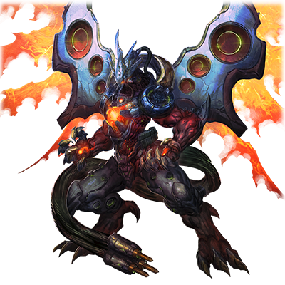
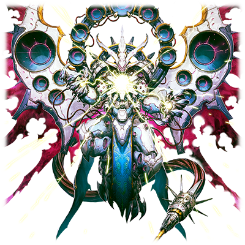

  

# RG-XXX 提亚马特

| 角色信息   |  |
| ----------- | ----------- |
| 名称    | RG-XXX 提亚马特      |
| 年龄   | 制造年份不明        |
| 职业 |  为了破坏Metaverse由人类送来的使者 |
| 对应曲   | TiamaT:F minor   |
| 初出   | Chunithm Air Plus     |

## Episode 1 SPEC:提亚马特

> 由复仇与憎恨的火焰所创造出来的真正的弑神者。其名为“RG-XXX 提亚马特”

在被称作“断绝的破坏神”的恐怖空中要塞的攻击下，人类已经无法避免地走上了毁灭的道路。

 

然而，仍然反抗着命运的人们，在无数壮烈牺牲的同伴之上，终于制造出了那个存在……。

 

“提亚马特”——这就是被流放到地下的现行人类所创造的最后遗产。

 

为了对那些把自己逼上绝路的机械复仇而铸成的复仇之剑。

 

这正是将人工的神明所制造出来的乐园，Metaverse卷入混沌与破坏的深渊中的最终兵器。

## Episode 2 潜伏于乐园中的异变

> 让人类变得多种多样的乐园Metaverse。从某天开始，那里就开始出现开发程序突然消失的奇怪现象。

由人工的神明所创造的乐园·Metaverse。

表面上，这里正是大家所向往的理想乡。然而，在安居乐业的人们所不知道的角落，正发生着严重的问题。

Metaverse是一个每时每刻都在发展，都在进化的世界。为了容纳持续增加的人类，常常要拓展新的领域。

正因如此，在边境的数据之海工作着的开发程序们就要一直进行建造的工作。

而从某天开始，开发程序出现了突然崩坏的奇异现象。

 

为了查明奇异现象的来源，“框架主脑”(メインフレーム)派出了调查团。

而他们在那里发现的是，只剩宛如融化的糖浆一般的残骸的，已经被破坏的Metaverse的防卫程序。

“这伤口……怎么看都是超高温的激光攻击导致的伤口……到底是和什么东西战斗了呢？”

“怎么可能！？这些防卫程序的装甲可是迄今为止最坚硬的啊？”

 

调查团为这意料之外的情况而陷入了混乱。

突然，在他们面前响起了地动山摇般的巨大响声，调查团立刻步入了临战态势。

从数据的海洋中一瞬间冒出了巨大的剪影。然而之后什么都没有发生，现场陷入了一片死寂。

 

即便如此，调查团仍然害怕得无法动弹。

那是因为，即便靠他们的感应器，也无法正确识别这个巨大的影子是何物。

## Episode 3 威胁现身

> 在调查团的面前出现的，是不知其真面目为何物的杀戮兵器。其怪异的身姿宛如恶魔般令人战栗。

在这之后，程序间会出现奇怪崩坏的现象戛然而止。人们判断事件已经解决了，于是便放下了警戒。

毕竟Metaverse仍然在大力开拓的时期，并没有精力去顾及这些奇异现象。

 

就这样，又度过了数个周期，某天，“框架主脑”内响起了震天的警报。

“Metaverse的主干程序区域的一部分出现了大规模的损伤！”

根据得到的情报，近日开发的城市，在一瞬间就被蒸发了。

由于这突如其来的事情，大多数人始终觉得“这难道不是普通的错误吗？”，于是便派出了非战斗用的程序所组成的调查团。

 

前往报告所指的地方的调查团，用自己的双眼确认了一整座城市都彻底消失的事实。

“……这残骸，就和糖浆一样黏糊糊的。难道说……这和几个周期前的情况一样？”

 

调查团回想起了当时的恐怖经历。这和当时的情况如出一辙。

而且，目睹了从数据之海缓缓上浮的异形的他们，终于发现说不定这次的事情的主谋，是比自己想象还更加可怕的存在。

 

“那是什么……漆黑的……翅膀？难道说那个身姿是！龙……吗！？”

## Episode 4 被无情蹂躏的Metaverse

> 漆黑的巨龙只是吼叫便吹散了在场的调查团。而那庄严的身姿，无人能离开视线。

突然出现的漆黑巨龙，立刻就对调查团发动了攻击。

巨龙只是拍了拍翅膀，风压的巨大冲击力便让身为非战斗用程序的调查团们停止了工作。

而巨龙的咆哮化为了震天的冲击波，就连前来防卫调查团的下级防卫程序，像纸屑一般被吹飞。

 

“不行了……怎么可能打赢这种家伙啊！”

 

在这压倒性的存在面前，程序们止不住地战栗。

然而，巨龙并不是只有凶悍的力量而已。

从漆黑的巨龙背后张开了十枚翅膀，各自缠绕着红色的火焰，将Metaverse的天空染成了一片红色。

这身姿宛如背负着光轮的原初之神，甚至令程序们发觉自己的渺小和卑微，在这漆黑的巨龙面前，程序们纷纷被其庄严而美丽的身姿所震撼，只能伏在地上无法动弹。

 

之后，勉强恢复行动能力的程序们，立刻就撤回了“框架主脑”，向现今的统治者，继承了神格·艾克雷的遗产，现在身为Metaverse的真正神明君临大地的人，提丰，报告了这一事实。

## Episode 5 次时代的统治者

> Metaverse新时代的统治者“提丰”，为这不知道自己存在的侵略者而愤怒。

提丰是从艾克雷尔消失之后，被选拔为控制Metaverse的新时代的统治者。

具有和艾克雷尔同等的权限，以及力量的提丰，听着自己手下的程序们的报告，眯起了眼睛。

“……就连身为这个Metaverse统治者的我都不放在眼里的未知程序？不止如此，这个未知程序居然还能在一瞬间将整座城市破坏掉？……你们这是在说什么瞎话？”

 

面对着露出不快表情的神，下级的程序们只能战战兢兢地继续报告着。

通过程序们传来的画面，提丰发觉了事态的严重，与此同时，也为这突如其来的破坏者而大怒。

 

此时，漆黑的巨龙正在一个个地破坏着Metaverse的程序，这些消息很快就传到了提丰所在的“框架主脑”的中枢部。

 

“赶紧把监视器打开！”

提丰一声令下，画面上出现了漆黑巨龙的样子。

巨龙不分对象，无论是战斗用的还是非战斗用的程序，都被悉数破坏。

之后，巨龙的身体发出了白色的光芒，然后眼前的世界就彻底爆炸了。

从巨龙口中喷出的光芒吞没了都市，在这之后，画面便是一片雪花了。

## Episode 6 其名为提亚马特

> 漆黑的巨龙如是说。“吾，名为提亚马特。此身寄宿着复仇之劫火，为虚伪的神明带来毁灭。”

提丰立刻传送到了被巨龙毁灭的城市。

巨龙立刻认出了提丰的样子，用着雷鸣般的声音问着。

“……你，就是这个世界的王吗？”

“……你，到底是什么东西？”

漆黑的巨龙张开翅膀，咆哮着。

“……吾，名为提亚马特！吾乃手持绝望之剑的破灭之使者！吾身寄宿复仇之劫火，将为虚伪的王带来属于他的死亡！”

自称为提亚马特的漆黑巨龙，继续说了下去。

“由吾之创造者，塔拉萨博士向尔等传达一言——

虚伪的王啊。被我等的憎恨之火烧尽吧。曾经将我们的同胞宛如虫豸般屠杀殆尽的痛苦，让你们也承受看看吧！！”

 

在传达了那些生命被践踏粉碎的人们的痛苦和诅咒之后，提亚马特的身体发出了眩目的白光。

“咕……！不妙！各位！立刻逃到框架主脑避难啊！”

从提亚马特的身体之中发射了强大的能量波。这股足以将一切烧尽的憎恶与净化的火焰，正是来自其身上的对Metaverse破坏机构——“终极涡流”。

其强大的力量，就算是身为Metaverse统治者的提丰的力量，也无法阻挡。

（……那些飞虫般柔弱的旧人类，竟然还拥有着创造出这样强大存在的力量吗！）

提丰的内心感觉到了一股屈辱，然而他也只能狼狈地撤回了框架主脑。

## Episode 7 虚伪的马尔杜克计划

> 在框架主脑中枢，为了讨伐提亚马特，提丰发动了“马尔杜克计划”。

撤回框架主脑的上位程序们，很快就开始了如何打倒提亚马特的对策会议。

然而，由于之前提亚马特所释放的“终极涡流”的威力过于巨大，无论怎么计算，以目前Metaverse现存的程序战力，都不足以对抗提亚马特。

在程序们正抱头苦恼的时候，负责观测提亚马特的部队发来了紧急的消息。

“报，报告！提亚马特开始移动了！正向着框架主脑而来！”

众多程序都不由自主地露出了怯意，然而坐在中央的提丰却只是笑了笑。

“呵呵呵……既然那家伙打算直接冲过来的话，那正是绝妙的机会……我有一个好主意。”

提丰提出了使用隐形的防御网捕捉住提亚马特，趁无法动弹之时一起攻击消灭之的方案。

“……其名为‘马尔杜克计划’。就算那个家伙再怎么强大，说到底不过是风中残烛的旧人类所诞生的渣滓罢了。肯定撑不过我们的全力攻击。”

“原来如此……那么就尽快编成部队执行作战吧。”

“嗯……赶紧去吧。”

提丰一边对着下属的程序发号施令，一边转过身来，走向了别的地方。

“提丰大人……您这是去哪儿？”

“……我还有需要完成的事情……去吧！将那个大不敬的家伙的脑袋给我带回来！”

## Episode 8 愤怒的龙神王

> 遭受了一齐攻击的提亚马特，放射出了强烈的光芒与热量，进化（Overclock）成为了新的姿态。

提丰所决定的“马尔杜克计划”很快就开始实施。

足以令下级程序触摸到就直接蒸发的防卫网，以及一击便可将空间本身消去的量子兵器突击加农炮……即便使用了众多的武器发动总攻击，然而却无法阻止巨龙的脚步。

“第三层防卫线已经被突破了！”

“可恶！不要怕！”

层层交织的防卫网组成的防线，连绵不断的齐射攻击……即便敌人无情突破着一道道防线，程序们被无情摧毁，化为雪片般的电子颗粒消失，程序们也从未退缩……直到这一刻。

“……提亚马特陷入沉默了！”

程序们目睹了提亚马特停止了行动，纷纷发出了胜利的欢呼。

然而，龙王的愤怒，仍未结束。

“……怎么回事？高热源的反应吗！？难道说，这家伙要再次启动了吗！？”

 

再次启动的提亚马特产生的高温直接让其全身的装甲宛如蜕皮般脱落，变形……白银色的盔甲缠身的龙王，再度开始了单方面的蹂躏。

提亚马特·超频模式（Overclock）……面对着更胜一筹的压倒性力量，程序们战斗的意志被彻底燃尽了。

“提，提丰大人啊！我们已经束手无策了！快救救我们！”

身体被击碎，被焚烧所发出的惨叫，在战场上回荡。

即便如此，他们的神，提丰，仍未现身。

## Episode 9 终极涡流

> 终焉之火焰将世间所有的一切都化为灰烬。然后，缠绕着暴风的支配着终于现身至这绝对的破坏者眼前。

进入超频状态的提亚马特，已入无人之境。

无论多么勇敢地上前挑战的程序，其舍身的攻击在触及提亚马特之前，便早已被提亚马特身缠的高热所蒸发。他们连提亚马特的装甲都无法触及。

 

“提丰大人！请救救我们！”

“还请您尽快出马，将这个怪物消灭啊！”

程序们就这样在绝望的祈求之中彻底消失，沉入电子的海洋……。

 

而提亚马特却把这惨叫当成小鸟的歌声般欣赏着。

提亚马特的攻击势不可挡。将一切踩在脚下化为齑粉的身姿，仿佛曾经肆虐于地上的，被称作“断绝的破坏神”的，屠杀着人类的巨大空中要塞的再次现身一般。

 

只不过，这次不过是复仇的循环降临到了这里罢了。

 

最终……提亚马特还是前往了框架主脑。在发出了宛如预示着Metaverse的镇魂歌一般的巨吼之后，提亚马特开始蓄力，准备发动足以将神明彻底消灭的“终极涡流”。

而就在此时……缠绕着暴风的神明·提亚马特终于现身于此。

## Episode 10 圣战，再度打响

> 到达更高层次的存在的提丰和提亚马特之间不相上下，然而，战斗还是迎来了落幕。

看着和之前相比已经进化了的提丰，提亚马特很快就领悟了什么。

“哦……将其他的程序吸收成为自己的东西，从而进化了吗。”

“不错。虽然不过是尘芥般的微小力量，不过聚沙成塔，还是不可小觑的……只要吸收那些破损的程序的话，我就能成为更高层次的存在。这，才是真正的‘马尔杜克计划’啊！……呵呵呵。那些乌合之众，不过也是我的食粮罢了，不如说他们该为能献身于我而光荣呢。”

“真是自私自利啊。不过这正是吾所讨伐的神所应有的傲慢啊。”

“……准备被吾之终焉的烈火烧为灰烬吧！”

提亚马特的胸前闪烁着光芒，放射出了将一切都燃为灰烬的“终极涡流”。

“人类的残留渣滓！少来妨碍我的好事！”

提丰所包裹着的狂风放射出了巨大的光束，散射出了无尽的光束。被称作“银河新星”的这份力量，正是只有身为神才持有的绝对的破坏之力。

两股力量不相上下，然而，最后获胜的却是提丰。提亚马特被电磁的风暴覆盖，放出了宛如超新星爆炸一般的剧烈光芒，爆炸粉碎。

耗尽力量的提丰大口喘着气，跪了下来。他的身体各处也出现了数据破坏的现象，机能已经下降到了只剩30%。

（明明现有的人类都已经快要濒临灭绝了……到底是什么样的执念让已经穷途末路的他们再次反抗？到底为什么人类总能够突破属于他们的这个物种的极限？）

身为Metaverse的绝对管理者的提丰，借着这次战役的契机，开始对人类产生了极大的好奇心。

## Episode 11 混沌之母

> 爆发四散的龙神王的残骸沉入了乐园的深海。而这些四散的碎片最终成为了诞生新的混沌的苗床。

化为暴虐之风的王者的提丰最终依靠着“银河新星”的压倒力量，彻底粉碎了现有人类最后的，也是最强的复仇的兵器的提亚马特的身躯。

 

然而……提亚马特的残骸并非就这么消失了。

那些沉入Metaverse最深处的残骸们。

 

定睛一看的话，那些碎片的表面，正宛如化学反应般冒着黑色的泡泡，开始分裂。

而这些黑色的泡泡中，映照着的是提亚马特深处所燃烧着的，憎恨的火焰。

 

由数据所组成的乐园，Metaverse，混入了来自这个世界之外的异物。

这些正是沉于构筑出Metaverse的多彩世界的数据之海的最深处的，憎恨着世界，并期望着破坏的数据。

 

这些数据中产生的东西，已经不再是提亚马特的意识了。

然而，由于这些碎片本身与世界的毫不相容，又产生了足以让Metaverse变质的，新的混沌。

而提亚马特的身躯，终究沉入了即便是神的光芒也无法触及的，数据之海的最深处。

对神明的无尽怒火，对愚蠢的人类所下达的惩罚……这一切，最终诞生了被称为“涅墨西斯”的黑暗之物。

