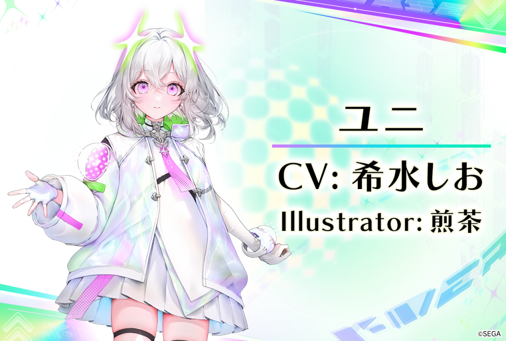
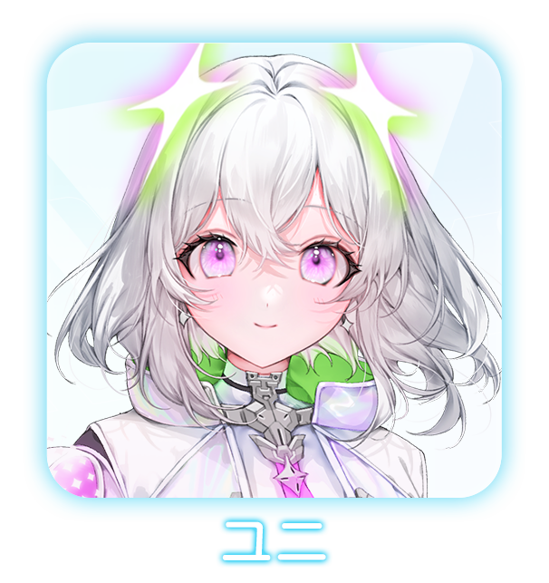
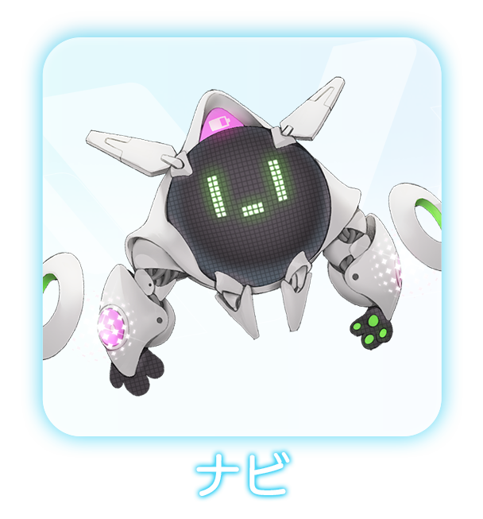
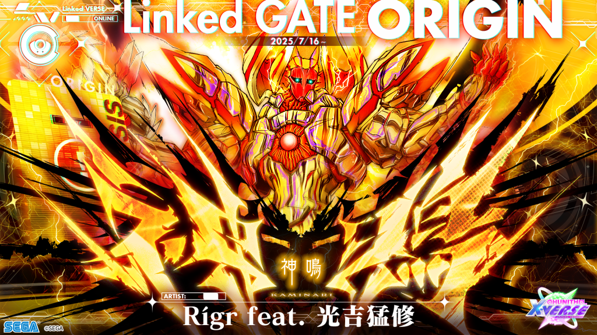
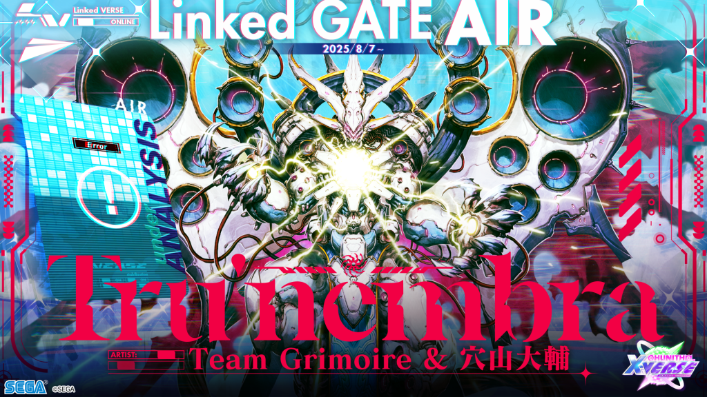
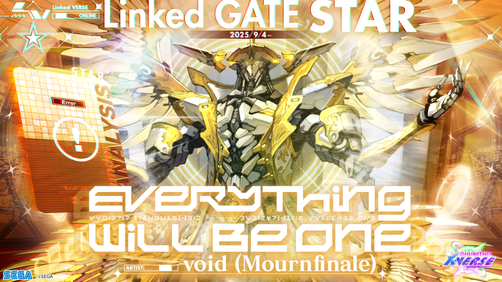
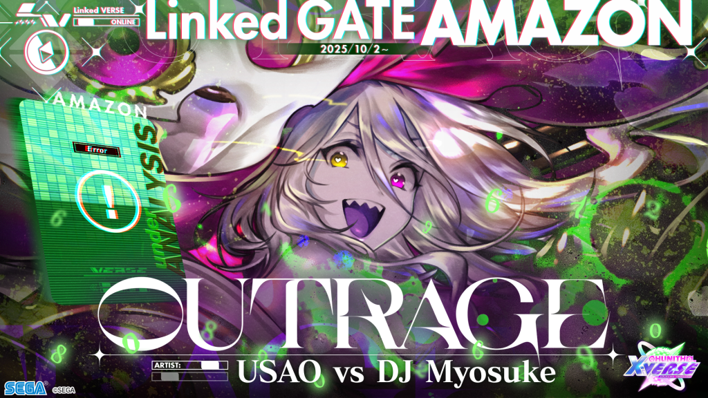
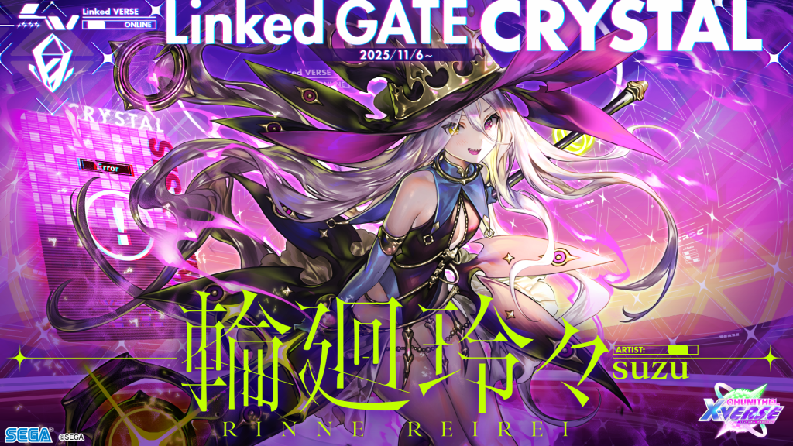
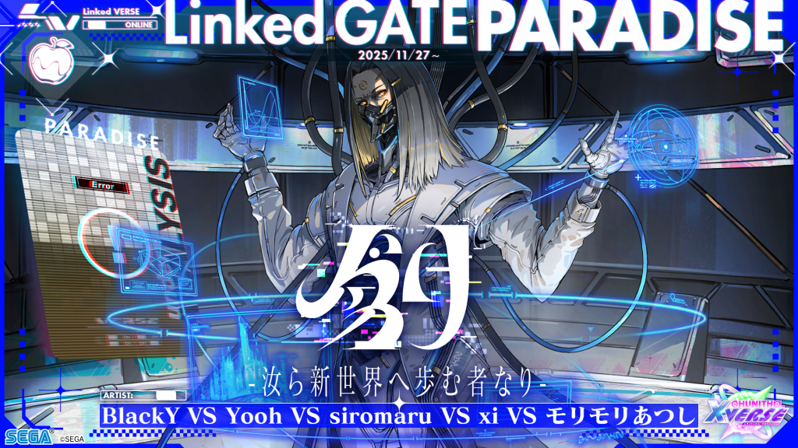

# Linked VERSE

此模式为Chunithm于X-VERSE版本引入的游玩模式。

通过完成游戏内隐藏的条件，就会出现“大门”，挑战成功将会解锁隐藏曲。

每个大门各自对应了以前的版本，对应的曲目和人物也对应了当时版本的BOSS曲。

在此模式中，将由新角色“尤尼”作为玩家的向导。

此模式的玩法和内容设置与maimai FiNALE的PANDORA BOXXX十分相似。

官方于X-VERSEX更新前夕，于官网上公布了直到XVERSE版本结束为止所有的剧情内容。

后续的更新对话也将于此刊载。

## 背景介绍

这个世界存在着无数的次元。其中一个，存在着跟大众认知完全不同的“CHUNITHM”。

不同于各位玩家所玩到的游戏机，

那是个连接着不同<ruby>次元<rp>（</rp><rt>VERSE</rt><rp>）</rp></ruby>，从这些世界的故事中产生乐曲并传递出去的娱乐系统。

为了区别尤尼所描述的CHUNITHM，尤尼所在世界的CHUNITHM将会称为UHUNITHM。

 

然而，从某个时间开始，UHUNITHM却再也连接不到其他的<ruby>次元<rp>（</rp><rt>VERSE</rt><rp>）</rp></ruby>了，所以，也就再也没有新的乐曲诞生。

身为UHUNITHM的向导AI，尤尼为了寻求帮助，开始寻找起存在着CHUNITHM的其他<ruby>次元<rp>（</rp><rt>VERSE</rt><rp>）</rp></ruby>。

最终，她发现了这个<ruby>次元<rp>（</rp><rt>VERSE</rt><rp>）</rp></ruby>。

 

尤尼虽然尝试与之连接，然而两个世界相异的CHUNITHM却由于互相干涉，产生了系统错误。

乐曲也产生了错误，出现了“旋律异化现象”。

只靠尤尼一个人是无法修复大门的，她也就这样被困在了CHUNITHM框体之中。

 

为了寻找回去的方法，

尤尼向偶然路过游玩CHUNITHM的玩家——也就是你，发起了求助。

## 角色介绍

|
 
|   |    |
| ----------- | ----------- | ----------- |
|

|尤尼|UHUNITHM的向导AI，性格乐观，开朗。
|

|NAVI|协助尤尼处理部分事务工作的助手。拥有自主运行的能力，能与尤尼互相交换数据。

## 关系图与用语说明

| 用语   | 说明 |
| ----------- | ----------- |
VERSE|代表无穷无尽的不同“<ruby>次元<rp>（</rp><rt>VERSE</rt><rp>）</rp></ruby>”。每个<ruby>次元<rp>（</rp><rt>VERSE</rt><rp>）</rp></ruby>都是独立的存在，尤尼原本所在的次元，玩家所在的次元，也是其中的一部分。
UHUNITHM|存在于尤尼的<ruby>次元<rp>（</rp><rt>VERSE</rt><rp>）</rp></ruby>中的娱乐系统。能够连接各个不同的<ruby>次元<rp>（</rp><rt>VERSE</rt><rp>）</rp></ruby>，提取其中的故事与情感从而生出乐曲。 虽然也称之为CHUNITHM，但是与玩家所熟知的CHUNITHM实在是差距过大，所以才如此称呼以作区分。
オルタリズム(旋律异化)|代指因为BUG的缘故产生了变化的乐曲，也可以指这种现象。 尤尼在与玩家所在的<ruby>次元<rp>（</rp><rt>VERSE</rt><rp>）</rp></ruby>连接的时候产生了BUG，也让游戏中的乐曲发生了这样的现象。
大门/Linked GATE|用于连接不同的<ruby>次元<rp>（</rp><rt>VERSE</rt><rp>）</rp></ruby>的大门。 如果是稳定状态的大门的话，尤尼可以从中提取出传送的能量。 由于尤尼在与玩家的<ruby>次元<rp>（</rp><rt>VERSE</rt><rp>）</rp></ruby>连接的时候出现了系统错误，全部的门都被破坏了。
修复大门|修复连接不稳定的大门的工作。 当玩家游玩对应的游戏时，NAVI与尤尼便会在后方对乐曲进行分析，最终获得代码。 只要玩家能够完成整首乐曲，便可以获得代码，修复大门。 当大门全部都被修复，能量也恢复供应，尤尼就可以回到原本的世界了。
代码|用于修复“大门”所需要的，类似密码一样的东西。 通过尤尼与NAVI的分析便可获得。
升级补丁|通过解析旋律异化现象获得的代码从而生成的产物。只有安装升级补丁，才可探索更多的“大门”。

## 剧情内容

### Linked GATE ORIGIN

| 头像  | 文字 |
| ----------- | ----------- |
|

|初次见面！我是尤尼！ 是这个版本的CHUNITHM的向导AI哦！ 玩家，请多指教！|
|

|各位玩家也应该知道， CHUNITHM是连接各种各样的<ruby>次元<rp>（</rp><rt>VERSE</rt><rp>）</rp></ruby>，从那之中发生的各种各样的故事和能量中制造出音乐，传递给大家的系统哦？ 咦……？你说和你知道的CHUNITHM不太一样？
|

|怎么回事呢？ NAVI！拜托你搜索一下当前连接的坐标！
|

|哔哔哔……【似乎在调查着什么】
|

|咦！不会吧……这怎么可能 那个……这位玩家。可能有些事情必须和您说……
|

|现在，我的世界的CHUNITHM产生了严重的BUG， 无法与其他的<ruby>次元<rp>（</rp><rt>VERSE</rt><rp>）</rp></ruby>取得联系，不知道为何，只剩这里能联系的上了。 我也跟我的同伴失去了联系，现在怎么说来着……有点不妙？
|

|所以，拜托了！ 玩家先生/小姐！ 能不能助我一臂之力，帮忙修复连接其他<ruby>次元<rp>（</rp><rt>VERSE</rt><rp>）</rp></ruby>的大门呢？
|

|具体要怎么做，是吗？ 现在，大门应该就存在于某个地方，只是我们不知道怎样接触而已， 就先以找到大门并打开为目的吧！
|

|能够接触“大门”的话，只要与全国的玩家一同联机，即可开始修复（日服限定） 在修复中，每个人都会持有「Link GAUGE」，一旦全员归零，连接便会中断！ 只要有一个人坚持到了最后，大门就能成功修复了！作为奖励，玩家们将获得对应曲子！
|

|很快就找到了第一个大门的坐标 玩家先生/小姐，准备好了吗？

#### （过关后）

| 头像  | 文字 |
| ----------- | ----------- |
|

|玩家先生/小姐，太好了！这样第一个门就修复完毕了！ 突然蹦出不认识的曲子，吓了我一跳呢！  嗯？怎么了？NAVI？
|

|哔哔哔……【似乎在向尤尼传达着什么】
|

|也就是说，大门的修复需要那些被旋律异化的曲子的代码是吗？  只要像刚才那样玩家在攻略异化曲子的时候，我和NAVI进行研究的话，就能获得代码了是吧！  懂了，以后就这么干！ 好嘞！以后也要加油！
|

|说起来，在调查CHUNITHM的时候，这个<ruby>次元<rp>（</rp><rt>VERSE</rt><rp>）</rp></ruby>似乎还有很多的音乐游戏呢！ 我要不要也去看看这些游戏是什么样的呢…… 玩家也跟我说一说你喜欢什么样的音乐游戏吧！

### Linked GATE AIR

| 头像  | 文字 |
| ----------- | ----------- |
|

|在玩家先生/小姐努力的时候，我也在调查这边的CHUNITHM呢！ 原来这个世界的CHUNITHM是在名叫“游戏中心”的场所的呢！ 跟我们所在的世界的UHUNITHM完全不同，这就是文化冲击吗！
|

|咦？你说UHUNITHM是什么吗？对了，还没说呢！ 各位玩家所在的<ruby>次元<rp>（</rp><rt>VERSE</rt><rp>）</rp></ruby>和我们所在的<ruby>次元<rp>（</rp><rt>VERSE</rt><rp>）</rp></ruby>不都有CHUNITHM不是吗？要是弄混了怎么办！  所以呀，从今以后，我们世界的CHUNITHM就用UHUNITHM称呼吧！ 怎么样，还不错吧？？
|

|哔哔哔……【似乎在表达着不满之类的情绪】
|

|咦？不太行吗？可是名字也挺可爱，叫起来也朗朗上口嘛！ 玩家也是这么想得，对吧！ 从今以后就这么称呼了！  ……正说着呢，异化曲的反应已经这么接近了吗！

#### （过关后）

| 头像  | 文字 |
| ----------- | ----------- |
|

|大门修复完毕！好耶！ 这也是因为有我的协助才得以完成啊！ ……开玩笑的啦。 这都是玩家先生/小姐的努力哦！ 谢谢你！

### Linked GATE STAR

| 头像  | 文字 |
| ----------- | ----------- |
|

|哔哔哔……【正训斥着尤尼】
|

|…… 呜呜……我知道啦……我会和玩家好好说的啦！
|

|那个，你可别生气哦……？ 其实啊，玩家先生/小姐，其实UHUNITHM会变成这样，都是，我的缘故……
|

|说什么刚刚升级了新版本也是骗人的。 其实，因为一直未能连接新的<ruby>次元<rp>（</rp><rt>VERSE</rt><rp>）</rp></ruby>，所以已经很久没有生成新的曲子了。
|

|我一直就这么拖着拖着， 但是，我觉得已经够了 所以我想到了一件事！
|

|那就是分析最擅长CHUNITHM的<ruby>次元<rp>（</rp><rt>VERSE</rt><rp>）</rp></ruby>的数据。 对，就是这个<ruby>次元<rp>（</rp><rt>VERSE</rt><rp>）</rp></ruby>哦。
|

|所以，我就这么在NAVI的眼皮底下，偷偷地尝试跟这边进行连接…… 结果就是，UHUNITHM跟这个<ruby>次元<rp>（</rp><rt>VERSE</rt><rp>）</rp></ruby>缠在了一起。
|

|哔哔哔……【怒火中烧】
|

|呜呜，明明我的脑子里一直在想着要早点说的，结果就一直拖到现在 真的很抱歉！
|

|不过，我可以保证！我只是想做点什么打破目前的困境而已！ 所以……从今以后要是能够继续帮忙的话……我会很高兴的……
|

|欸嘿嘿……谢谢你！ 玩家大人就是心胸宽广啊！ 那么这次的“大门”也努力上吧！

#### （过关后）

| 头像  | 文字 |
| ----------- | ----------- |
|

|Link Complete！ 这次的大门也修复完毕了呢！

### Linked GATE AMAZON

| 头像  | 文字 |
| ----------- | ----------- |
|

|哔哔哔……【似乎在向尤尼说些什么】
|

|啊，玩家先生/小姐！怎么办！ 这样下去的话是没办法修复UHUNITHM的！
|

|根据NAVI的说法，就算修复了现在已知的**6个门**，能量也是不够的，没办法传送回我们原本所在的<ruby>次元<rp>（</rp><rt>VERSE</rt><rp>）</rp></ruby>！ 所以，我们还必须去寻找更多的大门才行！
|

|然后呢，从那些异化曲中获得的代码，可以制成升级补丁。 只要将升级补丁装到我的身上，应该就能够找到第七扇甚至之后的门了…… 不过呢……我就老实说了。
|

|我！不！要！升！级！ 不！想！升！级！啊！
|

|虽然NAVI一直在说很安全 但是随便就装上来路不明的数据做成的升级补丁，想想就可怕吧？
|

|是吧……你也这么想对吧？ 我当然知道……现在没有其他办法了。 但是，能不能给我点时间想想呢？
|

|抱歉了……NAVI，还有玩家先生/小姐……

#### （过关后）

| 头像  | 文字 |
| ----------- | ----------- |
|

|玩家先生/小姐！修复完毕了哦！ 关于升级补丁的事情，我会考虑的。

### Linked GATE CRYSTAL

| 头像  | 文字 |
| ----------- | ----------- |
|

|呀嚯！ ……玩家先生/小姐，那个……
|

|其实在那之后我思考了很久，但我还是很讨厌升级啊……
|

|因为啊，引导AI是不会做那样危险的工作吧……不是吗？
|

|——不过，啊，我在这个<ruby>次元<rp>（</rp><rt>VERSE</rt><rp>）</rp></ruby>见到了无数游玩着CHUNITHM，为它欢笑，为它哭泣的人们。
|

|我那边的UHUNITHM，想必也有很多这样的玩家，在等待着这个游戏的归来吧。
|

|所以，既然这样的话，我就不能因为我的任性让这个游戏就这么荒废呢。
|

|呐，玩家先生/小姐，我会试着努力看看的…… 所以，如果能在背后帮忙推我一把的话，我会很高兴的。
|

|嗯……谢谢。

#### （过关后）

| 头像  | 文字 |
| ----------- | ----------- |
|

|这样第五个门也就修复完毕了……！ 下个门之后，也就是时候升级了。 玩家先生/小姐，不要大意，继续努力吧！

### Linked GATE PARADISE

| 头像  | 文字 |
| ----------- | ----------- |
|

|终于！来到第六个门了！ NAVI，升级工作就拜托你了！
|

|哔哔哔！
|

|玩家先生/小姐也是，状况如何？ 嗯，看起来很有自信嘛！ 那就拜托你了！
|

|你说我吗？ ……没事！我已经做好心理准备了。 那么各位，准备好了吗？ 我们上！

| 头像  | 文字 |
| ----------- | ----------- |
|

|好！这样升级补丁就完成了！那就赶紧准备……升级了哦！ ……
|

|呜呜……！那个……玩家大人…… 你能不能亲自按下安装按钮呢……！ 放心，不管发生什么我都不会记恨你的！可以吗！拜托了！
|

|谢谢！！好……！好嘞！ 随时都可以哦！！随时……！！  果然还是再等一下吧！！ 等等，NAVI你怎么突然启动了啊！
|

|哔哔哔……【开始安装升级补丁】
||
|

|自检完毕，无错误记录。 太好了！升级工作平安无事成功了哦！ 搞什么啊。害得我紧张了这么久，根本不算什么嘛！
|

|NAVI！我们赶紧开始测试搜索功能吧！
|

|哔哔哔……【开始进行搜索测试】
|

|——哇！好厉害！ 真的好厉害！一口气就找到了许多的<ruby>次元<rp>（</rp><rt>VERSE</rt><rp>）</rp></ruby>反应呢！ 这样就可以继续修复更多的“大门”了呢！  太好了！玩家大人！还有NAVI酱！
|

|太好……了……
|

|……。
||
|

|——NAVI<type0716>？ ……还真是令人怀念的型号。……还有这个？
|

|是吗，原来是这样。
|

|……
|

|我不过是镜中映出的，一瞬间的镜像罢了。 “尤尼”很快就会醒过来。 ——有件事我要拜托你。
|

|她获得的这股力量，肯定会超出她的掌控范围的。所以……请你帮帮这孩子吧。
||
|

|……啊！咦？我怎么突然睡着了！？ NAVI也是，赶快起来啦！
|

|哔哔哔【正在启动中】
|

|啊……嘿嘿嘿……这应该就是升级之后的劳累……对吧…… 啊！没事的没事的！我们俩现在都精力十足呢！
|

|很快就要和未知的大门连接了呢……真想早点让大家听到全新的曲子呢。
|

|呐，你肯定有推荐的曲子对吧？ 多告诉我点吧！我可是很期待你的答案哦！

#### Continue in X-VERSE-X……