# Linked VERSE

此模式为Chunithm于X-VERSE版本引入的游玩模式。

通过完成游戏内隐藏的条件，就会出现“大门”，挑战成功将会解锁隐藏曲。

每个大门各自对应了以前的版本，对应的曲目和人物也对应了当时版本的BOSS曲。

在此模式中，将由新角色“尤尼”作为玩家的向导。

此模式的玩法和内容设置与maimai FiNALE的PANDORA BOXXX十分相似。

官方于X-VERSEX更新前夕，于官网上公布了直到XVERSE版本结束为止所有的剧情内容。

后续的更新对话也将于此刊载。

## 背景介绍

这个世界存在着无数的次元。其中一个，存在着跟大众认知完全不同的“CHUNITHM”。

不同于各位玩家所玩到的游戏机，

那是个连接着不同<ruby>次元<rp>（</rp><rt>VERSE</rt><rp>）</rp></ruby>，从这些世界的故事中产生乐曲并传递出去的娱乐系统。

为了区别尤尼所描述的CHUNITHM，尤尼所在世界的CHUNITHM将会称为UHUNITHM。

 

然而，从某个时间开始，UHUNITHM却再也连接不到其他的<ruby>次元<rp>（</rp><rt>VERSE</rt><rp>）</rp></ruby>了，所以，也就再也没有新的乐曲诞生。

身为UHUNITHM的向导AI，尤尼为了寻求帮助，开始寻找起存在着CHUNITHM的其他<ruby>次元<rp>（</rp><rt>VERSE</rt><rp>）</rp></ruby>。

最终，她发现了这个<ruby>次元<rp>（</rp><rt>VERSE</rt><rp>）</rp></ruby>。

 

尤尼虽然尝试与之连接，然而两个世界相异的CHUNITHM却由于互相干涉，产生了系统错误。

乐曲也产生了错误，出现了“旋律异化现象”。

只靠尤尼一个人是无法修复大门的，她也就这样被困在了CHUNITHM框体之中。

 

为了寻找回去的方法，

尤尼向偶然路过游玩CHUNITHM的玩家——也就是你，发起了求助。

## 角色介绍

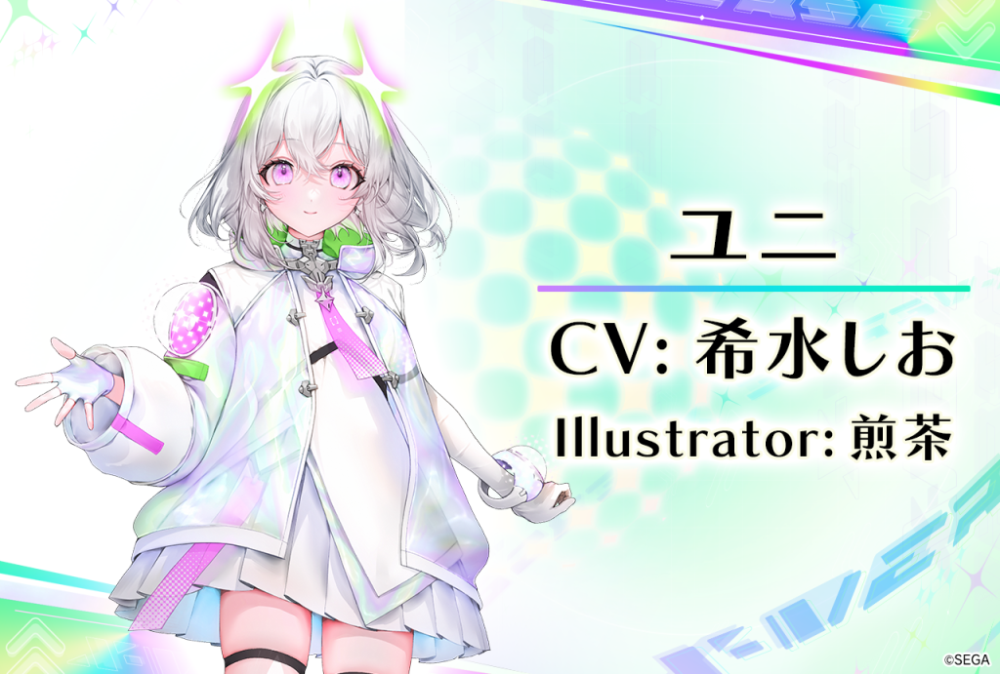

|
 
|   |    |
| ----------- | ----------- | ----------- |
|
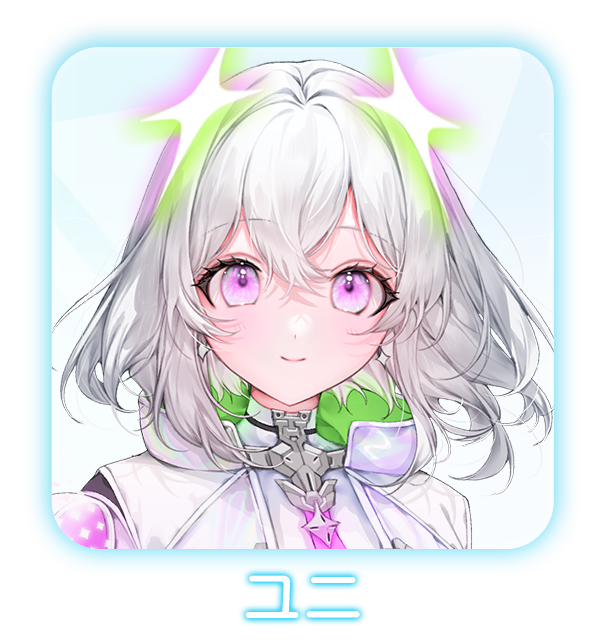
|尤尼|UHUNITHM的向导AI，性格乐观，开朗。
|
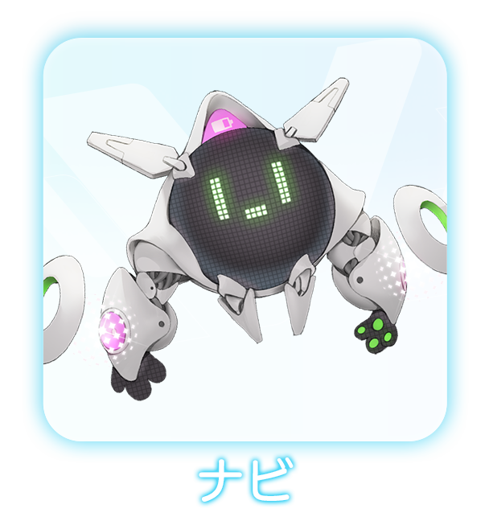
|NAVI|协助尤尼处理部分事务工作的助手。拥有自主运行的能力，能与尤尼互相交换数据。

## 关系图与用语说明

| 用语   | 说明 |
| ----------- | ----------- |
VERSE|代表无穷无尽的不同“<ruby>次元<rp>（</rp><rt>VERSE</rt><rp>）</rp></ruby>”。每个<ruby>次元<rp>（</rp><rt>VERSE</rt><rp>）</rp></ruby>都是独立的存在，尤尼原本所在的次元，玩家所在的次元，也是其中的一部分。
UHUNITHM|存在于尤尼的<ruby>次元<rp>（</rp><rt>VERSE</rt><rp>）</rp></ruby>中的娱乐系统。能够连接各个不同的<ruby>次元<rp>（</rp><rt>VERSE</rt><rp>）</rp></ruby>，提取其中的故事与情感从而生出乐曲。 虽然也称之为CHUNITHM，但是与玩家所熟知的CHUNITHM实在是差距过大，所以才如此称呼以作区分。
オルタリズム(旋律异化)|代指因为BUG的缘故产生了变化的乐曲，也可以指这种现象。 尤尼在与玩家所在的<ruby>次元<rp>（</rp><rt>VERSE</rt><rp>）</rp></ruby>连接的时候产生了BUG，也让游戏中的乐曲发生了这样的现象。
大门/Linked GATE|用于连接不同的<ruby>次元<rp>（</rp><rt>VERSE</rt><rp>）</rp></ruby>的大门。 如果是稳定状态的大门的话，尤尼可以从中提取出传送的能量。 由于尤尼在与玩家的<ruby>次元<rp>（</rp><rt>VERSE</rt><rp>）</rp></ruby>连接的时候出现了系统错误，全部的门都被破坏了。
修复大门|修复连接不稳定的大门的工作。 当玩家游玩对应的游戏时，NAVI与尤尼便会在后方对乐曲进行分析，最终获得代码。 只要玩家能够完成整首乐曲，便可以获得代码，修复大门。 当大门全部都被修复，能量也恢复供应，尤尼就可以回到原本的世界了。
代码|用于修复“大门”所需要的，类似密码一样的东西。 通过尤尼与NAVI的分析便可获得。
升级补丁|通过解析旋律异化现象获得的代码从而生成的产物。只有安装升级补丁，才可探索更多的“大门”。

## 剧情内容

### Linked GATE ORIGIN

| 头像  | 文字 |
| ----------- | ----------- |
|

|初次见面！我是尤尼！ 是这个版本的CHUNITHM的向导AI哦！ 玩家，请多指教！|
|

|各位玩家也应该知道， CHUNITHM是连接各种各样的<ruby>次元<rp>（</rp><rt>VERSE</rt><rp>）</rp></ruby>，从那之中发生的各种各样的故事和能量中制造出音乐，传递给大家的系统哦？ 咦……？你说和你知道的CHUNITHM不太一样？
|

|怎么回事呢？ NAVI！拜托你搜索一下当前连接的坐标！
|

|哔哔哔……【似乎在调查着什么】
|

|咦！不会吧……这怎么可能 那个……这位玩家。可能有些事情必须和您说……
|

|现在，我的世界的CHUNITHM产生了严重的BUG， 无法与其他的<ruby>次元<rp>（</rp><rt>VERSE</rt><rp>）</rp></ruby>取得联系，不知道为何，只剩这里能联系的上了。 我也跟我的同伴失去了联系，现在怎么说来着……有点不妙？
|

|所以，拜托了！ 玩家先生/小姐！ 能不能助我一臂之力，帮忙修复连接其他<ruby>次元<rp>（</rp><rt>VERSE</rt><rp>）</rp></ruby>的大门呢？
|

|具体要怎么做，是吗？ 现在，大门应该就存在于某个地方，只是我们不知道怎样接触而已， 就先以找到大门并打开为目的吧！
|

|能够接触“大门”的话，只要与全国的玩家一同联机，即可开始修复（日服限定） 在修复中，每个人都会持有「Link GAUGE」，一旦全员归零，连接便会中断！ 只要有一个人坚持到了最后，大门就能成功修复了！作为奖励，玩家们将获得对应曲子！
|

|很快就找到了第一个大门的坐标 玩家先生/小姐，准备好了吗？

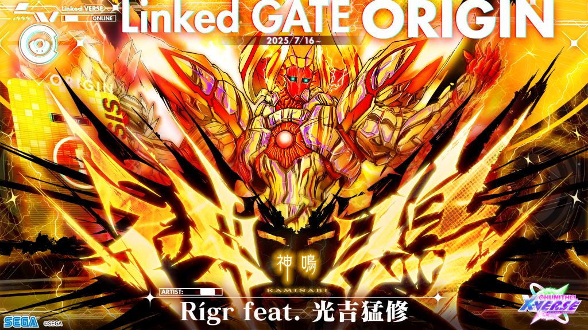

#### （过关后）

| 头像  | 文字 |
| ----------- | ----------- |
|

|玩家先生/小姐，太好了！这样第一个门就修复完毕了！ 突然蹦出不认识的曲子，吓了我一跳呢！  嗯？怎么了？NAVI？
|

|哔哔哔……【似乎在向尤尼传达着什么】
|

|也就是说，大门的修复需要那些被旋律异化的曲子的代码是吗？  只要像刚才那样玩家在攻略异化曲子的时候，我和NAVI进行研究的话，就能获得代码了是吧！  懂了，以后就这么干！ 好嘞！以后也要加油！
|

|说起来，在调查CHUNITHM的时候，这个<ruby>次元<rp>（</rp><rt>VERSE</rt><rp>）</rp></ruby>似乎还有很多的音乐游戏呢！ 我要不要也去看看这些游戏是什么样的呢…… 玩家也跟我说一说你喜欢什么样的音乐游戏吧！
|

|偷偷说一下，就算不是SEGA的游戏也没问题，诚实地回答我哦！
||  ゲキマイ     jubeat     グルーヴコースター     WACCA     PACA PACA PASSION     Arcaea     DEEMO     DJMAX     Phigros     Muse Dash ~太鼓の達人~
|

|哦哦，原来如此原来如此…… 嗯！谢谢你！咦？问我为什么突然要这么做吗？ 嘿嘿，保密！那回见咯！

### Linked GATE AIR

| 头像  | 文字 |
| ----------- | ----------- |
|

|在玩家先生/小姐努力的时候，我也在调查这边的CHUNITHM呢！ 原来这个世界的CHUNITHM是在名叫“游戏中心”的场所的呢！ 跟我们所在的世界的UHUNITHM完全不同，这就是文化冲击吗！
|

|咦？你说UHUNITHM是什么吗？对了，还没说呢！ 各位玩家所在的<ruby>次元<rp>（</rp><rt>VERSE</rt><rp>）</rp></ruby>和我们所在的<ruby>次元<rp>（</rp><rt>VERSE</rt><rp>）</rp></ruby>不都有CHUNITHM不是吗？要是弄混了怎么办！  所以呀，从今以后，我们世界的CHUNITHM就用UHUNITHM称呼吧！ 怎么样，还不错吧？？
|

|哔哔哔……【似乎在表达着不满之类的情绪】
|

|咦？不太行吗？可是名字也挺可爱，叫起来也朗朗上口嘛！ 玩家也是这么想得，对吧！ 从今以后就这么称呼了！  ……正说着呢，异化曲的反应已经这么接近了吗！

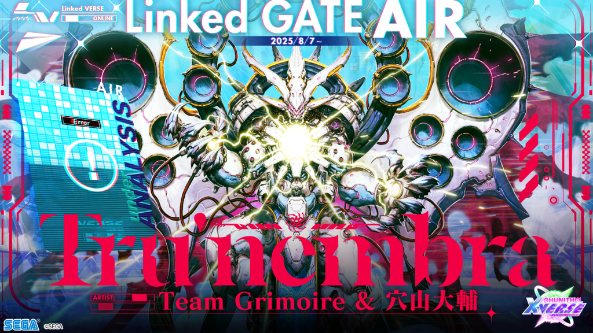

#### （过关后）

| 头像  | 文字 |
| ----------- | ----------- |
|

|大门修复完毕！好耶！ 这也是因为有我的协助才得以完成啊！ ……开玩笑的啦。 这都是玩家先生/小姐的努力哦！ 谢谢你！

### Linked GATE STAR

| 头像  | 文字 |
| ----------- | ----------- |
|

|哔哔哔……【正训斥着尤尼】
|

|…… 呜呜……我知道啦……我会和玩家好好说的啦！
|

|那个，你可别生气哦……？ 其实啊，玩家先生/小姐，其实UHUNITHM会变成这样，都是，我的缘故……
|

|说什么刚刚升级了新版本也是骗人的。 其实，因为一直未能连接新的<ruby>次元<rp>（</rp><rt>VERSE</rt><rp>）</rp></ruby>，所以已经很久没有生成新的曲子了。
|

|我一直就这么拖着拖着， 但是，我觉得已经够了 所以我想到了一件事！
|

|那就是分析最擅长CHUNITHM的<ruby>次元<rp>（</rp><rt>VERSE</rt><rp>）</rp></ruby>的数据。 对，就是这个<ruby>次元<rp>（</rp><rt>VERSE</rt><rp>）</rp></ruby>哦。
|

|所以，我就这么在NAVI的眼皮底下，偷偷地尝试跟这边进行连接…… 结果就是，UHUNITHM跟这个<ruby>次元<rp>（</rp><rt>VERSE</rt><rp>）</rp></ruby>缠在了一起。
|

|哔哔哔……【怒火中烧】
|

|呜呜，明明我的脑子里一直在想着要早点说的，结果就一直拖到现在 真的很抱歉！
|

|不过，我可以保证！我只是想做点什么打破目前的困境而已！ 所以……从今以后要是能够继续帮忙的话……我会很高兴的……
|

|欸嘿嘿……谢谢你！ 玩家大人就是心胸宽广啊！ 那么这次的“大门”也努力上吧！

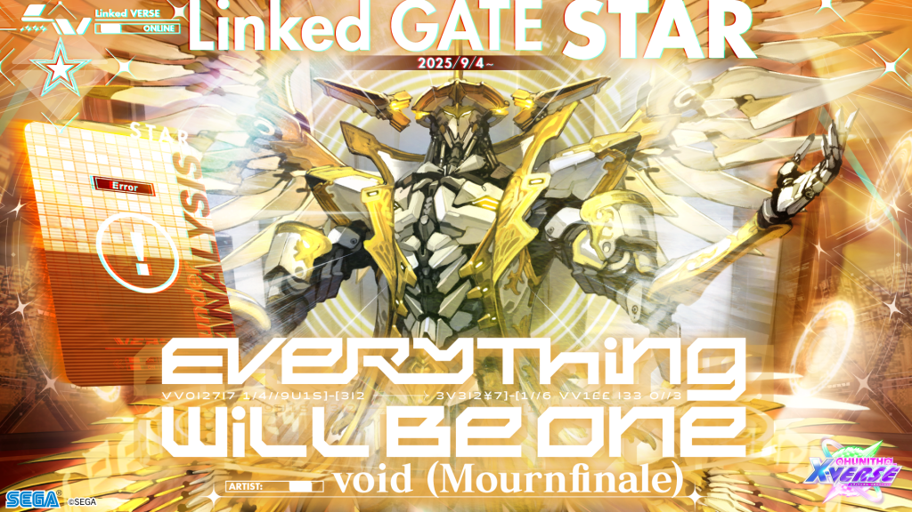

#### （过关后）

| 头像  | 文字 |
| ----------- | ----------- |
|

|Link Complete！ 这次的大门也修复完毕了呢！

### Linked GATE AMAZON

| 头像  | 文字 |
| ----------- | ----------- |
|

|哔哔哔……【似乎在向尤尼说些什么】
|

|啊，玩家先生/小姐！怎么办！ 这样下去的话是没办法修复UHUNITHM的！
|

|根据NAVI的说法，就算修复了现在已知的**6个门**，能量也是不够的，没办法传送回我们原本所在的<ruby>次元<rp>（</rp><rt>VERSE</rt><rp>）</rp></ruby>！ 所以，我们还必须去寻找更多的大门才行！
|

|然后呢，从那些异化曲中获得的代码，可以制成升级补丁。 只要将升级补丁装到我的身上，应该就能够找到第七扇甚至之后的门了…… 不过呢……我就老实说了。
|

|我！不！要！升！级！ 不！想！升！级！啊！
|

|虽然NAVI一直在说很安全 但是随便就装上来路不明的数据做成的升级补丁，想想就可怕吧？
|

|是吧……你也这么想对吧？ 我当然知道……现在没有其他办法了。 但是，能不能给我点时间想想呢？
|

|抱歉了……NAVI，还有玩家先生/小姐……

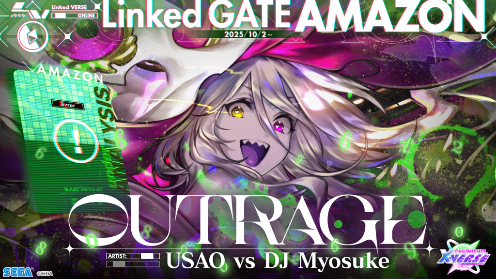

#### （过关后）

| 头像  | 文字 |
| ----------- | ----------- |
|

|玩家先生/小姐！修复完毕了哦！ 关于升级补丁的事情，我会考虑的。

### Linked GATE CRYSTAL

| 头像  | 文字 |
| ----------- | ----------- |
|

|呀嚯！ ……玩家先生/小姐，那个……
|

|其实在那之后我思考了很久，但我还是很讨厌升级啊……
|

|因为啊，引导AI是不会做那样危险的工作吧……不是吗？
|

|——不过，啊，我在这个<ruby>次元<rp>（</rp><rt>VERSE</rt><rp>）</rp></ruby>见到了无数游玩着CHUNITHM，为它欢笑，为它哭泣的人们。
|

|我那边的UHUNITHM，想必也有很多这样的玩家，在等待着这个游戏的归来吧。
|

|所以，既然这样的话，我就不能因为我的任性让这个游戏就这么荒废呢。
|

|呐，玩家先生/小姐，我会试着努力看看的…… 所以，如果能在背后帮忙推我一把的话，我会很高兴的。
|

|嗯……谢谢。

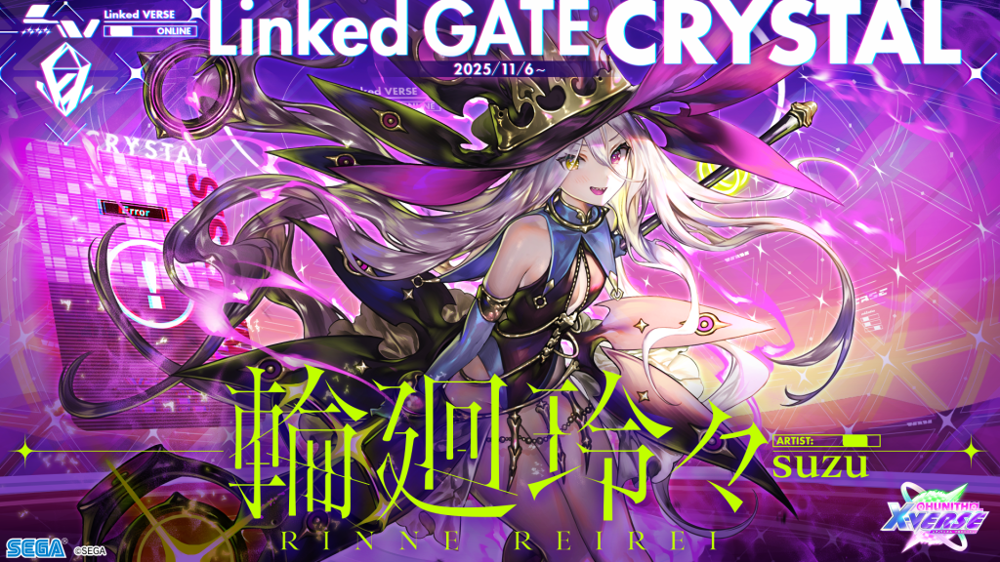

#### （过关后）

| 头像  | 文字 |
| ----------- | ----------- |
|

|这样第五个门也就修复完毕了……！ 下个门之后，也就是时候升级了。 玩家先生/小姐，不要大意，继续努力吧！

### Linked GATE PARADISE

| 头像  | 文字 |
| ----------- | ----------- |
|

|终于！来到第六个门了！ NAVI，升级工作就拜托你了！
|

|哔哔哔！
|

|玩家先生/小姐也是，状况如何？ 嗯，看起来很有自信嘛！ 那就拜托你了！
|

|你说我吗？ ……没事！我已经做好心理准备了。 那么各位，准备好了吗？ 我们上！

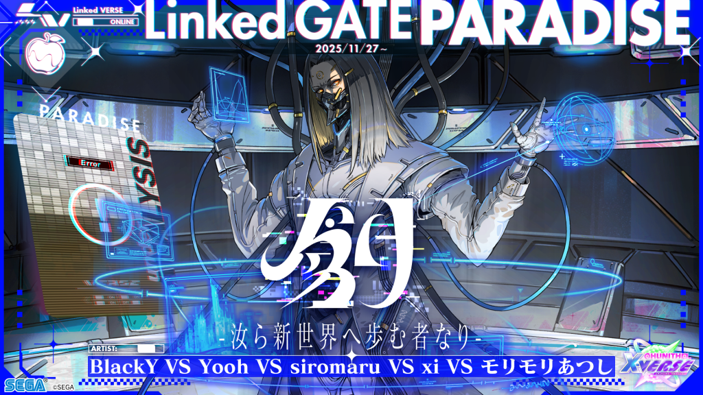

| 头像  | 文字 |
| ----------- | ----------- |
|

|好！这样升级补丁就完成了！那就赶紧准备……升级了哦！ ……
|

|呜呜……！那个……玩家大人…… 你能不能亲自按下安装按钮呢……！ 放心，不管发生什么我都不会记恨你的！可以吗！拜托了！
|

|谢谢！！好……！好嘞！ 随时都可以哦！！随时……！！  果然还是再等一下吧！！ 等等，NAVI你怎么突然启动了啊！
|

|哔哔哔……【开始安装升级补丁】
||
|

|自检完毕，无错误记录。 太好了！升级工作平安无事成功了哦！ 搞什么啊。害得我紧张了这么久，根本不算什么嘛！
|

|NAVI！我们赶紧开始测试搜索功能吧！
|

|哔哔哔……【开始进行搜索测试】
|

|——哇！好厉害！ 真的好厉害！一口气就找到了许多的<ruby>次元<rp>（</rp><rt>VERSE</rt><rp>）</rp></ruby>反应呢！ 这样就可以继续修复更多的“大门”了呢！  太好了！玩家大人！还有NAVI酱！
|

|太好……了……
|

|……。
||
|

|NAVI<type0716>？ ……还真是令人怀念的型号。……还有这个？
|

|是吗，原来是这样。
|

|……
|

|我不过是镜中映出的，一瞬间的镜像罢了。 “尤尼”很快就会醒过来。 ——有件事我要拜托你。
|

|她获得的这股力量，肯定会超出她的掌控范围的。所以……请你帮帮这孩子吧。
||
|

|……啊！咦？我怎么突然睡着了！？ NAVI也是，赶快起来啦！
|

|哔哔哔【正在启动中】
|

|啊……嘿嘿嘿……这应该就是升级之后的劳累……对吧…… 啊！没事的没事的！我们俩现在都精力十足呢！
|

|很快就要和未知的大门连接了呢……真想早点让大家听到全新的曲子呢。
|

|呐，你肯定有推荐的曲子对吧？ 多告诉我点吧！我可是很期待你的答案哦！

### Linked GATE NEW

由于未有官方整理总结，以下内容皆为wiki自主记录内容。

段落情况，演出内容可能与实际有所出入，请见谅。

| 头像  | 文字 |
| ----------- | ----------- |
|

|呀嚯！玩家先生！ 今天也在玩着CHUNITHM吗？
|

|呐呐，听说你那边的世界也迎来了一次大更新来着吧？
|

|果然吗？哼哼，我这边其实也不知为何状态很不错呢！！
|

|怎么样？有没有发现什么喜欢的新曲子？
|

|要是能有一场美妙的邂逅就好了呢！
|

|那么，玩家，准备好了吗？
|

|现在的我的话，不管是什么样的<ruby>次元<rp>（</rp><rt>VERSE</rt><rp>）</rp></ruby>都能够连接上的哦！！

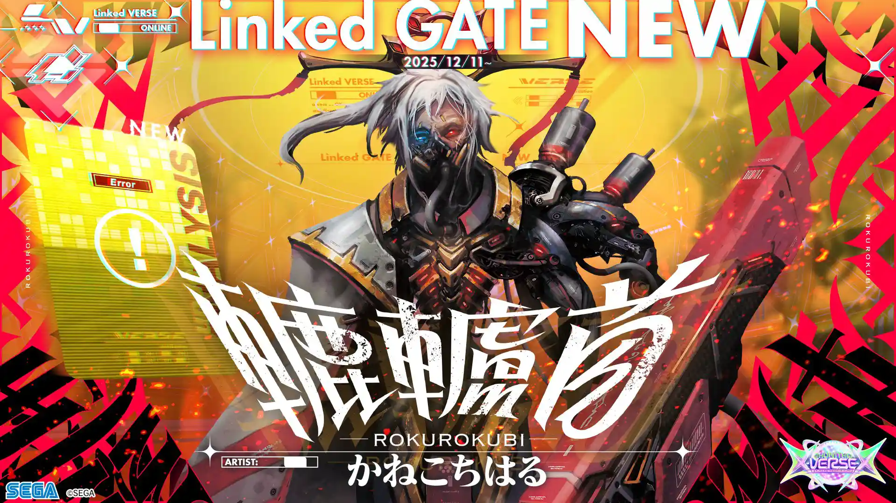

| 头像  | 文字 |
| ----------- | ----------- |
|

|连接成功！哇啊……！！ 真的跟全新的<ruby>次元<rp>（</rp><rt>VERSE</rt><rp>）</rp></ruby>连接起来了啊……！！
|

|哎嘿嘿！好开心！！
|

|好嘞，这下可要生成好多的歌曲才行啊！
|

|Navi酱，接下来可会很忙哦！
|

|啊，玩家先生/小姐也是哦？
|

|毕竟是要陪着一起解析的嘛。
|

|做好觉悟哦！

### Linked GATE SUN

| 头像  | 文字 |
| ----------- | ----------- |
|

|啊！玩家先生/小姐！ 已经生成了好多好多的新曲哦！
|

|不管是在假想的世界与现实世界之间发生的故事，还是被命运所捉弄，所摆布的女孩子们的故事，还是那些纯粹和普通的人们有所不同的存在所发生的故事……
|

|这些从不同的故事中生出的乐曲，竟然能够奏响如此丰富多彩的音色！
|

|当我还在原来的<ruby>次元<rp>（</rp><rt>VERSE</rt><rp>）</rp></ruby>的时候，还对这种东西没什么兴趣来着的。
|

|但是大家所散发出的不同的光芒，不管哪一样，都很棒哦！
|

|能让我注意到这一点，也是多亏了你！谢谢你，玩家先生/小姐！

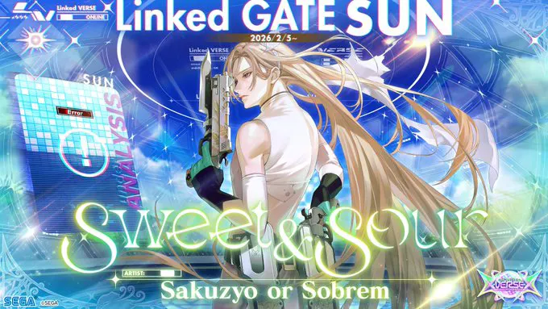

| 头像  | 文字 |
| ----------- | ----------- |
|

|……哈！
|

|辛苦了，玩家先生/小姐！！
|

|哎，我没事的，真的！没什么的！
|

|嘛，怎么说呢就是稍微有点累……来着。
|

|真是的——不要摆出这么担心的表情嘛！下次再一起努力干吧！呐！

### Linked GATE LUMINOUS

| 头像  | 文字 |
| ----------- | ----------- |
|

|啊，玩家先生/小姐，你来了啊！！ 好啦，Navi！
|

|……能看到我的文字信息吗？ 你好，玩家。看着尤尼的样子，我就觉得你之间的交流也是有必要的。
|

|这样就能跟各位说上话了呢！ 哼哼，我得赶紧去泡点茶款待一下——
|

|尤尼？你知道现在不是这种时候的对吧？就在我们还在这么做的期间，你……
|

|啊！异化曲子的反应已经很近了！ 玩家先生/小姐，还有Navi，赶紧做好准备！！
|

|喂！！尤尼！！啊啊，真是的……玩家，之后也请你多多照顾一下她哦。

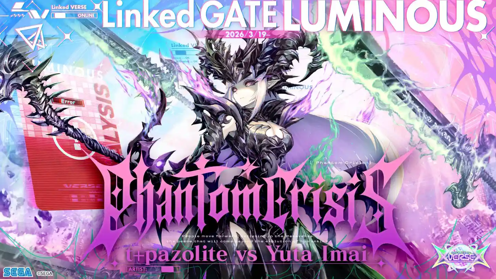

| 头像  | 文字 |
| ----------- | ----------- |
|

|那么，尤尼，有两件事我要跟你说。 其一，从新接触的<ruby>次元<rp>（</rp><rt>VERSE</rt><rp>）</rp></ruby>之中生成的乐曲的能量，终于成功打通了由UHUNITHM前往我们的<ruby>次元<rp>（</rp><rt>VERSE</rt><rp>）</rp></ruby>的通路。
|

|太好了！！那，那，那另一件事情是什么！？
|

|另一件事情——尤尼，每当你多走过一个<ruby>次元<rp>（</rp><rt>VERSE</rt><rp>）</rp></ruby>，你的存在就会被愈发地扩展，变得淡薄起来。再这样下去的话……甚至有可能会这么灰飞烟灭，不复存在。
|

|这是提出了安装更新补丁的我的责任，我在这里表示抱歉。 你也可以选择中止这次行动。 只要不继续扩大与其他的<ruby>次元<rp>（</rp><rt>VERSE</rt><rp>）</rp></ruby>的连接规模的话，就能够阻止这种症状继续蔓延。
|

|不，Navi酱。不如说，我还要谢谢你呢！ ……如果是现在的我的话，就能够将UHUNITHM变为原样对吧？ 那么，就没什么好迷惘的了！就让我做到最后吧！拜托了！
|

|……我知道了。
|

|没事的没事的！ 迄今为止不都是这么走过来的吗！ 好，要上了哦！

#### Continue in Linked GATE █████

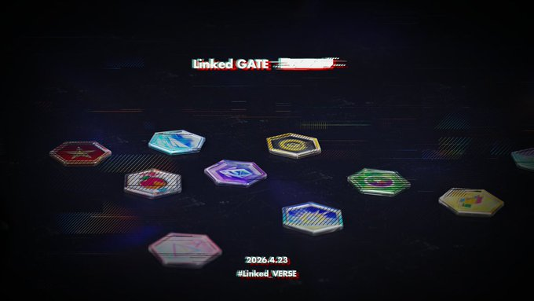

呐，你觉得从今往后十年，之后的CHUNITHM又会变成什么样呢？

咦？从来没想过这么遥远的事情吗？欸嘿嘿，是这样的呢。

我啊，是这么觉得的。一定，一定会，变成一个更——————加优秀的游戏的哦。

### Linked GATE VERSE

| 头像  | 文字 |
| ----------- | ----------- |
|

|……呼。
|

|没事吧？
|

|……只要连接上了这次的门，就能够获得回到UHUNITHM的能量了，对吧？
|

|当然。……只不过你的存在能不能撑到那个时候，就是个谜了……
|

|玩家先生/小姐。还有navi……万一我有个三长两短的话，UHUNITHM就拜托你了噢。
|

|……尤尼。
|

|不要露出这样的表情嘛！这次就是最后了啊。要是不在这里努力，那就对不起我领航员的身份了！所以，二位，我们上吧！

| 头像  | 文字 |
| ----------- | ----------- |
|

|解析完成。这样最后的门也就连上了哦！ ……等等？为什么能量怎么都不够啊！ Navi……难道说？
|

|……现在用来维持门的能量，正转移到你的身上用于维持存在。因为你在解析的途中，差点就要因为过负荷而消失了啊。
|

|可是这样的话，不就没办法再增加门，也没办法回去了嘛…… 明明好不容易……才跟大家联系上的……
|

|我有个建议 ——**创造出属于你们两人的乐曲**。
|

|属于我们的……乐曲？
|

|**将你们两人的体验作为基础生成乐曲就行。** 如果不是借助外来物的，来自于“你们自身”的故事所产生的乐曲的能量，这份力量，肯定会成为无可替代的存在。
|

|就算只是凭着周围的声音，凭着感觉创造也无所谓。 **一定有的吧？那些围绕在你们身边的音色。**

### Linked GATE X-VERSE

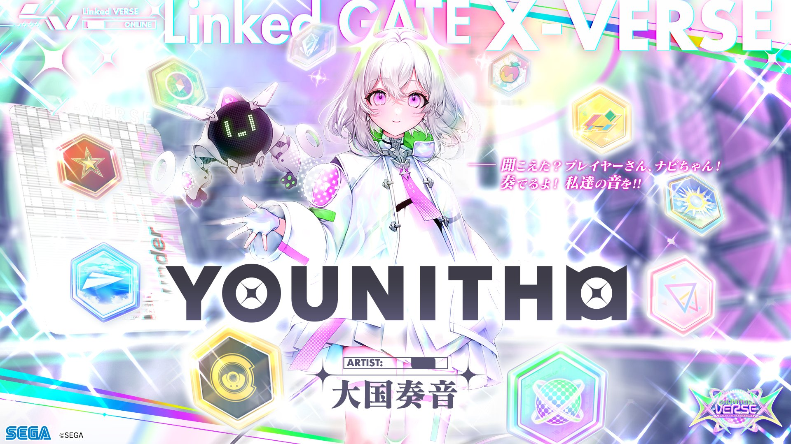

| 头像  | 文字 |
| ----------- | ----------- |
|

|成功了！玩家先生/小姐！大家真的……很努力了呢！
|

|虽然很抱歉打断你们正在感慨的气氛，但是你的存在还是不够稳定。 要是就这么直接传送的话，我就没办法保证能维持你的存在了。 
|

|……咦！那我们不就回不去了嘛！Navi这个大骗子！
|

|事情是要一件一件做的。接下来就从数值近似的<ruby>次元<rp>（</rp><rt>VERSE</rt><rp>）</rp></ruby>的结果进行收束吧。 尤尼，你还记得吗？你还记得曾经问过玩家而导致了分歧的那次行动吗？ 因为选择了不同的乐曲，玩家的存在被分化到了好几个相近的<ruby>次元<rp>（</rp><rt>VERSE</rt><rp>）</rp></ruby>之中。
|

|……啊——！我完全忘了啊啊！ 嗯！那，这是我给你的惊喜礼物——！ 玩家先生/小姐，你曾经说过喜欢这个音乐游戏的对吧？
|

|这样就能登录为“传导乐曲”了。 二位，接着就要从其他选择了其他游戏的玩家那里回收其他的曲子。
|

|……也就是说，大家各自都拥有着不同的曲子，靠着收集，让大家都获得全部的曲子对吧？ 我明白了，玩家先生/小姐！让我们把我们的传导乐曲送出去吧！

### 传导

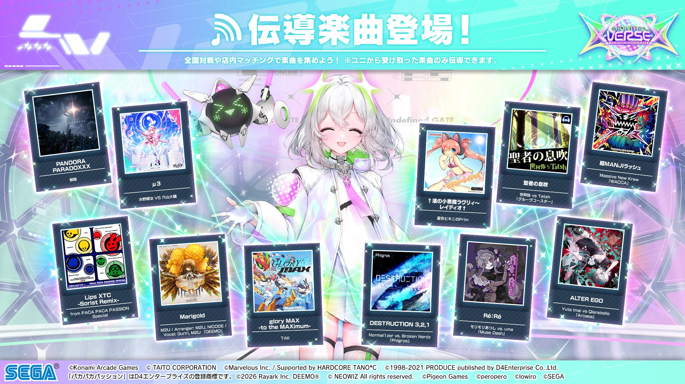

为了让尤尼的存在收束，我希望你们能回收那些成为巨大分歧起点的『11种传导乐曲』。
即使是选择了其他乐曲的可能的你们，也应该能通过Chunithm尝试回收的。
可以说，她的命运就掌握在你们手中。——拜托了。

（此模式中能够用于共享传导的，只有该玩家最开始从尤尼获得的联动歌曲。）