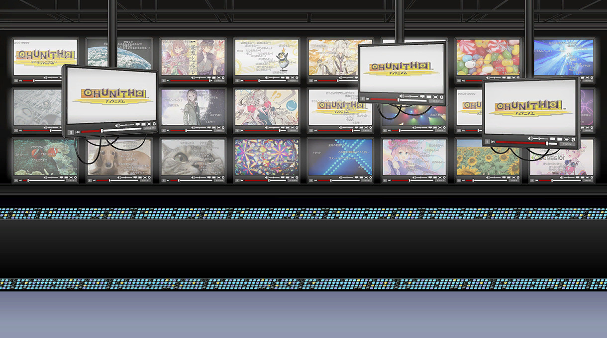

该世界观背景的人物所属的歌曲作者，以Niconico动画为主要创作平台的作曲者居多。
打歌画面的背景也是模仿了NICONICO动画。
除了一小部分人物两两相关或者两三人之间的故事有关联以外，大多数为独立的故事。

| 角色   |日文原名|对应乐曲 |初出版本|
| ----------- | ----------- | ---------- | ---------- |
| [奈伊](/relation/NAI.md) |ナイ | テリトリーバトル      | Chunithm Paradise|
|[穴户美铃](/relation/misuzu.md)|宍戸 美鈴| レーイレーイ|Chunithm Crystal|
|[御手洗千里](/relation/chisato.md)|御手洗　千里（みたらい　ちさと）|ロング・スロー・アライブ| Chunithm Crystal Plus
|[三田奈奈子](/relation/nanako.md)|三田 ナナコ|中学2年生のアンドロイド|Chunithm Amazon Plus
|[荒场流子](/relation/arako.md)|荒場流子(あらば　るこ)|Invitation|Chunithm
|[舞园星斗](/relation/seito.md)|舞園　星斗（まいぞの　せいと）|RevolutionGame|Chunithm Air| 
|[荒场流子/NEW GAME](/relation/arako2.md)|荒場流子(あらば　るこ)|人生攻略☆Tips|Chunithm NEW|
|[不来方永爱](/relation/toa.md)| 不来方とあ|蜘蛛の糸| Chunithm NEW
|[姬月露娜](/relation/luna.md)|姫月 るーな| 再生不能 | Chunithm Paradise Lost
|[文迪特·让·拉迪奥尔](/relation/vindet.md)|ヴィンデット・ジャン・ラディオール| Tattoo| Chunithm Paradise Lost
|[艾尔莎·冯·奥迪特](/relation/elsa.md)|エルザ・フォン・オーディット|パームカルマ| Chunithm Crystal Plus
|[尤古多拉希尔](/relation/yggdrasil.md)|ユグドラシル|Blazing Break|CHUNITHM NEW
|[黑须纮](/relation/kurosu.md)|黑须 纮（くろす　ひろ）  |パズルリボン|CHUNITHM NEW PLUS
|[水户 雫](/relation/shizuku.md)|水户 雫|レイニーカラー・ウォーターカラー |CHUNITHM PARADISE LOST
|[丽丽爱丽丝·秋水仙](/relation/colchicum.md)|リリアリス･コルチカム|玩具狂奏曲 -終焉- アナタニナルノ|Chunithm Air
|[HAR-女主角-09型“涅瑞达”](/relation/har09.md)|HAR-ヒロイン09【ネレイダム】|Rendezvous 愛のシンギュラリティ|Chunithm Star
|[九十九宗治郎](/relation/soujiro.md)|九十九　宗治郎（つくも　そうじろう）|夢路拍子|CHUNITHM NEW(仅国行版本被删除)
|[黑龟北斗](/relation/hokuto.md)|黒亀　北斗|BOKUTO|Chunithm Air