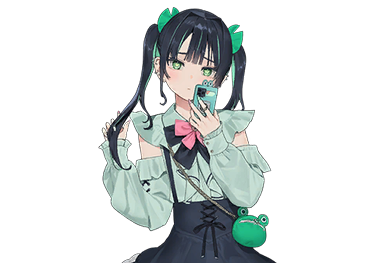
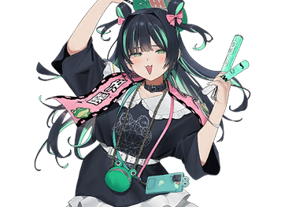

# 蛇狩亚子

| 角色信息   |  |
| ----------- | ----------- |
名称|蛇狩亚子
年龄|16岁
职业|高中生/深爱着莲君的深度偶像粉丝
| 对应曲   |メッちゅう殴打 |
| 对应版本 | Chunithm Verse

## Episode 1 亚子的王子大人

亚子这辈子，早就已经决定要跟随他了。

迄今为止，亚子的人生简直是暗淡无光，没有任何值得一提的东西。

不过，最近却感觉又不一样了。

那么到底是什么改变了亚子的看法呢？答案就是——

 

这里，是偶像团体“青蛙王子”的演唱会会场。

今天，亚子也来到了昏暗的演唱会场，站在距离舞台最近的位置。

随着欢呼声愈发响亮，舞台上也浮现出了绿光。

就快到了，就快到了。很快就要到“他”登场了。

明明还没有开始，亚子却已经心潮澎湃。

感觉就像是来到了仙境一般，身体也变得无比轻盈。  

突然，传遍会场的音乐一瞬间静了下来。   

没错，他要来了，他要来了！！

 

“Three,Two,One!”

 

亚子最喜欢的那个声音随着倒计时出现了。   

那个声音如此的美妙，真想随时用耳机循环播放个一整天啊！

 

“It's Show time!”

 

随着电子屏幕上的烟花图案炸开来，那个人以及他的同伴们登上了舞台。 

以红色的挑染作为卖点的，张扬系帅哥椿君。

以近乎漆黑的深蓝发色为卖点的，高冷系帅哥藤君。

还有亚子的本命——顶着一头如青青草原一般的绿发的莲君！

呜～不管哪个人看起来都是那么养眼啊！

——梦幻般的时间真的是转瞬即逝。  

但是已经见到了憧憬的偶像，亚子感觉已经有如醍醐灌顶般，深感满足。  

啊啊，我真的能获得如此的幸福吗？不行吗？那当然行！

在那之后还有特典会。虽然这次的预算只能让我说上两分钟的话，但今天也要全力将心中的那股悸动传达出去！！

说起来，明明已经开始特典会了，但是怎么总感觉一直都人满为患的莲君的队列……是不是人太少了？

这不就能多来几次了嘛！我不禁感到了些许后悔。不过偶尔也会有这样的日子呢……

很快，就轮到了亚子。

嘿嘿嘿……虽然每次都会露出这种猪哥般的笑容，不过反正都习惯了，也罢！

 

“呀，亚子公主，今天也谢谢你来我们的演出。”

 

啊呀，莲君今天的笑容依旧这么完美……？

 

“怎么了吗？”

 

仔细一想，今天总觉得听到的声音像是回声一样。

 

“喂——？”

 

不好不好。明明激推的偶像就近在眼前！

如此宝贵的两分钟刚刚就这么浪费掉了十几秒。  

赶紧抬起头，将莲君那美丽的脸庞映入眼帘——嗯？

 

“<ruby>呱<rp>（</rp><rt>GERO</rt><rp>）</rp></ruby>”

 

——<ruby>呕吐物<rp>（</rp><rt>GERO</rt><rp>）</rp></ruby>？为什么我要被这么骂啊？

我顿时感到天旋地转。

然而眼前映入眼帘的景象却更加冲击了我的认知——

 

“莲，君……？？”

 

出现在我眼前的，不是莲君。

那东西张着一双人类绝对不可能有的，凸起的大眼睛。

还有一张人类绝不可能会有的，宽大的嘴巴。

还有黏糊糊的皮肤。对，那简直就是——

 

“<ruby>呱<rp>（</rp><rt>GERO</rt><rp>）</rp></ruby><ruby>呱<rp>（</rp><rt>GERO</rt><rp>）</rp></ruby>”

“噫！？”

 

我顿时寒毛倒竖。  

这到底是怎么回事啊！？

 

“不好意思，您没事吧？”

 

负责维持秩序的员工们围了上来。

啊，其他人的样子还是正常的，幸好幸好。

 

“没事的。我只是吓了一跳。因为总觉得莲君长得跟平时实在差距太大了……”

“是吗？我觉得倒是没什么变化啊。”

 

嗯？啊？什么？他们刚刚说了什么？是不是有些差错？

 

“那边的人就是莲君，对吧？”

“<ruby>呱<rp>（</rp><rt>GERO</rt><rp>）</rp></ruby>”

 

我举起手指向那里，努力不往那里看。看着我指的方向，员工们点了点头。

我再次下定决心，往莲君的方向望去。

因为要是不这么做的话，我的心估计就会摔个粉碎了——

 

“<ruby>呱<rp>（</rp><rt>GERO</rt><rp>）</rp></ruby><ruby>呱<rp>（</rp><rt>GERO</rt><rp>）</rp></ruby><ruby>呱<rp>（</rp><rt>GERO</rt><rp>）</rp></ruby><ruby>呱<rp>（</rp><rt>GERO</rt><rp>）</rp></ruby><ruby>呱<rp>（</rp><rt>GERO</rt><rp>）</rp></ruby>”

“果然不行啊啊啊啊啊啊啊啊啊！！！”

 

——不行，完全不行！

亚子果然没有资格当莲的推子啊！

由于悲伤过度，我已经哭了出来。啊啊，这就是人生吗？

“为 什 么 是 青 蛙 啊！！！！！”

 

与偶像见面

漫漫长列待到时

偶像变青蛙

 

——蛇狩亚子，在此有感。

## Episode 2 我推的青蛙君

蛇狩亚子，十六岁。

虽然亚子的人生十分充实，但是，最近的亚子，却陷入了苦恼之中。

那就是——心爱的偶像竟然变成了青蛙！

确实，这偶像团体的名字叫“青蛙王子”，所以变成了青蛙倒也不算什么欺诈……不不不不不，还是当我没说吧。

竟会有如此残酷的事情！ 

亚子倾尽一生追寻的那个他……亚子心心念念的莲君……就这么变成了只会“呱呱”叫的怪物……

 

“……不行，越冷静下来就越坐不住啊！”

 

亚子现在已经心烦意乱了，如果用漫画来表现的话就是头上满是青筋和喷气的符号吧。

顺便一提，刚才的那种形容只是在网上看过，亚子其实不太懂具体的意思。就是凭感觉这么说而已。

 

“不好，亚子的情绪很不对劲……”

 

我拿起相册哗啦哗啦地翻了起来。

装在里面的，都是亚子与莲君之间充满爱的回忆。

最初，亚子还很害羞，努力不露出自己的正脸。

但是，温柔的莲君却接受了亚子……随着我们日渐相处，我们之间的距离也在越走越近。

看看最近拍的这张相片，莲君甚至隔着塑料膜亲吻了亚子的脸颊。

能做到这种地步的，也就只有地下偶像了啊。

……啊，不对。

这照片不就是上周拍的吗？

本来，照片上出现的，应该是莲君那俊俏的脸庞，应该是莲君的样子才对的——

 

“为什么全部都变成了青蛙啊啊啊啊啊啊啊啊！！！！”

 

完蛋了。

不，等等。这是不是也太扯淡了？

真的不是我出现了幻觉吗？

 

“嗯？”

突然，手机传来了新消息的通知。

原来是Fliptop更新内容了。

Fliptop是一款能够通过短视频随时见到可爱又帅气的莲君的APP。

本来，这个APP应该是我心灵的绿洲，是每日都能观赏到莲君的必备之物……

 

“啊啊啊啊啊啊啊啊啊……”

 

发出意义不明的低吟，我小心地打开了APP。我的帐号只关注了莲君，所以根本不需要去翻找内容。

但是在这之前，我却因为某件事，紧紧的眯着眼睛。

 

“呜呜……”

 

昨天的场景历历在目。太可怕了，但愿这只是一场噩梦啊……

只有这个地方，拜托了……！

我在心中默念着，睁开了眼睛。

 

“<ruby>呱<rp>（</rp><rt>GERO</rt><rp>）</rp></ruby>”

“嘎哈！？”

 

传入耳中的是什么？

是青蛙的呱呱声！

 

“等等，这短视频应该是对全网公开的才对吧……？”

 

不可置信的画面在我眼前出现。

在屏幕中向着我演唱着的莲君，怎么看都是青蛙的模样。

对，怎么看都是青蛙。

已经什么都无所谓了……

 

“咦……怎么回事？”

 

然而这时我却注意到了一件事。

怎么评论区的样子……比想象中的还要平静？

 

评论都是些什么“今天很可爱”“真帅啊”之类的东西。

难道说——

 

“只有在我的眼中，莲君才会变成青蛙吗——————！？”

为什么会变成这样啊啊啊啊啊啊啊！！

## Episode 3 反正只要往极端了去幻想总能解决的

蛇狩亚子，人生中第一次去了医院的精神科。 

检查的结果是——正常到不能再正常。

 

“什——么——嘛——！真是的————！！”

 

已经没救了。虽然医生开了药，不管吃不吃，现在的莲君在亚子的眼里仍旧是只青蛙。

明明亚子为了一直能这样活着，必须要有莲君的支持才行————！

仿佛听到了内心血管“啪”地一声断裂的声音。

感觉像是小说里才会出现的描写啊。

 

“好吧，没办法了……真的没办法了。”

 

深呼吸。深呼吸。深呼吸。

每呼吸一次，就给心灵加上一层滤镜。

加到比普通的自拍修图还要夸张，超级超级离谱的那种。

一定……不，绝对没问题。

 

“循环播放——！！”

 

我打开的，是某次特典会里的，“轻声呼唤名字”的视频。

如果是这个的话，肯定能听到莲酱温柔呼唤亚子的声音。

怎么可能只有亚子听不到莲君的声音呢？

因为，亚子可是对莲君死心塌地的TOP级铁粉（TO）啊！！

 

『GERO』

莲君……

『GeRO』

莲君！

『gero』

莲君！！

『亚子……gero……』

听到了……吗？

『亚子……chro』

听到了！

『亚子酱！』

听到了！！

 

“莲君……莲君……”

 

久违地听到莲君的声音，眼中的泪水夺眶而出。

仿佛亚子内心空洞的缺口被一点点填满。

感觉……好温暖……

 

『aGERO……GERO……』

 

渐渐地，声音又变回了青蛙的叫声。

但是，亚子已经明白了。

莲君……绝对，就是莲君。

虽然不知道为什么会变成这样。

这一定是——作为TOP中的TOP的亚子所承受的诅咒……不，是试炼！

既然如此，亚子一定会跨越它！

无论变成什么样子，莲君就是莲君。

因为他是亚子最最喜欢的莲君啊！

 

“莲君……亚子和你约好了。”

泪眼朦胧中，眼前依然是青蛙的身影。

但这一次，亚子不会再逃避，不会再害怕！

 

“亚子一定会……把莲君夺回来！”

 

一鼓作气，抢到了周末活动的门票。

为什么偏偏在穷到吃土的时候，没有免费观看区啊？！

## Episode 4 现实青蛙王子改造计划

虽然亚子的世界是以莲君为中心转动的，但这个世界说到底还是不以某个人为中心而转动呢。

平时的工作日就全身心投入学校和打工生活，然后将这些记忆一并删除。  

除了和莲君在一起的日子以外，其他时间根本不需要。  

听说人类会先遗忘不需要的记忆，亚子觉得这真是个无比合理的机制啊。

啊，“合理”这个词我用对了吗？  

算了，怎样都好啦。  

总之今天是周六——和莲君见面的日子！  

一如既往的完美打扮，毕竟要让推的偶像看到最可爱的我嘛。  

 

“等着我哦，莲君”

 

人群自动为我分开。  

周围的粉丝们都知道我的存在。

都在为我让开，让我前往最前排的位置！

  
……好吧其实只是今天买了高价的优先票而已啦。  

片刻过后，演出照常开始。  

即便亚子全神贯注，也只能看到青蛙样子的莲君和呱呱叫的声音。

不过放心吧莲君☆这段记忆我不会保留的。  

 

“现在开始周边特典会的整队——”

 

工作人员的声音让会场骚动起来。  

在比往常更松散的队列中，亚子的耳朵敏锐地听到了这样的对话。

 

“好奇怪……总感觉今天特别累……台上好象是青蛙在唱歌一样……”  

“我也是……总觉得老是听到呱呱声，根本没法集中……”

 

咦？这种症状，竟然会传染……吗？

原来不只是亚子一个人……不止亚子一个人在受苦啊……！

大家也都因为自己喜欢的偶像痛苦…因为推的偶像变成了青蛙！  

 

“那个…”

 

既然如此，就必须收集情报了。

正为自己喜欢的偶像变成青蛙而困扰的，是一名看起来像上班族的女性和一个看来跟我差不多岁数的少女。

亚子向两人搭话。

 

“请问……你们推的偶像，是不是看起来也像是青蛙吗？”  

 

亚子开门见山的质问，让两人面面相觑。

 

“你，你也是这样吗？果然是这么回事啊……毕竟这个偶像组合叫‘青蛙王子’，我们还以为是什么整活的企划来着……但这次感觉不太一样。”

 

就是这样！别人也有跟亚子一样的症状！这一切都不是亚子的妄想啊！

 

“对吧对吧！另外，那边的三人，在你们的眼里是怎么样的？”

 

虽然对莲君有点抱歉，但第一次找到同伴，还是让亚子无比兴奋。

 

“藤君在我的眼里看起来就像只紫色的青蛙…”
  
“我觉得怪怪的是椿君，在我眼里，似乎是只红色的青蛙…”

 

她们的表情好崩溃……亚子当初也是这样吗？  

等等……稍等一下？  

 

“在亚子的眼里，莲君却是只绿色的青蛙啊？” 
 
“诶？那岂不是——”

 

真是命运使然，我们三人推的偶像竟然互不重合！

也可能是这个缘故，我们之间的距离愈发靠近。

我从她们那里听到了些相关的东西。

那就是最近流传于粉丝之间的某样传言……

“现实青蛙王子改造计划”

## Episode 5 推的偶像互不重合，岂不美哉？

两年准备，一年出道。

这就是“青蛙王子”三年来的活动轨迹。

而亚子正式成为他们的粉丝的时刻，还得从初三的备考时期说起。

也就是距离现在一年半之前的事情。

当时的亚子，对未来毫无期望，甚至还想过干脆就这样人间蒸发就好了。

直到我在Adaricamera的演出区看到某场免费演出为止。

那场演出，正是“青蛙王子”的义演。

也是亚子与莲君初次见面的时候。

那个时候听到的声音，现在仍然存在于亚子的脑海中。

 

<ruby>いつだって夢だって君の隣で歌を届け続けるよ<rp>（</rp><rt>不论是梦还是现实 都会在你的身边持续歌唱着</rt><rp>）</rp></ruby>

 

虽然这首歌并不是为我而唱的，但我还是被这歌声救赎了。

就像空空如也的箱子被闪闪发光的宝物填满一样，我的世界顿时有了光明。

之后就在一时冲动之下买了附赠特典券的CD，并且拍下了人生中第一张双人合照。

那张最初的纪念照上，是全身僵硬的我，和一脸困扰苦笑的莲君。

就是从那时起，亚子便决定要追随莲君一辈子了。

不管是过去的录像，还是周边，还是二手市场的东西都不放过，即便花光压岁钱砸锅卖铁也要买下来。不论大大小小的活动，就算是免费的义演，我也尽可能不缺席。

这一切的一切，都是为了见到莲君。  

虽说当个顶级死忠粉也没什么不好的。

但是更重要的终究是他。

手中的旧录像并没有多少，五部里有两部都是周年纪念活动的录像。

而这个周年活动，每次结尾都是同样的桥段——  

被召唤到城堡的公主，必须在钟声敲响三下前回去才行。

但这钟声同时也是「再会」的暗号。  

每次纪念演唱会尾声，都会敲响那口大钟。

为了从今以后能够迎来纪念的日子，那口大钟总会挂在城堡之上，敲出那洪亮的声音。

那正是偶像们与粉丝之间结下的约定☆  

说起来，这个组合的粉丝们一直有个疑问。

 

「这个组合为什么是青蛙主题呢？」  

 

其实，官方是有正式的解答的。

记得是在出道演唱会的谈话环节，有人开门见山地问了这个问题——

**『为什么是“青蛙王子”呢？』**  

面对这个问题，成员们是这样回答的：  

**『因为当下才是最棒的时候！所以，我们一年四季都要为你们而歌唱！』**  

——椿君活力十足地喊道。  

**『我们在等待能解开诅咒的公主出现』**  

挂着完美笑容的莲君，最后如此说道。赶紧拍下来，永久珍藏吧♪

……啊不是，重点不是这个。  

 

我们在家庭餐厅聊着这些往事。  

今天的特典会也就只是拍了张合照就草草了事。

今天主要的任务是交换情报，所以即便很不舍，我们也只能早早离场。

原本担心我们之间是“同担”会不会有什么冲突，所以迄今为止，我一直都不和其它的“公主”（啊，说的就是我们“青蛙王子”的粉丝称呼而已啦！）产生交集，但没想到互相交流之后，聊得超开心的。

（注：“同担”来自日语“同担（どうたん）”，即“共同担当”的缩写，一般代表喜欢同一个偶像、角色、作品或CP（配对）的粉丝。该词为小众亚文化用语，一般用于偶像圈、二次元文化或者同人圈等。）

该说是托青蛙的福吗……  

虽然现在完全不想感谢青蛙就是了。  

正当我们聊得热火朝天时，窗玻璃突然「咚」地一震。  

 

**「诶？」**  

 

贴在玻璃上的——不是莲君的脸，  

就只是只普通的青蛙。  

 

**「啊哈哈，吓死我了——」**  

 

突然闪过一个念头：  

如果莲君真的变成现在这只青蛙，是不是就能带他去任何地方了呢。  

## Episode 6 消灭真爱粉的诅咒！？

啊，说起来忘了说正事儿了。

对，就是那个——现实青蛙王子改造计划。

听说原本是成员们早年发展时期搞得整活企划——**“扮演等身大的青蛙王子”**。  

但不知何时，竟演变成了实为戴着面具进行的变装演出的传言了。 

据说，戴着青蛙头套的三人，会在深夜的街头突然开唱…  

 

**"不过绝对和现在的事无关吧！"**  

冷静想想，这根本不是一个层级的问题。  

毕竟演出时根本没必要戴头套，更不可能让所有粉丝都产生青蛙幻觉。  

比起这个，更值得在意的线索其实是——  
 

**”难道…所有中招的人都是‘真爱粉’？“**  

 

这是上次女生聚会得出的结论。 

哈？你说亚子也是真爱粉？  

嘿嘿～才没有啦♪  

但据说越是真爱，越会看不见偶像真容…… 

等等，那岂不是说…  

 

**“这个诅咒，难道只针对真爱粉吗！？”**

 

开什么玩笑！难道越是喜欢温柔的莲君，就越只能看到青蛙？！  

 

"不不不…怎么可能…但好像又有点道理？"

 

毕竟「看见青蛙」本身就是一件不科学的事情了。

能自圆其说的解释反而令人安心。  

亚子越想，就越觉得这就是正确答案。

 

“喂喂，这该不会就是答案吧？”

 

糟糕，绝对没错！  

我立刻把推理发到了之前和那两个粉丝建的群聊——  

 

『不是吧！这……这还真有可能啊！』  

『还有这种事情……』  

 

看吧，果然是这个反应。  

要破除诅咒，恐怕得先改变我们自己。  

 

『不过啊，就算是这样，要对着青蛙继续支持什么的也实在是太难了吧』  

『能做到的绝对是真爱了』  

 

明明之前还热火朝天地安利偶像，亚子此刻却遭遇了现实残酷的打击。

什么叫"真爱"？难道说当真爱粉就是有错的吗？  

因为莲君就是莲君啊……这股隐藏于胸中的心意明明是——  

 

“……！”

 

心脏突然一阵绞痛。  

好痛……好沉重……好难受…… 

 

“怎么能……在这里认输啊啊啊啊啊！！”

 

我死死攥紧手机，把疼痛压了下去。 

亚子的这份爱，绝对不是假的！ 

管他是人是蛙，莲君就是莲君，是我想永远站在他身边的那个莲君！  

怎么可能向这种恶作剧认输？  

死也不会认输的啊啊啊！！ 

——下个演唱会，我一定要确认这一切！  

亚子，颤抖着手，点击了活动的报名键。

忽然觉得，这样的自己好像有点帅气。  

## Episode 7 不只是外表，连灵魂都喜欢

就这样，来到了例行演唱会当天。

今天是六月最后一场特典会。

作为“六月新娘”主题的特别活动，只要购买10张CD，就能和偶像拍摄一张“唇吻”的合照。

 

“亚子……是不会逃的。”

 

怀着如同迎战暴风般的决心，我来到会场门前。  

风在呼啸，仿佛风暴将至。  

 

“让你久等了...莲君。”

 

这是亚子时隔两周之后再次与莲君相见。

顺便一提，上次那两个女生——  

在我指出“青蛙的幻觉只出现在真爱粉身上”的瞬间，她们突然就转冷了，转头变成了“箱推粉”。

而作为箱推粉的她们，现在看成员们都是正常的人类样貌。  

（注：“箱推粉”：指喜欢整个团体而非特定成员的粉丝）

 

“小亚子也赶紧放弃单推真爱粉变成箱推吧～当个箱推粉不是更轻松吗？”

 

听到这种话，我气得发抖。  

因为、因为——  

 

“这样……也太奇怪了啊！”

 

如果青蛙王子真的被诅咒了，那该有多寂寞，多悲伤啊。  

真心喜爱的人却无法看到他的阵容，那该有多么寂寞，多么痛苦啊。

 

“所以，亚子不会放弃继续当真爱粉的……绝对！”

 

重要的事情要说两遍！  

我戴着口罩小声嘀咕着，久违地从最后一排欣赏演出。  

这大概就是所谓的“后排女友视角”？  

 

『<ruby>君とずっと一緒に～♪<rp>（</rp><rt>想永远和你在一起～♪</rt><rp>）</rp></ruby>』

『<ruby>ＧＥＲＯＧＥＲＯ～<rp>（</rp><rt>呱呱呱呱～</rt><rp>）</rp></ruby>』 

『<ruby>届かなくても♪<rp>（</rp><rt>就算无法传达♪</rt><rp>）</rp></ruby>』  

 

听久了居然觉得青蛙叫声也挺和谐……

在这种违和中，亚子反而感受到一种奇妙的共鸣……不如说……

 

“！？”

 

这难道是亚子的胜利吗？

只要心意足够纯粹，无论推的偶像变成什么样子都没关系……对吧？

『～～♪』  

我的哼唱和莲君的歌声互相交织。在这个会场里，回荡着只有我和莲君才能创造的合奏。

换句话说——此刻的莲君，只属于我一个人。

总觉得，现在的亚子……或许真的很幸福？  

## Episode 8 从今以后，我也是你的公主

<ruby>『ＧＥＲＯＧＥＲＯ』<rp>（</rp><rt>『呱呱呱——』 </rt><rp>）</rp></ruby>

大概，现在的他正在说“你好呀，亚子公主”。

<ruby>『ＧＥＲＯＧＥＲＯＧＥＲＯＧＥＲＯＧＵＷＡＧＵＷＡＧＵＷＡ』<rp>（</rp><rt>『呱呱呱呱咕哇咕哇——』</rt><rp>）</rp></ruby>

看起来有些害羞的样子……大概吧。

莲君肯定是在说：“拍亲吻照什么的太让人难为情了。”，对吧。大概吧，虽然只是我的感觉。

<ruby>『ＧＥＲＯＧＥＲＯＧＥＲＯＧＥＲＯＧＵＷＡＧＵＷＡＧＵＷＡ』<rp>（</rp><rt>『呱呱呱呱咕哇咕哇——』</rt><rp>）</rp></ruby>

等等，这不是一样吗？

等等，表情似乎不一样……不如说，感觉降了一个八度。

这说不定是……“说不定亚子就是能解开诅咒的公主呢”。

 

“哼哼哼……”

 

突然，亚子想起来一件事，直到刚才为止，说话的节奏，都像是“听——得——见——哦——”之后的东西。

肯定是这样的。亚子心中的亚子如此低语道。

 

<ruby>『ＧＥＲＯ』<rp>（</rp><rt>『呱？』 </rt><rp>）</rp></ruby>

 

不好，肾上腺素爆棚让我笑出了声。  

既然听不懂蛙语，那就用妄想补全吧！

 

终于，决定性的时刻到来了。

隔着0.3毫米厚的塑料薄膜，莲君——不，是绿色青蛙的脸近在咫尺。  

那滑溜溜的质感确实像真青蛙……但不对！这就是莲君！是·莲·君·啊！  

接下来就是跟自己的战斗。

从此刻起，亚子将要做一个永不醒来的梦。  

这是我和诅咒的终极对决！  

 

**『呱——亚子……酱……』**  

看见了看见了！  

果然信仰就是力量，课本上好像也这么写过！  

 

“莲君……我来了哦……”

**『谢谢你来找我』**  

 

突然间，亚子觉得不论什么东西都如此可爱。

青蛙也好人类也罢都无所谓了。  

眼前的存在，就是我的挚爱。  

 

“嗯……”

 

脑内自动播放起偶像剧的插曲。 

虽然是幻听，但情绪却越来越高涨。  

这一定是对所爱之人思念过度的惩罚。  

是抵达真爱必经的试炼篇章。  

 

**『亚……子……』**  

看，那圆溜溜的眼睛正注视着我。  

亚子隔着塑料薄膜，献上了初吻。  

只留下柔软而冰凉的触感。

 

“呕呕呕呕呕——！”

初吻的味道，是聚氯乙烯混合着胃酸的味道。  

————————  

那天，亚子引发了骚动，被永久禁止入场。

赌上性命的追星事业，被迫画上了休止符。  

之后的记忆全部模糊不清。 

回过神来已过去了半年。  

失去生存目标的我，养成了每周去Adaricamera活动区徘徊的习惯。  

或许还能再度遇见那股初见莲君时的心动也说不定——亚子就这么期望着。

但奇迹没有发生。  

被偶像事业拒绝的蛇狩亚子，也就是平时的“我”，也不过是随处可见的女高中生而已。

那个为推赌上一切发光发热的“亚子”，已经一去不复返了。

 

“呐，那边那个可爱的女孩子？”

 

我被搭讪了。  

如今，我穿着板正的制服，戴着眼镜，一副优等生的模样。

就是那种看起来只要向她搭话，也只会用“嗯”或者“哦”回应，然后敷衍了事的人。

但我转过了身。

因为那个声音，我从未忘记。  

 

“是、是在说我……吗？”

“那当然。我们待会会在这边开一场迷你演唱会，同时卖些CD，有时间的话要来吗？”

 

面前的人流畅地塞给我一张传单。  

然而动作却没有一点强迫感，却是一种熟悉的温柔感觉。

我抬起头，看清了他的脸。  

 

“啊……”

 

骗人...的吧？  

 

“诅咒……解除了？”

 

面对我呆若木鸡漏出的话语，他就像是青蛙一般，咧开了嘴笑着说到。

 

“嗯，‘青蛙王子’解散了。现在我组成了新的组合，重新开始。所以……虽然有些厚脸皮，要不要再来支持我们呢……亚子酱？”

 

诶……就这么轻描淡写？  

不，现在青蛙王子什么的，怎样都无所谓。  

现在的我，已经不是当年的亚子了。  

 

“为什么……会认出我？”

“我怎么可能忘记呢。明明我们一起拍过那么多合照啊。难道在亚子眼里，我看上去很薄情？”

 

莲君露出了苦笑。  

即使改头换面，亚子依然被推认了出来。

现在的亚子，早已因为过量的幸福而让心脏几乎爆炸。 

必须立刻将这份心情传达出去啊！

 

“当当当...！”

“当...什么？”

“当然要去啊！因为人家……不对，亚子……！！”

最喜欢莲君了。  

当然是要站在最喜欢的人身边应援啊！  

