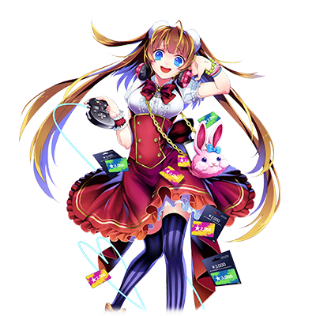
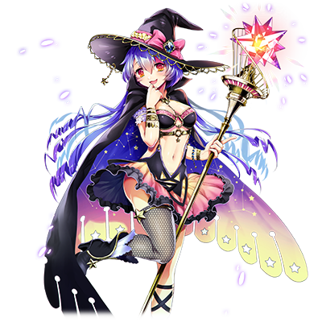

# 超级网络游戏玩家·阿尔特拉

| 角色信息   |          |
| ----------- | ----------- |
名称|超级网络游戏玩家·阿尔特拉
年龄|18岁
特技|哄骗那些废宅们
对应乐曲|男装女形表裏一体発狂小娘の詐称疑惑と苦悩と情熱。
初出|Chunithm Amazon
CV|高桥李依

>注：本故事中所有章节皆为恶搞MMO游戏的标题。具体恶搞的游戏名会在每章开头注明。  **获得语音的活动DUEL的标题「転生Lv.1:レッドプロトコル｣**：恶搞了万代南梦宫开发已久的MMORPG《蓝色协议》（ブループロトコル）  **ラグナファンタジーユニバース**：文中出现的虚构网络游戏，这里翻译为《仙境幻想宇宙传说》。名字结合了《仙境传说》《最终幻想11》以及《梦幻之星：宇宙》这三部游戏。  **“…能不能让我**看一看**呢……”  “真拿你没办法啊……可以哦。”**：本来是《仙境传说》里的游戏对话。当然在文章里，其中的意义是比较不好的那种。 **“哈？至少用敬语称呼啊！你这大头鬼！”**:捏他了电影《阿基拉》里面登场的台词「『さん』をつけろよ！　デコ助野郎！」  **“真够恶心。果然死宅就是恶心……真的是太下头了啊！”** **“我的寿命正被各种压力以超越音速的速度剥削着！再这样下去我的脑子会变得很奇怪然后死掉的！”** **“闭嘴，别妨碍老娘雅兴。只要一瞬间的疏忽可能就会要人命了。** **“喂！快住嘴啊！这个笨蛋！”**:以上发言的原文是来自于《最终幻想11》里面的网络俗语梗。原文为以下内容： 「汚いな。流石オタク汚い……」 「私の寿命がストレスでマッハ！　このままだと頭がおかしくなって死ぬ！」 「うるさい、気が散る。一瞬の油断が命取り」 「おい、やめろ！　馬鹿！」 是玩家群中对一个被称作“ブロントさん”的玩家所发言的内容进行总结和恶搞的语录集，这些语录的来源不只有那个当事人，也包括一些模仿那个玩家说话方式的人的促成。这些语录有一个共同特点，那就是**文字上看着语无伦次，但却不知为何能够看懂**。这些类似风格的句子也被叫做“ブロント語”。  **——网络游戏，即是人生：**捏他的是“CLANNAD即是人生”。原本是日本论坛上常用的名言句，全文是“Fate即是文学，AIR则是艺术，CLANNAD即是人生。”(「Fateは文学」から始まり、「AIRは芸術」「CLANNADは人生」) 警告：要是现实中真的到达这个地步那就无可救药了，还请各位读者多有节制。

## Episode 1 LV1：阿尔特拉英雄传

>大贤者·阿尔特拉。这是被称作超级网络游戏玩家的她所留下的传说。现在，就让我们追寻其诞生的轨迹吧。

注：标题恶搞的是マビノギ英雄伝，即《洛奇英雄传》。

超人气网络游戏博客作者·阿尔特拉。

她是大型MMORPG《仙境幻想宇宙传说》的玩家，在这个游戏中，她选择了全游戏之中只占了大概百分之几的魔法师，并且在这其中升级到了最高等级的职业——大贤者。而她所运营的《仙境幻想宇宙传说》的个人攻略网站，虽然言辞辛辣，但其质量却十分可靠，被人称作“比官方还官方”的网站，供世界各地的玩家所阅览。

今天，就让我们来追寻这位创下了诸多伟业，被称作超级网络游戏玩家的阿尔特拉的轨迹，追根溯源，一探究竟吧。

阿尔特拉第一次接触网络游戏的时间比想象的还要晚。那正是她大学一年级的暑假时候。

（啊——啊……本来以为上了大学就能成为现充了啊……）

内向，怕生，然而自尊心却极强的阿尔特拉，在大学的初次登场，就吃了个大亏。

平时都是被动跟人相处的她，甚至连跟自己同个专业的学生说话都做不到。更不用说鼓起勇气加入社团了。

明明十分憧憬那些现充的生活，却在心底的某个角落鄙视着她们的阿尔特拉，即便到了阳光四射的暑假时期，也并未选择前去那些时下流行的游乐场，只是一个人躲在角落度过着自己的暑假。

就在这时，她在一本偶然看到的杂志上见到了那个广告。

“……《仙境幻想宇宙传说》？……嗯……虽然我还从来没玩过网络游戏，不过应该可以试一试。”

大型MMORPG《仙境幻想宇宙传说》。

虽然在运营初期因为网络问题导致游玩体验不畅，但是经历更新和修补之后，已经不会再怎么出现错误代码15号或者是完全无法使用账号的石头人现象，可以正常游玩了。

不过，当时作为一个全新的MMORPG，内容还相对贫瘠，所以当时的玩家并没有那么多。

即便如此，阿尔特拉仍旧投身于其中，沉浸于仍旧年轻的《仙境幻想宇宙传说》之中。

“网游真是太有趣了！明明以前闲到不知道怎么消磨时间的我，现在却觉得时间再多都不够啊！……暑假很快就要结束了……不过，也罢。”

就这样，阿尔特拉开始了废寝忘食的《仙境幻想宇宙传说》之旅。

## Episode 2 LV2:<ruby>究极<rp>（</rp><rt>ULTIMA</rt><rp>）</rp></ruby> ONLINE

>踏入大学生活的阿尔特拉沉浸于网游中不可自拔，而她也在其中感受到了在男性群体中众星捧月的快乐。

注：标题恶搞了EA的网络游戏《网络创世纪》（Ultima Online）

就在那个想要入坑网络游戏还很艰难的时代，阿尔特拉并未在意，只是一心一意的追寻着游戏的内容更新，享受着游戏的乐趣。然而，她却突然注意到一件事。

（总觉得，跟我搭话的，好像都是些男的啊）

阿尔特拉在游戏中的形象是比较可爱的女魔法师。正因如此，大多数的时候总是被那些男性玩家（至少阿尔特拉这么认为）所亲切对待。

（常常从人那里拿到稀有道具和装备，明明没什么强度却总是被人优先恢复……）

还不止如此。在现实中大概只和快递的送货员，或者便利店的店员之类的人说过话的阿尔特拉，在游戏中，其他玩家却仿佛在竞争一样，争相向她搭话。

（只要稍微卖个萌，就能够让人挺身而出……竟然还有能够让这些男人随意听从我的命令的游戏，爽爆了！！现实中是绝对不可能有这种类似乙女游戏一样的展开的！！）

在日复一日的网络游戏生活之中，阿尔特拉品尝到了众星捧月的快乐。

就这样，她撒娇的能力，也开始日渐升级。

# 魔法使阿尔特拉

| 角色信息   |          |
| ----------- | ----------- |
名称|魔法使阿尔特拉
年龄|20岁

## Episode 3 LV3:现实之野望

>沉迷于网络游戏的阿尔特拉，在大学中失去了立足之地。就在这时，她决定了“退隐”。

注：恶搞了《信长之野望》系列。

阿尔特拉的努力以及周围男性玩家的支持之下，阿尔特拉在网络游戏中的等级也步步高升。

在她的心中，冒出了更加强烈的欲望。

（……我要变得更强！然后被更多的人所宠爱！！）

为了变得更强，阿尔特拉每天都要花掉大半的时间游玩游戏。最坏的情况，是甚至连饭都不吃，一头扎进游戏之中狠刷。

对她来说，个人生活和游戏生活之间的比重，已经发生了严重的逆转。

理所当然地，这也对她的个人生活渐渐产生了影响。

在大学中本就朋友稀少的阿尔特拉，现在更加不在大学校园中露面，其结果就是，她在大学之中失去了立足之地，仿佛一个幽灵一般。

大学食堂，在一堆三五成群一同吃饭，一同交谈着的大学生之中，阿尔特拉只是坐在角落，一个人对着便宜的牛肉盖饭大快朵颐。

然后，她终于意识到了这点。

（还很年轻，而且有些可爱的我……再这样下去的话，大学四年不要说交到男朋友了，甚至连朋友都找不到一个，这也太残酷了吧！我到底是为了什么才来这里享受校园生活的！？难道不就是为了那些灿烂无比的青春生活吗！？）

于是，阿尔特拉下定了决心。

就这样，在极为平常的一天，阿尔特拉一如既往地上了线，在一如既往的地方，召集了一如既往的成员们，发布了以下宣言。

“……从今天起，我，阿尔特拉，将从这款游戏中退隐！”

面对阿尔特拉突如其来的退隐宣言，周围的玩家们一片哗然，甚至有人试图说服她，然而她无视了这样的声音，毅然决然地登出了游戏。

“从此以后，属于我的灿烂的校园生活，就要开始了！”

## Episode 4 LV4:这里也是完美的世界

>为了夺回精彩的校园生活，阿尔特拉活用了在网游中所积累的经验，最终成为了宅男公主。

注：标题恶搞了《完美世界》

阿尔特拉，终于开始直面现实世界的生活了。为了挽回她的大学生活，她使出了浑身解数。

幸运的是，她已经与以前今非昔比。在网络游戏中众星捧月的体验，让她获得了谜一样的自信，于是，她把网游中跟男性玩家相处的方式，带到了现实之中。

然后，这一套路，好巧不巧的，刚好和阿尔特拉所属的“电影研究会”所主要占据的人群——也就是那些不太受欢迎的男生，不谋而合！

结果，阿尔特拉在电影研究会中，被人冠以了“影研的公主”这一称号。

（……现实中的男人原来也是这么单纯的吗！只要稍微说几句好话，稍微夸奖一下，他们就什么都会听我的了！）

然而，她爆棚的人气也仅限于男生之间。电影研究会的那些女性成员，对于将那些男性部员当成奴隶一样颐指气使，肆意妄为的阿尔特拉，只有无比的嫌恶。

但是，即便受尽女性成员的冷眼，阿尔特拉也只是得意地笑着。

（哼！反正肯定是在嫉妒我的人气对吧？要是不甘心的话，你们也这么做不就行了？）

虽然这些女生中也有一些人善意地劝说阿尔特拉不要像这样扰乱社团的日常行为，但是阿尔特拉并未理解她们话语中的深意，如此回答道。

“明明大家都是凭着自己的意志向我示好的，这有什么问题吗？不如说，要是我不回应大家的话，那不是既显得他们可怜，又显得自己不够诚恳？”

……就这样，阿尔特拉完全变成了所谓的“宅男公主”，某种意义上，确确实实地享受着校园生活。

## Episode 5 LV5:<ruby>诸神黄昏<rp>（</rp><rt>ラグナロク</rt><rp>）</rp></ruby>

>阿尔特拉交到了十分帅气的男朋友。但却被众人发觉，引发了冲突，结果，社团直接崩坏！而阿尔特拉也不得不离开了社团。

注：标题对应了《仙境传说》的原名，Ragnagok Online的日文ラグナロクオンライン。

……某日，十分稀奇地，诸位下仆都未能来到电影研究社，阿尔特拉不得不自己去取午餐。而这样的她，被一位男大学生叫住了。

“哦，你是电影研究社的女生是吧？之前就觉得你挺可爱的了。”

十分干练的着装，精心打扮的发型，被烈日晒成古铜色的肌肤，还有露出笑容时从嘴间露出的亮白牙齿……

向阿尔特拉搭话的男生，是网球社团的主将。

如此俊俏的脸庞，和那些电影研究社的男生相比，只能说是云泥之别。

（……好帅！这种帅哥，电影研究会是不可能有的！）

从网球社主将身上散发出来的，压倒性的现充气息光环，立刻就征服了阿尔特拉。而之后，在与他的相处之中，阿尔特拉感觉到了属于自己的春天正将到来。

（我竟然能和这么爽朗的帅哥交往什么的！啊啊！这就是我所憧憬的学校生活对吧……如果继续这样下去的话，将来，如果能跟他结婚的话……那、那我该如何是好呀！！哎呀啊啊啊——！！）

阿尔特拉，虽然沉浸于这春宵一梦之中，但是，这个世界，其实万事万物都是有所平衡的。阿尔特拉那曾经向着无数人广撒网的情债，总有需要归还的一日。

某日，那些电影研究会的下仆们，目睹了阿尔特拉正和她的帅哥男友在某处约会的景象。

第二天，那些下仆们来到了阿尔特拉的面前，质问着她。

“阿尔特拉酱！昨天那个男人是谁！？你不会是有了我这个男朋友之后，还去找别的男人了吧！？”

“说什么呢！阿尔特拉酱的男朋友是我啊！”

“哈啊！？阿尔特拉酱的恋人应该是我啊！你以为我在她身上花了多少钱啊！”

以互相询问是否为恋人关系开始，最终，下仆们的质问发展成了拳脚相向的全武行。

其骚动之大，甚至惊动了老师和保安，最终，数名学生接受了谨慎处罚。

这件事情的源头，不论怎么看都是阿尔特拉本人。然而身为罪魁祸首的她却并不这么想。

“为什么要怪到我头上啊！？所以我才说那群死宅恶心死了啊！啥都不会，只会把责任扔到别人身上，真下头，这就是所谓脱节于社会的人对吧！”

……就这样，从宅男公主进化为社团粉碎者的阿尔特拉，以接近于驱逐的形式，离开了电影研究会。

## Episode 6 LV6:黑色现实

>震惊性的事实！阿尔特拉的男友竟然脚踏数条船！结果，阿尔特拉也在社团中失去了容身之地，对于她来说，能够回去的归宿，也只剩网络游戏了。

注：标题恶搞了《黑色沙漠》。

福无双至，祸不单行，自从阿尔特拉被电影研究社赶了出去之后……

她发觉自己曾经交往过的网球社的帅哥主将，竟然还有其他交往对象，而且，还不只是脚踏两条船，而是整整四条船！不但如此，自己在他心中的地位，甚至还只是排第三——也就是所谓的备胎。

“别、别开玩笑了！跟你绝交了！”

与网球社主将就此别过的阿尔特拉，已经没有归宿可言了。

曾经自己所在的电影研究社，现在实质上已是废部状态。而阿尔特拉在社团里的所作所为，早就已经恶名远扬，别说是其他的社团了，甚至同个年级的学生们都知道了她的恶行。不用说，现在的她在学校中，已经是人人喊打的状态。

阿尔特拉再一次变成了孤身一人。而这次，则是毫无挽回的可能。

因为不论再怎么努力，也无法消除扩散到整个学校的恶名。然而，即便是这样，她也没有觉得自己应当在这其中负什么责任。

“……果然，现实生活什么的就是一团狗屎啊！”

阿尔特拉再次打开了电脑，登录了无比怀念的《仙境幻想宇宙传说》。当打开游戏的那一刻，正如她所想象，那个曾经闪闪发光的乐园，仍旧没有变化，仍旧向她伸出了双手。

登录游戏，曾经那些向她上贡的玩家们的温暖的欢迎，还有在她长期离开游戏之后，对她的关心，令她重新夺回了信心。

“对啊对啊！就该是这样！这样才对啊！果然，网络游戏才是最棒的啊！”

阿尔特拉，再一次感觉到自己成为了世界的中心。

已经在现实世界失去了归宿的，电脑世界的公主。现在，她正站在游戏的世界之中，向着网络游戏上的众人，高声宣布着自己的回归。

“从今日起，我，阿尔特拉，将再次回归这个世界！各位！抱歉让你们担心了！还有，各位久等了！”

## Episode 7 LV7:再·女神降临

>回到网络游戏中的阿尔特拉，再一次成为了大家的公主。而在这样的境遇之中，阿尔特拉终于得到了满足。

注：标题恶搞了《真·女神转生》

就这样，阿尔特拉再度回到了电脑世界之中。就在她远离网游的这一期间，虽然也有一些玩家选择了退坑，但是本质上还是那些讨厌环境发生剧烈变化的宅们。

那些《仙境幻想宇宙传说》的玩家们，为阿尔特拉的回归感到欣喜，再度聚集于她的旗下，成为了她的下仆。

游戏内的信箱自不用说，堆特的私人信息，都塞满了下仆们对阿尔特拉的爱意之信。在这些极度忠实的下仆们的吹捧之中，阿尔特拉终于得到了满足。

“啊——果然相比较现实，还是网络生活比较好。游戏也在不断更新，真是太爽了啊，这个游戏。”

阿尔特拉，再度成为了网络游戏中的公主……不，现在她的人气已经能够称作是女神了吧。至少，她自己是这么想的。

阿尔特拉比以前更进一步，面对那些称赞着自己的男人，就奉上甜言蜜语，以任性的小恶魔一般的态度对待。而且，面对那些来自下仆们的请求，根据场合，她也愿意接受了。

例如，像这样的请求。

“阿、阿尔特拉酱……能不能让我**看一看**呢……？”

一名玩家向阿尔特拉提出了请求。虽然隔着游戏看不到玩家的真实面目，但是从举手投足以及日常的言行，就能够判断的出，眼前的这种玩家，就是那种被称作“恶心死宅”的男人。

（“看一看”……？到底要看什么？眼睛吗？……虽然不太清楚他要做什么，不过也罢）

身为网游的女神的阿尔特拉，即便对于最底层的下仆，也是慈悲为怀。于是，她操作着身为她的分身的玩家角色，摆出了一个微笑的动作。

“真拿你没办法啊……可以哦。”

之后，这件事在《仙境幻想宇宙传说》中传了开来，更多的人为了成为她的下仆纷至沓来。

当然，既然被游戏中的玩家当成女神所被人崇拜，与之相对的，也就引来了些黑子们……

“闭嘴！黑子就给我滚出去！”

阿尔特拉如果发现了令自己不爽的人，她就会不由分说地立刻将他直接屏蔽驱除出去。

就这样，她在网络的世界中，建立起了只属于自己的，最棒的乐园。

## Episode 8 LV8:Retire 2

>即将进入求职阶段的阿尔特拉，决定狠心抛弃那些下仆们……再度离开网络游戏的乐园。

注：标题恶搞了《天堂II》（Lineage 2）

在网络游戏中经历了十分充实的生活的阿尔特拉，也即将面临现实的抉择。

阿尔特拉成为了大三学生，也能够在课堂上正常地对话了。

“……看看，简历的写法是……”

“……那边那张申请表是……”

没错，来到了如魔境一般残酷恐怖的大学招聘时期！

阿尔特拉虽然一直都挂念着“总有一天必须去找个工作什么的。”，不过那个“总有一天”的日子，正在越来越近。

不过，阿尔特拉却仍旧一副稳坐钓鱼台的样子。不，不如说，她只是在尽力从现实中逃避罢了。

看到她这副模样的父母，本想去找熟人的企业想点办法周旋一下的，但是明明只是个半吊子却眼高手低的阿尔特拉，以“跟自己想做的工作的方向不合”为由，拒绝了工作。

（好不容易辛辛苦苦考上了大学，终于能够尽情地玩游戏了，就放过我吧！）

……然而，即便再怎么摸鱼，来到了大学四年级的黄金周假期，阿尔特拉也禁不住焦急了起来。

“等下，我们整个专业还没去找工作的，就剩我了吗！？不妙！再这样下去的话，肯定会被家里人赶出去的！”

没办法，阿尔特拉开始了求职活动。可是，如果是从这样的时期开始的话，不用说大公司了，就连中小企业也不怎么招人。

阿尔特拉才终于实实在在地痛感到，在GET现实生活的工作之前，不能再玩网络游戏了。于是，很不情愿地，她又一次决定隐退这个游戏。

“……我要去专心找工作了。所以从今天起，我要暂时从这个游戏中退隐了！”

……就在这时，阿尔特拉还在想着这次不过是暂时的退隐，等到平安上岸进入某个企业就职之后再回归7游戏的……

然而，听到阿尔特拉即将隐退的下仆们，却逐一向她发送了私信。

“原来阿尔特拉酱是真的大学生啊。难怪会这么可爱！”

“哈？至少用敬语称呼啊！你这大头鬼！”

“唉，不能见到阿尔特拉酱实在是太寂寞了。要不要这次干脆一起去酒店开房？”

“我可是迄今为止贡献了很多东西啊！所以，这次也想要阿尔特拉酱在现实中服侍一下喵♪”

“好恶心！？你们这群死宅到底是误会什么了啊！”

对于就业仍然毫无进展的阿尔特拉来说，这些人的话毫无疑问是火上浇油，阿尔特拉终于爆发了。

……其实，她所收到的大多数信息里面，除了一小部分是真情实意的东西以外，绝大多数都是些令人作呕的东西，而这也让她对网络游戏心灰意冷。

“真够恶心。果然死宅就是恶心……真的是太下头了啊！”

……就这样，阿尔特拉这次终于是下定决心，彻底舍弃网络游戏了。

## Episode 9 压力&灵魂

>拼命寻找工作的阿尔特拉终于获得了一份事务工。然而即便就职，她仍未舍弃曾经那股“宅男公主”的气质，结果就是被前辈们盯上了。

注：标题恶搞了《剑灵》（Blade&Soul）

从网络游戏中脱离，不要命地寻找着能够就业的公司的阿尔特拉，在拼死的努力之后，终于是成功获得了某个企业的事业职的实习期工作。虽然还不是正式社员，不过待遇还算不错，也不太需要加班。

虽然这个公司对于那些钻破头脑出人头地的人来说实在是个过于清闲的地方，但对于阿尔特拉来说，再合适不过了。

（才不会就这么一生待在这里呢！赶紧找到个帅哥，然后结婚，回家当主妇就行了！）

……阿尔特拉如此天真的想法，很快就被残酷的现实打破。

她所就业的企业，别说是帅哥了，甚至连个年轻人都看不到。就算偶尔能找到，基本上他们的手上都戴着银色的戒指。

（不行！绝对不能当人家的小三！真这么做了，以后那肯定后患无穷！）

曾经与脚踏几条船的男友相处过的经历，令阿尔特拉无比憎恨这样沾花捻草的相处方式。结果，阿尔特拉自己完全封闭了办公室恋爱的可能。不但如此，一直在公司里进行着内务工作的阿尔特拉，几乎没有机会前去外勤，所以更不用说借此机会去认识别人了。

（怎么会变成这样啊——！！）

更糟糕的是，在公司之中还有中年大妈职员专门盯着阿尔特拉指指点点。

倒茶的手法太笨拙、接电话的速度太慢、化妆太浓……这些大妈就这么在看得见或者看不见的地方对阿尔特拉进行着精神攻击。

简直就像是公司进了好几个“严厉的丈母娘”一样。而阿尔特拉的心，早已在这无尽的重压面前粉碎到不留原形。

（然而，那些大妈们开始对阿尔特拉开始指指点点的原因，也是因为阿尔特拉将那套“宅男公主”的做派带到了职场之中，平时自己也不主动，只是撒娇求着别人做事。然而，她自己却并不清楚这点。）

“我的寿命正被各种压力以超越音速的速度剥削着！再这样下去我的脑子会变得很奇怪然后死掉的！”

从公司回到家中，拿着一罐罐又便宜，度数又高的碳酸烧酒往嘴里拼命灌着的阿尔特拉，终于打开了潘多拉之盒——她又一次打开了电脑，进入了网络游戏的世界！

# 大贤者阿尔特拉

| 角色信息   |          |
| ----------- | ----------- |
名称|大贤者阿尔特拉
年龄|？？？
职业|超人气网络游戏博客更新者（原事务职OL）

## Episode 10 LV10:新生苍天红莲

>因为工作的压力而不堪重负的阿尔特拉，在网络游戏的世界中获得了重生。最终升级到了最高等级，成为了最强的社团粉碎机。

注：标题恶搞了《最终幻想14：重生之境》（即2.0版本）

在现实世界一片黑暗之时，为了解放职场的压力，阿尔特拉冲进了网络游戏的世界之中。

然后，她跟着那些为了她的回归而欢喜的玩家们一起，拼命地练级，最终终于升到了全服务器中也只有寥寥数人才能够达到的，最高等级的职业——**大贤者**。

现在的她，已经不满足于公主之流。虽然身上那股宅男公主的气质仍未散去，但她，已经不再是“公主”这样温柔亲切的存在了，而是达到了“女王”的级别。

现在的阿尔特拉，还拥有了另一个称号——宅男社团的修罗。

面对他们的女王的回归，虽然那些下仆们大部分都隐藏着真实的欲望，为她的回归而信息，然而偶尔就会冒出一两个不看气氛，发出像是“真想跟阿尔特拉酱在线下的见面会碰面啊ー（＊＾＿＾＊）”之类的不要命的讯息的人。

如果是曾经身为“公主”的她的话，兴许还会一笑了之，轻轻回一句“至少看下气氛”之类的话一笔带过。但是，现在身为“女王”的她，已经完全不同了。

“闭嘴，别妨碍老娘雅兴。只要一瞬间的疏忽可能就会要人命了。这个家伙是不知道怎么讲话是吗？而且地位还这么低就想跟老娘讲话？是不是太不知所谓了？”

……就像这样，如果有愚蠢之际的死宅向她发出这样的私信，那么她就会将这封私信传给别的用户，甚至，会根据具体场合，直接将这一系列的内容公布到堆特上。女帝阿尔特拉，没有一丝慈悲。

在公开处刑的最后，直接将那些眼中钉从公会中驱逐出去，这就是再平常不过的事情了。

“为什么我要从这个公会中踢出去啊！”

“喂！快住嘴啊！这个笨蛋！”

“阿尔特拉酱，明明那么喜欢我的，为什么要做这么残酷的事情！”

阿尔特拉所属的公会陷入了腥风血雨之中。

最终，就连被她当做“哥哥大人”所爱慕着的公会领导也发出了“就是因为你这样的家伙在这里才会让整个公会的气氛恶化的。不要再和我们扯上关系了。”这样的发言，将阿尔特拉赶出了公会。

……就这样，阿尔特拉被公会所驱逐，但是，她已经在无数的人的心中留下了伤痕。

例如，就在即将处刑其他公会成员的时候，她就会不顾公会领导的阻止上前大喊着“哥哥刀下留人啊！”什么的话，在众多的公会玩家心中留下深刻的印象。

阿尔特拉已经不再是“公会粉碎者”，而是“公会破坏者”了。

在这之后，她让无数的公会陷入腥风血雨之中，又被无数的公会所驱逐，最后甚至到了无人敢要的地步。

## Episode 11 LVMAX:幻想宇宙之星

>在网络游戏之道登峰造极的阿尔特拉，将那一连串的记录以博客的形式进行公开，取得了众人的关注。从此，她成为了传说。

注：本章标题恶搞了《梦幻之星在线》（Phantasy Star Online）

将无数的公会化成一片焦土的阿尔特拉，却迎来了意料之外的成果。

虽然阿尔特拉对公会的玩家们所作的确实是一片骚乱，但是，在阿尔特拉将大量的恶心宅男和那些十分危险的约炮玩家曝光到网上进行公开处刑并且驱逐这一行为，却让《仙境幻想宇宙传说》整体的玩家素质略有上升。

“听说《仙境幻想宇宙传说》就连女生都能够轻松地在里面游玩呢。”

“是啊，那些看着就很恶心的约炮党，不知道什么时候就消失不见了。”

这些声音变得越来越多，渐渐地吸引到了更多的玩家前来游玩。

而在《仙境幻想宇宙传说》正在持续成长的途中，阿尔特拉的网络游戏依存程度也变得越来越过激。

阿尔特拉已经无法同时兼顾网络游戏和社会人士的生活了。

“……那么，无论如何都必须要找到依赖网络游戏赚钱的方法……对了！”

阿尔特拉，把迄今为止无比光辉的炎上记录，以及自己所造就的这一系列的功绩总结起来，放到了网页博客上。而这些赤裸裸的内幕内容，最终引起了公众的轰动，而阿尔特拉也借此成为了有名的网络博客作者。

“啊哈哈哈！果然现实世界就是一坨狗屎啊！果然，我的容身之处，就在《仙境幻想宇宙传说》这个游戏里啊！！”

……已经没有人能够阻止她了。住在父母家中，不用说，连房租都不交的她，将所有的，可以变卖的东西，全部都卖了出去，并且将一切都投进了网络游戏之中。

然后，她终于成为了服务器中排名第一的废人玩家！

而直到现在，仍没有人能够突破她的记录。不但如此，她每天还在不断地突破着自己的记录。

那么，在最后的最后，就让我们以超级网络游戏玩家·阿尔特拉她的博客里所写的一句话作结吧。

**——网络游戏，即是人生**
