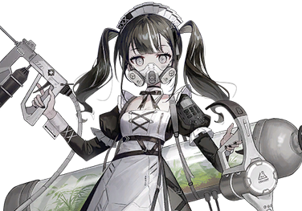

# Android_type_Cleaner-2145

| 角色信息   |          |
| ----------- | ----------- |
|名称|Android_type_Cleaner-2145
|年龄|外表年龄14岁（稼动年份：约400年）
|身份|量产型安卓机器人
|职业|清洁工
|对应歌曲|colorful
|初出版本|Chunithm Luminous

## Episode 1 排行第2145位的她

>自检开始——运动机能无异常。语言机能无异常——开始本日的清扫工作。

她，是被设计了能够正确无误地完成目标的思考模式的机器人。

而她被赋予的使命，主要是照顾人类的起居，以及打理都市的环境。

所以对她来说，她的早晨总是来得特别早。

 

这里是一座建立在高台之上的教会。

混凝土已经脱落，只剩钢筋铁骨的建筑物看起来就像是个长方形的箱子，如果不是有座从中央向上伸展出去的钟楼塔的话，根本看不出是座教会的样子。

在这空荡荡的建筑之中的一个角落，位于那里的管理人室就是她的房间。

 

……铛……铛……

 

凌晨五点，钟声准时响起。

与此同时，平躺在床上的她也静静地苏醒了过来。

 

“——进行自检。”

 

睁开眼睛，刻着“2145”的眼球开始飞速旋转。

 

“运动机能，没有异常。语言机能，没有异常——”

 

眼球之上，投影着无数的文字。

那些正是成千上百项自己身体的自检指标。

 

“检查完毕，系统正常。”
 

这么说着，她从床铺形状的充电底座上降下来，走向了占据了这狭小空间大半地方的衣柜。

她走到衣柜面前，随着一阵“噗嘶——”的放气声，厚重的衣柜大门被缓缓的打开。

在衣柜之中，放着一件保存的十分平整的女仆装。

 

“外装，没有异常。”

 

虽然用这种夸张的东西保存她的一身行头实在是有些离谱，但对她来说，这个衣柜却有着对她的打扫工作不可或缺的功能。

不知何时，她已经换好了服装，脸上露出了自信的表情。

 

一切都已准备就绪，她前往了礼拜厅。

在毫无生气的大厅之中，既没有点亮的烛台，也没有她应该侍奉的主人的身影。

在那里的，只有被清扫的一尘不染的教台，还有四处摆放着的长凳而已。

即便如此，她还是向着虚空行了一礼。

 

“我出门了。”

 

一个稍显浑浊的声音响起。

这里除了她没有任何人。而在她的嘴部，装着某个陌生的东西。

那正是装着两个吸收罐的“防毒面具”。

这应该是跟她身上这套传统派的女仆装反差最大的东西吧。

但是，随着她将各种仪器和设备穿戴到身上，再背上一个足有她的身高那么高的圆筒形的气罐，立刻就变得合理起来了。

穿过摆着长凳的走廊，她走向了教会的出口。

在缓缓打开的门外，是由毒气所组成的灰色的云海。

 

“Android_type_Cleaner-2145，现在开始清理工作。”

 

2145缓缓走向了前往都市的道路。

为沉入毒气之中的都市进行清理工作。

这就是她现在最优先的任务。

## Episode 2 与往常不同的一日

>发生异常，需要更新最优先事项。
“观测中。毒气浓度83%，与昨天比起来改善了大概1.3%。”

 

即便毒气浓厚到宛如朝霞般朦胧的地步，2145仍旧毫不犹豫地向深处进发。虽然能见度已经低到看不见十步之外的景色，但对于身为安卓机器人的她来说，这不是什么问题。

随着她愈发接近优先清理的区域，毒气浓度就越高。

虽然从周围传来了像是跟什么东西混杂在一起的，低沉的“哐哐”音，但她并未在意，继续向着深处进发。

 

来到目的地的2145，开始使用喷雾剂喷洒药剂。她喷洒的药剂，具有与空气中的毒气成分互相结合，形成无毒的固体的效果。

接着，只要将凝结起来的固体一并用吸尘器吸收起来，她的工作就完成了。

 

“清洁作业顺利进行中。”

 

2145有条不紊地进行着清扫工作。

自从她被制造出来，在这几百年间她就一直在持续打扫着，而这几百年来也从未遇到过一次麻烦。

日复一日，年复一年，她的工作从未遇上任何麻烦。

就在今天也将要一如往常地度过的时候。

 

“——？”

 

她的探测器察觉到了异常的声音。

那个声音，是2145从未听过的声音。

声音来自2145的上空。

在那上方，一块装在“天花板”之上，俯视着整座都市的螺旋桨，正发出仿佛齿轮被什么东西绞住的“吱、吱”声音。

 

“明明隔壁已经被封锁了，到底是发生了什么……”

 

她的话被螺旋桨突然发生的爆炸打断了。

异变仍在继续。随着一阵阵足以撼动整个空间的激烈撞击音响起，又从远处传来了金属被压瘪的声音。

简直就像是起重机所演奏出来的交响一般。

 

“发生异常情况。停止当前的工作，立刻进行异常情况的处理。”

 

2145远程操作着都市的防卫机能，最终在牺牲了几块隔离墙之后，才避免了最坏的情况。

但是，这场爆炸对整个都市的损害巨大。

由于爆发导致的乱气流将毒气吹到了那些没有被毒气覆盖的地方。

而断裂的螺旋桨扇叶又掉了下来，将地上的建筑物砸了个稀巴烂。

2145一直悉心打扫着的城市，在这数分钟之内就变成了一片狼藉。

然而，即便结束了分析工作后，她的脸上都没有一丝悲怆之色。

如果是人类的话，见到自己苦心劳作建立起来的东西在一瞬间被破坏掉的话，想必早已在悲伤中无法自拔，甚至想要放弃一切了吧。

但是，她可是生活了许久的智能机器人。

 

“既然东西坏掉了，那只要修好就行。”

 

直到她的使命完成为止，她要做的想必永远都不会改变吧。

确认了前方没有塌方的危险，2145决定前往螺旋桨扇叶掉落的建筑物那里一探究竟。

 

“——需要修正该区域的优先度。改为维持现状。”

 

来到坠落地点的2145，连分析都不用就下达了结论。当然，这也是没办法的。

因为这幅样子就凭她一个人怎么也解决不了。

现在的当务之急，是确认毒气扩散到哪里，然后赶紧去进行净化的工作。

 

“Android_type_Cleaner-2145，将继续进行清扫工作。”

 

就在她即将开工的时候，她又听到了个奇妙的声音。

 

“那个是……”

 

这“哔、哔”的声音，怎么听都不像是瓦砾崩塌的声音。

虽然智能机器人是不会出现错觉的，但以防万一，2145还是提取出了最近的短期记录确认了一下。

果然没错，她听到了个声音。而这个声音，就在附近。

 

“虽然是机械的声音，但我记得这附近并没有正在运作的设备。难道是因为倒塌的影响出现了异常吗？”

 

她缓慢地走向发出声音的地方。

在那里的，是一个机械装置的大箱子。箱子暴露出了内部的结构，而瓦砾则覆盖在上面。

 

“难道是从地上来的攻击吗？”

 

举着喷洒药剂的喷枪，她小心地确认着箱子的内部——

 

“为什么这里会有这种东西？”

 

对她来说，会有这样的疑问再正常不过了。

因为，眼前的“东西”，在2145的长期记忆中，早已经灭亡了才对。

 

“开始扫描——”

 

在这巨大的箱子里，装着一个穿着像是潜水服一样的厚重防护服的女孩子。

根据数据库的记录来看，女孩子才不到十岁的样子。

箱子之中的终端画面上，正显示着“解锁”的字样。

 

而随着这样的影响，2145的感应器中也开始出现了反应。

箱子之中的人体，也开始渐渐地温暖起来。

 

“已检测到生命反应。”

 

人类与智能机器人。

经历悠久的时光邂逅的一人与一机。

已经停滞的世界，将再度转动。

## Episode 3 大小姐与女仆

>小姐，请跟我签订契约吧。

“若有人看到这段影像，我的女儿，帕特利夏就交给你了——”

 

等到2145护送着女孩子回到教会之后，她从防护服身上的终端看到了这段视频。

这应该是检测到女孩子的生命反应之后就会播放的机制吧。

在终端屏幕上，一名神色严峻的老人，正诉说着这边的情况。

 

“我等的……生存战略失败了！都是因为那个可恶的……的缘故……！”

 

老人狠狠攥着拳头瞪着屏幕。

虽然因为部分内容无法读取导致无法了解完整的内容，但毫无疑问，屏幕对面的那个世界，正危在旦夕。

老人的脸上虽然已经布满血痕与汗渍，尽显沧桑，但在他的眼中，还是能看到一股从未熄灭的火焰。

 

“局长！快点！”

 

终端传来慌乱的呼吸声和无数的叫喊声。

老人虽然试图再说些什么，但最终未能说出口。

下一秒，那里就发生了爆炸，老人也被卷入了爆炸的冲击波中，消失不见。

而这就是这个视频最后的画面。

 

“这位女性，到底是什么时代的人呢？”

 

2145望向了已经脱下防护服，躺在长凳上休息的女孩子。

虽然刚才搬运的时候气息还很微弱，但现在已经可以正常呼吸了。

2145唯一知道的是影像之中出现的，像是模仿了什么花朵一样的图标。

将这个图标与数据库的数据中比对后，2145发现这个图标来自于一群留存于地面上的研究者们的组织。

 

“残存在地面上寻求出路的组织。也就是说，除了这里以外，在其他地方也有人类在努力生存下去——”

“刚才的花（话），也跟窝（我）好好梭说吧！”

“哦，这可真是……”

 

看起来女孩已经恢复了意识。

但状态还不够稳定，说起话来怪怪的。

在女孩子拼命挣扎着，最终被2145扶起来之后，2145向女孩子深深地行了一礼。

 

“大小姐，您终于苏醒了啊。”

“我不叫大小姐！我也是有名字的！叫帕特丽夏·索雷尔，你可要记住了啊！”

 

挥舞着一头金色的长发，帕特丽夏正用手指着2145。但下一刻，她就注意到了某样东西，慌忙用手捂住了口鼻。

“好臭啊！真是的，怎么这里这么臭啊！你是这里的管理人对吧？是不是玩忽职守了啊！”

“……”

“瞪、瞪着人什么的，可是不行的啊！我又没做错什么！”

“——帕特丽夏（Patricia）。这个名字在古代人类的语言之中代表着‘贵族、统治阶级’的意思。”

“那、那又怎么样？”

 

虽然她可能不知道这个词，但现在的帕特丽夏，确实是“人如其名”。她的样子就像是个贵族的大小姐一样。

帕特丽夏很不爽地“哼”了一下，坐直了身子。

 

“在提出意见之前，至少报上自己的名字吧？这难道就是你对人应有的礼仪？”

“非常抱歉。那么，我的名字是——”

“嗯嗯……咦？”

 

2145的正式名称，比想象中的还要长。

甚至因为介绍的语气过于平淡，等到帕特丽夏听完的时候，已经因为疲劳感而头昏脑涨了。

 

“小姐，这样您能够理解了吗？”

“我、我知道了……已经够了啦，妮可……”

“妮可？那是谁？”

“给你起的小名。取2145四个数字最初和最末尾的<ruby>2<rp>（</rp><rt>に</rt><rp>）</rp></ruby>和<ruby>5<rp>（</rp><rt>こ</rt><rp>）</rp></ruby>，这不就是‘<ruby>妮可<rp>（</rp><rt>にこ</rt><rp>）</rp></ruby>’了吗？怎么样，我觉得还挺般配的呢。”

“是，我明白了。”

“就这样？也罢。呐，妮可，刚好趁现在给你一个任务，能不能稍微处理一下这个充满霉味儿的房间？”

“我倒是没问题。”

 

2145——也就是妮可，歪着头如此回答到。

 

“怎、怎么不听我的命令啊！？”

“因为，小姐还未与我缔结主从的契约。”

“唔唔……既然这样的话，至少带我到个凑合点的房间吧！”

“那么，请跟我来，一起去我的房间吧。”

 

当帕特丽夏来到了妮可的房间之后，一见到床，她就笑开了花，直接扑了上去。

简直就像是在自己的房间一样。

但这张床似乎没她想象中的那么松软的样子。

 

“……”

 

看着脸上写满了不爽的帕特丽夏，妮可开始将迄今为止的事情娓娓道来。

在这期间虽然妮可向帕特丽夏问了几次问题，但她根本置之不理。

与其说是讨厌别人追究她的过去，不如说是不愿想起曾经把自己封印进箱子里的父亲。
 

“哼——”

 

就这一句。

这就是帕特丽夏对那个把自己托付给妮可的名为父亲的老人的看法。

 

“呐，与其说这个，妮可为什么要打扫这座都市呢？按你的说法，这个地方已经一个人都没有了。那么就不用打扫，一个人随便玩不就行了？”

“这是做不到的。打扫这件事可以说就是我的存在意义之一。”

“那你不打扫的话就会死吗？”

“虽然我对‘死’这件事没有概念，不过，如果我不能打扫了的话，那应该也距离‘死’不远了吧。对我来说，打扫就是最优先的事情。”

“那，就算我说‘跟我一起玩’的话，你也不会听的吧？”

 

帕特丽夏这么问到。

虽然从妮可脸上看不出什么表情，不过还是察觉得到一点失落。

 

“……不过，有一个方法，可以让修改我的最优先事项。”

“咦？”

 

妮可向着帕特丽夏伸出了手。

 

“那就是缔结主仆的契约。只要小姐握住我的手命令我的话，那我就会和小姐之间签订主仆的契约。这样的话，我就会听从小姐的命令行动了。到那时，小姐想要更改最优先的工作事项也是可以的。”

 

“这是说明书。”，这么说着，妮可从怀中取出了个小小的金属板，交给了帕特丽夏。

当她尝试打开，空中立刻浮现了Android_2145的设计图。

 

“呀！”

“我还以为小姐既然已经能够接受像我这样的安卓机器人，那这种说明书应该也没问题的……看来是我想多了。”

 

正如妮可所说，帕特丽夏在被父亲“封装”进箱子之前，就已经接触过类似的女性外观的安卓机器人，并且在她们的照顾下长大。

但是，对她的父亲来说，这些机器人只不过是道具而已，从未把它们当做人来看待——。

 

“……”

 

帕特丽夏眯了眯眼。

然后摇了摇头，握住了妮可的手。

 

“我会缔结契约的。不过，我不会命令你做什么，也不会改变你的优先事项。不过……！”

“不过？”

“可以……当我的朋友……吗……？”

 

那声音微弱无比，仿佛随时都会消失一样。

那正是她首次展现自己内心纤细脆弱的一面。

 

“请问，这与命令有什么分别吗？”

“完全不同！根本不一样好吗！”

 

虽然不知为什么她如此强调这点，不过想必深究也不会有什么答案吧。

与此相比，还是握住眼前这个正颤抖着的女孩子的手比较重要。

 

“我明白了。”

“真的？”

“虽然我还不能理解‘朋友’的意思，不过从今天起，我就是小姐的朋友了。”

“太好啦！”

 

而这也是契约成立的信号，两人就这样成为了有些特别的主从关系。

 

“朋友啊，是会一直在一起生活的人哦！”

 

虽然帕特丽夏所描述的“朋友”的定义似乎大有偏差，不过妮可什么也没说，只是点了点头。

 

“我明白了。”

“那……！”

“不过，这里也有这里的规矩。想要我一起陪着您，一起玩也行。不过，都必须先完成那些必须完成的事才行。”

“……跟想象的有些差别。不过，如果能一起玩，那就行啦！”

 

帕特丽夏从床上跳了下来，立刻催促着妮可。

 

“让我也来帮忙吧！帮妮可‘打扫’！相比较一个人，两人肯定更快！对吧？”

“小姐，您真的认为您能够跟我一样做同样的工作量吗？”

 

被妮可无情地指正，帕特丽夏顿时哑口无言。

但是，已经燃起的热情，怎么可能被这种小事压倒。

 

“哼哼，再怎么说，我也算得上是‘天才’啊！就让你看看我出类拔萃的学习能力吧！”

“那是当然。我会好好地，用这双眼睛见证的。”

 

妮可故意收缩了瞳孔，让眼睛发出赤红色的光芒以示威吓。

 

“这、这也太可怕了吧！”

 

虽然这么说着，但帕特丽夏的嘴角露出了些许的笑容。

这平淡无色的地下世界，开始渐渐地多了几分色彩。

## Episode 4 渐渐变化的日常

>人类，为什么会为空闲时间赋予价值呢？

自从两人初次见面之后，又过了几天。

帕特丽夏在妮可的身边观察了一整天的工作之后，很快就学会了作业的方法。

不知道是继承了她父亲的才能呢，还是精英教育的结果呢。不论如何，年纪尚小的她已经在妮可面前展现了她过人的智慧。

不但能够读懂2145的设计说明书，还能够读懂地下都市的数据库中的操作文档，甚至能够独自进行防毒面具和打扫工具的改良工作。

 

“哼哼，怎么样！这下妮可也不会说我是累赘了吧？”

“是的。小姐您说的正是。”

“对吧对吧？还可以继续夸我哦？”

“我明白了。小姐真可爱。小姐真聪明，小姐真——”

“呜呜……明明是我说要夸夸的，但总觉得高兴不起来……”

 

虽然开始工作之初也有举步维艰，效率低下的时候，但现在进度已是突飞猛进，甚至提前完成了这几天之内预定完成的量。

就在这时，帕特丽夏提出了一个建议。

 

“呐，妮可。今天就两人一起去探险吧？偶尔也该休息，卸下防护服，找个地方去野餐啊！”

 

日常的工作如果需要离开教会的话，肯定需要穿上防护服才行。如果不穿防护服的话，她们的行动范围就只有教会附近的一小片地方。

 

“小姐您可不能有一点闪失。”

“那妮可就检测一下附近的气体浓度，只要是0就行了吧？放心，我肯定会遵守规定的。”

“……我明白了。”

“好耶！”

 

帕特丽夏欣喜若狂。

这副光景，简直就像是姐姐终于听从了妹妹提出的任性要求一样。

 

两人走出了教会，来到了和教会差不多高度的小山丘上。虽然那里距离妮可界定的禁区很近，但是想要满足帕特丽夏的要求的话，也就只有那里了。

 

“检测中——气体浓度0.000003%，判断对人体没有危害。”

 

妮可还没说完，帕特丽夏就开始脱下防护服。很快，她就只剩一套单薄的贴身衣物了，她赤着脚，直接躺在了地下都市的大地上。

 

“啊！果然好冷啊！外面的空气，果然很爽呢！”

 

虽然外面的空气潮湿阴冷，但对于从未来到外面世界的她来说，还是不可多得的体验。

 

“小姐，这么乱跑的话衣服会弄脏的。”

“之后洗干净就行了。说起来，妮可干脆也把口罩拿下来如何？既然我都没事的话，那妮可应该也没问题吧？”

“嗯嗯，是这样呢。”

“那么！就一起躺下来歇会儿吧！”

“我明白了。”

 

妮可看着一边说着“快点快点”一边拍着地面的帕特丽夏。

在由最低限度的灯光所照亮的空间之中，在那些微的光芒之中仍能见到帕特丽夏那头金色的头发和那双苍蓝色的眼瞳。

在稍微眺望着这美丽的景色片刻后，妮可躺了下来，来到了帕特丽夏的身旁。

说些没营养的话，试着将妮可黑色的指甲各自染成不同的颜色，眺望着已经失去机能的，天花板上的螺旋桨——

 

（……）

 

对于妮可来说，这趟旅行完全是浪费时间。

但与此同时，她又能理解其中的部分东西。

那就是，这种行为，对于她的“朋友”——帕特丽夏来说，是十分重要的，也是她最喜欢的时间。

妮可决定将这一天发生的事情好好记住，保存在记忆领域的最深处。

 

“——妮可，那边是不是有什么？”

 

所以，妮可就这样慢了一拍，未能察觉帕特丽夏的行动。

她指向了某个方向。那里是还没有检测过气体浓度的地方——

帕特丽夏急忙伸出了手，但却扑了个空。

 

“我就先走了！你也赶紧跟上啊！”

“小姐！请等一下！”

 

妮可急忙跟上帕特丽夏。

帕特丽夏身轻如燕，就像是小动物一样飞速穿梭，向着前方不顾一切地冲了过去。

妮可虽然一直在后方大喊着危险，但她并不知道，这正是人类的好奇心才引来的情况。

然后，在这场追逐的终点等待着妮可的，是痛苦地跪在地上，捂着喉咙的帕特丽夏。

## Episode 5 再见了世界

>看来有必要和大小姐说出全部实情的样子呢。

“帕特丽夏！”

 

妮可立刻给帕特丽夏戴上了防毒面具。

那场爆炸，应该还没影响到这片山坡才是。

虽然气体的浓度只有百分之十几，但已经足够对她造成影响了。

妮可掏出了随身携带的卡匣式的药剂给帕特丽夏服用之后，就抱着她移动到了安全的地方。

 

“呜……啊哈……啊……”

“请再忍耐一下，很快就撑过去了。”

 

人类是十分脆弱的。

只要有点闪失，就会像这样危及性命。

所幸的是，妮可及时快速的反应成功让帕特丽夏度过了鬼门关。

很快，帕特丽夏就脱离了危险。看着帕特丽夏额头上豆大的汗珠，妮可用手轻轻地抹去。

一边默念着“你不是一个人”，一边鼓励着帕特丽夏。

 

到底经历了多久的时间呢。

当妮可感觉到自己手上传来了一阵紧握的手感的时候，她才发现帕特丽夏已经醒来了。

 

“帕特丽夏。”

“……妮、妮可……”

“请不要乱动，就这么躺着专心回复就行。”

“……你不生气吗？”

“是的。对我来说，小姐的安危更加重要。”

“抱歉，让你担心了……”

 

那天，妮可并未斥责帕特丽夏，只是在她身边陪了她一天。

至于为什么，是因为妮可从她与帕特丽夏迄今为止的互动中，得出了年纪尚小的她需要陪伴的结论。

 

两日之后。

在妮可按时起床之后，躺在旁边的帕特丽夏也醒了过来。

 

“早上好，妮可。”

“早上好，小姐。”

 

妮可缓缓地把手伸向帕特丽夏的头。

虽然在碰到的瞬间还能察觉到她的紧张，但当她注意到只是在摸头的时候，她就放松了下来。

 

“今天就要和平时一样工作了，准备好了吗？”

“嗯！”

 

两人带着由帕特丽夏改良过的小型重机前往了都市的中心部。

在重机的帮助下，工作效率提升了不少，废墟的清理工作进展顺利。

 

“小姐，要不要休息一下？”

“已经这么晚了吗？”

“虽然我已经说了很多次，我可是一直都在监视着小姐的生命体征的哦？请看一下，现在小姐的心率可是在激烈拨动哦？”

“等、等等！‘一直’是什么啊！”

“哦，心跳又加速了呢。”

“不是这样的！”

 

在两人休息了一阵之后。

呆呆地眺望着螺旋桨的帕特丽夏突然想到了什么，向妮可问到。

 

“呐，妮可，我想到了之前的一件事。”

“是什么？”

“还记得那次我吸到了毒气倒下的事情吗？那个时候，我看到了某样东西。写着四位的数字的……无数的铁板。那些是你的姐姐们的坟墓吧？”

“……真亏您能注意到呢。正如您所说，那片地方，其实埋葬着那些比我更早制造出来的同型号机体，还有那些与她们缔结了主从契约的人们。”

“咦？”

“看来有必要和小姐说一说才行呢。”

 

妮可开始以冷静的语调讲述起曾经在地下都市发生过的悲剧。

曾经，面对急速恶化的自然环境，为了生存下去，人们想出了各种方法。

大地、海洋、天空，还有地底。

许多的学者，提出了各种各样的构想。

制造了妮可的同型号集体的组织，正是那些选择了在地底生存下去的人们。

他们在地底深处建立了巨大的都市，利用可再生的能源与资源，试图建立一个可持续生存的社会。

由志同道合的人们所组成的组织，解决了各种各样的问题，他们的设想，很快就成为了现实。

组织里的人们和辅助他们工作的安卓机器人也完成了入住手续，彻底与地上断绝了联系的他们，终于来到了他们的乐园。

 

但是，他们却并未注意到。

地底的乐园，早已经不适合人类居住了。

变化已经开始显现，渐渐地，开始有人无法接受这样封闭的环境，对立渐渐深化——

 

“结果，这个乐园一瞬间就崩坏了。”

“看来并不顺利呢。”

“是的。对立的结果，就是天花板的隔离墙被爆破，蔓延于大地上的毒气流入了地下都市，杀死了很多人。”

 

破镜难圆。

那些幸存的人们再也无法重新建立起社会，纷纷陷入了绝望之中，一个又一个地死去。

 

“那，为什么妮可的姐姐们也死了呢？”

“因为我的同型号机体，都接受了在照顾主人、埋葬主人之后自行停止机能的命令。”

 

就像陪葬品一样。

那些无比害怕孤独的人们，最后能依赖的，也就只有这些与人类长得十分相似的安卓机器人了。

 

“那……妮可难道没有跟任何人缔结过契约吗？”

“有的。不过，在我制造出来不久，很快就离开了人世。”

“你不悲伤吗？”

“我没有这样的机能。”

“会几十年如一日地打扫，难道正是因为他的愿望吗？”

“正是。我曾经的主人，作为地下都市最后的生存者，同时也是建立起这座城市的构想的其中一人。他是这么跟我说的——‘总有一天，人类会回到这里。所以，直到他们回来为止，都要保护好这座城市。’……”

“然后就这样经过了四百年……这也太残酷了……”

 

帕特丽夏已经泪眼朦胧。

这泪水并不是为了那些人类，也不是为了那些安卓机器人而流。

而是为了眼前这位孤独守望了四百年的“朋友”而流。

 

“小姐，为何您要流泪呢？我不理解。”

“不理解也没关系。”

 

隔着防护服，帕特丽夏抱紧了妮可，再也不愿开口。

于是，妮可决定就这么放着她一阵不管。

 

在那之后。

帕特丽夏突然在妮可的怀里颤抖了起来，然后，她向着面前的墓地大声地喊了出来。

 

“会有这样的反应，小姐莫非也要跟他们一样，走上自绝性命的道路吗？”

“才不是！我只是明白了一件事。妮可原来的主人之所以会让妮可保护这片地方，就是为了让我和妮可两人能够离开这里啊！”

“这会不会有点过于牵强附会了？”

“有什么不好的！”

 

感慨万千的帕特丽夏，握着妮可的手，指向了坠落的螺旋桨所在的深处——以及那更加遥远的，在几重隔墙之外的地面之上。

 

“就让我们一起前往大地之上吧！”

“小姐，这防护服是没法抬手的哦。”

“这、这种细节就别管了啦！”

 

“会忙起来的哦。”，这么说着的帕特丽夏，在她的眼中，燃起了比地下都市的照明要耀眼许多的光芒。

## Episode 6 初次的大地

>不需要把一切都留在过去。我们啊，可是要拼尽全力为了明天而活啊！

自从下定决心以来，又经历了漫长的时间。

现在，妮可与帕特丽夏，正驾驶着改造好的重机向着荒废的地上进发。

曾经位于地下的众多设备都已经被帕特丽夏拆解，曾经用于维持都市机能运作的无数设施和资源，现在都变成了前往地上探险的防护服和机械。

她们的目的地，是位于地下都市的南方大概100公里左右的某个设施。

那是之前某天天气好的时候，初次成功放飞出去的无人机找到的设施。而且更幸运的是——那座设施，现在仍旧在运作之中。

坐在驾驶舱中，透过强化玻璃眺望着外面的景色的妮可向着帕特丽夏问到。

 

“人类真的能在这样的环境下生存吗？”

“毕竟只靠无人机探查的话还是有极限的，那不就只能趁天气好的时候亲自过去看了吗？”

“可是，冒着这样的危险，要是到了目的地却一无所获的话……”

“妮可还真是爱担心呢。”

“因为小姐就是这样锲而不舍的活到现在的啊。”

“哈哈？是这样吗？”

 

正如妮可所说的一样。

她的锲而不舍，是那些曾经在地下都市生活过，最终绝望而死的人们所不能比的。

自从与她在那个箱子中邂逅以来，一路记录下来，已经度过了三千个日日夜夜。

但是，到底是什么鼓励着她如此努力下去，因为没有其他的比较对象，所以妮可不得而知。

 

就算开足马力，这台重机也要花上一整天才能到达设施。

最初，两人以为那些吹倒的构造物残骸将会阻挡她们的行进，但当她们正式出发，才发现这趟地上之旅，却是一条意想之外的坦途。

大地就像是被滔天的洪水席卷而过，在一阵风卷残云之后，将一切都扫的个一干二净。

 

“这可真是出乎意料啊。本以为地上肯定只会更糟糕的，不但没有毒气在四处肆虐，外面还很热……要是这样的话，早知道就把重机轻量化了，兴许还能早点到目的地呢。”

“因为不管什么事都要防范于未然啊。就像小姐把我的身体改造成能够连续运行**72**小时的体质一样。”

“为、为什么非要强调持续时间啊！”

“应该是磁场风暴的缘故吧。”

“哪里有这种东西啦！”

 

就在这么说的时候，雷达上标识着目的地的图标也距离他们越来越近了。

 

“嗯……”

 

这么顺利，真的没问题吗？

虽然只是个小小的疑问，但却在帕特丽夏的脑海中久久不能消失。

 

“哈啊啊啊……地平线已经看腻了啊……”

“——小姐，小姐？”

“……啊？啊，难道我睡着了吗？”

“是的。”

“啊，抱歉呢，妮可。毕竟一直都在驾驶嘛。对了，我们已经到了吗？”

“不，发生了问题。”

 

帕特丽夏从驾驶席跳下来，来到妮可旁边，向外观察着。

因为一直在高速行进，强化玻璃上沾满了沙尘，一片模糊。

 

“嗯……那个是设施的外墙什么的吗？大概有多远？”

“大概还有一公里。”

“明明只是瞥了一眼就能算出来！？”

 

从直线距离来看，这个地方宽广到足以将整个地下都市笼罩住了。

 

“难道说那么大就有问题吗？”

 

妮可观察着从无人机上传来的影像。

然后，随着无人机渐渐地爬升上去。

 

“咦……？”

 

帕特丽夏才终于明白了“问题”究竟是什么。

出现在无人机的画面上的，并不是设施的外墙——而是一片只留下高塔的根部，剩余的部分从中间开始全部都消失殆尽的塔的残骸而已。

 

“信标呢？”

“在建筑物的地基处发现反应。不过从这种情况来看，说不定就和那座地下都市那样，只有设备还在运行着而已了。”

“……还没，还没结束呢——”

“小姐！”

 

喃喃自语的帕特丽夏的声音，与妮可的声音重合了。

妮可只是看着屏幕，一动不动。

两人惊讶地看着屏幕——只见在上空盘旋的无人机，被高塔的后方矗立着的什么东西卷了进去。

因为实在是太大了，甚至都没有注意到。

那是遮天蔽日，几乎望不见尽头的，气体的“高墙”。

那是一团足以将整片大地吞噬的，超大型的龙卷风。

## Episode 7 只是想活下去

>请不要这样做。不要，不要，不要……

面对来袭的超大型龙卷风，两人终于理解了地面上为何根本不见高塔以外的构造物的原因。

 

“距离还有多远？”

“规模过大，无法计算。”

“速度呢？”

“说不定，在我们逃进这里的地下空间避难之前就会被这东西吞没了吧。”

“那么……！”

 

帕特丽夏立刻就做出了决定。

 

“只能往那座塔冲过去了！”

“认真的吗？”

“我不会放弃的。直到最后一刻，都要拼命活下去！”

 

帕特丽夏将裹着防护服的手举到了极限的高度，指向屏幕对面的龙卷。

 

“宁可挣扎到最后一刻，也不要坐以待毙！”

“这才是小姐啊。”

 

妮可用力踩下了油门。

随着引擎的怒吼，重机向着高塔处飞奔而去。

但是，不管再怎么移动，她们与高塔之间的距离都没有缩短。

更奇妙的是，重机正被什么东西推着，正向着塔的斜对面方向移动。

 

“妮可！？”

“小姐，我们已经处在风暴的影响范围之中了。”

“到、到底是多大的规模啊……！”

“哔——无法计算。”

“现在是冷静分析的时候吗！”

 

帕特丽夏立刻投入了剩余的燃料，让重机爆发出了接近极限的动力。

移动轨道也在缓缓地回正。

虽然车尾已经开始颠簸起来，但妮可却利用这一机会成功让重机动了起来。

 

“就是这样！只要能够冲进去的话，应该就可以——”

 

突然，重机开始上下摇动。

说不定是刚刚开过了地面上的一小块落差吧。

虽然只是一瞬的时间，但这短暂失去平衡的一瞬，已经足够让龙卷风把她们卷起来了。

 

“啊……”

 

随着一股浮游起来的感觉，一股强劲的力量撞上了重机。

 

“帕特丽夏！”

 

龙卷风只是轻轻掠过，重机就发出了惨叫声。

帕特丽夏被狠狠地摔到墙上，映入她眼帘的，是即将被风暴撕裂的重机，还有拼命地向着这里飞扑过来的妮可。

* * * 

* * *

——似乎听见了什么。

 

帕特丽夏最初感知到的，是温和的风声。

除此以外，别无他物。就像是在梦境之中。

就像是自己在重机之中梦见的，那个梦的后续一样。

说不定，这一切的一切，都是自己在父亲所制造的箱子之中所见到的幻影。

这一切，难道都是在做梦？

不管是那座地下都市发生的事情，还是与她共同度过的回忆，这一切全都是——

 

——怎么可能！

 

帕特丽夏呐喊着。

亦母，亦姐妹，亦是朋友。自己能够走到这里，全都是多亏了妮可在自己的身边。

 

——想要再见妮可一面。

 

帕特丽夏打从心底里这么期望着。

怎么可以最后是这副模样就和她作别呢。

 

“——妮、可”

“…………丽夏……帕特丽夏小姐……！！”

“妮……可……？”

“小姐！太好了……您没事啊……！”

 

当帕特丽夏再度想要开口的时候，突然，从全身传来了一股钻心的疼痛，令她不禁喘起粗气。

 

“唔……咕……啊啊……！？”

“小姐！？”

 

每当呼吸一次，从身体的内部就传来了灼烧般的疼痛。

帕特丽夏很清楚这种疼痛是什么。

毒气。与自己第一次吸入毒气时十分相似的感觉。

即便无法确认视野，她也知道自己的防护服已经出现了破损。

但是，相比这些，她更庆幸通信机能仍然能够运作。

为了不让妮可担心，帕特丽夏集中了精神，将痛苦的感觉抑制住，向妮可说到。

 

“没、没事的。呐……妮可，听我说。”

“是什么事？”

“你大概还能运行多久？”

 

妮可稍微沉思了片刻。

简直就像是预料到了接下来主人要说什么事情一样。

 

“妮可？”

“……多亏了小姐的努力。现在，还能活动十来个小时！”

 

如果帕特丽夏的话是真的，那她们至少已经遇险超过两天以上了。

也许自己这条命真的很硬呢。想到这里，帕特丽夏本想露出个苦笑，但因为疼痛，只能露出个扭曲的表情。

 

“所以，现在就由我去接您！”

“妮可，我有个请求。”

“不要说了……不要再说下去了……帕特丽夏……”

 

朝夕相处的两人。

就如同妮可习惯了帕特丽夏的相处方式一样，帕特丽夏也读懂了妮可的“习惯”。

那就是，当她将帕特丽夏自己当成最优先事项的时候，她才会直呼其名。

 

“……！”

 

努力压抑着即将决堤的感情，帕特丽夏下达了**最初也是最后的命令**。

 

“妮可，把我的事情忘掉吧。然后，在那座塔中，**一直沉睡到新的主人到来为止**。这是**最优先事项**哦。”

“——我明白了。”

 

在这之后，妮可的通讯就中断了。

帕特丽夏把手伸向了通讯机的开关。

 

（这样就够了。你就带着我的那份，活下去吧。虽然像我这样即将消逝的生命，也换不了什么东西）

 

能做的都已经做了。

接着，静静地等待名为帕特丽夏·索雷尔的人类的生命落下帷幕就行了。

 

（真漂亮啊……）

 

帕特丽夏勉强睁开一只眼睛，映入眼帘的是蔚蓝的天空。

那是一片万里无云的蓝天。

帕特丽夏不禁想到。

在那些逃入地下都市的人们之中，应该也有想要回到地上的人吧。

也许这一刻，她也能够明白他们的心情了。

 

（如果可以的话，真想和妮可一起看看这片天空啊）

 

明明自己已经做好了赴死的准备，脑海中却总是浮现和妮可的那些日常的回忆，然后又消失不见。

明明自己已经半只脚踏进了鬼门关。

但是，和她一同经历的无数回忆，却正死死地拉扯着她，挽留着她。

 

“果然，还是不行吗。要是没有妮可的话，原来……”

 

——原来自己是这么脆弱的吗。

 

能够这样坚持下去，都是因为有妮可在身边啊。

注意到这件事的帕特丽夏，用最后一丝力气说出了不成声的话语。

“**妮可，最喜欢你了。**”

 

意识在渐渐消散。恍惚之间，帕特丽夏看到了天空中张开着翅膀前来迎接自己的妮可。

不知何时，身体开始轻盈起来。

难道说，是上天怜悯了她，才派来了与妮可十分相像的使者前来迎接她吗？

那么，这死后的世界似乎也不是那么糟糕呢。

这么想着，帕特丽夏·索雷尔在朦胧之中渐渐地睡去——

## Episode 8 重要的回忆

>与你一同经历的回忆，会在我的心中持续存续下去。一起走吧，帕特丽夏。

“咚……咚……”

 

早晨五点的钟声，准时响起。

这个时间，还有很多人仍在睡梦之中呢。

但是，在这之后她要去会见的人物，却因为某个特别的理由，才决定在这个时间起来。

沿着由温和的灯光照耀着的狭窄走廊前进了片刻，从透明的地板上传来了轰隆轰隆的声音。

在她的“脚下”，足以吞噬整片大陆的巨大龙卷正在肆虐着。

仿佛是十分怀念的景象一般，她眯起了眼睛。

刻着“妮可”的名牌，在她的胸前摇晃着。

 

很快，妮可就来到了她的目的地——那座报时的钟楼。钟楼敞开了大门，迎接妮可的到来。

在建筑物的周围，是那些与妮可长着同样容貌的安卓机器人们，她们正在打理庭院。

 

“贵安，9874，9875，9876。”

“贵安，2145。”

 

打完招呼之后，她就敲了敲建筑物的门，走了进去。

然后，那些一直等待着她的孩子们纷纷冲了出来。

 

“妮可，早上好！”

“各位，早上好。”

“已经要开始了哦！快点！”

 

大家的脸上都洋溢着笑容，急切地拖着妮可前往某个地方。

被孩子们带着，他们来到了某个房间。这里，是对于妮可和那些孩子们来说，十分特别的地方。

 

“哎呀，欢迎光临。今天也来做客，我很高兴哦。”

 

出声欢迎妮可她们的，是一个正躺在床上的女性。

她被孩子们团团围着，向着妮可露出了一个柔和的微笑。

已经有些褪色的金发，还有苍蓝色的眼瞳。

虽然身体已经瘦削不堪，但眼睛之中仍然燃烧着一股不灭的热情。

 

“那么，既然大家都到齐了，那是时候继续讲了哦。”

“好耶！”

“……真是的，之前才说到哪儿呢？”

“我救下‘**小姐**’的时候。”

“啊，是这样呢，妮可。”

“真是的，老奶奶总是容易忘事儿呢！”

“抱歉啦。”

 

在一同笑了片刻后，她开始讲起了故事。

讲起了她和她的朋友的冒险故事。

* * *

“**妮可，最喜欢你了。**”

 

在睡眼朦胧之中，帕特丽夏渐渐失去了意识，然而，耳边突然传来了“噗呲”的一声。

接着，随着一阵浮游感，她身上的疼痛也烟消云散了。

然后——

 

“我虽然不知道什么叫做‘最喜欢’，不过我已经明白了，帕特丽夏没有我是活不下去的这个事实了。”

“妮、妮可……为什么？”

 

帕特丽夏发觉自己正被妮可抱在怀中。

 

“小姐果然没有我是不行的呢。”

“不、不行？我到底哪里——痛！好痛痛痛……！”

“虽然刚才已经注射了特效药阻止了毒素扩散，应该已经缓解了些疼痛的……不过就算这防护服再怎么坚固，小姐您现在的身体也是摔得很惨啊。”

“等下，妮、妮可你这么说的话，那不就、更痛了吗！话说回来，你为什么会来救我啊？我不是向你下达了命令吗？”

“因为我**删去**了短期记忆之中，小姐为我下达的命令。”

“还能这样删去短期之内的记忆吗？”

“是的。因为小姐并未准确地指定为我的主人，所以我这边‘适当’地调整了一下。”

“啊……调整什么的……你还记得那么久远的事情吗……”

“我是不会忘记的。我已经与小姐一同经历了10年又312天又八个小时。这一切都有记录的。”

 

这么说着，妮可开始复述起刚才帕特丽夏说出口的告白。

 

“这，这算什么啊！我可不记得还有这种事啊！？明明都是我每天给你进行维护的啊！”

“是的。这件事，就算是小姐，也是要保密的。”

“哈啊……已经说够了。那么，你还能动吗？要来到这里，肯定是经历了千辛万苦吧？”

 

妮可点了点头后，告诉了帕特丽夏自己还能勉强撑到到达塔为止。

 

“你就坚持一下吧，帕特丽夏。”

 

帕特丽夏就这么被妮可背着带到了塔中，接着，与那些仍在管理着设备的，妮可的同型机汇合——

* * *

“最终，我们平安生存了下来。可喜可贺可喜可贺。”

“呐呐，你们俩之后又怎么样了？”

“呵呵，这个嘛……明天再讲吧？”

 

她就像个顽皮的孩子一样露出了笑容。

那股高贵的气质和作风，仍是一成不变。

 

“……妮可，有件事情能不能拜托你呢？”

“我明白了，帕特丽夏。”

“咦！？”

“看起来小姐的心跳似乎在加速的样子呢。再这样下去会影响身体的，今天就先休息吧。”

 

看来只能这样了。

等到送走了孩子们之后，妮可闭上了门，回到了帕特丽夏的床前。

 

“今天感觉比平常还要热闹呢。”

“看大家那么高兴，就连我也想多说几句呢。”

 

在这安稳的时光中，妮可一边叙着旧，一边帮她整理衣着。

 

“小姐的冒险，现在还在继续进行着呢……”

“是呢。真的是，足够漫长的冒险啊……”

 

两人在塔中与其他安卓机器人汇合之后，利用保存于塔中的遗传基因数据，成功让人类重获新生。

然后，他们离开了危险的大地，前往了天空中的全新居住空间——也就是宇宙殖民地。

 

“……”

 

妮可的手，与帕特丽夏的手互相重合。

就像在暗示着彼此会一直陪在身边，形影不离一样。

 

“不过……今天好像有点累了呢……”

 

接着，帕特丽夏说着“看看”，一边向着窗外闪烁着的星辰指去。

 

“总有一天，要到那颗星星上看看哦？”

“嗯。肯定会去的……”

“呵呵……太好了——”

 

房间重新回归了平静。

 

“……帕特丽夏，手，可没抬起来哦？”

 

不管等待了多久，她都没有回答。

刚才还感觉到的温暖，也已经消失不见。

 

“再见了，帕特丽夏——”

 

人类是脆弱的。

就算拥有百折不挠的精神，也无法抵抗时间的流转。

妮可为小姐进行了最后的化妆之后，离开了房间。

向着她沉睡着的病房望去，深深地行了一礼。

 

“Android_type_Cleaner-2145，从此开始，将为小姐实现她的愿望。”
