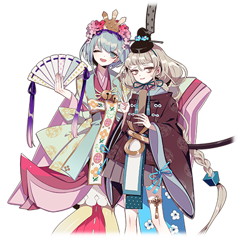
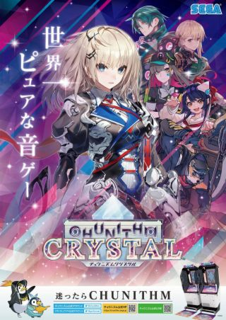
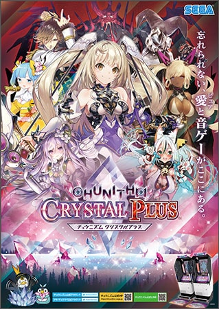
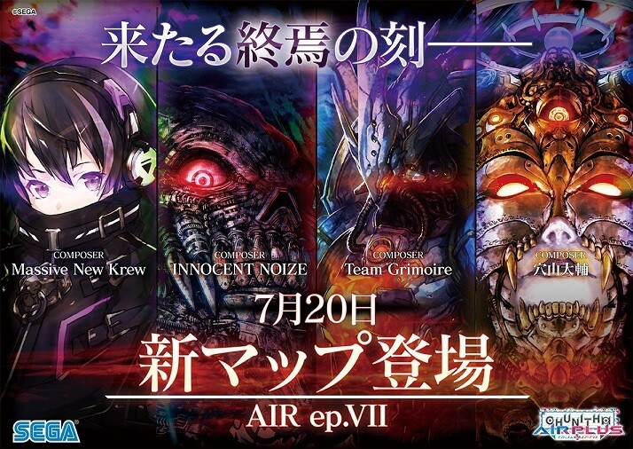

  

# 荒场流子/NEW GAME

| 角色信息   |  |
| ----------- | ----------- |
| 名称    | 荒场流子   |
| 年龄   | 19岁        |
| 职业 |  大学专科学生  |
| 对应曲   |人生攻略☆Tips |
| 对应版本 | Chunithm NEW |

从故事初登场以来经过了两年之后的样子。 已经从高中毕业的她，正和她的朋友一起讨论着CHUNITHM迄今为止的事情。

~~文中两年，现实六年什么的不要戳破~~

> **最终MAP充满威压感的大脸**：是指游戏公布地图AIR ep.VII的时候，欧米茄·昆提斯的插画。当时的玩家群不仅因为初次实装14而感到震惊，人物的插画也给玩家留下了深刻印象。 **不能被提及名字的那个人**：指活跃于maimai，Chunithm，音击三个游戏的写谱人——譜面-100号。 **是呢，我个人还是喜欢那首传说中的You——**：指的是Chunithm第一次进行乐曲公募活动的时候，USAO以别名义投稿到八咫烏 鋼太郎角色部门的歌曲《YouTube Dream》。目前曲子已经被删除，但是在后来新加的《Climax》里有大量致敬。 **女儿节的传统男女服饰**：请参考两人组合的卡面（舞園 星斗＆荒場 流子／雛飾りの二人)。  **穴山大辅的账号解冻**：指SEGA近几年来一旦在三个音游间即将登场魔王曲的时候，穴山大辅的账号总会解冻放出预告的信息震慑玩家的事情。而每当歌曲的分数被玩家打到最高分甚至理论值的时候（以Chunithm为例就是ALL JUSTICE），穴山大辅的账号就会再次冷冻起来直到下一首魔王曲出现。 文章中提到的“大概午后就又冻结了起来”是指当时实装《業 -善なる神とこの世の悪について-》之后，被玩家仅仅花了5币（15次游玩）就被攻破的事情。 **macrocosmos×3、Genesis、《逃避》 ～ The Deserter、Yume no hajimari**：这些都是Chunithm中极具危险性的谱面。而《逃避》 ～ The Deserter正是前面那个人的作品。

> 纯洁(ピュア)：指Chunithm Crystal在公布的时候使用的宣传语“世界第一纯洁的音游（世界一ピュアな音ゲー）”，以及续作Crystal Plus的“不要忘记，爱（日文注音为纯洁）与音游都在这里（忘れられない、愛(ピュア)と音ゲーがここにある）”。   由于Chunithm官方的联动和运营模式几乎都是在整活和激进之间左右横跳，所以该形容词变成了一种反讽。而且，Crystal更新当天还出了某个小事故。~~（新出的角色立绘放出了未经和谐的版本）~~ ~~另外从Crystal ep2开始的人物故事就不跟你装了~~

## Episode 1 从今以后
> -和星斗认识以来已经过了两年了啊。 -是呢，以后也请多关照了啊，流子！

高中毕业之后，我踏入了专科大学的校门。

音游陪伴了我的整个高中时光，而这点，估计以后也不会再变化吧。

穿过轩轩攘攘的人群，我大步走向了某个地方。

那个地方，当然就是Chunithm机台！

 
 

从那天为了消磨时间造访了机厅并接触到了音乐游戏开始，已经过了两年。我的世界已经是围着音游转的了。

虽然说我也接触了不少别的音游，不过最得心应手的，果然还是Chunithm。

既可以向钢琴那样运指弹奏，也可以像DJ刮碟那样操作触摸条。

就是这种手法的自由吸引了我。

哦，对了！还有判定相对较简单这点！

正当我在脑海中想着各种事情的时候，我已经走到了机台面前。

  

“哦，来了吗。”

“流子，今天来的还挺快嘛。”

“是呢！反正学校的课题已经一口气搞定了，这样就有足够的时间玩了呢。”

“没问题吧？可不要过了一周过来抱怨哦？”

向我轻松地开着玩笑的，是舞园星斗。

是从我高中时代开始就一起玩音游的伙伴。

轻飘飘的裙边和顺滑的长直发随着笑声一起飘荡。

配上那精心打扮过的妆容，十分可爱——然而，这样的TA，是**男生**。
  

——“长得这么可爱的‘女孩子’，怎么可能是男生啊！”

 

这句话，是当时那个初次见到星斗，打算趁势不顾一切的上去告白的家伙听到这个真相的时候，逃离现场的最后话语。

不过啊……老实说……。

“我懂的……我懂的啊……”

由于太过于明白这点，我的内心已经仿佛经历了世界末日一般荒芜。

众所周知，星斗由于受到他姐姐的影响开始穿起那样轻飘飘的衣服，而平时穿的私服也都是些可爱的服装，也就是大家常说的“伪娘”。

由于升上大学不再需要穿制服了，于是我目睹星斗的“完全形态”的次数也越来越多了。

“流子，怎么了吗？”

“嗯……啊抱歉，我只是突然陷入了回忆的状态罢了。”

“回忆吗……也是啊，也差不多快到框体更新的日子了啊。

是的，CHUNITHM也要准备进行大型更新了。现行的版本——Paradise也即将结束它的历史使命。

电子的乐园也将迎来终焉。（注：这里有一定程度致敬Metaverse角色世界观剧情的进展）

然后似乎收到了别的什么信号！

说起来，Paradise刚更新的时候也是遇上了不少事情，那时也承受了不少压力……不过看到当时版本的海报，还是从中获得了不少鼓励。

“时间过得真快。想想再过几天就要结束了，总觉得有点寂寞啊……明明又不是Chunithm要停止运营，为什么想到这些东西呢。”

“这就足以证明我们有多热衷于这个游戏啊。我们也已经和这些框体奋战了好久了。”

“有道理。”

仔细一想，我们也是陪着Chunithm这个游戏度过了很长一段时间。

差不多就和我跟星斗认识的时间一样长呢。

“那么，已经过了两年吗……”

“你的眼睛又望向远方了哦，流子？”

“星斗，今天就让我稍微沉浸在回忆里吧。”

果然，还是变成这样的气氛了。

“哈哈，说什么呢。不过，听流子这么说我也相会一起过去的事情了。我们去那儿坐会吧。”

“我们之间的故事，意外地长呢。”

我们坐在自动贩卖机旁边的长椅上，讨论起了迄今为止发生过的事情。

## Episode 2 天空·邂逅·巨脸

> “我一直以为星斗是个比较强势的人呢。” “那个时候我也比较激动……”

我和星斗认识的时候，正是版本升级到AIR之前那阵子。

“如果那个时候星斗没有向我搭话的话，我们就不会是现在这样的关系了吧？“

“确实，这么一想的话，人生真是充满了好多的变数啊。”

“不过，为什么最初会向我搭话呢？”

对于那个时候刚刚接触maimai的我来说，当时也算不上什么厉害的人物。

星斗看到我提起了这件事，笑着回答了我的问题。

“因为当时的流子玩的样子真的非常开心。就连我看着都觉得很开心，于是便上前搭话了。我觉得如果是和流子一起玩的话，一定能够好好享受玩音游这件事吧。”

“也就是说……我在机厅里表现的太显眼咯？”

“我觉得没啥不好的。虽然也有那种对这些东西很不爽的家伙啊。”

有一瞬间，星斗的表情突然沉了下来。我没有漏过这个表情。

“啊，不好意思，让你想起了不好的回忆了吧。”

以前，星斗曾经被那些不好好玩游戏的玩家[欺负过](/relation/seito?id=episode-7-机厅受辱)。

甚至严重到差点退坑的地步。星斗没在机厅出现的那阵子，我是真的着急了。

“没关系。现在对我来说已经算是美好的回忆了啊。让我不放弃音游这个爱好，鼓励我的人，是流子啊。这里就让我再说一声谢谢吧。”

呜呜……好，好耀眼……。

“喂！怎、怎么变成我这边不好意思起来了啊！关于我们之间的事情就说到这儿！谈游戏！谈游戏吧！”

正面朝着我微笑的星斗，总有种轻飘飘的感觉啊……哈~好危险。

如果不是我的话，绝对会被这个笑容击沉的吧。

“对了，说到AIR版本的话，最大的特色就是画面一口气变得非常明亮了对吧？”

“确实。当时的画面给人一种新鲜的感觉，不仅如此，当时追加的新模式——组曲模式玩起来也非常开心呢！”

组曲模式的话，虽然最初我还抱着“歌曲都是定好的，还要使用公用的血条，真的好玩吗？”这样的疑问。

不过实际上手尝试了之后，在玩的途中总会冒出不想就这么中途挂掉的年头，结果玩起来的干劲更足，甚至有段时间天天只玩这个。

“选随机组曲挑战平时不太会选的歌曲，也是一种锻炼呢。”

“是的！不过，万一遇上怎么都过不去的一首歌的话就会很不甘心啊~！”

“啊哈哈，流子毕竟比较不服输呢。”

虽然星斗这么说，但其实他也非常不服输。我要是有歌曲的分数稍微比他高一点的话，他就会在分数超过我之前一直一直刷这首歌……

有点不甘心，不过，星斗整体的音游实力还是比我强不少。

“哦对了！我还记得那个时候Chunithm准备了各种各样的地图给玩家解歌曲呢！”

“懂了，你是想说AIR的最终地图吧？”

>   注：即最右边的欧米茄·坤提斯。

“对对对！就是那个，当时看到最终地图公布的宣传图的时候，我就被右边那张魄力十足的大脸惊到了！还记得当时是在上课的时候看到公布的消息，结果害得我不得不在课上忍着不笑呢。现在我还是每天都在关心着更新的公告哦。”

“……流子，上课还是认真点为好哦？”

## Episode 3 星星·谱面·情念

> “说起来你最后有克服那个人写的谱吗？” “多亏你了呢。现在至少能够看懂了而已……”

我和星斗的回忆从AIR转向了STAR。

要说STAR版本令人印象最深的，应该就是OVER POWER系统了吧？

“自从这个系统出来之后，我就开始为了提升数值尝试了全部的谱子。这个不停探索游戏里的谱子的过程，还挺让人上瘾的呢。”

“这也是一方面。在游玩各种各样的曲子的时候总是能发现那些新的东西，技术水平也会得到提升呢。而且说不定能够找到新的自己从未接触过的音乐类型呢。”

“嗯嗯！这也是音游的一大魅力吧！”

等到我将全部的歌曲都收完那天……说不定我也能够成为那样的天才啊！……什么的。

不过话说回来，玩了各种各样的曲子后我才发现我对谱子慢慢地形成了一些固有印象。

有的时候，突然发现那些容易爆绿爆MISS的谱面越来越多的时候……总是忍不住去确认到底是谁写的。而确认之后……不好，怎么突然一阵头晕目眩——。

“流子，没事吧？”

“不行啊。果然只有那个人的谱面根本打不了。”

“啊啊……负——”（这里指的就是譜面-100号)

“求你了！不要再说那个名字了！感觉脑子里都要回想起那堆印象深刻的东西了！！”

“竟然还对谱面产生了过敏反应！？”

精心设计，足以让NOTE从指尖漏掉的谱子！

不知道什么时候就触发了即死技能瞬间出局的那个谱面！

只要提到那个名字就足以做噩梦的邪恶谱师！

我感觉我不用想起那个名字，光靠感觉都能明白是那个人写的东西了！

这是不是已经达到诅咒的等级了？

那个家伙真的是人吗？还是说写谱人不过是表面的身份，实际是某个由谱师班子召唤出来的禁忌之物？
  

“啊啊……鸡皮疙瘩还是停不下来……”

“嘛……毕竟谁都有不擅长的谱子。我也不擅长打那个家伙写的谱子。”

“就算再怎么不擅长这也……我还是说一说某首在我的评判里肯定有罪的谱子吧。能稍微听我讲讲吗？”

“可以。”

“说的是署名『ＣＨＵＮＩＴＨＭ第１６話　殺人レコード恐怖のＭＡＳＴＥＲ』的这个人。虽然我心里的谱面感应没有过多的反应，不过那种谱子，肯定就是-100号的产物啊啊啊啊啊啊！！不好，说出来了！！感觉又要起鸡皮疙瘩了……！”（注：这里对应的是《CHARGEMAN研》的联动曲《殺人レコード恐怖のメロディ》。后半段由于海量的FLICK和SLIDE节点堆叠，谱面的倾向相当偏门，甚至由于堆叠过多FLICK和SLIDE，导致游戏产生大量的噪音）

咦，穿着哥特萝莉装的星斗怎么好像天使一样……。

“总之先深呼吸吧。来，吸气，呼气——”

“——谢谢，我冷静下来了。”

“那就好。对了，其实你知道吗？这谱子实际上是Moon Strix写的哦。”

“咦！？开玩笑吧！？我还挺喜欢那个人写的谱子耶！”

咚——。

我的心中某样东西碎成了粉末。

“不妙啊，受到的冲击太大了感觉快疯了。”

“毕竟谱面班的人也得写不少谱，总有一两首相性不合的吧。大概，他们在实验性的谱子上就会用假名的吧？”

“那为啥不上WORLD'S END？”

“……这个话题还是到这里吧！说到STAR的话，也差不多是这个时候开始进行乐曲的公募呢！我还记得当时天天去视频网站刷投稿作品的日子呢！”

“星斗，话题不是这样强行扭掉的哦。”

不过啊，我当时也确实对公募曲一事乐在其中。

一边听着曲子一边想象着谱面成品，想想就令人兴奋啊。

“不管哪首，完成度都很高呢！”

“是呢，我个人最推荐的还是传说中的Yout——”

“星斗，这个世界上还是有些不可以随便触及的东西哦。”

“不过，这怎么说也是Chunithm的一部分……”

“不行！不要自己跑去挖掘那些黑暗的角落啊！”

