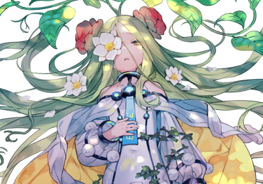

# 艾修(ASH:3-013)

| 角色信息   |          |
| ----------- | ----------- |
|  名称 |艾修(ASH:3-013)
|年龄 |推定为10岁
|职业|宇宙殖民地的学生
|对应乐曲|ASH
|初出|Chunithm SUN PLUS

## Episode 1 停止的时间，再度转动

>在这片浩瀚无垠的星之海中，我找到了她。时间被永远定在那一刻的她，却深深地吸引住了我。

宇宙历，25XX年。

在太空中航行的时候，我在偶然停靠的太空殖民地的废品店，发现了一个很有年代感的录音带。

我从以前就对这些不知道做什么用的废品和古董很感兴趣。

不过，这个录音带本身并不是什么稀有的货色。

真正吸引到我的，是录音带里面的内容。

>（/23XX.AM1049.Voice） 那个……这样就可以了吗？啊——啊——。能听见吗？要是能听到的话就请回答哦。 啊！好像这东西是没法确认的呢。啊哈哈……那再来一次。 从今天起将会把日记用录音机录下来。 我的名字叫ASH:3-013。大家都叫我艾修(ASH)。在这之后，我将会前往太空殖民地，然后在学校一直生活到长大为止。虽然离开家乡有些寂寞……不过还有老师一起陪着我，所以没问题。

从录音中可以得知，艾修是个活泼开朗的女孩子。

虽然没有见过她的样子，不过光是听到她的声音，不知为何连我的心情也变得愉快起来。

她就是有着这样的魅力。

随着录音继续播放，我还听到了有人正在叫她。

>“艾——修！快点——出门了哦！”

声音有点远，所以没法听清楚全部。

>“嗯！我现在就去！那么，之后就等到太空殖民地上后再说吧。再见！”

不知为何，我居然对着录音机中的她回了一句“嗯”。

向着有可能早已不复存在，只留下这一卷录音带的“她”，说着这样的话。

虽然我现在只是一个人在听，还是感觉到了有些羞耻。但是，我开始期待起来，到底，她会经历怎样的学校生活呢？

“这孩子，当时究竟是过着怎样的生活呢？”

我喃喃自语着，打开了下一条录音文件。

## Episode 2 献给孤身一人的你

>虽然她的话语能够传到我的耳中，但我却无法传到她所在的地方。不管怎么做，这个过程都是不可逆的。不管怎么努力，也不过是平行线一般，绝无相交的可能。

>（/23XX.AM0927.Voice） 啊——啊——能听见吗？我是艾修哦！结束了冷冻睡眠，我终于来到了目的地的太空殖民地哦！整个殖民地非常非常的大，感觉都能一口把我乘坐的那艘飞船吞掉呢。呵呵，很快就要开始新生活了，有点期待呢！

明明才从冷冻睡眠中苏醒过来，艾修竟然就这么精神了。

录音中的些许杂音，印证了我的推测。

从录音之中，传来了呼呼的风声，还有带有些许节奏的震动。

虽然只是我想象中的画面，不过当时的她应该是一边拿着录音机一边到处跑着录下来的。

虽然没法听清周围的声音，不过周围人声鼎沸，说不定是跟艾修上同一所学校的学生们。

偶尔还能听到的细小的沙沙声，难道是殖民地种植的植物的树叶之间摩擦摇晃发出的声音吗？

>啊！看到学校了！不管是老师还是学生都穿着白色的制服，好可爱啊！我也想早点穿上那套衣服，跟大家一起上学啊！

校服统一为白色的学校，吗。

不知为何有点在意，我打开了银河情报通信网络，输入了“制服”、“殖民地”、“学校”之类的关键字，开始了搜索。

搜索结果——2600000件。

嗯。想想也是……

只靠这点情报怎么想都不可能轻易找到啊。

而且，还不知道这究竟是位于哪个星系的学校啊。

就在我这么想着的时候，这一天的录音很快就到了结尾处。

>那么今天就到这里为止吧。明天就要开始上学了，好期待啊～♪　要是能结交到好多朋友就好了啊……一直以来，我都是孤身一人。不知道我第一个认识的朋友，会是怎样的人呢？那么，今天就到这里。再见啦！

这一天的录音，就到这里。

孤身一人。

明明这么活泼开朗的她，居然一直是孤身一人吗。

虽然并不是什么破天荒的事情，但我却从未想过竟会是这样。

“……要是能顺利结交到朋友就好了。”

我打从心底里期望着她的学校生活能够顺风顺水。

## Episode 3 轨道生命（ORBITAL LIFE）财团

>艾修生活的时代，应该是宇宙探险的开拓期吧。感觉都能想象得到她对着身边的一切都感到惊讶的样子了。

>（/23XX.AM0927.Voice） 啊——啊——能听见吗？今天老师教了宇宙的生物史哦！然后呢，老师——

我每天的日常行动多了一件事。

那就是在工作结束后，打开录音机，听她一整天分量的录音。

仅此而已。

今天怎么怎么了。今天和谁一起玩了。

今天学习了什么。**今天也喝了什么什么药**。

平平无奇的日常。安稳的校园生活。

她就这样每天在学校过着幸福的生活。

>——今天放学，我和▲▲以及■■三人一起回家。我们一起讨论了遥远的××星系的事情，畅想着那里会有什么样的生态系统——

这难道是她的坚持吗。

她总是喜欢把事情说的事无巨细。

说不定，这些录音，其实是为了让在故乡等待着她的双亲能听到而录的呢。

不管如何，对于独自一人过着百无聊赖的生活的我来说，她那活泼开朗的声音给了我动力。

说起来，她常常在录音里提到了“**药**”这个词。我决定开始搜索。

那种药，似乎是在她所生活的时代普及使用的，减少宇宙生活对身体的负担，以及维持身体营养平衡的药剂。

不过，现在这么复杂的调整全部交给机器自动完成就可以了。

向着宇宙进发的开拓时代。

远在我，甚至我的父母都未出生之前的，遥远的过去。

当时，肯定连上宇宙本身都是一件难如登天的事情吧。

——啊，原来是这样。

我突然想起了她曾说过的“孤身一人”。

难道说，她从小身体就十分虚弱，甚至都难以踏出家门一步？

如果是这样的话，现在会这么开朗也能理解了。

对了……说到药。

我稍微填了几个年代，然后利用这次获得的关键词，开始搜索起了药的生产厂家。

…………

……………………

结果我搜到的……是“轨道生命（ORBITAL LIFE）财团”。

跟着搜索结果蹦出来的，是他们的标志——一个被圆形轨道包围着的卫星，而在卫星的中心，盛开着一朵花。

关于这个财团，我似乎有些印象。

记得好像是——之前因为工作关系前去调查某个船团的时候看到的。

这个财团，似乎非常有名，是能够写进宇宙开拓史中的，久负盛名的大财团呢。

于是，我再次开始了搜索。

虽然大量的信息耗费了我漫长的时间，但在搜索整理的末尾，我找到了这句话。

……24XX年，解体。

看来，很久以前就已经消失不见了。

不过，多亏了找到这个比较有特征的关键字的缘故，我缩小了搜索的范围。

虽然拥有相似名称的组织有很多个，不过能同时负责制药和经营学校的，也就只有那个财团了。

更惊讶的是，艾修去的那个学校所在的殖民地，距离我所在的星系并不遥远。

我觉得，这说不定就是冥冥之中自有定数吧。

而且，要是这个殖民地还在的话，说不定还能找到艾修存在过的**痕迹**也说不定。

## Episode 4 唐突而来的异变

>从某天开始，她的样子就开始变得很奇怪了。到底是身体状况恶化了呢，还是……

>（/23XX.PM0831.Voice） 啊——啊——听得见吗？

今天也是以同样的台词开始了录音。

本以为今天也是以开朗的声线开始，然而这次我却感觉录音中的她有些疲惫。

从录音的时间来看，对于年纪尚小就步入学校的她来说，说不定太晚了呢。

>今天，之所以会这么晚才录音，是因为从早上开始身体就有点不舒服……感觉身体没法自如"沙——沙——"行动。不过请不要担心。只要稍微睡一觉的话，身体就会好不少。明天就能回去正常上学了——

嗯……？

总感觉听到了奇怪的声音。

倒带，回到刚刚的那部分重新播放。

>“沙——沙——”

确实能听到声音。

听起来像是衣服摩擦的声音，又像是树叶被风吹拂而过的沙沙声。在这之后我又听了好几次，但无论如何都找不到答案。

艾修所使用的设备，很难录到周围的声音。但是，录音中的这个声音却离得这么近。

说不定她只是晚上出来散心，在外面走动的时候吹过的空调风将树叶吹得沙沙作响也说不定。

不过，我这样的想法，很快就被一阵床板被压到的“嘎吱”声给推翻了。

现在的她，正躺在自己房间的床上。

“……艾修，究竟是穿着怎样的衣服躺在床上的呢？”

等等，我这个时候到底在想什么啊！

总之，还是先冷静一下吧。

就在我镇定下来大口深呼吸的时候。

>“——咯噔！！”

我听到了一声沉重的声音。

我将录音机的音量调到最大，试图确认录音机那边到底发生了什么事。

录音机中传来艾修痛苦的喘息声，还有哔哔作响的警报声。

然后，我听到了从远处传来的大门打开的声音。

之后，是复数的脚步声，以及呼唤着她的名字的人们的声音。

“哈啊……哈啊……为、为什么呢……明明，今天也按时服药了啊……”

就算是在这种状况之中，她也仍旧在进行着录音。

到底是什么让她坚持这么做呢。

我完全找不到答案。

不知道是不是前来这里的人关掉了呢，录音就记录到这里了。

明明已经能够快乐地前去上学了。

为什么她还要承受这样悲惨的命运呢……

这时我才注意到，我已经再也无法将她的事情当做分外事了。

……好在意。不论再怎么想都好在意。

于是，我打破了我自己的约束，开始播放下一天的录音。

然后，我的脑中浮现了一个想法。

我想亲眼去看看那个殖民地。

到底在那个殖民地发生了什么事情，她曾经所在的学校现在变成什么样了呢？要是不去认真调查的话，我就感觉我会再也无法冷静下来了。

而且，我也真的只是很想知道一件事。

那就是，她是否平安无事。

## Episode 5 梦的后续

>我知道这不过是不可能的事情。但是，就算这样我也想和艾修见面。

就在我前往殖民地的途中，我为了挖掘更多的细节，或者说是确保没有听漏什么细节，决定从头开始将所有录音都放一遍。

从这之前那个倒下的录音以来，艾修的身体就没有好转过。

>（23XX.PM0638.Voice） 啊……啊……能听见吗？

本来十分开朗的她，现在已经变得十分虚弱。

而与之相对的，最初只能微微听到的物体声，现在却变得比她的声音还要响的多了。

“沙。沙。”、“嘎吱、嘎吱”。就像这样，这些噪音混杂在她的声音之中。

>“今天，想讲一下……我的梦。”

她断断续续地说着。说着未来想前往的星系的事情。说着距离这里无比遥远，甚至远过数亿光年距离的遥远星系的事情。

就算有冷冻睡眠，估计以她的身体也没法坚持到那里的吧。

所以，我认为这只是一个支撑她继续下去的希望而已。

只要这样持续祈求着的话，说不定就能够让自己的身体坚持下去，对抗缠于她身上的病魔吧。

>“啊……最后，还有一件事。”

然后，艾修的声音暂时中断了一下。

随着沙沙声和她的一阵咳嗽声一样的噪音混合之后，她继续说了下去。

>——真——漂亮啊。要是花能开就好了。对了……我还必须……吃药才行……

录音就到这里。

即便我再怎么按下一个录音的按钮，都只有杂音而已。

这是什么样的结局啊。

明明是个一直都那么开朗、乐观，一直畅想着自己未来的人生的女孩子。

难道说，她就这么在完成自己前往宇宙旅行的梦想之前，就死去了吗？

目送着她前往宇宙的家人，听到这个消息的话，一定会很悲伤吧——

……咦？

就在这时，我第一次产生了疑问。

而这个问题，却是我自从最初听着的时候就感觉到的。

不过，由于我一直把这个问题放在一旁，所以渐渐地就越堆越大，不知何时就残留在我的脑海中久久不能离去。

为了保险起见，我从头听了一遍录音，果然，没有找到我想找到的“东西”。

对，艾修，**一次都没有提到自己家人的事情**。

**——那么，她到底是要将这条信息留给谁呢？**

## Episode 6 BRAND NEW DAY

>今天，开了一朵漂亮的花。要是有更多的人能看到就好了。

在我前往艾修所在的殖民地的途中，我又一次从头开始播放起她的录音。

然后，随着我不停地播放，我发现了一个事实。

那就是随着人的声音越来越虚弱，杂音变得越来越多。

——沙。沙。

——嘎吱。嘎吱。

那是自从艾修来到学校之后就一直能听到的声音。

而且，这个声音还是有规则性地响着的。

我尝试解析这个声音。因为在这浩瀚的宇宙之中，似乎也有着并不是靠话语，**而是靠声或者光进行交流的生命体的样子**。

虽然我还没实际见过，不过既然那些废品店的老爷子们能够用只有他们才听得懂的黑话进行交流的话，那么肯定也有交流方法十分特别的种族吧。

我相信，这些噪音之间肯定有什么联系，于是开始了分析。

那么，就在这之间去调查看看艾修所在的殖民地究竟发生了什么事吧。

* * * 

* * * * * * 

>——……啊……听、得、见、吗……

在这之后又经历了几个小时。

我突然从录音机中听到了艾修的声音，顿时坐了起来。

看来分析结果出来了。

我赶忙确认了日期。这个录音的日期，是之前从未见过的时间。

那么……这个分析出来的声音……

也就是说这些我本以为是环境音的杂音，难道，实际上其实是艾修的声音吗？

电脑上发出了根据分析所转换出来的机械语音。

>这一篇，应该会是这本日记的最后一篇了吧。

我为了确认其中有没有什么线索，直接将终端贴到了耳边，集中精神，不错过任何一个声音。

艾修的声音，不知为何有些疲倦。

感觉就像是飘在空中一般。

>我不知道我的梦想能否全部实现。不过，至少完成了一个。花开了。一朵非常漂亮的花开了。但与之相对的，我的眼睛已经**看不到了**。

这是为什么？

为什么明明说到花开了，可是眼睛却看不到了——就在这时，一个奇怪的想法闪过我的脑海。

可是，这种事情，真的是有可能的吗？

>然后，这句话是留给正在听这个日记的你的。要是，你注意到了我的**声音**的话，就来见见**崭新**的我吧。要是能来的话，我会非常非常开心的。

下一刻。

艾修的背后响起了迄今为止从未听过的，无比响亮的警报声。

而且，还听到了类似悲鸣和惨叫一样的声音。

到底录音机的对面发生了什么事？

>谢谢你，能一直听到这里。再见。

随着啪吱啪吱的声音，录音结束了。

艾修……说了“崭新的我”对吧。

如果，正如我想象的那样，殖民地发生了我所想象的事情的话。

而正是因为这件事，才导致了财团最终解体的话——

我踩下了油门，提高了飞船的速度。

我必须前去那里，找到脱胎换骨的她。

## Episode 7 绽放于宇宙之中

>艾修，原来一直都在那里啊。只为了能让谁能够留意到她一瞬间，一直都……

飞船到达的，是一片废弃的殖民地。而那个废弃殖民地，现在已经变成了异样的形状。

那个殖民地，就像是财团的那个标志现实化一样，像是一朵绽放在宇宙中的花朵。

盛开于宇宙中的一朵花。

当年组建起这个财团的人，肯定是梦想着能够永远盛开着的花，才建立了这个殖民地的吧。

在我为这花朵的美丽感到惊叹的同时，我也感觉到了强烈的寂寥感。

因为，这朵花明明是这样的漂亮，却无人能见，就这么漂流在太空之中——实在是太寂寞了。

不出所料，殖民地大部分的机能都已经停止了。

不过，不知道是不是货物搬运口的门是不是做了特殊处理呢，现在仍旧在运行中。

虽然抱持着内部的发电设施仍旧能用的妄想，但果然还是不行。

在我进入了殖民地之后一阵子，还没有见到任何的生命反应。

嘛，对我个人而言，空无一人才比较方便探索呢。

我的目的只有一个。

那就是找出艾修曾经在这里的痕迹。

我利用宇航服身上的头灯和手灯，向着殖民地的深处前进。

>调查报告。 我现在，正在轨道生物财团的太空殖民地之中。虽然无法完全确认内部的情况，但我认为我能从中找到财团曾经所做的事情。

在前往殖民地深处的途中，我也开始模仿起艾修，记录起了自己的事情。

就像她那样，要是我身上发生了不测的话，说不定就有谁可以利用这个，寻找到真相。

* * *

* * * * * *

调查在顺利进行着。我渐渐地把握了这里的构造。还有，这个地方究竟是为了什么目的建造出来。

这个殖民地的名称，叫做“轨道之花（ORBITAL FLOWER）”。

与财团的标志完全相称的这个地方，所研究的内容也正如我的想象。

这里，是改造那些早衰或短寿的老人，亦或是拥有先天缺陷的孩子的遗传基因，为他们延长寿命的研究设施。

研究设施打出了“享受永远的生命”这一看起来就很可疑的主题——而在殖民地中，散落着几张照片，照片上面映着的，是一名娇小的女孩。

啊啊。果然是这样啊。

你……就是艾修啊。

长着一头翠绿色的头发，还有一朵盛开着的，大到足以将眼睛盖住的美丽“花朵”。

还有从身体中伸出的藤蔓，以及细长的根茎。

还有周围渐渐变成茶色的皮肤，令人联想到树木的那个。

而这到底是先天所长成的呢，还是后天形成的呢？数据之中并没有明说。

但，她肯定听从了那些研究人员的建议，为了他们的研究，详细地用日记记录着自己的一切吧。

然后，我又确定了一件事。

那就是——她，艾修——已经再也**不是人类了**。

我抑制着涌上心头的感情，继续探索着殖民地。

还剩一个地方没有探索。

那就是殖民地的上层，“轨道之花”的花瓣部分，即居住区。

## Episode 8 二十亿光年的孤独

>长久飘荡于群星之海中，时间也被尘封冻结。而我，终于在这星海中，见到了你。

>调查报告。 我现在，正在轨道生物财团的太空殖民地之中。虽然无法完全确认内部的情况，但我认为我能从中找到财团曾经所做的事情——

“这还真是古老的设备啊……现在居然还在用视频记录什么的。”

“嘛，这就足够证明这个记录仪器够老的了。”

“这倒是。”

男人暂时停止了视频设备的播放，跟着同伴一起走进了某个殖民地。

他们，是被某个宇宙船团所雇佣的挖掘家。

说是挖掘，不过他们的手段实在算不上多文雅。

他们直接爆破了外墙壁比较薄弱的地方，强行进入了这里。

“我说队长啊，就算不用那么详细地调查也行吧……找到些值钱的东西就赶紧撤如何？”

“傻子。你难道看不出这种地方为何会变得空无一人吗？”

“不过啊，说到底不过是茶余饭后的谈资，真犯得着专门跑到这里进行探索吗？”

“哈哈，这就是当挖掘家的乐趣啊！”

穿着宇航服的男人们大笑着，打开头灯穿过了昏暗的走廊。

“不过啊，这种地方真的会有值钱的东西吗？”

“有这样一个传说。曾经数百年前，有一个追求着永久的生命的财团，在这里建立起了殖民地。据说啊，他们真的成功在这里做出了不老不死的灵药啊！”

“就是这朵大得要命的花朵殖民地吗？再怎么说也太可疑了吧？”

“混账！这可是真实的情报啊！”

“不过，既然都已经是这么遥远的事情了，想必肯定早就被回收了吧……”

“那么到时我们就随便扒拉几块外墙，去找雇主还是废品商交差吧。”

队长呵斥了刚刚发出质问的同伴们。

就在这时，队长的手碰到了视频记录设备的按键——下一则视频开始播放。

>虽然耗费了很长时间，但我终于————殖民地——————什么了。我—————————也想知道————————变成了什么样了。

之后，视频记录开始变得凌乱，无法播放。

“啊！怎么到关键的地方全都是噪点啊！这根本听不懂在说啥啊！所以说视频记录什么的就是……”

“果然，简单的东西就是好呢！”

“闭嘴。赶紧给我继续往前走。”

队长把视频记录仪器扔到一旁，继续向前进发。

“不过啊，从刚才开始，我就一直见到各种树根一样的东西在四处生长呢。感觉这些树根能一直持续到前面啊？”

“说不定就算把外墙拆下来带回去也没什么价值呢。”

“吵死了！说到底，还不是因为环境系统坏掉了，才能这样毫无限制地生长啊。那么，差不多要到居住区域了——哦，终于找到了啊。”

队长的头灯照到了写着居住区的牌子。如果没有被弄得一团糟的话，他们想要的东西，应该就沉睡着门后吧。

男人将手伸向了半掩着的大门。

“这、这是什么啊——！！”

男人们看见了那个。

**两颗粗壮而巨大的树木**，正矗立在居住区域的中心。盘根错节的枝干和树根，蜿蜒，盘绕，覆盖了居住区天顶，贴住了那能够看到整个宇宙的巨大透明板。

足以吞没整个居住区的大树，仿佛就像是在互相依靠一般，绽放着青绿的叶片，还有鲜艳而巨大的花朵。

“不会吧。这么大桩的树木不会就是我们要找的宝物吧？”

“这样根本就没法带回去交差嘛！”

“可恶！这下连来这里的燃料都白费了！赶紧去下个点！快点！”

“好嘞。”

男人们，并未找到值钱的东西，就这样离开了殖民地。

* * *

* * *

男人们被舍弃的视频录制设备，发出了滋滋的声音，持续闪烁着。

然后，影像变得无比清晰——

然后，画面中的某个人开始淡淡地说着。

“我终于找到了。变成了巨大的树木的，绽放着美丽的花朵的艾修。”

至于他是怎么判断出那颗大树就是艾修的呢，那是因为，那棵大树的上方，绽放着鲜艳的白色花朵，还有，在树干的深处，放置着用来记录录音的终端。

然后，视频设备中的那个人，说了一声“对不起”之后，就从宇航服中掏出了一把小刀。

然后，从树干之中，流出了透明的液体。

那个人用手抓住了漂浮在空中的液体——卸下了头罩，然后一口喝了下去。

然后缓缓地瘫坐在大树旁边，面向着终端诉说着最后的信息。

“虽然，这只是我的一场豪赌。也许，会发生什么，但也有可能什么也不会发生。不过，这一切都不重要了。只要，我能够在她的身旁，这就足够了。而且——”

——只是孤身一人永远地活下去，实在是太孤独了。

随着这句话，影像彻底中断了。

