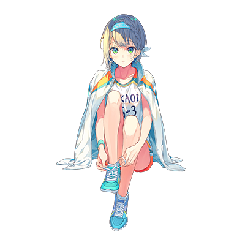
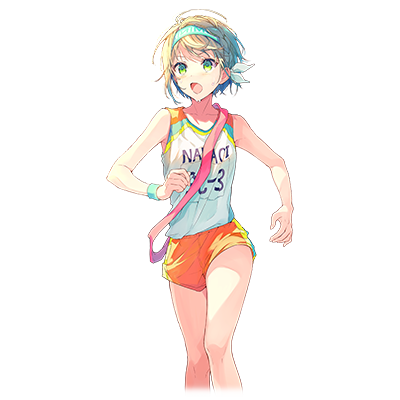

  

# 御手洗千里

| 角色信息   |  |
| ----------- | ----------- |
| 名称    | 御手洗千里     |
| 年龄   | 16岁        |
| 职业 |  高中一年级学生  |
| 对应曲   |ロング・スロー・アライブ  |
| 初出   | Chunithm Crystal Plus      |

## Episode 1 御手洗千里

> 我从以前就丝毫不顾周围的人们，拼命奔跑。但是，与一位朋友的相识，成为了我改变的契机。

御手洗千里是一名稍微有点笨拙，难以向他人传递自己心意的高一学生。

虽然坐拥着足以在中学田径比赛上获得长跑冠军的实力，但不知是不是一直潜心于跑步的缘故，她的身旁并没有足以称之为朋友的人。

即便升上高中也没有变化，仍旧是那个独自一人跑步的千里。

某天，她从接力部那里接到了一通求助，希望前去帮助他们。

 

这个故事，是一名独自奔跑着的少女，在和同伴们共同跑步中收获乐趣，慢慢变化的故事。

## Episode 2 跑步的意义

> 我并不是那种冷冰冰的人，只是不善表达而已。而跑步，能让我暂时将别人的事情放在脑后，自由奔跑。

我从以前就不善于表达自己的想法。

因为总感觉非常不好意思，而且如果没法正确传达出去的话该怎么办呢。

 

没有勇气和人搭话，如果被人搭话的话也只能回复一两句话。

自然而然地，说话的机会变得越来越少，而我的身边也没有多少朋友。

即便如此，偶尔也有搭上话的时候。

然而这种时候，我的反应却总是很冷淡，常常变得和人更加疏远。

虽然偶尔被人说是“冰山性格”，不过这只是误解。我只是不善言谈罢了。

然而即便是这样的辩解，我也没法准确表达出来。

为什么我会这样呢……

 

然而即便是像这样的我，还是有一项自己喜欢的东西。

那就是奔跑。最简单不过的奔跑。

虽然无论怎么描述都没法准确表现出来……总之就是喜欢。

每当我跑步的时候，各种杂念就会从脑中消失，只会听到穿过自己身体的风的呼啸声。

而这种感觉，非常舒服。

 

中学的时候，我为了能够自由地跑步选择了田径部。

最初还因为要同时照顾学业的问题为此烦恼，而我选择了拼命奔跑，将这一切麻烦的事情抛在脑后。

就这样，不知何时，我在比赛中获得了长跑的冠军。

夺冠瞬间的时候没有任何实感，虽然身旁传来了众人的赞赏，但我始终觉得这些不合自己的个性，而且我也不是为了获胜才选择奔跑的，于是我又开始一个人奔跑了。

 

升上高中之后，我依旧选择了田径部。

能够自由的奔跑的这段时间，是我一天中最幸福的时间。

不过，自从入部后经过了一个月，不知是不是性格太差，我依旧未能和其他成员打成一片。

田径运动什么的至少还是个人竞技项目所以应该也没差……对吧？

就算只有一个人，只要能够继续奔跑的话，这就足够了。

只要能感受到风的话，就足够了……。

 

……看来今天是想的太多了呢。

那么，今天就去和往常不同的地方跑跑看吧。正当我在想着目的地的时候，下课的铃声响了起来。

同学们有说有笑，教室门也随着休息时间的到来被猛地打开。

 

“千里！我有一个不情之请~！”

 

这个声音来自我从中学时代屈指可数……不对，是唯一能称之为朋友的和濑叶子。

 

看这哭丧着脸跑过来找我的样子……和平时差不多啊。

## Episode 3 朋友的请求

> 来者是从中学时代唯一认识的朋友。既然说了只有我才能帮得上忙的话，那应该不是什么恶作剧吧。

和叶子的初次见面，是中学一年级的时候。

不知是不是看到我因为不善言谈无法融入人群的缘故，她常常向我主动大话。

虽然最初我对她还是一副冷淡的态度，但不知不觉我就能和她正常说话了。

叶子非常关心别人，给人一种温柔和睦的感觉。

所以，即便是像我这样的人，也能搭上话对吧。

 

虽然升上高中后分到了不同班，但是我们之间的友谊依旧不变。

而叶子正在我面前哭求着我某件事。

 

“能不能来我们接力部这里帮忙呢！”

 

接力部啊，首先浮现在脑海里的是年初在电视上看到的箱根站接力赛。

 

“千里不是在中学的时候就获得了长跑比赛的冠军吗？所以拜托了！帮帮我吧——！”

 

叶子双手合十，低着头恳求着。

虽然说这种场面也不是第一次见到了，不过平时的她都是求上课的笔记本这类东西，像这次这种情况，还是非常罕见的……

 

“我觉得中学时代跑1500米的长跑和接力跑之间还是差距很大的。”

“没事的！真的没事的！我现在唯一能依靠的，只有千里你啊！”

 

既然都这么说了，那就没有拒绝的理由了呢。

而且这也是来自叶子的依赖，那更没什么拒绝的理由。

 

“那，就一小阵子。”

“真的！？太谢谢你了，千里！”

 

刚才还哭丧着脸的叶子立刻露出了笑容扑进了我的怀里。

估计就是因为这黏人的性格，才能和我搭上话的吧。

 

于是，成为接力部外援的我，当天的放学后就立刻参加了接力部的练习。

听他们说，现在接力部人手严重不足，再这样下去就无法参加正式比赛了。

而他们现在正在拼命寻找能够参赛的人，然而并不顺利。

所以最后就找到了我。我这么想着，觉得有些扫兴。

 

“可是……我能和接力部的那些人好好交流吗？”

“放心，有我在就没问题！”

 

和满头冷汗的我不同，叶子一副得心应手的样子。

 

“部长！我把隔壁田径部备受瞩目的新人带过来了！”

“好，叶子你可立了一件大功啊！”

 

进门后，叶子话音刚落，一名似乎是部长的女生就抱了上来。

其他的成员也围在两人身边，房间里变得热闹起来。

正当我觉得不太适应这个气氛想着站在一旁观望的时候，叶子拉住了我的手。

 

“这孩子的名字叫御手洗千里！”

“初、初次见面……”

 

突然被叫到人前，我的脸上不禁冷汗狂冒。

心脏宛如刚刚跑完一整段长跑赛程般剧烈跳动。

 

“我就是接力部的部长。你能够来当外援真的非常感谢。我们现在正因人手不足的问题焦头烂额呢。”

 

确实，这间屋子里的人，包括我在内，才勉强达到了参加比赛所需的最低人数。

大家各自自我介绍之后，社团的活动就开始了。

 

“那么，千里，从今以后我们就一起努力吧！”

 

在练习开始前，叶子这么说着。

看来，我至少不能让叶子的期待落空啊。

我这么想着，对叶子点了点头。

## Episode 4 温暖人心的场所

> 我就这么被叶子拉进了接力部。虽然仍旧不太喜欢这里，但我也感受到了些许温暖。

由于我是刚刚接触这个项目的新人，于是今天的练习就是拿着接力棒进行的实战演练。

虽然说是初次跑接力，但感觉和平时跑步别无二致。

即便如此，我还是稍微感觉到了和平时一个人自由奔跑的时候略有差距的部分。

一方面，接力棒的传递也需要和其他人同步节奏，而当我握着接力棒奔跑的时候，我感受到了前所未有的重量。

而且直到这个时候，我才开始注意到别人的跑步状况。

明明迄今为止都毫不在意这些，我却常常在心里想着，如果是我的话，肯定能跑得更快。

我为自己的想法感到震惊。

而说着只有我才能帮得上忙的叶子，也感到非常抱歉。

 

“哎呀……千里的速度真的太快了。大家都吓了一跳啊。”

 

练习结束后，我陷入了自我厌恶的状态中，而部长一边擦着汗一边走近了我。

 

“……谢谢。”

“我也听说了，你中学时代的时候拿到了长跑冠军对吧。对我们部来说你可是一员大将啊。”

“是啊，应该是从以前开始就只考虑奔跑的缘故吧。”

 

我们两人就这样一问一答，部长注视着我的脸，突然靠了上来。

 

“怎，怎么了吗？”

“总觉得你还有些拘谨。稍微放松一下也可以的哦？”

“好的，我会注意噫——！？”

 

突然，脖子传来一阵寒冷的感觉，我不由自主地发出了奇怪的声音。

正想着是什么东西的时候，叶子拿着矿泉水瓶笑着。

 

“啊哈哈！千里你的反应也太大了吧！”

“叶，叶子。你冷不丁的做什么呢！”

 

明明刚刚还在和部长认真回答的呢，叶子一来就乱了手脚。

 

“我只是想着缓解一下紧张的气氛而已。而且……”

“……而且什么？”

“我觉得偶尔展露这样的一面才容易和人打成一片啊。”

 

我回过神来望向部长，才发现她的肩膀正在颤抖，努力憋着大笑。而其他成员也差不多。

我顿时感到一阵害臊，耳朵开始发烫。

 

“叶子看来找到了个可爱的孩子呢。千里，要不要辞了田径部转到我们这儿？不会捉弄你的啦。”

“咦……咦……？”

 

我还没想到这么多的事情……。

正当我要说出“稍微让我思考一下”的话的时候，部长打断了我的话头。

 

“说说的。如果千里想要在这里尽情奔跑的话我们非常欢迎，不过我们不会强求你的。”

“虽然我心里倒是想一直和千里一起奔跑的呢。”

 

叶子原来是这么想的吗。

稍微有点……不……是非常开心……。

但是，我该怎么办呢。

是在田径部，和现在一样，一个人孤独地奔跑呢。

还是在接力部，和大家，和叶子一起奔跑呢。

脑海里留着这个问题，我结束了接力部第一天的活动。

## Episode 5 稍微改变的自己

> 我是不是也稍微改变了一些呢？如果有的话，那么这都是叶子的功劳啊。

在进行了数次接力部的活动之后，我也渐渐和部员们熟络起来。

我运用从田径部学习而来的练习方法，与接力部的部员们尽情交流，于是，我们之间的隔阂就这么慢慢消失了。

从只想着跑步这一件事，转变为如何为大家帮上忙。

只是改变这一点，就让我获得了迄今从未感觉到的充实感。

 

“千里，看起来最近开朗不少了呢。”

 

在社团活动结束后的回家路上。

在我旁边走着的叶子，突然说出了这句话。

 

“也就是说，我在这之前都很阴沉？”

“倒也不是这么说……就是感觉比以前更加活泼了吧。”

 

叶子望着天空说着。

 

“……我倒是觉得没什么变化？”

“总之！我只是看到千里有些许改变感到高兴而已。”

 

叶子这么说着，回头望着我露出了笑容。

说不定和叶子说的一样呢。

我和接力部的大家一起参加练习，一起交流，感觉曾经只有一个人的世界被大家拓宽了。

 

“这都多亏了叶子啊。”

 

如果叶子没有请求我来接力部的话，想必我就会和以前一样仍然一个人奔跑吧。

被这么说着，叶子露出了得意的笑容。

 

“既然说是我的功劳的话，那，我想要点奖励呢~”

“奖励吗……倒是可以。”

“太好了！话是这么说，不过我想让千里做的事情，已经有答案了。”

 

叶子嘴角的笑容似乎看到了一丝紧张，这是我从未见过的样子。

我的心里浮现了不详的预感，赶紧先说了前提。

 

“虽说如此，必须在我力所能及的范围内哦。”

 

姑且还是说了一下，不过可以的话还是想帮忙实现的。

到底会是什么要求呢。就在心里做好了准备的时候，叶子有点害羞地开了口。

 

“其实呢……要不要我们俩一起跑？”

“……咦？就这样吗？”

 

我本以为按叶子的性格会说出更出乎意料的东西呢。

虽然说这个愿望在某种意义上也是出乎意料。

 

“没问题没问题。我从之前就在这么想了。”

“……真的只要这样就够了吗？如果只是一起跑步的话，我随时都可以的。”

 

难道说，是因为我比较难邀请的缘故吗？

 

“那，一言为定。手指拉钩。”

“既然叶子都这么说了的话……”

 

伸出小指头互相拉钩。

望着露出笑容的叶子，我也露出了笑容。

 

比赛已经近在咫尺，和叶子一起跑步的约定被放到了比赛之后。

和叶子一起跑步。

只是知道这点，我的心就不再将大会的到来当成遥远的事情，而是为之练习和努力的目标。

## Episode 6 夏季大赛

> 这是我首次参加的正式比赛。不管是为了大家，还是为了叶子，我都要尽力奔跑。

夏季的地区大赛终于到来。

虽然练习的时间短暂，不过有一定程度的练习还是能做到什么的。

虽然有过一些不安，不过现在已经消失不见了。

 

“啊，千里在紧张呢。”

 

正蹲着系鞋带的叶子正笑着和我说话，缓解紧张的气氛。

 

“毕竟这是第一次参加接力赛啊……接棒，能不能顺利进行啊。”

 

如果是和往常一样的单人长距离跑步的话，就不会紧张了。

然而，这次是团体比赛。

一个人的失误可能就导致全队皆输。

而且，我是以外援的身份进入这里的。

我就更不可以出现失误了。

 

“没问题啦。迄今为止练习了多少次了。”

 

叶子的这份乐观，我稍微有点羡慕。果然，我只要没有奔跑的时候，就会开始想些不好的东西呢。

部长从我身后向我搭话。

 

“千里，如果紧张的话就要说出来缓解啊。看看其他人，紧张的情绪自然就烟消云散了。”

 

部长似乎并没有想象中那样更加紧张。

 

“叶子你不会紧张吗？”

 

为了摆脱脑海里的坏念头，我把话题转给了叶子。

 

“我吗？我觉得能和千里一起跑就很开心了，所以不会紧张的。”

“……是，是吗。”

 

虽然不太明白，不过看起来并没有紧张的样子。

虽然也有我太紧张的缘故，不过大家看起来反而是过于松懈的样子。

果然，这种时候就算只有我也不能松懈啊！

 

终于，比赛的广播传来，我们各自走向了各个区间的起点。

我的位置是第三区，相较于其他区间距离比较短。

毒辣的太阳灼烧着地面的沥青，就在这热气蒸腾之中，地区大会正式开始了。

过了一阵子，第三区的跑者们开始一个个交接接力棒。

我焦急地望着其他跑者接棒出发，逐个逐个地将我们甩在身后，站在原地等着负责第二棒的叶子到来。

观众的欢呼声，蝉的叫声都显得十分遥远，只有自己的呼吸声近在咫尺。

 

终于，我见到了沿着弯道前进的叶子的身影。

叶子在跑步集团的中间，虽然个子相对矮小难以辨认，不过光是她的出现就足以缓解我的紧张感。

拿到接力棒的我，向着先头的部队飞奔而去。

而后面，似乎传来了叶子微弱的声音。

就算和前方的队伍拉开了距离，还是有逆转的机会的。

拿到了接力棒后，位于中间大部队的前段部分的我，用着宛如破开强风的机翼般的势头在前方领跑。

在跑道终于接近山麓的地方，我终于看到了远方的先头队伍。

我必须追上去。而就在这么想的时候，我脱离了跟在后面的中间队伍，一口气冲向了前方。

 

由于看得见前方在跑的人，相对来说也好调整步调。

只要能够稍微快过前面的队伍就好了。像这样思考着跑步还是第一次。

不只是这场比赛，光是在我的眼前还有人在奔跑这件事，也是久违的事实。

 

终于，我跟上了先头队伍的尾段。

我终于做到了我该做的事情。

由于在队伍前方顶风领跑，我的心理状态变得更加轻松的同时，我也由于迄今为止一个人顶着风奔跑的习惯，疲惫感涌了上来，跑步的节奏变得混乱。

 

一个人奔跑，在别人的背后奔跑，思考着事情奔跑。面对着这些迄今为止我从未经历过的事情在我眼前连续发生，现在能驱动我的双脚的，只剩我的意志力了。

 

即便是这样，我还是强打精神，努力维持着双脚的速度，将接力棒交给了下一名成员。

努力撑着即将倒下的身体，确认着之后的情况。

然而，就在我终于将排位追到和先头部队并驾齐驱的这短暂时间内，接力部的成员们被其他跑者们一个个地超了过去。

最后的结果就是，我们以半途而废的排位，终结了这场夏季的大赛。

## Episode 7 无法回头的话语

> 我明明没有伤害他们的意思的……明明我和大家一样不甘心的……

大赛结束。我们垂头丧气地返回了部室。

 

“这次大家辛苦了。虽然说这次……不算什么好成绩，但是大家尽了全力，这才是最重要的。反省大会之后再说，今天还是好好休息吧。”

 

部长努力想要打破这沉闷的空气，说着鼓励的话。

然而，没有人回应她。

 

“千里这次能够来当外援，真的很感谢。如果没有千里的话，我们连比赛都参加不了呢。”

“不……我只是……”

 

我极力回避着部长的目光，只是低着头。

结果，我真的给大家帮上忙了吗。

的确，没有我的话，我们甚至连比赛需要的人数都凑不齐。

然而，仅此而已。如果只是凑人头的话，就算是我以外的人也能做到。

叶子不是说过吗。

只有我能够依靠了。

然而，即便是没有其他人能够帮忙的情况下，我也没有回应叶子的要求啊。

 

叶子现在的状况如何呢。

我抬起头看着大家。在沉浸在悲伤中的部员们里面，叶子仍旧在强忍着泪水。

我很快就领悟到，我未能成为叶子的助力这一事实。

我明明不想看到这样的叶子的。

只要我更加努力的话，就不用以这种惨状收场吧。

只要我更——

 

“只要，只要跑得更快的话……”

 

不甘心到了极点，以至于无意中说出了这句话。

本来，这句话应该是对我自己说的。

 

“难道说，千里是在抱怨我们吗……？”

“咦……不，不是的——”

 

一名部员站了出来，用锐利的眼神瞪着我。从她的眼中，还能看到泪花。

 

“我们也已经尽了自己的全力啊！能不能不要说这种话！”

 

话语产生了误解。

然而我却找不到能够解除误解的话语。

看着眼中带泪的她，我也只能悔恨地低着头，露出快要哭出来的表情。

当然不甘心啊。就算是我也很不甘心……。

 

“不要这样了！”

 

叶子的声音响彻了整个房间。

 

“千里肯定不是这个意思的啊！大家相处了这么久应该明白的吧！？”

 

已经泪如雨下的叶子只能抱着部长。

我却无法动弹。

 

“大家还是冷静一下吧。就像叶子所说，千里并不是在抱怨大家的，对吧？”

 

即便部长这么说着，我也只能努力地点点头。

我并不是想伤害大家的心的。

我只是在为自己的无力而悲叹而已。

为什么会变成这样呢……

 

果然，我还是只适合一个人奔跑吧。

 

“对、不起……”

 

我这么说着，逃离了接力部的房间。

从我的背后，似乎听到了叶子十分悲伤的声音。

## Episode 8 那一天的约定

> 自从脱离了接力部以后，我的生活就宛如空壳般无趣。我已经再也找不到奔跑的乐趣了。

我就这么抱着对接力部的愧疚之情，回到了田径部。

然而，无论我怎么奔跑，都找不回曾经奔跑的乐趣了。

不管怎么集中到跑步身上，还是感受着风的吹拂，心里的某个角落始终让我坐立不安。

 

“我到底……是为了什么开始奔跑的呢……？”

 

本来，我应该是比任何人都喜欢奔跑的。

无需顾及其他人，一个人自由地奔跑。

明明只需要这样就可以了，然而却不知从何时起，开始发现一个人奔跑的寂寥感了。

 

即便是这样，我也没有停下脚步。

因为如果停下来的话，某些东西就真的会结束了。

我的心里是这么想的。

 

日复一日，我依旧一个人在奔跑。

就算跑步结束，也没有人上来搭话。

我回到了曾经一个人奔跑的日子。

 

从那天起，我就再也没有和叶子说话了。

明明以前就算班级不同，依旧每天见面说话的，现在连见面都没有了。

明明约好了大赛结束后一起跑步的……看来是无法实现了。

说不定已经无法实现了。

 

明明学校这么小，结果却和接力部的人一次都没见过面。

说不定，是她们那边主动在回避我。

如果可以的话，我想道歉。

然而，事到如今，我应该说什么呢。

只要想到这点，我就会感到恐惧。

 

不知何时，叶子，还有接力部的各位，在我的心中占据了很大的一片。

 

就这样经历了一阵空虚的日子，直到夏日的酷暑都彻底消失的时候。

在结束了日常的跑步练习后，我在校门口见到了一个熟悉的身影。

是叶子。

四目相对的时候，我找不出应该说的话。于是我下意识地错开了视线。

 

“好久不见了，呢。千里，我有话想说，可以吧？”

 

叶子首先搭话了。

仔细看了看叶子的脸，和我不同，她并没有回避，而是正面面对着我。

叶子的这个优点真是令人羡慕。

和叶子久违的见面，让我既开心又困惑。

 

“之前，不是约好的吗？大赛结束了的话，就要一起去跑步的。现在，这个约定还有效对吧？”

“咦……？”

 

我本以为已经再也无法实现的约定。

竟然会从叶子那里说出口。

 

“可以是可以。但为什么？”

“我想要和千里一决胜负啊。用千里最擅长的长跑。”

“……这是什么意思？”

 

我完全不知道这么做的意义。

 

“如果我赢了的话，就一起回到接力部吧。”

 

这个语气，是和平时相差无几的，温柔而带着几分可爱的，叶子的语气。

然而，叶子的眼神是认真的。

 

“……如果我赢了的话？”

 

还是把最不该说的话说出来了啊。我真是笨。

 

“如果这样……那，我就不再过问了。”

 

叶子用颤抖的声音回答。

不过，这说不定也是一个机会。

能够和叶子，还有接力部的大家道歉和好的机会。

 

只要我故意输掉的话，就能够和大家再度见面，道歉，和好，取回我曾经丢弃的那阵时光吧。

 

“……我知道了。就这么做。”

 

或许冒出这种想法的我，才是最差劲的人。

但是，为了能够再度取回和大家，和叶子一起欢笑的日子的话，我也愿意选择这个方法。

## Episode 9 察觉的心意

> 我的眼前有着认真回应心意的朋友。而我应该做的事情……已经有了答案。

已经快到放学清场的时间了，昏暗的操场已经看不到其他人影，只剩我和叶子两人。

只有教学楼窗口的光芒照着我们的脸。

虽然说是长跑的对决，不过由于时间有限，结果变为中距离的1500米跑步。

对于从中学开始奔跑的我来说，这是我最擅长的项目。

而这也是来自于叶子的提案。

 

“毕竟是我单方面发起的呢。总得照顾一下千里啊。”

“真的可以吗？”

“嗯。所以……千里，请不要故意输掉跑步什么的哦？”

“……不会的……我不会这么做的……”

 

叶子虽然用着开玩笑的语气这么说，我还是错开了眼神。

说不定，当我接受的那一瞬间，叶子就明白了我的计划。

我故意输掉比赛的计划。

 

和平时比赛的紧张感不一样，我感受着从背后传来的紧张感，开始了和叶子的对决。

两人开始起步后，我就发现叶子跑到了我前面。

只要我这么跟在叶子的后面跑的话，我就不会获胜了吧。

这样就够了……这样就……。

我的心里这么向着，脸颊上传来了夏季夜间的凉风。

我回过神来才发现，叶子的距离正和我拉得越来越大。

 

不是我故意减速才会这样。

而是叶子正跑得越来越快。

仔细一看，叶子的身上，四处都贴着胶布。

即便是在我离开接力部之后，我度过着空虚的日子的时候，叶子也仍旧在刻苦练习。

这一切为的都是能光明正大地胜过我。为了让我能够再次回到接力部。

如果不是这么拼命地努力过的话，肯定是不会像那样给我开足够有利的条件的吧……。

但是明明朋友都这样了，我却只想到了自己的事情。

彻底罔顾了叶子的心意。

 

“……如果是现在的话，还能赶上。”

 

为了回应叶子全力的心意。

我深深地吸了一口气，向着叶子所在的前方飞奔而去。

 

我从弯道的外侧超过了叶子。

在超过叶子的时候我似乎听到了叶子紊乱的呼吸声，然而我没有回头观望，只是向着前方奔跑。

 

“……哈哈，果然，千里还是那么的快啊。”

 

面对先一步到达终点等着叶子的我，叶子疲惫地用双手按着膝盖站着发出了苦笑。

 

“其实呢，我从中学的时候开始，就一直注视着千里跑步的样子了。”

“咦……？”

“那个时候，你总是露出一副快乐的样子奔跑着……你当时奔跑的身姿，我真的非常喜欢……”

 

叶子竟然是这么想的，我却浑然不知。

因为那个时候的我，只是一个人独自奔跑，将周围的一切都忘在脑后的。

 

“看着那样的千里，我的内心就在想，总有一天要一起奔跑的……虽然终于实现了这个愿望，不过看来不能太贪心了啊……”

 

滴到地面上的水滴，那究竟是汗水，亦或是……

叶子用衣袖稍微擦了擦脸，抬起头向着我勉强挤出了一个笑容。

 

“虽然说还很想和千里一起跑步的……不过说好的就要遵守。那么，再见了……”

 

手伸向了消失在黑暗中的背影，然而却什么也摸不到。

原来，叶子一直都在想着我的事情。

叶子一直在注视着我。

然而，我却……。

如果就这么坐视不管的话，我就真的会变成孤独一人了。我这么想着。

 

“我……”

 

之后到底要做什么，我已经有了答案。

## Episode 10 我所期待的容身之处

> 我还想和大家一起奔跑！我想成为大家的力量！这就是，我心底里最真实的愿望。

第二天早上，我来到了接力部的门口。

顺着昨天的势头就这么来到了这里，脑子里仍旧一片空白，不知道干什么。

事到如今应该说什么呢……到底该如何向他们道歉呢？

当我这么想的时候，本该伸向门把的手就停住了。

 

“咦……千里……？”

“噫！？”

 

和昨天完全不同，恢复平时的元气模样的叶子向我搭话。

 

“怎么在这里？”

 

叶子表示昨天的事情不要在意。

 

“其实……我是想加入接力部的……”

 

在预想以外的时间点碰见叶子，只能努力转动脑子，努力地挤出声音将想说的说出来。

听见我这句话的叶子，瞪大了眼睛。

 

“千里……谢谢……真的太好了……”

“我才是……能够邀请我进来，真的谢谢你……叶子……”

 

如果没有叶子的率先邀请，我应该就永远都不会知道和人一起奔跑的快乐吧。

看着哭出来的叶子，我的视线也开始模糊。

直到上课铃声响起之前，我和叶子两人都在一起大哭着。

 

两人的眼睛都已哭肿，经历了漫长的一天课程之后，终于来到了放学时间。

我准备好了加入接力部的表格，和叶子一起来到了接力部的门前。

 

“没关系的。大家不会生气的。”

 

就算被这么说，但是心里还没做好准备呢……。

不过，我也不能一直站在原地呢。

我深吸了一口气，下定决心伸向了门把。

在那个瞬间，门被突然打开，出现在我面前的正是部长。

 

“哇！吓我一跳……咦？这不是千里吗？”

“辛、辛苦了……”

 

从部长身后看向房间里，所有的部员都在房间内。

如果要说的话，就是现在。

我站在仍旧处于惊讶状态的部长面前，深深地低下了头。

 

“大赛那阵子的事情，真的很对不起！我一直以来只是想着自己的事情，不经意间就伤到了大家……所以，虽然这么说很厚脸皮，不过，我还想和大家一起奔跑！我想成为大家的力量！所以……请让我加入接力部！”

 

当声音响起之后，后面的内容就宛如连珠炮般说了出来。

想必，这是我人生中说话说的最响亮的一次吧。

部长和大家到底会是什么表情呢？

当我说完了之后，我由于恐惧，不敢将头抬起来。

然而，一只手放到了我的肩膀上将我支撑起来。那是来自微笑着的部长。

 

“竟然想了这么多，谢谢。大家都没有因为那个时候的事情生气哦。相反，我们还在觉得是不是应该向你道歉呢。所以，能够从你那里听到想要加入的消息，我们很高兴哦。是吧大家？”

 

部长回头看着大家。

大家都以笑容作为回应。

“谢谢。”我再次低下了头。

 

大家是那么地温柔，能够认识大家，真的是太好了。

 

“你不后悔从田径部离开吗？”

 

在准备社团活动的时候，叶子不安地问着。

 

“嗯，没问题。我觉得相比一个人孤独地奔跑，还是和叶子一起奔跑比较好。”

“是吗。被这么再说一次，总感觉有点不好意思呢。”

“叶子不是常常这么说吗。要和我一起奔跑。我真的很开心。”

 

而且，我可是曾经将这么宝贵的东西丢掉过一次的大笨蛋啊。

看着露出灿烂笑容的叶子，我这么想着。

 

“不过啊，没想到居然会辞掉田径部专门转进来啊。这样的话，如果能够突破全国高中运动会的预选的话，那就要把千里抛上天庆祝庆祝了啊。”（注：原文インターハイ为)inter+high school缩写，即全国高等学校総合体育大会的简称）

“部长好主意啊！这次就干的轰轰烈烈点！”

“抛、抛上去？”

 

部长这半开玩笑的话，让以叶子为首的部员们炸开了锅。

我露出苦笑。像这样话题自由发挥的热闹气氛，对我来说真的是久违了。

被大家抛上天啊……如果是这里的大家的话，也不错。

## Episode 11 和大家一起见到的未来

> 在这道路的前方，一定能看到美景的。只要和大家，和叶子的话……一定可以！

入秋的京都依旧炎热。而且，这里的赛道很难把握距离感。在这个时候，像以前田径部时期那样不假思索地奔跑才是最好的。

 

那天，我和恢复平时状态的叶子一样，位于中间大部队的中央位置。

我们突破了全国高校比赛的预选，而我们的下一个目标就是正式比赛的舞台——京都。

周围参赛的选手不管是谁都很强，就算提防着某些选手，也会出现新的选手压制我们。像这样的小竞争在我们跑者之间持续发生。

靠大家的努力，我们才终于过五关斩六将，获得了正式比赛的入场券。

而目前第二棒的叶子靠着自身努力维持着良好的排位。绝不能让她的努力白费。

等到转弯的瞬间，大部队就会散开无法维持，现在就是机会。我大步流星地冲破了中段的大部队。

 

然而，直到我的区间结束之前，我都没能看到先头部队的身影，就这么结束了我的部分。

 

“……虽然说全国高校比赛结果一片惨淡，至少还能像这样出来旅游呢。这算不算没功劳也有苦劳啊？”

“部长，这么说会不会太自虐了？”

“……嗯，我自己也这么想。”

 

看着叹气的部长，我和叶子两人只能露出苦笑。

大赛次日。

由于比赛那天太集中于奔跑，叶子看着一直在抱怨着没能看看街景的我，发出了一起观光的提案。

大家也趁着这个机会，说，反正机会难得，干脆一起在京都的街道逛逛再回去吧。

 

“不过，千里你果然很厉害啊，直接就把大部队甩在身后了啊。”

“都是叶子有跟进大部队维持排名的功劳啊。”

 

叶子正吃着不知何时买来的雪糕，嘿嘿笑着。

 

“不过在这之后，就被人一个个超过去了呢……”

“哎呀……真是丢脸……”

“好了好了想要沮丧还有反省的话回去再说！今天就专心在京都玩吧！”

 

部长强行扳回了稍微低落下去的气氛。

其他部员也随声附和，呼喊着跑来跑去。

我呆呆地望着眼前欢笑着的大家。

 

“啊，大家等等我啊！千里也快跟上……这是怎么了？”

 

叶子回过头来望着我。

 

“果然，输了还是不甘心呢。我还想跑得更快。”

“是呢……我也想要达到和千里那样并驾齐驱的速度呢。”

“然后，明年也好，后年也好，我们大家再来京都吧。”

 

这么说着，听到了前方的部长大喊着催促我们快点走的声音。

我们追上了大伙儿，听到了叶子说着“对了。”的话。

 

“呐，千里。还有机会的话，我们一起奔跑吧。”

“又要比试吗？”

“不是。那个时候约好的事情，我不想以那种形式实现啊。”

“……那次啊，真是抱歉了。”

“所以，作为那个时候的赔罪，再找个时间一起跑步吧。我真的很喜欢千里奔跑的身姿。所以，我想一起奔跑，从近距离看着你啊。”

“……我随时奉陪，叶子。”

 

我伸出小指，叶子也用小指拉钩回应。

小指拉钩。

这次，一定要遵守约定啊。

 

两人望着对方露出了笑容，奔向了部长的地方。

 

明年，一定要和大家，和叶子一起看到今年未能见到的景色。我在心底里默默地想着。

 

我们的故事，现在不过是刚刚起跑的阶段而已。

  

